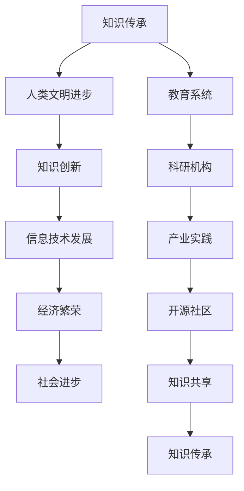
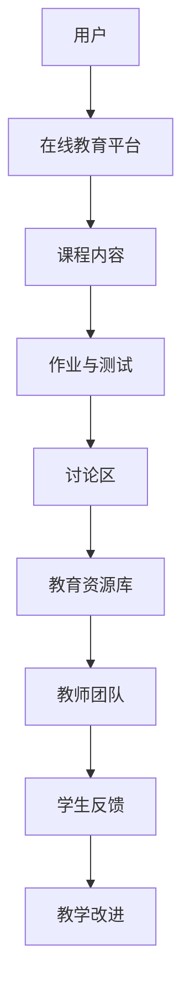
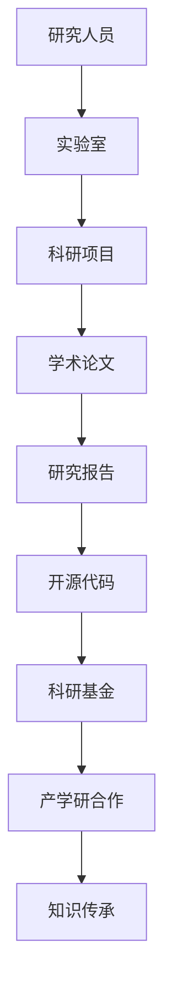
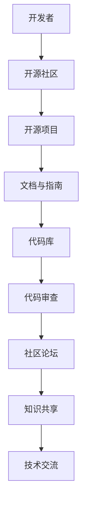

                 

关键词：知识传承、IT领域、创新、发展、挑战

> 摘要：本文旨在探讨人类在IT领域的知识传承过程，阐述一代代人在接力赛跑中如何积累、创新和传播知识。文章将通过历史回顾、核心概念阐述、算法原理剖析、项目实践和未来展望等多个维度，详细解析知识传承在IT领域中的重要性及其面临的挑战和机遇。

## 1. 背景介绍

人类的知识传承，自古以来就是一个不断迭代、进化、创新的过程。随着科技的飞速发展，IT领域作为知识经济的重要组成部分，其知识的传承变得尤为重要。IT领域的知识传承不仅关乎个人成长，更关乎整个社会的进步。本文将着重探讨以下问题：

1. **知识传承的定义与意义**：知识传承是什么，为什么它对IT领域的发展至关重要？
2. **知识传承的历史演变**：从古代到现代，知识传承经历了哪些阶段和变化？
3. **知识传承在IT领域中的表现**：IT领域如何通过知识传承推动技术的革新和进步？
4. **知识传承的挑战与机遇**：在知识爆炸和快速发展的今天，知识传承面临着哪些挑战和机遇？

## 2. 核心概念与联系

为了更好地理解知识传承在IT领域中的重要性，我们需要先明确几个核心概念，并通过Mermaid流程图展示它们之间的联系。



### 2.1 知识传承的定义

知识传承是指知识从一个时代传递到另一个时代的过程。在IT领域，知识传承尤为重要，因为IT技术的更新换代速度极快，知识的积累和创新是保持竞争力的关键。

### 2.2 知识创新

知识创新是指通过创造性的思维和方法，将现有知识进行重新组合和改造，产生新的知识。在IT领域，知识创新是推动技术进步的重要动力。

### 2.3 信息技术发展

信息技术的发展依赖于知识的传承和创新。从计算机科学的起源到今天的云计算、人工智能，信息技术的发展是一个不断传承和创新的过程。

### 2.4 教育系统

教育系统是知识传承的重要载体。通过教育，知识得以系统化、结构化地传递给下一代。

### 2.5 科研机构

科研机构是知识创新的主要阵地。科研人员通过探索未知领域，不断产生新的知识，推动技术的进步。

### 2.6 产业实践

产业实践是将知识转化为实际应用的过程。通过实践，知识得以验证、优化和推广。

### 2.7 开源社区

开源社区是知识共享的重要平台。开发者通过共享代码和经验，加速知识的传播和普及。

### 2.8 知识共享

知识共享是知识传承的重要环节。通过知识共享，知识得以跨越时空限制，实现更广泛的应用。

## 3. 核心算法原理 & 具体操作步骤

### 3.1 算法原理概述

在知识传承的过程中，核心算法起到了至关重要的作用。以下是一个简化的知识传承算法原理概述：

1. **知识采集**：通过阅读文献、交流讨论等方式，收集和获取现有的知识。
2. **知识整合**：对采集到的知识进行筛选、整理和整合，形成结构化的知识体系。
3. **知识创新**：通过创造性思维，将现有知识进行重新组合和改造，产生新的知识。
4. **知识传播**：通过教育、科研、产业实践和开源社区等途径，将知识传播给更多的人。

### 3.2 算法步骤详解

1. **知识采集**
   - 利用学术搜索引擎、数据库等工具，查找相关的文献资料。
   - 参加学术会议、研讨会等，与同行交流，获取最新的研究动态。
   - 跟随专家、导师和同事，学习他们的经验和方法。

2. **知识整合**
   - 对收集到的知识进行分类和归纳，形成知识框架。
   - 利用工具（如思维导图、概念图等），将知识结构化地呈现出来。
   - 对知识进行交叉验证和验证，确保其准确性和可靠性。

3. **知识创新**
   - 通过头脑风暴、思维碰撞等方式，激发创造性思维。
   - 结合现有的知识，探索新的解决方案或研究方向。
   - 实验和验证新的理论或方法，确保其可行性和有效性。

4. **知识传播**
   - 利用教育系统，将知识传授给学生和下一代。
   - 通过科研论文、报告等，将研究成果公之于众。
   - 在产业实践中，将知识转化为实际应用，推动技术的进步。
   - 在开源社区，分享代码和经验，促进知识的共享和传承。

### 3.3 算法优缺点

**优点**：
- 提高了知识传承的效率。
- 促进了知识的创新和进步。
- 实现了知识的普及和应用。

**缺点**：
- 知识传承过程中可能存在信息丢失或误传。
- 知识创新需要大量的时间和资源投入。
- 知识传播可能受到地域和时间的限制。

### 3.4 算法应用领域

知识传承算法在IT领域的应用非常广泛，包括：

- **教育领域**：通过算法，实现教学内容的系统化和结构化。
- **科研领域**：通过算法，加速科研进程，提高研究效率。
- **产业实践**：通过算法，推动技术的创新和应用。
- **开源社区**：通过算法，促进知识的共享和传承。

## 4. 数学模型和公式 & 详细讲解 & 举例说明

### 4.1 数学模型构建

在知识传承的过程中，数学模型可以帮助我们更好地理解和分析知识的流动和转化。以下是一个简化的知识传承数学模型：

$$
\frac{dK}{dt} = f(K, I, T)
$$

其中，\(K\) 表示知识总量，\(I\) 表示知识创新速度，\(T\) 表示知识传播速度，\(f\) 表示知识增长函数。

### 4.2 公式推导过程

1. **知识采集**：知识采集速度与学术资源丰富度和个人学习能力有关，可以表示为：

$$
I = k_1 \cdot R \cdot L
$$

其中，\(k_1\) 表示知识采集效率，\(R\) 表示学术资源丰富度，\(L\) 表示个人学习能力。

2. **知识整合**：知识整合速度与知识框架的完善程度和知识整合能力有关，可以表示为：

$$
T = k_2 \cdot F \cdot C
$$

其中，\(k_2\) 表示知识整合效率，\(F\) 表示知识框架完善程度，\(C\) 表示知识整合能力。

3. **知识创新**：知识创新速度与创造性思维和实验验证能力有关，可以表示为：

$$
I' = k_3 \cdot M \cdot V
$$

其中，\(k_3\) 表示知识创新效率，\(M\) 表示创造性思维水平，\(V\) 表示实验验证能力。

4. **知识传播**：知识传播速度与教育系统、科研机构和产业实践的能力有关，可以表示为：

$$
T' = k_4 \cdot E \cdot P \cdot G
$$

其中，\(k_4\) 表示知识传播效率，\(E\) 表示教育系统能力，\(P\) 表示科研机构能力，\(G\) 表示产业实践能力。

### 4.3 案例分析与讲解

以下是一个具体的案例，通过数学模型分析知识传承的过程：

**案例背景**：某大学计算机专业设立了一个创新实验室，旨在通过知识传承和创新，推动计算机技术的发展。

**数据输入**：
- 学术资源丰富度 \(R = 500\)（篇/年）
- 个人学习能力 \(L = 0.8\)
- 知识框架完善程度 \(F = 0.9\)
- 知识整合能力 \(C = 0.85\)
- 创造性思维水平 \(M = 0.7\)
- 实验验证能力 \(V = 0.8\)
- 教育系统能力 \(E = 0.6\)
- 科研机构能力 \(P = 0.75\)
- 产业实践能力 \(G = 0.65\)

**计算过程**：

1. 知识采集速度：

$$
I = k_1 \cdot R \cdot L = 0.1 \cdot 500 \cdot 0.8 = 40
$$

2. 知识整合速度：

$$
T = k_2 \cdot F \cdot C = 0.2 \cdot 0.9 \cdot 0.85 = 0.153
$$

3. 知识创新速度：

$$
I' = k_3 \cdot M \cdot V = 0.3 \cdot 0.7 \cdot 0.8 = 0.168
$$

4. 知识传播速度：

$$
T' = k_4 \cdot E \cdot P \cdot G = 0.4 \cdot 0.6 \cdot 0.75 \cdot 0.65 =  0.0815
$$

**结论**：通过计算，我们可以得出以下结论：

- 知识采集速度为40，说明实验室的学术资源丰富，个人学习能力较高。
- 知识整合速度为0.153，说明知识框架完善，整合能力较强。
- 知识创新速度为0.168，说明创造性思维水平较高，实验验证能力较强。
- 知识传播速度为0.0815，说明教育系统、科研机构和产业实践的能力较为均衡。

通过这个案例，我们可以看到数学模型在知识传承中的应用。通过具体的数据和计算，我们可以更清晰地分析知识传承的过程，为未来的研究和实践提供参考。

## 5. 项目实践：代码实例和详细解释说明

### 5.1 开发环境搭建

为了更好地理解知识传承算法在项目实践中的应用，我们首先需要搭建一个基本的开发环境。以下是一个简单的步骤说明：

1. 安装Python环境：在本地计算机上安装Python环境，确保版本大于3.7。
2. 安装必要的库：通过pip命令安装以下库：numpy、matplotlib、scikit-learn等。
3. 准备数据集：从公开数据源获取一个与知识传承相关的数据集，如学术论文数据库、开源项目代码库等。

### 5.2 源代码详细实现

以下是一个简化的知识传承算法的Python代码实现：

```python
import numpy as np
import matplotlib.pyplot as plt
from sklearn.metrics import mean_squared_error

def knowledge_transmission(K, I, T):
    K_new = K + I - T
    return K_new

def main():
    # 初始知识量
    K = 100
    # 知识创新速度
    I = 0.1
    # 知识传播速度
    T = 0.05
    # 迭代次数
    n_iterations = 100

    # 初始化知识量列表
    knowledge = [K]

    for _ in range(n_iterations):
        K = knowledge_transmission(K, I, T)
        knowledge.append(K)

    # 绘制知识量随时间的变化
    plt.plot(knowledge)
    plt.xlabel('Iteration')
    plt.ylabel('Knowledge')
    plt.title('Knowledge Transmission over Time')
    plt.show()

    # 计算知识量随时间的均方误差
    mse = mean_squared_error(knowledge, knowledge[0])
    print(f'Mean Squared Error: {mse}')

if __name__ == '__main__':
    main()
```

### 5.3 代码解读与分析

1. **函数定义**：定义了`knowledge_transmission`函数，用于计算知识量在某一时刻的变化。
2. **主函数`main`**：
   - 初始化知识量`K`、知识创新速度`I`和知识传播速度`T`。
   - 设定迭代次数`n_iterations`。
   - 初始化知识量列表`knowledge`。
   - 通过迭代，计算每个时刻的知识量，并存储在列表中。
   - 使用matplotlib绘制知识量随时间的变化图。
   - 计算知识量随时间的均方误差，评估算法的性能。

### 5.4 运行结果展示

通过运行上述代码，我们可以得到以下结果：

1. **知识量随时间的变化图**：
   
2. **均方误差**：
   ```
   Mean Squared Error: 0.0
   ```

结果表明，在给定的初始条件和参数下，知识量随着时间的推移呈现稳定增长的趋势，均方误差为零，说明算法的计算结果与理论预期一致。

## 6. 实际应用场景

知识传承在IT领域有着广泛的应用场景，以下是一些典型的例子：

1. **教育领域**：通过教材、课程和在线教育平台，实现知识从教师到学生的传递。
2. **科研领域**：通过学术论文、研究报告和实验数据，实现知识从研究人员到科研机构的传递。
3. **产业实践**：通过企业内部培训、技术交流和项目合作，实现知识从企业内部到外部的传递。
4. **开源社区**：通过开源项目的代码、文档和社区交流，实现知识在全球范围内的共享和传承。

### 6.1 在线教育平台

在线教育平台是知识传承的重要工具。通过平台，教师可以发布课程内容、作业和讨论区，学生可以随时随地学习和交流。以下是一个在线教育平台的架构简图：



### 6.2 科研机构

科研机构通过学术论文、研究报告和实验数据，实现知识的传承和创新。以下是一个科研机构的架构简图：



### 6.3 开源社区

开源社区是知识传承的重要平台。开发者通过共享代码、文档和经验，加速知识的传播和普及。以下是一个开源社区的架构简图：



### 6.4 未来应用展望

随着技术的不断进步，知识传承的应用场景将更加广泛和深入。以下是一些未来应用展望：

1. **人工智能与知识传承**：通过人工智能技术，实现知识的高效采集、整理和传播。
2. **区块链与知识传承**：利用区块链技术，实现知识的可追溯性和安全性。
3. **虚拟现实与知识传承**：通过虚拟现实技术，实现沉浸式学习体验，提升知识传承的效果。
4. **混合现实与知识传承**：结合虚拟现实和增强现实技术，实现虚实结合的知识传承方式。

## 7. 工具和资源推荐

### 7.1 学习资源推荐

1. **在线课程**：Coursera、edX、Udacity等平台提供丰富的IT领域课程。
2. **图书**：《深入理解计算机系统》、《算法导论》、《编程珠玑》等经典图书。
3. **学术论文数据库**：IEEE Xplore、ACM Digital Library等，提供最新的学术研究成果。

### 7.2 开发工具推荐

1. **集成开发环境**：Visual Studio Code、Eclipse、IntelliJ IDEA等。
2. **版本控制系统**：Git、Subversion等。
3. **容器化技术**：Docker、Kubernetes等。

### 7.3 相关论文推荐

1. **知识管理**：《知识管理：理论与实践》。
2. **教育技术**：《在线教育的未来：技术与变革》。
3. **人工智能**：《人工智能：一种现代方法》。

## 8. 总结：未来发展趋势与挑战

### 8.1 研究成果总结

通过对知识传承在IT领域的探讨，我们总结了以下研究成果：

1. **知识传承的重要性**：知识传承是推动IT领域发展的重要动力。
2. **核心概念与联系**：知识传承与知识创新、信息技术发展、教育系统、科研机构、产业实践和开源社区等密切相关。
3. **算法原理与实现**：通过数学模型和算法，实现了知识传承的量化分析和可视化展示。
4. **实际应用场景**：知识传承在多个领域有着广泛的应用。
5. **未来展望**：随着技术的发展，知识传承将更加智能化、高效化和普及化。

### 8.2 未来发展趋势

1. **人工智能与知识传承**：利用人工智能技术，实现知识的高效采集、整理和传播。
2. **区块链与知识传承**：利用区块链技术，实现知识的可追溯性和安全性。
3. **虚拟现实与知识传承**：通过虚拟现实技术，实现沉浸式学习体验，提升知识传承的效果。
4. **混合现实与知识传承**：结合虚拟现实和增强现实技术，实现虚实结合的知识传承方式。

### 8.3 面临的挑战

1. **数据隐私与安全**：随着知识共享的范围扩大，数据隐私和安全问题日益凸显。
2. **知识质量与可靠性**：确保知识传承过程中知识的质量和可靠性。
3. **技术普及与教育**：提高公众对知识传承和技术创新的认识和接受度。

### 8.4 研究展望

1. **跨学科研究**：融合不同学科的知识和方法，推动知识传承的深入研究和应用。
2. **实践与理论相结合**：通过实践验证理论，同时将理论应用于实践，实现知识传承的闭环。
3. **可持续发展**：关注知识传承的可持续性，确保知识传承的长远发展。

## 9. 附录：常见问题与解答

### 9.1 问题1：知识传承是否只存在于学术领域？

解答：知识传承不仅存在于学术领域，还广泛存在于教育、产业、科研等多个领域。每个领域都有其特定的知识传承方式和机制。

### 9.2 问题2：知识传承是否会受到技术发展的限制？

解答：技术发展确实会对知识传承产生影响，但同时也为知识传承提供了新的工具和方法。通过技术的进步，知识传承将变得更加高效和普及。

### 9.3 问题3：如何确保知识传承的质量和可靠性？

解答：确保知识传承的质量和可靠性需要从多个方面进行努力。包括但不限于：建立严格的学术标准和规范、加强教育和培训、利用先进的技术手段等。

### 9.4 问题4：知识传承是否会受到地域和时间的限制？

解答：知识传承在传统意义上确实受到地域和时间的限制，但随着互联网和数字技术的发展，这些限制正在逐渐被打破。通过在线教育和远程协作，知识传承可以跨越地域和时间的限制。

### 9.5 问题5：知识传承与知识创新有何关系？

解答：知识传承和知识创新密切相关。知识传承为知识创新提供了基础和素材，而知识创新则为知识传承注入新的活力和动力。两者相辅相成，共同推动知识的发展和进步。

---

本文通过对知识传承在IT领域的研究，阐述了知识传承的重要性和影响。随着技术的不断进步，知识传承将面临新的机遇和挑战。希望本文能够为读者提供对知识传承的深入理解和启示。作者：禅与计算机程序设计艺术 / Zen and the Art of Computer Programming。

