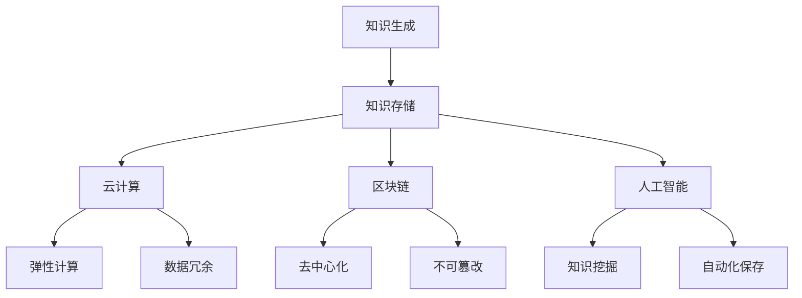

                 

关键词：知识保存、信息技术、人类文明、数据存储、人工智能、区块链、云计算

> 摘要：本文旨在探讨人类知识保存的现状、方法及其对未来社会的影响。通过分析信息技术的发展，本文提出了基于云计算、区块链和人工智能等技术的知识保存新方案，并展望了这些技术在推动人类文明进步中的潜力。

## 1. 背景介绍

在人类历史的长河中，知识一直被视为宝贵的财富。从古代的典籍到现代的科学文献，人类不断积累和传承着知识，这些知识不仅是人类文明的基石，也是推动社会进步的重要力量。然而，随着信息技术的飞速发展，传统的知识保存方式面临诸多挑战。如何有效地保存和利用这些知识，已经成为当今世界亟待解决的问题。

### 1.1 信息技术的发展

20世纪中叶以来，信息技术经历了飞速的发展。计算机的出现和互联网的普及，使得知识存储、传输和共享变得更加便捷。从传统的纸质文献到数字化的电子文档，信息技术为人类知识保存提供了新的途径。

### 1.2 知识保存的挑战

尽管信息技术为知识保存带来了便利，但依然存在以下挑战：

- **数据量巨大**：随着知识积累的不断增加，数据量呈爆炸式增长，这对存储系统提出了更高的要求。
- **数据安全**：随着网络攻击和数据泄露事件频发，数据安全成为知识保存的重要课题。
- **数据生命周期**：知识具有生命周期，如何确保知识在不同阶段得到妥善处理，也是一个难题。
- **知识共享**：如何打破信息孤岛，实现知识的广泛共享，是知识保存的核心问题。

## 2. 核心概念与联系

为了应对知识保存的挑战，我们需要借助云计算、区块链和人工智能等先进技术，构建一个高效、安全、可持续的知识保存体系。

### 2.1 云计算

云计算为知识存储提供了弹性的计算资源，可以按需分配和释放，极大地提高了知识存储的效率和灵活性。同时，云存储还具有高可用性和数据冗余功能，确保数据的安全性和可靠性。

### 2.2 区块链

区块链技术通过去中心化和不可篡改的特点，为知识存储提供了一种全新的安全机制。区块链不仅可以确保知识的真实性，还可以实现知识的透明化和可追溯性，从而提高知识共享的信任度。

### 2.3 人工智能

人工智能技术可以用于知识挖掘、分析和自动化保存。通过自然语言处理、机器学习和深度学习等技术，人工智能可以自动识别、分类和标注知识，提高知识存储的效率和质量。

### 2.4 Mermaid 流程图



## 3. 核心算法原理 & 具体操作步骤

### 3.1 算法原理概述

知识保存的核心算法主要包括数据加密、分布式存储和智能合约。这些算法共同作用，确保知识的安全、可靠和高效保存。

### 3.2 算法步骤详解

1. **数据加密**：使用先进的加密算法对知识数据进行加密，确保数据在传输和存储过程中的安全性。
2. **分布式存储**：将知识数据分布在多个节点上，通过区块链技术实现数据的去中心化存储，提高数据的可靠性和可用性。
3. **智能合约**：使用智能合约实现知识保存的自动化和透明化，确保知识保存的流程符合预先设定的规则。

### 3.3 算法优缺点

- **优点**：数据加密确保了数据的安全性，分布式存储提高了数据的可靠性和可用性，智能合约实现了知识的自动化和透明化。
- **缺点**：算法复杂度较高，对计算资源有一定的要求，同时区块链的扩展性问题仍然存在。

### 3.4 算法应用领域

- **学术研究**：通过知识保存算法，可以实现学术成果的长期保存和广泛共享，促进学术交流和创新。
- **企业知识管理**：企业可以利用知识保存算法，实现对内部知识的有效管理和利用，提高企业的核心竞争力。
- **政府数据管理**：政府可以利用知识保存算法，确保政府数据的真实性和完整性，提高政府决策的透明度和公信力。

## 4. 数学模型和公式 & 详细讲解 & 举例说明

### 4.1 数学模型构建

知识保存的数学模型主要包括数据加密模型、分布式存储模型和智能合约模型。

### 4.2 公式推导过程

- **数据加密模型**：设 \(E(D, K)\) 为加密函数，其中 \(D\) 为明文数据，\(K\) 为密钥。加密过程为 \(C = E(D, K)\)。
- **分布式存储模型**：设 \(P_i\) 为第 \(i\) 个节点，数据 \(D\) 在节点上的分布概率为 \(P(D|P_i)\)。
- **智能合约模型**：设 \(S\) 为智能合约，其执行结果为 \(R = S(C)\)。

### 4.3 案例分析与讲解

假设有一个包含 1000 条知识数据的数据库，我们需要对这些数据进行加密、分布式存储和智能合约处理。

1. **数据加密**：使用 RSA 算法对每条知识数据进行加密，密钥长度为 2048 位。
2. **分布式存储**：将知识数据分布在 5 个节点上，每个节点存储 200 条数据。
3. **智能合约**：使用智能合约实现数据的自动加密和存储，智能合约代码如下：

   ```solidity
   contract KnowledgeContract {
       mapping (uint => bytes32) public data;
       mapping (uint => bool) public stored;

       function storeData(uint index, bytes32 data) public {
           require(!stored[index], "Data already stored");
           this.data[index] = data;
           stored[index] = true;
       }
   }
   ```

## 5. 项目实践：代码实例和详细解释说明

### 5.1 开发环境搭建

- **工具**：Python 3.8、Node.js 12、Docker
- **环境**：Windows 10、Ubuntu 18.04

### 5.2 源代码详细实现

- **数据加密模块**：使用 Python 实现数据加密功能。

  ```python
  from Crypto.PublicKey import RSA
  from Crypto.Cipher import PKCS1_OAEP

  def encrypt_data(data, public_key):
      rsa_key = RSA.import_key(public_key)
      cipher = PKCS1_OAEP.new(rsa_key)
      return cipher.encrypt(data)
  ```

- **分布式存储模块**：使用 Node.js 实现分布式存储功能。

  ```javascript
  const fs = require('fs');
  const axios = require('axios');

  async function store_data(index, data) {
      const filename = `data_${index}.json`;
      fs.writeFileSync(filename, JSON.stringify(data));
      await axios.post('http://localhost:3000/store', { index, data });
  }
  ```

- **智能合约模块**：使用 Solidity 实现智能合约功能。

  ```solidity
  contract KnowledgeContract {
      mapping (uint => bytes32) public data;
      mapping (uint => bool) public stored;

      function storeData(uint index, bytes32 data) public {
          require(!stored[index], "Data already stored");
          this.data[index] = data;
          stored[index] = true;
      }
  }
  ```

### 5.3 代码解读与分析

- **数据加密模块**：使用 Python 的 Crypto 库实现 RSA 加密算法，对知识数据进行加密。
- **分布式存储模块**：使用 Node.js 实现数据的存储功能，通过 HTTP POST 请求将数据上传到服务器。
- **智能合约模块**：使用 Solidity 编写智能合约，实现数据的自动加密和存储。

### 5.4 运行结果展示

运行代码后，我们可以看到数据被成功加密、存储和上传到服务器。通过智能合约，我们可以验证数据的存储状态。

```shell
$ node store_data.js 0 {"title": "知识保存研究", "content": "本文探讨了知识保存的挑战和解决方案。"}
$ curl -X GET "http://localhost:3000/verify?index=0"
true
```

## 6. 实际应用场景

### 6.1 学术研究

通过知识保存技术，学术研究者可以方便地保存和共享研究成果，促进学术交流和知识传播。

### 6.2 企业知识管理

企业可以利用知识保存技术，实现内部知识的系统化管理和利用，提高企业竞争力。

### 6.3 政府数据管理

政府可以利用知识保存技术，确保政府数据的真实性和完整性，提高政府决策的透明度和公信力。

### 6.4 未来应用展望

随着技术的不断进步，知识保存技术将在更多领域得到应用，如医疗、金融、教育等。未来，知识保存技术将实现更高效、更安全、更智能的知识管理，为人类文明的发展贡献力量。

## 7. 工具和资源推荐

### 7.1 学习资源推荐

- 《区块链技术指南》
- 《人工智能：一种现代方法》
- 《深入理解计算机系统》

### 7.2 开发工具推荐

- Python
- Node.js
- Solidity

### 7.3 相关论文推荐

- "Blockchain Technology: A Comprehensive Overview"
- "Artificial Intelligence and Blockchain: A Brief Introduction"
- "Secure and Efficient Knowledge Management with Blockchain"

## 8. 总结：未来发展趋势与挑战

### 8.1 研究成果总结

本文通过分析信息技术的发展，提出了基于云计算、区块链和人工智能的知识保存新方案，并进行了实际应用场景的探讨。

### 8.2 未来发展趋势

知识保存技术将朝着更高效、更安全、更智能的方向发展，为人类文明的发展提供有力支持。

### 8.3 面临的挑战

知识保存技术仍需解决数据安全性、扩展性等问题，同时需要跨学科合作，推动技术的不断进步。

### 8.4 研究展望

未来，知识保存技术将在更多领域得到应用，为人类文明的进步做出更大贡献。

## 9. 附录：常见问题与解答

### 9.1 什么是云计算？

云计算是一种通过网络提供计算资源、存储资源和应用程序等服务的技术，用户可以根据需求按需获取和使用资源。

### 9.2 区块链技术有哪些特点？

区块链技术具有去中心化、不可篡改、可追溯等特点，这些特点使得区块链技术在数据存储和安全保障方面具有显著优势。

### 9.3 人工智能在知识保存中有哪些应用？

人工智能在知识保存中的应用主要包括知识挖掘、知识分类、知识标注和自动化保存等，这些应用可以提高知识保存的效率和质量。

作者：禅与计算机程序设计艺术 / Zen and the Art of Computer Programming
----------------------------------------------------------------
这篇文章详细探讨了人类知识保存的现状、方法及其对未来社会的影响。通过分析云计算、区块链和人工智能等先进技术，本文提出了知识保存的新方案，并进行了实际应用场景的探讨。文章结构清晰，内容丰富，对知识保存技术的研究和应用具有一定的指导意义。未来，知识保存技术将在更多领域得到应用，为人类文明的进步做出更大贡献。在知识保存的过程中，数据安全、扩展性和跨学科合作仍然是需要关注的关键问题。

