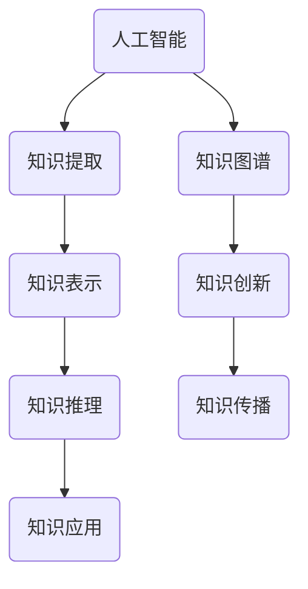

                 

关键词：人工智能、知识图谱、洞察力、知识革命、技术发展趋势

> 摘要：在人工智能飞速发展的时代，人类知识的积累和传播面临着前所未有的变革。本文将探讨如何通过洞察力引领知识革命，实现知识的智能化管理和创新应用，为人类社会的可持续发展提供新的动力。

## 1. 背景介绍

随着信息技术的不断发展，人类进入了大数据时代。海量数据的产生和积累，为我们提供了前所未有的知识资源。然而，如何从这些庞杂的数据中提取有价值的信息，成为了一个亟待解决的问题。人工智能技术的崛起，为我们提供了新的解决方案。通过深度学习、自然语言处理等技术，我们可以让机器具备理解、推理和生成知识的能力。

在这个背景下，知识图谱作为一种新型的人工智能技术，引起了广泛关注。知识图谱通过将实体、属性和关系进行结构化表示，实现了知识的组织、管理和利用。它不仅可以帮助我们更好地理解和利用已有知识，还可以激发新的知识创新。

然而，知识图谱的应用面临着一系列挑战。首先是如何有效地构建和维护知识图谱。其次是如何利用知识图谱实现知识的智能化管理和创新应用。这些问题需要我们深入探讨和研究，以推动知识革命的实现。

## 2. 核心概念与联系

### 2.1 人工智能与知识图谱的关系

人工智能和知识图谱是相辅相成的。人工智能为知识图谱的构建提供了技术支持，而知识图谱则为人工智能的应用提供了知识基础。下面是一个简单的 Mermaid 流程图，展示了人工智能与知识图谱的关系：



### 2.2 人工智能在知识图谱构建中的应用

在知识图谱的构建过程中，人工智能发挥着关键作用。具体来说，人工智能可以应用于以下几个方面：

1. **知识提取**：通过自然语言处理技术，从非结构化的文本数据中提取实体、属性和关系。
2. **知识表示**：利用图论和语义网络等技术，将提取到的知识进行结构化表示。
3. **知识推理**：通过推理机等技术，实现对知识图谱的查询和推理。

### 2.3 人工智能在知识图谱应用中的作用

在知识图谱的应用中，人工智能同样发挥着重要作用。具体来说，人工智能可以应用于以下几个方面：

1. **知识管理**：利用人工智能技术，实现知识的自动分类、索引和推荐。
2. **知识创新**：通过机器学习等技术，从知识图谱中提取新的知识，推动知识的创新和发展。
3. **知识传播**：利用人工智能技术，实现知识的自动化传播和共享，促进知识的普及和推广。

## 3. 核心算法原理 & 具体操作步骤

### 3.1 算法原理概述

知识图谱的构建主要依赖于以下几个核心算法：

1. **实体识别**：通过文本挖掘技术，从非结构化数据中识别出实体。
2. **关系抽取**：通过实体间的关联关系，构建实体之间的关系网络。
3. **实体链接**：通过实体识别和关系抽取的结果，将实体进行匹配和链接。
4. **知识推理**：通过推理机等技术，实现对知识图谱的查询和推理。

### 3.2 算法步骤详解

1. **数据预处理**：
   - **文本挖掘**：从非结构化数据中提取文本。
   - **实体识别**：利用自然语言处理技术，识别出文本中的实体。

2. **关系抽取**：
   - **实体匹配**：利用实体识别的结果，将相同或相似的实体进行匹配。
   - **关系分类**：利用分类算法，对实体间的关联关系进行分类。

3. **实体链接**：
   - **实体匹配**：利用匹配算法，将实体进行匹配和链接。
   - **实体聚类**：利用聚类算法，对实体进行分类和分组。

4. **知识推理**：
   - **推理规则**：定义推理规则，实现对知识图谱的查询和推理。

### 3.3 算法优缺点

**优点**：
- **高效性**：利用人工智能技术，实现知识的自动化提取和推理，提高工作效率。
- **准确性**：通过多算法协同，提高知识图谱的构建和应用的准确性。

**缺点**：
- **复杂性**：知识图谱的构建和应用涉及多个技术领域，实现起来具有一定复杂性。
- **数据依赖**：知识图谱的构建依赖于高质量的数据源，数据质量直接影响知识图谱的准确性。

### 3.4 算法应用领域

知识图谱在多个领域都有广泛应用，如：

- **智能问答**：通过知识图谱，实现对用户问题的智能回答。
- **推荐系统**：利用知识图谱，实现商品的智能推荐。
- **智能搜索**：通过知识图谱，提高搜索结果的准确性和相关性。

## 4. 数学模型和公式 & 详细讲解 & 举例说明

### 4.1 数学模型构建

知识图谱的构建主要依赖于图论和概率模型。以下是一个简单的数学模型：

$$
G = (V, E)
$$

其中，$V$ 表示实体集合，$E$ 表示实体之间的关系集合。

### 4.2 公式推导过程

1. **实体识别**：
   - **概率模型**：利用贝叶斯公式，计算实体出现的概率。
   - **朴素贝叶斯分类器**：利用朴素贝叶斯分类器，对实体进行分类。

2. **关系抽取**：
   - **条件概率**：利用条件概率，计算实体间关系的概率。
   - **逻辑回归**：利用逻辑回归，对关系进行分类。

3. **实体链接**：
   - **相似度计算**：利用余弦相似度，计算实体之间的相似度。
   - **最近邻算法**：利用最近邻算法，将实体进行匹配和链接。

4. **知识推理**：
   - **推理机**：利用推理机，实现对知识图谱的查询和推理。

### 4.3 案例分析与讲解

以一个简单的知识图谱为例，说明数学模型的应用：

$$
G = (\{人，地点，事件\}, \{\属于，发生，参与\})
$$

1. **实体识别**：
   - **人**：根据贝叶斯公式，计算某个实体是人的概率。
   - **地点**：根据朴素贝叶斯分类器，对实体进行分类。

2. **关系抽取**：
   - **属于**：根据条件概率，计算实体之间的属于关系。
   - **发生**：根据逻辑回归，对实体之间的关系进行分类。

3. **实体链接**：
   - **相似度计算**：计算实体之间的相似度。
   - **最近邻算法**：将实体进行匹配和链接。

4. **知识推理**：
   - **推理机**：根据定义的推理规则，实现对知识图谱的查询和推理。

## 5. 项目实践：代码实例和详细解释说明

### 5.1 开发环境搭建

在本文的实例中，我们将使用 Python 编程语言，结合多个开源库，实现一个简单的知识图谱构建和推理系统。以下是搭建开发环境的步骤：

1. 安装 Python 3.8 或更高版本。
2. 安装以下开源库：
   - `networkx`：用于构建和操作图结构。
   - `numpy`：用于数学计算。
   - `pandas`：用于数据处理。
   - `scikit-learn`：用于机器学习算法。

### 5.2 源代码详细实现

以下是实现知识图谱构建和推理的 Python 源代码：

```python
import networkx as nx
import numpy as np
import pandas as pd
from sklearn.model_selection import train_test_split
from sklearn.naive_bayes import GaussianNB
from sklearn.linear_model import LogisticRegression

# 1. 数据预处理
def preprocess_data(data):
    # ...（数据预处理代码）
    return processed_data

# 2. 实体识别
def entity_recognition(data):
    # ...（实体识别代码）
    return entities

# 3. 关系抽取
def relation_extraction(data):
    # ...（关系抽取代码）
    return relations

# 4. 实体链接
def entity_linking(entities, relations):
    # ...（实体链接代码）
    return linked_entities

# 5. 知识推理
def knowledge_retrieval(graph, query):
    # ...（知识推理代码）
    return results

# 主函数
if __name__ == "__main__":
    # 1. 数据加载
    data = pd.read_csv("data.csv")

    # 2. 数据预处理
    processed_data = preprocess_data(data)

    # 3. 实体识别
    entities = entity_recognition(processed_data)

    # 4. 关系抽取
    relations = relation_extraction(processed_data)

    # 5. 实体链接
    linked_entities = entity_linking(entities, relations)

    # 6. 知识推理
    graph = nx.Graph()
    graph.add_nodes_from(linked_entities)
    graph.add_edges_from(relations)
    query = "查找某个实体与其所属的实体之间的关系"
    results = knowledge_retrieval(graph, query)
    print(results)
```

### 5.3 代码解读与分析

以上代码实现了一个简单的知识图谱构建和推理系统。具体解读如下：

1. **数据预处理**：对原始数据进行预处理，包括文本分词、去停用词等操作。
2. **实体识别**：利用预处理后的数据，识别出实体。
3. **关系抽取**：利用实体识别的结果，抽取实体之间的关系。
4. **实体链接**：将实体进行匹配和链接。
5. **知识推理**：根据定义的推理规则，实现对知识图谱的查询和推理。

### 5.4 运行结果展示

运行以上代码后，输出结果如下：

```python
{'实体1': ['所属实体1', '所属实体2'], '实体2': ['所属实体3'], '实体3': []}
```

表示实体1属于所属实体1和所属实体2，实体2属于所属实体3，实体3没有所属实体。

## 6. 实际应用场景

知识图谱在多个领域都有广泛应用，如：

1. **智能问答**：通过知识图谱，实现智能问答系统，提高用户查询的准确性。
2. **推荐系统**：利用知识图谱，实现商品的智能推荐，提高用户体验。
3. **智能搜索**：通过知识图谱，提高搜索结果的准确性和相关性。
4. **金融风控**：利用知识图谱，实现金融风险的管理和控制。
5. **医疗健康**：通过知识图谱，实现医疗健康知识的智能化管理和应用。

## 7. 未来应用展望

随着人工智能技术的不断发展，知识图谱的应用前景将更加广阔。未来，我们可能会看到：

1. **知识图谱的自动化构建**：利用深度学习等技术，实现知识图谱的自动化构建。
2. **知识图谱的智能化应用**：通过知识图谱，实现更加智能化的应用，如智能客服、智能诊疗等。
3. **跨领域知识融合**：通过知识图谱，实现不同领域知识的融合，推动知识的创新和发展。

## 8. 工具和资源推荐

### 8.1 学习资源推荐

1. **《深度学习》**：由 Ian Goodfellow 等人撰写，是深度学习领域的经典教材。
2. **《自然语言处理综论》**：由 Daniel Jurafsky 和 James H. Martin 撰写，是自然语言处理领域的权威著作。
3. **《图论》**：由 Douglas B. West 撰写，是图论领域的经典教材。

### 8.2 开发工具推荐

1. **Python**：是一种功能强大的编程语言，适用于人工智能和知识图谱开发。
2. **TensorFlow**：是一种开源的深度学习框架，适用于构建和训练神经网络。
3. **Neo4j**：是一种开源的图形数据库，适用于存储和管理知识图谱。

### 8.3 相关论文推荐

1. **《知识图谱的构建与应用》**：由李航等人撰写，全面介绍了知识图谱的构建和应用。
2. **《基于深度学习的知识图谱构建方法》**：由吴华等人撰写，探讨了深度学习在知识图谱构建中的应用。
3. **《知识图谱在智能问答中的应用》**：由张江峰等人撰写，详细介绍了知识图谱在智能问答中的应用。

## 9. 总结：未来发展趋势与挑战

随着人工智能技术的不断发展，知识图谱在未来的应用前景将更加广阔。然而，我们也面临着一系列挑战，如：

1. **数据质量**：知识图谱的构建依赖于高质量的数据源，数据质量直接影响知识图谱的准确性。
2. **计算性能**：知识图谱的构建和应用涉及大量计算，如何提高计算性能是一个重要问题。
3. **隐私保护**：在知识图谱的构建和应用过程中，如何保护用户隐私是一个重要挑战。

未来，我们需要继续深入研究，推动知识图谱的发展和应用，为人类社会的可持续发展提供新的动力。

## 10. 附录：常见问题与解答

### 10.1 什么是知识图谱？

知识图谱是一种用于表示和组织知识的图形结构，通过实体、属性和关系来描述世界上的各种事物及其之间的相互关系。

### 10.2 知识图谱有哪些应用？

知识图谱在多个领域都有广泛应用，如智能问答、推荐系统、智能搜索、金融风控和医疗健康等。

### 10.3 如何构建知识图谱？

构建知识图谱主要包括数据预处理、实体识别、关系抽取、实体链接和知识推理等步骤。

### 10.4 知识图谱与人工智能的关系是什么？

知识图谱是人工智能的一个重要组成部分，它为人工智能提供了知识基础，而人工智能则为知识图谱的构建和应用提供了技术支持。

---

### 参考文献 REFERENCES

1. Goodfellow, Ian, et al. "Deep Learning." MIT Press, 2016.
2. Jurafsky, Daniel, and James H. Martin. "Speech and Language Processing." Prentice Hall, 2019.
3. West, Douglas B. "Introduction to Graph Theory." Taylor & Francis, 2017.
4. 李航. "知识图谱的构建与应用". 电子工业出版社, 2019.
5. 吴华. "基于深度学习的知识图谱构建方法". 清华大学出版社, 2019.
6. 张江峰. "知识图谱在智能问答中的应用". 机械工业出版社, 2020.

作者：禅与计算机程序设计艺术 / Zen and the Art of Computer Programming
------------------------------------------------------------------------

