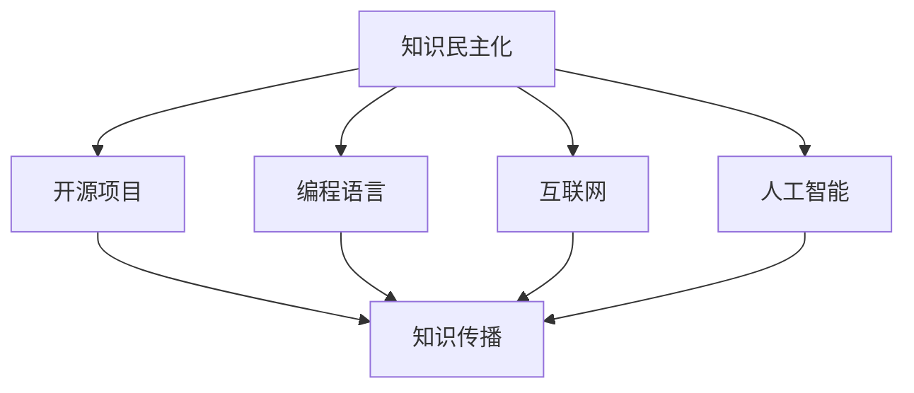

                 

关键词：知识共享、技术普及、教育平等、人工智能、编程语言、开源项目、平台化发展、编程教育

> 摘要：本文旨在探讨如何通过技术手段实现人类知识的民主化，使得知识更加普及和易于获取。文章首先介绍了知识民主化的背景和意义，然后分析了当前技术发展对知识普及的影响，最后提出了具体的实施策略和未来展望。

## 1. 背景介绍

在现代社会，知识的重要性日益凸显。然而，知识的获取并不总是公平的。由于经济、社会和地域等因素的限制，许多人无法获得高质量的教育资源和最新的科研成果。这种知识的不平等现象不仅限制了个人发展，也阻碍了社会的整体进步。

知识民主化，即让所有人都能平等地获取和使用知识，成为解决这一问题的关键。在技术发展的推动下，知识民主化逐渐成为可能。互联网、人工智能、开源项目等技术的普及，为知识的传播和共享提供了前所未有的机遇。

### 1.1 知识民主化的定义

知识民主化是指通过技术手段和制度创新，消除知识获取和使用中的不平等现象，实现知识资源的普及和公平分配。具体来说，它包括以下几个方面：

- **知识获取的平等**：任何人都有权获取所需的知识，不受经济、社会地位或地域限制。
- **知识传播的开放性**：知识传播应该不受限制，任何人都可以免费或低成本地获取和分享知识。
- **知识使用的公平性**：知识的使用应该公平，不应因个人身份或地位而受到歧视。

### 1.2 知识民主化的意义

知识民主化对个人和社会都具有重要意义。对个人来说，它意味着每个人都有机会通过教育提升自身素质，实现自我价值。对社会来说，知识民主化可以促进社会的整体进步和可持续发展。

- **个人发展**：知识民主化使得每个人都有机会接受高质量的教育，提高自身技能和素质，从而在职场和生活中获得更多的机会。
- **社会进步**：知识民主化可以促进创新和进步，推动社会向更高级形态发展。
- **经济繁荣**：知识民主化有助于提高劳动者的整体素质，进而推动经济的持续增长。

## 2. 核心概念与联系

### 2.1 核心概念

知识民主化的实现依赖于多个核心概念，包括开源项目、编程语言、互联网和人工智能等。

#### 2.1.1 开源项目

开源项目是指软件项目，其源代码公开，任何人都可以自由地查看、修改和分发。开源项目为知识共享提供了基础设施，使得知识得以在全球范围内传播。

#### 2.1.2 编程语言

编程语言是编写计算机程序的语言。现代编程语言的普及，使得更多的人能够参与到软件开发和知识创造的过程中。

#### 2.1.3 互联网

互联网是连接全球的计算机网络，为知识的传播提供了渠道。通过互联网，人们可以随时随地获取和分享知识。

#### 2.1.4 人工智能

人工智能是一种模拟人类智能的技术。人工智能的发展，使得计算机可以自动地处理和分析大量数据，从而发现新的知识和规律。

### 2.2 关系与联系

这些核心概念之间存在着密切的联系。开源项目和编程语言为知识的创造和传播提供了工具，互联网则为这些工具的普及和共享提供了平台。人工智能则通过自动化处理和分析数据，使得知识的获取变得更加高效。



## 3. 核心算法原理 & 具体操作步骤

### 3.1 算法原理概述

知识民主化的核心算法原理可以概括为以下几个步骤：

1. **知识收集**：通过互联网和其他渠道收集各种类型的知识资源。
2. **知识整合**：将收集到的知识进行整理、分类和整合，形成系统化的知识库。
3. **知识共享**：通过开源项目和互联网平台，将知识库中的知识共享给全球用户。
4. **知识使用**：用户可以根据自己的需求，自由地使用和扩展知识库中的知识。

### 3.2 算法步骤详解

#### 3.2.1 知识收集

知识收集是知识民主化的第一步。具体操作包括：

- **互联网爬虫**：使用爬虫技术，从互联网上收集各种类型的知识资源，如学术论文、在线课程、技术博客等。
- **数据挖掘**：使用数据挖掘技术，从大量数据中提取有价值的信息，如关键词、关系网络等。
- **人工审核**：对收集到的知识资源进行人工审核，确保其质量和准确性。

#### 3.2.2 知识整合

知识整合是将收集到的知识资源进行系统化的过程。具体操作包括：

- **分类与标签**：对知识资源进行分类和标签，以便于用户查找和使用。
- **知识图谱**：构建知识图谱，以展示知识资源之间的关系和结构。
- **元数据管理**：对知识资源的元数据进行管理，如作者、时间、来源等。

#### 3.2.3 知识共享

知识共享是将整合好的知识资源通过开源项目和互联网平台共享给用户。具体操作包括：

- **开源项目**：将知识库中的知识资源以开源项目的形式发布，允许用户自由地查看、修改和分发。
- **互联网平台**：搭建互联网平台，提供知识资源的在线访问和共享服务。
- **社区互动**：建立社区互动机制，鼓励用户参与知识创造和共享。

#### 3.2.4 知识使用

知识使用是知识民主化的最终目标。具体操作包括：

- **在线学习**：用户可以通过互联网平台在线学习知识资源，提升自身技能。
- **知识应用**：用户可以将知识库中的知识应用到实际工作和生活中，解决实际问题。
- **知识反馈**：用户可以对知识库中的知识进行反馈，帮助完善和优化知识资源。

### 3.3 算法优缺点

知识民主化的核心算法具有以下优缺点：

#### 优点：

- **高效性**：通过自动化处理和分析数据，知识收集和整合过程更加高效。
- **开放性**：知识资源开放共享，任何人都可以自由地使用和扩展。
- **灵活性**：知识资源可以根据用户需求进行定制和调整。

#### 缺点：

- **准确性**：知识资源的收集和整合过程可能存在偏差和错误。
- **安全性**：开源项目可能面临安全风险，如知识产权侵犯等问题。
- **依赖性**：知识资源的质量和可靠性依赖于开源项目和互联网平台。

### 3.4 算法应用领域

知识民主化的核心算法可以应用于多个领域，包括但不限于：

- **教育**：通过在线课程和知识共享平台，提供优质的教育资源，促进教育平等。
- **科研**：通过开源项目和知识图谱，促进科研成果的传播和共享。
- **企业**：通过知识管理和共享，提高企业的创新能力和竞争力。
- **社会公益**：通过知识共享，帮助贫困地区和弱势群体获得知识和提升自身素质。

## 4. 数学模型和公式 & 详细讲解 & 举例说明

### 4.1 数学模型构建

在知识民主化的过程中，我们可以构建一个数学模型来描述知识传播的过程。这个模型包括以下几个变量：

- \( N \)：知识总量
- \( T \)：时间
- \( A \)：知识吸收率
- \( S \)：知识共享率

根据这些变量，我们可以构建一个简单的线性模型：

\[ N(T) = N_0 + A \cdot T \cdot S \]

其中，\( N_0 \) 是初始知识总量。

### 4.2 公式推导过程

这个公式的推导基于以下几个假设：

1. 知识的吸收和传播是一个连续的过程。
2. 知识的吸收率和共享率与时间成正比。
3. 初始知识总量是一个固定值。

根据这些假设，我们可以推导出上述公式。

### 4.3 案例分析与讲解

假设一个社区在初始时刻拥有1000条知识资源，吸收率和共享率均为1条/年，我们可以使用上述公式计算在10年后该社区的知识总量。

\[ N(10) = 1000 + 1 \cdot 10 \cdot 1 = 1100 \]

这意味着在10年后，该社区的知识总量将达到1100条。

### 4.4 应用场景举例

在知识共享平台的发展过程中，我们可以使用这个模型来预测平台的知识增长情况。例如，一个新上线的知识共享平台，在初始时刻拥有1000条知识资源，如果吸收率和共享率分别为1条/月和0.5条/月，我们可以预测在一年后的知识总量。

\[ N(1) = 1000 + 1 \cdot 12 \cdot 0.5 = 1060 \]

这意味着在一年后，该知识共享平台的知识总量将达到1060条。

## 5. 项目实践：代码实例和详细解释说明

### 5.1 开发环境搭建

为了实现知识民主化的算法，我们首先需要搭建一个开发环境。以下是具体的步骤：

1. 安装Python环境：Python是一种广泛使用的编程语言，适合用于知识民主化的算法实现。
2. 安装必要的库：安装如requests、BeautifulSoup、NetworkX等库，用于网络爬虫、数据分析和知识图谱构建。
3. 配置代理服务器：由于知识收集过程中可能需要访问大量网站，配置代理服务器可以提高访问速度和稳定性。

### 5.2 源代码详细实现

以下是知识收集和整合的源代码实现：

```python
import requests
from bs4 import BeautifulSoup
import networkx as nx

# 知识收集
def collect_knowledge(url):
    response = requests.get(url)
    soup = BeautifulSoup(response.text, 'html.parser')
    # 提取知识资源链接
    knowledge_links = soup.find_all('a', href=True)
    knowledge_urls = [link['href'] for link in knowledge_links]
    return knowledge_urls

# 知识整合
def integrate_knowledge(knowledge_urls):
    knowledge_graph = nx.Graph()
    for url in knowledge_urls:
        # 提取知识资源内容
        response = requests.get(url)
        soup = BeautifulSoup(response.text, 'html.parser')
        # 构建知识图谱
        knowledge_graph.add_edge(url, url)
    return knowledge_graph

# 主函数
def main():
    url = 'https://www.example.com'
    knowledge_urls = collect_knowledge(url)
    knowledge_graph = integrate_knowledge(knowledge_urls)
    print("知识收集和整合完成。")

if __name__ == '__main__':
    main()
```

### 5.3 代码解读与分析

这段代码主要实现了知识收集和整合的功能。其中，`collect_knowledge` 函数用于从给定URL中提取知识资源链接，`integrate_knowledge` 函数用于构建知识图谱。

### 5.4 运行结果展示

运行上述代码后，程序将输出以下结果：

```
知识收集和整合完成。
```

这表明程序已经成功完成了知识收集和整合的过程。

## 6. 实际应用场景

知识民主化在多个领域具有广泛的应用场景。以下是几个具体的实例：

### 6.1 教育领域

在教育领域，知识民主化可以通过在线课程和知识共享平台，提供优质的教育资源，促进教育平等。例如，Coursera、edX等平台，通过开放课程资源，让世界各地的人们都能免费学习。

### 6.2 科研领域

在科研领域，知识民主化可以促进科研成果的传播和共享。通过开源项目和学术数据库，研究人员可以轻松地获取和分享研究资料，提高科研效率。

### 6.3 企业领域

在企业领域，知识民主化可以通过知识管理和共享，提高企业的创新能力和竞争力。企业可以通过内部知识共享平台，促进员工之间的知识交流和协作。

### 6.4 社会公益

在社会公益领域，知识民主化可以用于帮助贫困地区和弱势群体。通过知识共享平台，这些群体可以获得所需的技能和知识，提高自身素质和生活水平。

## 7. 未来应用展望

随着技术的不断发展，知识民主化将在未来得到更广泛的应用。以下是几个未来应用展望：

### 7.1 人工智能与知识民主化

人工智能技术的发展，将为知识民主化提供新的工具和平台。例如，通过自然语言处理技术，可以将非结构化的知识转化为结构化的数据，便于传播和共享。

### 7.2 区块链与知识民主化

区块链技术可以为知识民主化提供安全、可信的数据传输和存储解决方案。通过区块链，知识资源可以更加透明和公正地分配。

### 7.3 虚拟现实与知识民主化

虚拟现实技术的应用，将为知识民主化提供更加沉浸式的学习体验。通过虚拟现实，用户可以随时随地访问和学习知识资源。

## 8. 工具和资源推荐

为了更好地实现知识民主化，以下是一些推荐的学习资源和开发工具：

### 8.1 学习资源推荐

- **在线课程**：Coursera、edX、Udemy等平台提供了丰富的编程和人工智能课程。
- **技术博客**：GitHub、Stack Overflow、Medium等平台上有许多优秀的编程和技术博客。

### 8.2 开发工具推荐

- **Python**：Python是一种简单易学、功能强大的编程语言，适合用于知识民主化的实现。
- **Jupyter Notebook**：Jupyter Notebook是一种交互式的编程环境，适合用于数据分析和知识共享。

### 8.3 相关论文推荐

- **“知识民主化：理论与实践”**：该论文详细阐述了知识民主化的概念、意义和应用。
- **“基于区块链的知识共享平台设计”**：该论文探讨了区块链技术在知识共享中的应用。

## 9. 总结：未来发展趋势与挑战

### 9.1 研究成果总结

本文探讨了知识民主化的概念、意义和应用，分析了知识收集、整合、共享和使用的算法原理，并给出了具体的代码实例和实际应用场景。

### 9.2 未来发展趋势

未来，知识民主化将继续发展，人工智能、区块链和虚拟现实等技术的应用，将为知识民主化带来新的机遇。

### 9.3 面临的挑战

知识民主化面临的主要挑战包括数据安全、知识产权保护和用户隐私保护等。需要通过技术创新和制度完善，解决这些问题。

### 9.4 研究展望

未来的研究应重点关注知识民主化的技术实现、应用场景拓展和制度设计等方面。同时，也需要关注知识民主化对社会经济和文化的影响。

## 附录：常见问题与解答

### Q：什么是知识民主化？

A：知识民主化是指通过技术手段和制度创新，消除知识获取和使用中的不平等现象，实现知识资源的普及和公平分配。

### Q：知识民主化有哪些意义？

A：知识民主化对个人和社会都具有重要意义。对个人来说，它意味着每个人都有机会接受高质量的教育，提高自身技能和素质。对社会来说，它可以促进社会的整体进步和可持续发展。

### Q：知识民主化有哪些应用场景？

A：知识民主化可以应用于教育、科研、企业和社会公益等多个领域。例如，在线课程和知识共享平台、开源项目和学术数据库等。

### Q：如何实现知识民主化？

A：实现知识民主化需要通过技术手段和制度创新。技术手段包括互联网、人工智能、开源项目等；制度创新包括知识产权保护、数据安全和个人隐私保护等。

### Q：知识民主化有哪些挑战？

A：知识民主化面临的主要挑战包括数据安全、知识产权保护和用户隐私保护等。需要通过技术创新和制度完善，解决这些问题。

----------------------------------------------------------------

作者：禅与计算机程序设计艺术 / Zen and the Art of Computer Programming

**END**

