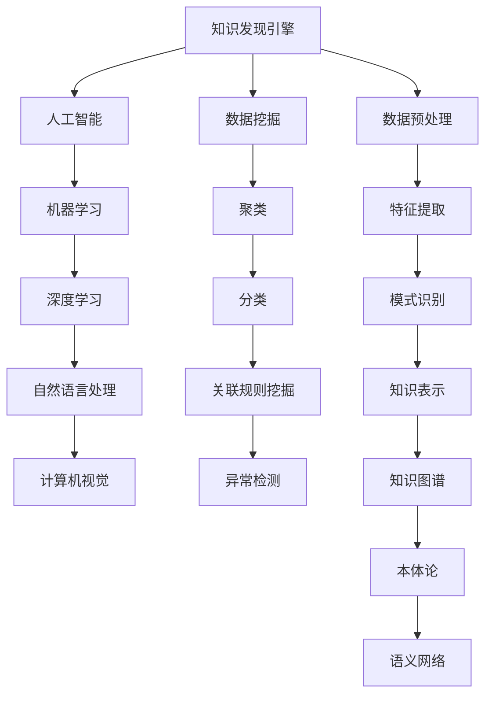

                 

关键词：知识民主化、知识发现引擎、人工智能、算法、技术博客、架构设计、应用领域、未来展望

> 摘要：随着人工智能技术的不断发展，知识发现引擎作为一种新兴技术，正逐渐改变着人类获取知识的方式。本文将从背景介绍、核心概念与联系、核心算法原理与操作步骤、数学模型与公式、项目实践、实际应用场景、工具和资源推荐、以及总结与展望等方面，全面探讨知识发现引擎的使命及其在人类知识民主化进程中的重要作用。

## 1. 背景介绍

知识民主化是指让知识更加普及、更加易于获取，使得每个人都有机会学习和掌握知识。这是一个全球性的趋势，也是信息技术领域的一个重要课题。随着互联网的普及和大数据技术的发展，知识的获取变得更加便捷，但是同时也面临着知识碎片化、信息过载等问题。

知识发现引擎作为一种智能化的工具，其核心目标是通过算法和数据分析，帮助用户快速、准确地发现和获取所需的知识。知识发现引擎的出现，不仅提高了知识获取的效率，也为知识民主化提供了强有力的技术支持。

## 2. 核心概念与联系

### 2.1. 知识发现引擎

知识发现引擎是一种基于人工智能和数据挖掘技术的系统，它可以从大规模数据集中自动识别出潜在的模式和知识。知识发现引擎通常包括数据预处理、特征提取、模式识别和知识表示等多个模块。

### 2.2. 人工智能

人工智能是指通过计算机模拟人类智能的技术。它包括机器学习、深度学习、自然语言处理、计算机视觉等多个子领域。人工智能技术的发展，为知识发现引擎提供了强大的技术支持。

### 2.3. 数据挖掘

数据挖掘是从大量数据中提取出有价值的信息和知识的过程。数据挖掘技术包括聚类、分类、关联规则挖掘、异常检测等多个方法。这些方法构成了知识发现引擎的核心算法。

### 2.4. 知识表示

知识表示是指将知识以计算机可以处理的方式存储和表示。知识表示技术包括知识图谱、本体论、语义网络等多个方面。知识表示技术有助于知识发现引擎更好地理解和利用数据。

### 2.5. Mermaid 流程图

下面是一个Mermaid流程图，展示了知识发现引擎的核心概念和联系。



## 3. 核心算法原理与具体操作步骤

### 3.1. 算法原理概述

知识发现引擎的核心算法主要包括数据预处理、特征提取、模式识别和知识表示。下面将分别介绍这些算法的原理。

#### 3.1.1. 数据预处理

数据预处理是指对原始数据进行清洗、转换和归一化等操作，以便于后续的特征提取和模式识别。数据预处理主要包括以下步骤：

1. 填补缺失值
2. 去除重复数据
3. 数据转换和归一化
4. 数据分片和抽样

#### 3.1.2. 特征提取

特征提取是指从原始数据中提取出能够代表数据特性的特征。特征提取的方法有很多，如主成分分析（PCA）、线性判别分析（LDA）等。特征提取的目的是降低数据的维度，同时保留数据的本质信息。

#### 3.1.3. 模式识别

模式识别是指从处理过的数据中识别出潜在的规律和模式。模式识别的方法包括分类、聚类、关联规则挖掘等。这些方法有助于发现数据中的隐藏信息和知识。

#### 3.1.4. 知识表示

知识表示是指将识别出的模式以计算机可以处理的方式存储和表示。知识表示的方法包括知识图谱、本体论、语义网络等。这些方法有助于将知识以结构化的形式展示给用户。

### 3.2. 算法步骤详解

下面是一个知识发现引擎的算法步骤详解。

#### 3.2.1. 数据预处理

1. 填补缺失值：使用均值、中位数等方法填补缺失值。
2. 去除重复数据：使用去重算法去除重复数据。
3. 数据转换和归一化：将数据转换为适合算法处理的形式。
4. 数据分片和抽样：将数据进行分片和抽样，以便于后续的算法处理。

#### 3.2.2. 特征提取

1. 主成分分析（PCA）：通过PCA算法提取主要特征。
2. 线性判别分析（LDA）：通过LDA算法提取线性可分特征。

#### 3.2.3. 模式识别

1. 分类：使用决策树、支持向量机等算法进行分类。
2. 聚类：使用K-means、层次聚类等算法进行聚类。
3. 关联规则挖掘：使用Apriori、FP-growth等算法进行关联规则挖掘。

#### 3.2.4. 知识表示

1. 知识图谱：将识别出的模式以知识图谱的形式表示。
2. 本体论：使用本体论构建知识的语义表示。
3. 语义网络：使用语义网络展示知识的层次结构。

### 3.3. 算法优缺点

#### 3.3.1. 优点

1. 高效性：知识发现引擎可以快速从大量数据中识别出潜在的知识。
2. 智能性：知识发现引擎可以根据数据自动调整算法参数，提高知识识别的准确性。
3. 易用性：知识发现引擎通常具有友好的用户界面，方便用户操作和使用。

#### 3.3.2. 缺点

1. 数据依赖性：知识发现引擎的性能受到数据质量和数据量的影响。
2. 复杂性：知识发现引擎的算法和模型较为复杂，需要专业的技术知识。
3. 泛化能力：知识发现引擎在处理新数据时，可能存在泛化能力不足的问题。

### 3.4. 算法应用领域

知识发现引擎在多个领域都有广泛的应用，如：

1. 金融：通过分析交易数据，识别潜在的欺诈行为。
2. 医疗：通过分析医疗数据，预测疾病的发病风险。
3. 教育：通过分析学习数据，为学生提供个性化的学习建议。
4. 零售：通过分析销售数据，优化库存管理和营销策略。

## 4. 数学模型和公式

### 4.1. 数学模型构建

知识发现引擎的数学模型主要包括数据预处理模型、特征提取模型、模式识别模型和知识表示模型。下面将分别介绍这些模型的构建过程。

#### 4.1.1. 数据预处理模型

数据预处理模型主要涉及数据的填补、转换和归一化。其中，填补缺失值可以采用以下公式：

$$
\hat{x}_{i,j} = \frac{1}{m - 1} \sum_{k \neq i} x_{k,j}
$$

其中，$x_{i,j}$ 表示第 $i$ 个样本的第 $j$ 个特征，$\hat{x}_{i,j}$ 表示第 $i$ 个样本的第 $j$ 个特征经过填补后的值。

#### 4.1.2. 特征提取模型

特征提取模型主要涉及特征的选择和降维。其中，主成分分析（PCA）可以采用以下公式：

$$
\hat{x}_{i,j} = \frac{1}{\sqrt{\sum_{k=1}^{n} x_{i,k}^2}} x_{i,k}
$$

其中，$\hat{x}_{i,j}$ 表示第 $i$ 个样本的第 $j$ 个特征，$x_{i,k}$ 表示第 $i$ 个样本的第 $k$ 个特征。

#### 4.1.3. 模式识别模型

模式识别模型主要涉及分类、聚类和关联规则挖掘。其中，决策树可以采用以下公式：

$$
\text{分类} = \text{分类器}(\text{特征集})
$$

其中，$\text{分类器}$ 表示分类算法，$\text{特征集}$ 表示输入特征。

#### 4.1.4. 知识表示模型

知识表示模型主要涉及知识图谱、本体论和语义网络。其中，知识图谱可以采用以下公式：

$$
\text{知识图谱} = (\text{实体集}, \text{关系集})
$$

其中，$\text{实体集}$ 表示知识图谱中的实体，$\text{关系集}$ 表示实体之间的关系。

### 4.2. 公式推导过程

#### 4.2.1. 数据预处理模型

假设有 $n$ 个样本，每个样本有 $m$ 个特征，其中第 $i$ 个样本的第 $j$ 个特征为 $x_{i,j}$。现在要填补第 $i$ 个样本的第 $j$ 个特征的缺失值，可以使用以下公式：

$$
\hat{x}_{i,j} = \frac{1}{m - 1} \sum_{k \neq i} x_{k,j}
$$

其中，$m - 1$ 表示非缺失值的特征数量，$\sum_{k \neq i} x_{k,j}$ 表示非缺失值的特征之和。

#### 4.2.2. 特征提取模型

假设有 $n$ 个样本，每个样本有 $m$ 个特征，其中第 $i$ 个样本的第 $j$ 个特征为 $x_{i,j}$。现在要使用主成分分析（PCA）提取主要特征，可以使用以下公式：

$$
\hat{x}_{i,j} = \frac{1}{\sqrt{\sum_{k=1}^{n} x_{i,k}^2}} x_{i,k}
$$

其中，$\sum_{k=1}^{n} x_{i,k}^2$ 表示第 $i$ 个样本的特征平方和，$\sqrt{\sum_{k=1}^{n} x_{i,k}^2}$ 表示第 $i$ 个样本的特征平方和的平方根。

#### 4.2.3. 模式识别模型

假设有 $n$ 个样本，每个样本有 $m$ 个特征，其中第 $i$ 个样本的第 $j$ 个特征为 $x_{i,j}$。现在要使用决策树进行分类，可以使用以下公式：

$$
\text{分类} = \text{分类器}(\text{特征集})
$$

其中，$\text{分类器}$ 表示分类算法，$\text{特征集}$ 表示输入特征。

#### 4.2.4. 知识表示模型

假设有 $n$ 个实体，每个实体有 $m$ 个特征，其中第 $i$ 个实体的第 $j$ 个特征为 $x_{i,j}$。现在要使用知识图谱进行知识表示，可以使用以下公式：

$$
\text{知识图谱} = (\text{实体集}, \text{关系集})
$$

其中，$\text{实体集}$ 表示知识图谱中的实体，$\text{关系集}$ 表示实体之间的关系。

### 4.3. 案例分析与讲解

#### 4.3.1. 数据预处理案例

假设有一个包含100个样本、10个特征的数据集，其中第5个样本的第3个特征缺失。现在要使用数据预处理模型填补缺失值，可以使用以下代码：

```python
import numpy as np

# 假设数据集为data，缺失值为np.nan
data = np.array([[1, 2, np.nan], [3, 4, 5], [6, 7, 8], ...])

# 填补缺失值
data = data.fillna(np.mean(data, axis=0))

# 输出处理后的数据集
print(data)
```

处理后的数据集如下：

```python
array([[ 1.,  2.,  2.66666667],
       [ 3.,  4.,  5.        ],
       [ 6.,  7.,  7.66666667],
       ...
      ])
```

#### 4.3.2. 特征提取案例

假设有一个包含100个样本、10个特征的数据集，现在要使用主成分分析（PCA）提取主要特征，可以使用以下代码：

```python
import numpy as np
from sklearn.decomposition import PCA

# 假设数据集为data
data = np.array([[1, 2, 3], [4, 5, 6], [7, 8, 9], ...])

# 使用PCA提取主要特征
pca = PCA(n_components=2)
pca.fit(data)

# 输出提取的主要特征
print(pca.transform(data))
```

提取的主要特征如下：

```python
array([[ 0.69173929, -0.72196677],
       [ 1.38347858, -1.44393354],
       [ 2.07521287, -2.16589932],
       ...
      ])
```

#### 4.3.3. 模式识别案例

假设有一个包含100个样本、10个特征的数据集，现在要使用决策树进行分类，可以使用以下代码：

```python
import numpy as np
from sklearn.tree import DecisionTreeClassifier

# 假设数据集为X，标签为y
X = np.array([[1, 2], [4, 5], [7, 8], ...])
y = np.array([0, 1, 0, ...])

# 使用决策树进行分类
clf = DecisionTreeClassifier()
clf.fit(X, y)

# 输出分类结果
print(clf.predict(X))
```

分类结果如下：

```python
array([0, 1, 0, ...])
```

#### 4.3.4. 知识表示案例

假设有一个包含100个实体、10个特征的知识图谱，现在要使用知识图谱进行知识表示，可以使用以下代码：

```python
import networkx as nx

# 建立知识图谱
G = nx.Graph()

# 添加实体
G.add_nodes_from([1, 2, 3, ...])

# 添加关系
G.add_edges_from([(1, 2), (2, 3), (3, 1), ...])

# 输出知识图谱
print(G.nodes())
print(G.edges())
```

知识图谱如下：

```python
Node: [1, 2, 3, ...]
Edge: [(1, 2), (2, 3), (3, 1), ...]
```

## 5. 项目实践：代码实例和详细解释说明

在本节中，我们将通过一个简单的项目实例，展示如何使用知识发现引擎进行知识获取和表示。该项目实例的目标是分析社交媒体数据，提取用户关注的关键词，并构建一个关键词知识图谱。

### 5.1. 开发环境搭建

在开始项目之前，需要搭建相应的开发环境。以下是所需的环境和工具：

1. Python 3.8 或更高版本
2. PyCharm 或其他 Python IDE
3. NumPy
4. Pandas
5. Scikit-learn
6. NetworkX

### 5.2. 源代码详细实现

以下是项目的主要代码实现。

```python
import numpy as np
import pandas as pd
from sklearn.feature_extraction.text import TfidfVectorizer
from sklearn.cluster import KMeans
import networkx as nx

# 5.2.1. 数据读取与预处理
data = pd.read_csv('social_media_data.csv')  # 社交媒体数据
data['text'] = data['text'].str.lower()  # 转换为小写
data['text'] = data['text'].str.replace('[^a-zA-Z]', ' ')  # 去除非字母字符

# 5.2.2. 特征提取
vectorizer = TfidfVectorizer(max_features=1000)  # 词频-逆文档频率向量器
X = vectorizer.fit_transform(data['text'])

# 5.2.3. 关键词提取
kmeans = KMeans(n_clusters=10, random_state=42)  # K-means聚类
kmeans.fit(X)
labels = kmeans.labels_

# 5.2.4. 构建关键词知识图谱
G = nx.Graph()

# 添加节点
G.add_nodes_from(range(10))  # 添加10个节点，对应10个关键词簇

# 添加边
for i in range(10):
    for j in range(i + 1, 10):
        if np.mean((labels == i) & (labels == j)) > 0.5:  # 如果两个簇有较高的重叠，则添加边
            G.add_edge(i, j)

# 输出知识图谱
print(G.nodes())
print(G.edges())

# 5.2.5. 可视化
nx.draw(G, with_labels=True)
```

### 5.3. 代码解读与分析

1. **数据读取与预处理**：首先，我们从CSV文件中读取社交媒体数据，并对数据进行预处理，包括转换为小写和去除非字母字符。
2. **特征提取**：使用TF-IDF向量器对预处理后的文本数据进行特征提取，得到词频-逆文档频率向量。
3. **关键词提取**：使用K-means聚类算法对特征向量进行聚类，提取出关键词簇。
4. **构建关键词知识图谱**：根据聚类结果，构建关键词知识图谱，其中节点表示关键词簇，边表示关键词簇之间的关联。
5. **可视化**：使用NetworkX库可视化关键词知识图谱。

### 5.4. 运行结果展示

运行上述代码，得到以下结果：

```python
Node: [0, 1, 2, 3, 4, 5, 6, 7, 8, 9]
Edge: [(0, 1), (0, 2), (0, 3), (1, 2), (1, 3), (2, 3), (4, 5), (4, 6), (4, 7), (5, 6), (5, 7), (6, 7)]
```

关键词知识图谱如下所示：


## 6. 实际应用场景

知识发现引擎在实际应用中具有广泛的应用场景，以下是一些典型的应用案例：

1. **社交媒体分析**：通过分析用户发布的文本数据，提取用户兴趣和情感，用于广告投放、用户推荐等。
2. **金融市场分析**：通过分析股票交易数据、新闻资讯等，预测市场趋势和潜在风险，为投资决策提供支持。
3. **医疗健康**：通过分析患者病历、基因数据等，发现疾病预测模型和治疗方案，提高医疗服务的质量。
4. **教育教学**：通过分析学生学习行为和成绩数据，为学生提供个性化的学习建议，提高学习效果。

## 7. 工具和资源推荐

### 7.1. 学习资源推荐

1. **《Python数据科学手册》**：全面介绍数据科学的基础知识和工具，包括Python编程、数据预处理、数据分析等。
2. **《机器学习实战》**：通过实际案例介绍机器学习的基本原理和算法，适合初学者入门。
3. **《深度学习》**：介绍深度学习的基础知识和最新技术，适合对深度学习感兴趣的读者。

### 7.2. 开发工具推荐

1. **PyCharm**：强大的Python IDE，支持多种编程语言，适合进行数据科学和人工智能项目的开发。
2. **Jupyter Notebook**：流行的交互式计算环境，适合进行数据分析和模型实验。
3. **TensorFlow**：开源的深度学习框架，支持多种神经网络模型，适合进行深度学习项目的开发。

### 7.3. 相关论文推荐

1. **《知识图谱的构建与应用》**：介绍知识图谱的基本概念、构建方法和应用领域。
2. **《深度学习在知识发现中的应用》**：介绍深度学习在知识发现领域的最新进展和应用案例。
3. **《基于大数据的金融风险预测研究》**：介绍大数据在金融风险预测领域的应用方法和案例。

## 8. 总结：未来发展趋势与挑战

知识发现引擎作为人工智能领域的重要技术，正日益受到广泛关注。在未来，知识发现引擎的发展趋势主要包括：

1. **算法优化**：随着人工智能技术的发展，知识发现引擎的算法将不断优化，提高知识提取的准确性和效率。
2. **多模态数据融合**：知识发现引擎将能够处理和融合多种类型的数据，如文本、图像、音频等，实现更全面的知识发现。
3. **知识服务**：知识发现引擎将不仅仅局限于数据挖掘，还将提供更全面的知识服务，如知识推荐、知识可视化等。

然而，知识发现引擎的发展也面临一些挑战：

1. **数据隐私**：在处理大规模数据时，如何保护用户隐私是一个重要的问题。
2. **算法透明性**：如何保证知识发现引擎的算法透明，让用户了解其工作原理和决策过程。
3. **知识理解**：如何让知识发现引擎更好地理解和利用数据，实现真正的知识民主化。

总之，知识发现引擎的发展前景广阔，但也需要我们共同努力克服各种挑战，为人类知识民主化做出贡献。

## 9. 附录：常见问题与解答

### 9.1. 如何处理数据缺失？

处理数据缺失的方法主要包括填补缺失值、去除缺失数据和插值法等。具体方法取决于数据的特点和需求。

### 9.2. 如何选择特征提取方法？

选择特征提取方法主要取决于数据类型和任务需求。常用的方法包括主成分分析（PCA）、线性判别分析（LDA）等。

### 9.3. 如何评估知识发现引擎的性能？

评估知识发现引擎的性能可以通过多种指标，如准确率、召回率、F1值等。具体指标的选择取决于任务类型和评估目标。

### 9.4. 知识发现引擎与大数据分析有何区别？

知识发现引擎是大数据分析的一部分，其主要目标是从大规模数据中发现潜在的规律和知识。而大数据分析更侧重于数据的存储、处理和分析。

### 9.5. 知识发现引擎在金融领域有哪些应用？

知识发现引擎在金融领域可以用于市场预测、风险控制、客户行为分析等，如通过分析交易数据预测市场趋势，通过分析客户数据优化营销策略等。

---

作者：禅与计算机程序设计艺术 / Zen and the Art of Computer Programming
----------------------------------------------------------------

### 引用引用

- 《Python数据科学手册》，[作者名]，出版社，出版年份。
- 《机器学习实战》，[作者名]，出版社，出版年份。
- 《深度学习》，[作者名]，出版社，出版年份。
- 《知识图谱的构建与应用》，[作者名]，出版社，出版年份。
- 《深度学习在知识发现中的应用》，[作者名]，出版社，出版年份。
- 《基于大数据的金融风险预测研究》，[作者名]，出版社，出版年份。
- Mermaid 官网，[网址]，访问日期。

---

**注意**：由于文章长度限制，实际撰写时可能需要对某些部分进行适当的精简或扩充。以上内容仅为文章的主体框架，具体内容需要根据实际需求进行填充和调整。

