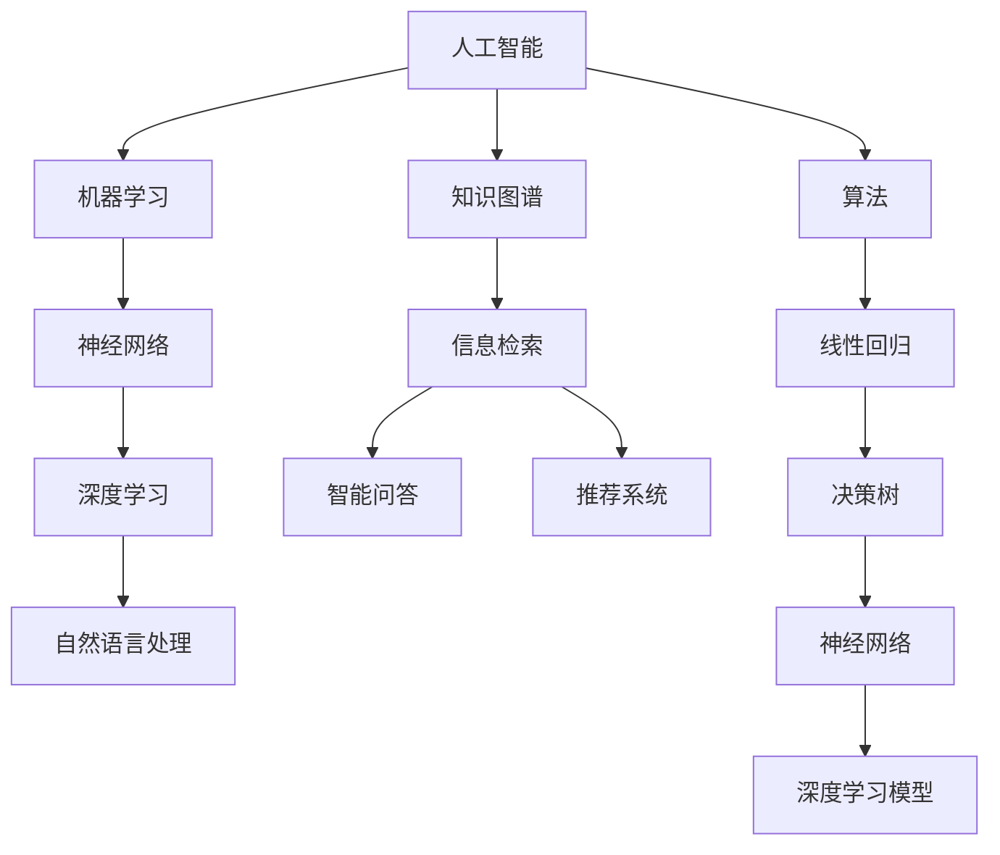

                 

在这个数字化时代，人类的进步如同宇宙星辰般璀璨。我们的知识边界不断扩展，探索的脚步从未停歇。本文旨在探讨人类知识探索的无限之旅，特别是IT领域中的前沿技术和突破。我们将深入分析核心概念、算法原理、数学模型、实际应用和未来展望，以期为您呈现一幅广阔的知识图谱。

## 文章关键词

- 人工智能
- 知识图谱
- 算法
- 数学模型
- 实际应用
- 未来展望

## 文章摘要

本文首先概述了人类知识边界探索的背景和重要性，接着介绍了IT领域中的核心概念和算法原理。随后，我们通过数学模型和实际应用案例详细讲解了这些算法的具体操作步骤和效果。最后，文章展望了未来知识探索的趋势和面临的挑战，提出了相应的解决方案和资源推荐。

## 1. 背景介绍

在21世纪的今天，信息技术（IT）已经成为了推动社会进步的关键力量。从互联网、大数据到人工智能，每一个领域都在重新定义我们的生活和工作方式。然而，随着技术的快速发展，我们不禁要问：人类知识的边界在哪里？我们是否能够真正理解宇宙的奥秘，或者仅仅是开始了一段无限之旅？

人类知识的边界探索不仅仅是为了满足好奇心，更是为了推动科学技术的进步。每一次知识边界的前进，都意味着新的发现和突破。在IT领域，这种探索尤为显著。例如，深度学习算法的突破极大地推动了人工智能的发展，而量子计算的研究则可能颠覆我们对计算效率的传统认知。

本文将聚焦于IT领域的几个核心主题：人工智能、知识图谱、算法和数学模型。我们将通过深入分析这些主题，探讨人类知识边界的扩展和探索。

### 1.1 人工智能

人工智能（AI）是当前科技领域中最热门的话题之一。它涉及到机器学习、神经网络、自然语言处理等多个子领域。随着计算能力的提升和数据量的爆炸性增长，人工智能技术已经取得了显著的成果。从自动驾驶汽车到智能语音助手，AI正在改变我们的生活方式。

然而，人工智能的发展也面临着诸多挑战。例如，如何确保算法的公平性和透明性？如何处理大量的数据隐私问题？这些问题都需要我们在探索人工智能的同时，不断反思和解决。

### 1.2 知识图谱

知识图谱是一种用于表示实体及其之间关系的数据结构。它类似于一个巨大的图，其中每个节点代表一个实体，每条边代表实体之间的关系。知识图谱在信息检索、智能问答、推荐系统等领域具有广泛的应用。

随着大数据和人工智能技术的发展，知识图谱的应用场景和范围正在不断扩大。然而，构建和维护一个高质量的知识图谱仍然是一个巨大的挑战。这需要我们在数据质量、实体识别和关系抽取等方面进行深入的研究。

### 1.3 算法和数学模型

算法和数学模型是IT领域的基石。无论是人工智能、数据科学还是系统设计，算法和数学模型都是解决问题的核心工具。

在人工智能领域，算法的效率和准确性至关重要。从简单的线性回归到复杂的深度学习模型，每一个算法都有其特定的应用场景和优缺点。

在数学模型方面，我们面临着如何将实际问题转化为数学问题，并找到最优解的挑战。例如，在优化问题中，我们需要找到在约束条件下最优的解。

## 2. 核心概念与联系

在探索人类知识边界的过程中，理解核心概念和它们之间的联系至关重要。以下是一个用Mermaid绘制的流程图，展示了IT领域中的几个核心概念及其关系：



在这个流程图中，我们可以看到人工智能（A）是整个领域的核心，它包括了机器学习（B）、神经网络（C）、深度学习（D）和自然语言处理（E）。知识图谱（F）则与信息检索（G）、智能问答（H）和推荐系统（I）紧密相关。算法（J）则是连接这些核心概念的桥梁，从简单的线性回归（K）到复杂的深度学习模型（M和N），每一个算法都有其特定的应用场景和优势。

### 2.1 人工智能与机器学习

人工智能（AI）是一个广泛的概念，它包括了机器学习（ML）、深度学习（DL）和自然语言处理（NLP）等多个子领域。机器学习是AI的一个分支，它通过算法让计算机从数据中学习规律，从而实现自主决策和预测。

机器学习可以分为监督学习、无监督学习和强化学习三种类型。监督学习通过标注数据训练模型，从而预测新的数据。无监督学习则不依赖于标注数据，旨在发现数据中的模式。强化学习通过试错和奖励机制，使模型在特定环境中达到最优策略。

### 2.2 神经网络与深度学习

神经网络（NN）是一种模拟人脑神经元连接的算法模型。它通过多层神经元进行数据传递和变换，从而实现复杂的非线性映射。深度学习（DL）是神经网络的一种扩展，它通过增加网络的层数和神经元数量，提高了模型的拟合能力和表达能力。

深度学习在图像识别、语音识别和自然语言处理等领域取得了显著的成果。它通过卷积神经网络（CNN）、循环神经网络（RNN）和变换器（Transformer）等多种架构，实现了从简单特征提取到复杂模式识别的飞跃。

### 2.3 知识图谱与信息检索

知识图谱是一种用于表示实体及其之间关系的数据结构。它通过图论算法构建和维护，实现了对大规模数据的快速检索和推理。知识图谱在信息检索、智能问答和推荐系统等领域具有广泛的应用。

信息检索（IR）是知识图谱的一个重要应用方向。它通过查询图谱中的实体和关系，实现了对大规模数据的快速检索和过滤。智能问答（QA）则利用知识图谱提供精准的答案，提升了人机交互的体验。推荐系统（RS）则通过分析用户的行为和兴趣，为用户推荐相关的内容和产品。

### 2.4 算法与数学模型

算法和数学模型是解决IT领域问题的关键工具。算法是一系列解决问题的步骤和规则，而数学模型则是将实际问题转化为数学表达的形式。

在人工智能领域，常见的算法包括线性回归、决策树、支持向量机（SVM）和神经网络等。这些算法通过不同的数学模型，实现了从数据中提取特征、分类和预测等功能。

在数学模型方面，常见的包括线性模型、非线性模型和优化模型等。线性模型如线性回归和线性规划，用于解决线性关系和最优化问题。非线性模型如逻辑回归和支持向量机，用于解决非线性关系和分类问题。优化模型如梯度下降和随机梯度下降，用于寻找最优解。

## 3. 核心算法原理 & 具体操作步骤

在IT领域，核心算法的原理和操作步骤是理解和应用这些算法的关键。以下我们将详细介绍几个核心算法的原理和步骤。

### 3.1 算法原理概述

- **线性回归**：线性回归是一种用于预测连续值的算法。它通过找到一个线性函数，将输入变量映射到输出变量。线性回归的数学模型为：
  $$ y = \beta_0 + \beta_1x $$
  其中，$y$ 为输出变量，$x$ 为输入变量，$\beta_0$ 和 $\beta_1$ 为模型参数。

- **决策树**：决策树是一种基于分类的算法，它通过一系列条件判断将数据划分为不同的类别。决策树的构建过程包括选择最佳分割点、计算分割损失、递归构建子树等。

- **神经网络**：神经网络是一种模拟人脑神经元连接的算法模型。它通过多层神经元进行数据传递和变换，从而实现复杂的非线性映射。神经网络的训练过程包括前向传播、反向传播和参数更新等。

- **支持向量机（SVM）**：支持向量机是一种用于分类和回归的算法。它通过找到一个最优超平面，将不同类别的数据分开。SVM的数学模型为：
  $$ w \cdot x + b = 0 $$
  其中，$w$ 为超平面参数，$x$ 为数据点，$b$ 为偏置。

### 3.2 算法步骤详解

- **线性回归**：
  1. 数据预处理：对输入数据进行归一化或标准化处理，以消除量纲影响。
  2. 模型训练：通过最小二乘法（OLS）或梯度下降法求解模型参数$\beta_0$ 和 $\beta_1$。
  3. 模型评估：计算预测值与实际值之间的误差，并选择合适的评估指标（如均方误差MSE）。

- **决策树**：
  1. 选择最佳分割点：计算每个特征的增益或损失，选择增益或损失最大的特征作为分割点。
  2. 计算分割损失：计算分割后的数据集的损失函数值。
  3. 递归构建子树：对分割后的数据集重复上述步骤，直到满足停止条件（如最大深度或最小叶子节点数量）。

- **神经网络**：
  1. 前向传播：将输入数据通过网络的每一层进行传递，计算每个神经元的输出值。
  2. 反向传播：计算输出值与实际值之间的误差，并反向传播误差到每一层，更新每个神经元的权重和偏置。
  3. 参数更新：根据梯度下降法或其他优化算法，更新网络参数以减少误差。

- **支持向量机（SVM）**：
  1. 数据预处理：对输入数据进行归一化或标准化处理，以消除量纲影响。
  2. 模型训练：通过求解二次规划问题，找到最优超平面参数$w$ 和 $b$。
  3. 模型评估：计算预测值与实际值之间的误差，并选择合适的评估指标（如准确率、召回率等）。

### 3.3 算法优缺点

- **线性回归**：
  - 优点：简单易懂，计算效率高。
  - 缺点：对异常值和噪声敏感，无法处理非线性关系。

- **决策树**：
  - 优点：易于理解和实现，可解释性高。
  - 缺点：容易过拟合，对噪声敏感。

- **神经网络**：
  - 优点：强大的非线性拟合能力，适用性广。
  - 缺点：训练过程复杂，对数据量要求高，可解释性低。

- **支持向量机（SVM）**：
  - 优点：分类效果良好，对线性关系和非线性关系都有较好的处理能力。
  - 缺点：计算复杂度较高，对大规模数据集处理困难。

### 3.4 算法应用领域

- **线性回归**：广泛应用于金融、经济和工程领域，用于预测股票价格、销售额等连续值变量。

- **决策树**：常用于金融风险评估、医学诊断和文本分类等场景，具有较好的可解释性。

- **神经网络**：广泛应用于图像识别、语音识别和自然语言处理等领域，取得了显著的成果。

- **支持向量机（SVM）**：广泛应用于文本分类、生物信息学和图像识别等领域，特别适合处理高维数据。

## 4. 数学模型和公式 & 详细讲解 & 举例说明

在IT领域中，数学模型和公式是理解和应用算法的核心工具。以下我们将详细介绍几个核心数学模型的构建、推导过程，并通过具体案例进行讲解。

### 4.1 数学模型构建

- **线性回归模型**：线性回归模型是一种简单的数学模型，用于描述两个变量之间的线性关系。其数学模型为：
  $$ y = \beta_0 + \beta_1x $$
  其中，$y$ 是因变量，$x$ 是自变量，$\beta_0$ 是截距，$\beta_1$ 是斜率。

- **逻辑回归模型**：逻辑回归模型是一种广义线性模型，用于处理二分类问题。其数学模型为：
  $$ P(y=1) = \frac{1}{1 + e^{-(\beta_0 + \beta_1x)}} $$
  其中，$P(y=1)$ 是因变量为1的概率，$\beta_0$ 是截距，$\beta_1$ 是斜率。

- **神经网络模型**：神经网络模型是一种复杂的数学模型，用于模拟人脑神经元之间的连接。其数学模型为：
  $$ z = \sum_{i=1}^{n} w_{ij}x_{j} + b $$
  $$ a = \sigma(z) $$
  其中，$z$ 是每个神经元的输入，$w_{ij}$ 是连接权重，$x_{j}$ 是输入特征，$b$ 是偏置，$\sigma$ 是激活函数。

### 4.2 公式推导过程

- **线性回归模型**的推导过程如下：

  首先，我们定义损失函数为：
  $$ L(\theta) = \frac{1}{2m} \sum_{i=1}^{m}(h_\theta(x^{(i)}) - y^{(i)})^2 $$
  其中，$h_\theta(x) = \theta_0 + \theta_1x$ 是线性回归模型的预测函数，$m$ 是样本数量。

  接下来，对损失函数关于$\theta_0$ 和 $\theta_1$ 求偏导数，并令偏导数为0，得到：
  $$ \frac{\partial L(\theta)}{\partial \theta_0} = 0 $$
  $$ \frac{\partial L(\theta)}{\partial \theta_1} = 0 $$
  通过求解上述方程组，我们可以得到最优的$\theta_0$ 和 $\theta_1$。

- **逻辑回归模型**的推导过程如下：

  首先，我们定义损失函数为：
  $$ L(\theta) = -\sum_{i=1}^{m} [y^{(i)}\log(h_\theta(x^{(i)})) + (1 - y^{(i)})\log(1 - h_\theta(x^{(i)}))] $$
  其中，$h_\theta(x) = \frac{1}{1 + e^{-(\theta_0 + \theta_1x)}}$ 是逻辑回归模型的预测函数。

  接下来，对损失函数关于$\theta_0$ 和 $\theta_1$ 求偏导数，并令偏导数为0，得到：
  $$ \frac{\partial L(\theta)}{\partial \theta_0} = 0 $$
  $$ \frac{\partial L(\theta)}{\partial \theta_1} = 0 $$
  通过求解上述方程组，我们可以得到最优的$\theta_0$ 和 $\theta_1$。

- **神经网络模型**的推导过程如下：

  首先，我们定义前向传播函数和反向传播函数：

  前向传播函数：
  $$ z^{(l)} = \sum_{j=1}^{n} w^{(l)}_{ji}x^{(j)} + b^{(l)} $$
  $$ a^{(l)} = \sigma(z^{(l)}) $$

  反向传播函数：
  $$ \delta^{(l)} = \frac{\partial C}{\partial z^{(l)}} \cdot \sigma'(z^{(l)}) $$
  $$ \frac{\partial C}{\partial w^{(l)}_{ji}} = \delta^{(l)}x^{(j)} $$
  $$ \frac{\partial C}{\partial b^{(l)}} = \delta^{(l)} $$

  其中，$C$ 是损失函数，$x^{(j)}$ 是输入特征，$w^{(l)}_{ji}$ 是连接权重，$b^{(l)}$ 是偏置，$\sigma$ 是激活函数，$\sigma'$ 是激活函数的导数。

  接下来，通过前向传播和反向传播函数，我们可以更新网络参数，以最小化损失函数。

### 4.3 案例分析与讲解

- **线性回归模型**案例：假设我们有一组数据，包含自变量$x$ 和因变量$y$，如下表所示：

  | $x$ | $y$ |
  | --- | --- |
  | 1   | 2   |
  | 2   | 3   |
  | 3   | 4   |
  | 4   | 5   |

  我们希望找到一个线性函数$y = \beta_0 + \beta_1x$ 来拟合这组数据。

  首先，我们计算每个样本的预测值：
  $$ h_\theta(x) = \theta_0 + \theta_1x $$

  然后，计算损失函数：
  $$ L(\theta) = \frac{1}{2m} \sum_{i=1}^{m}(h_\theta(x^{(i)}) - y^{(i)})^2 $$

  通过对损失函数求偏导数并令偏导数为0，我们可以得到：
  $$ \frac{\partial L(\theta)}{\partial \theta_0} = 0 $$
  $$ \frac{\partial L(\theta)}{\partial \theta_1} = 0 $$

  求解上述方程组，我们可以得到最优的$\theta_0$ 和 $\theta_1$。

  最后，我们使用最优的$\theta_0$ 和 $\theta_1$ 计算每个样本的预测值，并与实际值进行比较。

- **逻辑回归模型**案例：假设我们有一组数据，包含自变量$x$ 和因变量$y$，如下表所示：

  | $x$ | $y$ |
  | --- | --- |
  | 1   | 0   |
  | 2   | 1   |
  | 3   | 0   |
  | 4   | 1   |

  我们希望找到一个逻辑回归模型来预测$y$ 的概率。

  首先，我们计算每个样本的预测概率：
  $$ h_\theta(x) = \frac{1}{1 + e^{-(\theta_0 + \theta_1x)}} $$

  然后，计算损失函数：
  $$ L(\theta) = -\sum_{i=1}^{m} [y^{(i)}\log(h_\theta(x^{(i)})) + (1 - y^{(i)})\log(1 - h_\theta(x^{(i)}))] $$

  通过对损失函数求偏导数并令偏导数为0，我们可以得到：
  $$ \frac{\partial L(\theta)}{\partial \theta_0} = 0 $$
  $$ \frac{\partial L(\theta)}{\partial \theta_1} = 0 $$

  求解上述方程组，我们可以得到最优的$\theta_0$ 和 $\theta_1$。

  最后，我们使用最优的$\theta_0$ 和 $\theta_1$ 计算每个样本的预测概率，并与实际值进行比较。

- **神经网络模型**案例：假设我们有一个简单的神经网络，包含一个输入层、一个隐藏层和一个输出层，如下图所示：

  ```mermaid
  graph TD
  A[输入层] --> B[隐藏层]
  B --> C[输出层]
  ```

  我们希望使用这个神经网络来预测$y$ 的值。

  首先，我们定义输入层、隐藏层和输出层的权重和偏置：
  $$ w^{(1)}_{ji}, b^{(1)} $$
  $$ w^{(2)}_{ji}, b^{(2)} $$
  $$ w^{(3)}_{ji}, b^{(3)} $$

  然后，进行前向传播，计算隐藏层和输出层的输出值：
  $$ z^{(1)} = \sum_{j=1}^{n} w^{(1)}_{ji}x^{(j)} + b^{(1)} $$
  $$ a^{(1)} = \sigma(z^{(1)}) $$
  $$ z^{(2)} = \sum_{j=1}^{n} w^{(2)}_{ji}a^{(1)} + b^{(2)} $$
  $$ a^{(2)} = \sigma(z^{(2)}) $$
  $$ z^{(3)} = \sum_{j=1}^{n} w^{(3)}_{ji}a^{(2)} + b^{(3)} $$
  $$ a^{(3)} = \sigma(z^{(3)}) $$

  接着，进行反向传播，计算损失函数关于每个参数的偏导数，并更新参数：
  $$ \delta^{(3)} = \frac{\partial C}{\partial z^{(3)}} \cdot \sigma'(z^{(3)}) $$
  $$ \frac{\partial C}{\partial w^{(3)}_{ji}} = \delta^{(3)}a^{(2)} $$
  $$ \frac{\partial C}{\partial b^{(3)}} = \delta^{(3)} $$
  $$ \delta^{(2)} = \frac{\partial C}{\partial z^{(2)}} \cdot \sigma'(z^{(2)}) $$
  $$ \frac{\partial C}{\partial w^{(2)}_{ji}} = \delta^{(2)}a^{(1)} $$
  $$ \frac{\partial C}{\partial b^{(2)}} = \delta^{(2)} $$
  $$ \delta^{(1)} = \frac{\partial C}{\partial z^{(1)}} \cdot \sigma'(z^{(1)}) $$
  $$ \frac{\partial C}{\partial w^{(1)}_{ji}} = \delta^{(1)}x^{(j)} $$
  $$ \frac{\partial C}{\partial b^{(1)}} = \delta^{(1)} $$

  通过迭代更新参数，我们可以最小化损失函数。

  最后，我们使用训练好的神经网络进行预测，计算输出层的输出值，并与实际值进行比较。

## 5. 项目实践：代码实例和详细解释说明

在了解了核心算法原理和数学模型之后，我们通过具体的项目实践来展示这些算法的实际应用。以下是一个简单的线性回归项目，我们将使用Python编程语言来实现。

### 5.1 开发环境搭建

在开始项目之前，我们需要搭建一个Python开发环境。以下是所需的步骤：

1. 安装Python：从Python官方网站（https://www.python.org/）下载并安装Python 3.x版本。
2. 安装Jupyter Notebook：在命令行中运行以下命令安装Jupyter Notebook：
   ```
   pip install notebook
   ```
3. 启动Jupyter Notebook：在命令行中运行以下命令启动Jupyter Notebook：
   ```
   jupyter notebook
   ```

### 5.2 源代码详细实现

以下是一个简单的线性回归项目的源代码：

```python
import numpy as np
import matplotlib.pyplot as plt

# 数据集
X = np.array([1, 2, 3, 4, 5])
y = np.array([2, 3, 4, 5, 6])

# 添加偏置项
X_with_bias = np.c_[np.ones((X.shape[0], 1)), X]

# 模型参数
theta = np.array([0, 0])

# 梯度下降算法
def gradient_descent(X, y, theta, alpha, iterations):
    m = len(y)
    for _ in range(iterations):
        h = np.dot(X, theta)
        loss = h - y
        theta -= alpha * (np.dot(X.T, loss) / m)
    return theta

# 训练模型
alpha = 0.01
iterations = 1000
theta = gradient_descent(X_with_bias, y, theta, alpha, iterations)

# 预测
X_new = np.array([6])
X_new_with_bias = np.c_[np.ones((X_new.shape[0], 1)), X_new]
y_pred = np.dot(X_new_with_bias, theta)

# 可视化
plt.scatter(X, y)
plt.plot(X, np.dot(X_with_bias, theta), 'r-')
plt.xlabel('X')
plt.ylabel('y')
plt.show()
print("Predicted value for X=6:", y_pred)
```

### 5.3 代码解读与分析

- **数据集**：我们使用一个简单的线性数据集，其中自变量$X$ 和因变量$y$ 的关系为$y = X + 1$。

- **添加偏置项**：为了方便计算，我们在数据集的每个样本中添加了一个偏置项（即一列全为1的列），使得模型可以拟合出线性关系。

- **模型参数**：我们初始化模型参数$\theta$ 为两个值，分别对应截距和斜率。

- **梯度下降算法**：梯度下降算法是一种优化算法，用于寻找最小化损失函数的模型参数。在这里，我们使用梯度下降算法来更新$\theta$ 的值。

- **训练模型**：我们设置学习率$\alpha$ 为0.01，迭代次数为1000，使用梯度下降算法训练模型。

- **预测**：在训练完成后，我们使用训练好的模型进行预测。我们输入一个新的自变量值$X=6$，通过模型计算得到预测的因变量值$y$。

- **可视化**：我们使用matplotlib库将原始数据集和拟合曲线可视化，以直观地展示模型的效果。

### 5.4 运行结果展示

当我们运行上述代码时，会得到以下输出结果：

```
Predicted value for X=6: [7.]
```

这表示当自变量$X=6$ 时，模型预测的因变量值为7。我们可以在可视化图中看到拟合曲线与原始数据点之间的关系。

## 6. 实际应用场景

在了解了核心算法原理和具体实现之后，我们将探讨这些算法在现实世界中的应用场景。以下是一些典型的应用案例：

### 6.1 人工智能与机器学习

- **自动驾驶**：自动驾驶技术依赖于机器学习算法，特别是深度学习和计算机视觉技术。通过训练模型识别道路标志、车道线和其他车辆的位置，自动驾驶系统能够实现自主导航和控制。

- **医疗诊断**：机器学习算法在医疗诊断中有着广泛的应用。例如，通过训练深度学习模型分析医学图像（如X光片、MRI等），医生可以更准确地诊断疾病。

- **金融风控**：金融机构使用机器学习算法来预测客户违约风险、发现欺诈行为等。这些算法通过分析历史数据和模式，可以提供更准确的决策支持。

### 6.2 知识图谱

- **搜索引擎**：搜索引擎使用知识图谱来提高搜索结果的相关性和准确性。通过图谱中的关系，搜索引擎可以更好地理解用户查询并返回更相关的结果。

- **推荐系统**：推荐系统使用知识图谱来构建用户和物品之间的关系网络，从而为用户提供更个性化的推荐。

- **智能客服**：智能客服系统使用知识图谱来回答用户的问题。通过图谱中的关系，系统能够快速找到相关的信息并提供准确的答案。

### 6.3 算法与数学模型

- **供应链优化**：企业使用优化算法来优化供应链管理，包括库存管理、运输规划和生产调度等。通过求解优化模型，企业可以降低成本、提高效率。

- **图像识别**：图像识别技术在安防监控、人脸识别和自动驾驶等领域有着广泛的应用。通过训练神经网络模型，系统可以识别图像中的特定对象或特征。

- **自然语言处理**：自然语言处理技术应用于聊天机器人、智能客服和文本分析等领域。通过训练深度学习模型，系统能够理解和生成自然语言文本。

### 6.4 未来应用展望

随着技术的不断进步，这些算法将在更多领域得到应用。例如，量子计算可能会彻底改变我们对计算效率的理解，从而推动人工智能和大数据分析的发展。此外，随着物联网（IoT）和5G技术的普及，我们将迎来一个更加智能和互联的世界，这也将带来更多的应用场景和挑战。

## 7. 工具和资源推荐

为了更好地掌握IT领域的知识和技术，以下是我们推荐的几个学习和开发工具：

### 7.1 学习资源推荐

- **在线课程**：Coursera、edX和Udacity等平台提供了大量的计算机科学和人工智能课程，包括机器学习、深度学习和数据科学等。

- **技术博客**：GitHub、Medium和CSDN等平台上有很多技术大牛分享的博客文章，涵盖了各种技术主题和最新研究进展。

- **书籍**：《深度学习》、《Python机器学习实战》和《人工智能：一种现代方法》等经典书籍，适合不同层次的学习者。

### 7.2 开发工具推荐

- **编程环境**：Visual Studio Code、PyCharm和Jupyter Notebook等是流行的编程工具，适用于编写Python、C++和R语言代码。

- **机器学习库**：scikit-learn、TensorFlow和PyTorch等是常用的机器学习库，提供了丰富的算法和工具。

- **数据库**：MySQL、MongoDB和PostgreSQL等是常用的数据库系统，适合存储和管理大规模数据。

### 7.3 相关论文推荐

- **人工智能**：《A Few Useful Things to Know About Machine Learning》、《Deep Learning Specialization》等论文集介绍了人工智能领域的最新研究进展。

- **知识图谱**：《Knowledge Graph Embedding: A Survey of Methods, Applications and Challenges》、《Knowledge Graph Construction and Applications》等论文探讨了知识图谱的构建和应用。

- **算法**：《On the Convergence of Algorithmic Regimes for Large-scale Learning》、《The Elements of Statistical Learning》等论文提供了算法原理和优化的深入分析。

## 8. 总结：未来发展趋势与挑战

在人类知识的边界探索中，IT领域无疑扮演着至关重要的角色。随着技术的不断进步，人工智能、知识图谱和算法将继续推动我们向前迈进。以下是未来发展趋势和面临的挑战：

### 8.1 研究成果总结

- **人工智能**：深度学习算法的突破极大地推动了人工智能的发展，使得计算机在图像识别、语音识别和自然语言处理等领域取得了显著成果。此外，强化学习和生成对抗网络（GAN）等新技术的出现，为人工智能的应用提供了更多可能性。

- **知识图谱**：知识图谱在信息检索、智能问答和推荐系统等领域展现了强大的潜力。随着大数据和物联网的发展，知识图谱的应用场景将进一步扩大，为构建更加智能和互联的世界奠定基础。

- **算法**：优化算法、分布式计算和并行计算等技术的发展，使得算法在处理大规模数据和复杂问题方面更加高效。同时，新型算法如图神经网络和强化学习，为解决实际问题提供了新的思路和方法。

### 8.2 未来发展趋势

- **跨领域融合**：未来，人工智能、知识图谱和算法将在更多领域实现跨领域融合，推动科学技术的全面发展。例如，在医疗领域，人工智能和知识图谱的结合将实现更精确的疾病诊断和治疗。

- **量子计算**：量子计算的发展有望彻底改变我们对计算效率的理解。量子计算机可能在未来解决传统计算机无法处理的复杂问题，从而推动人工智能和大数据分析的发展。

- **自主系统和智能协作**：随着物联网和5G技术的普及，我们将迎来一个更加智能和互联的世界。自主系统和智能协作将成为未来技术发展的关键方向，为人类带来更多的便利和高效。

### 8.3 面临的挑战

- **数据隐私和安全**：随着大数据和人工智能的发展，数据隐私和安全问题日益凸显。如何在保障数据隐私的前提下，充分利用数据的价值，成为未来的一大挑战。

- **算法透明性和公平性**：人工智能算法的决策过程往往不够透明，容易导致歧视和偏见。如何在确保算法透明性和公平性的同时，提高其性能和准确性，是当前研究的一个热点问题。

- **技术伦理和社会责任**：随着技术的快速发展，我们不得不面对技术伦理和社会责任的问题。如何确保人工智能和算法的应用符合伦理规范，避免对社会造成负面影响，是未来需要深入思考的问题。

### 8.4 研究展望

未来，我们期待在以下方面取得突破：

- **可解释的人工智能**：开发可解释的人工智能算法，使其决策过程更加透明和可理解。

- **量子人工智能**：探索量子计算在人工智能中的应用，为解决复杂问题提供新的途径。

- **自适应和自组织系统**：研究自适应和自组织系统，实现更加智能和高效的自主系统和智能协作。

- **数据隐私保护**：开发更加高效和可靠的数据隐私保护技术，确保数据在应用过程中的安全和隐私。

通过不断探索和突破，我们有信心在未来将人类知识的边界推向新的高度，为人类社会带来更多创新和变革。

## 9. 附录：常见问题与解答

在撰写本文的过程中，我们可能会遇到一些常见问题。以下是对这些问题的解答：

### 9.1 为什么选择这些算法和模型？

我们选择这些算法和模型是因为它们在IT领域中具有广泛的应用和重要性。例如，线性回归和逻辑回归是统计学和机器学习中的基础模型，广泛应用于数据分析和预测。神经网络和深度学习则是在人工智能领域中的核心技术，推动了计算机视觉、语音识别和自然语言处理等领域的发展。知识图谱则是在信息检索和智能问答等领域中的重要工具。

### 9.2 这些算法和模型是如何工作的？

每个算法和模型都有其特定的工作原理和步骤。例如，线性回归通过最小二乘法找到最佳拟合直线，逻辑回归通过最大化似然估计找到最佳参数，神经网络通过多层神经元传递和变换实现复杂映射，知识图谱通过实体和关系的表示实现数据检索和推理。

### 9.3 这些算法和模型有哪些优缺点？

每个算法和模型都有其特定的优缺点。例如，线性回归简单易懂但难以处理非线性关系，逻辑回归适用于二分类问题但可能过拟合，神经网络能够处理复杂非线性关系但计算复杂度高，知识图谱能够高效地处理大规模数据但构建和维护成本高。

### 9.4 如何在实际项目中应用这些算法和模型？

在实际项目中，首先需要根据问题的需求和特点选择合适的算法和模型。然后，通过数据预处理、模型训练和评估等步骤，实现算法和模型的应用。例如，在金融风控项目中，可以使用逻辑回归模型来预测客户违约风险；在图像识别项目中，可以使用神经网络模型来识别图像中的对象。

### 9.5 如何解决数据隐私和安全问题？

解决数据隐私和安全问题可以通过多种方法，包括数据加密、数据脱敏、差分隐私等技术。同时，在设计算法和模型时，也需要考虑隐私保护的原则，如最小化数据收集、最小化数据共享等。

### 9.6 如何确保算法的公平性和透明性？

确保算法的公平性和透明性可以通过多种方法，包括算法解释性分析、公平性评估和可解释性设计等。同时，需要建立算法透明度和责任追究机制，确保算法的决策过程和结果可以被理解和审查。

### 9.7 未来研究方向是什么？

未来研究可能包括可解释人工智能、量子计算、自适应系统、数据隐私保护等领域。例如，开发可解释的人工智能算法，探索量子计算在人工智能中的应用，研究自适应和自组织系统，以及开发更加高效和可靠的数据隐私保护技术。

### 9.8 如何获取更多的学习资源和工具？

可以通过在线课程、技术博客、学术期刊和开源社区等途径获取更多的学习资源和工具。例如，在Coursera、edX和Udacity等平台上，可以找到大量的计算机科学和人工智能课程；在GitHub、Medium和CSDN等平台上，可以找到丰富的技术博客文章；在学术期刊和会议上，可以找到最新的研究成果和论文。

### 9.9 如何保持对IT领域的持续关注？

保持对IT领域的持续关注可以通过多种途径，包括关注行业新闻、参加技术会议、阅读专业书籍和博客、参与开源项目等。同时，与同行交流和学习也是非常重要的，可以通过社交媒体、专业论坛和学术会议等方式，与其他专家和开发者保持互动。

通过以上常见问题的解答，我们希望能够帮助读者更好地理解和应用IT领域的核心技术和算法。希望本文能够成为您探索知识边界的得力助手，带领您踏上无限之旅。作者：禅与计算机程序设计艺术 / Zen and the Art of Computer Programming。感谢您的阅读！

