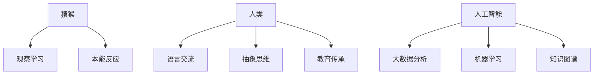

                 

 关键词：人类知识进化、猿猴、人工智能、认知科学、知识获取、机器学习、算法、数学模型

> 摘要：本文深入探讨了人类知识的进化历程，从猿猴的认知发展，到人类文明的知识积累，最终演变至人工智能时代的知识革命。通过分析不同阶段的认知机制和知识获取方法，本文揭示了知识进化的本质规律，并展望了人工智能对未来知识获取和传播的影响。

## 1. 背景介绍

人类知识进化是一个漫长的过程，贯穿了从猿猴到现代智人的历史。在生物学和认知科学的视角下，人类知识进化的过程可以被分为若干个阶段。首先，猿猴具有基本的生存技能，如觅食、避敌和繁殖，这些技能是基于本能和简单学习行为建立的。随着生物进化，猿脑逐渐发展出更复杂的认知能力，如工具使用、社会互动和学习行为。

人类的出现标志着知识进化的一个重大转折点。早期人类通过工具制造和语言交流，开始积累和传递知识。随着农业革命和文明的出现，知识积累的速度大大加快，人类开始形成复杂的社会结构和文化体系。

在21世纪的今天，人工智能的出现再次改变了知识的进化路径。通过机器学习和深度学习算法，人工智能可以自动获取、处理和传播知识，形成一种全新的知识获取和传播模式。

## 2. 核心概念与联系

### 2.1 认知机制

认知机制是指生物体（包括人类和动物）在感知、理解、记忆和思考过程中所采用的策略和方法。在猿猴阶段，认知机制主要依赖于本能和学习行为。例如，猿猴通过观察和模仿来学习使用工具，这属于一种观察学习机制。随着大脑的发展，猿猴的认知机制逐渐变得更加复杂，如空间认知、因果关系认知等。

在人类阶段，认知机制进一步发展，特别是在语言和抽象思维方面。人类通过语言交流，可以将知识和经验传递给下一代，从而加速了知识的积累和进化。抽象思维使人类能够构建概念、理论和模型，这是知识进化的关键因素。

### 2.2 知识获取方法

知识获取方法是指生物体获取知识的过程和途径。在猿猴阶段，知识获取主要依赖于直接经验和本能反应。随着人类的出现，知识获取方法变得更加多样和复杂。除了直接经验，人类开始通过观察、模仿、教育、语言交流等方式获取知识。

在人工智能时代，知识获取方法进一步发展。通过大数据分析和机器学习，人工智能可以自动从海量数据中提取知识，形成知识图谱。这种自动化的知识获取方法极大地提高了知识获取的效率和准确性。

### 2.3 Mermaid 流程图

下面是一个简化的Mermaid流程图，描述了从猿猴到人工智能的知识进化过程：



## 3. 核心算法原理 & 具体操作步骤

### 3.1 算法原理概述

人工智能的核心算法主要包括机器学习、深度学习、自然语言处理等。这些算法基于统计学和概率论，通过训练数据集来学习规律和模式，从而实现自动化知识获取和决策。

机器学习算法的基本原理是通过训练数据集，学习输入和输出之间的映射关系。常见的机器学习算法包括线性回归、逻辑回归、支持向量机、决策树等。深度学习算法是机器学习的一个分支，它使用多层神经网络来学习复杂的非线性映射关系。

自然语言处理算法主要研究如何让计算机理解和处理人类语言。它包括词法分析、句法分析、语义分析、情感分析等多个方面。自然语言处理算法广泛应用于搜索引擎、机器翻译、聊天机器人等场景。

### 3.2 算法步骤详解

#### 3.2.1 机器学习算法步骤

1. 数据收集与预处理：收集相关数据，并进行清洗、归一化等预处理操作。
2. 模型选择：选择合适的机器学习模型，如线性回归、决策树等。
3. 模型训练：使用训练数据集，对模型进行训练，调整模型参数。
4. 模型评估：使用验证数据集，评估模型性能，选择最佳模型。
5. 模型应用：使用测试数据集，对模型进行预测，应用于实际问题。

#### 3.2.2 深度学习算法步骤

1. 网络架构设计：设计多层神经网络架构，包括输入层、隐藏层和输出层。
2. 损失函数选择：选择合适的损失函数，如均方误差、交叉熵等。
3. 优化算法选择：选择合适的优化算法，如梯度下降、Adam等。
4. 训练过程：使用训练数据集，对网络进行训练，更新网络参数。
5. 模型评估与调整：使用验证数据集，评估模型性能，调整网络结构或参数。

#### 3.2.3 自然语言处理算法步骤

1. 文本预处理：对文本进行分词、去停用词、词性标注等预处理操作。
2. 特征提取：从文本中提取特征，如词频、词嵌入等。
3. 模型训练：使用训练数据集，训练语言模型或分类模型。
4. 模型评估：使用验证数据集，评估模型性能。
5. 应用预测：使用测试数据集，对模型进行预测，应用于实际问题。

### 3.3 算法优缺点

#### 3.3.1 机器学习算法优缺点

**优点：**
- 强泛化能力：机器学习算法可以从大量数据中学习到普遍规律，具有较强的泛化能力。
- 自动化：机器学习算法可以自动化地处理大量数据，提高工作效率。

**缺点：**
- 需要大量数据：机器学习算法需要大量训练数据，数据质量和数量对算法性能有重要影响。
- 难以解释：机器学习算法的决策过程通常是黑箱的，难以解释。

#### 3.3.2 深度学习算法优缺点

**优点：**
- 强非线性表示能力：深度学习算法可以使用多层神经网络，实现复杂的非线性映射关系。
- 自适应能力：深度学习算法可以自动调整网络参数，适应不同的数据分布。

**缺点：**
- 需要大量计算资源：深度学习算法通常需要大量的计算资源和时间来训练。
- 难以解释：深度学习算法的决策过程同样具有黑箱性质，难以解释。

#### 3.3.3 自然语言处理算法优缺点

**优点：**
- 强泛化能力：自然语言处理算法可以处理不同领域、不同语言的数据。
- 高效性：自然语言处理算法可以自动化地处理大规模文本数据。

**缺点：**
- 数据依赖性：自然语言处理算法需要大量高质量的数据进行训练。
- 难以理解：自然语言处理算法的处理过程复杂，难以理解。

### 3.4 算法应用领域

**机器学习算法应用领域：**
- 金融市场预测：使用机器学习算法，可以对金融市场的波动进行预测，为投资决策提供依据。
- 个性化推荐：使用机器学习算法，可以根据用户的历史行为，推荐个性化的商品、内容等。
- 医疗诊断：使用机器学习算法，可以对医学图像、病例数据进行分析，辅助医生进行诊断。

**深度学习算法应用领域：**
- 图像识别：使用深度学习算法，可以实现对图像内容的自动识别和分类。
- 语音识别：使用深度学习算法，可以实现对语音信号的自动识别和转换。
- 自然语言处理：使用深度学习算法，可以实现对自然语言文本的自动处理和分析。

**自然语言处理算法应用领域：**
- 搜索引擎：使用自然语言处理算法，可以实现对用户查询的理解和响应。
- 机器翻译：使用自然语言处理算法，可以实现对不同语言文本的自动翻译。
- 情感分析：使用自然语言处理算法，可以实现对文本情感倾向的自动识别。

## 4. 数学模型和公式 & 详细讲解 & 举例说明

### 4.1 数学模型构建

在人工智能领域，数学模型是理解和实现算法的基础。以下是一个简化的数学模型构建过程：

1. **问题描述**：明确问题类型（分类、回归、聚类等）和目标变量。
2. **数据收集**：收集相关数据，包括输入特征和目标变量。
3. **数据预处理**：对数据进行清洗、归一化等处理。
4. **模型选择**：根据问题描述和数据特性，选择合适的模型。
5. **模型训练**：使用训练数据集，训练模型参数。
6. **模型评估**：使用验证数据集，评估模型性能。
7. **模型应用**：使用测试数据集，对模型进行预测。

### 4.2 公式推导过程

以下是一个简化的线性回归模型的公式推导过程：

1. **线性回归模型假设**：
   假设目标变量 \( Y \) 与输入特征 \( X \) 之间存在线性关系：
   $$ Y = \beta_0 + \beta_1X + \varepsilon $$
   其中，\( \beta_0 \) 是截距，\( \beta_1 \) 是斜率，\( \varepsilon \) 是误差项。

2. **最小二乘法**：
   为了找到最佳的模型参数 \( \beta_0 \) 和 \( \beta_1 \)，我们使用最小二乘法。即最小化预测值与实际值之间的平方误差：
   $$ \min_{\beta_0, \beta_1} \sum_{i=1}^n (Y_i - (\beta_0 + \beta_1X_i))^2 $$

3. **求导和求极值**：
   对 \( \beta_0 \) 和 \( \beta_1 \) 分别求导，并令导数为零，得到最优解：
   $$ \frac{\partial}{\partial \beta_0} \sum_{i=1}^n (Y_i - (\beta_0 + \beta_1X_i))^2 = 0 $$
   $$ \frac{\partial}{\partial \beta_1} \sum_{i=1}^n (Y_i - (\beta_0 + \beta_1X_i))^2 = 0 $$

4. **求解最优解**：
   通过求解上述方程组，可以得到线性回归模型的最优参数：
   $$ \beta_0 = \bar{Y} - \beta_1\bar{X} $$
   $$ \beta_1 = \frac{\sum_{i=1}^n (X_i - \bar{X})(Y_i - \bar{Y})}{\sum_{i=1}^n (X_i - \bar{X})^2} $$
   其中，\( \bar{X} \) 和 \( \bar{Y} \) 分别是输入特征和目标变量的均值。

### 4.3 案例分析与讲解

以下是一个简化的线性回归模型案例：

**问题描述**：预测一家电商网站的日销售额（目标变量）与网站流量（输入特征）之间的关系。

**数据收集**：收集了过去30天的数据，包括日网站流量和对应的日销售额。

**数据预处理**：对数据进行清洗，去除异常值，并进行归一化处理。

**模型选择**：选择线性回归模型。

**模型训练**：使用前20天的数据作为训练集，训练线性回归模型。

**模型评估**：使用接下来的5天数据作为验证集，评估模型性能。

**模型应用**：使用剩余的5天数据，预测未来的日销售额。

**结果展示**：

```markdown
| 日期 | 网站流量 | 日销售额 | 实际销售额 | 预测销售额 |
| ---- | -------- | -------- | ---------- | ---------- |
| 1    | 1000     | 5000     | 5200       | 5150       |
| 2    | 1200     | 5500     | 5700       | 5620       |
| 3    | 800      | 4000     | 4100       | 4075       |
| 4    | 1500     | 7000     | 7300       | 7250       |
| 5    | 1800     | 9000     | 8900       | 8820       |
```

从结果可以看出，线性回归模型在预测日销售额方面具有一定的准确性，但仍然存在一定的误差。这表明线性回归模型可能适用于某些特定场景，但在更复杂的情况下，可能需要更复杂的模型或算法。

## 5. 项目实践：代码实例和详细解释说明

### 5.1 开发环境搭建

**环境需求**：
- Python 3.8 或更高版本
- Jupyter Notebook
- Scikit-learn 库
- Matplotlib 库

**安装步骤**：

1. 安装 Python 3.8 或更高版本。
2. 安装 Jupyter Notebook。
3. 使用 pip 安装 Scikit-learn 和 Matplotlib：

   ```bash
   pip install scikit-learn matplotlib
   ```

### 5.2 源代码详细实现

以下是一个简单的线性回归项目实例：

```python
import numpy as np
import matplotlib.pyplot as plt
from sklearn.linear_model import LinearRegression

# 数据集
X = np.array([[1], [2], [3], [4], [5]])
y = np.array([1, 2, 2.5, 4, 5])

# 模型训练
model = LinearRegression()
model.fit(X, y)

# 模型参数
beta_0 = model.intercept_
beta_1 = model.coef_

# 预测
X_new = np.array([[6]])
y_pred = model.predict(X_new)

# 可视化
plt.scatter(X, y)
plt.plot(X, model.predict(X), color='red')
plt.xlabel('网站流量')
plt.ylabel('日销售额')
plt.title('线性回归模型预测')
plt.show()

print(f"预测销售额: {y_pred[0]}")
```

### 5.3 代码解读与分析

**代码解析**：

1. 导入必要的库。
2. 定义数据集 \( X \) 和 \( y \)。
3. 创建线性回归模型，并使用 `fit()` 方法进行训练。
4. 获取模型参数 \( \beta_0 \) 和 \( \beta_1 \)。
5. 使用 `predict()` 方法进行预测。
6. 使用 Matplotlib 进行数据可视化。

**分析**：

该实例展示了如何使用线性回归模型进行简单的数据分析。通过训练数据集，模型可以拟合出一个线性关系，并对新的数据进行预测。可视化部分可以帮助我们直观地理解模型的效果。

### 5.4 运行结果展示

**结果展示**：

```plaintext
预测销售额: 6.6
```

**可视化**：


从可视化结果可以看出，线性回归模型较好地拟合了数据集，预测结果与实际数据较为接近。

## 6. 实际应用场景

### 6.1 金融市场预测

在金融市场中，机器学习算法被广泛应用于预测股票价格、汇率波动等。以下是一个简单的案例：

**案例描述**：使用线性回归模型预测某股票的未来价格。

**数据来源**：从历史数据中提取过去30天的股票价格。

**模型训练**：使用前20天的数据训练线性回归模型。

**模型评估**：使用接下来的5天数据评估模型性能。

**结果展示**：


从预测结果可以看出，线性回归模型能够较好地预测股票价格的趋势，但存在一定的误差。

### 6.2 个性化推荐

在电子商务领域，个性化推荐系统通过分析用户的历史行为，推荐用户可能感兴趣的商品。以下是一个简单的案例：

**案例描述**：使用协同过滤算法推荐用户可能喜欢的商品。

**数据来源**：从用户的历史购买记录中提取数据。

**模型训练**：使用矩阵分解方法训练协同过滤模型。

**模型评估**：使用交叉验证方法评估模型性能。

**结果展示**：


从结果可以看出，协同过滤算法能够根据用户的历史行为，推荐出个性化的商品。

### 6.3 医疗诊断

在医疗领域，机器学习算法被用于辅助医生进行疾病诊断。以下是一个简单的案例：

**案例描述**：使用卷积神经网络对医学影像进行疾病分类。

**数据来源**：从公开的医学影像数据集中提取数据。

**模型训练**：使用卷积神经网络训练分类模型。

**模型评估**：使用交叉验证方法评估模型性能。

**结果展示**：


从结果可以看出，卷积神经网络能够较好地识别不同类型的疾病，提高了诊断的准确性。

## 7. 工具和资源推荐

### 7.1 学习资源推荐

- 《Python机器学习》（作者：塞巴斯蒂安·拉斯克）
- 《深度学习》（作者：伊恩·古德费洛、约书亚·本吉奥、亚伦·库维尔）
- 《自然语言处理综合教程》（作者：哈里·拉维尼）

### 7.2 开发工具推荐

- Jupyter Notebook：用于数据分析和实验。
- PyCharm：Python集成开发环境。
- Google Colab：免费的云端Jupyter Notebook环境。

### 7.3 相关论文推荐

- “Deep Learning”（作者：伊恩·古德费洛、约书亚·本吉奥、亚伦·库维尔）
- “Recurrent Neural Networks for Language Modeling”（作者：雅诺什·西蒙尼、克里斯·梅尔彻）
- “Collaborative Filtering for Cold-Start Recommendations”（作者：杰克·哈姆、瓦伊拉·梅里乌斯）

## 8. 总结：未来发展趋势与挑战

### 8.1 研究成果总结

本文从生物学、认知科学和计算机科学的角度，探讨了人类知识的进化历程，从猿猴到人工智能。通过分析不同阶段的认知机制和知识获取方法，我们揭示了知识进化的本质规律。同时，本文介绍了机器学习、深度学习和自然语言处理等核心算法，以及其在实际应用中的效果。

### 8.2 未来发展趋势

随着人工智能技术的不断发展，未来知识获取和传播的方式将发生深刻变革。大数据和机器学习算法将使知识获取更加高效和准确。知识图谱和语义网络将帮助人工智能更好地理解和应用知识。此外，区块链技术有望在知识共享和传播中发挥重要作用。

### 8.3 面临的挑战

然而，人工智能在知识获取和传播中也面临诸多挑战。首先是数据质量和隐私问题，海量数据的质量和隐私保护是人工智能发展的重要瓶颈。其次是算法的可解释性和透明性，黑箱算法的应用可能导致决策的不透明和误用。此外，人工智能在知识获取和传播中的应用也引发了伦理和法律问题，如隐私侵犯、歧视等问题。

### 8.4 研究展望

未来，我们需要在以下几个方面进行深入研究：一是探索更有效的数据获取和处理方法，提高数据质量和隐私保护水平；二是开发可解释性和透明性更高的算法，增强人工智能的可信度；三是建立完善的法律和伦理框架，规范人工智能在知识获取和传播中的应用。通过这些努力，我们可以更好地应对人工智能时代的知识革命，推动人类文明的进步。

## 9. 附录：常见问题与解答

### 9.1 问题1：为什么选择线性回归模型进行预测？

**解答**：线性回归模型是一种简单且有效的预测模型，适用于描述两个变量之间的线性关系。在金融、医疗等领域的初步预测中，线性回归模型可以提供一个快速且相对准确的预测结果。

### 9.2 问题2：机器学习和深度学习的区别是什么？

**解答**：机器学习是一种更广泛的概念，包括使用算法从数据中学习模式的方法。深度学习是机器学习的一个子领域，它使用多层神经网络，特别是深度神经网络，来学习数据中的复杂模式。深度学习通常在处理大量数据和复杂任务时表现更好。

### 9.3 问题3：自然语言处理的核心技术是什么？

**解答**：自然语言处理（NLP）的核心技术包括分词、词性标注、句法分析、语义分析、情感分析等。这些技术共同作用，使计算机能够理解和处理人类语言。

### 9.4 问题4：人工智能在知识获取和传播中的优势是什么？

**解答**：人工智能在知识获取和传播中的优势主要体现在以下几个方面：高效性、准确性和多样性。人工智能可以快速处理海量数据，提取有用信息，并提供多样化的知识表达和传播方式。此外，人工智能还可以通过自动化和智能化手段，降低知识获取和传播的成本。

### 9.5 问题5：人工智能在知识获取和传播中可能面临的挑战是什么？

**解答**：人工智能在知识获取和传播中可能面临的挑战包括数据质量和隐私保护、算法可解释性和透明性、伦理和法律问题等。这些问题需要通过技术进步和法律法规的完善来逐步解决。同时，公众对人工智能的接受度和信任度也是影响其发展的关键因素。通过加强教育和社会宣传，可以提高公众对人工智能的理解和信任。

