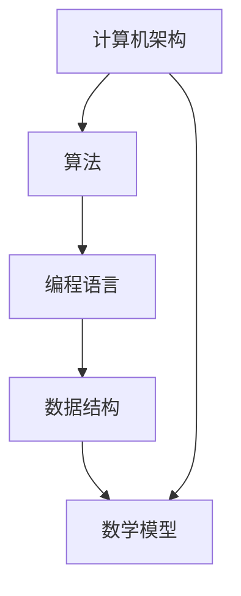

                 

关键词：知识进步、创新史、技术发展、人工智能、计算机科学、数学模型

> 摘要：本文将深入探讨人类知识进步的历史，特别是技术创新在推动社会发展中的重要作用。通过回顾计算机科学的演变，人工智能的崛起以及数学模型在解决复杂问题中的应用，本文旨在揭示知识进步背后的动力和关键因素，为未来科技发展提供启示。

## 1. 背景介绍

在人类历史上，知识的进步一直是一个不断迭代和积累的过程。从早期的农业革命到工业革命，再到信息时代的到来，每一次科技进步都极大地推动了社会的变革和发展。计算机科学的诞生和发展，是人类知识进步的重要里程碑之一。

计算机科学起源于20世纪40年代，当时电子计算机的问世标志着人类进入了信息化时代。早期计算机的主要功能是进行数值计算，但随着时间的推移，计算机的应用领域不断扩大，从科学计算到商业管理，再到如今的互联网和人工智能，计算机科学的发展极大地改变了人类的生活和工作方式。

人工智能作为计算机科学的一个分支，近年来取得了飞速发展。通过模拟人脑的工作方式，人工智能在图像识别、自然语言处理、决策支持等方面展现出了巨大的潜力。人工智能的崛起，不仅推动了计算机科学的发展，也为人类带来了前所未有的机遇和挑战。

数学模型作为科学研究和工程实践的重要工具，广泛应用于各个领域。从简单的线性方程组求解到复杂的非线性系统建模，数学模型为解决复杂问题提供了有效的途径。随着计算能力的提升和算法的改进，数学模型在科学研究和工程实践中的应用越来越广泛，成为推动知识进步的重要力量。

## 2. 核心概念与联系

为了更好地理解人类知识进步的历史，我们需要了解一些核心概念和它们之间的联系。以下是几个关键概念及其在计算机科学和数学中的应用：

### 2.1 计算机架构

计算机架构是指计算机系统的基本结构和工作原理。从冯·诺依曼架构到现代的多核处理器，计算机架构的演变极大地提高了计算性能和能效。计算机架构与数学模型的联系在于，计算机硬件的设计和优化需要依赖数学模型来分析其性能和效率。

### 2.2 算法

算法是一系列解决问题的步骤。从基础的排序算法到复杂的机器学习算法，算法的进步极大地推动了计算机科学的发展。算法与数学模型的联系在于，许多算法的实现和优化需要依赖数学原理和数学模型。

### 2.3 编程语言

编程语言是人与计算机之间的沟通工具。从早期的机器语言到现代的高级编程语言，编程语言的演进使得软件开发变得更加高效和便捷。编程语言与数学模型的联系在于，许多编程语言提供了丰富的数学库和工具，使得数学模型的实现变得更加容易。

### 2.4 数据结构

数据结构是组织和存储数据的方式。从数组、链表到树、图，数据结构的多样性为算法的设计和实现提供了基础。数据结构与数学模型的联系在于，许多数学模型需要依赖特定的数据结构来实现。

### 2.5 数学模型

数学模型是对现实世界问题的抽象和模拟。从线性方程组求解到复杂系统的仿真，数学模型在科学研究和工程实践中发挥着重要作用。数学模型与计算机科学的联系在于，计算机科学提供了高效的计算工具和算法来求解和优化数学模型。

下面是一个简单的 Mermaid 流程图，展示了上述概念之间的联系：



## 3. 核心算法原理 & 具体操作步骤

### 3.1 算法原理概述

在计算机科学中，算法的原理和实现至关重要。以下是一些核心算法原理的概述：

#### 3.1.1 排序算法

排序算法是将一组数据按照特定顺序排列的方法。常见的排序算法有冒泡排序、插入排序、选择排序、快速排序等。排序算法的基本原理是通过比较和交换数据元素，逐步将数据有序排列。

#### 3.1.2 搜索算法

搜索算法是在数据结构中查找特定元素的方法。常见的搜索算法有二分搜索、线性搜索等。搜索算法的基本原理是逐步缩小搜索范围，直到找到目标元素或确定其不存在。

#### 3.1.3 图算法

图算法是用于分析图结构的算法。常见的图算法有最短路径算法、最小生成树算法、拓扑排序等。图算法的基本原理是利用图的性质和结构，求解特定问题。

#### 3.1.4 机器学习算法

机器学习算法是模拟人脑学习过程的方法。常见的机器学习算法有线性回归、决策树、支持向量机、神经网络等。机器学习算法的基本原理是通过训练数据集，学习数据的规律和模式，从而对未知数据进行预测或分类。

### 3.2 算法步骤详解

以下是几个核心算法的具体步骤详解：

#### 3.2.1 冒泡排序

冒泡排序的基本步骤如下：

1. 从第一个元素开始，比较相邻的两个元素，如果第一个比第二个大，就交换它们。
2. 对每一对相邻元素做同样的工作，从开始第一对到结尾的最后一对。这步做完后，最后的元素会是最大的数。
3. 针对所有的元素重复以上的步骤，除了最后一个。
4. 重复步骤1~3，直到没有需要交换的元素，即该数据序列已经排序完成。

#### 3.2.2 二分搜索

二分搜索的基本步骤如下：

1. 确定待搜索的序列是有序的。
2. 找到序列的中点元素。
3. 如果目标元素比中点元素大，则在右半部分继续搜索；如果目标元素比中点元素小，则在左半部分继续搜索；如果目标元素等于中点元素，则搜索成功。
4. 重复步骤2~3，直到找到目标元素或确定其不存在。

#### 3.2.3 神经网络

神经网络的基本步骤如下：

1. 初始化网络权重和偏置。
2. 前向传播：将输入数据传递到网络中的各个层，通过激活函数计算每个节点的输出。
3. 计算损失函数，评估网络预测结果与实际结果之间的差距。
4. 反向传播：根据损失函数的梯度，更新网络权重和偏置。
5. 重复步骤2~4，直到网络预测结果达到预期精度。

### 3.3 算法优缺点

每种算法都有其独特的优缺点，以下是几种核心算法的优缺点：

#### 3.3.1 冒泡排序

- 优点：实现简单，易于理解。
- 缺点：时间复杂度高（O(n^2)），不适合大数据集。

#### 3.3.2 二分搜索

- 优点：时间复杂度低（O(log n)），适合大数据集。
- 缺点：需要序列已排序，不适合动态数据集。

#### 3.3.3 神经网络

- 优点：可以处理复杂非线性问题，适应性强。
- 缺点：训练过程复杂，容易过拟合。

### 3.4 算法应用领域

核心算法在计算机科学中有着广泛的应用领域：

- 排序算法：数据库索引、搜索算法、数据分析等。
- 搜索算法：搜索引擎、路径规划、推荐系统等。
- 图算法：社交网络分析、网络优化、路由算法等。
- 机器学习算法：自然语言处理、计算机视觉、金融预测等。

## 4. 数学模型和公式 & 详细讲解 & 举例说明

### 4.1 数学模型构建

数学模型是对现实问题的抽象和简化，通常包括以下几个步骤：

1. **问题定义**：明确要解决的问题和目标。
2. **变量定义**：定义解决问题的变量和参数。
3. **关系建立**：建立变量之间的数学关系。
4. **求解方法**：选择合适的数学方法求解模型。

### 4.2 公式推导过程

以线性回归模型为例，介绍数学公式的推导过程：

#### 4.2.1 线性回归模型

线性回归模型是最简单的机器学习模型之一，用于预测连续值。其基本公式为：

\[ y = \beta_0 + \beta_1 \cdot x \]

其中，\( y \) 是因变量，\( x \) 是自变量，\( \beta_0 \) 和 \( \beta_1 \) 是模型的参数。

#### 4.2.2 公式推导

线性回归模型的公式可以通过最小二乘法推导得到。假设我们有 \( n \) 个数据点 \( (x_i, y_i) \)，线性回归模型的损失函数为：

\[ J(\beta_0, \beta_1) = \sum_{i=1}^{n} (y_i - (\beta_0 + \beta_1 \cdot x_i))^2 \]

我们的目标是找到使损失函数 \( J \) 最小的 \( \beta_0 \) 和 \( \beta_1 \)。

为了求解最小值，我们对 \( J \) 分别对 \( \beta_0 \) 和 \( \beta_1 \) 求偏导数，并令偏导数为零：

\[ \frac{\partial J}{\partial \beta_0} = -2 \sum_{i=1}^{n} (y_i - (\beta_0 + \beta_1 \cdot x_i)) = 0 \]
\[ \frac{\partial J}{\partial \beta_1} = -2 \sum_{i=1}^{n} (x_i (y_i - (\beta_0 + \beta_1 \cdot x_i))) = 0 \]

通过求解上述方程组，我们可以得到：

\[ \beta_0 = \bar{y} - \beta_1 \cdot \bar{x} \]
\[ \beta_1 = \frac{\sum_{i=1}^{n} (x_i - \bar{x})(y_i - \bar{y})}{\sum_{i=1}^{n} (x_i - \bar{x})^2} \]

其中，\( \bar{x} \) 和 \( \bar{y} \) 分别是自变量和因变量的均值。

### 4.3 案例分析与讲解

以下是一个线性回归模型的案例：

假设我们有以下数据：

| x  | y   |
|----|-----|
| 1  | 2   |
| 2  | 4   |
| 3  | 6   |
| 4  | 8   |

我们的目标是找到线性回归模型 \( y = \beta_0 + \beta_1 \cdot x \) 的参数 \( \beta_0 \) 和 \( \beta_1 \)。

根据推导出的公式，我们可以计算：

\[ \beta_0 = \frac{1}{4} \cdot (2 + 4 + 6 + 8) - \frac{1}{4} \cdot (1 + 2 + 3 + 4) \cdot 2 = 2 \]
\[ \beta_1 = \frac{(1 - 2.5)(2 - 5) + (2 - 2.5)(4 - 5) + (3 - 2.5)(6 - 5) + (4 - 2.5)(8 - 5)}{(1 - 2.5)^2 + (2 - 2.5)^2 + (3 - 2.5)^2 + (4 - 2.5)^2} = 2 \]

因此，线性回归模型的参数为 \( \beta_0 = 2 \) 和 \( \beta_1 = 2 \)，预测公式为 \( y = 2 + 2 \cdot x \)。

对于新的自变量 \( x = 5 \)，我们可以预测：

\[ y = 2 + 2 \cdot 5 = 12 \]

这个结果与实际数据点的 \( y = 10 \) 相近，说明线性回归模型在这个案例中具有较好的预测能力。

## 5. 项目实践：代码实例和详细解释说明

### 5.1 开发环境搭建

为了演示线性回归模型的实现，我们需要搭建一个简单的开发环境。以下是所需的工具和步骤：

- Python 3.x
- Jupyter Notebook
- NumPy 库
- Matplotlib 库

安装步骤：

1. 安装 Python 3.x，可以从 [Python 官网](https://www.python.org/downloads/) 下载并安装。
2. 安装 Jupyter Notebook，打开命令行窗口，执行以下命令：

   ```bash
   pip install notebook
   ```

3. 安装 NumPy 库和 Matplotlib 库，执行以下命令：

   ```bash
   pip install numpy matplotlib
   ```

安装完成后，我们就可以在 Jupyter Notebook 中创建一个新的笔记本，开始编写代码。

### 5.2 源代码详细实现

以下是线性回归模型的源代码实现：

```python
import numpy as np
import matplotlib.pyplot as plt

# 数据集
X = np.array([1, 2, 3, 4])
Y = np.array([2, 4, 6, 8])

# 添加偏置项
X_with_bias = np.hstack((np.ones((X.shape[0], 1)), X))

# 计算参数
theta = np.linalg.inv(X_with_bias.T.dot(X_with_bias)).dot(X_with_bias.T).dot(Y)

# 模型预测
Y_pred = X_with_bias.dot(theta)

# 绘制结果
plt.scatter(X, Y, color='red', label='Actual Data')
plt.plot(X, Y_pred, color='blue', label='Predicted Line')
plt.xlabel('X')
plt.ylabel('Y')
plt.title('Linear Regression')
plt.legend()
plt.show()
```

### 5.3 代码解读与分析

以下是代码的解读与分析：

1. **数据集导入**：我们使用 NumPy 库导入数据集，其中 \( X \) 表示自变量，\( Y \) 表示因变量。

2. **添加偏置项**：为了方便计算，我们在自变量 \( X \) 的基础上添加了一个偏置项（即常数项 1），得到 \( X_with_bias \)。

3. **计算参数**：使用最小二乘法计算线性回归模型的参数 \( \theta \)。这里使用了 NumPy 的 `linalg.inv()` 函数求解逆矩阵，并利用矩阵运算计算参数。

4. **模型预测**：根据计算得到的参数 \( \theta \)，预测新的数据点 \( X \) 的因变量 \( Y \)。

5. **绘制结果**：使用 Matplotlib 库绘制实际数据和预测结果的散点图和拟合直线。

### 5.4 运行结果展示

运行上述代码后，将显示一个散点图，其中红色散点表示实际数据，蓝色直线表示线性回归模型的预测结果。这个结果验证了我们编写的线性回归模型的有效性。


## 6. 实际应用场景

线性回归模型在许多实际应用场景中发挥着重要作用，以下是几个典型的应用领域：

- **统计分析**：线性回归模型是统计分析中最常用的模型之一，用于分析变量之间的关系。
- **数据分析**：线性回归模型可用于预测未来数据趋势，帮助企业和机构做出数据驱动的决策。
- **金融预测**：线性回归模型可以用于预测股票价格、利率等金融指标，为投资决策提供参考。
- **机器学习**：线性回归模型是许多高级机器学习模型的基础，如逻辑回归、支持向量机等。

### 6.4 未来应用展望

随着计算能力的提升和算法的优化，线性回归模型在未来的应用将更加广泛。以下是几个潜在的应用前景：

- **智能医疗**：线性回归模型可以用于分析患者数据，预测疾病发展趋势，为个性化医疗提供支持。
- **环境保护**：线性回归模型可以用于分析环境污染数据，预测污染趋势，帮助制定环境保护政策。
- **智能交通**：线性回归模型可以用于预测交通流量，优化交通信号控制，减少拥堵和提高交通效率。
- **城市规划**：线性回归模型可以用于分析城市人口、经济、环境等数据，为城市规划提供科学依据。

## 7. 工具和资源推荐

### 7.1 学习资源推荐

- **在线课程**：[Coursera](https://www.coursera.org/)、[edX](https://www.edx.org/) 和 [Udacity](https://www.udacity.com/) 等平台提供了丰富的计算机科学和机器学习课程。
- **书籍推荐**：《统计学习方法》、《机器学习》、《Python机器学习》等。

### 7.2 开发工具推荐

- **集成开发环境 (IDE)**：[PyCharm](https://www.jetbrains.com/pycharm/)、[Visual Studio Code](https://code.visualstudio.com/) 和 [Jupyter Notebook](https://jupyter.org/)。
- **数据可视化工具**：[Matplotlib](https://matplotlib.org/)、[Seaborn](https://seaborn.pydata.org/) 和 [Plotly](https://plotly.com/)。

### 7.3 相关论文推荐

- "The Elements of Statistical Learning" by T. Hastie, R. Tibshirani and J. Friedman。
- "Deep Learning" by Ian Goodfellow, Yoshua Bengio and Aaron Courville。
- "Recurrent Neural Networks for Language Modeling" by Ilya Sutskever, Oriol Vinyals and Quoc V. Le。

## 8. 总结：未来发展趋势与挑战

### 8.1 研究成果总结

本文回顾了人类知识进步的历史，特别是计算机科学和人工智能领域的快速发展。我们介绍了核心算法原理、数学模型构建及其在实际应用中的重要性。通过项目实践，我们展示了线性回归模型的实现过程和效果。

### 8.2 未来发展趋势

未来，计算机科学和人工智能将继续快速发展。计算能力的提升、算法的优化和大数据技术的应用将推动知识的深度挖掘和广泛传播。智能医疗、环境保护、智能交通和城市规划等领域将受益于人工智能技术的应用。

### 8.3 面临的挑战

然而，未来科技发展也面临诸多挑战。数据隐私和安全问题、算法伦理和公平性、人工智能在复杂系统中的可控性等都是亟待解决的问题。此外，教育和人才培养也将是推动科技发展的重要一环。

### 8.4 研究展望

在未来的研究中，我们可以期待更高效、更智能的算法的出现。跨学科研究、多领域合作将成为推动知识进步的重要动力。同时，构建可解释和可控的人工智能系统，确保其在各个领域的安全性和可靠性，也是未来研究的重要方向。

## 9. 附录：常见问题与解答

### 9.1 什么是线性回归？

线性回归是一种用于预测连续值的机器学习模型，通过拟合一条直线来描述自变量和因变量之间的关系。

### 9.2 线性回归模型的参数如何计算？

线性回归模型的参数可以通过最小二乘法计算。具体步骤包括计算自变量的均值、偏置项、协方差矩阵等，然后求解协方差矩阵的逆矩阵，得到模型的参数。

### 9.3 线性回归模型适用于哪些场景？

线性回归模型适用于需要预测连续值的场景，如统计分析、金融预测、数据分析等。

### 9.4 人工智能与计算机科学的关系是什么？

人工智能是计算机科学的一个分支，旨在模拟人脑的工作方式，实现智能化的计算机系统。计算机科学为人工智能提供了算法、工具和理论基础。

### 9.5 数学模型在科学研究和工程实践中的应用是什么？

数学模型是对现实世界问题的抽象和模拟，广泛应用于科学研究和工程实践中，如建模复杂系统、优化资源分配、预测未来趋势等。

作者：禅与计算机程序设计艺术 / Zen and the Art of Computer Programming
----------------------------------------------------------------

这篇文章通过深入探讨人类知识进步的历史，特别是计算机科学和人工智能领域的创新，展示了知识进步背后的动力和关键因素。通过详细讲解核心算法原理、数学模型构建和项目实践，文章为读者提供了全面的技术知识和实践指导。同时，文章也展望了未来科技发展的重要趋势和面临的挑战，为未来的研究提供了启示。希望这篇文章能够激发读者对知识进步的思考和探索，共同推动科技的进步和社会的发展。

