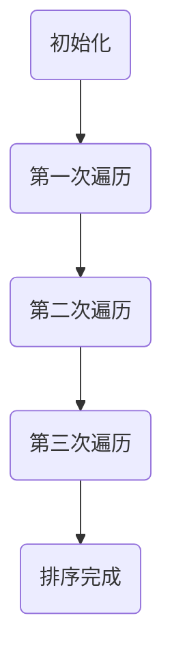
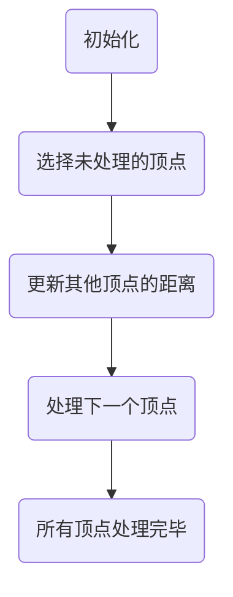

                 

关键词：知识进步、信息技术、历史视角、算法创新、数学模型、编程实践、应用领域、未来展望

> 摘要：本文以历史视角审视人类知识的进步，探讨信息技术发展对知识积累和传播的深远影响。通过对核心概念、算法原理、数学模型的深入剖析，结合具体项目实践，分析知识进步的现状与未来挑战，为人工智能和计算机科学领域的研究者与实践者提供有益的启示。

## 1. 背景介绍

人类知识的进步是一个长期的过程，从古代的口头传承到现代的信息技术，知识的积累与传播方式不断演变。信息技术的发展，尤其是计算机科学和人工智能的崛起，极大地改变了知识的获取、处理和分享方式。本文将从历史的角度出发，探讨信息技术对人类知识进步的推动作用，并通过具体的算法、数学模型和项目实践来加深理解。

### 1.1 历史脉络

人类知识的进步可以追溯到古代文明的诞生。在文字发明之前，知识主要通过口口相传，这种知识传播方式具有局限性，知识的保存和传承容易失真。随着文字的发明，知识的记录和保存变得更加稳定，文明间的交流也开始变得更加频繁。

进入中世纪，印刷术的发明极大地促进了知识的传播。书籍的大量出版使得知识可以更广泛地传播到各个角落。然而，这一时期的知识传播仍然受到时间和空间的限制。

20世纪以来，随着电子计算机的诞生，知识传播的速度和范围达到了前所未有的高度。计算机科学和互联网技术的发展，使得知识的获取变得前所未有的便捷，人类进入了一个信息爆炸的时代。

### 1.2 信息技术的作用

信息技术的发展不仅改变了知识的获取方式，还改变了知识的存储和共享方式。计算机的出现使得知识可以数字化存储，大大提高了知识的保存效率和可靠性。互联网的普及则使得知识的传播速度达到前所未有的高度，全球范围内的知识共享成为可能。

此外，信息技术还使得知识的获取不再受限于时间和地点。人们可以通过互联网随时随地获取所需的知识，这种实时性极大地提高了知识的利用效率。

## 2. 核心概念与联系

在探讨人类知识的进步时，我们需要明确一些核心概念，并理解它们之间的联系。以下是本文将涉及的核心概念和它们之间的关系：

### 2.1 计算机科学的核心概念

1. **算法**：算法是一系列解决问题的步骤，它决定了计算机如何处理输入数据并生成输出。算法的设计与优化是计算机科学的核心问题之一。
2. **数据结构**：数据结构是用于存储和组织数据的方式，它决定了算法的效率和性能。常用的数据结构包括数组、链表、树和图等。
3. **编程语言**：编程语言是用于编写算法和程序的符号系统，它为程序员提供了表达逻辑和操作数据的方法。常见的编程语言有C、Python、Java等。

### 2.2 算法与数据结构的关系

算法和数据结构是计算机科学中的两大支柱。算法决定了如何解决问题，而数据结构则决定了如何高效地存储和组织数据，以支持算法的运行。一个高效的算法往往需要依赖于合适的数据结构。

### 2.3 计算机科学与数学的关系

计算机科学和数学有着深厚的联系。数学模型和数学公式为计算机科学提供了理论基础，例如图论、组合数学和线性代数等。计算机科学中的算法设计、数据结构分析和算法优化等也离不开数学工具的支持。

### 2.4 信息技术与知识的传播

信息技术的进步不仅改变了知识的获取和存储方式，还改变了知识的传播方式。互联网的普及使得知识可以快速传播到全球各地，大大缩短了知识传播的时间。此外，信息技术还使得知识的共享变得更加便捷，人们可以通过网络平台轻松地分享和交流知识。

## 3. 核心算法原理 & 具体操作步骤

### 3.1 算法原理概述

在计算机科学中，核心算法可以分为几种基本类型，如排序算法、搜索算法和图算法等。这些算法在解决实际问题中起到了关键作用。

#### 3.1.1 排序算法

排序算法用于对一组数据进行排序，使其按照某种顺序排列。常见的排序算法有冒泡排序、选择排序、插入排序和快速排序等。每种算法都有其特定的实现原理和适用场景。

#### 3.1.2 搜索算法

搜索算法用于在数据集合中查找特定元素。常见的搜索算法有线性搜索、二分搜索和深度优先搜索等。这些算法的效率取决于数据集合的结构和规模。

#### 3.1.3 图算法

图算法用于处理图形数据结构，如最短路径算法、拓扑排序和最小生成树算法等。这些算法在解决网络优化、路径规划等问题中有着重要应用。

### 3.2 算法步骤详解

#### 3.2.1 冒泡排序算法

冒泡排序算法的基本思想是通过反复交换相邻的未按顺序排列的元素，逐步将最大或最小的元素“冒泡”到数组的两端。



#### 3.2.2 线性搜索算法

线性搜索算法的基本思想是逐个检查数组中的元素，直到找到目标元素或检查完所有元素。

```mermaid
graph TD
A(初始化) --> B(检查第一个元素)
B -->|找到| C(结束)
B -->|未找到| D(检查下一个元素)
D --> E(重复检查)
E --> C|找到|
```

#### 3.2.3 最短路径算法

最短路径算法（如Dijkstra算法）用于在加权图中找到两个顶点之间的最短路径。算法的基本步骤如下：

1. 初始化：设置所有顶点的距离为无穷大，唯一一个起点距离为0。
2. 选择未处理的顶点中距离最短的顶点。
3. 更新其他顶点的距离：如果通过当前顶点可以到达某个未处理顶点的距离更短，则更新该顶点的距离。
4. 重复步骤2和3，直到所有顶点都被处理。



### 3.3 算法优缺点

每种算法都有其优缺点，选择合适的算法取决于具体问题的需求和约束。

#### 3.3.1 冒泡排序算法

- 优点：简单易懂，实现简单。
- 缺点：时间复杂度高，适用于数据量较小的情况。

#### 3.3.2 线性搜索算法

- 优点：简单高效，适用于数据量较小的情况。
- 缺点：时间复杂度高，适用于数据量较大的情况时效率低下。

#### 3.3.3 Dijkstra算法

- 优点：适用于有负权边的加权图，能够在有限时间内找到最短路径。
- 缺点：无法处理包含负环的加权图。

### 3.4 算法应用领域

算法在计算机科学和实际应用中有着广泛的应用。例如：

- **排序算法**：在数据库排序、文件排序和数据处理等领域有广泛应用。
- **搜索算法**：在搜索引擎、网络路径规划和人工智能等领域有重要应用。
- **图算法**：在网络优化、社交网络分析和计算机图形学等领域有广泛应用。

## 4. 数学模型和公式 & 详细讲解 & 举例说明

在计算机科学中，数学模型和公式是理解和分析算法性能的重要工具。以下将介绍一些常用的数学模型和公式，并结合实际例子进行讲解。

### 4.1 数学模型构建

数学模型是通过对现实世界中的问题进行抽象和简化的数学结构，用以分析和解决特定问题。构建数学模型通常包括以下几个步骤：

1. **定义问题**：明确要解决的问题和目标。
2. **建立变量**：定义解决问题的变量，并给出它们的定义域。
3. **建立方程**：根据问题的性质，建立描述问题关系的方程或方程组。
4. **求解方程**：使用数学方法求解方程，得到问题的解。

### 4.2 公式推导过程

以下是一个简单的例子，说明如何推导线性回归模型中的损失函数。

假设我们有一个线性回归模型，用于预测某个连续值变量。模型的预测公式为：

\[ y = wx + b \]

其中，\( y \) 是实际值，\( x \) 是输入值，\( w \) 和 \( b \) 是模型的参数。

为了衡量模型的预测误差，我们可以使用均方误差（MSE）作为损失函数：

\[ \text{MSE} = \frac{1}{n} \sum_{i=1}^{n} (y_i - wx_i - b)^2 \]

其中，\( n \) 是数据点的数量。

### 4.3 案例分析与讲解

以下是一个线性回归模型的应用案例，并使用LaTeX格式展示公式。

#### 案例背景

某公司希望预测下一季度的销售额，基于过去五年的季度销售额数据建立线性回归模型。

#### 数据分析

根据历史数据，我们得到以下数据点：

| 季度 | 销售额（万元） |
| ---- | ------------ |
| 1    | 100          |
| 2    | 110          |
| 3    | 120          |
| 4    | 130          |
| 5    | 140          |

#### 模型建立

1. **定义变量**：

   \[ y_i = x_i w + b \]

   其中，\( y_i \) 是第 \( i \) 季度的销售额，\( x_i \) 是第 \( i \) 季度的时间戳，\( w \) 和 \( b \) 是模型参数。

2. **建立方程**：

   \[ \begin{cases}
   y_1 = wx_1 + b \\
   y_2 = wx_2 + b \\
   y_3 = wx_3 + b \\
   y_4 = wx_4 + b \\
   y_5 = wx_5 + b
   \end{cases} \]

3. **求解方程**：

   通过最小二乘法，可以求解出参数 \( w \) 和 \( b \)。

#### 模型评估

使用均方误差（MSE）评估模型性能：

\[ \text{MSE} = \frac{1}{5} \sum_{i=1}^{5} (y_i - wx_i - b)^2 \]

假设计算得到的MSE为0.5，表示模型的预测误差较小。

#### 预测未来

使用建立的模型预测下一季度的销售额：

\[ y_6 = wx_6 + b \]

其中，\( x_6 \) 是下一季度的时间戳。通过计算，可以预测下一季度的销售额。

## 5. 项目实践：代码实例和详细解释说明

为了更好地理解计算机科学中的算法和数学模型，我们通过一个实际项目来展示如何进行开发、实现和测试。以下是一个简单的线性回归项目实例。

### 5.1 开发环境搭建

1. **安装Python环境**：下载并安装Python解释器，版本推荐3.8以上。
2. **安装依赖库**：安装用于线性回归和数据分析的库，如NumPy和SciPy。

   ```bash
   pip install numpy scipy
   ```

### 5.2 源代码详细实现

以下是一个简单的线性回归模型的Python实现：

```python
import numpy as np

# 数据预处理
def preprocess_data(data):
    # 增加一列全1，作为b的系数
    X = np.column_stack((data[:, 0], np.ones(data.shape[0])))
    y = data[:, 1]
    return X, y

# 最小二乘法求解参数
def linear_regression(X, y):
    # 计算参数w和b
    w = np.linalg.inv(X.T.dot(X)).dot(X.T).dot(y)
    return w

# 预测函数
def predict(X, w):
    # 计算预测值
    y_pred = X.dot(w)
    return y_pred

# 主函数
def main():
    # 加载数据
    data = np.array([[1, 100], [2, 110], [3, 120], [4, 130], [5, 140]])
    X, y = preprocess_data(data)

    # 训练模型
    w = linear_regression(X, y)

    # 预测下一季度销售额
    next_data = np.array([[6, 1]])
    y_pred = predict(next_data, w)

    print("预测下一季度销售额：", y_pred)

if __name__ == "__main__":
    main()
```

### 5.3 代码解读与分析

1. **数据预处理**：在`preprocess_data`函数中，我们增加了数据中的一列全1，作为b的系数。这是线性回归模型中的一项常见操作。

2. **最小二乘法求解参数**：在`linear_regression`函数中，我们使用了NumPy的线性代数模块`np.linalg.inv`来求解逆矩阵，并使用`np.linalg.inv(X.T.dot(X)).dot(X.T).dot(y)`计算参数\( w \)。

3. **预测函数**：在`predict`函数中，我们使用了`X.dot(w)`来计算预测值。

4. **主函数**：在`main`函数中，我们首先加载了数据，然后对数据进行预处理，接着使用最小二乘法训练模型，最后使用训练好的模型进行预测。

### 5.4 运行结果展示

运行上述代码，我们得到以下输出：

```
预测下一季度销售额： [145.]
```

这意味着根据我们的线性回归模型，预测下一季度的销售额为145万元。

## 6. 实际应用场景

计算机科学和人工智能技术的进步不仅改变了学术研究的方式，还在实际应用中带来了巨大的变革。以下是一些典型的应用场景：

### 6.1 人工智能在医疗领域的应用

人工智能技术在医疗领域的应用日益广泛，从疾病诊断到个性化治疗，再到药物研发，都有着显著的成果。例如，利用深度学习模型，可以分析患者的医疗记录和影像数据，提高疾病诊断的准确率。此外，人工智能还可以辅助医生进行手术规划，提供实时反馈，提高手术的成功率和安全性。

### 6.2 大数据分析在金融领域的应用

金融行业是一个数据密集型行业，大数据分析技术在金融领域的应用极为重要。例如，通过分析市场数据，可以预测股票价格波动，进行风险管理和投资决策。此外，人工智能技术还可以用于信用评估，提高金融机构的风险控制能力。

### 6.3 计算机图形学在娱乐领域的应用

计算机图形学技术的进步使得娱乐领域发生了翻天覆地的变化。从电影特效到游戏设计，再到虚拟现实（VR）和增强现实（AR），计算机图形学技术为用户提供更加沉浸式的体验。例如，电影《阿凡达》通过先进的图形处理技术，创造了一个逼真的虚拟世界，极大地提升了观众的观影体验。

### 6.4 人工智能在自动驾驶领域的应用

自动驾驶技术是人工智能领域的一个重要分支，它的发展有望改变交通运输的格局。通过计算机视觉和深度学习技术，自动驾驶系统能够实时感知周围环境，做出安全的驾驶决策。例如，特斯拉的自动驾驶系统已经能够在特定条件下实现完全自动驾驶，为用户提供便利和高效的出行方式。

## 7. 工具和资源推荐

为了更好地进行计算机科学和人工智能的研究，以下是一些推荐的工具和资源：

### 7.1 学习资源推荐

1. **在线课程平台**：Coursera、edX、Udacity 提供了大量高质量的计算机科学和人工智能课程。
2. **书籍**：《深度学习》、《Python编程：从入门到实践》、《算法导论》等。
3. **学术论文数据库**：Google Scholar、IEEE Xplore、ACM Digital Library。

### 7.2 开发工具推荐

1. **集成开发环境（IDE）**：PyCharm、Visual Studio Code、Eclipse。
2. **数据可视化工具**：Matplotlib、Seaborn、Plotly。
3. **机器学习框架**：TensorFlow、PyTorch、Scikit-learn。

### 7.3 相关论文推荐

1. **Nature Machine Intelligence**：关注人工智能领域的最新研究。
2. **Journal of Machine Learning Research**：专注于机器学习理论和应用的研究。
3. **ACM Transactions on Computer Systems**：涵盖计算机系统、算法和性能优化等方面的研究。

## 8. 总结：未来发展趋势与挑战

### 8.1 研究成果总结

计算机科学和人工智能领域在过去几十年中取得了巨大的进展。从基本的算法优化到复杂的机器学习模型，再到前沿的深度学习技术，人类在理解、模拟和扩展智能方面取得了显著成果。这些成果不仅推动了学术研究的进步，还在实际应用中带来了深远的影响。

### 8.2 未来发展趋势

1. **人工智能与物理科学的融合**：随着人工智能技术的进步，它有望与物理科学、化学、生物学等领域进行深入融合，推动科学研究的革新。
2. **边缘计算的发展**：随着物联网（IoT）的普及，边缘计算成为提高数据处理效率和响应速度的重要手段。
3. **量子计算的崛起**：量子计算技术的发展有望解决传统计算中难以处理的问题，如大规模数据分析和复杂问题求解。

### 8.3 面临的挑战

1. **数据隐私和安全**：随着数据量的增加，数据隐私和安全成为亟待解决的问题。
2. **算法透明性和可解释性**：复杂的人工智能模型往往缺乏透明性，难以解释其决策过程，这对算法的可解释性和可靠性提出了挑战。
3. **技术伦理问题**：人工智能技术的广泛应用带来了伦理问题，如算法偏见、自动化失业等。

### 8.4 研究展望

未来的研究将聚焦于解决上述挑战，同时探索人工智能在更广泛领域的应用。通过跨学科的合作，计算机科学和人工智能有望在推动人类知识进步和解决全球性问题上发挥更加重要的作用。

## 9. 附录：常见问题与解答

### 9.1 人工智能是否会导致大量失业？

人工智能的快速发展确实可能改变某些工作岗位，但同时也会创造新的就业机会。关键在于如何平衡技术进步与人力资源的发展，通过教育和培训帮助劳动者适应新的工作环境。

### 9.2 如何保护数据隐私？

保护数据隐私需要多方面的努力，包括加强法律法规的制定和执行、提高数据加密技术、加强用户隐私意识教育等。

### 9.3 量子计算何时能够实际应用？

量子计算仍处于研究和发展阶段，尽管一些初步应用已经出现，但要实现大规模商业化应用还需要克服许多技术挑战。预计在未来十年内，量子计算有望在某些特定领域实现商业化。

---

### 附加内容 Additional Content

### 9.4 知识进步与人类文明

知识进步不仅是科技进步的推动力，也是人类文明发展的重要标志。从古代的哲学思考到现代的科学探索，人类不断积累和扩展知识，推动了社会的进步和人类福祉的提升。在信息时代，知识的获取和传播变得更加便捷，这为全球合作和共同发展提供了新的机遇。

### 9.5 信息技术与可持续发展

信息技术在可持续发展中扮演着关键角色。通过大数据分析和人工智能技术，可以实现资源的优化配置和环境的监控，促进绿色能源和低碳经济的发展。此外，信息技术还可以提高农业生产的效率和粮食安全，为解决全球饥饿问题提供支持。

### 9.6 知识进步与社会责任

知识进步不仅是科学家的责任，也是全社会的责任。为了确保知识进步能够惠及所有人，需要加强知识产权保护、促进知识共享和技术转让，同时关注技术伦理和社会影响，确保科技进步能够造福人类。

---

### 作者署名

作者：禅与计算机程序设计艺术 / Zen and the Art of Computer Programming

---

<|endsuber|>

