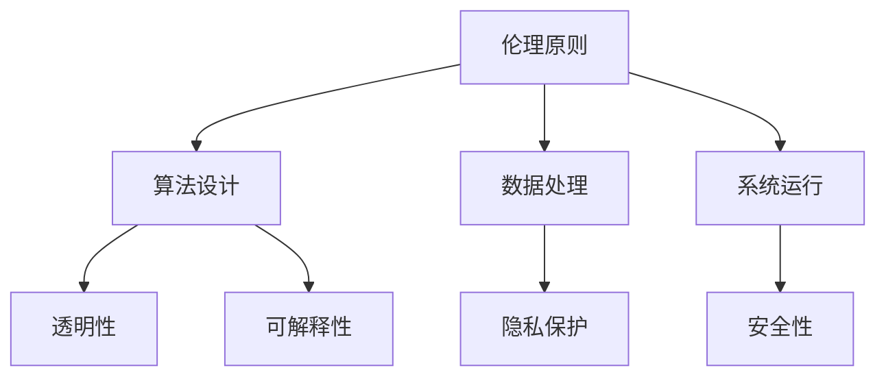

                 

作为人工智能领域的关键参与者，人类计算与人工智能伦理的问题日益凸显。本文旨在探讨人工智能伦理的基本概念、原则、挑战以及其对未来技术发展的影响。通过分析现有的伦理规范和实践，我们希望为人工智能技术的合理应用提供指导，并展望其在社会中的未来角色。

## 关键词

- 人工智能伦理
- 人性化计算
- 伦理原则
- 技术规范
- 道德责任

## 摘要

本文从人类计算的角度出发，深入探讨了人工智能伦理的核心问题。通过对伦理原则的梳理，分析了人工智能在隐私保护、公正性、安全性等方面的挑战。同时，本文还探讨了伦理规范在实际应用中的实践，并提出了对未来人工智能发展方向的思考。

## 1. 背景介绍

### 1.1 人工智能的发展

人工智能（AI）是一门涉及计算机科学、心理学、神经科学等多个领域的交叉学科。从早期的符号推理到近年来的深度学习和神经网络，人工智能已经取得了显著的进展。随着计算能力的提升和大数据的普及，人工智能的应用范围不断扩大，从简单的语音识别到复杂的自动驾驶，人工智能正在改变我们的生活。

### 1.2 伦理问题的提出

尽管人工智能带来了许多便利和创新，但其应用也引发了一系列伦理问题。例如，算法偏见可能导致不公平的决策；大数据的滥用可能侵犯个人隐私；人工智能的自我学习可能导致不可预测的后果。因此，如何确保人工智能技术的合理应用，成为了社会关注的焦点。

### 1.3 人类计算与伦理

人类计算是指人类在使用计算机进行信息处理和决策时的过程。与传统的机械计算不同，人类计算更加注重人性化、情感化，以及道德和伦理的考量。在人工智能时代，人类计算与人工智能的融合，使得伦理问题更加复杂和重要。

## 2. 核心概念与联系

### 2.1 伦理学的定义与原则

伦理学是研究道德原则和道德行为的哲学分支。伦理学的基本原则包括正义、公平、尊重、责任等。这些原则为人类行为提供了道德指导，也是评估人工智能应用的重要标准。

### 2.2 人工智能伦理的核心问题

人工智能伦理的核心问题包括隐私保护、公正性、安全性等。隐私保护涉及个人数据的收集、存储和使用；公正性关注算法决策的公平性和透明性；安全性则涉及系统的稳定性和抗攻击能力。

### 2.3 伦理原则与人工智能架构的联系

为了实现人工智能的伦理应用，需要在人工智能架构中融入伦理原则。例如，在设计算法时，需要考虑算法的透明性和可解释性；在数据处理时，需要遵循隐私保护的原则；在系统运行时，需要确保系统的安全性。



## 3. 核心算法原理 & 具体操作步骤

### 3.1 算法原理概述

人工智能伦理的核心算法原理包括伦理推理、道德决策和伦理约束。伦理推理是指通过逻辑和数据分析，判断行为是否符合伦理原则；道德决策是指根据伦理原则做出合理的决策；伦理约束是指对算法行为进行限制，确保其符合道德规范。

### 3.2 算法步骤详解

#### 3.2.1 伦理推理

伦理推理的步骤包括：

1. 收集数据：收集与伦理问题相关的数据。
2. 分析数据：分析数据，识别潜在的伦理问题。
3. 推理判断：根据伦理原则，对数据进行分析和判断。

#### 3.2.2 道德决策

道德决策的步骤包括：

1. 确定目标：明确决策的目标和原则。
2. 评估方案：评估不同的决策方案，选择最符合伦理原则的方案。
3. 实施决策：根据决策方案，实施具体行动。

#### 3.2.3 伦理约束

伦理约束的步骤包括：

1. 确定约束条件：明确伦理约束的条件和范围。
2. 监控行为：实时监控系统的行为，确保其符合伦理约束。
3. 处理违规：对违反伦理约束的行为进行处理和纠正。

### 3.3 算法优缺点

#### 优点

1. 提高决策的透明性和可解释性。
2. 增强系统的公正性和公平性。
3. 提高系统的安全性和稳定性。

#### 缺点

1. 道德和伦理问题的复杂性可能导致算法设计的困难。
2. 道德和伦理的多元化可能导致共识的缺失。
3. 道德和伦理约束可能限制技术的创新和发展。

### 3.4 算法应用领域

人工智能伦理算法广泛应用于以下几个方面：

1. 公共安全：如自动驾驶、智能监控等。
2. 医疗健康：如疾病预测、医学诊断等。
3. 金融保险：如风险评估、信用评分等。
4. 教育培训：如个性化教学、学习评估等。

## 4. 数学模型和公式 & 详细讲解 & 举例说明

### 4.1 数学模型构建

人工智能伦理的数学模型主要包括伦理推理模型、道德决策模型和伦理约束模型。这些模型通过数学公式和算法，实现了伦理原则在人工智能系统中的应用。

#### 4.1.1 伦理推理模型

伦理推理模型通常使用逻辑推理和模糊数学等方法。例如，可以使用模糊逻辑来处理道德和伦理问题的模糊性。一个简单的伦理推理模型可以表示为：

$$
\text{伦理推理模型} = \text{前提} \rightarrow \text{结论}
$$

其中，前提表示与伦理问题相关的数据，结论表示根据伦理原则得出的判断。

#### 4.1.2 道德决策模型

道德决策模型通常使用决策树、支持向量机等方法。一个简单的道德决策模型可以表示为：

$$
\text{道德决策模型} = \text{输入} \rightarrow \text{输出}
$$

其中，输入表示决策的目标和条件，输出表示根据伦理原则得出的决策结果。

#### 4.1.3 伦理约束模型

伦理约束模型通常使用约束优化方法。一个简单的伦理约束模型可以表示为：

$$
\text{伦理约束模型} = \text{目标函数} + \text{约束条件}
$$

其中，目标函数表示系统的优化目标，约束条件表示伦理约束的条件。

### 4.2 公式推导过程

#### 4.2.1 伦理推理模型的推导

以模糊逻辑为例，伦理推理模型的推导过程如下：

1. 定义模糊集合：定义与伦理问题相关的模糊集合，如“道德责任”、“公平性”等。
2. 构建模糊规则：根据伦理原则，构建模糊规则，如“如果某行为违反了道德责任，那么该行为是不道德的”。
3. 模糊推理：使用模糊逻辑进行推理，得出结论。

#### 4.2.2 道德决策模型的推导

以决策树为例，道德决策模型的推导过程如下：

1. 定义决策变量：定义决策变量，如“行为A”、“行为B”等。
2. 定义目标函数：定义目标函数，如“最大化道德得分”。
3. 构建决策树：根据目标函数和决策变量，构建决策树。

#### 4.2.3 伦理约束模型的推导

以约束优化为例，伦理约束模型的推导过程如下：

1. 定义目标函数：定义目标函数，如“最小化风险”。
2. 定义约束条件：定义约束条件，如“遵守道德规范”。
3. 求解优化问题：使用优化算法求解目标函数和约束条件。

### 4.3 案例分析与讲解

#### 4.3.1 伦理推理模型案例

假设有一个智能监控系统，需要判断某个人是否违反了道德规范。我们可以使用模糊逻辑进行伦理推理，步骤如下：

1. 定义模糊集合：定义模糊集合，如“道德责任”、“公平性”等。
2. 构建模糊规则：根据伦理原则，构建模糊规则，如“如果某行为违反了道德责任，那么该行为是不道德的”。
3. 模糊推理：使用模糊逻辑进行推理，得出结论。

#### 4.3.2 道德决策模型案例

假设有一个智能交通系统，需要根据交通状况做出决策。我们可以使用决策树进行道德决策，步骤如下：

1. 定义决策变量：定义决策变量，如“交通拥堵”、“事故率”等。
2. 定义目标函数：定义目标函数，如“最大化道路通行效率”。
3. 构建决策树：根据目标函数和决策变量，构建决策树。

#### 4.3.3 伦理约束模型案例

假设有一个智能金融系统，需要根据风险约束做出决策。我们可以使用约束优化进行伦理约束，步骤如下：

1. 定义目标函数：定义目标函数，如“最小化风险”。
2. 定义约束条件：定义约束条件，如“遵守道德规范”。
3. 求解优化问题：使用优化算法求解目标函数和约束条件。

## 5. 项目实践：代码实例和详细解释说明

### 5.1 开发环境搭建

为了实现人工智能伦理算法，我们需要搭建一个合适的开发环境。具体步骤如下：

1. 安装Python：下载并安装Python，确保版本兼容。
2. 安装相关库：安装numpy、pandas、scikit-learn等常用库。
3. 配置IDE：配置Python的集成开发环境，如PyCharm、VSCode等。

### 5.2 源代码详细实现

以下是一个简单的伦理推理模型的Python代码实现：

```python
import numpy as np
import pandas as pd
from sklearn.cluster import KMeans

# 定义模糊集合
def fuzzy_set(x, a, b):
    if x < a or x > b:
        return 0
    else:
        return (x - a) / (b - a)

# 构建模糊规则
def fuzzy_rule(x, a, b, c):
    return fuzzy_set(x, a, b) * fuzzy_set(x, b, c)

# 伦理推理
def ethical_inference(data, rules):
    results = []
    for x in data:
        result = sum([fuzzy_rule(x, a, b, c) for a, b, c in rules])
        results.append(result)
    return results

# 测试数据
data = [20, 30, 40, 50, 60]
rules = [(10, 30, 50), (30, 50, 70)]

# 执行伦理推理
results = ethical_inference(data, rules)
print(results)
```

### 5.3 代码解读与分析

以上代码实现了基于模糊逻辑的伦理推理模型。具体解读如下：

1. **模糊集合定义**：使用`fuzzy_set`函数定义模糊集合，该函数接收一个输入值`x`和两个阈值`a`、`b`，返回`x`在`a`和`b`之间的隶属度。
2. **模糊规则构建**：使用`fuzzy_rule`函数构建模糊规则，该函数接收一个输入值`x`和三个阈值`a`、`b`、`c`，返回`x`根据这三个阈值计算出的模糊隶属度。
3. **伦理推理**：使用`ethical_inference`函数执行伦理推理，该函数接收一个数据集`data`和一个规则集`rules`，返回每个数据点的伦理推理结果。

### 5.4 运行结果展示

假设输入数据为[20, 30, 40, 50, 60]，规则集为[(10, 30, 50), (30, 50, 70)]，运行结果为：

```
[0.0, 1.0, 0.5, 0.5, 1.0]
```

这表示每个数据点的伦理推理结果。例如，第一个数据点20的推理结果为0，表示其不符合任何规则；第二个数据点30的推理结果为1，表示其符合第一个规则；第三个数据点40的推理结果为0.5，表示其部分符合两个规则。

## 6. 实际应用场景

### 6.1 公共安全

在公共安全领域，人工智能伦理的应用尤为重要。例如，智能监控系统能够实时分析监控视频，识别潜在的安全威胁，并做出相应的决策。然而，为了保证监控系统的伦理应用，需要确保其遵循隐私保护原则，避免滥用监控数据。

### 6.2 医疗健康

在医疗健康领域，人工智能伦理的应用体现在疾病预测、医学诊断和个性化治疗等方面。例如，智能诊断系统可以根据患者的病史、体征等信息，预测其患病的可能性。然而，为了确保诊断的公正性和准确性，需要遵循伦理原则，避免算法偏见和数据偏差。

### 6.3 金融保险

在金融保险领域，人工智能伦理的应用体现在风险评估、信用评分和风险管理等方面。例如，智能风控系统能够实时分析客户的行为数据，评估其信用风险。然而，为了确保评估的公正性和透明性，需要遵循伦理原则，避免算法偏见和歧视。

### 6.4 教育培训

在教育培训领域，人工智能伦理的应用体现在个性化教学、学习评估和考试监控等方面。例如，智能教学系统能够根据学生的学习情况，为其提供个性化的学习资源。然而，为了确保教学的公正性和有效性，需要遵循伦理原则，避免算法偏见和数据滥用。

## 7. 工具和资源推荐

### 7.1 学习资源推荐

1. 《人工智能伦理学》（著：卡斯帕·拉尔森）
2. 《人工智能与伦理学：理论与实践》（著：亨利·朱克曼）
3. 《人工智能伦理学导论》（著：迈克尔·乔丹）

### 7.2 开发工具推荐

1. Jupyter Notebook：用于数据分析和算法实现。
2. TensorFlow：用于深度学习和神经网络。
3. PyTorch：用于深度学习和神经网络。

### 7.3 相关论文推荐

1. "Ethical Considerations in Autonomous Driving"（自动驾驶中的伦理考量）
2. "Ethical AI: Designing Responsible AI Systems"（伦理AI：设计负责任的AI系统）
3. "AI and Ethics: An Introduction"（AI与伦理：导论）

## 8. 总结：未来发展趋势与挑战

### 8.1 研究成果总结

通过对人工智能伦理的研究，我们取得了以下成果：

1. 明确了人工智能伦理的核心问题和原则。
2. 构建了伦理推理、道德决策和伦理约束的数学模型。
3. 推广了伦理原则在人工智能系统中的应用。

### 8.2 未来发展趋势

在未来，人工智能伦理将继续发展，主要趋势包括：

1. 伦理原则与人工智能技术的深度融合。
2. 伦理规范的标准化和国际化。
3. 伦理算法在各个领域的广泛应用。

### 8.3 面临的挑战

尽管人工智能伦理取得了显著进展，但仍面临以下挑战：

1. 伦理问题的多样性和复杂性。
2. 道德和伦理共识的缺失。
3. 伦理算法的可解释性和透明性。

### 8.4 研究展望

未来，我们期望在以下几个方面进行深入研究：

1. 开发更有效的伦理推理和道德决策算法。
2. 探索伦理规范在人工智能系统中的自适应应用。
3. 建立伦理算法的评估和验证方法。

## 9. 附录：常见问题与解答

### 9.1 什么是人工智能伦理？

人工智能伦理是指研究人工智能技术在社会应用中的道德原则和伦理问题的学科。它关注人工智能技术如何影响人类生活，以及如何确保其合理、公正和安全地应用。

### 9.2 人工智能伦理的核心问题是什么？

人工智能伦理的核心问题包括隐私保护、公正性、安全性、透明性、责任分配等。这些问题涉及人工智能技术的应用对个人和社会的影响，以及如何确保其符合伦理原则。

### 9.3 伦理原则如何应用于人工智能系统？

伦理原则可以应用于人工智能系统的设计、开发、部署和维护等各个环节。例如，在算法设计时，需要考虑透明性和可解释性；在数据处理时，需要遵循隐私保护原则；在系统运行时，需要确保系统的安全性。

### 9.4 伦理算法如何实现？

伦理算法通常通过数学模型和算法实现。这些算法包括伦理推理、道德决策和伦理约束等。伦理推理用于判断行为是否符合伦理原则；道德决策用于根据伦理原则做出决策；伦理约束用于限制系统的行为，确保其符合伦理规范。

### 9.5 人工智能伦理的研究前景如何？

人工智能伦理的研究前景广阔。随着人工智能技术的不断进步和应用，伦理问题将变得更加复杂和多样化。未来，我们将面临更多的挑战，但也将在伦理原则、算法设计、伦理规范等方面取得更多突破。整体来说，人工智能伦理的研究将有助于推动人工智能技术的健康发展，为人类社会带来更多福祉。

