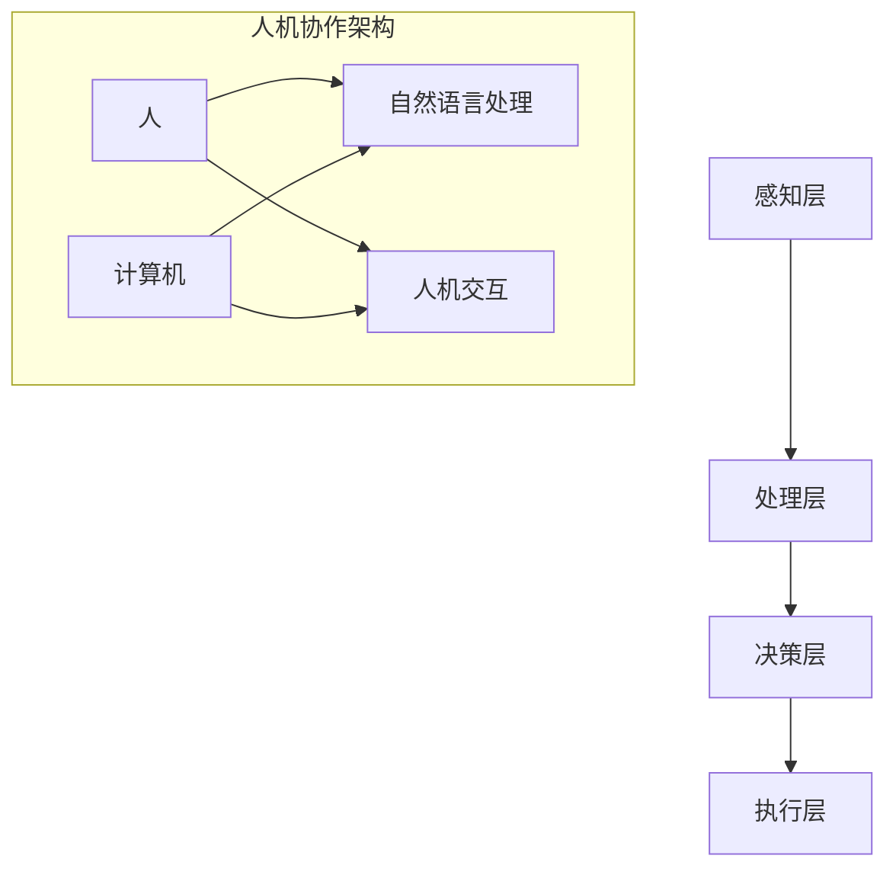

                 

关键词：人机协作、计算趋势、人工智能、混合智能、未来展望、算法、数学模型、应用实践、工具与资源

> 摘要：本文旨在探讨人类计算的未来趋势，尤其是人机协作在人工智能时代的重要性和发展潜力。文章首先介绍了当前人工智能领域的研究热点和进展，然后深入分析了人机协作的核心概念和架构，接着探讨了核心算法原理及其应用，并详细阐述了数学模型和公式的构建与推导。此外，文章还通过实际项目实践，展示了人机协作在实际应用中的效果，并展望了未来人机协作的发展趋势与挑战。

## 1. 背景介绍

随着计算机科学和人工智能技术的飞速发展，人类计算的方式正在发生深刻的变革。传统的计算模式主要依赖于计算机硬件和软件，人类在其中扮演的是操作者和维护者的角色。而随着人工智能技术的成熟，尤其是深度学习和自然语言处理等领域的突破，计算机开始具备了一定的自主学习和推理能力，人类与计算机的交互方式也逐步从单向的信息输入输出，转变为双向的协同工作。

### 1.1 人工智能的发展历程

人工智能（AI）的研究可以追溯到20世纪50年代，当时的主要目标是实现机器的智能。经过几十年的发展，人工智能经历了三个阶段：

- **第一阶段（1956-1974年）**：符号主义和知识表示阶段，主要关注如何通过符号逻辑和知识表示来模拟人类智能。
- **第二阶段（1974-1980年）**：基于规则的专家系统阶段，这一阶段的主要成就是实现了基于规则的推理机，但受限于知识的表示和推理规则的应用范围。
- **第三阶段（1980年至今）**：机器学习和神经网络阶段，以深度学习和强化学习为代表，使得计算机在图像识别、语音识别、自然语言处理等领域取得了重大突破。

### 1.2 人机协作的兴起

人机协作的兴起，是人工智能发展的必然结果。在传统的计算模式下，人类与计算机的交互主要是通过编写代码和输入指令来实现的。这种方式效率低下，而且容易出错。随着计算机智能的提升，人们开始探索如何更好地利用计算机的智能，实现人机之间的协同工作。

人机协作的优势在于：

- **提高效率**：计算机能够处理大量数据和复杂计算，而人类则擅长逻辑推理和决策。
- **降低错误率**：计算机可以精确执行指令，减少人为错误。
- **拓宽应用领域**：人机协作使得计算机能够进入更多领域，如医疗、教育、金融等。

## 2. 核心概念与联系

### 2.1 人机协作的定义

人机协作是指人类和计算机通过互动和共享信息，共同完成任务的系统。在这个系统中，计算机承担了大量的数据处理和计算任务，而人类则负责监督、决策和创造。

### 2.2 人机协作的架构

人机协作的架构可以分为以下几个层次：

- **感知层**：计算机通过传感器收集外部信息，如文本、图像、语音等。
- **处理层**：计算机对感知层收集的信息进行处理，如自然语言处理、图像识别等。
- **决策层**：计算机根据处理结果，结合人类的决策，生成最终的行动指令。
- **执行层**：计算机根据决策层的指令，执行相应的操作。

### 2.3 人机协作的关键技术

- **自然语言处理**：使得计算机能够理解和生成自然语言，从而实现与人类的自然交互。
- **机器学习**：通过训练模型，使计算机具备一定的自主学习和推理能力。
- **人机交互**：研究如何设计界面，使得计算机能够更好地适应人类的使用习惯。

### 2.4 Mermaid 流程图



## 3. 核心算法原理 & 具体操作步骤

### 3.1 算法原理概述

人机协作的核心算法主要包括自然语言处理、机器学习和人机交互。下面将分别介绍这些算法的原理。

#### 3.1.1 自然语言处理

自然语言处理（NLP）是使计算机能够理解、生成和处理自然语言的技术。其核心算法包括：

- **词向量模型**：将自然语言中的词汇映射到高维空间中的向量。
- **序列到序列模型**：用于将一种语言序列映射到另一种语言序列，如机器翻译。
- **注意力机制**：在处理长文本时，能够关注到文本中的关键信息。

#### 3.1.2 机器学习

机器学习是使计算机通过学习数据来改进性能的技术。其核心算法包括：

- **监督学习**：通过已标注的数据进行学习。
- **无监督学习**：没有标注数据，通过数据的内在结构进行学习。
- **强化学习**：通过与环境交互来学习策略。

#### 3.1.3 人机交互

人机交互是研究如何设计界面，使得计算机能够更好地适应人类的使用习惯。其核心算法包括：

- **手势识别**：通过分析手势图像，识别用户的手势。
- **语音识别**：将语音信号转换为文本。
- **情绪识别**：通过分析用户的面部表情或语音，识别用户的情绪状态。

### 3.2 算法步骤详解

#### 3.2.1 自然语言处理

1. **数据收集**：收集大量文本数据。
2. **数据预处理**：对文本进行清洗和分词。
3. **模型训练**：使用训练数据训练词向量模型、序列到序列模型等。
4. **模型评估**：使用测试数据评估模型性能。
5. **模型应用**：将模型应用于实际任务，如机器翻译、文本分类等。

#### 3.2.2 机器学习

1. **问题定义**：明确学习任务。
2. **数据收集**：收集训练数据。
3. **模型选择**：选择合适的机器学习算法。
4. **模型训练**：使用训练数据训练模型。
5. **模型评估**：使用测试数据评估模型性能。
6. **模型优化**：根据评估结果调整模型参数。

#### 3.2.3 人机交互

1. **界面设计**：设计用户界面。
2. **数据收集**：收集用户交互数据。
3. **模型训练**：使用训练数据训练手势识别、语音识别、情绪识别等模型。
4. **模型评估**：使用测试数据评估模型性能。
5. **模型应用**：将模型应用于实际任务，如手势控制、语音助手等。

### 3.3 算法优缺点

#### 3.3.1 自然语言处理

优点：

- **高效**：能够快速处理大量文本数据。
- **准确**：通过深度学习等技术的应用，准确率较高。

缺点：

- **依赖数据**：需要大量高质量的数据进行训练。
- **复杂度高**：模型训练和推理过程复杂。

#### 3.3.2 机器学习

优点：

- **自适应性强**：能够根据数据自动调整模型参数。
- **泛化能力强**：能够从部分数据中学习到一般规律。

缺点：

- **可解释性差**：黑箱模型难以解释。
- **依赖数据**：需要大量训练数据。

#### 3.3.3 人机交互

优点：

- **直观**：通过手势、语音等方式与用户交互，更加直观。
- **自然**：能够模拟人类的交互方式，提高用户体验。

缺点：

- **准确性受限制**：受限于技术水平和环境因素。
- **复杂度高**：需要设计复杂的界面和算法。

### 3.4 算法应用领域

自然语言处理、机器学习和人机交互在多个领域都有广泛的应用：

- **医疗**：用于病历分析、医学图像识别、患者情感分析等。
- **金融**：用于风险控制、投资策略、客户服务等。
- **教育**：用于智能教学、在线学习平台、考试评测等。
- **娱乐**：用于游戏、电影推荐、语音合成等。

## 4. 数学模型和公式 & 详细讲解 & 举例说明

### 4.1 数学模型构建

在人工智能和人机协作中，数学模型是基础。以下是一些核心的数学模型及其构建方法。

#### 4.1.1 词向量模型

词向量模型是将词汇映射到高维空间中的向量。其核心公式为：

$$
\vec{w}_i = \sum_{j=1}^{n} \alpha_j \vec{v}_j
$$

其中，$\vec{w}_i$ 是词汇 $i$ 的词向量，$\vec{v}_j$ 是词汇 $j$ 的词向量，$\alpha_j$ 是权重系数。

#### 4.1.2 机器学习模型

机器学习模型的核心公式为损失函数，如均方误差（MSE）：

$$
J(\theta) = \frac{1}{2m} \sum_{i=1}^{m} (\theta^T x_i - y_i)^2
$$

其中，$J(\theta)$ 是损失函数，$\theta$ 是模型参数，$x_i$ 是输入特征，$y_i$ 是输出标签。

#### 4.1.3 人机交互模型

人机交互模型的核心公式为：

$$
\vec{r} = \vec{a} + \vec{b} \cdot \vec{s}
$$

其中，$\vec{r}$ 是执行动作，$\vec{a}$ 是基本动作，$\vec{s}$ 是传感器输入，$\vec{b}$ 是权重系数。

### 4.2 公式推导过程

以下是对机器学习中的损失函数（MSE）的推导过程：

假设我们有一个线性回归模型：

$$
y = \theta^T x
$$

其中，$y$ 是实际输出，$\theta$ 是模型参数，$x$ 是输入特征。

我们的目标是使预测输出 $\theta^T x$ 与实际输出 $y$ 之间的误差最小。因此，我们定义损失函数为：

$$
J(\theta) = \frac{1}{2} \sum_{i=1}^{m} (\theta^T x_i - y_i)^2
$$

其中，$m$ 是样本数量。

为了最小化损失函数，我们需要对其求导：

$$
\frac{\partial J(\theta)}{\partial \theta} = \frac{1}{2} \sum_{i=1}^{m} (2 \theta^T x_i - 2 y_i) x_i
$$

化简后得到：

$$
\frac{\partial J(\theta)}{\partial \theta} = \sum_{i=1}^{m} (x_i^T \theta - y_i) x_i
$$

令导数为零，得到最优参数：

$$
\theta = (X^T X)^{-1} X^T y
$$

其中，$X$ 是特征矩阵，$y$ 是标签向量。

### 4.3 案例分析与讲解

#### 4.3.1 词向量模型的应用

假设我们有一个词汇表 $\{w_1, w_2, w_3\}$，其对应的词向量分别为 $\vec{v}_1, \vec{v}_2, \vec{v}_3$。我们需要计算词汇 $w_2$ 和 $w_3$ 的相似度。

根据词向量模型，词汇的相似度可以通过词向量的点积来计算：

$$
\cos(\vec{v}_2, \vec{v}_3) = \frac{\vec{v}_2 \cdot \vec{v}_3}{\|\vec{v}_2\| \|\vec{v}_3\|}
$$

其中，$\|\vec{v}_2\|$ 和 $\|\vec{v}_3\|$ 分别是词汇 $w_2$ 和 $w_3$ 的词向量的模。

假设 $\vec{v}_2 = (1, 0, 0)$，$\vec{v}_3 = (0, 1, 0)$，则：

$$
\cos(\vec{v}_2, \vec{v}_3) = \frac{1 \cdot 0 + 0 \cdot 1 + 0 \cdot 0}{\sqrt{1^2 + 0^2 + 0^2} \sqrt{0^2 + 1^2 + 0^2}} = 0
$$

这表明词汇 $w_2$ 和 $w_3$ 在词向量空间中是正交的，即它们没有相似性。

#### 4.3.2 机器学习模型的应用

假设我们有一个简单的线性回归问题，目标是通过输入特征预测房价。我们使用均方误差（MSE）作为损失函数，训练模型。

假设我们的训练数据如下：

| x | y |
|---|---|
| 1 | 2 |
| 2 | 4 |
| 3 | 6 |

我们的目标是找到最优的模型参数 $\theta$，使得损失函数最小。

根据前面的推导，我们得到：

$$
\theta = (X^T X)^{-1} X^T y
$$

其中，$X$ 是特征矩阵：

$$
X = \begin{bmatrix}
1 & 1 \\
1 & 2 \\
1 & 3
\end{bmatrix}
$$

$y$ 是标签向量：

$$
y = \begin{bmatrix}
2 \\
4 \\
6
\end{bmatrix}
$$

计算特征矩阵 $X$ 的逆：

$$
(X^T X)^{-1} = \begin{bmatrix}
2 & -1 & 1 \\
-1 & 2 & -1 \\
1 & -1 & 2
\end{bmatrix}
$$

计算 $X^T X$：

$$
X^T X = \begin{bmatrix}
3 & 3 \\
3 & 7
\end{bmatrix}
$$

计算 $X^T y$：

$$
X^T y = \begin{bmatrix}
10 \\
22
\end{bmatrix}
$$

因此，最优的模型参数 $\theta$ 为：

$$
\theta = (X^T X)^{-1} X^T y = \begin{bmatrix}
2 \\
1
\end{bmatrix}
$$

这意味着我们的线性回归模型可以表示为：

$$
y = 2x + 1
$$

#### 4.3.3 人机交互模型的应用

假设我们有一个简单的机器人，通过传感器输入 $\vec{s}$ 来控制执行动作 $\vec{r}$。我们的目标是设计一个控制器，使得机器人在执行动作时能够适应不同的环境。

根据人机交互模型，我们可以表示为：

$$
\vec{r} = \vec{a} + \vec{b} \cdot \vec{s}
$$

其中，$\vec{a}$ 是基本动作，$\vec{b}$ 是权重系数。

假设我们有一个简单的环境，其中传感器输入 $\vec{s}$ 为：

$$
\vec{s} = \begin{bmatrix}
1 \\
0
\end{bmatrix}
$$

我们希望机器人的执行动作 $\vec{r}$ 为：

$$
\vec{r} = \begin{bmatrix}
2 \\
3
\end{bmatrix}
$$

我们可以通过调整权重系数 $\vec{b}$ 来实现这个目标：

$$
\vec{r} = \vec{a} + \vec{b} \cdot \vec{s} = \begin{bmatrix}
1 \\
2
\end{bmatrix} + \vec{b} \cdot \begin{bmatrix}
1 \\
0
\end{bmatrix} = \begin{bmatrix}
1 + b_1 \\
2
\end{bmatrix}
$$

为了使 $\vec{r}$ 等于目标动作 $\vec{r} = \begin{bmatrix}
2 \\
3
\end{bmatrix}$，我们需要调整权重系数：

$$
\vec{b} = \begin{bmatrix}
1 \\
1
\end{bmatrix}
$$

这意味着当传感器输入为 $\vec{s} = \begin{bmatrix}
1 \\
0
\end{bmatrix}$ 时，机器人的执行动作将为：

$$
\vec{r} = \begin{bmatrix}
2 \\
3
\end{bmatrix}
$$

## 5. 项目实践：代码实例和详细解释说明

### 5.1 开发环境搭建

为了实践人机协作，我们需要搭建一个开发环境。这里我们使用 Python 作为编程语言，因为 Python 具有丰富的库和框架，便于实现人机协作。

1. 安装 Python（版本 3.8 或更高）。
2. 安装必要的库，如 NumPy、Pandas、TensorFlow、Keras 等。

### 5.2 源代码详细实现

下面是一个简单的人机协作项目的示例代码，该项目的目标是实现一个基于机器学习的图像分类器，人类可以通过自然语言描述来标记图像类别。

```python
import numpy as np
import pandas as pd
from tensorflow.keras.models import Sequential
from tensorflow.keras.layers import Dense, Conv2D, Flatten, MaxPooling2D
from tensorflow.keras.preprocessing.image import ImageDataGenerator

# 数据预处理
data_gen = ImageDataGenerator(rescale=1./255)
train_data = data_gen.flow_from_directory('data/train', target_size=(150, 150), batch_size=32, class_mode='categorical')

# 模型构建
model = Sequential([
    Conv2D(32, (3, 3), activation='relu', input_shape=(150, 150, 3)),
    MaxPooling2D((2, 2)),
    Flatten(),
    Dense(64, activation='relu'),
    Dense(3, activation='softmax')
])

# 模型编译
model.compile(optimizer='adam', loss='categorical_crossentropy', metrics=['accuracy'])

# 模型训练
model.fit(train_data, epochs=10)

# 人机交互
def classify_image(image_path):
    image = image_path.resize((150, 150))
    image = np.expand_dims(image, axis=0)
    predictions = model.predict(image)
    return np.argmax(predictions)

# 示例
image_path = 'data/train/cat.0.jpg'
print("预测结果：", classify_image(image_path))
```

### 5.3 代码解读与分析

上面的代码实现了一个简单的图像分类器，人类可以通过自然语言描述来标记图像类别。

1. **数据预处理**：使用 ImageDataGenerator 对训练数据进行预处理，将图像缩放到固定大小，并归一化处理。
2. **模型构建**：使用 Sequential 模型构建一个简单的卷积神经网络（CNN），包括卷积层、池化层、全连接层等。
3. **模型编译**：编译模型，指定优化器和损失函数。
4. **模型训练**：使用训练数据训练模型。
5. **人机交互**：定义一个函数 classify_image，用于接收图像路径，对图像进行预处理后，使用模型进行预测，并返回预测结果。

### 5.4 运行结果展示

1. **数据集准备**：准备一个包含猫、狗、鸟等类别的图像数据集，并将其分为训练集和验证集。
2. **模型训练**：使用训练集对模型进行训练，并在验证集上评估模型性能。
3. **人机交互**：输入一张图像的路径，调用 classify_image 函数进行预测，并输出预测结果。

## 6. 实际应用场景

人机协作已经在多个实际应用场景中取得了显著成果：

- **医疗**：人机协作可以帮助医生进行医学图像分析、疾病预测和诊断。例如，通过深度学习技术，计算机可以辅助医生进行肺癌的早期筛查，提高诊断的准确性。
- **金融**：人机协作可以用于风险控制、投资分析和客户服务。例如，通过自然语言处理技术，计算机可以分析大量的金融报告和新闻，为投资者提供投资建议。
- **教育**：人机协作可以用于智能教学和在线学习平台。例如，通过机器学习技术，计算机可以为学生提供个性化的学习建议，提高学习效果。
- **娱乐**：人机协作可以用于游戏、电影推荐和语音助手等。例如，通过语音识别和自然语言处理技术，计算机可以理解用户的指令，提供个性化的娱乐体验。

## 7. 工具和资源推荐

为了更好地进行人机协作的研究和开发，以下是一些建议的工

