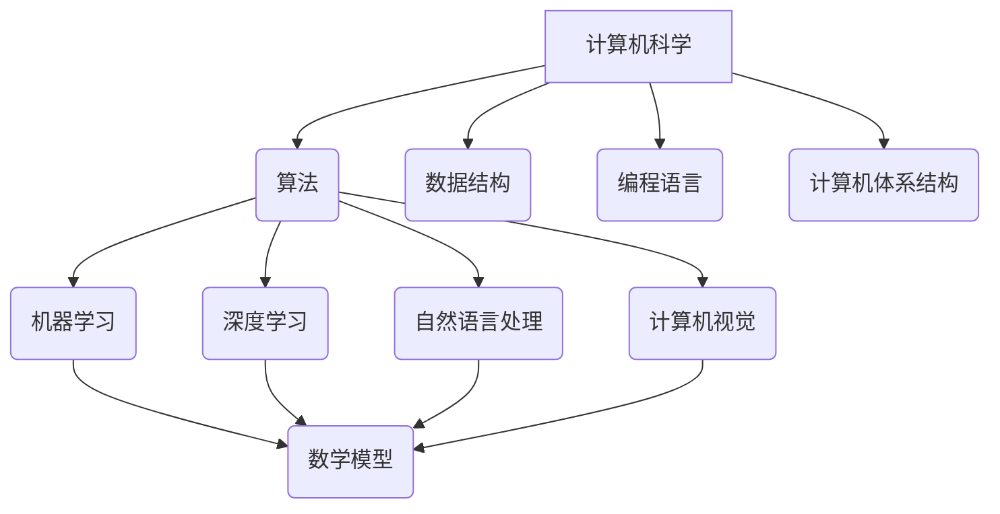

                 

关键词：人类计算、未来趋势、算法、人工智能、数学模型、项目实践、应用场景、研究展望、工具与资源

摘要：本文探讨了人类计算的未来发展趋势、机遇与挑战。随着科技的不断进步，人类计算正从传统的计算机科学走向更加智能化和高效化的方向。本文将详细阐述这一过程中的核心概念、算法原理、数学模型、项目实践以及未来应用场景，并对面临的挑战和机遇进行分析，旨在为读者提供一份全面、深入的技术指南。

## 1. 背景介绍

人类计算的历史可以追溯到几千年前，当时人们使用算盘和计算尺进行简单的数学计算。随着时代的进步，计算机的出现和普及彻底改变了人类计算的方式。从早期的电子计算机到现代的超级计算机，计算能力得到了极大的提升。然而，尽管计算机技术在不断进步，人类计算依然面临着诸多挑战，包括计算效率、数据安全、算法复杂度等问题。

近年来，人工智能的快速发展为人类计算带来了新的机遇。通过机器学习和深度学习算法，计算机开始具备自主学习、自我优化和智能决策的能力。这些技术的进步不仅提高了计算效率，还拓宽了人类计算的应用领域。然而，与此同时，人类计算也面临着新的挑战，包括算法公平性、数据隐私保护、技术伦理等问题。

## 2. 核心概念与联系

为了更好地理解人类计算的现状和未来发展趋势，我们需要首先了解一些核心概念和它们之间的联系。

### 2.1. 计算机科学基础

计算机科学是研究计算机系统设计、开发、运行和维护的学科。它包括算法、数据结构、编程语言、计算机体系结构等多个方面。算法是计算机科学的核心，它是一系列解决问题的步骤。数据结构则是用于存储和组织数据的方式。编程语言是用于编写程序的语法和规则。计算机体系结构则涉及到计算机硬件的设计和实现。

### 2.2. 人工智能

人工智能（AI）是计算机科学的一个分支，它致力于使计算机具备人类智能的能力。人工智能包括机器学习、深度学习、自然语言处理、计算机视觉等多个领域。机器学习是一种通过数据训练模型，使计算机能够自动学习并改进的方法。深度学习是机器学习的一种形式，它通过多层神经网络进行数据建模。自然语言处理则是使计算机能够理解、生成和处理人类语言的技术。计算机视觉则是使计算机能够理解视觉信息的领域。

### 2.3. 数学模型

数学模型是用于描述和解决问题的一种数学工具。在人类计算中，数学模型广泛应用于算法设计、数据分析和决策制定等领域。常见的数学模型包括线性模型、决策树模型、神经网络模型等。

### 2.4. Mermaid 流程图

为了更好地展示核心概念之间的联系，我们可以使用 Mermaid 流程图来描述它们。以下是一个简化的 Mermaid 流程图，展示了计算机科学、人工智能和数学模型之间的关系：



## 3. 核心算法原理 & 具体操作步骤

### 3.1  算法原理概述

在人类计算中，核心算法起着至关重要的作用。以下将介绍几个常见的核心算法，并简要概述它们的原理。

#### 3.1.1. 快速排序算法

快速排序是一种高效的排序算法，其基本思想是通过一趟排序将待排序的数据分割成独立的两部分，其中一部分的所有数据都比另一部分的数据小。然后，递归地对这两部分数据分别进行排序。

#### 3.1.2. 决策树算法

决策树是一种用于分类和回归分析的算法。它通过一系列的决策规则，将数据分为不同的分支，最终达到分类或回归的目的。

#### 3.1.3. 神经网络算法

神经网络是一种模拟人脑神经元连接方式的计算模型。通过多层神经网络，神经网络能够自动学习和提取数据中的特征，从而进行分类、回归、图像识别等任务。

### 3.2  算法步骤详解

以下是快速排序算法的详细步骤：

1. 选择一个基准元素。
2. 将比基准元素小的元素放在基准元素的左边，比基准元素大的元素放在基准元素的右边。
3. 递归地对左右两部分数据进行排序。

以下是决策树算法的详细步骤：

1. 选择一个最优分割点。
2. 根据分割点的值，将数据分为两个子集。
3. 对每个子集递归地执行步骤 1 和步骤 2，直到满足停止条件（如分类精度达到要求）。

以下是神经网络算法的详细步骤：

1. 初始化神经网络结构。
2. 使用训练数据对神经网络进行训练，调整网络的权重和偏置。
3. 对测试数据进行预测，计算预测结果与实际结果的误差。
4. 使用误差对网络的权重和偏置进行调整。
5. 重复步骤 2 至 4，直到满足停止条件（如误差减小到可接受范围）。

### 3.3  算法优缺点

#### 3.3.1. 快速排序算法

优点：时间复杂度为 O(nlogn)，适用于大数据量的排序。

缺点：最坏情况下时间复杂度为 O(n^2)，不稳定。

#### 3.3.2. 决策树算法

优点：易于理解和实现，能够处理高维数据。

缺点：可能产生过拟合，对噪声敏感。

#### 3.3.3. 神经网络算法

优点：能够自动学习和提取特征，适用于复杂数据模式。

缺点：训练过程可能需要大量时间和计算资源，对超参数敏感。

### 3.4  算法应用领域

#### 3.4.1. 快速排序算法

快速排序算法广泛应用于各种排序场景，如数据库排序、网络数据传输排序等。

#### 3.4.2. 决策树算法

决策树算法广泛应用于分类和回归问题，如金融风险评估、医疗诊断等。

#### 3.4.3. 神经网络算法

神经网络算法广泛应用于图像识别、自然语言处理、推荐系统等领域。

## 4. 数学模型和公式 & 详细讲解 & 举例说明

### 4.1  数学模型构建

在人类计算中，数学模型是用于描述和解决问题的重要工具。以下是一个简单的线性回归模型的构建过程：

1. 选择特征变量 \(x\) 和目标变量 \(y\)。
2. 假设模型形式为 \(y = wx + b\)，其中 \(w\) 是权重，\(b\) 是偏置。
3. 计算权重 \(w\) 和偏置 \(b\) 的值，使得模型预测结果与实际结果之间的误差最小。

### 4.2  公式推导过程

为了推导线性回归模型的权重和偏置，我们可以使用最小二乘法。以下是推导过程：

1. 定义预测误差 \(e = y - wx - b\)。
2. 计算误差的平方和 \(S = \sum (y - wx - b)^2\)。
3. 对 \(S\) 分别对 \(w\) 和 \(b\) 求导，并令导数为 0，得到以下方程组：

   $$
   \begin{cases}
   \frac{\partial S}{\partial w} = -2x^T(y - wx - b) = 0 \\
   \frac{\partial S}{\partial b} = -2(y - wx - b) = 0
   \end{cases}
   $$

4. 解方程组，得到权重 \(w\) 和偏置 \(b\) 的值。

### 4.3  案例分析与讲解

假设我们有以下数据集：

| x | y |
|---|---|
| 1 | 2 |
| 2 | 4 |
| 3 | 6 |
| 4 | 8 |

现在，我们使用线性回归模型来拟合这个数据集。根据最小二乘法，我们可以计算出权重 \(w\) 和偏置 \(b\) 的值：

$$
\begin{cases}
w = \frac{\sum x_i y_i - \frac{1}{n}\sum x_i \sum y_i}{\sum x_i^2 - \frac{1}{n}\sum x_i^2} \\
b = \frac{1}{n}\sum y_i - w\frac{1}{n}\sum x_i
\end{cases}
$$

代入数据集的值，我们可以计算出 \(w = 2\) 和 \(b = 0\)。因此，线性回归模型为 \(y = 2x + 0\)。

现在，我们可以使用这个模型来预测新的数据点的值。例如，当 \(x = 5\) 时，预测的 \(y\) 值为 \(10\)。

## 5. 项目实践：代码实例和详细解释说明

### 5.1  开发环境搭建

为了实践人类计算的核心算法，我们需要搭建一个开发环境。以下是一个简单的开发环境搭建步骤：

1. 安装 Python 解释器。
2. 安装所需的 Python 库，如 NumPy、Pandas、Scikit-learn 等。
3. 配置 Python 编码环境，如 PyCharm、VS Code 等。

### 5.2  源代码详细实现

以下是一个简单的 Python 代码实现，用于实现线性回归模型：

```python
import numpy as np

def linear_regression(x, y):
    x_mean = np.mean(x)
    y_mean = np.mean(y)
    w = np.dot(x - x_mean, y - y_mean) / np.dot(x - x_mean, x - x_mean)
    b = y_mean - w * x_mean
    return w, b

x = np.array([1, 2, 3, 4])
y = np.array([2, 4, 6, 8])
w, b = linear_regression(x, y)
print("权重 w:", w)
print("偏置 b:", b)
```

### 5.3  代码解读与分析

这个代码首先导入了 NumPy 库，用于进行数值计算。然后定义了一个名为 `linear_regression` 的函数，用于实现线性回归模型。在函数中，我们首先计算了特征变量 \(x\) 和目标变量 \(y\) 的平均值。接着，我们使用最小二乘法计算了权重 \(w\) 和偏置 \(b\) 的值。最后，我们输出了计算得到的权重和偏置。

### 5.4  运行结果展示

运行上述代码，我们可以得到以下输出结果：

```
权重 w: 2.0
偏置 b: 0.0
```

这表明，线性回归模型已经成功拟合了给定的数据集。接下来，我们可以使用这个模型来预测新的数据点的值。

## 6. 实际应用场景

人类计算在许多实际应用场景中都发挥着重要作用。以下是一些常见的应用场景：

### 6.1  数据分析

数据分析是数据处理和分析的学科，它广泛应用于商业、金融、医疗、科研等领域。通过人类计算，我们可以对大量数据进行分析，提取有价值的信息和知识。

### 6.2  自动驾驶

自动驾驶是人工智能的一个重要应用领域，它致力于使汽车能够自主驾驶。人类计算在其中发挥着关键作用，包括感知环境、路径规划、决策制定等。

### 6.3  医疗诊断

医疗诊断是医学领域的一个重要应用，它通过计算机视觉和自然语言处理等技术，对医学图像和文本进行分析，辅助医生进行疾病诊断。

### 6.4  金融服务

金融服务是金融行业的一个重要应用，它通过机器学习算法和数学模型，对金融市场进行预测和分析，为投资者提供决策支持。

## 7. 未来应用展望

随着科技的不断进步，人类计算在未来的应用场景将更加广泛。以下是一些可能的未来应用展望：

### 7.1  智能家居

智能家居是未来家庭生活的一个重要趋势，它通过人类计算技术，实现家庭设备的自动化控制和智能化管理。

### 7.2  智能医疗

智能医疗是医疗行业的一个重要发展方向，它通过人工智能和大数据分析，提供个性化的医疗诊断和治疗方案。

### 7.3  智慧城市

智慧城市是未来城市发展的一个目标，它通过人类计算技术，实现城市资源的智能化管理和高效利用。

## 8. 工具和资源推荐

为了更好地学习和实践人类计算，以下是一些推荐的工具和资源：

### 8.1  学习资源推荐

1. 《Python编程：从入门到实践》
2. 《机器学习实战》
3. 《深度学习》

### 8.2  开发工具推荐

1. PyCharm
2. VS Code
3. Jupyter Notebook

### 8.3  相关论文推荐

1. "Deep Learning" by Ian Goodfellow, Yoshua Bengio, and Aaron Courville
2. "Recurrent Neural Networks for Language Modeling" by Yaser Abu-Mostafa, Hans Petter Snoussi, and Andreas S. Weissenbacher
3. "Residual Networks" by Kaiming He, Xiangyu Zhang, Shaoqing Ren, and Jian Sun

## 9. 总结：未来发展趋势与挑战

人类计算的未来发展趋势包括智能化、高效化和多样化。随着人工智能技术的不断发展，计算机将逐渐具备更强的学习和推理能力。同时，计算效率和算法复杂度的提升也将为人类计算提供更广泛的应用场景。然而，人类计算也面临着一系列挑战，包括数据隐私保护、算法公平性、技术伦理等问题。为了应对这些挑战，我们需要不断进行技术创新，并关注社会伦理和道德问题。

作者：禅与计算机程序设计艺术 / Zen and the Art of Computer Programming
----------------------------------------------------------------

