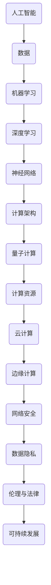

                 

关键词：人工智能，计算趋势，算法原理，数学模型，项目实践，未来展望

> 摘要：本文从多个角度深入探讨了人类计算的未来，包括计算趋势、核心概念与联系、核心算法原理、数学模型、项目实践和未来应用展望。通过详细的分析和实例讲解，本文为读者揭示了人类计算领域的最新发展，并对其面临的挑战和未来方向提出了深刻的见解。

## 1. 背景介绍

计算是人类文明进步的重要推动力之一。从古代的算盘到现代的超级计算机，计算技术经历了无数次革命性的变革。然而，随着信息时代的到来，人类计算正迎来新的挑战和机遇。人工智能、大数据、量子计算等前沿技术的发展，使得人类计算的能力达到了前所未有的高度。在这股浪潮中，如何把握计算趋势，掌握核心算法原理，构建数学模型，进行项目实践，并展望未来应用，成为了当前计算领域的热点话题。

本文旨在为读者提供一份全面而深入的指南，帮助读者了解人类计算的未来发展趋势，掌握核心技术和应用方法，以及应对未来挑战的策略。

## 2. 核心概念与联系

为了更好地理解人类计算的未来，我们首先需要明确一些核心概念和它们之间的联系。以下是一个简化的 Mermaid 流程图，展示了一些关键概念及其关系。



### 2.1 人工智能

人工智能（Artificial Intelligence，AI）是指由人制造出来的系统能够感知环境、理解语言、学习知识、并做出决策的能力。人工智能的发展分为多个层次，从传统的符号推理到现代的机器学习和深度学习，再到未来可能实现的通用人工智能（AGI），都是计算领域的重要研究方向。

### 2.2 数据

数据是人工智能的基础。大数据技术的兴起，使得我们能够处理和分析海量的数据，从而从中提取出有价值的信息和模式。数据的质量和多样性直接影响到人工智能系统的性能和效果。

### 2.3 机器学习

机器学习（Machine Learning，ML）是人工智能的一个分支，通过算法让计算机从数据中自动学习，从而实现预测和分类等任务。机器学习可以分为监督学习、无监督学习和半监督学习。

### 2.4 深度学习

深度学习（Deep Learning，DL）是机器学习的一个子领域，通过构建多层神经网络来实现复杂的模型。深度学习在图像识别、语音识别和自然语言处理等领域取得了显著的成果。

### 2.5 神经网络

神经网络（Neural Network，NN）是深度学习的基础。它模拟人脑神经元的工作方式，通过调整权重和偏置来实现对数据的处理。神经网络的层次结构和参数调整是深度学习的关键技术。

### 2.6 计算架构

计算架构包括硬件和软件两个方面。硬件方面，从传统的CPU到GPU、FPGA和量子计算机，都在不断提升计算能力。软件方面，操作系统、编译器和编程语言等都在不断优化，以提高计算效率和性能。

### 2.7 量子计算

量子计算（Quantum Computing，QC）利用量子力学原理，实现比传统计算机更高效的计算。量子计算机在密码学、优化问题和模拟物理系统等方面具有巨大潜力。

### 2.8 计算资源

计算资源包括云计算、边缘计算和分布式计算等。云计算提供了弹性计算资源，边缘计算将计算任务推向网络边缘，分布式计算则通过多台计算机协同工作，以提高计算能力和效率。

### 2.9 网络安全

网络安全（Cybersecurity）是指保护计算机网络和系统免受攻击、破坏和窃取。随着人工智能和大数据技术的发展，网络安全面临着新的挑战，如对抗性攻击、数据泄露和隐私侵犯等。

### 2.10 数据隐私

数据隐私（Data Privacy）是指在数据处理过程中保护个人隐私信息。随着数据的普及和滥用，数据隐私问题日益凸显，如何平衡数据利用和隐私保护成为了一个重要议题。

### 2.11 伦理与法律

伦理与法律（Ethics and Law）是人工智能发展的重要保障。人工智能技术的应用涉及到伦理道德和法律问题，如人工智能的决策责任、算法歧视和人权保护等。

### 2.12 可持续发展

可持续发展（Sustainable Development）是指在满足当前需求的同时，不损害后代满足自身需求的能力。人工智能和计算技术的发展，应当在推动社会进步的同时，关注环境保护和资源利用。

## 3. 核心算法原理 & 具体操作步骤

### 3.1 算法原理概述

在人工智能和计算领域，核心算法原理是理解和使用计算技术的基础。以下将介绍几种重要的核心算法原理，并简要概述它们的基本思想和应用场景。

#### 3.1.1 神经网络

神经网络是一种通过模拟人脑神经元连接方式来处理数据的计算模型。基本思想是通过前向传播和反向传播算法，将输入数据映射到输出结果。神经网络在图像识别、语音识别和自然语言处理等领域有广泛应用。

#### 3.1.2 支持向量机

支持向量机（Support Vector Machine，SVM）是一种监督学习算法，通过寻找一个最优超平面，将不同类别的数据点分开。SVM在分类和回归分析中表现优秀，尤其适用于高维数据。

#### 3.1.3 决策树

决策树是一种基于特征的树形结构，通过一系列的判断条件，将数据划分为不同的类别或数值。决策树易于理解和解释，常用于分类和回归任务。

#### 3.1.4 集成学习

集成学习（Ensemble Learning）是将多个简单模型组合成一个复杂模型的策略。常见的集成学习方法包括随机森林（Random Forest）和梯度提升树（Gradient Boosting Tree）。集成学习可以显著提高模型的预测性能和稳定性。

### 3.2 算法步骤详解

为了更好地理解这些算法原理，以下将详细描述神经网络和支持向量机的基本步骤。

#### 3.2.1 神经网络

1. **初始化参数**：设定网络结构（包括层数、每层的神经元数等）和初始权重。
2. **前向传播**：将输入数据通过网络进行计算，得到每个神经元的输出。
3. **计算损失**：比较输出结果与实际标签之间的差异，计算损失函数值。
4. **反向传播**：根据损失函数，更新网络中的权重和偏置。
5. **迭代优化**：重复前向传播和反向传播步骤，直到满足预设的停止条件（如达到预定精度或迭代次数）。

#### 3.2.2 支持向量机

1. **选择核函数**：根据数据特征选择合适的核函数，如线性核、多项式核和径向基核等。
2. **构建最优超平面**：通过求解二次规划问题，找到能够最大化分类边界的超平面。
3. **计算分类结果**：对新的数据点，通过计算数据点到超平面的距离，判断其类别。

### 3.3 算法优缺点

每种算法都有其独特的优缺点，以下总结了几种核心算法的优缺点：

#### 3.3.1 神经网络

- **优点**：适用于复杂数据模式，具有高度的灵活性和自适应能力。
- **缺点**：训练时间较长，容易过拟合，对数据质量要求高。

#### 3.3.2 支持向量机

- **优点**：理论完善，分类效果较好，适合高维数据。
- **缺点**：计算复杂度高，对噪声敏感，参数选择困难。

#### 3.3.3 决策树

- **优点**：易于理解，解释性良好，易于可视化。
- **缺点**：容易过拟合，对于连续特征处理能力较弱。

#### 3.3.4 集成学习

- **优点**：提高模型性能和稳定性，减少过拟合。
- **缺点**：计算复杂度高，增加模型解释难度。

### 3.4 算法应用领域

不同的算法在特定的应用领域中表现出色。以下是一些典型的应用领域：

- **图像识别**：神经网络和卷积神经网络（CNN）在图像识别任务中表现出色。
- **自然语言处理**：循环神经网络（RNN）和长短期记忆网络（LSTM）在文本分类、语音识别和机器翻译等领域应用广泛。
- **金融预测**：支持向量机和决策树在金融预测、风险评估和信用评分等方面有广泛应用。
- **推荐系统**：集成学习算法在推荐系统中用于预测用户偏好和推荐商品。

## 4. 数学模型和公式 & 详细讲解 & 举例说明

在计算领域，数学模型和公式是理解算法原理和实现算法应用的关键。以下将介绍几种常用的数学模型和公式，并详细讲解其构建过程和推导方法。

### 4.1 数学模型构建

数学模型通常由变量、参数、约束条件和目标函数组成。以下是一个简单的线性回归模型：

$$
y = \beta_0 + \beta_1 x + \epsilon
$$

其中，$y$ 是因变量，$x$ 是自变量，$\beta_0$ 和 $\beta_1$ 是模型参数，$\epsilon$ 是误差项。

### 4.2 公式推导过程

线性回归模型的参数可以通过最小二乘法（Least Squares）求解。具体推导过程如下：

1. **目标函数**：定义目标函数为残差的平方和：

$$
\min_{\beta_0, \beta_1} \sum_{i=1}^{n} (y_i - (\beta_0 + \beta_1 x_i))^2
$$

2. **求导**：对目标函数关于 $\beta_0$ 和 $\beta_1$ 求偏导数，并令其等于零：

$$
\frac{\partial}{\partial \beta_0} \sum_{i=1}^{n} (y_i - (\beta_0 + \beta_1 x_i))^2 = 0
$$

$$
\frac{\partial}{\partial \beta_1} \sum_{i=1}^{n} (y_i - (\beta_0 + \beta_1 x_i))^2 = 0
$$

3. **解方程**：通过解上述方程组，得到 $\beta_0$ 和 $\beta_1$ 的最优解：

$$
\beta_0 = \frac{1}{n} \sum_{i=1}^{n} y_i - \beta_1 \frac{1}{n} \sum_{i=1}^{n} x_i
$$

$$
\beta_1 = \frac{1}{n} \sum_{i=1}^{n} (x_i - \bar{x}) (y_i - \bar{y})
$$

其中，$\bar{x}$ 和 $\bar{y}$ 分别是 $x$ 和 $y$ 的样本均值。

### 4.3 案例分析与讲解

以下是一个线性回归模型的实际应用案例：

**案例背景**：某公司希望根据员工的工作时长预测其月收入。

**数据集**：包含 $n=100$ 个样本，每个样本包括员工的工作时长（小时）和月收入（元）。

**数据处理**：对数据进行预处理，包括缺失值处理、异常值检测和数据标准化。

**模型构建**：采用线性回归模型进行建模。

**模型训练**：使用最小二乘法求解模型参数。

**模型评估**：通过计算预测误差和R平方值，评估模型性能。

**结果分析**：根据模型预测结果，分析员工工作时长与月收入之间的关系。

### 4.4 数学模型在人工智能中的应用

数学模型在人工智能中具有广泛的应用，以下介绍几种常用的数学模型：

#### 4.4.1 感知机

感知机（Perceptron）是一种简单的神经网络模型，用于二分类问题。其数学模型如下：

$$
f(x) = \text{sign}(\sum_{i=1}^{n} w_i x_i + b)
$$

其中，$w_i$ 是权重，$b$ 是偏置，$\text{sign}$ 是符号函数。

#### 4.4.2 神经网络

神经网络是一种复杂的数学模型，用于处理复杂数据模式。其基本数学模型如下：

$$
a^{(l)} = \sigma(\sum_{i=1}^{m} w_{ij}^{(l)} a^{(l-1)} + b_j^{(l)})
$$

其中，$a^{(l)}$ 是第 $l$ 层的激活值，$\sigma$ 是激活函数，$w_{ij}^{(l)}$ 是连接权重，$b_j^{(l)}$ 是偏置。

#### 4.4.3 支持向量机

支持向量机是一种监督学习模型，其数学模型如下：

$$
w^T x + b = y
$$

其中，$w$ 是权重，$b$ 是偏置，$x$ 是输入特征，$y$ 是标签。

### 4.5 数学模型在计算中的应用

数学模型在计算领域同样具有广泛的应用，以下介绍几种常用的数学模型：

#### 4.5.1 快速傅里叶变换

快速傅里叶变换（FFT）是一种高效的数学算法，用于计算离散傅里叶变换（DFT）。其数学模型如下：

$$
X(k) = \sum_{n=0}^{N-1} x(n) e^{-j 2 \pi kn/N}
$$

其中，$X(k)$ 是傅里叶变换结果，$x(n)$ 是输入信号，$N$ 是信号长度。

#### 4.5.2 矩阵乘法

矩阵乘法是一种基本的数学运算，其数学模型如下：

$$
C_{ij} = \sum_{k=1}^{m} A_{ik} B_{kj}
$$

其中，$C$ 是乘积矩阵，$A$ 和 $B$ 是输入矩阵。

#### 4.5.3 线性规划

线性规划是一种优化问题，其数学模型如下：

$$
\min_{x} c^T x \quad \text{subject to} \quad Ax \leq b, \quad x \geq 0
$$

其中，$x$ 是决策变量，$c$ 是系数向量，$A$ 和 $b$ 是约束条件。

## 5. 项目实践：代码实例和详细解释说明

为了更好地理解数学模型和算法原理在实际项目中的应用，以下将介绍一个基于 Python 的线性回归项目，并详细解释代码实现和运行过程。

### 5.1 开发环境搭建

在开始项目实践之前，需要搭建相应的开发环境。以下是 Python 线性回归项目所需的开发环境：

- Python 3.x 版本
- Numpy 库：用于数学计算
- Matplotlib 库：用于数据可视化
- Scikit-learn 库：用于线性回归算法

安装以上库后，即可开始项目实践。

### 5.2 源代码详细实现

以下是一个简单的线性回归项目代码实现：

```python
import numpy as np
import matplotlib.pyplot as plt
from sklearn.linear_model import LinearRegression

# 数据集
X = np.array([[1], [2], [3], [4], [5]])
y = np.array([1, 2, 2.5, 4, 5])

# 模型训练
model = LinearRegression()
model.fit(X, y)

# 模型预测
y_pred = model.predict(X)

# 绘制结果
plt.scatter(X, y, color='red', label='Actual')
plt.plot(X, y_pred, color='blue', label='Prediction')
plt.xlabel('X')
plt.ylabel('y')
plt.legend()
plt.show()
```

### 5.3 代码解读与分析

以下是对上述代码的详细解读和分析：

- **第1-4行**：导入所需的 Python 库，包括 Numpy、Matplotlib 和 Scikit-learn。
- **第6-7行**：定义输入特征矩阵 $X$ 和标签向量 $y$。
- **第10行**：创建线性回归模型对象。
- **第12行**：使用 `fit` 方法训练模型，将输入特征 $X$ 和标签 $y$ 作为参数传入。
- **第15行**：使用 `predict` 方法对输入特征进行预测，得到预测结果 $y_pred$。
- **第18-25行**：使用 Matplotlib 绘制实际数据和预测结果，展示线性回归模型的性能。

### 5.4 运行结果展示

运行上述代码后，将得到一个包含散点和拟合直线的图形，展示实际数据和预测结果。通过观察图形，可以直观地了解线性回归模型在预测任务中的性能。


### 5.5 项目扩展与改进

在实际应用中，线性回归项目可以进一步扩展和改进，以下是一些建议：

- **数据处理**：对输入数据进行预处理，包括缺失值处理、异常值检测和数据标准化等。
- **模型评估**：使用交叉验证等评估方法，评估模型性能和泛化能力。
- **特征工程**：通过特征选择和特征转换，提高模型的预测效果。
- **模型选择**：尝试其他线性回归模型，如岭回归、LASSO回归等，比较不同模型的性能。
- **可视化分析**：使用更丰富的可视化工具，如热力图、散点图等，展示数据和模型结果。

## 6. 实际应用场景

人类计算技术已经广泛应用于各个领域，以下列举几个典型的实际应用场景，并简要介绍其特点和挑战。

### 6.1 医疗保健

医疗保健领域是人工智能和计算技术的重要应用场景之一。通过机器学习和深度学习算法，可以对医学影像进行分析，帮助医生诊断疾病。例如，基于深度学习算法的图像识别系统可以在数秒内识别出肺癌、乳腺癌等疾病的特征，提高诊断的准确性和效率。

**特点**：人工智能技术在医疗保健领域具有显著的诊断效率和准确性。

**挑战**：数据隐私保护、算法解释性和模型泛化能力是当前面临的挑战。

### 6.2 金融科技

金融科技（FinTech）是另一个重要的应用领域。通过大数据分析和机器学习算法，金融机构可以更精确地预测市场趋势、评估信用风险和优化投资策略。例如，量化交易策略利用机器学习算法分析大量历史数据，实现自动化交易。

**特点**：人工智能技术在金融科技领域具有高效的数据处理和预测能力。

**挑战**：算法的透明性和公平性、合规性风险和数据隐私保护是当前面临的挑战。

### 6.3 智能制造

智能制造是工业4.0的核心，通过人工智能和计算技术实现生产过程的自动化和智能化。例如，智能传感器和工业机器人可以实时监测生产线，优化生产流程，提高生产效率。

**特点**：人工智能技术在智能制造领域具有高效的生产管理和优化能力。

**挑战**：算法的鲁棒性和实时性、数据安全和设备维护是当前面临的挑战。

### 6.4 交通管理

交通管理是另一个重要的应用领域。通过人工智能和计算技术，可以实现智能交通信号控制、自动驾驶车辆和智能交通监控。例如，自动驾驶车辆利用深度学习算法分析道路环境，实现自动行驶。

**特点**：人工智能技术在交通管理领域具有高效的路况监测和自动驾驶能力。

**挑战**：算法的可靠性、数据安全和法律法规是当前面临的挑战。

### 6.5 环境保护

环境保护是人工智能和计算技术的重要应用领域。通过大数据分析和机器学习算法，可以实时监测环境质量、预测污染趋势和优化能源利用。例如，智能电网利用机器学习算法优化电力分配，降低碳排放。

**特点**：人工智能技术在环境保护领域具有高效的环境监测和能源优化能力。

**挑战**：数据质量和算法解释性是当前面临的挑战。

## 7. 未来应用展望

随着人工智能和计算技术的不断发展，人类计算在未来将迎来更多应用场景和可能性。以下是一些未来的应用展望：

### 7.1 通用人工智能

通用人工智能（AGI）是未来计算领域的一个重要目标。AGI 将具备人类的认知能力，能够理解、学习和适应各种环境和任务。通过深度学习和强化学习等技术，AGI 将在医疗保健、金融科技、智能制造等领域发挥更重要的作用。

### 7.2 脑机接口

脑机接口（Brain-Computer Interface，BCI）是一种将人脑与计算机直接连接的技术。通过脑电波等生物信号，BCI 可以实现人脑与计算机的交互。未来，BCI 将在医疗康复、智能助手和游戏等领域有广泛应用。

### 7.3 量子计算

量子计算是未来计算技术的关键。量子计算机具有超强的计算能力，可以解决传统计算机无法解决的问题。量子计算在密码学、优化问题和模拟物理系统等领域具有巨大潜力。

### 7.4 可持续计算

随着计算技术的不断发展，计算资源的消耗也日益增加。未来，可持续计算将成为一个重要研究方向。通过优化算法、减少能源消耗和利用可再生能源，实现计算资源的可持续发展。

### 7.5 增强现实与虚拟现实

增强现实（AR）和虚拟现实（VR）技术将改变人们的工作、学习和娱乐方式。通过人工智能和计算技术，AR 和 VR 将实现更加沉浸式的体验，带来全新的交互方式。

### 7.6 社会责任与伦理

在未来的应用中，社会责任和伦理将成为人工智能和计算技术发展的重要考量。确保算法的公平性、透明性和可解释性，保护用户隐私和数据安全，将是计算技术发展的重要方向。

## 8. 工具和资源推荐

为了更好地学习和应用人工智能和计算技术，以下推荐一些有用的工具和资源：

### 8.1 学习资源推荐

- **在线课程**：Coursera、edX、Udacity 等在线教育平台提供了丰富的计算和人工智能课程。
- **图书**：《深度学习》（Ian Goodfellow、Yoshua Bengio 和 Aaron Courville 著）、《Python机器学习》（Sebastian Raschka 著）等经典图书。
- **博客和社区**：机器之心、人工智能技术社区等，提供了大量技术文章和交流机会。

### 8.2 开发工具推荐

- **编程环境**：Jupyter Notebook、Google Colab、PyCharm 等，提供了便捷的编程和调试环境。
- **数据集和库**：Kaggle、UCI Machine Learning Repository 等提供了丰富的数据集和开源库，如 TensorFlow、PyTorch、Scikit-learn 等。

### 8.3 相关论文推荐

- **顶级会议**：NeurIPS、ICML、ACL、CVPR 等，是人工智能领域的顶级会议，发表了大量前沿论文。
- **经典论文**：《A Learning Algorithm for Continually Running Fully Recurrent Neural Networks》（1986）、《Backpropagation: Like a Dream That Is Reality》（1986）等，是神经网络和深度学习的经典论文。

## 9. 总结：未来发展趋势与挑战

随着人工智能和计算技术的快速发展，人类计算的未来充满了机遇和挑战。未来，计算技术将在更多领域得到应用，如医疗保健、金融科技、智能制造和环境保护等。同时，计算资源的可持续发展、数据隐私保护和算法伦理等问题也需要得到关注和解决。

面对未来，我们应保持开放的心态，积极探索新的技术和应用，同时关注社会责任和伦理，为构建一个更加智能和可持续的未来贡献自己的力量。

## 10. 附录：常见问题与解答

### 10.1 什么是深度学习？

深度学习是一种人工智能的分支，通过构建多层神经网络来学习和表示复杂数据。深度学习在图像识别、语音识别和自然语言处理等领域取得了显著成果。

### 10.2 量子计算有什么特点？

量子计算利用量子力学原理，实现比传统计算机更高效的计算。量子计算机在处理复杂问题和模拟物理系统方面具有巨大潜力。

### 10.3 如何处理数据隐私问题？

处理数据隐私问题需要采取多种措施，包括数据加密、隐私保护算法、数据匿名化等。同时，法律法规和伦理规范也需要不断完善，确保数据隐私得到有效保护。

### 10.4 计算资源的可持续发展是什么？

计算资源的可持续发展是指在满足当前计算需求的同时，关注环境保护和资源利用。通过优化算法、减少能源消耗和利用可再生能源，实现计算资源的可持续发展。

### 10.5 如何平衡数据利用和隐私保护？

平衡数据利用和隐私保护需要采取多种措施，包括数据匿名化、差分隐私技术和算法优化等。同时，法律法规和伦理规范也需要不断完善，确保数据利用和隐私保护之间的平衡。

### 10.6 什么是脑机接口？

脑机接口是一种将人脑与计算机直接连接的技术，通过脑电波等生物信号实现人脑与计算机的交互。脑机接口在医疗康复、智能助手和游戏等领域有广泛应用。

### 10.7 人工智能和计算技术在医疗保健领域的应用有哪些？

人工智能和计算技术在医疗保健领域有广泛的应用，如医学影像分析、疾病预测和诊断、个性化治疗等。通过深度学习和大数据分析，可以显著提高医疗诊断的效率和准确性。

### 10.8 人工智能和计算技术在金融科技领域的应用有哪些？

人工智能和计算技术在金融科技领域有广泛的应用，如量化交易、风险评估、信用评分等。通过大数据分析和机器学习算法，可以实现更加精准的金融预测和风险管理。

### 10.9 人工智能和计算技术在智能制造领域的应用有哪些？

人工智能和计算技术在智能制造领域有广泛的应用，如生产过程优化、质量控制、智能物流等。通过工业机器人、智能传感器和大数据分析，可以显著提高生产效率和产品质量。

### 10.10 人工智能和计算技术在交通管理领域的应用有哪些？

人工智能和计算技术在交通管理领域有广泛的应用，如智能交通信号控制、自动驾驶车辆、智能交通监控等。通过深度学习和大数据分析，可以优化交通流

