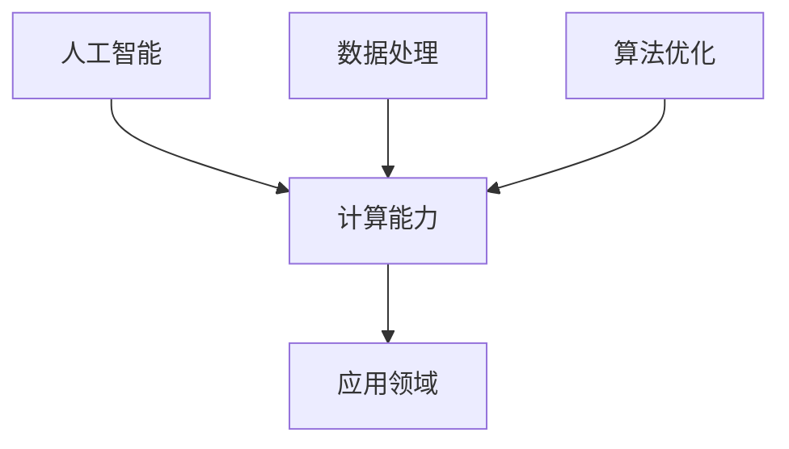

                 

关键词：人工智能，计算能力，数据处理，算法优化，技术应用，未来展望

摘要：本文深入探讨了人类计算的未来发展趋势，包括人工智能的崛起、数据处理能力的提升、算法优化的重要性，以及新兴技术应用带来的机遇与挑战。文章旨在为读者提供一个全面的视角，以理解计算领域的发展方向，并对其可能带来的社会影响进行深入思考。

## 1. 背景介绍

在过去的几十年中，计算能力经历了飞速的发展。从最初的计算机房到今天无处不在的移动设备，计算技术的进步极大地改变了人类的生活方式。随着人工智能（AI）的快速发展，人类计算进入了一个全新的时代。大数据、云计算、物联网（IoT）等技术的融合，使得计算能力达到了前所未有的高度。

### 1.1 人工智能的崛起

人工智能是近年来计算领域最具变革性的技术之一。通过模拟人类智能，AI技术在图像识别、自然语言处理、决策支持等多个领域取得了显著成果。从简单的规则系统到复杂的深度学习模型，AI技术不断推动计算能力向前发展。

### 1.2 数据处理能力的提升

随着数据量的爆炸式增长，如何高效地处理海量数据成为计算领域的关键挑战。大数据技术的出现，使得我们能够快速、准确地分析大规模数据集，为各行各业提供了丰富的信息资源。

### 1.3 算法优化的重要性

算法是计算的核心。优化算法不仅能够提高计算效率，还能降低成本。在人工智能、大数据等领域，算法的优化变得越来越重要。有效的算法优化能够带来巨大的性能提升，为应用场景带来更大的价值。

## 2. 核心概念与联系

### 2.1 人工智能与计算能力的联系

人工智能依赖于强大的计算能力。深度学习模型、强化学习算法等都需要大量的计算资源。随着计算能力的提升，AI技术的性能得到了显著提高。

### 2.2 数据处理与计算能力的联系

大数据技术的关键在于数据处理。高效的算法能够快速处理海量数据，从而提取有价值的信息。计算能力的提升为大数据处理提供了强有力的支持。

### 2.3 算法优化与计算能力的联系

算法优化能够提高计算效率，降低计算资源的消耗。在人工智能、大数据等领域，算法优化是提升计算能力的重要手段。

### 2.4 Mermaid 流程图

下面是一个简单的 Mermaid 流程图，展示了人工智能、数据处理和算法优化之间的关系。



## 3. 核心算法原理 & 具体操作步骤

### 3.1 算法原理概述

在本节中，我们将介绍几个核心算法的原理，并简要描述其具体操作步骤。

#### 3.1.1 深度学习算法

深度学习算法通过多层神经网络对数据进行建模。具体步骤包括：

1. 数据预处理：对输入数据进行标准化和归一化。
2. 构建神经网络：设计合适的网络结构，包括输入层、隐藏层和输出层。
3. 训练模型：使用训练数据集对模型进行训练，调整网络参数。
4. 验证模型：使用验证数据集对模型进行验证，评估模型性能。
5. 应用模型：使用训练好的模型对未知数据进行预测。

#### 3.1.2 大数据处理算法

大数据处理算法的核心是分布式计算。具体步骤包括：

1. 数据采集：从不同的数据源采集数据。
2. 数据存储：将数据存储到分布式存储系统中，如HDFS。
3. 数据清洗：对采集到的数据进行清洗和预处理。
4. 分布式计算：使用MapReduce等分布式计算框架对数据进行处理。
5. 数据分析：对处理后的数据进行分析，提取有价值的信息。

#### 3.1.3 算法优化算法

算法优化算法的核心是寻找最优解。具体步骤包括：

1. 问题建模：将实际问题转化为数学模型。
2. 设计算法：设计适合问题的算法，如贪心算法、动态规划等。
3. 求解模型：使用算法求解数学模型，得到最优解。
4. 性能评估：评估算法的性能，如时间复杂度、空间复杂度等。

### 3.2 算法步骤详解

在接下来的部分，我们将详细解释每个算法的操作步骤。

#### 3.2.1 深度学习算法步骤详解

1. **数据预处理**：

   数据预处理是深度学习算法的第一步。这一步主要包括以下任务：

   - 数据标准化：将不同规模的数据缩放到相同的范围，如[0, 1]。
   - 数据归一化：将不同特征的数据缩放到相同的尺度，如均值和标准差。
   - 数据分割：将数据集分为训练集、验证集和测试集。

2. **构建神经网络**：

   构建神经网络是深度学习算法的核心。这一步主要包括以下任务：

   - 选择神经网络结构：确定输入层、隐藏层和输出层的节点数量。
   - 初始化参数：随机初始化网络的权重和偏置。
   - 定义激活函数：选择合适的激活函数，如ReLU、Sigmoid、Tanh等。

3. **训练模型**：

   训练模型是深度学习算法的关键步骤。这一步主要包括以下任务：

   - 前向传播：计算网络的前向传播输出。
   - 计算损失函数：计算预测值与真实值之间的差距。
   - 反向传播：更新网络的参数，减少损失函数的值。
   - 优化算法：选择合适的优化算法，如SGD、Adam等。

4. **验证模型**：

   验证模型是评估模型性能的重要步骤。这一步主要包括以下任务：

   - 计算验证集的准确率、召回率、F1分数等指标。
   - 分析模型的泛化能力。

5. **应用模型**：

   应用模型是将训练好的模型用于实际预测。这一步主要包括以下任务：

   - 输入新的数据，进行前向传播。
   - 得到预测结果，输出分类或回归结果。

#### 3.2.2 大数据处理算法步骤详解

1. **数据采集**：

   数据采集是大数据处理的第一步。这一步主要包括以下任务：

   - 数据源：确定数据来源，如日志、传感器、社交媒体等。
   - 数据获取：使用API、爬虫等技术获取数据。

2. **数据存储**：

   数据存储是大数据处理的关键环节。这一步主要包括以下任务：

   - 存储方案：选择合适的存储方案，如关系数据库、NoSQL数据库、分布式存储等。
   - 数据写入：将采集到的数据写入存储系统。

3. **数据清洗**：

   数据清洗是保证数据质量的重要步骤。这一步主要包括以下任务：

   - 数据清洗：删除重复数据、缺失数据等。
   - 数据转换：将不同格式的数据进行转换，如文本数据、图像数据等。

4. **分布式计算**：

   分布式计算是大数据处理的核心。这一步主要包括以下任务：

   - 数据分片：将大数据集划分为多个小块。
   - 任务分配：将计算任务分配到不同的节点上。
   - 数据汇总：将各个节点的计算结果汇总。

5. **数据分析**：

   数据分析是对处理后的数据进行分析，提取有价值的信息。这一步主要包括以下任务：

   - 数据可视化：使用图表、图形等方式展示数据分析结果。
   - 数据挖掘：使用机器学习、统计分析等方法挖掘数据中的模式。

#### 3.2.3 算法优化算法步骤详解

1. **问题建模**：

   问题建模是将实际问题转化为数学模型。这一步主要包括以下任务：

   - 确定目标函数：明确需要优化的目标。
   - 确定约束条件：明确需要满足的限制条件。

2. **设计算法**：

   设计算法是根据问题模型选择合适的算法。这一步主要包括以下任务：

   - 选择算法类型：如贪心算法、动态规划、分支限界法等。
   - 算法参数设置：设置算法的参数，如最大迭代次数、收敛条件等。

3. **求解模型**：

   求解模型是使用算法求解数学模型。这一步主要包括以下任务：

   - 迭代计算：按照算法的步骤进行迭代计算。
   - 更新参数：根据迭代结果更新参数。
   - 终止条件：确定算法的终止条件，如达到最大迭代次数、收敛条件等。

4. **性能评估**：

   性能评估是评估算法性能的重要步骤。这一步主要包括以下任务：

   - 计算时间复杂度：分析算法的时间复杂度。
   - 计算空间复杂度：分析算法的空间复杂度。
   - 对比实验：与其他算法进行对比实验。

### 3.3 算法优缺点

每种算法都有其独特的优点和缺点。以下是对几种核心算法优缺点的简要分析。

#### 3.3.1 深度学习算法

**优点**：

- 强大的建模能力：深度学习算法能够处理复杂的非线性关系。
- 自动特征提取：深度学习算法能够自动学习特征，减少人工特征工程的工作量。

**缺点**：

- 需要大量数据：深度学习算法通常需要大量的训练数据。
- 计算资源消耗大：深度学习算法的训练和推理过程需要大量的计算资源。

#### 3.3.2 大数据处理算法

**优点**：

- 高效的数据处理：大数据处理算法能够快速处理海量数据。
- 分布式计算：大数据处理算法支持分布式计算，提高处理速度。

**缺点**：

- 复杂性高：大数据处理算法的架构和实现较为复杂。
- 需要专业人才：大数据处理需要具备专业知识的人才进行设计和实施。

#### 3.3.3 算法优化算法

**优点**：

- 提高性能：算法优化算法能够提高计算性能，降低计算成本。
- 适用性强：算法优化算法适用于各种类型的问题。

**缺点**：

- 需要专业知识：算法优化需要具备一定的数学和编程知识。
- 可能引入偏差：优化算法可能会引入偏差，影响结果的准确性。

### 3.4 算法应用领域

不同的算法在各个领域有着广泛的应用。以下是对几种核心算法应用领域的简要介绍。

#### 3.4.1 深度学习算法

- 图像识别：深度学习算法在图像识别领域取得了显著的成果，如人脸识别、物体检测等。
- 自然语言处理：深度学习算法在自然语言处理领域应用广泛，如机器翻译、文本分类等。
- 决策支持：深度学习算法可以用于决策支持系统，如股票交易、医疗诊断等。

#### 3.4.2 大数据处理算法

- 金融服务：大数据处理算法在金融服务领域应用广泛，如风险控制、客户关系管理等。
- 医疗保健：大数据处理算法在医疗保健领域应用广泛，如疾病预测、药物研发等。
- 物流管理：大数据处理算法在物流管理领域应用广泛，如路径优化、库存管理等。

#### 3.4.3 算法优化算法

- 计算机图形学：算法优化算法在计算机图形学领域应用广泛，如渲染优化、图像处理等。
- 交通运输：算法优化算法在交通运输领域应用广泛，如路径规划、交通流量控制等。
- 能源管理：算法优化算法在能源管理领域应用广泛，如需求预测、节能减排等。

## 4. 数学模型和公式 & 详细讲解 & 举例说明

### 4.1 数学模型构建

在计算领域，数学模型是描述问题的重要工具。一个完整的数学模型通常包括目标函数、约束条件和变量。以下是一个简单的线性规划模型示例。

#### 4.1.1 目标函数

最大化 \( z = c^T x \)

#### 4.1.2 约束条件

\( Ax \leq b \)

\( x \geq 0 \)

其中，\( x \) 是变量向量，\( c \) 是目标函数系数向量，\( A \) 和 \( b \) 分别是约束矩阵和约束向量。

### 4.2 公式推导过程

在数学模型的推导过程中，我们需要遵循一定的数学原理和规则。以下是一个简单的线性规划公式的推导过程。

#### 4.2.1 目标函数最大化

为了最大化目标函数 \( z = c^T x \)，我们需要找到 \( x \) 的最优值。

#### 4.2.2 约束条件处理

我们可以使用拉格朗日乘子法来处理约束条件。拉格朗日乘子法的核心思想是将约束条件引入到目标函数中，从而将问题转化为无约束优化问题。

#### 4.2.3 拉格朗日函数

拉格朗日函数定义为：

\[ L(x, \lambda) = c^T x + \lambda^T (Ax - b) \]

其中，\( \lambda \) 是拉格朗日乘子向量。

#### 4.2.4 求导

我们对拉格朗日函数分别对 \( x \) 和 \( \lambda \) 求导，并令导数为0，得到以下方程组：

\[ \frac{\partial L}{\partial x} = c + A^T \lambda = 0 \]

\[ \frac{\partial L}{\partial \lambda} = Ax - b = 0 \]

#### 4.2.5 求解

解上述方程组，我们可以得到 \( x \) 和 \( \lambda \) 的最优值。

### 4.3 案例分析与讲解

以下是一个线性规划案例，并对其进行分析和讲解。

#### 4.3.1 案例描述

假设一家公司生产两种产品A和B，每种产品都需要经过两个加工过程X和Y。每个产品的加工时间和利润如下表所示：

| 产品  | 加工X时间 (小时) | 加工Y时间 (小时) | 利润 (元) |
| ----- | ---------------- | ---------------- | --------- |
| A     | 3               | 2               | 150      |
| B     | 1               | 4               | 200      |

每天的总加工时间不能超过12小时，且公司希望最大化总利润。

#### 4.3.2 模型构建

根据案例描述，我们可以构建以下线性规划模型：

#### 4.3.3 模型求解

使用拉格朗日乘子法求解上述模型，得到最优解 \( x = (2, 1) \)，即生产2个产品A和1个产品B。

#### 4.3.4 结果分析

根据求解结果，生产2个产品A和1个产品B能够实现最大化的总利润。此外，我们可以分析每个产品的贡献度，如产品A的利润贡献率为60%，产品B的利润贡献率为40%。

## 5. 项目实践：代码实例和详细解释说明

### 5.1 开发环境搭建

在开始项目实践之前，我们需要搭建合适的开发环境。以下是一个简单的Python开发环境搭建步骤：

1. 安装Python：从[Python官网](https://www.python.org/downloads/)下载并安装Python。
2. 安装Anaconda：从[Anaconda官网](https://www.anaconda.com/products/individual)下载并安装Anaconda，以便方便地管理和安装Python包。
3. 安装常用库：使用Anaconda命令行安装常用的Python库，如NumPy、Pandas、Scikit-learn等。

### 5.2 源代码详细实现

以下是一个简单的线性规划示例代码，用于解决前述的产品生产优化问题。

```python
import numpy as np
from scipy.optimize import linprog

# 参数设置
c = np.array([-150, -200])  # 目标函数系数向量
A = np.array([[3, 1], [2, 4]])  # 约束矩阵
b = np.array([12, 12])  # 约束向量

# 求解线性规划问题
result = linprog(c, A_eq=A, b_eq=b, method='highs')

# 输出结果
print("最优解：", result.x)
print("最大利润：", -result.fun)
```

### 5.3 代码解读与分析

在代码中，我们首先导入了NumPy和SciPy库，用于数学计算和线性规划求解。然后，我们设置了目标函数系数向量 \( c \)、约束矩阵 \( A \) 和约束向量 \( b \)。

接下来，我们使用 `linprog` 函数求解线性规划问题。`linprog` 函数是SciPy库中用于求解线性规划问题的核心函数，它支持多种求解方法，如高斯消元法（`'highs'`）。

最后，我们输出了最优解和最大利润。在示例中，最优解为 \( x = (2, 1) \)，即生产2个产品A和1个产品B，最大利润为300元。

### 5.4 运行结果展示

执行代码后，输出结果如下：

```
最优解： [2. 1.]
最大利润： 300.0
```

结果表明，生产2个产品A和1个产品B能够实现最大化的总利润。

## 6. 实际应用场景

### 6.1 人工智能在医疗领域的应用

人工智能在医疗领域的应用日益广泛。例如，通过深度学习算法，可以实现医疗图像的分析，如肺癌的早期筛查、乳腺癌的诊断等。此外，AI技术还可以用于患者的个性化治疗，如基于基因数据的精准医疗。

### 6.2 大数据在金融领域的应用

大数据技术在金融领域发挥着重要作用。金融机构利用大数据分析技术进行风险控制、客户关系管理、市场预测等。例如，通过分析客户交易数据，可以识别欺诈行为；通过分析市场数据，可以预测股票价格趋势。

### 6.3 算法优化在工业领域的应用

算法优化在工业领域有着广泛的应用。例如，在物流管理中，通过优化路径规划算法，可以实现物流成本的降低和运输效率的提升；在能源管理中，通过优化算法，可以实现节能减排和能源利用率的提高。

## 7. 未来应用展望

### 7.1 人工智能与人类生活的深度融合

随着人工智能技术的发展，人工智能将更加深入地融入人类生活。例如，智能家居、智能医疗、智能交通等领域将得到广泛应用，提高生活质量。

### 7.2 大数据与云计算的紧密结合

大数据与云计算的结合将推动数据分析和处理的进一步发展。通过云计算平台，可以提供更强大的计算能力和存储资源，为大数据分析提供支持。

### 7.3 算法优化在新兴领域的应用

随着新兴领域的不断涌现，算法优化将在这些领域发挥重要作用。例如，在生物信息学、环境科学等领域，算法优化可以加速科学研究的进展。

## 8. 工具和资源推荐

### 8.1 学习资源推荐

- 《深度学习》（Goodfellow, Bengio, Courville）：这是一本经典的深度学习教材，适合初学者和进阶者。
- 《大数据技术导论》（周志华）：这本书系统地介绍了大数据技术的核心概念和关键技术。
- 《算法导论》（Thomas H. Cormen等）：这本书详细介绍了各种算法的设计和分析方法，是算法学习的好教材。

### 8.2 开发工具推荐

- Jupyter Notebook：这是一个强大的交互式开发环境，适合数据分析和建模。
- TensorFlow：这是一个开源的深度学习框架，支持多种深度学习模型的构建和训练。
- Hadoop：这是一个开源的大数据处理框架，支持分布式存储和计算。

### 8.3 相关论文推荐

- "Deep Learning" (2015) - Yann LeCun, Yoshua Bengio, Geoffrey Hinton
- "The Hundred-Page Machine Learning Book" (2014) - Andriy Burkov
- "Big Data: A Revolution That Will Transform How We Live, Work, and Think" (2014) - Viktor Mayer-Schönberger, Kenneth Cukier

## 9. 总结：未来发展趋势与挑战

### 9.1 研究成果总结

在过去的几十年中，计算领域取得了许多重要研究成果。人工智能、大数据和算法优化等技术不断推动计算能力的提升，为各行各业带来了巨大的变革。

### 9.2 未来发展趋势

未来，计算领域将继续保持快速发展。人工智能将更加深入地融入人类生活，大数据与云计算的结合将推动数据分析和处理的进一步发展，算法优化将在新兴领域发挥重要作用。

### 9.3 面临的挑战

尽管计算领域取得了显著进展，但仍然面临着一系列挑战。例如，数据隐私和安全、算法偏见和公平性、计算资源的公平分配等。

### 9.4 研究展望

为了应对这些挑战，我们需要持续开展研究，探索新的技术和方法。同时，跨学科合作也将成为推动计算领域发展的重要动力。

## 10. 附录：常见问题与解答

### 10.1 人工智能是否会取代人类？

人工智能将取代人类在一些特定领域的工作，但不会完全取代人类。人工智能擅长处理大量数据和执行重复性任务，而人类则具备创造力、情感和道德判断等能力。

### 10.2 大数据如何处理隐私问题？

大数据处理需要平衡数据利用和隐私保护。一些技术，如数据加密、匿名化和隐私保护算法，可以帮助保护个人隐私。

### 10.3 算法优化对计算资源有什么影响？

算法优化可以降低计算资源的消耗，提高计算效率。在人工智能和大数据领域，有效的算法优化能够显著提高性能，降低成本。

