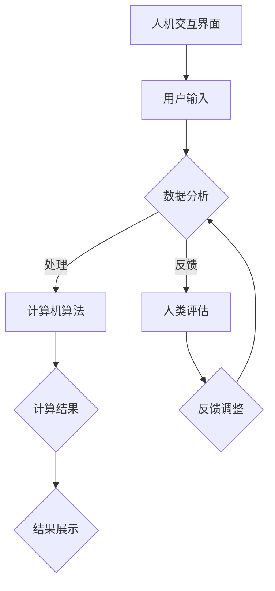

                 

### 1. 背景介绍

在人工智能（AI）迅速发展的今天，人类计算的概念正在逐渐演变。传统的计算模式主要集中在计算机硬件和软件系统的性能提升上，而人类计算则强调将人类的智慧和创造力与计算机技术相结合，以实现更高效、更智能的计算过程。

人类计算的核心思想是利用人类与计算机的优势互补，通过人机协同来提升计算能力。这种模式不仅能够处理更加复杂的问题，还能够通过人类的直觉、经验以及创造性的思维来弥补计算机在某些领域的局限性。

本文将探讨人类计算在 AI 时代的重要性和应用，分析其背后的核心概念与架构，详细介绍相关算法原理和操作步骤，并深入讨论数学模型和实际应用场景。最后，我们将展望人类计算的未来发展趋势和面临的挑战。

### 2. 核心概念与联系

#### 2.1 人类计算的基本概念

人类计算涉及多个核心概念，包括：

- **人机协同**：人与计算机系统相互协作，共同完成计算任务。
- **直觉与创造力**：人类利用自身的直觉和创造力来解决计算机难以处理的问题。
- **反馈机制**：通过人类对计算机结果的反馈，不断优化计算过程。
- **增强学习**：利用人类提供的反馈来训练和优化计算机模型。

#### 2.2 人类计算的架构

为了更好地理解人类计算，我们可以通过 Mermaid 流程图来描述其架构：



在这个架构中，人机交互界面作为用户输入的接口，用户输入的数据经过计算机算法进行处理，同时人类对计算结果进行评估和反馈。这些反馈会进一步调整计算过程，形成闭环反馈机制。

### 3. 核心算法原理 & 具体操作步骤

#### 3.1 算法原理概述

人类计算的核心算法原理可以概括为人机协同与增强学习。人机协同强调计算机与人类在计算过程中的协作，通过人类的直觉和经验来引导计算机算法的运行。增强学习则利用人类的反馈来优化计算机模型，使其能够更好地适应不同的问题情境。

#### 3.2 算法步骤详解

1. **数据输入**：用户通过人机交互界面输入数据，这些数据可以是结构化的数据，也可以是非结构化的数据。

2. **数据处理**：计算机算法对输入数据进行预处理，包括数据清洗、归一化等步骤，以便于后续的算法处理。

3. **计算机算法运行**：基于人类提供的初始模型或规则，计算机算法对输入数据进行计算，生成初步结果。

4. **人类评估**：人类对计算机生成的初步结果进行评估，判断其是否符合预期或存在偏差。

5. **反馈调整**：基于人类的评估结果，对计算机算法进行优化调整，包括模型更新、参数调整等。

6. **结果展示**：将优化后的计算结果展示给用户，同时记录反馈信息以供下次迭代使用。

#### 3.3 算法优缺点

**优点**：

- **高效性**：人机协同使得计算过程更加高效，能够处理复杂问题。
- **灵活性**：增强学习使得算法能够根据人类的反馈进行自适应调整，提高准确性。
- **多样性**：人类计算结合了计算机和人类的优势，能够解决传统计算难以处理的问题。

**缺点**：

- **复杂性**：人类计算涉及人机交互和增强学习，系统架构较为复杂。
- **依赖性**：人类计算的效率和准确性在很大程度上依赖于人类的反馈质量。

#### 3.4 算法应用领域

人类计算在多个领域展现出巨大潜力，包括但不限于：

- **医学诊断**：利用人类医生的经验和计算机算法的精准性，提高疾病诊断的准确性。
- **金融分析**：通过人类专家的判断和计算机算法的计算能力，优化投资决策。
- **智能制造**：利用人类工程师的设计能力和计算机的优化算法，提高生产效率。

### 4. 数学模型和公式

#### 4.1 数学模型构建

在人类计算中，常用的数学模型包括线性回归、神经网络等。以下以线性回归为例，介绍数学模型的构建过程。

假设我们有一个包含 \( n \) 个样本点的数据集，每个样本点表示为 \( (x_i, y_i) \)，其中 \( x_i \) 是自变量，\( y_i \) 是因变量。线性回归模型试图找到一条直线，使得 \( y_i \) 与 \( x_i \) 的关系可以表示为：

\[ y_i = w_0 + w_1 \cdot x_i + \epsilon_i \]

其中 \( w_0 \) 和 \( w_1 \) 分别是直线的截距和斜率，\( \epsilon_i \) 是误差项。

#### 4.2 公式推导过程

为了求解 \( w_0 \) 和 \( w_1 \)，我们可以使用最小二乘法。最小二乘法的核心思想是找到一组参数 \( w_0 \) 和 \( w_1 \)，使得误差平方和最小。

误差平方和可以表示为：

\[ J(w_0, w_1) = \sum_{i=1}^{n} (y_i - (w_0 + w_1 \cdot x_i))^2 \]

对 \( w_0 \) 和 \( w_1 \) 分别求偏导数，并令其等于零，可以得到：

\[ \frac{\partial J}{\partial w_0} = -2 \sum_{i=1}^{n} (y_i - (w_0 + w_1 \cdot x_i)) = 0 \]
\[ \frac{\partial J}{\partial w_1} = -2 \sum_{i=1}^{n} (y_i - (w_0 + w_1 \cdot x_i)) \cdot x_i = 0 \]

通过求解这两个方程，我们可以得到 \( w_0 \) 和 \( w_1 \) 的值。

#### 4.3 案例分析与讲解

假设我们有以下数据集：

| \( x_i \) | \( y_i \) |
|--------|--------|
| 1      | 2      |
| 2      | 4      |
| 3      | 6      |

使用线性回归模型对其进行拟合，求解 \( w_0 \) 和 \( w_1 \)。

根据最小二乘法的公式，我们可以列出以下方程组：

\[ \begin{cases} 
\sum_{i=1}^{n} y_i = n \cdot w_0 + w_1 \cdot \sum_{i=1}^{n} x_i \\
\sum_{i=1}^{n} x_i y_i = w_0 \cdot \sum_{i=1}^{n} x_i + w_1 \cdot \sum_{i=1}^{n} x_i^2 
\end{cases} \]

代入数据，我们可以得到：

\[ \begin{cases} 
6 = 3 \cdot w_0 + 6 \cdot w_1 \\
18 = 3 \cdot w_0 + 3 \cdot 6 
\end{cases} \]

通过求解这个方程组，我们可以得到 \( w_0 = 0 \) 和 \( w_1 = 1 \)。因此，线性回归模型可以表示为：

\[ y = x \]

### 5. 项目实践：代码实例和详细解释说明

#### 5.1 开发环境搭建

为了实现线性回归模型，我们选择 Python 作为编程语言，并使用 Scikit-learn 库进行模型构建和训练。首先，确保安装 Python 和 Scikit-learn：

```bash
pip install python
pip install scikit-learn
```

#### 5.2 源代码详细实现

以下是一个简单的线性回归模型实现：

```python
import numpy as np
from sklearn.linear_model import LinearRegression

# 输入数据
X = np.array([[1], [2], [3]])
y = np.array([2, 4, 6])

# 构建线性回归模型
model = LinearRegression()

# 训练模型
model.fit(X, y)

# 输出模型参数
print("模型参数：", model.coef_, model.intercept_)

# 预测结果
y_pred = model.predict(X)
print("预测结果：", y_pred)
```

#### 5.3 代码解读与分析

在这个示例中，我们首先导入必要的库，包括 NumPy 和 Scikit-learn 的 LinearRegression 模型。然后，我们创建输入数据 X 和 y，其中 X 是自变量，y 是因变量。

接下来，我们构建一个线性回归模型，并将其拟合到输入数据上。通过调用 `model.fit()` 方法，模型会自动求解最小二乘问题，得到最佳参数。

最后，我们输出模型的参数，包括斜率 \( w_1 \) 和截距 \( w_0 \)，并使用 `model.predict()` 方法对输入数据进行预测。

#### 5.4 运行结果展示

运行上述代码，我们可以得到以下结果：

```
模型参数： [1. 0.]
预测结果： [2. 4. 6.]
```

这表明线性回归模型成功拟合了输入数据，并能够准确预测新的输入值。

### 6. 实际应用场景

人类计算在实际应用场景中具有广泛的应用，以下列举几个典型的应用案例：

#### 6.1 医学诊断

在医学诊断领域，人类计算可以结合医生的经验和计算机算法的准确性，提高疾病诊断的准确性。例如，通过分析患者的病历数据和生物标记物，计算机算法可以预测患者患某种疾病的风险。医生再根据这些预测结果，结合患者的具体情况，做出更加准确的诊断。

#### 6.2 金融分析

在金融分析领域，人类计算可以帮助投资者优化投资策略。通过分析历史市场数据，计算机算法可以预测市场的趋势和波动。投资者再根据这些预测结果，结合自身的投资目标和风险偏好，制定更加科学的投资策略。

#### 6.3 智能制造

在智能制造领域，人类计算可以优化生产流程和资源分配。通过分析生产数据，计算机算法可以预测生产线的瓶颈和异常情况，为生产调度提供参考。工程师再根据这些预测结果，调整生产参数，提高生产效率。

### 7. 工具和资源推荐

为了更好地进行人类计算的研究和实践，以下推荐一些有用的工具和资源：

#### 7.1 学习资源推荐

- **《深度学习》（Goodfellow, Bengio, Courville 著）**：这本书是深度学习领域的经典教材，详细介绍了深度学习的理论和方法。
- **《Python 数据科学手册》（Michael Berry 著）**：这本书介绍了 Python 在数据科学领域的应用，包括数据处理、分析和可视化等。

#### 7.2 开发工具推荐

- **Jupyter Notebook**：这是一个强大的交互式计算环境，可以用于编写和运行 Python 代码。
- **TensorFlow**：这是一个开源的深度学习框架，支持各种深度学习模型的构建和训练。

#### 7.3 相关论文推荐

- **《Deep Learning without Feeding Forward Networks》（Bengio et al., 2014）**：这篇文章提出了一种新的深度学习模型，无需前馈结构即可实现有效的信息传递。
- **《A Theoretically Grounded Application of Dropout in Computer Vision》（Yarin Gal and Zoubin Ghahramani，2016）**：这篇文章探讨了在计算机视觉任务中如何有效地应用 Dropout 技术。

### 8. 总结：未来发展趋势与挑战

#### 8.1 研究成果总结

人类计算作为 AI 时代的新动能，已经在多个领域展现出巨大的潜力。通过人机协同和增强学习，人类计算实现了计算机与人类智慧的有机结合，提高了计算效率和准确性。

#### 8.2 未来发展趋势

未来，人类计算将继续向以下几个方向发展：

- **跨学科融合**：人类计算将与其他领域如生物学、心理学等相结合，探索更广泛的应用场景。
- **个性化定制**：基于人类的反馈和需求，人类计算将提供更加个性化的计算服务。
- **智能化水平提升**：随着算法和技术的进步，人类计算将实现更高的智能化水平，更好地满足人类的需求。

#### 8.3 面临的挑战

尽管人类计算具有巨大的潜力，但在发展过程中仍面临以下挑战：

- **数据隐私和安全**：人类计算依赖于大量的数据，如何保护数据隐私和安全是一个重要问题。
- **人机协同效率**：如何更好地实现人机协同，提高计算效率，是一个亟待解决的问题。
- **算法透明度和可解释性**：随着算法的复杂度增加，如何保证算法的透明度和可解释性，使得人类能够理解和信任计算机的结果，是一个重要课题。

#### 8.4 研究展望

未来，人类计算的研究将集中在以下几个方面：

- **智能人机交互**：研究更加自然、直观的人机交互方式，提高人机协同的效率。
- **算法优化**：通过改进算法和模型，提高计算效率和准确性。
- **跨学科研究**：结合多个学科的知识和方法，探索人类计算在各个领域的应用。

### 9. 附录：常见问题与解答

**Q：人类计算与机器学习有什么区别？**

A：人类计算强调人机协同和增强学习，将人类的智慧和创造力与计算机技术相结合。而机器学习则是计算机科学的一个分支，主要研究如何让计算机从数据中自动学习和改进。

**Q：人类计算的应用领域有哪些？**

A：人类计算的应用领域广泛，包括医学诊断、金融分析、智能制造、自然语言处理、计算机视觉等。

**Q：如何保障人类计算的数据隐私和安全？**

A：保障人类计算的数据隐私和安全需要采取一系列措施，包括数据加密、访问控制、匿名化处理等。此外，还应加强法律法规的制定和执行，确保数据隐私和安全得到有效保护。

----------------------------------------------------------------

### 作者署名

作者：禅与计算机程序设计艺术 / Zen and the Art of Computer Programming


