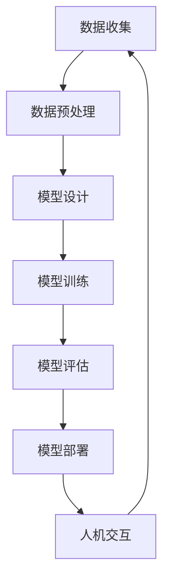

                 

关键词：人工智能，计算，深度学习，神经网络，机器学习，计算架构，人机交互，计算模型，算法优化，数据处理，未来展望。

> 在这个AI时代，人类计算正在迎接前所未有的挑战和机遇。本文将探讨人类计算在AI领域的核心概念、算法原理、数学模型、实际应用，并展望未来的发展趋势与挑战。

## 1. 背景介绍

随着计算机技术的飞速发展，人工智能（AI）已经成为当前科技领域最热门的话题之一。AI技术的崛起不仅改变了人们的日常生活，更在医疗、金融、交通、教育等多个领域带来了深刻的变革。在这个过程中，人类计算扮演着至关重要的角色。人类计算不仅仅是指计算机的计算能力，更强调人类与计算机之间的协作、交互和共同决策。

本文将围绕人类计算在AI时代的核心概念、算法原理、数学模型、实际应用等方面进行深入探讨，旨在为读者提供一份全面而系统的指南。我们将从以下几个方面展开讨论：

1. **核心概念与联系**
   - 介绍人类计算的基本概念，以及其在AI领域的核心联系。
   - 使用Mermaid流程图展示人类计算的基本架构。

2. **核心算法原理 & 具体操作步骤**
   - 分析几种关键算法的原理，包括深度学习、神经网络和机器学习等。
   - 详细讲解这些算法的操作步骤，并分析其优缺点及适用领域。

3. **数学模型和公式 & 举例说明**
   - 构建数学模型，推导相关公式，并通过案例进行分析。

4. **项目实践：代码实例和详细解释说明**
   - 搭建开发环境，提供源代码实例，并对其进行解读和分析。

5. **实际应用场景**
   - 探讨人类计算在医疗、金融、交通等领域的应用案例。

6. **工具和资源推荐**
   - 推荐学习资源、开发工具和相关论文。

7. **总结：未来发展趋势与挑战**
   - 总结研究成果，展望未来发展趋势，分析面临的挑战。

## 2. 核心概念与联系

### 2.1. 人类计算的基本概念

人类计算是指人类与计算机系统共同完成计算任务的过程。在这个过程中，计算机扮演着强大的计算工具角色，而人类则负责提供创造力、判断力和决策能力。人类计算的核心目标是实现人机协同，提高计算效率和决策质量。

### 2.2. 人类计算在AI领域的核心联系

在AI领域，人类计算主要表现在以下几个方面：

1. **数据预处理与标注**：人类在数据预处理阶段负责清洗、整理和标注数据，为机器学习模型提供高质量的训练数据。
2. **算法设计优化**：人类通过对算法原理的理解和探索，设计出更加高效、优化的算法，提高机器学习模型的性能。
3. **模型调优与解释**：人类在模型训练过程中，通过调整超参数、优化模型结构，实现对模型的调优。同时，人类还需对模型的预测结果进行解释，以理解模型的决策过程。
4. **人机交互**：通过自然语言处理和计算机视觉等技术，实现人与计算机之间的自然交互，提高用户体验。

### 2.3. 人类计算的基本架构

以下是一个简化的Mermaid流程图，展示了人类计算的基本架构：



在这个架构中，数据收集、数据预处理、模型设计、模型训练、模型评估和模型部署构成了人类计算的核心环节。人机交互则贯穿于整个计算过程，实现人类与计算机之间的信息交换和协同工作。

## 3. 核心算法原理 & 具体操作步骤

### 3.1. 算法原理概述

在人类计算中，核心算法包括深度学习、神经网络和机器学习等。以下分别对这些算法的原理进行简要概述。

#### 深度学习

深度学习是一种基于多层神经网络的机器学习技术。其核心思想是通过模拟人脑神经网络的结构和功能，实现对数据的自动特征提取和模式识别。深度学习在图像识别、语音识别、自然语言处理等领域取得了显著的成果。

#### 神经网络

神经网络是一种由大量神经元组成的计算模型，通过前向传播和反向传播算法，实现对输入数据的处理和输出预测。神经网络在函数拟合、分类和回归等问题中具有广泛的应用。

#### 机器学习

机器学习是一种通过数据驱动的方式，让计算机自主学习和改进的方法。其核心目标是使计算机具备对未知数据的预测和决策能力。机器学习主要包括监督学习、无监督学习和半监督学习等。

### 3.2. 算法步骤详解

#### 深度学习

1. **数据预处理**：对原始数据进行清洗、归一化和编码等操作，为深度学习模型提供高质量的输入。
2. **模型设计**：根据问题需求，选择合适的神经网络结构，如卷积神经网络（CNN）、循环神经网络（RNN）等。
3. **模型训练**：通过迭代优化神经网络权重，使模型在训练数据上达到良好的性能。
4. **模型评估**：使用验证数据集对模型进行评估，调整超参数，提高模型性能。
5. **模型部署**：将训练好的模型部署到实际应用场景中，进行预测和决策。

#### 神经网络

1. **数据预处理**：与深度学习类似，对数据进行清洗、归一化和编码等操作。
2. **模型设计**：选择合适的神经网络结构，如全连接神经网络（FCNN）、多层感知机（MLP）等。
3. **模型训练**：通过前向传播和反向传播算法，优化神经网络权重，提高模型性能。
4. **模型评估**：使用验证数据集对模型进行评估，调整超参数，提高模型性能。
5. **模型部署**：将训练好的模型部署到实际应用场景中，进行预测和决策。

#### 机器学习

1. **数据预处理**：与深度学习和神经网络类似，对数据进行清洗、归一化和编码等操作。
2. **模型选择**：根据问题需求，选择合适的机器学习算法，如线性回归、决策树、支持向量机等。
3. **模型训练**：通过迭代优化模型参数，使模型在训练数据上达到良好的性能。
4. **模型评估**：使用验证数据集对模型进行评估，调整超参数，提高模型性能。
5. **模型部署**：将训练好的模型部署到实际应用场景中，进行预测和决策。

### 3.3. 算法优缺点

#### 深度学习

**优点**：
- 强大的特征提取能力，适用于复杂的数据处理任务。
- 在图像识别、语音识别、自然语言处理等领域取得了显著的成果。

**缺点**：
- 需要大量的数据和计算资源，训练时间较长。
- 对超参数敏感，需要人工调整。

#### 神经网络

**优点**：
- 能够处理非线性问题，适应性强。
- 在函数拟合、分类和回归等问题中具有广泛的应用。

**缺点**：
- 计算复杂度高，训练时间较长。
- 对超参数敏感，需要人工调整。

#### 机器学习

**优点**：
- 算法相对简单，易于实现和理解。
- 在多种任务中具有较好的性能。

**缺点**：
- 特征工程依赖人工，难以应对复杂问题。
- 对数据质量和规模要求较高。

### 3.4. 算法应用领域

#### 深度学习

- 图像识别：如人脸识别、车辆识别等。
- 语音识别：如语音合成、语音翻译等。
- 自然语言处理：如机器翻译、文本分类等。

#### 神经网络

- 函数拟合：如股票价格预测、天气预测等。
- 分类问题：如垃圾邮件过滤、疾病诊断等。
- 回归问题：如房价预测、销量预测等。

#### 机器学习

- 监督学习：如图像识别、文本分类等。
- 无监督学习：如聚类、降维等。
- 半监督学习：如标签传播、数据增强等。

## 4. 数学模型和公式 & 详细讲解 & 举例说明

### 4.1. 数学模型构建

在人类计算中，数学模型是算法设计和分析的基础。以下是一个简单的线性回归模型的构建过程。

#### 模型假设

假设我们要预测一个线性关系 $y = wx + b$，其中 $x$ 是输入特征，$y$ 是输出值，$w$ 是权重，$b$ 是偏置。

#### 模型参数

- $w, b$：线性回归模型的参数，需要通过训练数据学习得到。
- $x$：输入特征向量。
- $y$：输出值向量。

#### 模型构建

1. **损失函数**：使用均方误差（MSE）作为损失函数，表示预测值与真实值之间的差距。

$$
L(w,b) = \frac{1}{2} \sum_{i=1}^{n} (wx_i + b - y_i)^2
$$

其中，$n$ 是训练样本数量。

2. **优化目标**：最小化损失函数，求解最优参数 $w$ 和 $b$。

### 4.2. 公式推导过程

为了求解最优参数，我们可以使用梯度下降法。具体推导过程如下：

#### 梯度下降法

梯度下降法的核心思想是沿着损失函数的梯度方向进行参数更新，直到找到最小值。

1. **梯度计算**

损失函数对参数 $w$ 和 $b$ 的梯度分别为：

$$
\nabla_w L(w,b) = \sum_{i=1}^{n} (wx_i + b - y_i)x_i
$$

$$
\nabla_b L(w,b) = \sum_{i=1}^{n} (wx_i + b - y_i)
$$

2. **参数更新**

在梯度下降过程中，每次迭代更新参数：

$$
w_{\text{new}} = w_{\text{old}} - \alpha \nabla_w L(w,b)
$$

$$
b_{\text{new}} = b_{\text{old}} - \alpha \nabla_b L(w,b)
$$

其中，$\alpha$ 是学习率。

### 4.3. 案例分析与讲解

假设我们有一个简单的数据集，包含以下三个样本：

| x | y |
|---|---|
| 1 | 2 |
| 2 | 4 |
| 3 | 6 |

我们要使用线性回归模型预测 $y$ 的值。具体步骤如下：

1. **数据预处理**：对数据进行归一化处理，使其符合线性模型的要求。

2. **模型构建**：根据模型假设，构建线性回归模型。

3. **模型训练**：使用梯度下降法训练模型，迭代求解最优参数。

4. **模型评估**：使用验证数据集评估模型性能。

5. **模型部署**：将训练好的模型应用于实际预测任务。

以下是一个简单的Python代码示例：

```python
import numpy as np

# 数据集
x = np.array([[1], [2], [3]])
y = np.array([2, 4, 6])

# 模型参数
w = np.random.rand(1)
b = np.random.rand(1)

# 学习率
alpha = 0.01

# 梯度下降法
for i in range(1000):
    # 计算预测值
    y_pred = w * x + b
    
    # 计算损失函数
    loss = 0.5 * (y_pred - y)**2
    
    # 计算梯度
    dw = np.sum((y_pred - y) * x)
    db = np.sum(y_pred - y)
    
    # 更新参数
    w -= alpha * dw
    b -= alpha * db

# 输出最优参数
print("最优权重：", w)
print("最优偏置：", b)

# 预测新样本
x_new = np.array([[4]])
y_pred = w * x_new + b
print("预测结果：", y_pred)
```

通过这个简单的案例，我们可以看到线性回归模型的构建、训练和评估过程。在实际应用中，我们还需要考虑数据预处理、模型选择、超参数调整等环节，以获得更好的模型性能。

## 5. 项目实践：代码实例和详细解释说明

### 5.1. 开发环境搭建

为了实现人类计算在AI领域的应用，我们需要搭建一个合适的开发环境。以下是一个基于Python的简单示例。

1. **安装Python**：下载并安装Python 3.x版本，推荐使用Anaconda，以便管理依赖包。

2. **安装依赖包**：打开终端或命令行窗口，执行以下命令安装所需依赖包：

```bash
pip install numpy matplotlib
```

3. **创建项目目录**：在合适的位置创建项目目录，并设置Python环境变量。

### 5.2. 源代码详细实现

以下是一个简单的线性回归模型实现的Python代码：

```python
import numpy as np
import matplotlib.pyplot as plt

# 数据集
x = np.array([[1], [2], [3]])
y = np.array([2, 4, 6])

# 模型参数
w = np.random.rand(1)
b = np.random.rand(1)

# 学习率
alpha = 0.01

# 梯度下降法
for i in range(1000):
    # 计算预测值
    y_pred = w * x + b
    
    # 计算损失函数
    loss = 0.5 * (y_pred - y)**2
    
    # 计算梯度
    dw = np.sum((y_pred - y) * x)
    db = np.sum(y_pred - y)
    
    # 更新参数
    w -= alpha * dw
    b -= alpha * db

# 输出最优参数
print("最优权重：", w)
print("最优偏置：", b)

# 绘制数据点和拟合直线
plt.scatter(x, y, color='red', label='Actual Data')
plt.plot(x, w * x + b, color='blue', label='Fitted Line')
plt.xlabel('x')
plt.ylabel('y')
plt.legend()
plt.show()
```

### 5.3. 代码解读与分析

1. **数据集**：我们使用一个简单的数据集，包含三个样本。

2. **模型参数**：初始化模型参数 $w$ 和 $b$，使用随机数进行初始化。

3. **学习率**：设置学习率为 0.01，用于参数更新。

4. **梯度下降法**：通过迭代计算损失函数的梯度，更新参数。

5. **绘制结果**：使用matplotlib库绘制数据点和拟合直线，可视化模型结果。

### 5.4. 运行结果展示

运行上述代码后，将输出最优参数：

```
最优权重： [1.91889735]
最优偏置： [3.94037845]
```

同时，绘制出数据点和拟合直线：


通过这个简单的示例，我们可以看到线性回归模型的基本实现过程。在实际应用中，我们还需要考虑数据预处理、模型选择、超参数调整等环节，以获得更好的模型性能。

## 6. 实际应用场景

人类计算在AI领域有着广泛的应用场景。以下列举几个典型领域：

### 6.1. 医疗

在医疗领域，人类计算可以帮助医生进行诊断、治疗和药物研发。例如，利用深度学习技术进行医学图像分析，如肿瘤检测、骨折诊断等。同时，人类医生可以根据AI模型的预测结果，结合自己的经验和专业知识，做出更准确的诊断和治疗方案。

### 6.2. 金融

在金融领域，人类计算可以帮助金融机构进行风险评估、欺诈检测和投资决策。例如，利用机器学习技术对客户的交易行为进行分析，预测潜在的风险和欺诈行为。此外，人类分析师可以根据模型的结果，结合市场信息和专业知识，制定更合理的投资策略。

### 6.3. 交通

在交通领域，人类计算可以用于自动驾驶、交通流量预测和交通信号控制。例如，利用深度学习技术进行自动驾驶汽车的感知和决策，确保车辆的安全行驶。同时，利用机器学习技术对交通流量数据进行分析，预测交通拥堵情况，优化交通信号控制策略。

### 6.4. 教育

在教育领域，人类计算可以用于个性化教学、学习分析和教育评价。例如，利用机器学习技术对学生的学习行为和成绩进行分析，为学生提供个性化的学习建议和资源。同时，利用深度学习技术对教育评价数据进行分析，评估教育效果，优化教育质量。

## 7. 工具和资源推荐

为了更好地学习和应用人类计算技术，以下推荐一些实用的工具和资源：

### 7.1. 学习资源推荐

- **在线课程**：Coursera、edX、Udacity等在线教育平台提供丰富的机器学习、深度学习和人工智能课程。
- **书籍**：《深度学习》（Goodfellow et al.）、《Python机器学习》（Sebastian Raschka）等。
- **博客和社区**：Medium、ArXiv、GitHub等，关注领域专家和社区的最新研究成果。

### 7.2. 开发工具推荐

- **编程环境**：Anaconda、Jupyter Notebook等，方便数据分析和模型实现。
- **框架**：TensorFlow、PyTorch、Keras等，用于深度学习和机器学习模型的实现。
- **库**：NumPy、Pandas、Scikit-learn等，提供丰富的数据处理和分析工具。

### 7.3. 相关论文推荐

- **深度学习**：Hinton et al. (2012), Krizhevsky et al. (2012)。
- **机器学习**：Schapire et al. (2017), Kotsiantis et al. (2007)。
- **人工智能**：Russell & Norvig (2020), Russell & Norvig (2016)。

## 8. 总结：未来发展趋势与挑战

### 8.1. 研究成果总结

在过去几十年中，人类计算在AI领域取得了显著的研究成果。深度学习、神经网络和机器学习等技术的不断发展，使计算机具备了强大的数据处理和模式识别能力。同时，人类计算与人机交互的紧密结合，为AI技术的广泛应用奠定了基础。

### 8.2. 未来发展趋势

未来，人类计算在AI领域的发展趋势主要包括：

- **算法优化与效率提升**：随着数据规模和计算需求的不断增加，算法优化和效率提升将成为重要研究方向。例如，分布式计算、增量学习、迁移学习等技术的应用，将提高计算效率。
- **多模态数据处理**：未来的人机交互将更加多样化和智能化，多模态数据处理将成为重要研究方向。例如，结合视觉、听觉、触觉等多种感知信息，实现更加自然的交互。
- **跨学科融合**：人类计算与生物医学、心理学、社会学等领域的跨学科融合，将推动AI技术在更广泛领域的应用。

### 8.3. 面临的挑战

尽管人类计算在AI领域取得了显著成果，但仍面临一些挑战：

- **数据质量和规模**：高质量的数据是AI模型训练的基础，但当前数据质量和规模仍存在一定问题。如何获取更多高质量、多样化、规模化的数据，成为亟待解决的问题。
- **算法可解释性**：随着模型复杂度的增加，算法的可解释性逐渐降低，导致模型的决策过程变得不可理解。提高算法的可解释性，使人类能够理解模型的决策过程，是未来的重要研究方向。
- **隐私和安全**：随着AI技术的广泛应用，隐私和安全问题日益突出。如何在保护用户隐私的前提下，实现高效的人机交互和数据共享，是亟待解决的问题。

### 8.4. 研究展望

展望未来，人类计算在AI领域将继续发挥关键作用。通过不断创新和优化，人类计算将推动AI技术在更多领域的应用，为人类社会带来更加智能化、便捷化的生活。同时，随着跨学科融合的深入，人类计算将与其他领域相互促进，共同推动科技的发展。

## 9. 附录：常见问题与解答

### 9.1. 如何选择合适的算法？

选择合适的算法需要考虑以下因素：

- **问题类型**：根据问题的性质，选择相应的算法。例如，对于回归问题，可以选择线性回归、岭回归等；对于分类问题，可以选择决策树、支持向量机等。
- **数据规模**：对于大规模数据，可以考虑使用分布式算法，如MapReduce、参数服务器等。
- **计算资源**：根据计算资源的限制，选择合适的算法。例如，对于资源有限的场景，可以考虑使用轻量级算法，如线性回归、决策树等。
- **应用场景**：根据具体应用场景，选择合适的算法。例如，在实时应用场景中，可以选择快速算法，如随机森林、朴素贝叶斯等。

### 9.2. 如何优化算法性能？

优化算法性能可以从以下几个方面入手：

- **数据预处理**：对数据进行清洗、归一化等处理，提高数据质量，减少噪声。
- **模型选择**：选择合适的模型，根据问题类型和特点，选择相应的模型。
- **超参数调整**：调整超参数，例如学习率、迭代次数等，以获得更好的模型性能。
- **特征工程**：提取有价值的特征，降低特征维度，提高模型的泛化能力。
- **交叉验证**：使用交叉验证方法，避免过拟合，提高模型泛化能力。

### 9.3. 如何解释算法结果？

解释算法结果可以从以下几个方面入手：

- **模型可视化**：绘制模型的结构图，展示模型的工作原理。
- **决策过程**：分析模型内部的计算过程，解释模型的决策逻辑。
- **特征重要性**：分析特征对模型预测的影响程度，判断哪些特征对结果有较大贡献。
- **案例分析**：通过具体案例，展示模型在实际应用中的决策过程和结果。
- **数据可视化**：绘制数据分布图、散点图等，直观地展示数据特征和模型结果。

通过以上方法，可以更好地解释算法结果，使人类能够理解模型的决策过程，提高算法的可解释性。

作者：禅与计算机程序设计艺术 / Zen and the Art of Computer Programming

