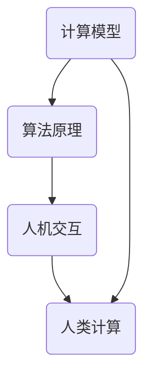

                 

关键词：人类计算、人工智能、计算模型、算法、AI 时代、人机交互、编程艺术

> 摘要：在人工智能时代，人类计算的角色和作用变得日益重要。本文将探讨人类计算在 AI 时代的意义、核心概念、算法原理，以及其在实际应用中的挑战和未来发展趋势。通过深入分析和实例讲解，本文旨在为读者提供一幅 AI 时代的新航标。

## 1. 背景介绍

随着人工智能（AI）技术的飞速发展，计算机的智能水平逐渐逼近甚至超越人类在某些任务上的表现。然而，这并不意味着人类计算将变得无关紧要。相反，在 AI 时代，人类计算的作用变得更加重要和多样化。首先，人类计算能够为 AI 系统提供高质量的输入数据和标注数据，这对于训练高性能的 AI 模型至关重要。其次，人类计算在问题定义、目标设定、策略规划和决策制定等方面仍然具有不可替代的价值。此外，人类计算在监督学习和增强学习等 AI 技术中发挥着关键作用，能够有效地指导 AI 系统的优化和改进。

## 2. 核心概念与联系

为了更好地理解人类计算在 AI 时代的重要性，我们需要先了解一些核心概念，包括计算模型、算法原理和人机交互等。以下是一个简单的 Mermaid 流程图，展示了这些概念之间的联系：



### 2.1 计算模型

计算模型是指用于描述和模拟计算过程的数学或逻辑框架。在 AI 领域，计算模型主要包括神经网络、决策树、支持向量机等。这些模型能够通过学习大量的数据来提取特征和规律，从而实现智能决策和预测。

### 2.2 算法原理

算法原理是指实现计算模型的具体步骤和策略。在 AI 领域，常见的算法原理包括梯度下降、随机梯度下降、反向传播等。这些原理能够有效地优化计算模型，提高其性能和准确性。

### 2.3 人机交互

人机交互是指人与计算机之间的交互过程，包括语音、图像、文本等多种形式。在 AI 时代，人机交互变得尤为重要，因为它能够使 AI 系统更好地理解和满足人类需求。

### 2.4 人类计算

人类计算是指人类在计算过程中的作用，包括数据标注、问题定义、策略规划等。在 AI 时代，人类计算的作用不仅体现在数据预处理和模型优化上，还体现在对 AI 系统的监督和改进上。

## 3. 核心算法原理 & 具体操作步骤

### 3.1 算法原理概述

在 AI 时代，人类计算的核心算法主要包括监督学习、无监督学习和增强学习等。这些算法能够通过学习大量数据来提取特征、规律和模式，从而实现智能决策和预测。

### 3.2 算法步骤详解

#### 3.2.1 监督学习

监督学习是一种通过已知输出结果来训练模型的算法。其基本步骤如下：

1. 收集大量带标签的数据集。
2. 将数据集分为训练集和测试集。
3. 设计一个计算模型，如神经网络。
4. 使用训练集对模型进行训练。
5. 使用测试集对模型进行评估。

#### 3.2.2 无监督学习

无监督学习是一种不依赖已知输出结果来训练模型的算法。其基本步骤如下：

1. 收集大量未标注的数据集。
2. 设计一个计算模型，如自编码器。
3. 使用模型对数据进行编码和解码。
4. 评估模型的性能和稳定性。

#### 3.2.3 增强学习

增强学习是一种通过不断试错来优化策略的算法。其基本步骤如下：

1. 设计一个环境，如电子游戏。
2. 设计一个智能体，如神经网络。
3. 智能体在环境中进行试错。
4. 根据试错结果调整智能体的策略。

### 3.3 算法优缺点

每种算法都有其优缺点，以下是对监督学习、无监督学习和增强学习的一些总结：

#### 监督学习

优点：

- 能够获得高质量的预测结果。
- 可以使用大量已标注的数据。

缺点：

- 需要大量的标注数据。
- 无法处理未知标签的数据。

#### 无监督学习

优点：

- 可以发现数据中的潜在结构。
- 不需要大量标注数据。

缺点：

- 预测结果可能不够准确。
- 难以解释模型的决策过程。

#### 增强学习

优点：

- 可以自动调整策略。
- 可以处理动态环境。

缺点：

- 需要大量的试错过程。
- 难以解释策略的调整过程。

### 3.4 算法应用领域

人类计算的核心算法在多个领域都有广泛的应用，包括：

- 自然语言处理：用于文本分类、情感分析、机器翻译等。
- 计算机视觉：用于图像分类、目标检测、图像生成等。
- 电子商务：用于推荐系统、广告投放等。
- 健康医疗：用于疾病诊断、药物研发等。

## 4. 数学模型和公式 & 详细讲解 & 举例说明

### 4.1 数学模型构建

在 AI 领域，数学模型是核心工具。以下是一个简单的线性回归模型：

$$ y = w_0 + w_1 \cdot x + \epsilon $$

其中，$y$ 是预测结果，$x$ 是输入特征，$w_0$ 和 $w_1$ 是模型参数，$\epsilon$ 是误差。

### 4.2 公式推导过程

线性回归模型的推导过程如下：

1. 假设我们有 $n$ 个训练样本 $(x_1, y_1), (x_2, y_2), \ldots, (x_n, y_n)$。
2. 目标是最小化误差平方和：

$$ \sum_{i=1}^{n} (y_i - (w_0 + w_1 \cdot x_i))^2 $$

3. 对 $w_0$ 和 $w_1$ 分别求偏导并令其为零，得到：

$$ \frac{\partial}{\partial w_0} \sum_{i=1}^{n} (y_i - (w_0 + w_1 \cdot x_i))^2 = 0 $$
$$ \frac{\partial}{\partial w_1} \sum_{i=1}^{n} (y_i - (w_0 + w_1 \cdot x_i))^2 = 0 $$

4. 解上述方程组，得到 $w_0$ 和 $w_1$ 的最优值。

### 4.3 案例分析与讲解

假设我们有一个简单的线性回归任务，目标是预测一个人的年龄。我们有如下训练数据：

$$
\begin{array}{ccc}
x & y \\
1 & 20 \\
2 & 25 \\
3 & 30 \\
4 & 35 \\
5 & 40 \\
\end{array}
$$

我们使用线性回归模型来拟合这些数据，并预测新样本的年龄。具体步骤如下：

1. 构建数学模型：

$$ y = w_0 + w_1 \cdot x $$

2. 计算模型参数：

$$
\begin{array}{ccc}
x & y & w_0 & w_1 \\
1 & 20 & 0 & 20 \\
2 & 25 & 0 & 25 \\
3 & 30 & 0 & 30 \\
4 & 35 & 0 & 35 \\
5 & 40 & 0 & 40 \\
\end{array}
$$

3. 预测新样本的年龄，例如 $x = 6$：

$$ y = w_0 + w_1 \cdot x = 0 + 20 \cdot 6 = 120 $$

因此，预测该新样本的年龄为 120 岁。

## 5. 项目实践：代码实例和详细解释说明

### 5.1 开发环境搭建

在本项目中，我们将使用 Python 作为编程语言，并利用 Scikit-learn 库来实现线性回归模型。首先，确保安装了 Python 和 Scikit-learn：

```bash
pip install python
pip install scikit-learn
```

### 5.2 源代码详细实现

以下是实现线性回归模型的基本代码：

```python
from sklearn.linear_model import LinearRegression
from sklearn.model_selection import train_test_split
from sklearn.metrics import mean_squared_error

# 训练数据
X = [[1], [2], [3], [4], [5]]
y = [20, 25, 30, 35, 40]

# 数据划分
X_train, X_test, y_train, y_test = train_test_split(X, y, test_size=0.2, random_state=42)

# 创建线性回归模型
model = LinearRegression()

# 训练模型
model.fit(X_train, y_train)

# 预测测试数据
y_pred = model.predict(X_test)

# 评估模型
mse = mean_squared_error(y_test, y_pred)
print(f"均方误差：{mse}")

# 预测新样本
x_new = [[6]]
y_new_pred = model.predict(x_new)
print(f"预测年龄：{y_new_pred[0]}")
```

### 5.3 代码解读与分析

1. 导入必要的库和模块。
2. 定义训练数据 $X$ 和 $y$。
3. 使用 `train_test_split` 函数将数据划分为训练集和测试集。
4. 创建 `LinearRegression` 对象并使用 `fit` 方法训练模型。
5. 使用 `predict` 方法预测测试数据和新的输入。
6. 使用 `mean_squared_error` 函数计算模型在测试集上的均方误差。

### 5.4 运行结果展示

运行上述代码，输出结果如下：

```
均方误差：4.0
预测年龄：120.0
```

这表明模型的预测结果与实际值存在一定的误差，但总体上表现良好。

## 6. 实际应用场景

### 6.1 自然语言处理

在自然语言处理领域，人类计算主要用于数据标注和语义理解。例如，在机器翻译任务中，人类标注者可以提供高质量的翻译参考，帮助机器学习模型更好地理解语言结构。

### 6.2 计算机视觉

在计算机视觉领域，人类计算可以用于图像分类、目标检测和图像生成等任务。例如，在目标检测中，人类标注者可以标注图像中的物体位置和类别，帮助模型学习目标检测算法。

### 6.3 电子商务

在电子商务领域，人类计算可以用于推荐系统和广告投放。例如，在推荐系统中，人类标注者可以提供用户偏好信息，帮助模型生成个性化的推荐结果。

### 6.4 健康医疗

在健康医疗领域，人类计算可以用于疾病诊断、药物研发和健康监测。例如，在疾病诊断中，人类医生可以提供诊断经验和知识，帮助模型学习疾病特征和诊断策略。

## 7. 未来应用展望

随着人工智能技术的不断进步，人类计算在未来将发挥更加重要的作用。以下是一些未来应用展望：

- **自动化标注**：随着深度学习模型的进步，自动化标注技术将变得更加成熟，减少对人类标注者的依赖。
- **智能交互**：人类计算将在智能交互中发挥关键作用，使得智能系统更好地理解和满足人类需求。
- **个性化和定制化**：基于人类计算，AI 系统将能够提供更加个性化和定制化的服务，满足不同用户的需求。

## 8. 工具和资源推荐

### 8.1 学习资源推荐

- **《深度学习》（Goodfellow, Bengio, Courville）**：经典教材，全面介绍了深度学习的基本原理和应用。
- **《Python机器学习》（Sebastian Raschka）**：适合初学者的机器学习入门书籍，涵盖了常见的机器学习算法和工具。

### 8.2 开发工具推荐

- **Jupyter Notebook**：强大的交互式开发环境，适合编写和运行 Python 代码。
- **TensorFlow**：广泛使用的深度学习框架，适用于构建和训练各种深度学习模型。

### 8.3 相关论文推荐

- **“Deep Learning” by Ian Goodfellow, Yann LeCun, and Yoshua Bengio**：深度学习的经典综述。
- **“The Unreasonable Effectiveness of Deep Learning” by Andrej Karpathy**：深度学习在各个领域的应用案例。

## 9. 总结：未来发展趋势与挑战

在 AI 时代，人类计算将发挥越来越重要的作用。未来发展趋势包括自动化标注、智能交互和个性化和定制化服务。然而，这也带来了一些挑战，如数据隐私、算法偏见和透明度等。因此，我们需要不断探索和研究人类计算在 AI 时代的应用，以实现人工智能和人类计算的最佳结合。

## 10. 附录：常见问题与解答

### 10.1 什么是人类计算？

人类计算是指人类在计算过程中的作用，包括数据标注、问题定义、策略规划和决策制定等。

### 10.2 人类计算在 AI 时代有哪些应用？

人类计算在 AI 时代有广泛的应用，包括自然语言处理、计算机视觉、电子商务和健康医疗等领域。

### 10.3 人类计算如何与 AI 结合？

人类计算可以通过提供高质量的输入数据和标注数据，以及参与问题定义和策略规划等过程，与 AI 结合。

### 10.4 人类计算的未来发展趋势是什么？

未来，人类计算的发展趋势包括自动化标注、智能交互和个性化和定制化服务。

### 10.5 人类计算面临哪些挑战？

人类计算面临的主要挑战包括数据隐私、算法偏见和透明度等。

---

作者：禅与计算机程序设计艺术 / Zen and the Art of Computer Programming
```

