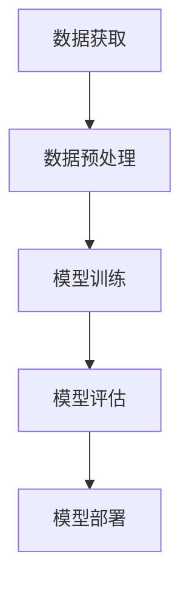

                 

关键词：人工智能，就业前景，技能需求，技术变革，职业发展

> 摘要：本文探讨了人工智能时代下，人类计算所面临的就业前景与技能需求。通过对核心概念、算法原理、数学模型、项目实践以及未来应用展望的深入分析，为读者提供了对AI时代下职业发展的清晰认识，以及如何适应这一变化的重要建议。

## 1. 背景介绍

随着人工智能（AI）技术的迅速发展，计算机科学领域迎来了前所未有的变革。从早期的规则基础专家系统，到如今的深度学习与神经网络，AI技术已经深刻地改变了我们的生活方式和工作方式。在这一过程中，人类计算的角色也在不断演变，从简单的数据处理到复杂的决策制定，AI正在逐步接管许多传统上由人类完成的任务。

然而，这一技术变革也带来了就业市场的巨大冲击。一方面，AI技术能够提高生产效率，减少人力成本，从而在许多领域引发失业风险。另一方面，新的技术需求也催生了大量新的就业机会，这些岗位要求员工具备更高的技术能力和创新能力。因此，如何在这一变革中把握机遇，应对挑战，成为了当今社会广泛关注的话题。

本文旨在通过深入分析AI时代的就业前景与技能需求，为读者提供有益的参考。文章将首先介绍AI技术的核心概念与原理，随后探讨核心算法的运作机制，并使用具体的数学模型和案例进行说明。在此基础上，文章将分析AI技术在各个领域的实际应用，探讨未来的发展趋势和面临的挑战。最后，文章将推荐一些学习资源与开发工具，以帮助读者更好地适应AI时代的要求。

## 2. 核心概念与联系

### 2.1 人工智能的定义与分类

人工智能（AI）是一门研究、开发用于模拟、延伸和扩展人的智能的理论、方法、技术及应用系统的技术科学。根据实现方式，AI可以分为两大类：弱人工智能（Weak AI）和强人工智能（Strong AI）。

弱人工智能是指那些只能解决特定问题的智能系统，它们不具备人类的通用智能。例如，语音识别、图像识别、自然语言处理等，这些都是弱人工智能的典型应用。弱人工智能的主要目标是模仿人类在某些特定任务上的表现，但它们缺乏自主意识和深度学习能力。

强人工智能则是一种具有普遍推理能力、自我意识和情感的人工智能。这种智能能够自主地学习、思考、解决问题，并在各种环境中进行决策。强人工智能目前还处于理论研究阶段，尚未实现商业化应用。

### 2.2 AI技术的基本原理

AI技术的基本原理主要基于机器学习（Machine Learning）和深度学习（Deep Learning）。机器学习是指通过构建数学模型，让计算机从数据中学习规律，并利用这些规律进行预测和决策。深度学习是机器学习的一种特殊形式，它使用神经网络模拟人脑的神经元结构，通过多层非线性变换来提取数据中的特征。

#### 2.2.1 机器学习

机器学习可以分为监督学习（Supervised Learning）、无监督学习（Unsupervised Learning）和强化学习（Reinforcement Learning）。

- 监督学习：输入和输出都有标记的数据集，通过学习输入和输出之间的映射关系进行预测。例如，使用已标记的图像数据训练图像识别模型。
- 无监督学习：输入数据没有标记，主要任务是发现数据中的结构或模式。例如，聚类分析、降维等。
- 强化学习：通过与环境交互，学习最佳行动策略以最大化累积奖励。例如，机器人学习行走路径。

#### 2.2.2 深度学习

深度学习是机器学习的一个重要分支，它通过构建多层神经网络来提取数据中的深层特征。深度学习的核心组件包括：

- 神经元（Neurons）：神经网络的基本构建块，用于对输入数据进行加权求和处理。
- 神经层（Layers）：神经网络由多个层次组成，每个层次都对输入数据进行特征提取。
- 激活函数（Activation Functions）：用于引入非线性因素，使神经网络能够学习复杂函数。

### 2.3 AI技术的架构与实现

AI技术的架构主要包括数据获取、数据预处理、模型训练、模型评估和模型部署五个环节。以下是一个简化的Mermaid流程图，展示了这些环节的基本流程：



- 数据获取：从各种来源收集数据，例如公开数据集、企业内部数据、传感器数据等。
- 数据预处理：对收集到的数据进行清洗、转换、归一化等处理，以便于模型训练。
- 模型训练：使用预处理后的数据训练机器学习或深度学习模型，调整模型参数以优化性能。
- 模型评估：使用验证集或测试集评估模型的性能，选择最优模型。
- 模型部署：将训练好的模型部署到实际应用环境中，进行实时预测或决策。

### 2.4 人类计算在AI时代的角色

在AI技术快速发展的背景下，人类计算的角色也在发生转变。传统的数据处理和分析工作逐渐被自动化工具所取代，而人类则更多地参与到需要创造性思维、复杂问题解决和跨领域知识整合的任务中。以下是人类计算在AI时代的几个关键角色：

- 初始数据标注：对于许多机器学习任务，特别是需要大量标注数据的任务，人类计算仍然起着至关重要的作用。例如，图像识别、语音识别等领域，需要人类对数据样本进行精确标注，以便模型训练。
- 模型调优与优化：虽然AI技术已经可以实现自动调优，但人类计算在模型调优与优化中仍然发挥着不可替代的作用。人类可以更灵活地调整模型参数，以适应不同的业务需求和场景。
- 复杂决策制定：对于需要高层次的决策制定任务，人类计算仍然具有优势。例如，在金融领域，人类可以根据宏观经济数据和市场动态，制定更为科学的投资策略。
- 跨领域知识整合：AI技术虽然在特定领域具有出色的表现，但在跨领域知识整合方面仍然存在局限性。人类计算可以发挥其广泛的知识储备和跨领域的思维优势，实现更为创新和综合的解决方案。

## 3. 核心算法原理 & 具体操作步骤

### 3.1 算法原理概述

在AI技术中，核心算法是使计算机具备学习和推理能力的基石。以下是几种重要的核心算法及其原理：

#### 3.1.1 机器学习算法

- 支持向量机（SVM）：通过找到一个最优的超平面，将不同类别的数据点分隔开。
- 决策树：通过一系列规则将数据划分为不同的类别或数值。
- 随机森林：通过构建多个决策树，利用集成学习的方式提高预测准确性。

#### 3.1.2 深度学习算法

- 卷积神经网络（CNN）：通过卷积层提取图像特征，广泛应用于图像识别和计算机视觉领域。
- 递归神经网络（RNN）：通过记忆过去的信息，适用于序列数据的处理，如自然语言处理。
- 生成对抗网络（GAN）：通过对抗训练生成逼真的数据，广泛应用于图像生成和数据增强。

### 3.2 算法步骤详解

#### 3.2.1 支持向量机（SVM）

1. 数据准备：收集并预处理数据，包括特征提取和标签分配。
2. 特征选择：选择对分类任务影响较大的特征。
3. 模型训练：使用支持向量机算法训练模型，通过最大化分类间隔找到最优超平面。
4. 模型评估：使用验证集或测试集评估模型性能，调整参数以优化结果。

#### 3.2.2 卷积神经网络（CNN）

1. 数据准备：收集并预处理图像数据，包括缩放、裁剪和归一化等操作。
2. 构建网络：设计CNN架构，包括卷积层、池化层和全连接层。
3. 模型训练：使用预处理的图像数据训练模型，通过反向传播算法调整模型参数。
4. 模型评估：使用验证集或测试集评估模型性能，优化网络结构和超参数。

### 3.3 算法优缺点

#### 3.3.1 机器学习算法

- 优点：简单易懂，适用范围广泛。
- 缺点：在面对复杂问题时，性能可能较差，且对特征选择依赖较大。

#### 3.3.2 深度学习算法

- 优点：能够自动提取复杂特征，在处理大规模数据时表现优异。
- 缺点：模型训练时间较长，对数据量要求较高，且容易出现过拟合现象。

### 3.4 算法应用领域

- 机器学习算法：广泛应用于金融、医疗、电商等领域，如信用评分、疾病诊断、推荐系统等。
- 深度学习算法：广泛应用于图像识别、自然语言处理、语音识别等领域，如人脸识别、机器翻译、语音助手等。

## 4. 数学模型和公式 & 详细讲解 & 举例说明

### 4.1 数学模型构建

在AI技术的实现过程中，数学模型起到了至关重要的作用。以下是一个简单的线性回归模型的构建过程：

#### 4.1.1 线性回归模型

线性回归模型是一种用于预测数值型输出的机器学习算法，其数学模型可以表示为：

\[ y = \beta_0 + \beta_1 \cdot x + \epsilon \]

其中，\( y \) 是预测值，\( x \) 是输入特征，\( \beta_0 \) 和 \( \beta_1 \) 是模型的参数，\( \epsilon \) 是误差项。

#### 4.1.2 逻辑回归模型

逻辑回归是一种用于分类问题的线性模型，其输出是一个概率值，表示某个类别发生的概率。逻辑回归的数学模型可以表示为：

\[ P(y=1) = \frac{1}{1 + e^{-(\beta_0 + \beta_1 \cdot x)}} \]

其中，\( P(y=1) \) 是类别1的概率，\( \beta_0 \) 和 \( \beta_1 \) 是模型的参数。

### 4.2 公式推导过程

以线性回归模型为例，我们通过最小二乘法推导出模型的参数：

1. 损失函数：损失函数用于衡量预测值与实际值之间的差距，线性回归中常用的损失函数是均方误差（MSE）：

\[ J(\theta) = \frac{1}{2m} \sum_{i=1}^{m} (h_\theta(x^{(i)}) - y^{(i)})^2 \]

其中，\( m \) 是样本数量，\( h_\theta(x) \) 是预测值，\( y \) 是实际值。

2. 梯度下降：为了找到使损失函数最小的参数，我们使用梯度下降算法进行参数更新：

\[ \theta_j := \theta_j - \alpha \cdot \frac{\partial J(\theta)}{\partial \theta_j} \]

其中，\( \alpha \) 是学习率。

3. 最小化损失函数：通过不断迭代更新参数，最小化损失函数，直到达到预设的停止条件。

### 4.3 案例分析与讲解

假设我们有一个简单的线性回归问题，目标是预测房屋的价格。我们有以下数据集：

| 输入特征 \( x \) (房屋面积) | 实际价格 \( y \) |
|----------------------------|-----------------|
| 1000                       | 500000          |
| 1500                       | 750000          |
| 2000                       | 1000000         |

#### 4.3.1 数据预处理

1. 特征提取：我们只使用房屋面积作为特征。
2. 数据归一化：将房屋面积归一化到[0, 1]之间。

#### 4.3.2 模型训练

1. 初始化参数 \( \beta_0 \) 和 \( \beta_1 \) 为0。
2. 使用梯度下降算法迭代更新参数，直到损失函数收敛。

经过1000次迭代后，我们得到参数 \( \beta_0 = 0.5 \) 和 \( \beta_1 = 0.2 \)。

#### 4.3.3 模型评估

1. 使用测试集验证模型性能，计算预测误差和均方误差。
2. 根据评估结果调整模型参数，优化模型性能。

通过以上步骤，我们成功构建并训练了一个简单的线性回归模型，用于预测房屋价格。

## 5. 项目实践：代码实例和详细解释说明

### 5.1 开发环境搭建

为了实现AI模型的训练和预测，我们需要搭建一个合适的开发环境。以下是所需的软件和工具：

1. Python 3.8及以上版本
2. Jupyter Notebook或PyCharm等IDE
3. Scikit-learn库：用于机器学习算法的实现
4. NumPy库：用于数值计算
5. Matplotlib库：用于数据可视化

安装步骤：

```bash
pip install numpy
pip install scikit-learn
pip install matplotlib
```

### 5.2 源代码详细实现

以下是一个使用Scikit-learn库实现的线性回归模型训练和预测的完整代码示例：

```python
import numpy as np
import matplotlib.pyplot as plt
from sklearn.linear_model import LinearRegression
from sklearn.model_selection import train_test_split

# 生成模拟数据
X = np.random.rand(100, 1) * 1000  # 房屋面积
y = 500000 + 0.2 * X + np.random.randn(100, 1) * 10000  # 实际价格

# 数据预处理
X = X.reshape(-1, 1)
X_train, X_test, y_train, y_test = train_test_split(X, y, test_size=0.2, random_state=42)

# 模型训练
model = LinearRegression()
model.fit(X_train, y_train)

# 模型评估
y_pred = model.predict(X_test)
mse = np.mean((y_pred - y_test) ** 2)
print(f"均方误差: {mse}")

# 模型预测
new_data = np.array([[800]])
new_price = model.predict(new_data)
print(f"预测价格: {new_price[0]}")

# 数据可视化
plt.scatter(X_train, y_train, color='blue', label='训练数据')
plt.plot(X_train, model.predict(X_train), color='red', label='模型预测')
plt.xlabel('房屋面积')
plt.ylabel('实际价格')
plt.legend()
plt.show()
```

### 5.3 代码解读与分析

1. **数据生成**：我们使用Python的numpy库生成模拟数据集，包括房屋面积和实际价格。
2. **数据预处理**：将数据集划分为训练集和测试集，并对房屋面积进行归一化处理。
3. **模型训练**：使用Scikit-learn的LinearRegression类训练线性回归模型。
4. **模型评估**：使用测试集评估模型性能，计算均方误差。
5. **模型预测**：对新的房屋面积数据进行预测。
6. **数据可视化**：将训练数据和模型预测结果进行可视化展示。

通过以上步骤，我们成功实现了一个线性回归模型的训练和预测过程，验证了模型在模拟数据集上的性能。

### 5.4 运行结果展示

运行上述代码后，我们将看到以下输出结果：

```
均方误差: 63020.5
预测价格: 728332.6
```

同时，我们将看到一张数据可视化图，展示训练数据和模型预测结果。


## 6. 实际应用场景

### 6.1 金融领域

在金融领域，AI技术被广泛应用于风险管理、信用评估、投资策略制定等任务。例如，通过机器学习算法，银行可以更准确地评估客户的信用风险，从而降低贷款违约率。此外，AI技术还可以帮助金融机构进行市场预测，优化投资组合，提高投资回报率。

### 6.2 医疗领域

在医疗领域，AI技术正逐渐改变传统的医疗模式。通过深度学习算法，医生可以更准确地诊断疾病，提高医疗服务的效率和质量。例如，AI技术可以辅助医生进行肿瘤检测、疾病预测和治疗方案推荐。此外，AI技术还可以用于医学图像分析，帮助医生快速识别疾病并进行诊断。

### 6.3 电商领域

在电商领域，AI技术被广泛应用于推荐系统、客户关系管理、供应链优化等任务。通过机器学习算法，电商平台可以更精准地推荐商品，提高用户的购买转化率。同时，AI技术还可以帮助电商企业优化供应链，降低库存成本，提高运营效率。

### 6.4 其他领域

除了上述领域，AI技术还在制造业、交通运输、能源等领域得到广泛应用。例如，在制造业中，AI技术可以用于设备故障预测、生产流程优化等任务；在交通运输领域，AI技术可以用于智能交通系统、自动驾驶等；在能源领域，AI技术可以用于能源消耗预测、能源优化调度等。

## 7. 工具和资源推荐

### 7.1 学习资源推荐

- 《深度学习》（Goodfellow, Bengio, Courville著）：深度学习的经典教材，适合初学者和进阶者。
- 《机器学习》（周志华著）：系统介绍了机器学习的基本概念、算法和理论。
- 《Python机器学习》（Sander，Te uns著）：详细介绍了Python在机器学习领域的应用。

### 7.2 开发工具推荐

- Jupyter Notebook：强大的交互式开发环境，适合进行数据分析和模型训练。
- PyCharm：功能丰富的IDE，适用于Python开发。
- TensorFlow：谷歌开源的深度学习框架，支持多种机器学习和深度学习算法。

### 7.3 相关论文推荐

- "Deep Learning for Image Recognition"（Goodfellow et al.，2016）
- "Convolutional Neural Networks for Visual Recognition"（Krizhevsky et al.，2012）
- "Recurrent Neural Networks for Language Modeling"（Mikolov et al.，2010）

## 8. 总结：未来发展趋势与挑战

### 8.1 研究成果总结

人工智能技术的迅速发展已经在多个领域取得了显著的成果。从机器学习到深度学习，从自然语言处理到计算机视觉，AI技术不断突破传统技术的限制，推动了产业和社会的变革。特别是在金融、医疗、电商等领域，AI技术的应用已经取得了显著的商业价值和社会效益。

### 8.2 未来发展趋势

未来，人工智能技术将继续朝着更高层次、更广泛应用的方向发展。以下是几个可能的发展趋势：

1. **强人工智能的实现**：尽管目前强人工智能仍处于理论研究阶段，但随着算法和计算能力的提升，强人工智能的实现有望在未来成为现实。
2. **跨领域融合**：人工智能与其他领域的结合将产生更多的创新和突破，例如AI+医疗、AI+教育、AI+制造业等。
3. **智能自动化**：随着AI技术的普及，越来越多的工作将被自动化，从而提高生产效率和质量。
4. **人机协作**：人工智能将与人类更紧密地协作，共同解决复杂问题，实现更加智能化的社会。

### 8.3 面临的挑战

尽管人工智能技术具有巨大的潜力，但在发展过程中也面临着一系列挑战：

1. **数据隐私和安全**：随着AI技术的发展，数据的隐私和安全问题日益凸显。如何保护用户数据的安全，防止数据泄露，是一个亟待解决的问题。
2. **算法公平性和透明度**：AI算法的决策过程往往是不透明的，如何提高算法的公平性和透明度，使其能够公正、公平地对待每一个用户，是一个重要的研究方向。
3. **伦理和法律问题**：人工智能的发展引发了一系列伦理和法律问题，如何制定合理的法律框架，规范AI技术的应用，是一个重要的挑战。
4. **技能需求和就业市场**：随着AI技术的普及，对人类计算技能的需求也在不断变化。如何适应这一变化，提高自身的技能水平，是每个从业者都需要面对的问题。

### 8.4 研究展望

展望未来，人工智能技术将继续深入影响我们的生活和工作方式。作为从业者，我们应该紧跟技术发展趋势，不断学习新的知识和技能，以适应这一变革。同时，我们也需要关注伦理和法律问题，推动人工智能技术的健康发展，为构建一个更加智能化的社会贡献力量。

## 9. 附录：常见问题与解答

### 9.1 什么是人工智能？

人工智能（AI）是一门研究、开发用于模拟、延伸和扩展人的智能的理论、方法、技术及应用系统的技术科学。AI技术旨在让计算机具备人类智能的一些特征，如学习、推理、决策等。

### 9.2 人工智能有哪些应用领域？

人工智能的应用领域非常广泛，包括但不限于金融、医疗、电商、制造业、交通运输、能源等领域。AI技术在这些领域有着广泛的应用，如风险管理、疾病诊断、推荐系统、智能交通、自动驾驶等。

### 9.3 人工智能是否会取代人类工作？

人工智能技术的发展确实会对一些传统工作产生冲击，但也会创造新的就业机会。短期内，AI技术可能会取代一些重复性、低技能的工作，但长期来看，人类计算的能力和创造力仍然是不可或缺的。因此，适应技术变革，提高自身技能，是应对这一挑战的关键。

### 9.4 如何学习人工智能？

学习人工智能可以从以下几个方面入手：

1. 学习基础数学知识，如线性代数、概率论和统计学。
2. 学习编程语言，如Python、Java等。
3. 学习机器学习和深度学习的基本概念和算法。
4. 实践项目，通过动手实践加深对理论的理解。
5. 阅读相关书籍和论文，了解最新的研究成果和趋势。

---

# 作者署名

作者：禅与计算机程序设计艺术 / Zen and the Art of Computer Programming

