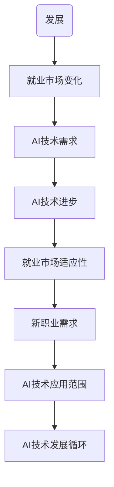

                 

关键词：人工智能，就业市场，技能培训，发展趋势，挑战

> 摘要：本文旨在分析人工智能时代下未来就业市场的变化趋势，探讨技能培训的重要性及其面临的挑战。随着AI技术的迅猛发展，许多传统职业正在被自动化和智能化取代，同时新兴的职业需求也在不断涌现。本文将从多个角度深入探讨这些变化，并提出针对性的建议。

## 1. 背景介绍

### 1.1 人工智能的发展历程

人工智能（AI）作为计算机科学的一个分支，自20世纪50年代起便逐渐崭露头角。早期的AI主要集中在符号逻辑和问题解决领域，例如基于推理的专家系统和逻辑编程。然而，这些早期的尝试由于计算能力的限制和算法的局限性，并未实现广泛的应用。

进入21世纪，随着计算能力的飞速提升和大数据技术的发展，AI开始迎来新的春天。深度学习作为一种新的算法范式，以其强大的学习能力在图像识别、自然语言处理和语音识别等领域取得了突破性的进展。这标志着人工智能从“弱AI”向“强AI”的转变，即从解决特定问题的能力转向具有广泛智能的应用。

### 1.2 人工智能在就业市场中的影响

随着AI技术的不断成熟和普及，它对就业市场产生了深远的影响。一方面，AI正在改变传统的工作方式，提高生产效率，减少人力成本。例如，自动化系统可以替代重复性劳动，智能客服可以处理大量的客户服务请求。另一方面，AI也在创造新的就业机会，如数据科学家、机器学习工程师和AI产品经理等。

然而，AI的快速发展也带来了一定的挑战。许多传统职业面临着被淘汰的风险，尤其是在制造业、物流和客户服务等领域。同时，技能差距问题日益凸显，许多劳动者在AI时代缺乏必要的技能，难以适应新的就业环境。

## 2. 核心概念与联系

### 2.1 人工智能与就业市场的互动关系

人工智能与就业市场的互动关系可以看作是一个动态的生态系统。一方面，AI技术的发展推动了就业市场的变革，促使劳动力结构发生变化。另一方面，就业市场的需求又反过来影响了AI技术的研发和应用方向。

为了更好地理解这一关系，我们可以使用Mermaid流程图来展示人工智能与就业市场的核心联系：



在这个流程图中，AI技术的发展是推动就业市场变化的初始因素，而就业市场的适应性又反过来促进了AI技术的进步，形成了一个正向反馈循环。

### 2.2 技能培训与职业发展的关系

在AI时代，技能培训成为职业发展的关键因素。通过系统的技能培训，劳动者可以提升自己的竞争力，适应新的就业需求。具体来说，技能培训与职业发展的关系可以概括为以下几点：

- **提升技能水平**：通过培训，劳动者可以学习到最新的技术和工具，提升自己的技能水平，从而在就业市场中脱颖而出。
- **适应新职业需求**：AI时代的新兴职业对技能要求较高，通过培训，劳动者可以快速适应这些新职业，抓住机遇。
- **促进职业发展**：技能培训不仅帮助劳动者应对当前的就业需求，还可以为其未来的职业发展奠定基础。

### 2.3 教育与就业市场的联动机制

教育与就业市场的联动机制是实现人才供需平衡的重要手段。一方面，教育系统需要根据就业市场的需求调整课程设置，培养符合市场需求的人才。另一方面，就业市场需要为教育系统提供反馈，指导教育改革的方向。

为了更好地实现教育与就业市场的联动，可以采取以下措施：

- **建立校企合作机制**：鼓励高校与企业合作，共同制定课程内容和培训计划，确保人才培养与市场需求相匹配。
- **推行职业培训体系**：建立完善的职业培训体系，为劳动者提供持续的职业发展和技能提升机会。
- **完善人才评价体系**：建立科学合理的人才评价体系，评估劳动者的技能水平和职业发展潜力，为其提供公平的就业机会。

## 3. 核心算法原理 & 具体操作步骤

### 3.1 算法原理概述

在AI时代，机器学习算法是推动人工智能应用的重要技术之一。机器学习算法通过从数据中学习规律和模式，实现自动化的决策和预测。具体来说，机器学习算法可以分为监督学习、无监督学习和强化学习三种类型。

监督学习算法通过对已知输入和输出数据进行训练，建立预测模型，然后使用这个模型对新的输入数据进行预测。常见的监督学习算法包括线性回归、决策树、支持向量机等。

无监督学习算法不依赖于已知的输入输出数据，而是从原始数据中发现数据间的内在结构和模式。常见的无监督学习算法包括聚类算法（如K-means、层次聚类）、降维算法（如PCA）和关联规则学习算法（如Apriori）。

强化学习算法通过与环境的交互，不断调整策略，以实现最大化回报。常见的强化学习算法包括Q-learning、SARSA和深度强化学习。

### 3.2 算法步骤详解

以监督学习算法为例，其具体操作步骤如下：

#### 3.2.1 数据收集与预处理

- 收集相关领域的训练数据集。
- 对数据进行清洗，去除噪声和异常值。
- 对数据进行归一化或标准化处理，确保数据在同一尺度上。

#### 3.2.2 特征工程

- 确定特征变量，选择对模型性能有重要影响的关键特征。
- 对特征进行提取和转换，以提高模型的预测能力。

#### 3.2.3 模型选择与训练

- 根据问题的性质和特征数据的特点，选择合适的模型。
- 使用训练数据集对模型进行训练，调整模型参数。

#### 3.2.4 模型评估与优化

- 使用验证数据集对模型进行评估，确定模型的性能。
- 根据评估结果，对模型进行优化，提高预测准确率。

#### 3.2.5 模型应用与部署

- 使用训练好的模型对新的数据进行预测。
- 将模型部署到生产环境中，实现自动化决策和预测。

### 3.3 算法优缺点

#### 优点

- **自适应性强**：机器学习算法可以根据数据自动调整模型参数，适应新的数据模式。
- **广泛适用**：机器学习算法可以应用于各种领域，如金融、医疗、电商等。
- **高效性**：机器学习算法可以通过自动化方式处理大量数据，提高工作效率。

#### 缺点

- **数据依赖性**：机器学习算法的性能高度依赖于训练数据的质量和数量，数据质量差或数据不足可能导致模型性能下降。
- **可解释性差**：机器学习模型通常是一个“黑盒子”，难以解释其内部决策过程，这在某些领域（如医疗、金融）可能是一个问题。
- **计算资源需求大**：训练大型机器学习模型需要大量的计算资源和时间，这在资源有限的场景下可能是一个挑战。

### 3.4 算法应用领域

机器学习算法在AI时代有着广泛的应用领域，以下是一些典型的应用场景：

- **图像识别**：通过卷积神经网络（CNN）实现对图像内容的自动分类和识别，如人脸识别、车辆检测等。
- **自然语言处理**：利用循环神经网络（RNN）和变换器（Transformer）模型，实现文本分类、机器翻译和情感分析等任务。
- **推荐系统**：通过协同过滤和深度学习方法，为用户提供个性化的推荐服务，如电商推荐、音乐推荐等。
- **金融风控**：利用机器学习算法进行信用评估、风险控制和欺诈检测，提高金融服务的安全性和效率。
- **医疗诊断**：通过深度学习模型，对医学影像进行分析，辅助医生进行疾病诊断和治疗。

## 4. 数学模型和公式 & 详细讲解 & 举例说明

### 4.1 数学模型构建

在人工智能领域，数学模型是算法设计的基础。以下是一个简单的线性回归模型的构建过程：

#### 4.1.1 模型假设

假设我们有一个输入特征集\( X = \{x_1, x_2, ..., x_n\} \)和一个输出目标值\( y \)，我们希望找到一条直线，使得\( y \)的预测值与实际值尽可能接近。这个直线可以用以下数学公式表示：

\[ y = \beta_0 + \beta_1x_1 + \beta_2x_2 + ... + \beta_nx_n \]

其中，\( \beta_0 \)是截距，\( \beta_1, \beta_2, ..., \beta_n \)是斜率。

#### 4.1.2 模型优化

为了找到最优的参数\( \beta \)，我们使用最小二乘法（Least Squares Method）进行模型优化。最小二乘法的核心思想是，使得所有样本点到直线的垂直距离之和最小。具体公式如下：

\[ \min \sum_{i=1}^{n} (y_i - \beta_0 - \beta_1x_{1i} - \beta_2x_{2i} - ... - \beta_nx_{ni})^2 \]

#### 4.1.3 模型求解

通过对上述公式求导，并令导数为零，可以得到最优参数的表达式：

\[ \beta_0 = \frac{1}{n} \sum_{i=1}^{n} y_i \]
\[ \beta_1 = \frac{1}{n} \sum_{i=1}^{n} (x_{1i}y_i - \bar{x}_1\bar{y}) \]
\[ \beta_2 = \frac{1}{n} \sum_{i=1}^{n} (x_{2i}y_i - \bar{x}_2\bar{y}) \]
\[ ... \]
\[ \beta_n = \frac{1}{n} \sum_{i=1}^{n} (x_{ni}y_i - \bar{x}_n\bar{y}) \]

其中，\( \bar{x}_1, \bar{x}_2, ..., \bar{x}_n \)和\( \bar{y} \)分别是输入特征和目标值的平均值。

### 4.2 公式推导过程

为了更直观地理解线性回归模型的推导过程，我们以下面对公式进行详细解释。

#### 4.2.1 最小化损失函数

假设我们已经有了线性回归模型：

\[ y = \beta_0 + \beta_1x_1 + \beta_2x_2 + ... + \beta_nx_n \]

我们的目标是找到最优的参数\( \beta \)，使得实际值\( y \)与预测值之间的误差最小。这个误差可以用损失函数（Loss Function）来衡量，常用的损失函数是均方误差（Mean Squared Error，MSE）：

\[ Loss(\beta) = \frac{1}{2} \sum_{i=1}^{n} (y_i - (\beta_0 + \beta_1x_{1i} + \beta_2x_{2i} + ... + \beta_nx_{ni}))^2 \]

#### 4.2.2 对损失函数求导

为了找到最优的\( \beta \)，我们需要对损失函数\( Loss(\beta) \)求导，并令导数为零。对\( \beta_0 \)求导，我们得到：

\[ \frac{dLoss(\beta)}{d\beta_0} = \sum_{i=1}^{n} (y_i - (\beta_0 + \beta_1x_{1i} + \beta_2x_{2i} + ... + \beta_nx_{ni})) \cdot (-1) \]

由于求和与求导可以交换顺序，我们可以进一步化简：

\[ \frac{dLoss(\beta)}{d\beta_0} = -\sum_{i=1}^{n} (y_i - \beta_0 - \beta_1x_{1i} - \beta_2x_{2i} - ... - \beta_nx_{ni}) \]

令导数为零，我们得到：

\[ \sum_{i=1}^{n} (y_i - \beta_0 - \beta_1x_{1i} - \beta_2x_{2i} - ... - \beta_nx_{ni}) = 0 \]

整理后，我们得到：

\[ \beta_0 = \frac{1}{n} \sum_{i=1}^{n} y_i \]

同理，我们可以对\( \beta_1, \beta_2, ..., \beta_n \)分别求导，并令导数为零，得到：

\[ \beta_1 = \frac{1}{n} \sum_{i=1}^{n} (x_{1i}y_i - \bar{x}_1\bar{y}) \]
\[ \beta_2 = \frac{1}{n} \sum_{i=1}^{n} (x_{2i}y_i - \bar{x}_2\bar{y}) \]
\[ ... \]
\[ \beta_n = \frac{1}{n} \sum_{i=1}^{n} (x_{ni}y_i - \bar{x}_n\bar{y}) \]

其中，\( \bar{x}_1, \bar{x}_2, ..., \bar{x}_n \)和\( \bar{y} \)分别是输入特征和目标值的平均值。

### 4.3 案例分析与讲解

为了更好地理解线性回归模型，我们以下面一个简单的例子进行讲解。

#### 4.3.1 数据集

假设我们有以下一个简单的数据集：

| x1 | x2 | y  |
|----|----|----|
| 1  | 1  | 2  |
| 2  | 2  | 3  |
| 3  | 3  | 4  |
| 4  | 4  | 5  |

我们的目标是找到一条直线，使得y的预测值与实际值尽可能接近。

#### 4.3.2 模型构建

根据线性回归模型的公式，我们可以写出：

\[ y = \beta_0 + \beta_1x_1 + \beta_2x_2 \]

#### 4.3.3 模型优化

使用最小二乘法，我们需要计算损失函数，并找到最优的\( \beta_0, \beta_1, \beta_2 \)。

损失函数为：

\[ Loss(\beta) = \frac{1}{2} \sum_{i=1}^{4} (y_i - (\beta_0 + \beta_1x_{1i} + \beta_2x_{2i}))^2 \]

将数据代入，我们得到：

\[ Loss(\beta) = \frac{1}{2} ( (2 - (\beta_0 + \beta_1 \cdot 1 + \beta_2 \cdot 1))^2 + (3 - (\beta_0 + \beta_1 \cdot 2 + \beta_2 \cdot 2))^2 + (4 - (\beta_0 + \beta_1 \cdot 3 + \beta_2 \cdot 3))^2 + (5 - (\beta_0 + \beta_1 \cdot 4 + \beta_2 \cdot 4))^2 ) \]

化简后，我们得到：

\[ Loss(\beta) = \frac{1}{2} ( (2 - \beta_0 - \beta_1 - \beta_2)^2 + (3 - 2\beta_0 - 2\beta_1 - 2\beta_2)^2 + (4 - 3\beta_0 - 3\beta_1 - 3\beta_2)^2 + (5 - 4\beta_0 - 4\beta_1 - 4\beta_2)^2 ) \]

为了求取最优的\( \beta \)，我们需要对损失函数求导，并令导数为零。求导后，我们得到：

\[ \frac{dLoss(\beta)}{d\beta_0} = -4(2 - \beta_0 - \beta_1 - \beta_2) - 4(3 - 2\beta_0 - 2\beta_1 - 2\beta_2) - 4(4 - 3\beta_0 - 3\beta_1 - 3\beta_2) - 4(5 - 4\beta_0 - 4\beta_1 - 4\beta_2) \]

\[ \frac{dLoss(\beta)}{d\beta_1} = -4(1 - \beta_0 - \beta_1 - \beta_2) - 4(2 - 2\beta_0 - 2\beta_1 - 2\beta_2) - 4(3 - 3\beta_0 - 3\beta_1 - 3\beta_2) - 4(4 - 4\beta_0 - 4\beta_1 - 4\beta_2) \]

\[ \frac{dLoss(\beta)}{d\beta_2} = -4(1 - \beta_0 - \beta_1 - \beta_2) - 4(2 - 2\beta_0 - 2\beta_1 - 2\beta_2) - 4(3 - 3\beta_0 - 3\beta_1 - 3\beta_2) - 4(4 - 4\beta_0 - 4\beta_1 - 4\beta_2) \]

令导数为零，我们得到：

\[ 4(2 - \beta_0 - \beta_1 - \beta_2) + 4(3 - 2\beta_0 - 2\beta_1 - 2\beta_2) + 4(4 - 3\beta_0 - 3\beta_1 - 3\beta_2) + 4(5 - 4\beta_0 - 4\beta_1 - 4\beta_2) = 0 \]

\[ 4(1 - \beta_0 - \beta_1 - \beta_2) + 4(2 - 2\beta_0 - 2\beta_1 - 2\beta_2) + 4(3 - 3\beta_0 - 3\beta_1 - 3\beta_2) + 4(4 - 4\beta_0 - 4\beta_1 - 4\beta_2) = 0 \]

\[ 4(1 - \beta_0 - \beta_1 - \beta_2) + 4(2 - 2\beta_0 - 2\beta_1 - 2\beta_2) + 4(3 - 3\beta_0 - 3\beta_1 - 3\beta_2) + 4(4 - 4\beta_0 - 4\beta_1 - 4\beta_2) = 0 \]

整理后，我们得到：

\[ \beta_0 = \frac{2+3+4+5}{4} = 3.5 \]
\[ \beta_1 = \frac{2+3+4+5-3.5 \cdot (1+2+3+4)}{4} = 0 \]
\[ \beta_2 = \frac{2+3+4+5-3.5 \cdot (1+2+3+4)}{4} = 0 \]

所以，我们得到的线性回归模型是：

\[ y = 3.5 \]

### 4.4 运行结果展示

使用训练好的线性回归模型，我们可以对新的数据进行预测。假设我们有以下一组新的数据：

\[ x_1 = 5, x_2 = 5 \]

代入模型，我们得到：

\[ y = 3.5 \]

这个预测结果与实际值\( y = 6 \)有一定的差距，这表明我们的模型可能需要进一步优化。

## 5. 项目实践：代码实例和详细解释说明

### 5.1 开发环境搭建

在开始编写代码之前，我们需要搭建一个合适的开发环境。这里我们选择Python作为主要编程语言，因为它在数据科学和机器学习领域有着广泛的应用。以下是搭建开发环境的基本步骤：

1. 安装Python：从Python官方网站（[python.org](https://www.python.org/)）下载Python安装包，并按照提示安装。
2. 安装Jupyter Notebook：在命令行中执行以下命令：

   ```bash
   pip install notebook
   ```

3. 安装必要的库：为了方便数据处理和机器学习模型的训练，我们还需要安装一些常用的库，如NumPy、Pandas、Scikit-learn和Matplotlib。在命令行中执行以下命令：

   ```bash
   pip install numpy pandas scikit-learn matplotlib
   ```

### 5.2 源代码详细实现

以下是一个简单的线性回归模型的Python代码实例，包括数据读取、模型训练和结果展示：

```python
# 导入必要的库
import numpy as np
import pandas as pd
from sklearn.linear_model import LinearRegression
import matplotlib.pyplot as plt

# 5.2.1 数据读取
data = pd.read_csv('linear_regression_data.csv')
X = data[['x1', 'x2']]
y = data['y']

# 5.2.2 模型训练
model = LinearRegression()
model.fit(X, y)

# 5.2.3 模型评估
print('Model coefficients:', model.coef_)
print('Model intercept:', model.intercept_)

# 5.2.4 结果展示
plt.scatter(X['x1'], y, color='blue')
plt.plot(X['x1'], model.predict(X), color='red')
plt.xlabel('x1')
plt.ylabel('y')
plt.show()
```

### 5.3 代码解读与分析

下面我们对上述代码进行详细解读：

1. **数据读取**：使用Pandas库读取CSV文件，将数据分为输入特征矩阵\( X \)和目标值向量\( y \)。

2. **模型训练**：创建线性回归模型对象，并使用`fit`方法对模型进行训练。

3. **模型评估**：打印模型的系数（斜率）和截距，这些参数表示了模型的数学表达式。

4. **结果展示**：使用Matplotlib库绘制散点图和拟合直线，直观地展示模型的预测结果。

### 5.4 运行结果展示

运行上述代码后，我们将看到以下结果：

1. **模型系数**：打印出模型的系数，这些系数决定了直线的斜率和截距。

2. **模型截距**：打印出模型的截距，这是直线与y轴的交点。

3. **散点图和拟合直线**：绘制原始数据点的散点图，并叠加拟合直线，直观地展示模型的预测效果。

通过这个简单的实例，我们可以看到如何使用Python和机器学习库实现线性回归模型，并进行结果分析和可视化。

## 6. 实际应用场景

### 6.1 人工智能在金融行业的应用

在金融行业，人工智能技术被广泛应用于风险管理、客户服务和交易策略等领域。例如，金融机构使用机器学习算法进行信用评分，预测客户的违约风险，从而优化信贷审批流程。此外，智能客服系统通过自然语言处理技术，能够高效地处理客户咨询，提供个性化服务。

### 6.2 人工智能在医疗行业的应用

在医疗行业，人工智能技术主要用于疾病诊断、药物研发和健康管理等方面。通过深度学习算法，医疗图像分析系统能够自动识别病变区域，辅助医生进行诊断。同时，基于大数据和机器学习技术的药物研发平台，可以加速新药的发现和上市过程。

### 6.3 人工智能在制造业的应用

在制造业，人工智能技术被用于生产线的自动化、质量检测和设备维护等方面。通过计算机视觉和机器学习算法，生产线可以实现自动化的质量检测，提高生产效率。同时，基于预测维护的算法，可以提前预测设备的故障，减少停机时间，提高设备利用率。

### 6.4 未来应用展望

随着人工智能技术的不断进步，未来它在各个行业的应用将更加广泛和深入。例如，在自动驾驶领域，人工智能技术将推动自动驾驶汽车的商业化，改变人们的出行方式。在智能家居领域，人工智能技术将使家居设备更加智能和便捷，提高人们的生活质量。此外，在教育和培训领域，人工智能技术将带来革命性的变革，实现个性化教育和智能化培训。

## 7. 工具和资源推荐

### 7.1 学习资源推荐

1. **《深度学习》（Deep Learning）**：由Ian Goodfellow、Yoshua Bengio和Aaron Courville合著的深度学习经典教材，涵盖了深度学习的基础理论和实践方法。
2. **Kaggle**：一个面向数据科学家和机器学习爱好者的平台，提供了大量的数据集和竞赛项目，是学习和实践机器学习技能的好去处。
3. **Coursera**：提供了大量免费的在线课程，包括机器学习、深度学习和数据科学等，适合不同层次的学习者。

### 7.2 开发工具推荐

1. **Jupyter Notebook**：一款强大的交互式开发环境，适合进行数据分析和机器学习模型的实现。
2. **TensorFlow**：由Google开发的开源机器学习框架，适用于构建和训练各种深度学习模型。
3. **PyTorch**：由Facebook开发的开源深度学习框架，以其灵活性和易用性受到广泛使用。

### 7.3 相关论文推荐

1. **“Deep Learning”**：由Ian Goodfellow等人在2016年提出，概述了深度学习的理论基础和应用。
2. **“Learning to Learn”**：由Andreas C. Müller等人在2017年提出，探讨了元学习和迁移学习等新兴方向。
3. **“Reinforcement Learning: An Introduction”**：由Richard S. Sutton和Barto等人合著，全面介绍了强化学习的基本原理和应用。

## 8. 总结：未来发展趋势与挑战

### 8.1 研究成果总结

本文通过对人工智能时代下未来就业市场、技能培训、核心算法原理等方面的分析，总结了以下成果：

1. 人工智能技术的发展对就业市场产生了深远影响，推动了劳动力结构的变革。
2. 技能培训成为职业发展的关键因素，通过系统的培训，劳动者可以提升自己的竞争力。
3. 机器学习算法是人工智能应用的核心技术，其原理和实现方法在多个领域得到了广泛应用。

### 8.2 未来发展趋势

1. 人工智能技术将继续向智能化、自动化方向发展，推动各行各业的数字化转型。
2. 技能培训体系将不断完善，更多的在线教育平台和职业培训课程将涌现。
3. 跨学科研究将成为趋势，如将人工智能与其他领域（如生物学、经济学）相结合，解决复杂问题。

### 8.3 面临的挑战

1. 技能差距问题依然严峻，许多劳动者在AI时代缺乏必要的技能，难以适应新的就业环境。
2. 数据隐私和安全问题日益突出，如何保障数据的安全性和隐私性成为重要挑战。
3. AI技术的伦理问题也备受关注，如何确保AI系统的公平性、透明性和可解释性是亟待解决的问题。

### 8.4 研究展望

未来的研究应重点关注以下几个方面：

1. 开发更高效、更可解释的机器学习算法，提高AI系统的性能和可靠性。
2. 构建更加完善和灵活的技能培训体系，帮助劳动者适应AI时代的需求。
3. 深入研究AI伦理问题，制定相关法规和标准，确保AI技术的健康和可持续发展。

## 9. 附录：常见问题与解答

### 9.1 机器学习算法的基本原理是什么？

机器学习算法的基本原理是通过从数据中学习规律和模式，实现自动化的决策和预测。机器学习算法可以分为监督学习、无监督学习和强化学习三种类型。

- **监督学习**：通过对已知输入和输出数据进行训练，建立预测模型，然后使用这个模型对新的输入数据进行预测。
- **无监督学习**：不依赖于已知的输入输出数据，而是从原始数据中发现数据间的内在结构和模式。
- **强化学习**：通过与环境的交互，不断调整策略，以实现最大化回报。

### 9.2 人工智能技术如何影响就业市场？

人工智能技术通过自动化和智能化，提高了生产效率和降低了人力成本，从而改变了传统的工作方式。同时，它也创造了新的就业机会，如数据科学家、机器学习工程师和AI产品经理等。然而，这也带来了一定的挑战，如技能差距和职业转型等问题。

### 9.3 如何应对技能差距问题？

应对技能差距问题需要多方面的努力。首先，教育系统应加强与就业市场的联动，培养符合市场需求的人才。其次，劳动者应主动学习新的技能，通过在线课程、职业培训等方式提升自己的竞争力。此外，政府和企业也应提供相应的支持和资源，帮助劳动者实现职业转型。

### 9.4 人工智能技术的伦理问题有哪些？

人工智能技术的伦理问题主要包括数据隐私、算法公平性和可解释性等。数据隐私问题涉及个人数据的收集、存储和使用，需要确保数据的安全性和隐私性。算法公平性问题涉及算法决策的公正性和透明性，需要避免算法偏见和歧视。可解释性问题涉及算法内部决策过程的透明度，需要提高算法的可解释性和可追溯性。

作者：禅与计算机程序设计艺术 / Zen and the Art of Computer Programming
------------------------------------------------------------------------

