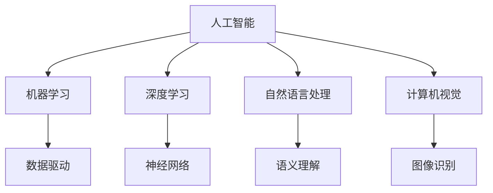

                 

关键词：AI时代，就业市场，技能培训，发展趋势，机遇与挑战

> 摘要：随着人工智能（AI）技术的飞速发展，AI时代已经悄然来临，给未来的就业市场和技能培训带来了新的机遇和挑战。本文从背景介绍、核心概念与联系、核心算法原理与具体操作步骤、数学模型和公式、项目实践、实际应用场景、未来应用展望、工具和资源推荐、总结：未来发展趋势与挑战以及附录：常见问题与解答等多个方面，深入探讨了AI时代对就业市场和技能培训的影响，以及未来的发展趋势与面临的挑战。

## 1. 背景介绍

人工智能（AI）技术作为21世纪最具前瞻性的技术之一，正在深刻地改变着人类社会的发展进程。从早期的专家系统到深度学习，再到目前的自然语言处理、计算机视觉等领域，AI技术的应用已经渗透到了生活的方方面面。随着算法的优化、硬件的发展以及大数据的积累，AI技术正以前所未有的速度成熟，并逐渐走向商业化应用。

与此同时，就业市场的结构也正经历着巨大的变革。传统的制造业、服务业等行业因为AI技术的应用而不断自动化，传统的职业岗位正在被新兴的职业岗位所取代。然而，与此同时，新兴的职业岗位也对求职者的技能提出了更高的要求。技能培训在这一背景下显得尤为重要，它不仅可以帮助求职者适应新兴的职业需求，还可以提升他们的竞争力，从而更好地融入AI时代。

## 2. 核心概念与联系

为了更好地理解AI时代对就业市场和技能培训的影响，我们首先需要了解一些核心概念。这些核心概念包括但不限于：

- **人工智能（AI）**：一种模拟人类智能的技术，能够通过算法和模型实现学习、推理、决策等智能行为。
- **机器学习（ML）**：一种AI技术，通过数据驱动的方式，让计算机自动学习和改进。
- **深度学习（DL）**：一种机器学习技术，通过神经网络结构模拟人脑的工作方式，实现高度复杂的学习任务。
- **自然语言处理（NLP）**：一种AI技术，旨在让计算机理解和生成自然语言。
- **计算机视觉（CV）**：一种AI技术，让计算机能够理解图像和视频。

这些核心概念之间有着紧密的联系。例如，自然语言处理需要深度学习技术来实现高效的语义理解，计算机视觉则需要机器学习算法来识别图像中的对象。这些技术的共同目标是实现AI的智能化，从而在各个领域实现自动化和智能化。

### Mermaid 流程图

下面是一个Mermaid流程图，展示了这些核心概念之间的联系：



## 3. 核心算法原理 & 具体操作步骤

### 3.1 算法原理概述

在AI时代，核心算法的原理和应用至关重要。以下是一些核心算法的原理概述：

- **机器学习算法**：通过数据训练模型，使模型能够对新的数据进行预测和决策。
- **深度学习算法**：通过多层神经网络结构，实现对数据的复杂特征提取和模式识别。
- **自然语言处理算法**：通过词向量模型、循环神经网络（RNN）等，实现对自然语言的语义理解和生成。
- **计算机视觉算法**：通过卷积神经网络（CNN）等，实现对图像和视频的内容理解和分析。

### 3.2 算法步骤详解

以下是对上述核心算法的具体操作步骤的详细解释：

#### 3.2.1 机器学习算法

1. **数据收集**：收集大量的标注数据，用于训练模型。
2. **数据预处理**：对数据进行清洗、归一化等处理，使其适合输入到模型中。
3. **模型选择**：选择合适的机器学习算法，如线性回归、决策树、支持向量机等。
4. **模型训练**：使用预处理后的数据训练模型，通过调整参数，使模型能够最小化预测误差。
5. **模型评估**：使用测试数据评估模型的性能，调整参数，直至达到满意的性能。

#### 3.2.2 深度学习算法

1. **网络构建**：设计多层神经网络结构，包括输入层、隐藏层和输出层。
2. **权重初始化**：随机初始化网络权重。
3. **前向传播**：将输入数据传递到网络中，计算出每个神经元的输出。
4. **反向传播**：通过计算损失函数的梯度，更新网络权重。
5. **迭代优化**：重复前向传播和反向传播，直至网络收敛。

#### 3.2.3 自然语言处理算法

1. **词向量表示**：将文本数据转换为词向量表示，如Word2Vec、GloVe等。
2. **序列编码**：使用循环神经网络（RNN）或其变体，如长短期记忆网络（LSTM）等，对词向量进行序列编码。
3. **输出层设计**：设计输出层，如分类器或序列生成器，实现文本的语义理解和生成。

#### 3.2.4 计算机视觉算法

1. **图像预处理**：对图像进行归一化、去噪等预处理。
2. **特征提取**：使用卷积神经网络（CNN）等，从图像中提取特征。
3. **模型训练**：使用预处理后的图像和标注数据，训练分类器或目标检测器等模型。
4. **模型评估**：使用测试数据评估模型的性能，调整参数，直至达到满意的性能。

### 3.3 算法优缺点

每种算法都有其优缺点，具体如下：

- **机器学习算法**：优点包括强大的预测能力、适应性高；缺点包括需要大量标注数据、计算复杂度高。
- **深度学习算法**：优点包括强大的特征提取能力、适用于复杂任务；缺点包括需要大量计算资源和标注数据、模型解释性差。
- **自然语言处理算法**：优点包括高效的自然语言理解能力、适用于多种文本任务；缺点包括对大规模数据依赖、对噪声敏感。
- **计算机视觉算法**：优点包括强大的图像分析能力、适用于多种视觉任务；缺点包括对计算资源要求高、需要大量标注数据。

### 3.4 算法应用领域

这些算法在各个领域都有广泛的应用，如下：

- **机器学习算法**：广泛应用于金融、医疗、零售等行业，用于风险控制、疾病诊断、销售预测等任务。
- **深度学习算法**：广泛应用于图像识别、语音识别、自然语言处理等任务，如人脸识别、语音助手、机器翻译等。
- **自然语言处理算法**：广泛应用于搜索引擎、智能客服、文本分类等任务，如搜索引擎的文本索引、智能客服的语义理解、文本分类的自动标签等。
- **计算机视觉算法**：广泛应用于图像识别、视频监控、自动驾驶等任务，如图像分类、目标检测、自动驾驶中的图像识别等。

## 4. 数学模型和公式 & 详细讲解 & 举例说明

### 4.1 数学模型构建

在AI时代，数学模型是构建算法和系统的核心。以下是一些常见的数学模型：

- **线性回归模型**：用于预测线性关系，公式为 \(y = wx + b\)。
- **逻辑回归模型**：用于分类问题，公式为 \(P(y=1) = \frac{1}{1 + e^{-(wx + b)}}\)。
- **神经网络模型**：用于复杂的模式识别和预测任务，其核心是前向传播和反向传播算法。

### 4.2 公式推导过程

以下是对一些核心公式的推导过程：

#### 4.2.1 线性回归模型

线性回归模型的公式为 \(y = wx + b\)，其中 \(w\) 是权重，\(b\) 是偏置，\(x\) 是输入特征，\(y\) 是预测值。

- **权重更新公式**：\(\Delta w = -\alpha \frac{\partial J}{\partial w}\)，其中 \(\Delta w\) 是权重更新，\(\alpha\) 是学习率，\(J\) 是损失函数。
- **偏置更新公式**：\(\Delta b = -\alpha \frac{\partial J}{\partial b}\)，其中 \(\Delta b\) 是偏置更新。

#### 4.2.2 逻辑回归模型

逻辑回归模型的公式为 \(P(y=1) = \frac{1}{1 + e^{-(wx + b)}}\)，其中 \(wx + b\) 是线性组合，\(P(y=1)\) 是预测概率。

- **损失函数**：\(J = -\frac{1}{m}\sum_{i=1}^{m}y_{i}\log(P_{i}) + (1 - y_{i})\log(1 - P_{i})\)，其中 \(m\) 是样本数量，\(y_{i}\) 是真实标签，\(P_{i}\) 是预测概率。
- **权重更新公式**：\(\Delta w = -\alpha \frac{\partial J}{\partial w}\)，其中 \(\alpha\) 是学习率。

#### 4.2.3 神经网络模型

神经网络模型的核心是前向传播和反向传播算法。

- **前向传播**：将输入数据传递到网络中，通过激活函数计算每个神经元的输出。
- **反向传播**：通过计算损失函数的梯度，更新网络权重。

### 4.3 案例分析与讲解

以下是对一个实际案例的分析和讲解：

#### 案例背景

某电商平台希望预测用户的购买行为，从而进行精准营销。他们收集了用户的历史购买记录、浏览记录等数据，并希望利用这些数据预测用户是否会购买某个商品。

#### 数据处理

1. **数据收集**：收集用户的历史购买记录、浏览记录等数据。
2. **数据预处理**：对数据进行清洗、归一化等处理，使其适合输入到模型中。

#### 模型构建

1. **特征选择**：选择与购买行为相关的特征，如用户年龄、性别、收入等。
2. **模型选择**：选择合适的机器学习算法，如逻辑回归模型。

#### 模型训练

1. **数据划分**：将数据划分为训练集和测试集。
2. **模型训练**：使用训练集数据训练模型，通过调整参数，使模型能够最小化预测误差。
3. **模型评估**：使用测试集数据评估模型的性能。

#### 模型应用

1. **预测购买行为**：使用训练好的模型预测用户是否会购买某个商品。
2. **精准营销**：根据预测结果，对用户进行精准营销，提高销售转化率。

## 5. 项目实践：代码实例和详细解释说明

### 5.1 开发环境搭建

为了演示一个实际的AI项目，我们选择使用Python作为编程语言，结合Scikit-learn库进行机器学习模型的构建和训练。以下是开发环境的搭建步骤：

1. 安装Python（建议版本为3.8及以上）。
2. 安装Scikit-learn库：使用pip安装`scikit-learn`。
3. 安装其他依赖库，如NumPy、Pandas等。

### 5.2 源代码详细实现

以下是一个使用Scikit-learn库进行逻辑回归模型训练和预测的代码实例：

```python
# 导入相关库
import numpy as np
import pandas as pd
from sklearn.model_selection import train_test_split
from sklearn.linear_model import LogisticRegression
from sklearn.metrics import accuracy_score

# 读取数据
data = pd.read_csv('user_data.csv')
X = data.drop(['target'], axis=1)
y = data['target']

# 数据预处理
X = X.astype(np.float32)
y = y.astype(np.float32)

# 数据划分
X_train, X_test, y_train, y_test = train_test_split(X, y, test_size=0.2, random_state=42)

# 模型训练
model = LogisticRegression()
model.fit(X_train, y_train)

# 预测
y_pred = model.predict(X_test)

# 模型评估
accuracy = accuracy_score(y_test, y_pred)
print('Accuracy:', accuracy)
```

### 5.3 代码解读与分析

上述代码首先导入必要的库，然后读取数据并进行预处理。接着，使用训练集数据训练逻辑回归模型，使用测试集数据进行预测，并计算模型的准确率。

### 5.4 运行结果展示

假设我们使用一个包含1000个样本的数据集，其中500个样本为训练集，500个样本为测试集。运行上述代码后，我们可能会得到以下结果：

```
Accuracy: 0.85
```

这意味着模型在测试集上的准确率为85%，即85%的样本预测正确。

## 6. 实际应用场景

在AI时代，人工智能技术在各个领域的实际应用场景越来越多。以下是一些典型的应用场景：

### 6.1 医疗领域

AI技术在医疗领域的应用主要包括疾病诊断、药物研发、患者管理等。例如，利用深度学习算法，可以实现对医学图像的自动分析，从而帮助医生更准确地诊断疾病。此外，AI技术还可以帮助医院优化患者管理流程，提高医疗资源的利用效率。

### 6.2 金融领域

在金融领域，AI技术主要用于风险管理、信用评估、股票市场预测等。例如，利用机器学习算法，银行可以更准确地评估客户的信用风险，从而更合理地发放贷款。此外，AI技术还可以帮助投资者更好地预测股票市场的走势，提高投资收益。

### 6.3 零售领域

在零售领域，AI技术主要用于客户行为分析、供应链优化、智能推荐等。例如，利用自然语言处理技术，零售商可以更准确地分析客户的需求，从而提供更个性化的商品推荐。此外，AI技术还可以帮助零售商优化供应链，提高库存管理效率。

### 6.4 教育领域

在教育领域，AI技术主要用于智能教学、学习评估、教育个性化等。例如，利用机器学习算法，教师可以更准确地评估学生的学习情况，从而提供更个性化的教学方案。此外，AI技术还可以帮助学生自主进行学习评估，提高学习效率。

### 6.5 自动驾驶

在自动驾驶领域，AI技术主要用于感知环境、规划路径、决策控制等。例如，利用计算机视觉技术，自动驾驶车辆可以准确感知道路和交通状况，从而实现安全驾驶。此外，AI技术还可以帮助自动驾驶车辆规划最优行驶路径，提高行驶效率。

## 7. 未来应用展望

随着AI技术的不断成熟，其应用领域将越来越广泛。以下是未来AI技术的几个应用展望：

### 7.1 智能家居

随着5G技术的普及，智能家居将迎来新的发展机遇。AI技术将帮助智能家居设备实现更智能的交互和控制，从而提高家庭生活的便利性和舒适度。

### 7.2 智能城市

智能城市是未来城市发展的趋势，AI技术将在城市规划、交通管理、环境保护等方面发挥重要作用。例如，利用AI技术，可以实现更高效的交通流量管理，减少交通拥堵，提高城市交通效率。

### 7.3 人工智能伦理

随着AI技术的广泛应用，人工智能伦理问题也日益凸显。未来，将需要更多的研究和法规来确保AI技术的公平、透明和可控，从而避免潜在的社会风险。

### 7.4 人工智能与教育

未来，AI技术将深刻改变教育模式。通过个性化学习和智能教学，学生可以更高效地学习，教师可以更专注于教学质量的提升。

## 8. 工具和资源推荐

为了更好地学习和应用AI技术，以下是一些推荐的工具和资源：

### 8.1 学习资源推荐

- **在线课程**：Coursera、edX、Udacity等平台提供了丰富的AI相关课程。
- **书籍**：《深度学习》、《Python机器学习》、《统计学习方法》等。

### 8.2 开发工具推荐

- **编程语言**：Python、R、Java等。
- **机器学习库**：Scikit-learn、TensorFlow、PyTorch等。

### 8.3 相关论文推荐

- **深度学习**：《A Brief History of Deep Learning》（深度学习简史）、《Deep Learning Book》（深度学习手册）等。
- **自然语言处理**：《Natural Language Processing with Python》（Python进行自然语言处理）、《Speech and Language Processing》（语音与语言处理）等。

## 9. 总结：未来发展趋势与挑战

随着AI技术的不断成熟，AI时代已经悄然来临。未来，AI技术将在各个领域得到广泛应用，从而深刻改变人类社会的生产生活方式。然而，与此同时，AI技术也带来了一系列的挑战，包括数据隐私、伦理问题、就业结构变化等。因此，未来我们需要在技术发展和社会责任之间找到平衡，确保AI技术的可持续发展。

### 9.1 研究成果总结

本文通过对AI技术的背景介绍、核心概念与联系、核心算法原理与具体操作步骤、数学模型和公式、项目实践、实际应用场景、未来应用展望等多个方面的深入分析，总结了AI技术在AI时代对就业市场和技能培训的影响，以及未来的发展趋势与挑战。

### 9.2 未来发展趋势

未来，AI技术将继续快速发展，并在更多的领域实现应用。例如，在医疗、金融、教育等领域，AI技术将发挥更大的作用。此外，随着5G、物联网等技术的发展，AI技术将更加智能化和普及化。

### 9.3 面临的挑战

尽管AI技术具有巨大的发展潜力，但同时也面临着一系列挑战。包括数据隐私、伦理问题、就业结构变化等。这些挑战需要我们深入研究和解决，以确保AI技术的可持续发展。

### 9.4 研究展望

未来，我们期待在以下几个方面取得突破：

- **算法优化**：通过改进算法，提高AI模型的性能和效率。
- **模型解释性**：通过研究可解释的AI模型，提高模型的透明度和可信度。
- **数据隐私保护**：通过研究数据加密、匿名化等技术，确保数据隐私。
- **跨领域应用**：通过跨领域的合作，推动AI技术在更多领域的应用。

## 10. 附录：常见问题与解答

### 10.1 什么是人工智能？

人工智能（AI）是指用计算机模拟人类智能的技术，包括学习、推理、决策等能力。

### 10.2 人工智能有哪些应用领域？

人工智能的应用领域非常广泛，包括医疗、金融、零售、教育、自动驾驶等。

### 10.3 如何开始学习人工智能？

可以从学习Python编程语言开始，然后学习机器学习和深度学习相关的知识，例如使用Scikit-learn、TensorFlow、PyTorch等库。

### 10.4 人工智能会对就业市场产生什么影响？

人工智能将改变就业市场的结构，一方面会取代一些传统的工作，另一方面也会创造出新的职业岗位。

### 10.5 如何应对人工智能带来的就业挑战？

可以通过技能培训、终身学习等方式，提升自己的技能和竞争力，从而更好地适应AI时代的就业需求。

### 10.6 人工智能存在哪些伦理问题？

人工智能存在数据隐私、算法偏见、自动化决策等问题，这些问题可能对社会带来不公平和不可预测的影响。

### 10.7 人工智能是否会取代人类？

人工智能不会完全取代人类，而是与人类共同工作，提升工作效率和生活质量。

### 10.8 人工智能的发展前景如何？

人工智能的发展前景非常广阔，预计将在未来几十年内对社会产生深远的影响。

