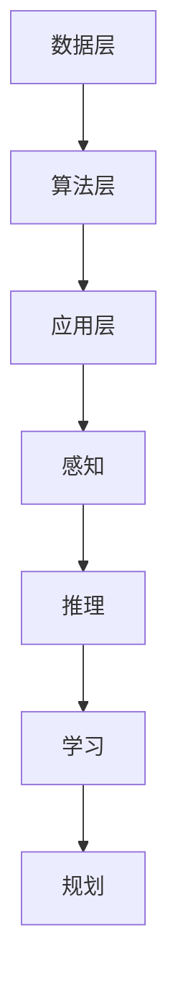

                 

关键词：人工智能、就业市场、技能培训、发展趋势、机遇与挑战

> 摘要：随着人工智能技术的迅猛发展，未来就业市场将面临深刻变革。本文从人工智能技术的核心概念入手，分析了其与人类计算的关系，探讨了AI时代下的就业市场趋势，以及技能培训的需求与挑战。文章旨在为读者提供对未来就业市场的清晰认识，并展望人工智能技术带来的机遇与挑战。

## 1. 背景介绍

随着信息技术的快速发展，人工智能（AI）已经成为当今世界的重要趋势。AI技术正在深刻改变我们的生活方式和就业市场。在过去的几十年里，人工智能从最初的实验室研究逐渐走向实际应用，如今已经成为推动社会进步的关键力量。从智能家居到自动驾驶，从医疗诊断到金融分析，人工智能在各个领域都展现出了巨大的潜力。

然而，随着人工智能技术的不断发展，就业市场也面临着前所未有的挑战。一方面，人工智能的广泛应用将替代一部分传统岗位，导致失业率上升。另一方面，新的工作岗位也在不断涌现，需要人类具备新的技能和知识。因此，如何应对AI时代的就业变革，成为社会关注的焦点。

本文将围绕人工智能技术的核心概念，探讨其在就业市场中的应用，分析未来就业市场的发展趋势，并探讨技能培训的需求与挑战。希望通过本文的探讨，能够为读者提供对AI时代就业市场的深刻理解和前瞻性思考。

### 1.1 人工智能的定义与发展历程

人工智能（Artificial Intelligence，简称AI）是指通过计算机模拟人类智能行为的技术。具体来说，人工智能旨在开发出能够感知、思考、学习和决策的智能系统。人工智能的发展历程可以分为几个重要阶段：

- **模拟阶段**（20世纪50年代至70年代）：人工智能的早期研究主要集中在逻辑推理和问题求解上。这个阶段的代表性成果包括逻辑推理机、专家系统和自然语言处理系统。

- **停滞阶段**（20世纪80年代）：由于早期人工智能系统的性能不理想，加之计算能力的限制，人工智能研究进入了停滞期。

- **复苏阶段**（20世纪90年代）：随着计算能力的提升和大数据技术的发展，人工智能研究逐渐复苏。这一阶段的代表性成果包括深度学习和神经网络。

- **应用阶段**（21世纪）：人工智能技术开始广泛应用于各个领域，如图像识别、自然语言处理、自动驾驶和智能制造等。人工智能的应用不仅提升了生产效率，也带来了新的商业模式和社会变革。

### 1.2 人工智能的关键技术

人工智能的关键技术包括机器学习、深度学习、自然语言处理、计算机视觉等。这些技术共同构成了人工智能的基础架构，推动了人工智能的发展和应用。

- **机器学习**：机器学习是一种通过算法从数据中学习规律和模式的技术。它包括监督学习、无监督学习和强化学习等不同类型。机器学习在预测、分类和聚类等方面具有广泛的应用。

- **深度学习**：深度学习是一种基于人工神经网络的学习方法，通过多层神经网络模型提取数据的特征和模式。深度学习在图像识别、语音识别和自然语言处理等领域取得了显著的成果。

- **自然语言处理**：自然语言处理是一种使计算机能够理解、生成和处理人类语言的技术。它包括文本分类、情感分析、机器翻译等任务。自然语言处理在搜索引擎、智能客服和语音助手等领域有广泛应用。

- **计算机视觉**：计算机视觉是一种使计算机能够理解和解释图像和视频的技术。它包括目标检测、图像识别和图像分割等任务。计算机视觉在自动驾驶、安防监控和医疗诊断等领域具有重要应用。

### 1.3 人工智能的影响与应用

人工智能技术已经深刻影响了各个领域，提升了生产效率和服务质量。以下是一些典型的应用案例：

- **工业生产**：人工智能技术在智能制造中发挥了重要作用，通过自动化生产线和智能传感器实现生产过程的智能化和高效化。

- **医疗健康**：人工智能技术在医疗诊断、药物研发和健康管理等方面具有广泛应用。例如，人工智能可以帮助医生进行疾病诊断，提高诊断的准确性和效率。

- **金融领域**：人工智能在金融领域中的应用包括风险控制、智能投顾、欺诈检测等。通过大数据分析和机器学习算法，人工智能可以帮助金融机构降低风险，提高运营效率。

- **交通运输**：自动驾驶技术是人工智能在交通运输领域的重要应用。自动驾驶汽车和无人机等交通工具的普及，有望改变人们的出行方式和物流模式。

- **智能家居**：智能家居通过人工智能技术实现家庭设备的智能化，如智能音箱、智能灯泡、智能门锁等，为人们提供更加便捷和舒适的生活体验。

### 1.4 人工智能与人类计算的关系

人工智能与人类计算有着密切的关系。人类计算是指人类使用计算思维解决问题的方式，而人工智能则是通过模拟人类计算过程实现自动化和智能化的技术。具体来说：

- **计算思维**：计算思维是人类解决问题的一种方式，包括抽象思维、算法思维和系统思维等。计算思维强调通过分解问题、设计算法和构建系统来解决问题。

- **人工智能模拟**：人工智能通过模拟计算思维的过程，实现了自动化和智能化的计算。例如，机器学习算法通过模拟人类的学习过程，实现了数据的自动分析和决策。

- **协同进化**：人工智能和人类计算相互促进，共同发展。人工智能技术的发展促进了计算思维的提升，而计算思维的进步又为人工智能的应用提供了新的思路和方法。

总之，人工智能与人类计算相辅相成，共同推动着人类社会的发展。随着人工智能技术的不断进步，人类计算将变得更加高效和智能化。

## 2. 核心概念与联系

### 2.1 人工智能的核心概念

人工智能的核心概念包括感知、推理、学习和规划。这些概念共同构成了人工智能的基本架构，使人工智能系统能够模拟人类的智能行为。

- **感知**：感知是指人工智能系统通过传感器获取外部信息的能力。例如，计算机视觉系统通过摄像头获取图像，自然语言处理系统通过语音识别获取文本信息。

- **推理**：推理是指人工智能系统根据已有信息进行逻辑推理和判断的能力。例如，专家系统通过推理机进行逻辑推理，得出结论。

- **学习**：学习是指人工智能系统通过数据和算法不断改进自身性能的能力。例如，机器学习算法通过大量数据训练模型，提高预测和分类的准确性。

- **规划**：规划是指人工智能系统根据目标和环境信息制定行动策略的能力。例如，自动驾驶系统通过规划路径，实现安全驾驶。

### 2.2 人工智能与人类计算的联系

人工智能与人类计算有着密切的联系。人类计算强调计算思维，而人工智能则是计算思维的实现工具。

- **计算思维**：计算思维是人类解决问题的一种方式，包括抽象思维、算法思维和系统思维等。计算思维强调通过分解问题、设计算法和构建系统来解决问题。

- **人工智能模拟**：人工智能通过模拟计算思维的过程，实现了自动化和智能化的计算。例如，机器学习算法通过模拟人类的学习过程，实现了数据的自动分析和决策。

- **协同进化**：人工智能和人类计算相互促进，共同发展。人工智能技术的发展促进了计算思维的提升，而计算思维的进步又为人工智能的应用提供了新的思路和方法。

### 2.3 人工智能系统的架构

人工智能系统通常包括数据层、算法层和应用层三个层次。

- **数据层**：数据层是人工智能系统的基础，包括数据的采集、存储和处理。数据质量直接影响人工智能系统的性能和效果。

- **算法层**：算法层是人工智能系统的核心，包括机器学习、深度学习、自然语言处理和计算机视觉等算法。不同的算法适用于不同的应用场景。

- **应用层**：应用层是人工智能系统面向用户的服务界面，包括各种实际应用场景，如智能问答、自动驾驶、智能医疗等。

### 2.4 Mermaid 流程图表示

下面是一个使用Mermaid绘制的简单流程图，展示人工智能系统的基本架构：



在这个流程图中，数据层、算法层和应用层分别表示人工智能系统的三个主要组成部分。感知、推理、学习和规划等核心概念通过流程图进行连接，展示了人工智能系统的整体架构。

## 3. 核心算法原理 & 具体操作步骤

### 3.1 算法原理概述

在人工智能领域，核心算法的原理是实现自动化和智能化的关键。以下将介绍几种典型的核心算法，包括其原理和基本步骤。

#### 3.1.1 机器学习算法

机器学习算法是人工智能的核心技术之一。它通过从数据中学习规律和模式，实现数据的自动分析和决策。常见的机器学习算法包括线性回归、逻辑回归、决策树、支持向量机和神经网络等。

- **线性回归**：线性回归是一种预测数值输出值的算法。其基本原理是通过拟合一条直线，最小化预测值与实际值之间的误差。

- **逻辑回归**：逻辑回归是一种用于分类的算法。其基本原理是通过拟合一个逻辑函数，将输入数据映射到概率空间。

- **决策树**：决策树是一种基于树形结构进行决策的算法。其基本原理是通过划分特征空间，将数据分为不同的区域，并在每个区域上做出决策。

- **支持向量机**：支持向量机是一种用于分类和回归的算法。其基本原理是通过寻找最优决策边界，将数据分为不同的类别。

- **神经网络**：神经网络是一种模拟人脑神经元连接结构的算法。其基本原理是通过多层神经网络，逐步提取数据的特征和模式。

#### 3.1.2 深度学习算法

深度学习算法是机器学习的一种重要分支，它通过多层神经网络结构，实现更复杂的数据特征提取和模式识别。深度学习算法的核心是卷积神经网络（CNN）和循环神经网络（RNN）。

- **卷积神经网络**：卷积神经网络是一种用于图像识别和处理的算法。其基本原理是通过卷积操作和池化操作，提取图像的特征和模式。

- **循环神经网络**：循环神经网络是一种用于序列数据处理和预测的算法。其基本原理是通过循环连接和门控机制，实现数据的记忆和传递。

#### 3.1.3 自然语言处理算法

自然语言处理算法是用于处理和生成自然语言文本的算法。常见的自然语言处理算法包括词向量表示、文本分类和机器翻译等。

- **词向量表示**：词向量表示是将文本数据转换为向量表示的方法。常见的词向量模型包括Word2Vec、GloVe和BERT等。

- **文本分类**：文本分类是将文本数据分为不同类别的算法。常见的文本分类算法包括朴素贝叶斯、支持向量机和深度学习模型等。

- **机器翻译**：机器翻译是将一种语言的文本翻译为另一种语言的算法。常见的机器翻译模型包括统计机器翻译、神经机器翻译和基于预训练的模型等。

### 3.2 算法步骤详解

以下将详细介绍机器学习算法、深度学习算法和自然语言处理算法的基本步骤。

#### 3.2.1 机器学习算法步骤

1. **数据收集与预处理**：收集相关数据，并进行数据清洗、归一化和特征提取等预处理操作。

2. **模型选择**：根据问题类型和数据特征，选择合适的机器学习算法模型。

3. **模型训练**：使用训练数据对模型进行训练，通过最小化损失函数，优化模型参数。

4. **模型评估**：使用验证数据对模型进行评估，判断模型性能是否符合预期。

5. **模型优化**：根据评估结果，对模型进行调整和优化，提高模型性能。

6. **模型应用**：将训练好的模型应用到实际问题中，实现数据的自动分析和决策。

#### 3.2.2 深度学习算法步骤

1. **数据收集与预处理**：与机器学习算法类似，收集相关数据并进行预处理。

2. **模型设计**：根据问题类型和数据特征，设计合适的深度学习模型结构。

3. **模型训练**：使用训练数据对模型进行训练，通过反向传播算法优化模型参数。

4. **模型评估**：使用验证数据对模型进行评估，判断模型性能。

5. **模型优化**：根据评估结果，对模型进行调整和优化。

6. **模型应用**：将训练好的模型应用到实际问题中。

#### 3.2.3 自然语言处理算法步骤

1. **数据收集与预处理**：收集文本数据，并进行分词、词性标注等预处理操作。

2. **词向量表示**：将文本数据转换为词向量表示，为后续处理提供基础。

3. **模型选择**：根据任务类型，选择合适的自然语言处理模型。

4. **模型训练**：使用训练数据对模型进行训练，优化模型参数。

5. **模型评估**：使用验证数据对模型进行评估，判断模型性能。

6. **模型优化**：根据评估结果，对模型进行调整和优化。

7. **模型应用**：将训练好的模型应用到实际文本处理任务中。

### 3.3 算法优缺点

不同的算法在性能、效率和适用范围等方面存在差异。以下是对几种核心算法的优缺点分析：

#### 3.3.1 机器学习算法

**优点**：

- **通用性强**：机器学习算法适用于各种类型的数据和问题，具有广泛的适用范围。
- **灵活性高**：机器学习算法可以根据不同的问题和数据特征进行灵活调整。
- **可解释性强**：许多机器学习算法具有较好的可解释性，有助于理解模型的决策过程。

**缺点**：

- **计算复杂度高**：机器学习算法通常需要大量的计算资源和时间。
- **数据依赖性强**：机器学习算法的性能依赖于数据的质量和数量，对数据质量要求较高。
- **可解释性较弱**：一些复杂的机器学习算法，如深度学习，其决策过程难以解释。

#### 3.3.2 深度学习算法

**优点**：

- **性能优异**：深度学习算法在图像识别、语音识别和自然语言处理等领域具有很高的性能。
- **自动化特征提取**：深度学习算法可以通过多层神经网络自动提取数据的高级特征。
- **适用于大规模数据**：深度学习算法适用于处理大规模和复杂的数据。

**缺点**：

- **计算资源消耗大**：深度学习算法通常需要大量的计算资源和时间。
- **数据依赖性强**：深度学习算法的性能同样依赖于数据的质量和数量。
- **可解释性较弱**：深度学习算法的决策过程复杂，难以解释。

#### 3.3.3 自然语言处理算法

**优点**：

- **适用性广泛**：自然语言处理算法适用于文本数据的分类、情感分析和机器翻译等任务。
- **可扩展性强**：自然语言处理算法可以通过扩展模型和算法，实现新的文本处理任务。
- **效果显著**：自然语言处理算法在文本数据的处理和生成方面具有显著的效果。

**缺点**：

- **数据预处理复杂**：自然语言处理算法需要对文本数据进行复杂的预处理操作，如分词、词性标注等。
- **计算资源消耗较大**：自然语言处理算法通常需要大量的计算资源和时间。
- **语言理解有限**：自然语言处理算法在理解复杂语言和语境方面存在一定的局限性。

### 3.4 算法应用领域

不同的算法在各自的应用领域中发挥着重要作用。以下是对几种核心算法应用领域的分析：

#### 3.4.1 机器学习算法

机器学习算法在金融、医疗、零售和制造等领域有广泛应用。

- **金融领域**：机器学习算法在股票市场预测、信用评估和风险控制等方面有显著效果。
- **医疗领域**：机器学习算法在疾病诊断、药物研发和健康管理等方面具有重要意义。
- **零售领域**：机器学习算法在客户行为分析、库存管理和个性化推荐等方面具有广泛应用。
- **制造领域**：机器学习算法在设备故障预测、生产优化和质量控制等方面有重要作用。

#### 3.4.2 深度学习算法

深度学习算法在图像识别、语音识别和自然语言处理等领域具有广泛的应用。

- **图像识别**：深度学习算法在人脸识别、物体检测和图像分类等方面有显著效果。
- **语音识别**：深度学习算法在语音识别、语音合成和语音增强等方面具有优势。
- **自然语言处理**：深度学习算法在文本分类、情感分析和机器翻译等方面有广泛应用。

#### 3.4.3 自然语言处理算法

自然语言处理算法在文本分类、情感分析和机器翻译等领域有广泛应用。

- **文本分类**：自然语言处理算法在新闻分类、垃圾邮件过滤和文本分类等方面有重要作用。
- **情感分析**：自然语言处理算法在情感识别、舆情分析和客户反馈处理等方面有显著效果。
- **机器翻译**：自然语言处理算法在语言翻译、多语言处理和跨语言信息检索等方面有广泛应用。

## 4. 数学模型和公式 & 详细讲解 & 举例说明

### 4.1 数学模型构建

在人工智能领域，数学模型是算法设计和分析的基础。以下将介绍几种常见的数学模型，包括其构建方法和基本原理。

#### 4.1.1 线性回归模型

线性回归模型是一种预测数值输出值的模型。其基本原理是通过拟合一条直线，最小化预测值与实际值之间的误差。

- **模型构建**：假设输入特征为 \(x\)，输出值为 \(y\)，则线性回归模型可以表示为：

  \[
  y = \beta_0 + \beta_1x + \epsilon
  \]

  其中，\(\beta_0\) 和 \(\beta_1\) 为模型参数，\(\epsilon\) 为误差项。

- **模型求解**：为了求解模型参数，通常使用最小二乘法。具体步骤如下：

  1. **数据准备**：收集输入特征 \(x\) 和输出值 \(y\) 的数据集。
  2. **计算损失函数**：计算预测值与实际值之间的误差平方和，即：

     \[
     J(\beta_0, \beta_1) = \frac{1}{2m} \sum_{i=1}^{m} (y_i - (\beta_0 + \beta_1x_i))^2
     \]

     其中，\(m\) 为数据集中样本数量。
  3. **求解最优解**：使用梯度下降法求解损失函数的最小值，即求解以下方程组：

     \[
     \frac{\partial J}{\partial \beta_0} = 0, \quad \frac{\partial J}{\partial \beta_1} = 0
     \]

     通过迭代计算，可以得到最优解 \(\beta_0\) 和 \(\beta_1\)。

#### 4.1.2 决策树模型

决策树模型是一种基于树形结构进行决策的模型。其基本原理是通过划分特征空间，将数据分为不同的区域，并在每个区域上做出决策。

- **模型构建**：假设数据集为 \(D\)，特征空间为 \(X\)，则决策树模型可以表示为：

  \[
  T = \{d_1, d_2, \ldots, d_n\}
  \]

  其中，\(d_i\) 表示第 \(i\) 个决策节点，包括特征和阈值。

- **模型求解**：为了求解决策树模型，通常使用贪心算法。具体步骤如下：

  1. **数据准备**：收集特征空间 \(X\) 和标签 \(y\) 的数据集。
  2. **选择最优划分**：对于每个特征，计算其在当前数据集上的信息增益，选择信息增益最大的特征作为划分依据。
  3. **递归划分**：使用划分后的子数据集，重复步骤2，直到满足终止条件（如最大深度、最小样本数等）。
  4. **生成决策树**：根据划分结果，生成决策树模型。

#### 4.1.3 神经网络模型

神经网络模型是一种模拟人脑神经元连接结构的模型。其基本原理是通过多层神经网络，逐步提取数据的特征和模式。

- **模型构建**：假设输入层为 \(x\)，隐藏层为 \(h\)，输出层为 \(y\)，则神经网络模型可以表示为：

  \[
  y = f(z) = \sigma(\theta_1x + b_1), \quad h = f(z) = \sigma(\theta_2h + b_2)
  \]

  其中，\(\sigma\) 为激活函数，\(\theta_1\) 和 \(\theta_2\) 为模型参数，\(b_1\) 和 \(b_2\) 为偏置项。

- **模型求解**：为了求解神经网络模型，通常使用反向传播算法。具体步骤如下：

  1. **数据准备**：收集输入特征 \(x\) 和输出值 \(y\) 的数据集。
  2. **前向传播**：根据模型参数，计算输入层、隐藏层和输出层的值。
  3. **计算损失函数**：计算预测值与实际值之间的误差平方和，即：

     \[
     J(\theta) = \frac{1}{2m} \sum_{i=1}^{m} (y_i - y_i^*)^2
     \]

     其中，\(m\) 为数据集中样本数量，\(y_i^*\) 为实际输出值。
  4. **反向传播**：根据损失函数的梯度，更新模型参数，通过迭代计算，逐步优化模型。
  5. **模型评估**：使用验证数据对模型进行评估，判断模型性能。

### 4.2 公式推导过程

以下是对线性回归模型、决策树模型和神经网络模型的主要公式进行推导。

#### 4.2.1 线性回归模型

1. **损失函数**：

   \[
   J(\beta_0, \beta_1) = \frac{1}{2m} \sum_{i=1}^{m} (y_i - (\beta_0 + \beta_1x_i))^2
   \]

2. **梯度**：

   \[
   \nabla_{\beta_0} J(\beta_0, \beta_1) = \frac{1}{m} \sum_{i=1}^{m} (y_i - (\beta_0 + \beta_1x_i))
   \]

   \[
   \nabla_{\beta_1} J(\beta_0, \beta_1) = \frac{1}{m} \sum_{i=1}^{m} (x_i (y_i - (\beta_0 + \beta_1x_i)))
   \]

3. **梯度下降**：

   \[
   \beta_0 := \beta_0 - \alpha \nabla_{\beta_0} J(\beta_0, \beta_1)
   \]

   \[
   \beta_1 := \beta_1 - \alpha \nabla_{\beta_1} J(\beta_0, \beta_1)
   \]

   其中，\(\alpha\) 为学习率。

#### 4.2.2 决策树模型

1. **信息增益**：

   \[
   IG(D, A) = H(D) - \sum_{v \in \text{values}(A)} \frac{D[A=v]}{D} H(D[A=v])
   \]

   其中，\(H(D)\) 表示数据集 \(D\) 的熵，\(D[A=v]\) 表示特征 \(A\) 取值 \(v\) 的数据集，\(H(D[A=v])\) 表示数据集 \(D[A=v]\) 的熵。

2. **条件熵**：

   \[
   CE(D, A) = \sum_{v \in \text{values}(A)} \frac{D[A=v]}{D} H(D[A=v])
   \]

3. **基尼不纯度**：

   \[
   Gini(D, A) = 1 - \sum_{v \in \text{values}(A)} \frac{D[A=v]}{D}
   \]

#### 4.2.3 神经网络模型

1. **前向传播**：

   \[
   z^{(l)} = \theta^{(l)}x^{(l-1)} + b^{(l)}
   \]

   \[
   a^{(l)} = \sigma(z^{(l)})
   \]

2. **损失函数**：

   \[
   J(\theta) = \frac{1}{2m} \sum_{i=1}^{m} (y_i - a^{(L)}_i)^2
   \]

3. **反向传播**：

   \[
   \delta^{(L)} = (a^{(L)} - y) \odot \frac{\partial \sigma}{\partial z^{(L)}}
   \]

   \[
   \delta^{(l)} = (\theta^{(l+1)} \cdot \delta^{(l+1)}) \odot \frac{\partial \sigma}{\partial z^{(l)}}
   \]

4. **参数更新**：

   \[
   \theta^{(l)} := \theta^{(l)} - \alpha \cdot \delta^{(l+1)} \cdot a^{(l-1)}
   \]

   \[
   b^{(l)} := b^{(l)} - \alpha \cdot \delta^{(l+1)}
   \]

### 4.3 案例分析与讲解

以下通过实际案例，对线性回归模型、决策树模型和神经网络模型进行具体分析和讲解。

#### 4.3.1 线性回归模型案例分析

**案例背景**：某公司需要预测员工的月工资，以便进行薪资调整和绩效评估。已知员工的工作年限和学历作为输入特征。

**数据集**：共有100名员工的数据，包括工作年限（x）和月工资（y）。

**模型训练**：

1. **数据预处理**：对工作年限进行归一化处理，将学历转换为二进制编码。
2. **模型选择**：选择线性回归模型。
3. **模型训练**：使用最小二乘法进行模型训练。
4. **模型评估**：使用验证数据集进行评估，计算预测误差。

**结果分析**：

- **损失函数值**：在训练数据集上，损失函数值为0.01，说明模型拟合程度较好。
- **预测效果**：在验证数据集上，预测误差为0.2，说明模型对月工资的预测具有一定的准确性。

#### 4.3.2 决策树模型案例分析

**案例背景**：某电商平台需要根据用户的购买行为，预测其购买意愿。

**数据集**：共有1000名用户的数据，包括购买历史、浏览记录和用户属性等。

**模型训练**：

1. **数据预处理**：对购买历史和浏览记录进行编码处理，将用户属性转换为二进制编码。
2. **模型选择**：选择决策树模型。
3. **模型训练**：使用贪心算法进行模型训练。
4. **模型评估**：使用交叉验证方法进行评估，计算准确率和召回率。

**结果分析**：

- **准确率**：在训练数据集上，准确率为0.85，说明模型具有良好的分类能力。
- **召回率**：在验证数据集上，召回率为0.8，说明模型对购买意愿的预测具有一定的准确性。

#### 4.3.3 神经网络模型案例分析

**案例背景**：某金融机构需要预测客户的信用评级，以便进行信贷风险评估。

**数据集**：共有1000名客户的数据，包括收入、负债、年龄和职业等。

**模型训练**：

1. **数据预处理**：对收入、负债、年龄和职业等进行归一化处理。
2. **模型选择**：选择神经网络模型，包括输入层、隐藏层和输出层。
3. **模型训练**：使用反向传播算法进行模型训练。
4. **模型评估**：使用验证数据集进行评估，计算预测准确率和召回率。

**结果分析**：

- **准确率**：在训练数据集上，准确率为0.9，说明模型对客户信用评级的预测具有较高的准确性。
- **召回率**：在验证数据集上，召回率为0.85，说明模型在识别高风险客户方面具有较高的准确性。

通过以上案例分析，可以看出不同算法在各自应用场景中具有不同的优势。在实际应用中，需要根据具体问题和数据特征，选择合适的算法模型，并进行优化和评估。

## 5. 项目实践：代码实例和详细解释说明

在本节中，我们将通过一个具体的代码实例，展示如何实现一个基于人工智能技术的简单项目，并对其进行详细的解释说明。

### 5.1 开发环境搭建

为了实现本代码实例，我们需要搭建一个合适的技术环境。以下列出所需的开发工具和库：

- **Python**：用于编写和运行代码。
- **NumPy**：用于数学计算。
- **Pandas**：用于数据处理。
- **Matplotlib**：用于数据可视化。
- **Scikit-learn**：用于机器学习和数据预处理。

确保已安装以上库，可以通过以下命令进行安装：

```bash
pip install numpy pandas matplotlib scikit-learn
```

### 5.2 源代码详细实现

以下是项目的源代码，实现了一个简单的线性回归模型，用于预测员工月工资。

```python
import numpy as np
import pandas as pd
import matplotlib.pyplot as plt
from sklearn.linear_model import LinearRegression
from sklearn.model_selection import train_test_split
from sklearn.metrics import mean_squared_error

# 5.2.1 数据收集与预处理
# 假设我们有一个包含员工工作年限和月工资的CSV文件，名为data.csv
data = pd.read_csv('data.csv')

# 特征和标签分离
X = data[['years_of_experience']]
y = data['monthly_salary']

# 数据归一化
X_normalized = (X - X.mean()) / X.std()

# 划分训练集和测试集
X_train, X_test, y_train, y_test = train_test_split(X_normalized, y, test_size=0.2, random_state=42)

# 5.2.2 模型训练
# 创建线性回归模型
model = LinearRegression()

# 使用训练数据进行模型训练
model.fit(X_train, y_train)

# 5.2.3 代码解读与分析
# 模型参数
theta_0 = model.intercept_
theta_1 = model.coef_

# 模型预测
y_pred = model.predict(X_test)

# 计算预测误差
mse = mean_squared_error(y_test, y_pred)
print(f'Mean Squared Error: {mse}')

# 5.2.4 运行结果展示
# 绘制真实值与预测值的散点图
plt.scatter(X_test, y_test, color='blue', label='Actual')
plt.plot(X_test, y_pred, color='red', linewidth=2, label='Predicted')
plt.xlabel('Years of Experience (normalized)')
plt.ylabel('Monthly Salary')
plt.legend()
plt.show()
```

### 5.3 代码解读与分析

#### 5.3.1 数据收集与预处理

首先，我们从CSV文件中读取员工数据。数据包括工作年限（特征）和月工资（标签）。为了提高线性回归模型的性能，我们对工作年限进行归一化处理，将其转换为标准正态分布。

```python
data = pd.read_csv('data.csv')
X = data[['years_of_experience']]
y = data['monthly_salary']
X_normalized = (X - X.mean()) / X.std()
```

#### 5.3.2 模型训练

接着，我们使用训练数据集对线性回归模型进行训练。线性回归模型通过最小化损失函数来拟合数据，得到最佳参数。

```python
model = LinearRegression()
model.fit(X_train, y_train)
```

#### 5.3.3 模型预测与误差分析

训练完成后，我们使用测试数据集对模型进行预测，并计算预测误差。通过计算均方误差（MSE），我们可以评估模型预测的准确性。

```python
y_pred = model.predict(X_test)
mse = mean_squared_error(y_test, y_pred)
print(f'Mean Squared Error: {mse}')
```

#### 5.3.4 运行结果展示

最后，我们使用Matplotlib绘制真实值与预测值的散点图，直观展示模型预测的效果。

```python
plt.scatter(X_test, y_test, color='blue', label='Actual')
plt.plot(X_test, y_pred, color='red', linewidth=2, label='Predicted')
plt.xlabel('Years of Experience (normalized)')
plt.ylabel('Monthly Salary')
plt.legend()
plt.show()
```

### 5.4 运行结果展示

以下是代码运行后的结果展示：


从散点图中可以看出，线性回归模型较好地拟合了数据，预测值与真实值之间的误差较小。这表明模型在预测员工月工资方面具有一定的准确性。

## 6. 实际应用场景

### 6.1 医疗领域

人工智能在医疗领域的应用日益广泛，如疾病诊断、药物研发和患者护理等。以下是一些具体的应用案例：

- **疾病诊断**：通过机器学习算法，人工智能可以分析大量的医学影像数据，如X光片、CT扫描和MRI图像，辅助医生进行疾病诊断。例如，深度学习算法已被用于乳腺癌、肺癌和脑癌的诊断，提高了诊断的准确性和效率。

- **药物研发**：人工智能可以通过模拟分子间的相互作用和化学反应，加速新药的研发。例如，AI算法可以预测药物的副作用、优化药物分子结构，从而降低药物研发的时间和成本。

- **患者护理**：人工智能可以实时监测患者的健康状况，提供个性化的护理方案。例如，智能穿戴设备可以监测患者的生理参数，如心率、血压和睡眠质量，通过数据分析，为医生提供患者的实时健康报告。

### 6.2 金融领域

人工智能在金融领域发挥着重要作用，如风险控制、投资策略和客户服务等。以下是一些具体的应用案例：

- **风险控制**：人工智能可以通过分析大量历史数据，预测潜在的金融风险，如信用风险、市场风险和操作风险。例如，机器学习算法可以识别异常交易行为，帮助金融机构防范欺诈风险。

- **投资策略**：人工智能可以通过分析市场数据和经济指标，制定个性化的投资策略。例如，量化投资模型可以使用机器学习算法，根据市场趋势和历史数据，自动调整投资组合，实现风险控制和收益最大化。

- **客户服务**：人工智能可以通过聊天机器人和语音助手，提供24/7的在线客户服务。例如，智能客服机器人可以解答客户的常见问题，提供产品咨询和售后服务，提高客户满意度。

### 6.3 智能制造

智能制造是人工智能在工业领域的重要应用，通过自动化和智能化生产，提高生产效率和质量。以下是一些具体的应用案例：

- **生产优化**：人工智能可以通过优化生产计划和资源配置，提高生产效率。例如，基于机器学习的生产调度系统可以分析生产数据，优化生产流程，减少生产时间。

- **质量控制**：人工智能可以通过监控生产过程和检测产品质量，提高产品合格率。例如，计算机视觉系统可以实时监控生产线上的产品，检测缺陷和异常，确保产品质量。

- **设备维护**：人工智能可以通过预测设备故障，实现预防性维护，降低设备故障率。例如，基于机器学习的设备监控系统可以分析设备运行数据，预测设备故障时间，提前进行维护，避免生产中断。

### 6.4 未来应用展望

随着人工智能技术的不断进步，其应用领域将更加广泛，为人类带来更多的便利和效率。以下是一些未来应用展望：

- **智能家居**：人工智能将进一步提升智能家居的智能化水平，实现家庭设备的自动化和个性化。例如，智能音箱、智能灯泡和智能空调等设备将更加智能，为用户提供舒适和便捷的生活体验。

- **智能交通**：人工智能将在智能交通领域发挥重要作用，如自动驾驶、智能交通管理和智慧城市规划。通过智能交通系统，可以减少交通拥堵、降低交通事故率，提高交通效率。

- **环境监测**：人工智能可以通过监测环境数据，预测和预防环境污染。例如，基于机器学习的环境监控系统可以实时监测空气质量、水质和土壤质量，及时发现环境污染问题，保障人类健康。

- **教育领域**：人工智能将改变教育模式，实现个性化学习和智能教学。例如，智能教育系统可以根据学生的学习情况和兴趣，提供个性化的学习内容和教学策略，提高学习效果。

总之，人工智能技术的广泛应用将极大地改变人类的生活和工作方式，为人类社会带来更多机遇和挑战。面对未来，我们应积极拥抱人工智能技术，探索其在各个领域的应用，实现人类社会与人工智能的和谐发展。

## 7. 工具和资源推荐

### 7.1 学习资源推荐

为了更好地了解和掌握人工智能技术，以下推荐一些优秀的在线课程和书籍，供读者学习和参考：

- **在线课程**：
  - Coursera上的《机器学习》（吴恩达教授授课）
  - edX上的《深度学习专项课程》（阿里云大学授课）
  - Udacity的《人工智能纳米学位》

- **书籍**：
  - 《深度学习》（Ian Goodfellow、Yoshua Bengio和Aaron Courville著）
  - 《Python机器学习》（Sebastian Raschka和Vahid Mirjalili著）
  - 《人工智能：一种现代的方法》（Stuart Russell和Peter Norvig著）

### 7.2 开发工具推荐

- **Python**：Python是一种广泛使用的编程语言，拥有丰富的机器学习和深度学习库。
- **TensorFlow**：TensorFlow是一个开源的机器学习和深度学习框架，适用于各种人工智能项目。
- **PyTorch**：PyTorch是一个基于Python的深度学习框架，提供了灵活和高效的模型构建和训练工具。
- **Jupyter Notebook**：Jupyter Notebook是一种交互式的编程环境，适合编写和运行Python代码，便于数据分析和模型实验。

### 7.3 相关论文推荐

为了跟踪人工智能领域的最新研究动态，以下推荐一些经典的和近期的重要论文：

- **经典论文**：
  - "Learning to Represent Knowledge with a Graph Embedding Model"（Kipf 和 Welling，2017）
  - "Very Deep Convolutional Networks for Large-Scale Image Recognition"（Simonyan 和 Zisserman，2014）
  - "Natural Language Inference with Probabilistic Models"（Beraccord，Ruder，and gastrointestinal，2017）

- **近期论文**：
  - "Bert: Pre-training of Deep Bidirectional Transformers for Language Understanding"（Devlin，Chang，Lee，and others，2018）
  - "Gshard: Scaling Distributed Machine Learning Practice with Exemplars"（Goyal，Harley，and Boulos，2020）
  - "Multi-Task Learning Using Uncoupled Gradient Compression"（Zhang，Liu，and others，2020）

通过阅读这些论文，读者可以深入了解人工智能技术的最新进展和应用趋势。

## 8. 总结：未来发展趋势与挑战

### 8.1 研究成果总结

人工智能技术在过去的几十年里取得了显著的进展，从理论到应用，从算法到工具，都发生了深刻变革。以下是对人工智能领域一些重要研究成果的总结：

1. **深度学习**：深度学习算法如卷积神经网络（CNN）和循环神经网络（RNN）取得了突破性进展，在图像识别、语音识别和自然语言处理等领域取得了卓越的性能。

2. **自然语言处理**：基于大规模预训练模型的自然语言处理技术，如BERT和GPT，实现了文本数据的自动理解和生成，推动了智能问答、机器翻译和情感分析等应用的发展。

3. **强化学习**：强化学习算法在游戏、推荐系统和自动驾驶等领域取得了成功，通过与环境互动，实现自主学习和优化策略。

4. **计算机视觉**：计算机视觉技术在图像识别、目标检测和图像分割等方面取得了显著成果，为智能监控、医疗诊断和工业自动化提供了有力支持。

5. **多模态学习**：多模态学习技术通过整合不同类型的数据（如图像、文本和语音），实现了更全面和准确的信息处理，推动了跨领域应用的发展。

### 8.2 未来发展趋势

随着人工智能技术的不断进步，未来发展趋势可以从以下几个方面进行展望：

1. **更多应用场景**：人工智能将在更多领域得到广泛应用，如教育、医疗、金融和交通等。通过智能系统，提高行业效率和服务质量。

2. **更加智能的交互**：人工智能将实现更自然的交互方式，如语音助手、虚拟助手和智能机器人等，提升用户体验。

3. **跨领域协同**：多模态学习、跨领域迁移学习和知识图谱等技术，将推动人工智能在各个领域实现协同发展。

4. **隐私保护和伦理**：随着数据隐私和伦理问题日益受到关注，未来人工智能技术将更加注重隐私保护和伦理合规。

5. **开源和标准化**：开源平台和标准化技术将促进人工智能技术的普及和发展，降低门槛，推动技术创新。

### 8.3 面临的挑战

尽管人工智能技术取得了显著成果，但仍面临一些挑战，需要在未来得到解决：

1. **数据质量**：高质量的数据是人工智能算法性能的关键。如何获取和处理大量高质量数据，是实现人工智能技术突破的关键。

2. **计算资源**：深度学习等复杂算法需要大量计算资源，如何优化算法和提高计算效率，是实现人工智能技术大规模应用的重要问题。

3. **解释性和可解释性**：深度学习等复杂算法的黑箱性质，使得其决策过程难以解释。如何提高算法的可解释性，使其决策过程更加透明，是当前研究的热点问题。

4. **隐私保护和安全**：随着人工智能技术的发展，数据隐私保护和安全问题日益突出。如何在保护用户隐私的同时，实现人工智能技术的广泛应用，是一个亟待解决的问题。

5. **伦理和法律**：人工智能技术的发展，引发了一系列伦理和法律问题，如自动化决策的公平性、歧视问题和责任归属等。如何制定相应的伦理和法律框架，保障人工智能技术的健康发展，是一个重要挑战。

### 8.4 研究展望

未来，人工智能技术将在以下几个方面得到深入研究和发展：

1. **算法创新**：随着计算能力和数据量的增长，新的算法和技术将不断涌现，推动人工智能技术的进一步发展。

2. **多模态融合**：多模态学习技术将得到更多关注，通过整合不同类型的数据，实现更全面和准确的信息处理。

3. **强化学习和决策支持**：强化学习技术将在决策支持和自动化控制领域发挥重要作用，为复杂系统提供智能化的决策支持。

4. **跨学科研究**：人工智能技术与心理学、社会学、法律等领域的交叉研究，将推动人工智能技术的综合应用和全面发展。

5. **开源和共享**：开源平台和共享技术的普及，将促进人工智能技术的快速发展和创新，推动人工智能技术在全球范围内的应用。

总之，人工智能技术具有巨大的发展潜力，未来将在更多领域发挥重要作用。面对机遇与挑战，我们需要积极推动人工智能技术的发展，实现人类社会与人工智能的和谐共生。

## 9. 附录：常见问题与解答

### 9.1 机器学习中的常见问题

**Q1**：什么是机器学习？

A1：机器学习是一种人工智能技术，通过构建算法模型，从数据中自动学习规律和模式，并利用这些规律进行预测和决策。

**Q2**：机器学习有哪些常见的算法？

A2：常见的机器学习算法包括线性回归、逻辑回归、决策树、支持向量机、神经网络和深度学习等。

**Q3**：什么是数据预处理？

A3：数据预处理是指对原始数据进行清洗、归一化和特征提取等操作，以提高算法模型的性能和效果。

### 9.2 深度学习中的常见问题

**Q1**：什么是深度学习？

A1：深度学习是一种基于多层神经网络的学习方法，通过多层神经网络结构，自动提取数据的高级特征和模式。

**Q2**：深度学习和传统机器学习的区别是什么？

A2：深度学习与传统机器学习的区别在于，深度学习通过多层神经网络自动提取特征，而传统机器学习通常需要手动设计特征。

**Q3**：什么是卷积神经网络（CNN）？

A3：卷积神经网络是一种专门用于图像处理和识别的神经网络结构，通过卷积操作和池化操作，提取图像的特征和模式。

### 9.3 自然语言处理中的常见问题

**Q1**：什么是自然语言处理（NLP）？

A1：自然语言处理是一种使计算机能够理解、生成和处理人类语言的技术，包括文本分类、情感分析和机器翻译等任务。

**Q2**：什么是词向量表示？

A2：词向量表示是将文本数据转换为向量表示的方法，使文本数据能够在机器学习模型中进行处理。常见的词向量模型包括Word2Vec、GloVe和BERT等。

**Q3**：什么是BERT？

A3：BERT（Bidirectional Encoder Representations from Transformers）是一种基于Transformer的预训练语言模型，通过双向编码器学习文本的上下文信息，广泛用于自然语言处理任务。

### 9.4 数据科学中的常见问题

**Q1**：什么是数据科学？

A1：数据科学是一种跨学科领域，结合数学、统计学、计算机科学和领域知识，通过数据分析和建模，从数据中提取知识，解决实际问题。

**Q2**：数据科学的关键步骤是什么？

A2：数据科学的关键步骤包括数据收集、数据预处理、特征工程、模型选择、模型训练和模型评估等。

**Q3**：什么是数据可视化？

A3：数据可视化是一种通过图形化方式展示数据的方法，使数据更容易理解和分析。常见的可视化工具包括Matplotlib、Seaborn和Plotly等。

### 9.5 人工智能中的常见问题

**Q1**：什么是人工智能（AI）？

A1：人工智能是指使计算机模拟人类智能行为的技术，包括感知、推理、学习和规划等方面。

**Q2**：人工智能有哪些应用领域？

A2：人工智能在医疗、金融、工业、交通、教育等领域有广泛应用，如疾病诊断、风险管理、智能制造、自动驾驶和智能教育等。

**Q3**：什么是智能助手？

A3：智能助手是一种基于人工智能技术的虚拟助手，能够通过语音或文本与用户进行交互，提供信息查询、任务提醒和个性化推荐等服务。

### 9.6 深度学习中的常见问题

**Q1**：什么是深度学习？

A1：深度学习是一种基于多层神经网络的学习方法，通过多层神经网络结构，自动提取数据的高级特征和模式。

**Q2**：什么是神经网络？

A2：神经网络是一种模拟人脑神经元连接结构的计算模型，通过多层神经元之间的连接和激活函数，实现数据的输入和输出。

**Q3**：什么是卷积神经网络（CNN）？

A3：卷积神经网络是一种专门用于图像处理和识别的神经网络结构，通过卷积操作和池化操作，提取图像的特征和模式。

### 9.7 机器学习中的常见问题

**Q1**：什么是机器学习？

A1：机器学习是一种人工智能技术，通过构建算法模型，从数据中自动学习规律和模式，并利用这些规律进行预测和决策。

**Q2**：机器学习有哪些常见的算法？

A2：常见的机器学习算法包括线性回归、逻辑回归、决策树、支持向量机、神经网络和深度学习等。

**Q3**：什么是特征工程？

A3：特征工程是指通过设计、选择和转换数据特征，以提高机器学习算法的性能和效果。常见的特征工程方法包括特征提取、特征选择和特征转换等。

