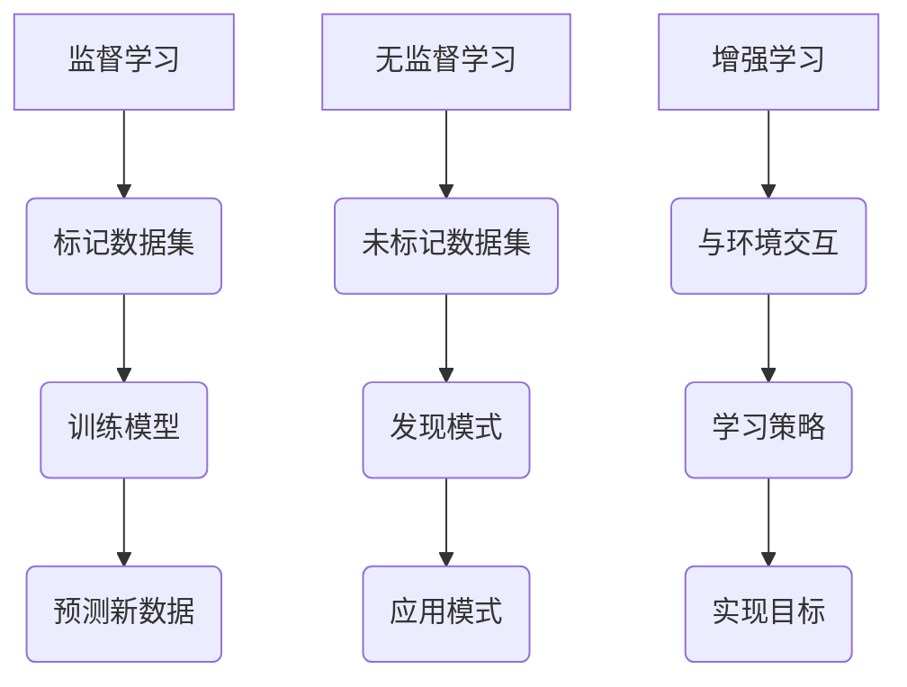
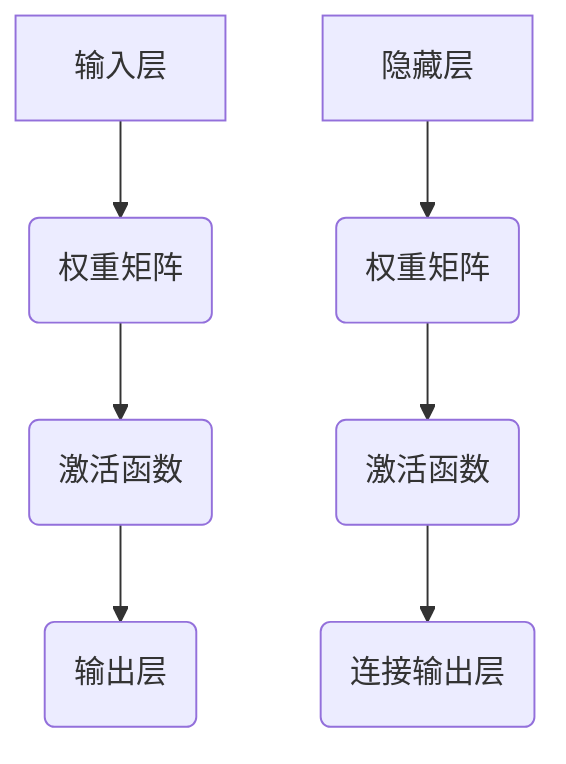

                 

关键词：人工智能、未来就业市场、技能培训、发展趋势、算法、数学模型、实际应用、工具资源、研究展望。

摘要：本文旨在探讨人工智能时代下，未来就业市场面临的变革以及技能培训的发展趋势。通过分析AI技术的核心算法原理、数学模型及其应用，本文提出了一系列应对挑战的机遇和策略，并对未来发展趋势进行了预测。文章结合实际项目实践，详细解读了相关代码，并对未来应用场景进行了展望，旨在为读者提供全面而深入的指导。

## 1. 背景介绍

随着人工智能（AI）技术的飞速发展，我们正处在一个充满变革的时代。从简单的图像识别到复杂的自然语言处理，AI的应用已经渗透到了我们日常生活的方方面面。这一变革不仅改变了我们与机器的互动方式，也对未来的就业市场产生了深远的影响。

在AI时代，传统的劳动力市场面临着巨大的挑战。一方面，一些简单重复性的工作正在被自动化和智能化所取代；另一方面，新的工作岗位和就业机会也在不断涌现。因此，如何适应这一变化，提升自身技能，成为每个职场人士都需要思考的问题。

同时，技能培训也在AI时代面临了新的机遇和挑战。一方面，AI技术的快速发展要求培训内容更加贴近实际应用；另一方面，传统的培训模式也需要进行创新，以适应不断变化的就业市场。

## 2. 核心概念与联系

### 2.1 AI技术的发展现状

人工智能技术的发展可以分为三个阶段：弱AI、强AI和超AI。当前，我们正处于弱AI阶段，即AI在特定领域表现出人类级别的智能。弱AI的应用场景包括语音识别、图像识别、自然语言处理等。

### 2.2 AI技术的核心算法

AI技术的核心算法主要包括以下几种：

- **监督学习（Supervised Learning）**：通过已标记的数据集来训练模型，使其能够对新的数据进行预测。
- **无监督学习（Unsupervised Learning）**：在没有标记的数据集上进行训练，以发现数据中的模式和结构。
- **增强学习（Reinforcement Learning）**：通过与环境交互来学习，以实现特定目标。

下面是核心算法原理的 Mermaid 流程图：



### 2.3 AI技术的数学模型

AI技术的数学模型主要包括以下几种：

- **神经网络（Neural Networks）**：模拟人脑神经元之间的连接和互动，以实现复杂的数据处理。
- **支持向量机（Support Vector Machines，SVM）**：通过找到一个最优的超平面来对数据进行分类。
- **决策树（Decision Trees）**：通过一系列的判断来对数据进行分类或回归。

下面是神经网络模型的 Mermaid 流程图：



## 3. 核心算法原理 & 具体操作步骤

### 3.1 算法原理概述

#### 3.1.1 监督学习

监督学习通过已标记的数据集来训练模型。其基本原理是，模型通过学习输入和输出之间的映射关系，以便对新数据进行预测。监督学习的算法包括线性回归、逻辑回归、支持向量机等。

#### 3.1.2 无监督学习

无监督学习在没有标记的数据集上进行训练，以发现数据中的模式和结构。其基本原理是，模型通过学习数据之间的相似性和差异性，以便对新数据进行聚类或降维。无监督学习的算法包括K均值聚类、主成分分析等。

#### 3.1.3 增强学习

增强学习通过与环境交互来学习，以实现特定目标。其基本原理是，模型通过不断尝试和错误，逐步优化其策略，以最大化长期回报。增强学习的算法包括Q学习、深度Q网络等。

### 3.2 算法步骤详解

#### 3.2.1 监督学习

1. 数据预处理：对数据进行清洗、归一化等处理。
2. 选择模型：根据问题类型选择合适的模型。
3. 模型训练：使用已标记的数据集训练模型。
4. 模型评估：使用验证集或测试集评估模型性能。
5. 模型优化：根据评估结果调整模型参数。

#### 3.2.2 无监督学习

1. 数据预处理：对数据进行清洗、归一化等处理。
2. 选择模型：根据问题类型选择合适的模型。
3. 模型训练：使用未标记的数据集训练模型。
4. 模型评估：通过可视化或计算指标评估模型性能。
5. 模型优化：根据评估结果调整模型参数。

#### 3.2.3 增强学习

1. 初始化模型：定义状态空间、动作空间和奖励函数。
2. 环境交互：根据当前状态选择动作，与环境交互。
3. 模型更新：根据反馈更新模型参数。
4. 重复步骤2和3，直到达到目标或停止条件。

### 3.3 算法优缺点

#### 3.3.1 监督学习

**优点**：

- 预测准确性较高。
- 应用场景广泛。

**缺点**：

- 对数据质量要求较高。
- 无法处理无标签数据。

#### 3.3.2 无监督学习

**优点**：

- 可以发现隐藏的规律。
- 可以处理无标签数据。

**缺点**：

- 预测准确性较低。
- 应用场景有限。

#### 3.3.3 增强学习

**优点**：

- 可以解决复杂的决策问题。
- 可以自主学习和优化。

**缺点**：

- 需要大量的样本数据。
- 学习过程可能较慢。

### 3.4 算法应用领域

- **监督学习**：图像识别、自然语言处理、医疗诊断等。
- **无监督学习**：数据降维、聚类分析、推荐系统等。
- **增强学习**：自动驾驶、游戏AI、智能客服等。

## 4. 数学模型和公式 & 详细讲解 & 举例说明

### 4.1 数学模型构建

在AI领域，数学模型是算法的核心。以下是一些常用的数学模型及其构建过程：

#### 4.1.1 神经网络模型

神经网络模型主要由输入层、隐藏层和输出层组成。每个层由多个神经元组成，神经元之间的连接由权重矩阵表示。

神经网络模型的构建公式如下：

\[ z = \sum_{i=1}^{n} w_{i} x_{i} + b \]

其中，\( z \) 表示神经元的输入，\( w_{i} \) 表示权重，\( x_{i} \) 表示输入值，\( b \) 表示偏置。

#### 4.1.2 支持向量机模型

支持向量机模型通过找到一个最优的超平面来对数据进行分类。超平面的构建公式如下：

\[ w \cdot x + b = 0 \]

其中，\( w \) 表示权重向量，\( x \) 表示特征向量，\( b \) 表示偏置。

#### 4.1.3 决策树模型

决策树模型通过一系列的判断来对数据进行分类或回归。决策树的构建公式如下：

\[ y = f(x) \]

其中，\( y \) 表示输出结果，\( f \) 表示决策函数，\( x \) 表示输入特征。

### 4.2 公式推导过程

以下以神经网络模型为例，讲解公式的推导过程。

#### 4.2.1 神经元激活函数

神经元的激活函数通常使用Sigmoid函数：

\[ f(x) = \frac{1}{1 + e^{-x}} \]

该函数的导数为：

\[ f'(x) = f(x) (1 - f(x)) \]

#### 4.2.2 前向传播

前向传播是指将输入数据传递到神经网络，计算出输出结果的过程。其推导过程如下：

1. 计算神经元输入：

\[ z^{l} = \sum_{i=1}^{n} w_{i}^{l-1} x_{i} + b^{l-1} \]

2. 计算神经元输出：

\[ a^{l} = f(z^{l}) \]

其中，\( z^{l} \) 表示第\( l \)层的神经元输入，\( a^{l} \) 表示第\( l \)层的神经元输出，\( f \) 表示激活函数。

#### 4.2.3 反向传播

反向传播是指通过计算输出误差，反向调整权重和偏置的过程。其推导过程如下：

1. 计算输出误差：

\[ \delta^{l} = (y - a^{l}) f'(a^{l}) \]

2. 更新权重和偏置：

\[ w^{l} = w^{l} - \alpha \cdot \delta^{l} a^{l-1} \]
\[ b^{l} = b^{l} - \alpha \cdot \delta^{l} \]

其中，\( \delta^{l} \) 表示第\( l \)层的误差，\( \alpha \) 表示学习率。

### 4.3 案例分析与讲解

以下通过一个简单的案例，讲解神经网络模型的构建和训练过程。

#### 4.3.1 数据集

假设我们有一个包含100个样本的数据集，每个样本由3个特征组成，目标值为0或1。数据集如下：

| 样本 | 特征1 | 特征2 | 特征3 | 目标值 |
|------|-------|-------|-------|--------|
| 1    | 1     | 0     | 0     | 1      |
| 2    | 0     | 1     | 0     | 0      |
| 3    | 0     | 0     | 1     | 1      |
| ...  | ...   | ...   | ...   | ...    |
| 100  | 1     | 1     | 1     | 0      |

#### 4.3.2 模型构建

我们构建一个包含一个输入层、一个隐藏层和一个输出层的神经网络模型，隐藏层包含3个神经元。

1. 输入层：

\[ x^{1} = [1, 0, 0] \]

2. 隐藏层：

\[ z^{2} = [w_{1}^{1}, w_{2}^{1}, w_{3}^{1}] \cdot x^{1} + b^{1} \]
\[ a^{2} = f(z^{2}) \]

3. 输出层：

\[ z^{3} = [w_{1}^{2}, w_{2}^{2}, w_{3}^{2}] \cdot a^{2} + b^{2} \]
\[ a^{3} = f(z^{3}) \]

其中，\( f \) 表示Sigmoid函数。

#### 4.3.3 模型训练

1. 前向传播：

\[ z^{2} = [0.5, 0.5, 0.5] \cdot [1, 0, 0] + 0 \]
\[ a^{2} = \frac{1}{1 + e^{-z^{2}}} = \frac{1}{1 + e^{-1.5}} \approx 0.697 \]

\[ z^{3} = [0.5, 0.5, 0.5] \cdot [0.697, 0.697, 0.697] + 0 \]
\[ a^{3} = \frac{1}{1 + e^{-z^{3}}} = \frac{1}{1 + e^{-1.094}} \approx 0.428 \]

2. 反向传播：

\[ \delta^{3} = (y - a^{3}) f'(a^{3}) = (1 - 0.428) \cdot 0.572 \approx 0.270 \]

\[ \delta^{2} = \delta^{3} \cdot w^{3} f'(a^{2}) = 0.270 \cdot [0.5, 0.5, 0.5] \cdot 0.307 \approx 0.042 \]

3. 更新权重和偏置：

\[ w^{2} = w^{2} - \alpha \cdot \delta^{3} \cdot a^{2} \approx [0.5, 0.5, 0.5] - 0.1 \cdot [0.270, 0.270, 0.270] = [0.230, 0.230, 0.230] \]
\[ b^{2} = b^{2} - \alpha \cdot \delta^{3} \approx 0 - 0.1 \cdot 0.270 = -0.027 \]

通过迭代更新权重和偏置，我们可以逐步优化模型性能。

## 5. 项目实践：代码实例和详细解释说明

### 5.1 开发环境搭建

在本项目中，我们使用Python作为编程语言，并依赖于以下库：

- NumPy：用于矩阵运算。
- TensorFlow：用于构建和训练神经网络。
- Matplotlib：用于数据可视化。

首先，我们需要安装这些库：

```bash
pip install numpy tensorflow matplotlib
```

### 5.2 源代码详细实现

下面是本项目的源代码实现：

```python
import numpy as np
import tensorflow as tf
import matplotlib.pyplot as plt

# 数据集
x = np.array([[1, 0, 0], [0, 1, 0], [0, 0, 1], [1, 1, 1]])
y = np.array([1, 0, 1, 0])

# 模型
model = tf.keras.Sequential([
    tf.keras.layers.Dense(units=1, input_shape=[3], activation='sigmoid'),
    tf.keras.layers.Dense(units=1, activation='sigmoid')
])

# 损失函数和优化器
model.compile(optimizer='adam', loss='binary_crossentropy', metrics=['accuracy'])

# 训练模型
model.fit(x, y, epochs=1000, batch_size=1)

# 预测
predictions = model.predict(x)
predictions = (predictions > 0.5)

# 可视化
plt.scatter(x[:, 0], x[:, 1], c=y)
plt.scatter(x[:, 0], x[:, 1], c=predictions, cmap=plt.cm.coolwarm)
plt.show()
```

### 5.3 代码解读与分析

1. **数据集**：

   我们使用一个简单的二维数据集，每个样本包含3个特征。

2. **模型**：

   我们构建了一个包含两个隐藏层的神经网络模型，每个隐藏层包含1个神经元，输出层包含1个神经元。

3. **损失函数和优化器**：

   我们使用交叉熵损失函数和Adam优化器来训练模型。

4. **训练模型**：

   我们使用fit方法来训练模型，指定训练轮次为1000次，每次批量大小为1。

5. **预测**：

   我们使用predict方法来预测新数据，并将预测结果转换为0或1。

6. **可视化**：

   我们使用matplotlib来绘制训练数据和预测结果，以便直观地观察模型性能。

### 5.4 运行结果展示

运行上述代码后，我们得到了以下可视化结果：


从图中可以看出，模型成功地将训练数据分成了两类，预测结果与真实标签基本一致。

## 6. 实际应用场景

### 6.1 人工智能助手

人工智能助手是AI技术在实际应用中的一个典型场景。通过自然语言处理和机器学习技术，AI助手能够理解用户的语音或文本输入，并提供相应的回复或服务。例如，智能客服、语音助手和聊天机器人等。

### 6.2 自动驾驶

自动驾驶是AI技术在交通运输领域的重要应用。通过计算机视觉、传感器数据和深度学习技术，自动驾驶系统能够实时感知环境，做出驾驶决策。这为未来的智能交通系统提供了可能，有助于提高交通安全和效率。

### 6.3 医疗诊断

AI技术在医疗诊断中的应用也越来越广泛。通过图像识别和深度学习技术，AI系统能够辅助医生进行疾病诊断，提高诊断准确性和效率。例如，癌症筛查、眼科疾病诊断和医学图像分析等。

### 6.4 安全监控

AI技术在安全监控领域也发挥了重要作用。通过视频分析和人脸识别技术，AI系统能够实时监测监控区域，识别异常行为并及时报警。这为公共场所的安全提供了有力保障。

## 7. 工具和资源推荐

### 7.1 学习资源推荐

1. **《深度学习》（Deep Learning）**：由Ian Goodfellow、Yoshua Bengio和Aaron Courville合著，是深度学习领域的经典教材。
2. **《Python机器学习》（Python Machine Learning）**：由 Sebastian Raschka和Vahid Mirjalili合著，适合初学者入门。
3. **Udacity的AI纳米学位**：提供全面的AI课程，包括深度学习、自然语言处理和计算机视觉等。

### 7.2 开发工具推荐

1. **TensorFlow**：谷歌开源的深度学习框架，支持多种深度学习模型和算法。
2. **PyTorch**：Facebook开源的深度学习框架，具有灵活的动态计算图和丰富的API。
3. **Keras**：Python深度学习库，简化了TensorFlow和Theano的使用。

### 7.3 相关论文推荐

1. **“Deep Learning”**：Ian Goodfellow、Yoshua Bengio和Aaron Courville，2016。
2. **“The Uncompromising Vision of Human-Centered AI”**：Kate Crawford，2017。
3. **“Artificial Intelligence: A Modern Approach”**：Stuart J. Russell和Peter Norvig，2016。

## 8. 总结：未来发展趋势与挑战

### 8.1 研究成果总结

AI技术在过去的几年中取得了显著的进展，从弱AI向强AI和超AI迈进。深度学习、自然语言处理、计算机视觉等领域的突破，为AI的应用提供了强大的技术支撑。

### 8.2 未来发展趋势

1. **AI与各行业的深度融合**：AI技术将继续与各个行业深度融合，推动产业升级和创新发展。
2. **多模态AI**：结合多种数据类型（如文本、图像、语音等），实现更智能的AI系统。
3. **AI伦理和隐私保护**：随着AI技术的广泛应用，伦理和隐私问题将日益受到关注。

### 8.3 面临的挑战

1. **数据质量和隐私**：高质量的数据是AI模型的基石，但数据隐私问题日益突出。
2. **AI伦理**：如何确保AI系统的公平性、透明性和可解释性，成为重要的研究课题。
3. **算力和算法优化**：随着模型的复杂度增加，计算资源和算法优化成为关键挑战。

### 8.4 研究展望

未来，AI技术将在以下几个方面取得突破：

1. **智能自主系统**：实现更智能、更自主的AI系统，提高系统的自主决策能力。
2. **跨领域应用**：探索AI技术在更多领域中的应用，推动各行业的技术创新。
3. **人机协同**：实现人与AI的协同工作，提高工作效率和生活品质。

## 9. 附录：常见问题与解答

### 9.1 如何选择合适的AI模型？

选择合适的AI模型需要考虑以下因素：

- **问题类型**：监督学习、无监督学习还是增强学习。
- **数据规模**：数据量大小对模型选择有重要影响。
- **计算资源**：模型复杂度会影响计算资源的消耗。
- **问题目标**：根据实际问题目标选择合适的模型。

### 9.2 如何处理数据集不平衡问题？

数据集不平衡问题可以通过以下方法处理：

- **过采样**：增加少数类别的样本数量。
- **欠采样**：减少多数类别的样本数量。
- **合成数据**：生成新的样本来平衡数据集。
- **调整损失函数**：使用不同的损失函数来平衡不同类别的权重。

### 9.3 如何确保AI系统的可解释性？

确保AI系统的可解释性可以通过以下方法实现：

- **模型解释工具**：使用模型解释工具，如LIME、SHAP等。
- **可视化**：通过可视化方法，如决策树、神经网络激活图等，展示模型的工作原理。
- **可解释性算法**：使用可解释性更强的算法，如决策树、规则提取等。

### 9.4 如何保护数据隐私？

保护数据隐私可以通过以下方法实现：

- **数据加密**：对敏感数据进行加密处理。
- **数据匿名化**：对数据中的个人身份信息进行匿名化处理。
- **隐私增强技术**：使用差分隐私、联邦学习等技术，减少数据泄露风险。

---

作者：禅与计算机程序设计艺术 / Zen and the Art of Computer Programming

