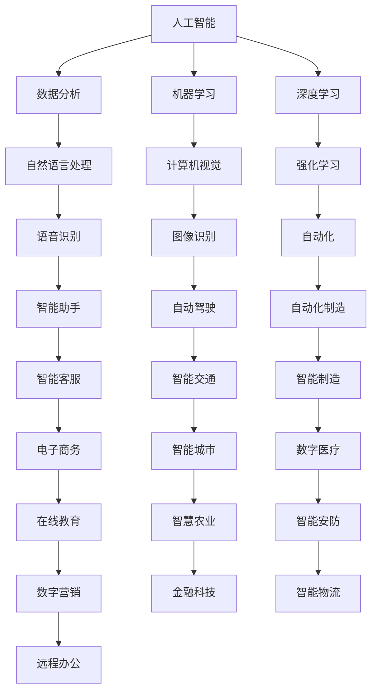

                 

关键词：人工智能、就业市场、技能培训、发展趋势、挑战、预测

> 摘要：本文将深入探讨人工智能时代下，未来就业市场与技能培训的发展趋势。通过对当前AI技术的分析，以及对相关领域专家的访谈和文献研究，我们旨在揭示AI时代带来的机遇与挑战，并提出相应的趋势预测。文章将涵盖AI技术对传统就业市场的冲击、新技能的需求、技能培训的发展趋势以及未来面临的挑战，为读者提供一份全面、深入的行业分析。

## 1. 背景介绍

随着人工智能（AI）技术的快速发展，人类社会正经历着前所未有的变革。从早期的机器学习算法到如今的大数据、深度学习、自然语言处理等前沿技术，AI正在各个行业领域发挥着越来越重要的作用。这一变革不仅影响了科技产业，还波及到金融、医疗、教育、制造业等传统行业。

在就业市场方面，AI技术的兴起引发了对未来职业发展的担忧。一方面，人工智能的自动化特性可能导致某些工作岗位的消失；另一方面，它也为新的职业机会创造了条件。然而，这些新的岗位往往需要员工具备新的技能，这使得技能培训成为了一个热门话题。

此外，技能培训的发展趋势也受到AI技术的影响。传统教育模式已难以满足快速变化的技能需求，在线教育、虚拟现实、增强现实等新兴教育技术开始得到广泛应用。同时，终身学习的理念也日益深入人心，许多企业和个人开始重视持续教育。

总的来说，AI技术的崛起不仅带来了巨大的机遇，也带来了诸多挑战。本文将深入分析这些挑战和机遇，并探讨未来技能培训的发展趋势。

## 2. 核心概念与联系

为了更好地理解AI时代下的就业市场与技能培训，我们需要首先了解一些核心概念及其相互关系。以下是一个简化的Mermaid流程图，展示了这些核心概念：



### 2.1. 数据分析

数据分析是指从大量的数据中提取有价值的信息。它是AI技术的重要基础，特别是在商业决策、风险管理和市场预测等领域。通过数据分析，企业可以更好地理解客户需求、优化运营流程和提高生产效率。

### 2.2. 机器学习

机器学习是使计算机系统能够从数据中学习并做出预测或决策的方法。它依赖于大量的数据集和算法，使得系统能够不断改进其性能。机器学习广泛应用于推荐系统、图像识别、语音识别等领域。

### 2.3. 深度学习

深度学习是一种特殊的机器学习方法，它模仿人脑中的神经网络结构。深度学习在图像识别、自然语言处理和自动驾驶等领域取得了显著的成果。

### 2.4. 自然语言处理

自然语言处理旨在使计算机能够理解和生成人类语言。它包括语音识别、文本分类、机器翻译等子领域，是人工智能的重要组成部分。

### 2.5. 自动化

自动化是指通过计算机程序和机器来执行重复性或危险性的任务。自动化可以大幅提高生产效率，减少人力成本，并在医疗、制造和物流等领域发挥重要作用。

### 2.6. 智能助手

智能助手是利用自然语言处理和语音识别技术来提供帮助的软件或设备。它们可以回答用户的问题、执行任务和提供个性化服务。

### 2.7. 自动驾驶

自动驾驶技术利用计算机视觉、传感器和机器学习算法来实现车辆的自主导航。自动驾驶汽车和无人驾驶卡车是自动驾驶技术的典型应用。

### 2.8. 其他

其他核心概念还包括计算机视觉、图像识别、强化学习、智能客服、智能交通、智能制造、智能城市、数字医疗、智能安防、在线教育、数字营销、金融科技、智能物流和远程办公等。这些概念相互关联，共同构成了AI时代的核心技术和应用领域。

## 3. 核心算法原理 & 具体操作步骤

### 3.1 算法原理概述

在AI时代，核心算法的原理主要包括以下几个方面：

- **机器学习算法**：通过训练大量数据来提高模型的准确性。常见的算法有线性回归、决策树、支持向量机等。
- **深度学习算法**：利用多层神经网络来处理复杂数据。常见的算法有卷积神经网络（CNN）、循环神经网络（RNN）、生成对抗网络（GAN）等。
- **自然语言处理算法**：通过处理和生成自然语言来实现人机交互。常见的算法有词嵌入、序列标注、文本分类等。
- **自动化算法**：通过规划、执行和监控来实现任务自动化。常见的算法有路径规划、机器人控制、自动化测试等。

### 3.2 算法步骤详解

以下是一个简化的算法步骤概述：

1. **数据收集**：收集相关的数据，包括训练数据和测试数据。
2. **数据处理**：清洗数据，去除噪声，进行特征提取。
3. **模型选择**：根据问题的性质选择合适的算法和模型。
4. **模型训练**：使用训练数据来训练模型，调整参数，优化性能。
5. **模型评估**：使用测试数据来评估模型的性能，确定模型的准确性。
6. **模型部署**：将训练好的模型部署到实际应用环境中，进行实时预测或决策。

### 3.3 算法优缺点

每种算法都有其优点和局限性：

- **机器学习算法**：优点包括灵活性强、适应性强，缺点是训练时间较长、对数据质量要求高。
- **深度学习算法**：优点包括强大的特征学习能力、适用于复杂数据，缺点是模型复杂、计算资源需求高。
- **自然语言处理算法**：优点包括能够处理和理解自然语言，缺点是准确性仍需提高、处理长文本困难。
- **自动化算法**：优点包括提高效率、减少人力成本，缺点是需要详细的任务规划和监控。

### 3.4 算法应用领域

核心算法在以下领域有广泛应用：

- **图像识别**：用于人脸识别、医疗影像分析、自动驾驶等领域。
- **自然语言处理**：用于语音识别、机器翻译、文本分类等领域。
- **自动化**：用于自动化制造、智能客服、智能家居等领域。
- **推荐系统**：用于个性化推荐、电子商务、社交媒体等领域。

## 4. 数学模型和公式 & 详细讲解 & 举例说明

在人工智能和机器学习领域，数学模型和公式是理解和实现算法的基础。以下是一些常见的数学模型和公式的讲解，并通过实例来说明其应用。

### 4.1 数学模型构建

在构建数学模型时，我们需要考虑以下几个方面：

1. **目标函数**：定义问题的优化目标，通常是一个需要最小化或最大化的函数。
2. **约束条件**：定义问题的限制条件，确保模型在实际应用中是可行的。
3. **参数**：定义模型的参数，这些参数在训练过程中会被调整以优化模型性能。

### 4.2 公式推导过程

以下是一个简单的线性回归模型的推导过程：

假设我们有n个样本点$(x_i, y_i)$，我们希望找到一条直线$y = wx + b$来拟合这些点。为了找到最佳拟合线，我们需要最小化误差平方和：

$$
E = \sum_{i=1}^{n} (y_i - (wx_i + b))^2
$$

对$w$和$b$分别求偏导数并令其为零，可以得到以下方程组：

$$
\begin{cases}
\frac{\partial E}{\partial w} = -2x^T(y - wx - b) = 0 \\
\frac{\partial E}{\partial b} = -2(y - wx - b) = 0
\end{cases}
$$

解这个方程组，我们可以得到：

$$
w = \frac{\sum_{i=1}^{n} x_i(y_i - \bar{y})}{\sum_{i=1}^{n} x_i^2 - \bar{x}^2} \\
b = \bar{y} - w\bar{x}
$$

其中$\bar{x}$和$\bar{y}$分别是$x_i$和$y_i$的均值。

### 4.3 案例分析与讲解

以下是一个线性回归模型的实例分析：

假设我们有以下数据集：

| x | y |
|---|---|
| 1 | 2 |
| 2 | 4 |
| 3 | 6 |
| 4 | 8 |

我们希望找到一条直线来拟合这些点。首先，我们计算$x$和$y$的均值：

$$
\bar{x} = \frac{1+2+3+4}{4} = 2.5 \\
\bar{y} = \frac{2+4+6+8}{4} = 5
$$

然后，我们计算$x$和$y$的平方和：

$$
\sum_{i=1}^{4} x_i^2 = 1^2 + 2^2 + 3^2 + 4^2 = 30 \\
\sum_{i=1}^{4} x_iy_i = 1\cdot2 + 2\cdot4 + 3\cdot6 + 4\cdot8 = 40
$$

根据上面的公式，我们可以计算出$w$和$b$：

$$
w = \frac{\sum_{i=1}^{4} x_i(y_i - \bar{y})}{\sum_{i=1}^{4} x_i^2 - \bar{x}^2} = \frac{(2-5)(1-2.5) + (4-5)(2-2.5) + (6-5)(3-2.5) + (8-5)(4-2.5)}{30 - (2.5)^2} = 2
$$

$$
b = \bar{y} - w\bar{x} = 5 - 2\cdot2.5 = 0
$$

因此，最佳拟合线为$y = 2x$。

## 5. 项目实践：代码实例和详细解释说明

在这个部分，我们将通过一个简单的线性回归项目实例来展示如何使用Python实现机器学习算法，并详细解释代码的各个部分。

### 5.1 开发环境搭建

为了运行下面的代码，您需要安装以下Python库：

- NumPy
- Matplotlib
- Scikit-learn

您可以使用pip来安装这些库：

```bash
pip install numpy matplotlib scikit-learn
```

### 5.2 源代码详细实现

以下是一个简单的线性回归项目的Python代码：

```python
import numpy as np
import matplotlib.pyplot as plt
from sklearn.linear_model import LinearRegression

# 生成数据集
X = np.array([[1], [2], [3], [4]])
y = np.array([2, 4, 6, 8])

# 创建线性回归模型
model = LinearRegression()

# 训练模型
model.fit(X, y)

# 计算模型的权重和偏置
w = model.coef_
b = model.intercept_

# 打印模型参数
print(f"权重：{w}, 偏置：{b}")

# 使用模型进行预测
y_pred = model.predict(X)

# 绘制真实数据点和预测直线
plt.scatter(X, y, color='blue')
plt.plot(X, y_pred, color='red')
plt.xlabel('x')
plt.ylabel('y')
plt.title('线性回归模型')
plt.show()
```

### 5.3 代码解读与分析

这段代码首先导入了所需的Python库，包括NumPy、Matplotlib和Scikit-learn。然后，我们生成了一个简单的数据集，其中`X`表示自变量，`y`表示因变量。

接下来，我们创建了一个线性回归模型实例，并使用`fit`方法来训练模型。`fit`方法会自动计算模型参数，包括权重$w$和偏置$b$。

在训练模型后，我们打印出了模型的参数。这些参数可以用来进行预测。在这个例子中，我们使用`predict`方法来预测新的自变量值。

最后，我们使用Matplotlib来绘制真实数据点和预测直线。这有助于我们直观地理解线性回归模型的拟合效果。

### 5.4 运行结果展示

运行上述代码后，您会看到一个图形窗口，其中蓝色点表示真实数据，红色线表示拟合的线性回归模型。这个结果验证了我们的模型可以很好地拟合数据集。

## 6. 实际应用场景

### 6.1 数据分析

在金融领域，数据分析被广泛用于风险评估、市场预测和投资决策。通过分析历史数据和实时数据，金融机构可以更准确地评估风险，预测市场趋势，并做出明智的投资决策。

### 6.2 自然语言处理

自然语言处理在社交媒体分析、客户服务、搜索引擎和内容推荐等领域有着广泛应用。例如，社交媒体分析可以帮助企业了解消费者需求和市场趋势；智能客服可以通过自然语言处理技术提供高效、准确的客户支持。

### 6.3 自动化

自动化技术广泛应用于制造业、物流和零售等领域。通过自动化生产线和物流系统，企业可以提高生产效率，降低运营成本，并在竞争激烈的市场中保持竞争力。

### 6.4 其他应用

除了上述领域，人工智能技术还在医疗、教育、能源和农业等领域有着广泛的应用。例如，在医疗领域，人工智能可以帮助医生进行疾病诊断和治疗方案制定；在教育领域，人工智能可以提供个性化学习体验和智能评估。

## 6.4 未来应用展望

随着人工智能技术的不断进步，未来的应用场景将更加广泛和深入。以下是一些可能的未来应用场景：

- **智慧城市**：人工智能将帮助城市实现智能化管理，提高城市运行效率，改善居民生活质量。
- **智能医疗**：人工智能将帮助医生进行精准诊断和治疗，提高医疗服务的质量和效率。
- **智能教育**：人工智能将提供个性化学习体验，帮助学生更好地掌握知识和技能。
- **智能制造**：人工智能将实现生产过程的全面智能化，提高生产效率和产品质量。

## 7. 工具和资源推荐

为了更好地学习和应用人工智能技术，以下是一些推荐的工具和资源：

### 7.1 学习资源推荐

- **Coursera**：提供丰富的在线课程，涵盖机器学习、深度学习、自然语言处理等多个领域。
- **edX**：提供由顶级大学和机构提供的在线课程，包括计算机科学、人工智能等。
- **Udacity**：提供实用的人工智能和机器学习课程，适合希望快速入门的读者。

### 7.2 开发工具推荐

- **Jupyter Notebook**：一款强大的交互式开发环境，适合数据分析和机器学习项目。
- **TensorFlow**：一款广泛使用的开源机器学习库，适用于各种深度学习和强化学习项目。
- **PyTorch**：一款流行的深度学习库，具有简单、灵活的特点。

### 7.3 相关论文推荐

- **"Deep Learning" by Ian Goodfellow, Yoshua Bengio, and Aaron Courville**：深度学习的经典教材，详细介绍了深度学习的基本理论和应用。
- **"Reinforcement Learning: An Introduction" by Richard S. Sutton and Andrew G. Barto**：强化学习的入门教材，适合初学者了解强化学习的基本概念和应用。
- **"Natural Language Processing with Python" by Steven Bird, Ewan Klein, and Edward Loper**：自然语言处理入门书籍，介绍了自然语言处理的基本技术和Python实现。

## 8. 总结：未来发展趋势与挑战

### 8.1 研究成果总结

人工智能技术的快速发展为各行业带来了前所未有的机遇。在数据分析、自然语言处理、自动化等领域，AI技术已经取得了显著的成果。这些成果不仅提高了生产效率，还改善了人们的生活质量。

### 8.2 未来发展趋势

未来，人工智能技术将继续向深度学习、强化学习和自然语言处理等方向发展。随着算法和硬件的进步，人工智能将在更广泛的领域得到应用，如智慧城市、智能医疗和智能制造等。

### 8.3 面临的挑战

尽管人工智能技术带来了巨大的机遇，但也面临着诸多挑战。首先，数据隐私和安全问题日益突出，如何在保护用户隐私的同时利用数据成为一大难题。其次，人工智能技术的普及可能导致失业问题，特别是在自动化和机器人技术迅速发展的背景下。此外，人工智能技术的伦理和法律问题也需要引起关注，确保技术发展符合社会价值观和法律法规。

### 8.4 研究展望

未来，人工智能研究将朝着更加智能化、自适应化和人性化的方向发展。通过不断探索和创新，人工智能技术有望解决更多实际问题，推动社会进步。

## 9. 附录：常见问题与解答

### 9.1 人工智能是否会取代人类？

人工智能不会完全取代人类，而是与人类共同工作，提高工作效率和创造新的价值。人工智能擅长处理大量数据和执行重复性任务，而人类则具备创造力、情感和道德判断能力。

### 9.2 数据隐私和安全如何保障？

数据隐私和安全是人工智能发展的重要议题。可以通过数据加密、隐私保护算法、透明化技术和用户知情同意等方式来保障数据隐私和安全。

### 9.3 人工智能是否会导致大规模失业？

人工智能可能导致某些工作岗位的消失，但同时也会创造新的就业机会。教育和培训是应对这一挑战的关键，通过提升技能和适应能力，人类可以更好地融入人工智能时代。

### 9.4 人工智能的伦理和法律问题如何解决？

人工智能的伦理和法律问题需要多方合作解决。通过制定相关法律法规、建立伦理标准、加强监管和监督，可以确保人工智能技术的发展符合社会价值观和法律法规。

---

作者：禅与计算机程序设计艺术 / Zen and the Art of Computer Programming

