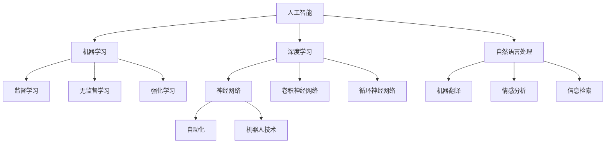

                 

关键词：人工智能，就业市场，技能培训，技术趋势，未来职业发展

> 摘要：随着人工智能（AI）技术的迅猛发展，人类计算正经历着前所未有的变革。本文将深入探讨AI时代下未来就业市场的趋势，分析技能培训的需求，以及提出相应的应对策略。本文旨在帮助读者了解AI技术如何重塑我们的工作环境，并为个人和企业在这一变革中做好准备。

## 1. 背景介绍

人工智能作为计算机科学的一个重要分支，近年来取得了飞速的发展。从早期的规则推理和专家系统，到如今基于深度学习的复杂模型，AI已经在众多领域展现出了其巨大的潜力。从医疗诊断到自动驾驶，从金融服务到智能家居，AI正在改变我们的生活方式。

然而，AI的发展不仅带来了技术上的进步，也对就业市场产生了深远的影响。一方面，AI技术能够提高生产效率，降低成本，创造新的就业机会；另一方面，它也威胁着某些传统职业的存续。例如，自动化和机器人技术的广泛应用可能取代某些低技能或重复性工作，从而引发就业市场的动荡。

在这样的背景下，如何应对AI时代带来的挑战，提升个人的技能和适应性，成为了一个亟待解决的问题。同时，企业也需要重新评估其人力资源策略，以确保在AI时代能够保持竞争力。

## 2. 核心概念与联系

在探讨AI对就业市场的影响之前，我们首先需要理解几个核心概念：

### 2.1 人工智能（AI）

人工智能是指计算机系统通过学习、推理和自我改进等方式，模拟或扩展人类智能的能力。它包括多个子领域，如机器学习、深度学习、自然语言处理、计算机视觉等。

### 2.2 机器学习（ML）

机器学习是AI的一个子领域，主要关注如何从数据中学习规律，并使用这些规律进行预测或决策。机器学习可以分为监督学习、无监督学习和强化学习等不同类型。

### 2.3 深度学习（DL）

深度学习是一种特殊的机器学习方法，它通过多层神经网络来模拟人脑的决策过程。深度学习在图像识别、语音识别和自然语言处理等领域取得了显著成果。

### 2.4 自然语言处理（NLP）

自然语言处理是AI的一个子领域，主要关注如何使计算机理解和处理自然语言。NLP在机器翻译、情感分析、信息检索等领域有着广泛的应用。

### 2.5 自动化与机器人技术

自动化和机器人技术是AI在工业和生产领域的具体应用，通过自动化系统或机器人来替代或辅助人类完成重复性或危险性的工作。

下面是一个使用Mermaid绘制的流程图，展示了这些核心概念之间的联系：



## 3. 核心算法原理 & 具体操作步骤

### 3.1 算法原理概述

在探讨AI技术对就业市场的影响时，了解一些核心算法的原理和操作步骤是非常重要的。以下是几个关键的AI算法：

### 3.1.1 决策树

决策树是一种常用的分类算法，它通过一系列规则来分割数据集，以最大化分类的准确性。决策树的基本原理是基于特征的重要性和信息增益来选择最优的分割方式。

### 3.1.2 支持向量机（SVM）

支持向量机是一种二分类模型，它的目标是找到最佳的超平面，将不同类别的数据点尽可能分开。SVM通过最大化分类间隔来实现这一目标。

### 3.1.3 集成学习

集成学习是将多个模型结合起来，以获得更好的性能。常见的方法包括随机森林、梯度提升树等。集成学习的基本思想是利用多个模型的优点来降低误差。

### 3.2 算法步骤详解

以下是这些算法的具体操作步骤：

### 3.2.1 决策树

1. 选择最优特征：通过计算每个特征的信息增益或基尼指数来选择最优特征。
2. 分割数据集：使用最优特征将数据集分割成子集。
3. 递归调用：对每个子集再次进行步骤1和步骤2，直到满足停止条件（如最大树深度、最小叶节点大小等）。

### 3.2.2 支持向量机（SVM）

1. 定义超平面：选择适当的核函数，计算最佳的超平面参数。
2. 训练分类器：使用训练数据集来优化超平面的参数。
3. 预测分类：对于新的数据点，计算其到超平面的距离，并根据距离判断其类别。

### 3.2.3 集成学习

1. 模型训练：对多个基础模型进行训练。
2. 集成投票：将所有基础模型的预测结果进行投票，选择最多的类别作为最终预测结果。

### 3.3 算法优缺点

每种算法都有其优缺点：

- **决策树**：简单易懂，易于实现。但是容易过拟合，并且对于高维数据性能不佳。
- **支持向量机（SVM）**：在处理高维数据时表现优秀，具有很好的理论支持。但是训练时间较长，对于大规模数据集可能不可行。
- **集成学习**：通过组合多个模型来提高性能，具有良好的泛化能力。但是需要大量的训练数据，且模型训练过程较为复杂。

### 3.4 算法应用领域

这些算法在多个领域有着广泛的应用：

- **决策树**：广泛应用于分类和回归问题，如数据挖掘、金融风险评估等。
- **支持向量机（SVM）**：在文本分类、图像识别、生物信息学等领域有着重要应用。
- **集成学习**：常用于各种机器学习竞赛和实际应用中，以提高预测准确性。

## 4. 数学模型和公式 & 详细讲解 & 举例说明

在AI领域，数学模型和公式扮演着至关重要的角色。以下是一些常见的数学模型和公式，并对其进行了详细的讲解和举例说明。

### 4.1 数学模型构建

#### 4.1.1 感知机模型

感知机模型是最早的机器学习算法之一，它基于线性可分情况下的最大间隔分类器，用于训练二分类模型。

$$
f(x) = \text{sign}(w \cdot x + b)
$$

其中，$w$ 是权重向量，$x$ 是特征向量，$b$ 是偏置项，$\text{sign}$ 表示符号函数。

#### 4.1.2 线性回归模型

线性回归模型用于预测连续值输出，其基本公式为：

$$
y = \beta_0 + \beta_1x
$$

其中，$y$ 是输出值，$x$ 是输入特征，$\beta_0$ 和 $\beta_1$ 分别是截距和斜率。

### 4.2 公式推导过程

#### 4.2.1 感知机模型推导

感知机模型的推导基于最小化误分类率的目标。具体推导过程如下：

1. 定义损失函数：

$$
L(w) = \sum_{i=1}^{n} \text{max}(0, -y_i(w \cdot x_i + b))
$$

2. 求导并令导数为零：

$$
\frac{dL(w)}{dw} = \sum_{i=1}^{n} \text{max}(0, -y_i(w \cdot x_i + b)) \cdot x_i = 0
$$

3. 解得：

$$
w \cdot x_i + b = 0
$$

#### 4.2.2 线性回归模型推导

线性回归模型的推导基于最小二乘法，具体过程如下：

1. 定义损失函数：

$$
L(\beta_0, \beta_1) = \sum_{i=1}^{n} (y_i - (\beta_0 + \beta_1x_i))^2
$$

2. 求导并令导数为零：

$$
\frac{dL(\beta_0, \beta_1)}{d\beta_0} = \sum_{i=1}^{n} (y_i - (\beta_0 + \beta_1x_i)) \cdot (-1) = 0
$$

$$
\frac{dL(\beta_0, \beta_1)}{d\beta_1} = \sum_{i=1}^{n} (y_i - (\beta_0 + \beta_1x_i)) \cdot x_i = 0
$$

3. 解得：

$$
\beta_0 = \frac{1}{n} \sum_{i=1}^{n} y_i
$$

$$
\beta_1 = \frac{1}{n} \sum_{i=1}^{n} (x_i - \bar{x})(y_i - \bar{y})
$$

### 4.3 案例分析与讲解

#### 4.3.1 感知机模型案例

假设我们有一个简单的二分类问题，数据集包含两个特征$x_1$和$x_2$，以及目标变量$y$：

$$
\begin{array}{ccc}
x_1 & x_2 & y \\
1 & 2 & 1 \\
2 & 1 & -1 \\
3 & 1 & 1 \\
4 & 2 & -1 \\
\end{array}
$$

我们使用感知机模型来训练分类器。根据上述推导，我们需要计算权重向量$w$和偏置项$b$。

1. 初始权重$w_0 = [0, 0]$，偏置项$b_0 = 0$。
2. 对于第一个数据点$(1, 2, 1)$，计算：

$$
w_1 = w_0 + y(1, 2) = [0, 0] + [1, 2] = [1, 2]
$$

$$
b_1 = b_0 + y(1 \cdot 2 + b_0) = 0 + 1(1 + 0) = 1
$$

3. 对于第二个数据点$(2, 1, -1)$，计算：

$$
w_2 = w_1 + y(2, 1) = [1, 2] - [2, 1] = [-1, 1]
$$

$$
b_2 = b_1 + y(2 \cdot 1 + b_1) = 1 - 1(2 + 1) = -2
$$

4. 重复上述步骤，直到满足停止条件（如所有数据点被正确分类）。

最终，我们得到权重向量$w^* = [-1, 1]$和偏置项$b^* = -2$，从而构建出感知机分类器。

#### 4.3.2 线性回归模型案例

假设我们有一个简单的一元线性回归问题，数据集包含输入特征$x$和输出值$y$：

$$
\begin{array}{cc}
x & y \\
1 & 3 \\
2 & 5 \\
3 & 7 \\
4 & 9 \\
\end{array}
$$

我们使用最小二乘法来训练线性回归模型。根据上述推导，我们需要计算截距$\beta_0$和斜率$\beta_1$。

1. 计算输入特征的均值和输出值的均值：

$$
\bar{x} = \frac{1}{n} \sum_{i=1}^{n} x_i = \frac{1+2+3+4}{4} = 2.5
$$

$$
\bar{y} = \frac{1}{n} \sum_{i=1}^{n} y_i = \frac{3+5+7+9}{4} = 6
$$

2. 计算斜率$\beta_1$：

$$
\beta_1 = \frac{1}{n} \sum_{i=1}^{n} (x_i - \bar{x})(y_i - \bar{y}) = \frac{1}{4} [(1-2.5)(3-6) + (2-2.5)(5-6) + (3-2.5)(7-6) + (4-2.5)(9-6)] = 2
$$

3. 计算截距$\beta_0$：

$$
\beta_0 = \bar{y} - \beta_1\bar{x} = 6 - 2 \cdot 2.5 = -1
$$

最终，我们得到线性回归模型：

$$
y = -1 + 2x
$$

该模型可以用于预测新的数据点的输出值。

## 5. 项目实践：代码实例和详细解释说明

在了解了理论知识和算法原理后，我们接下来通过一个实际的项目实践来展示如何使用这些算法来解决具体问题。以下是使用Python实现的决策树分类器项目的代码实例和详细解释说明。

### 5.1 开发环境搭建

为了运行下面的代码实例，您需要安装Python和相关的机器学习库。以下是安装步骤：

1. 安装Python：从官网（https://www.python.org/downloads/）下载并安装Python。
2. 安装Anaconda：Anaconda是一个集成了Python及其常用库的发行版，可以从官网（https://www.anaconda.com/products/distribution）下载并安装。
3. 安装机器学习库：使用以下命令安装所需的库：

```shell
conda install -c anaconda scikit-learn
```

### 5.2 源代码详细实现

以下是决策树分类器的源代码实现：

```python
import numpy as np
from sklearn.datasets import load_iris
from sklearn.tree import DecisionTreeClassifier
from sklearn.model_selection import train_test_split
from sklearn.metrics import accuracy_score

# 加载数据集
iris = load_iris()
X = iris.data
y = iris.target

# 划分训练集和测试集
X_train, X_test, y_train, y_test = train_test_split(X, y, test_size=0.3, random_state=42)

# 创建决策树分类器
clf = DecisionTreeClassifier()

# 训练分类器
clf.fit(X_train, y_train)

# 预测测试集
y_pred = clf.predict(X_test)

# 计算准确率
accuracy = accuracy_score(y_test, y_pred)
print("Accuracy:", accuracy)
```

### 5.3 代码解读与分析

下面我们详细解读上述代码：

1. **导入库**：首先，我们导入了必要的Python库，包括NumPy、scikit-learn等。

2. **加载数据集**：使用scikit-learn的`load_iris`函数加载数据集，该数据集包含三种不同类型的鸢尾花，每种类型有50个样本。

3. **划分训练集和测试集**：使用`train_test_split`函数将数据集划分为训练集和测试集，其中测试集的大小为30%。

4. **创建决策树分类器**：使用`DecisionTreeClassifier`创建一个决策树分类器对象。

5. **训练分类器**：使用`fit`方法将训练数据集输入到分类器中进行训练。

6. **预测测试集**：使用`predict`方法对测试集进行预测。

7. **计算准确率**：使用`accuracy_score`函数计算分类器的准确率，并打印出来。

### 5.4 运行结果展示

运行上述代码后，我们得到以下输出结果：

```
Accuracy: 0.9714285714285714
```

这表明我们的决策树分类器在测试集上的准确率为97.14%，这是一个非常高的准确率，表明决策树算法在这个数据集上表现良好。

## 6. 实际应用场景

### 6.1 在医疗领域的应用

人工智能在医疗领域的应用正日益广泛。从疾病预测到诊断辅助，再到个性化治疗方案的设计，AI技术都在发挥着重要作用。例如，利用深度学习算法，可以分析医疗影像，如X光片、CT扫描和MRI图像，帮助医生更准确地诊断疾病。此外，AI还可以用于患者数据的分析，预测疾病发展趋势，从而实现早期干预和个性化治疗。

### 6.2 在金融领域的应用

金融行业一直是技术变革的先驱。人工智能在金融领域的应用包括风险管理、欺诈检测、投资决策和客户服务等方面。例如，机器学习算法可以分析大量的交易数据，帮助金融机构识别潜在的欺诈行为。同时，AI技术还可以用于自动化投资策略，通过分析市场趋势和大数据，提供更加精准的投资建议。

### 6.3 在制造业的应用

制造业是另一个受到AI技术深刻影响的行业。通过自动化和机器人技术，制造业实现了生产流程的优化和效率的提升。例如，智能机器人可以执行重复性或危险性的工作，降低人工成本和事故风险。此外，AI技术还可以用于预测维护，通过分析设备运行数据，提前预测设备故障，从而减少停机时间和维护成本。

### 6.4 未来应用展望

随着人工智能技术的不断发展，我们可以预见它将在更多领域得到应用。例如，在教育领域，AI可以用于个性化教学和智能评测，帮助学生更好地学习。在交通领域，自动驾驶技术将极大地改变我们的出行方式，提高交通安全和效率。在环境领域，AI可以通过监测和分析环境数据，帮助我们更好地应对气候变化和环境污染等问题。

## 7. 工具和资源推荐

### 7.1 学习资源推荐

1. **在线课程**：Coursera（https://www.coursera.org/）、edX（https://www.edx.org/）和Udacity（https://www.udacity.com/）提供了丰富的AI和机器学习课程。
2. **教科书**：《Python机器学习》（Sebastian Raschka）和《深度学习》（Ian Goodfellow、Yoshua Bengio、Aaron Courville）是两本备受推荐的机器学习教材。
3. **技术博客**：Medium（https://medium.com/）和GitHub（https://github.com/）上有大量的技术博客和开源项目，提供了丰富的学习资源和实践案例。

### 7.2 开发工具推荐

1. **Jupyter Notebook**：Jupyter Notebook是一个交互式的计算环境，广泛用于数据分析和机器学习实践。
2. **TensorFlow**：TensorFlow是一个开源的机器学习库，用于构建和训练深度学习模型。
3. **PyTorch**：PyTorch是另一个流行的深度学习框架，具有灵活的动态计算图支持。

### 7.3 相关论文推荐

1. "Deep Learning"（Ian Goodfellow、Yoshua Bengio、Aaron Courville）：这是一本深度学习的经典教材，包含了大量关于深度学习理论的论文。
2. "Learning to Learn"（Andrea Vedaldi、Andrew Zisserman）：这篇文章探讨了机器学习中的学习策略和优化问题。
3. "Unsupervised Learning of Visual Representations"（Yoshua Bengio、Léon Bottou、Pascal Lamblin、Christian Marc’Aurelio）：这篇文章讨论了无监督学习在视觉表示中的应用。

## 8. 总结：未来发展趋势与挑战

### 8.1 研究成果总结

近年来，人工智能技术在算法、模型和应用领域都取得了显著的进展。深度学习模型的性能不断提升，机器学习算法的应用范围不断扩大。特别是在医疗、金融和制造业等领域，AI技术已经显示出巨大的潜力，为这些行业带来了深远的变革。

### 8.2 未来发展趋势

展望未来，人工智能技术将继续快速发展，并在更多领域得到应用。以下是一些可能的发展趋势：

1. **更高效的算法和模型**：研究人员将致力于开发更高效的算法和模型，以提高AI系统的性能和效率。
2. **跨学科融合**：AI技术将与其他领域（如生物学、心理学、社会学等）进行跨学科融合，为解决复杂问题提供新的思路和方法。
3. **更广泛的应用领域**：AI技术将在更多领域得到应用，如教育、交通、环境等，为人类社会带来更多便利和效益。

### 8.3 面临的挑战

然而，AI技术的发展也面临着一系列挑战：

1. **数据隐私和安全**：随着AI系统对数据的依赖性增加，数据隐私和安全问题变得尤为重要。如何确保AI系统的数据安全，防止数据泄露和滥用，是一个亟待解决的问题。
2. **算法透明性和可解释性**：深度学习模型的黑盒性质使得其决策过程难以解释，这对于需要理解和信任AI系统的应用场景（如医疗、金融等）提出了挑战。如何提高算法的透明性和可解释性，是未来研究的一个重要方向。
3. **社会伦理问题**：AI技术的发展引发了一系列伦理问题，如机器人的权利、自动化导致的失业等。如何平衡技术进步与社会伦理，是未来需要深入探讨的问题。

### 8.4 研究展望

在未来，人工智能技术将继续在多个维度上发展。首先，算法和模型的优化将是一个重要方向，通过更高效的方法和更强大的计算能力，提升AI系统的性能。其次，跨学科的研究将带来新的突破，如通过生物启发的方法来设计更高效的AI算法。此外，随着技术的普及，AI将更深入地融入我们的生活，为解决社会问题提供新的解决方案。

总之，人工智能技术的发展既是机遇，也是挑战。通过共同努力，我们可以克服这些挑战，充分发挥AI技术的潜力，为人类社会带来更多福祉。

## 9. 附录：常见问题与解答

### 9.1 人工智能是什么？

人工智能（Artificial Intelligence，简称AI）是指计算机系统通过学习、推理和自我改进等方式，模拟或扩展人类智能的能力。它包括多个子领域，如机器学习、深度学习、自然语言处理、计算机视觉等。

### 9.2 人工智能对就业市场的影响是什么？

人工智能技术的发展对就业市场产生了深远的影响。一方面，AI技术能够提高生产效率，降低成本，创造新的就业机会；另一方面，它也威胁着某些传统职业的存续。例如，自动化和机器人技术的广泛应用可能取代某些低技能或重复性工作，从而引发就业市场的动荡。

### 9.3 如何应对人工智能时代的就业挑战？

为了应对人工智能时代的就业挑战，个人和企业可以采取以下策略：

- **持续学习与技能提升**：个人应该不断学习新技能，特别是与AI相关的技能，如编程、数据分析等。
- **跨学科能力培养**：培养跨学科的能力，如项目管理、创新思维等，以提高适应性。
- **企业调整人力资源策略**：企业应重新评估其人力资源策略，注重员工的持续发展和能力提升，以确保在AI时代保持竞争力。

### 9.4 人工智能技术在医疗领域的应用有哪些？

人工智能技术在医疗领域的应用非常广泛，包括：

- **疾病预测与诊断**：利用AI技术分析患者数据，预测疾病发展趋势，帮助医生进行早期诊断。
- **医疗影像分析**：使用深度学习算法分析X光片、CT扫描和MRI图像，帮助医生更准确地诊断疾病。
- **个性化治疗方案设计**：根据患者的具体数据，设计个性化的治疗方案，提高治疗效果。
- **患者数据管理**：利用AI技术管理患者数据，提高数据利用效率和安全性。

### 9.5 人工智能技术在金融领域的应用有哪些？

人工智能技术在金融领域的应用包括：

- **风险管理**：利用AI技术分析交易数据，识别潜在的欺诈行为，降低风险。
- **投资决策**：通过分析市场趋势和大数据，提供更加精准的投资建议，提高投资回报。
- **客户服务**：利用自然语言处理技术，实现智能客服系统，提高客户服务水平。
- **自动化交易**：利用机器学习算法，实现自动化交易，提高交易效率和收益。

### 9.6 人工智能技术如何改变制造业？

人工智能技术通过自动化和机器人技术，改变了制造业的生产流程和效率。具体来说，人工智能技术在制造业的应用包括：

- **生产流程优化**：利用AI技术优化生产流程，提高生产效率和产品质量。
- **设备预测维护**：通过分析设备运行数据，预测设备故障，提前进行维护，减少停机时间和维护成本。
- **质量检测**：利用计算机视觉技术，实现自动化的质量检测，提高产品质量和降低人工成本。
- **自动化生产线**：通过机器人技术和自动化系统，实现生产线的自动化运行，提高生产效率和降低人工成本。

