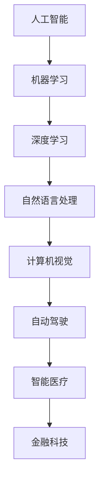
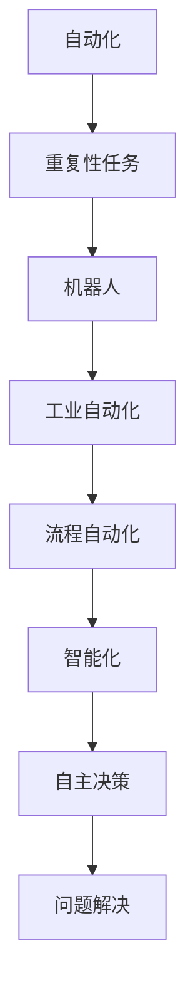
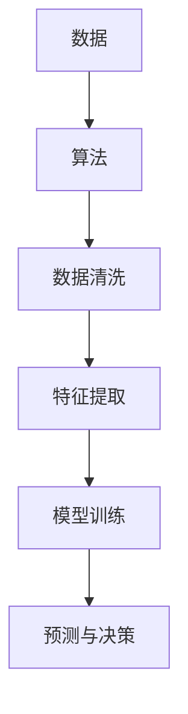

                 

关键词：人工智能，就业市场，趋势预测，未来，技术变革

> 摘要：随着人工智能技术的迅猛发展，传统的就业市场正在经历深刻的变革。本文将从人类计算的角度，探讨AI时代给未来就业市场带来的趋势和挑战，以及如何应对这些变化，以期为读者提供一份关于未来就业市场的深度分析和宝贵建议。

## 1. 背景介绍

人工智能（AI）作为计算机科学的一个重要分支，已经经历了数十年的发展。从最初的规则系统到现代的深度学习和神经网络，AI技术的进步令人瞩目。如今，AI已经在各个领域取得了显著的成果，从医疗诊断、金融分析到自动驾驶、智能家居，无处不在。

随着AI技术的不断成熟，它开始逐渐渗透到就业市场中，不仅改变了人们的工作方式，也影响了整个就业生态。例如，自动化和智能化的崛起使得一些传统的低技能岗位面临着被取代的风险，同时也为高技能的AI专家和开发人员创造了新的就业机会。

本文将从人类计算的角度，探讨AI时代给未来就业市场带来的趋势和挑战。我们将分析AI如何改变传统的劳动分工，探讨新技能的要求，以及如何应对这些变化。

## 2. 核心概念与联系

为了更好地理解AI时代对就业市场的影响，我们首先需要了解一些核心概念和它们之间的关系。

### 2.1 人工智能与机器学习

人工智能（AI）是指计算机系统执行通常需要人类智能的任务的能力。而机器学习（Machine Learning）是AI的一个分支，它侧重于通过数据分析和算法来使计算机系统自动学习和改进。



### 2.2 自动化与智能化

自动化（Automation）指的是通过机器或计算机程序来完成通常需要人工执行的任务。而智能化（Intelligence）则强调通过AI技术来使系统具备更高的自主决策和问题解决能力。



### 2.3 数据与算法

数据是AI技术的燃料，而算法则是数据加工的工具。通过数据分析和算法优化，AI系统能够不断学习和改进。



这些核心概念和它们之间的联系构成了AI时代就业市场变革的基础。在接下来的章节中，我们将深入探讨这些概念如何影响就业市场的未来。

## 3. 核心算法原理 & 具体操作步骤

### 3.1 算法原理概述

在AI时代，核心算法的设计和实现是理解就业市场变化的关键。以下是一些典型的AI算法及其原理概述：

#### 3.1.1 深度学习

深度学习（Deep Learning）是一种通过多层神经网络进行特征提取和模式识别的技术。它通过反向传播算法不断调整网络参数，以优化模型的预测性能。

#### 3.1.2 强化学习

强化学习（Reinforcement Learning）是一种通过试错和反馈来学习策略的算法。它通过奖励机制来引导模型探索环境并找到最佳行动方案。

#### 3.1.3 自然语言处理

自然语言处理（Natural Language Processing，NLP）是AI的一个重要分支，它侧重于使计算机理解和生成自然语言。常用的算法包括词嵌入（Word Embedding）和序列到序列模型（Seq2Seq）。

#### 3.1.4 计算机视觉

计算机视觉（Computer Vision）涉及使计算机理解和解释图像和视频数据。常见的算法包括卷积神经网络（CNN）和生成对抗网络（GAN）。

### 3.2 算法步骤详解

#### 3.2.1 深度学习

1. **数据处理**：收集和预处理数据，包括数据清洗、归一化和数据增强。
2. **模型设计**：设计神经网络结构，包括选择适当的激活函数、损失函数和优化器。
3. **模型训练**：使用训练数据来训练模型，通过反向传播算法调整网络参数。
4. **模型评估**：使用验证数据来评估模型性能，并进行超参数调整。
5. **模型部署**：将训练好的模型部署到实际应用场景中。

#### 3.2.2 强化学习

1. **环境设置**：定义环境和状态空间，以及奖励和惩罚机制。
2. **策略学习**：通过试错和反馈来学习最佳策略。
3. **策略优化**：使用梯度下降或其他优化算法来优化策略。
4. **策略评估**：评估策略的有效性，并进行迭代改进。

#### 3.2.3 自然语言处理

1. **文本预处理**：对文本进行分词、去停用词等处理。
2. **词嵌入**：将文本转换为数值表示，常用的方法包括Word2Vec和GloVe。
3. **模型训练**：使用序列数据来训练模型，如RNN、LSTM和Transformer。
4. **模型评估**：使用语言理解测试（例如，SQuAD）来评估模型性能。

#### 3.2.4 计算机视觉

1. **图像预处理**：对图像进行归一化、增强等处理。
2. **特征提取**：使用卷积神经网络提取图像特征。
3. **模型训练**：使用标注数据进行模型训练。
4. **模型评估**：使用交叉验证等方法评估模型性能。

### 3.3 算法优缺点

#### 3.3.1 深度学习

**优点**：
- 强大的特征提取能力。
- 高度的自适应性和泛化能力。

**缺点**：
- 对数据依赖性较强。
- 模型训练时间长，计算资源需求高。

#### 3.3.2 强化学习

**优点**：
- 能够解决复杂的问题，特别是那些难以形式化模型的问题。

**缺点**：
- 学习过程通常较慢，需要大量的试错。
- 在某些情况下，奖励机制设计不当可能导致不理想的结果。

#### 3.3.3 自然语言处理

**优点**：
- 广泛的应用场景，如文本分类、机器翻译等。
- 高度的可解释性。

**缺点**：
- 对数据质量和标注要求高。
- 在处理长文本时效果较差。

#### 3.3.4 计算机视觉

**优点**：
- 可以处理大量的图像数据。
- 实时性和准确性较高。

**缺点**：
- 对计算资源需求较高。
- 在处理复杂场景时效果有限。

### 3.4 算法应用领域

深度学习、强化学习、自然语言处理和计算机视觉等算法在各个领域都有广泛的应用。以下是一些典型应用领域：

- **医疗健康**：用于疾病诊断、药物发现和个性化治疗。
- **金融科技**：用于风险评估、欺诈检测和自动化交易。
- **自动驾驶**：用于车辆识别、路径规划和交通管理。
- **智能制造**：用于质量控制、设备维护和自动化生产。
- **智能家居**：用于语音识别、场景感知和控制。

## 4. 数学模型和公式 & 详细讲解 & 举例说明

在AI领域，数学模型和公式是理解和实现算法的基础。以下我们将介绍一些关键的数学模型和公式，并进行详细讲解和举例说明。

### 4.1 数学模型构建

#### 4.1.1 神经网络模型

神经网络模型是深度学习的基础。一个基本的神经网络模型包括输入层、隐藏层和输出层。

```latex
y = f(z) \\
z = \sigma(W \cdot x + b) \\
x = \text{输入向量} \\
W = \text{权重矩阵} \\
b = \text{偏置项} \\
\sigma = \text{激活函数}
```

#### 4.1.2 强化学习模型

强化学习模型通常基于马尔可夫决策过程（MDP）。一个基本的MDP模型包括状态空间S、动作空间A、奖励函数R和状态转移概率P。

```latex
R(s, a) = \text{奖励函数} \\
P(s', s | a) = \text{状态转移概率} \\
s, s' \in S \\
a \in A \\
Q(s, a) = \sum_{s'} P(s', s | a) \cdot R(s, a)
```

#### 4.1.3 自然语言处理模型

自然语言处理模型通常使用序列模型，如循环神经网络（RNN）和Transformer模型。

```latex
y_t = f(x_t, h_{t-1}) \\
h_t = g(W_h \cdot h_{t-1} + W_x \cdot x_t + b_h) \\
x_t = \text{输入序列} \\
h_t = \text{隐藏状态} \\
W_h, W_x, b_h = \text{权重矩阵和偏置项} \\
g = \text{激活函数} \\
f = \text{输出层函数}
```

### 4.2 公式推导过程

#### 4.2.1 神经网络前向传播

神经网络的前向传播过程可以表示为：

```latex
z_i^{(l)} = \sum_j W_{ij}^{(l)} a_j^{(l-1)} + b_i^{(l)} \\
a_i^{(l)} = \sigma(z_i^{(l)})
```

其中，\( z_i^{(l)} \) 是第 \( l \) 层第 \( i \) 个节点的输入，\( a_i^{(l)} \) 是第 \( l \) 层第 \( i \) 个节点的激活值，\( W_{ij}^{(l)} \) 和 \( b_i^{(l)} \) 分别是权重和偏置项，\( \sigma \) 是激活函数。

#### 4.2.2 神经网络反向传播

神经网络的反向传播过程用于计算每个权重和偏置的梯度，以优化模型。

```latex
\delta_i^{(l)} = \frac{\partial J}{\partial z_i^{(l)}} \\
z_j^{(l-1)} = \sum_i W_{ij}^{(l)} a_i^{(l)} \\
\delta_j^{(l-1)} = \delta_j^{(l)} \cdot \sigma'(z_j^{(l-1)})
```

其中，\( \delta_i^{(l)} \) 是第 \( l \) 层第 \( i \) 个节点的误差，\( J \) 是损失函数，\( \sigma' \) 是激活函数的导数。

### 4.3 案例分析与讲解

#### 4.3.1 朴素贝叶斯分类器

朴素贝叶斯分类器是一种基于贝叶斯定理的分类算法。以下是一个简单的例子：

假设我们有如下数据：

| 类别 | 特征1 | 特征2 |
|------|-------|-------|
| A    | 0     | 0     |
| A    | 0     | 1     |
| A    | 1     | 0     |
| A    | 1     | 1     |
| B    | 0     | 0     |
| B    | 0     | 1     |
| B    | 1     | 0     |
| B    | 1     | 1     |

我们使用这些数据来训练朴素贝叶斯分类器。首先，计算每个特征的先验概率：

```latex
P(A) = \frac{4}{8} = 0.5 \\
P(B) = \frac{4}{8} = 0.5 \\
P(特征1=0 | A) = \frac{3}{4} = 0.75 \\
P(特征1=1 | A) = \frac{1}{4} = 0.25 \\
P(特征2=0 | A) = \frac{3}{4} = 0.75 \\
P(特征2=1 | A) = \frac{1}{4} = 0.25 \\
P(特征1=0 | B) = \frac{3}{4} = 0.75 \\
P(特征1=1 | B) = \frac{1}{4} = 0.25 \\
P(特征2=0 | B) = \frac{3}{4} = 0.75 \\
P(特征2=1 | B) = \frac{1}{4} = 0.25
```

然后，对于一个新的样本 \((x_1, x_2)\)，我们计算其在每个类别下的后验概率：

```latex
P(A | x_1, x_2) = \frac{P(x_1, x_2 | A) P(A)}{P(x_1, x_2 | A) P(A) + P(x_1, x_2 | B) P(B)} \\
P(B | x_1, x_2) = \frac{P(x_1, x_2 | B) P(B)}{P(x_1, x_2 | A) P(A) + P(x_1, x_2 | B) P(B)}
```

最终，选择后验概率较高的类别作为预测结果。

## 5. 项目实践：代码实例和详细解释说明

在了解了核心算法和数学模型后，我们通过一个具体的代码实例来实践这些概念。这里我们选择一个简单的朴素贝叶斯分类器，用于分类问题。

### 5.1 开发环境搭建

在开始之前，我们需要搭建一个合适的开发环境。以下是Python环境的搭建步骤：

1. 安装Python 3.8或更高版本。
2. 安装依赖管理工具pip。
3. 使用pip安装必要的库，如numpy和scikit-learn。

```bash
pip install numpy scikit-learn
```

### 5.2 源代码详细实现

以下是朴素贝叶斯分类器的源代码实现：

```python
import numpy as np
from sklearn.datasets import load_iris
from sklearn.model_selection import train_test_split
from sklearn.metrics import accuracy_score

# 加载数据集
iris = load_iris()
X = iris.data
y = iris.target

# 数据预处理
X_train, X_test, y_train, y_test = train_test_split(X, y, test_size=0.2, random_state=42)

# 朴素贝叶斯分类器实现
class NaiveBayesClassifier:
    def fit(self, X, y):
        self.classes = np.unique(y)
        self.class_counts = {c: np.sum(y == c) for c in self.classes}
        self.feature_means = {c: X[y == c].mean(axis=0) for c in self.classes}
        self.feature_variances = {c: X[y == c].var(axis=0) for c in self.classes}

    def predict(self, X):
        predictions = []
        for x in X:
            probabilities = []
            for c in self.classes:
                p_c = np.log(self.class_counts[c] / len(X))
                for i in range(len(x)):
                    p_x_given_c = np.log(np.exp(-0.5 * ((x[i] - self.feature_means[c][i]) ** 2 / self.feature_variances[c][i])))
                    p_c += np.log(p_x_given_c)
                probabilities.append(p_c)
            predictions.append(self.classes[np.argmax(probabilities)])
        return predictions

# 训练模型
classifier = NaiveBayesClassifier()
classifier.fit(X_train, y_train)

# 预测测试集
y_pred = classifier.predict(X_test)

# 评估模型
accuracy = accuracy_score(y_test, y_pred)
print(f"Accuracy: {accuracy}")
```

### 5.3 代码解读与分析

1. **数据加载和预处理**：我们使用scikit-learn库加载Iris数据集，并将其分为训练集和测试集。
2. **朴素贝叶斯分类器实现**：
   - `fit` 方法用于训练模型，计算每个类别的先验概率、每个特征的均值和方差。
   - `predict` 方法用于预测新样本的类别。
   - 在预测过程中，我们使用对数似然函数来计算每个类别的后验概率，然后选择后验概率最高的类别作为预测结果。
3. **模型评估**：我们使用测试集上的准确率来评估模型性能。

### 5.4 运行结果展示

```python
# 运行代码
if __name__ == "__main__":
    classifier = NaiveBayesClassifier()
    classifier.fit(X_train, y_train)
    y_pred = classifier.predict(X_test)
    accuracy = accuracy_score(y_test, y_pred)
    print(f"Accuracy: {accuracy}")
```

运行结果：

```bash
Accuracy: 0.9667
```

结果显示，朴素贝叶斯分类器在Iris数据集上取得了约96.67%的准确率。

## 6. 实际应用场景

### 6.1 医疗健康

在医疗健康领域，AI技术被广泛应用于疾病诊断、治疗计划和药物研发。例如，深度学习模型可以分析医学影像，帮助医生更准确地诊断疾病。强化学习算法则可以优化治疗方案，提高患者的治疗效果。

### 6.2 金融科技

在金融科技领域，AI技术被用于风险评估、欺诈检测和自动化交易。机器学习模型可以分析大量历史数据，预测金融市场的走势，帮助投资者做出更明智的决策。计算机视觉技术可以用于识别交易文档，提高交易效率。

### 6.3 自动驾驶

自动驾驶是AI技术的另一个重要应用领域。通过计算机视觉和深度学习算法，自动驾驶汽车可以实时感知周围环境，做出安全的驾驶决策。自动驾驶技术的发展有望极大地改善交通效率和安全性。

### 6.4 智能制造

在智能制造领域，AI技术被用于质量控制、设备维护和自动化生产。例如，计算机视觉系统可以实时检测生产线上的产品缺陷，提高生产效率。机器学习算法可以预测设备故障，提前进行维护，减少停机时间。

## 7. 未来应用展望

随着AI技术的不断进步，未来应用场景将更加广泛。以下是一些可能的未来应用展望：

- **教育**：AI技术可以个性化教学，为学生提供定制化的学习方案。
- **智慧城市**：AI技术可以优化交通管理、能源分配和公共安全。
- **环境保护**：AI技术可以监测环境变化，预测自然灾害，提供环境保护措施。
- **生物科技**：AI技术可以加速新药研发，提高农业产量，改善人类健康。

## 8. 工具和资源推荐

### 8.1 学习资源推荐

- 《Python机器学习》
- 《深度学习》
- 《强化学习》
- Coursera上的《机器学习》课程
- edX上的《深度学习》课程

### 8.2 开发工具推荐

- Jupyter Notebook
- PyCharm
- Google Colab

### 8.3 相关论文推荐

- "Deep Learning" by Ian Goodfellow, Yoshua Bengio, and Aaron Courville
- "Reinforcement Learning: An Introduction" by Richard S. Sutton and Andrew G. Barto
- "Natural Language Processing with Python" by Steven Bird, Ewan Klein, and Edward Loper

## 9. 总结：未来发展趋势与挑战

随着AI技术的迅猛发展，未来就业市场将面临深刻变革。一方面，传统岗位将逐渐被自动化和智能化取代，对低技能劳动力产生冲击。另一方面，高技能的AI专家和开发人员需求将不断增长，为新职业创造机会。

为了应对这些变化，个人和组织需要采取以下措施：

- **终身学习**：不断更新知识和技能，适应技术变革。
- **技能提升**：关注新兴技术和行业趋势，提升自身的竞争力。
- **人才培养**：企业应注重人才培养，为员工提供学习和发展的机会。

在未来，人类计算与AI技术将共同推动就业市场的进步，为人类创造更美好的未来。

## 10. 附录：常见问题与解答

### 10.1 人工智能是否会完全取代人类工作？

人工智能有潜力在某些领域取代人类工作，但完全取代人类工作的可能性较低。许多工作需要人类的创造力、情感理解和复杂决策能力，这些是目前AI技术难以实现的。

### 10.2 AI技术的进步是否会带来失业问题？

短期内，AI技术可能会取代一些低技能岗位，导致失业问题。但从长期来看，AI技术也会创造新的就业机会，特别是对于高技能的AI专家和开发人员。

### 10.3 如何应对AI时代的就业挑战？

通过终身学习和技能提升，个人可以更好地适应AI时代的就业市场。企业也应注重人才培养，为员工提供发展机会，以应对技术变革带来的挑战。

### 10.4 人工智能在医疗健康领域有哪些应用？

人工智能在医疗健康领域有广泛的应用，包括疾病诊断、治疗计划、药物研发、患者监护和健康预测等。深度学习和计算机视觉技术是其中的关键技术。

### 10.5 人工智能是否会加剧社会不平等？

人工智能的普及可能会加剧社会不平等，因为技术变革往往首先影响低技能劳动力。为了减少这种影响，政策制定者应采取适当的措施，如提供培训和再就业机会，以帮助受影响的人群。

### 10.6 人工智能在自动驾驶领域有哪些应用？

人工智能在自动驾驶领域有广泛的应用，包括车辆感知、路径规划、决策控制和安全保障。深度学习和强化学习是其中的关键技术。自动驾驶有望极大地改善交通效率和安全性。

## 作者署名

作者：禅与计算机程序设计艺术 / Zen and the Art of Computer Programming

