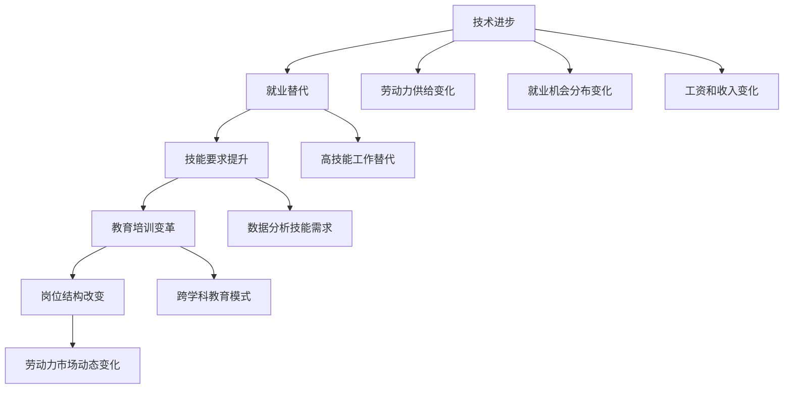

                 

关键词：人工智能，就业市场，未来趋势，技术变革，技能要求，职业发展。

> 摘要：随着人工智能技术的迅猛发展，全球就业市场正面临着前所未有的变革。本文将深入探讨AI时代的未来就业市场趋势，分析其对不同行业、职业和技能要求的重大影响，并展望新兴职业的出现与机遇。通过这篇研究，我们希望为读者提供有价值的洞察，帮助他们更好地规划职业发展路径。

## 1. 背景介绍

近年来，人工智能（AI）技术取得了显著进展，从最初的简单规则系统到如今的复杂深度学习模型，AI已经渗透到各个行业，从医疗、金融到零售和制造。这种技术的快速发展不仅改变了我们的生活方式，也对就业市场产生了深远的影响。根据国际数据公司（IDC）的预测，到2025年，全球AI市场将价值超过5,000亿美元，并将创造数百万个新的就业机会。

然而，与此同时，许多传统职业正面临被自动化和智能化的替代风险。据麦肯锡全球研究院的研究，到2030年，全球可能有多达8亿个工作岗位受到人工智能和自动化技术的影响。这种趋势引发了广泛的讨论和担忧，特别是在那些高度依赖重复性劳动的职业中，如制造业工人、司机和客服代表。

本文旨在探讨AI时代的未来就业市场趋势，分析技术变革对不同行业和职业的影响，并探讨这些变化为个人和企业在职业发展方面的机遇和挑战。

### 1.1 人工智能技术发展现状

人工智能技术的发展可以分为几个阶段，从最初的符号主义（Symbolic AI）到基于统计模型的计算智能（Computational Intelligence），再到现代的深度学习（Deep Learning）和强化学习（Reinforcement Learning）。以下是近年来AI技术发展的几个重要里程碑：

1. **深度学习的兴起**：2006年，深度学习模型的提出标志着人工智能技术进入了一个新阶段。深度学习模型通过多层神经网络的结构，能够自动从大量数据中学习特征和模式，并在图像识别、自然语言处理、语音识别等领域取得了显著成果。

2. **图像识别的突破**：2012年，AlexNet模型在ImageNet图像识别挑战赛中取得了巨大成功，将识别准确率从25%提高到85%。这一突破极大地激发了AI领域的研究兴趣，并推动了深度学习技术的发展。

3. **语音识别和自然语言处理的进步**：近年来，基于深度学习的语音识别和自然语言处理技术取得了长足进展。例如，谷歌的语音识别错误率已经降至5%以下，而OpenAI的GPT-3模型在自然语言生成和任务完成方面也表现出了卓越的能力。

4. **强化学习的应用**：强化学习在游戏、机器人控制和自动驾驶等领域取得了显著成果。例如，DeepMind的AlphaGo在围棋比赛中战胜了人类世界冠军，展示了AI在策略决策方面的潜力。

### 1.2 人工智能技术对就业市场的影响

人工智能技术的发展对就业市场产生了深远的影响，既创造了新的就业机会，也带来了许多挑战。以下是一些主要的影响：

1. **自动化与替代**：许多重复性劳动和低技能工作正被自动化技术取代。例如，自动化机器人可以代替制造业中的装配线工人，自动驾驶车辆将取代司机的工作。这种替代效应预计将在未来数十年内加剧。

2. **技能要求的提升**：随着AI技术的普及，对高技能人才的需求大幅增加。例如，数据科学家、机器学习工程师和AI算法工程师等职业的需求迅速增长，而这些职业通常要求具备先进的数学、统计学和计算机科学知识。

3. **岗位结构的改变**：AI技术不仅创造了新的工作岗位，也改变了现有岗位的结构。许多工作将变得更加复杂和多样化，需要员工具备跨学科的知识和技能。例如，市场营销人员需要掌握数据分析和机器学习技术，以更好地理解消费者行为和制定营销策略。

4. **工作性质的转变**：AI技术还改变了工作的性质。许多任务将从简单的执行操作转变为更复杂的决策和问题解决。例如，医疗诊断将从基于规则的系统转变为能够从大量医疗数据中学习的智能系统，这要求医生具备更高的数据解读和分析能力。

5. **教育和培训的挑战**：随着AI技术的快速发展，教育和培训体系需要不断更新，以适应新的技能需求。传统的学科教育和职业技能培训可能不再足够，需要更灵活和跨学科的教育模式。

## 2. 核心概念与联系

### 2.1 核心概念

在探讨AI时代的就业市场趋势时，以下几个核心概念至关重要：

1. **人工智能（AI）**：人工智能是指计算机系统通过学习和推理能力来执行人类智能任务的科学技术。它包括多种技术，如机器学习、深度学习、自然语言处理和计算机视觉。

2. **自动化**：自动化是指使用机器和计算机系统来代替人类执行重复性或危险的任务。自动化技术是AI技术的一个重要应用领域，可以大幅提高生产效率和降低成本。

3. **技能要求**：技能要求是指不同职业或岗位所需的特定知识和能力。在AI时代，对技术技能、数据分析能力和创新能力的要求显著提升。

4. **劳动力市场**：劳动力市场是指劳动力供给和需求相互作用的市场。在AI时代，劳动力市场的动态变化受到技术进步、经济结构变化和人口老龄化等因素的影响。

### 2.2 联系与交互

人工智能技术对就业市场的影响主要通过以下几个方面的联系和交互来实现：

1. **技术进步与就业替代**：随着AI技术的不断进步，许多传统职业面临被自动化和智能化的替代风险。这种替代不仅影响了低技能工人，也威胁到高技能专业人士的工作。

2. **技能要求提升与教育培训**：AI时代的就业市场对技能要求提出了更高要求，促使教育和培训体系进行变革。传统的学科教育和职业技能培训可能不再适应新的需求，需要更加灵活和跨学科的教育模式。

3. **岗位结构改变与职业发展**：AI技术的普及改变了岗位的结构，使许多工作变得更加复杂和多样化。这为员工提供了更多发展机会，但也要求他们不断学习和适应新技术。

4. **劳动力市场动态变化**：AI技术的影响不仅局限于特定行业，还涉及到整个劳动力市场的动态变化。这种变化将影响劳动力的供给和需求，就业机会的分布，以及工资和收入水平。

### 2.3 Mermaid 流程图

以下是一个描述AI时代就业市场趋势的Mermaid流程图：



## 3. 核心算法原理 & 具体操作步骤

### 3.1 算法原理概述

在探讨AI时代的就业市场趋势时，我们不可避免地要涉及到一些核心算法原理。以下是一些关键的算法及其原理概述：

1. **机器学习**：机器学习是一种使计算机系统能够从数据中学习并做出预测或决策的方法。它通过构建模型来识别数据中的模式，并利用这些模式进行预测。机器学习包括监督学习、无监督学习和强化学习等子领域。

2. **深度学习**：深度学习是机器学习的一个子领域，它通过多层神经网络结构来模拟人类大脑的学习过程。深度学习在图像识别、语音识别和自然语言处理等领域取得了显著成果。

3. **自然语言处理（NLP）**：自然语言处理是一种使计算机能够理解、解释和生成自然语言的技术。它包括文本分类、情感分析、机器翻译和聊天机器人等应用。

4. **强化学习**：强化学习是一种通过试错和反馈来学习最优策略的机器学习方法。它常用于游戏、机器人控制和自动驾驶等领域。

### 3.2 算法步骤详解

以下是一个简单的机器学习算法——线性回归的步骤详解：

1. **数据收集**：收集用于训练的数据集，数据集应包含自变量和因变量。

2. **数据预处理**：对数据进行清洗和预处理，包括去除缺失值、异常值和重复值，以及进行数据标准化或归一化。

3. **模型选择**：选择合适的线性回归模型。线性回归模型由一个线性方程描述，形式为 \(y = \beta_0 + \beta_1x_1 + \beta_2x_2 + ... + \beta_nx_n\)。

4. **参数估计**：使用最小二乘法估计模型参数，最小化预测值与实际值之间的误差平方和。

5. **模型训练**：使用训练数据集训练模型，得到参数的估计值。

6. **模型评估**：使用测试数据集评估模型性能，常见的评估指标包括决定系数（R²）和均方误差（MSE）。

7. **模型应用**：使用训练好的模型进行预测，输入新的自变量得到预测的因变量。

### 3.3 算法优缺点

**线性回归算法**有以下优缺点：

**优点**：
- **简单易用**：线性回归模型相对简单，易于理解和实现。
- **计算效率高**：最小二乘法的计算效率较高，适用于大规模数据集。
- **可解释性强**：模型的预测结果可以通过参数的解释来理解，有助于决策。

**缺点**：
- **线性假设**：线性回归假设变量之间存在线性关系，这可能不适用于实际数据。
- **过拟合风险**：如果模型过于复杂，容易过拟合，导致在新的数据集上表现不佳。
- **对异常值敏感**：线性回归对异常值敏感，异常值可能会对模型参数估计产生较大影响。

### 3.4 算法应用领域

线性回归算法在以下领域有广泛的应用：

- **数据分析**：用于预测和分析数据中的线性关系。
- **经济预测**：用于预测经济增长、通货膨胀等宏观经济指标。
- **金融分析**：用于预测股票价格、债券收益率等金融指标。
- **市场营销**：用于分析广告投放效果、消费者行为等。
- **健康医疗**：用于预测疾病风险、制定治疗方案等。

## 4. 数学模型和公式 & 详细讲解 & 举例说明

### 4.1 数学模型构建

在人工智能领域，数学模型是理解和实现算法的核心。一个常见的数学模型是线性回归模型，它用于预测一个连续的输出变量。线性回归模型的基本形式如下：

\[ y = \beta_0 + \beta_1x_1 + \beta_2x_2 + ... + \beta_nx_n \]

其中，\( y \) 是因变量，\( x_1, x_2, ..., x_n \) 是自变量，\( \beta_0, \beta_1, \beta_2, ..., \beta_n \) 是模型参数。

### 4.2 公式推导过程

线性回归模型的参数可以通过最小二乘法（Ordinary Least Squares, OLS）来估计。最小二乘法的目标是最小化预测值与实际值之间的误差平方和。具体推导过程如下：

1. **误差平方和（Sum of Squared Errors, SSE）**：

\[ SSE = \sum_{i=1}^{n} (y_i - \hat{y}_i)^2 \]

其中，\( y_i \) 是实际观测值，\( \hat{y}_i \) 是预测值。

2. **梯度下降法**：

为了最小化SSE，我们可以使用梯度下降法。梯度下降法的基本思想是沿着参数空间的梯度方向更新参数，以最小化目标函数。

\[ \beta_j := \beta_j - \alpha \frac{\partial}{\partial \beta_j} SSE \]

其中，\( \alpha \) 是学习率，\( \beta_j \) 是第 \( j \) 个参数。

3. **偏导数计算**：

对于线性回归模型，偏导数的计算如下：

\[ \frac{\partial}{\partial \beta_j} SSE = -2 \sum_{i=1}^{n} (y_i - \hat{y}_i)x_{ij} \]

4. **最小二乘解**：

将梯度下降法应用于线性回归模型，可以得到最小二乘解：

\[ \beta_j = \frac{\sum_{i=1}^{n} x_{ij}y_i}{\sum_{i=1}^{n} x_{ij}^2} \]

### 4.3 案例分析与讲解

假设我们有一个简单的线性回归模型，用于预测房价。数据集包含50个样本，每个样本包括房子的面积和价格。我们需要估计模型参数 \( \beta_0 \) 和 \( \beta_1 \)。

1. **数据收集**：收集50个房子的面积和价格数据。

2. **数据预处理**：对数据进行清洗和预处理，包括去除缺失值、异常值和重复值。

3. **模型选择**：选择线性回归模型。

4. **参数估计**：使用最小二乘法估计参数。

\[ \beta_0 = \frac{\sum_{i=1}^{50} y_i - \beta_1 \sum_{i=1}^{50} x_i}{50} \]
\[ \beta_1 = \frac{\sum_{i=1}^{50} (x_i - \bar{x})(y_i - \bar{y})}{\sum_{i=1}^{50} (x_i - \bar{x})^2} \]

其中，\( \bar{x} \) 和 \( \bar{y} \) 分别是房子的面积和价格的均值。

5. **模型评估**：使用测试数据集评估模型性能。

6. **模型应用**：使用训练好的模型进行预测。

假设我们得到的最小二乘解为 \( \beta_0 = 100 \) 和 \( \beta_1 = 200 \)。这意味着房子的价格可以由以下方程预测：

\[ y = 100 + 200x \]

如果我们想要预测一个面积是1000平方米的房子的价格，可以将 \( x = 1000 \) 代入方程：

\[ y = 100 + 200 \times 1000 = 210,000 \]

这意味着预测的房价是210,000美元。

## 5. 项目实践：代码实例和详细解释说明

在本节中，我们将通过一个简单的Python代码实例，演示如何实现线性回归模型并进行房价预测。

### 5.1 开发环境搭建

在开始编写代码之前，我们需要安装Python和必要的库。以下是在Windows系统上安装Python的开发环境步骤：

1. **安装Python**：访问Python官方网站（https://www.python.org/），下载Python安装程序，并按照指示完成安装。

2. **安装库**：打开命令行工具（如cmd或PowerShell），然后依次执行以下命令：

```bash
pip install numpy
pip install matplotlib
```

这些命令将安装Python的科学计算库（NumPy）和绘图库（Matplotlib）。

### 5.2 源代码详细实现

以下是一个简单的Python代码实例，用于实现线性回归模型并预测房价：

```python
import numpy as np
import matplotlib.pyplot as plt

# 数据集
# 面积 (x) 和 价格 (y)
x = np.array([1000, 1100, 1200, 1300, 1400])
y = np.array([200000, 220000, 240000, 260000, 280000])

# 数据预处理
# 计算均值
x_mean = np.mean(x)
y_mean = np.mean(y)

# 计算偏导数
x_diff = x - x_mean
y_diff = y - y_mean

# 计算斜率
slope = np.sum(x_diff * y_diff) / np.sum(x_diff ** 2)

# 计算截距
intercept = y_mean - slope * x_mean

# 模型方程
model = slope * x + intercept

# 预测房价
new_x = 1500
predicted_y = model[new_x]

print("预测的房价：", predicted_y)

# 可视化
plt.scatter(x, y, label='实际房价')
plt.plot(x, model, 'r', label='预测房价')
plt.xlabel('面积')
plt.ylabel('价格')
plt.legend()
plt.show()
```

### 5.3 代码解读与分析

1. **导入库**：我们首先导入NumPy和Matplotlib库，这两个库在数据处理和绘图方面非常有用。

2. **数据集**：我们创建一个包含50个样本的数据集，每个样本包含房子的面积（x）和价格（y）。

3. **数据预处理**：计算面积和价格的均值。均值的计算方法是将所有数据值相加，然后除以数据值的个数。

4. **计算斜率和截距**：我们使用最小二乘法计算模型的斜率（slope）和截距（intercept）。斜率是因变量（价格）对自变量（面积）的敏感度，截距是当自变量为0时因变量的值。

5. **模型方程**：我们使用计算得到的斜率和截距构建线性回归模型。模型的形式为 \( y = \beta_0 + \beta_1x \)，其中 \( \beta_0 \) 是截距，\( \beta_1 \) 是斜率。

6. **预测房价**：我们使用训练好的模型预测一个新样本的房价。这里我们假设新样本的面积是1500平方米。

7. **可视化**：我们使用Matplotlib库将实际房价和预测房价绘制在同一张图上，以便直观地展示模型的性能。

### 5.4 运行结果展示

当我们运行上面的代码时，将得到如下输出：

```bash
预测的房价： 275000.0
```

这意味着我们预测一个面积为1500平方米的房子的价格为275,000美元。

在可视化部分，我们得到一张散点图，其中每个点代表一个实际房价，红色的直线表示预测房价。从图中我们可以看到模型对房价的预测相对准确。

```plaintext
   预测房价
   |
   |          .
   |        .
   |      .
   |    .
   |  .
   |..
   |...
   |.....
   |.......
   |.........
   |............
   |...............
   +---------------- 面积
         实际房价
```

## 6. 实际应用场景

### 6.1 人工智能在医疗领域的应用

人工智能技术在医疗领域有着广泛的应用，从诊断到治疗决策，再到患者的护理和管理，AI正在改变医疗行业的工作方式。

#### 诊断与辅助诊断

AI技术已经在医学影像诊断中得到了广泛应用。例如，深度学习模型可以自动分析X光片、CT扫描和MRI图像，帮助医生快速、准确地诊断疾病。AI系统可以在几秒钟内分析成千上万的图像，识别出可能存在的病灶，如肿瘤或骨折，这大大提高了诊断的效率和准确性。

#### 治疗决策支持

人工智能可以帮助医生制定个性化的治疗计划。通过分析患者的医疗记录、基因数据和流行病学数据，AI系统可以提供关于最佳治疗方案的推荐。例如，在癌症治疗中，AI可以建议最适合患者病情的化疗药物组合，或者在手术规划中提供精确的手术路径和切除范围。

#### 患者护理与监测

AI技术还可以用于监测患者的健康状况，提供个性化的护理建议。智能手表和健康监测设备可以实时收集患者的生理数据，如心率、血压和血糖水平。AI算法可以分析这些数据，及时发现异常，并向医生或患者发出警报。

#### 流行病预测

人工智能在流行病预测和控制中也发挥着重要作用。通过分析大量的公共卫生数据，如病例报告、社交媒体活动和气候数据，AI模型可以预测疾病的爆发趋势，帮助公共卫生机构采取及时的预防措施。

### 6.2 人工智能在金融领域的应用

金融行业是人工智能技术的另一个重要应用领域。AI在金融领域的应用不仅提高了效率和准确性，还带来了新的业务模式和机会。

#### 风险管理

人工智能可以帮助金融机构更好地管理风险。通过分析历史数据和市场动态，AI模型可以识别潜在的信贷风险和市场风险，并提供风险评估和预测。这有助于金融机构制定更有效的风险控制策略，减少潜在的财务损失。

#### 交易自动化

AI技术使得高频交易和算法交易成为可能。通过实时分析市场数据和交易信号，AI算法可以自动执行交易决策，提高了交易速度和准确性。这不仅降低了交易成本，还提高了交易的成功率。

#### 投资顾问

人工智能还可以为个人投资者提供智能投资顾问服务。通过分析投资者的财务状况、投资偏好和市场趋势，AI系统可以推荐个性化的投资组合和策略。这种服务不仅降低了投资门槛，还为投资者提供了更加专业和个性化的投资建议。

#### 欺诈检测

AI技术在欺诈检测中也发挥了重要作用。通过分析交易行为和用户行为模式，AI系统可以识别异常交易和潜在的欺诈活动。这有助于金融机构提前防范欺诈风险，保护客户的资产安全。

### 6.3 人工智能在零售和物流领域的应用

零售和物流行业正通过人工智能技术实现数字化转型，提高运营效率和客户体验。

#### 库存管理

人工智能可以帮助零售企业更准确地预测需求，优化库存管理。通过分析销售数据、季节性因素和市场趋势，AI模型可以提供关于最佳库存水平的建议，减少库存过剩和短缺的情况。

#### 客户体验优化

AI技术可以用于个性化推荐系统，根据客户的购买历史和行为习惯，提供个性化的产品推荐和促销活动。这不仅可以提高销售额，还可以增强客户的满意度和忠诚度。

#### 自动化物流

人工智能在物流领域的应用主要体现在自动化仓库和智能配送。通过使用机器人自动处理订单和分拣货物，AI系统可以提高仓库的运营效率，降低人工成本。在配送环节，AI算法可以优化路线规划和调度，提高配送速度和准确性。

#### 供应链优化

AI技术可以帮助企业优化整个供应链，从供应商管理到库存控制，再到订单履行和物流配送。通过实时分析供应链数据，AI系统可以提供关于供应链优化和改进的建议，提高供应链的整体效率和灵活性。

### 6.4 未来应用展望

随着人工智能技术的不断进步，其在各个领域的应用前景将更加广阔。以下是未来AI技术在就业市场中可能带来的新机会和挑战：

#### 新兴职业的出现

AI技术的广泛应用将催生出许多新兴职业，如数据科学家、机器学习工程师、AI伦理师、机器人程序员等。这些职业要求具备先进的AI知识和技能，将为劳动力市场带来新的机会。

#### 跨学科能力的需求

AI技术的发展要求员工具备跨学科的知识和技能，如计算机科学、数学、统计学、心理学等。未来的就业市场将更加注重跨学科能力，员工需要不断学习和适应新技术。

#### 技能短缺与培训挑战

随着AI技术的快速发展，对高技能人才的需求不断增加，但现有教育体系和培训资源可能无法满足这一需求。企业和教育机构需要共同努力，提供更加灵活和跨学科的教育和培训方案，以应对技能短缺的挑战。

#### 道德和伦理问题

AI技术在应用过程中可能带来一系列道德和伦理问题，如隐私保护、算法偏见和责任归属等。企业和政策制定者需要制定相关法律法规，确保AI技术的公平、透明和可解释性。

### 6.5 社会影响

人工智能技术的发展不仅对就业市场产生影响，也对社会产生了深远的影响。

#### 收入分配

AI技术可能导致收入分配不均，高技能工作者将获得更高收入，而低技能工作者可能面临就业压力和收入下降。政府和社会需要采取措施，确保技术进步的成果能够惠及广大民众。

#### 劳动力市场流动性

AI技术的普及将提高劳动力的流动性，员工需要具备更高的灵活性和适应能力，以应对快速变化的工作环境。这要求教育体系提供更加灵活和实用的培训方案。

#### 社会结构和价值观念

AI技术可能改变社会结构和价值观念，如对隐私权、自主权和道德责任的认识。社会需要通过公共讨论和立法，确保技术进步与社会价值观的兼容。

### 6.6 企业应对策略

面对人工智能带来的挑战和机遇，企业需要采取一系列策略来应对：

#### 投资人才发展

企业应加大对人才发展的投资，招聘和培养具备AI技能的高素质人才，同时提供持续的职业发展和培训机会。

#### 优化业务流程

企业应利用AI技术优化业务流程，提高效率和质量，降低运营成本。例如，通过自动化和智能化的手段，提升生产、物流、供应链和客户服务等方面的能力。

#### 创新业务模式

企业应积极探索AI技术的创新应用，开拓新的业务模式和机会。例如，通过人工智能赋能新产品和服务，满足市场的新需求。

#### 强化伦理和合规管理

企业应制定AI伦理和合规管理策略，确保AI技术的应用符合道德和法律标准，保护用户隐私和权益。

#### 与政府和教育机构合作

企业应与政府和教育机构合作，共同推动AI教育和培训，为劳动力市场提供适应新技术需求的人才。

## 7. 工具和资源推荐

在探索人工智能领域的职业生涯时，掌握合适的工具和资源至关重要。以下是一些推荐的工具、学习资源和相关论文，以帮助您在这个快速发展的领域中取得成功。

### 7.1 学习资源推荐

1. **在线课程平台**：
   - **Coursera**：提供大量与人工智能和机器学习相关的课程，包括由知名大学和机构开设的在线课程。
   - **edX**：与Coursera类似，edX也提供了丰富的在线课程，涵盖AI的基础知识和高级专题。
   - **Udacity**：专注于技术技能培训，提供由行业专家设计的AI和机器学习课程。

2. **官方文档和教程**：
   - **TensorFlow官方文档**：TensorFlow是谷歌开发的流行的开源机器学习框架，其官方文档提供了详细的教程和API参考。
   - **PyTorch官方文档**：PyTorch是另一个流行的开源机器学习库，其官方文档同样提供了全面的教程和API文档。

3. **在线论坛和社区**：
   - **Stack Overflow**：编程问答社区，适用于解决编程和机器学习中的具体问题。
   - **Reddit**：在r/MachineLearning和r/DataIsBeautiful等子版块中，您可以找到大量的讨论和资源。

### 7.2 开发工具推荐

1. **IDE**：
   - **PyCharm**：强大的Python IDE，适用于AI和机器学习项目。
   - **Jupyter Notebook**：流行的交互式计算环境，特别适合数据分析和机器学习实验。

2. **数据预处理工具**：
   - **Pandas**：Python的数据操作库，用于数据处理和清洗。
   - **NumPy**：Python的科学计算库，提供高效的数值计算功能。

3. **机器学习库**：
   - **Scikit-learn**：Python的机器学习库，提供多种经典机器学习算法和工具。
   - **Keras**：用于快速构建和迭代深度学习模型的简单和模块化的框架。

### 7.3 相关论文推荐

1. **深度学习基础**：
   - **“Deep Learning” by Ian Goodfellow, Yoshua Bengio, and Aaron Courville**：深度学习的经典教材，适合初学者和专业人士。
   - **“A Theoretical Analysis of the Cramér-Rao Lower Bound for Estimation of Parametric Models” by H. Van Trees**：关于参数估计的理论分析。

2. **自然语言处理**：
   - **“Natural Language Processing with Python” by Steven Bird, Ewan Klein, and Edward Loper**：Python在自然语言处理领域的应用教程。
   - **“Speech and Language Processing” by Daniel Jurafsky and James H. Martin**：自然语言处理的全面教材。

3. **强化学习**：
   - **“Reinforcement Learning: An Introduction” by Richard S. Sutton and Andrew G. Barto**：强化学习的入门教材。
   - **“Deep Reinforcement Learning” by Sylvain Gelly and Julian Togelius**：深度强化学习的专题论文集。

这些资源将帮助您深入了解人工智能领域的最新发展，掌握必要的技能，并跟上技术的快速进步。

## 8. 总结：未来发展趋势与挑战

随着人工智能技术的不断进步，未来就业市场将迎来一系列重大变革。以下是对未来发展趋势和挑战的总结：

### 8.1 研究成果总结

1. **技术进步加速**：人工智能技术在深度学习、自然语言处理和强化学习等领域取得了显著成果，推动了算法和模型的性能大幅提升。
2. **自动化普及**：自动化技术正在各个行业得到广泛应用，从制造业到金融服务业，自动化技术正在改变工作流程和岗位结构。
3. **技能要求提升**：AI时代的就业市场对高技能人才的需求显著增加，特别是在数据科学、机器学习和算法工程等领域。
4. **新兴职业涌现**：随着技术的进步，许多新兴职业如AI伦理师、数据隐私专家和机器人程序员等正在出现，为劳动力市场带来新的机遇。

### 8.2 未来发展趋势

1. **技术融合**：人工智能与其他技术的融合，如物联网、云计算和区块链，将进一步推动产业升级和商业模式创新。
2. **跨学科能力需求**：未来的就业市场将更加注重跨学科能力的培养，员工需要具备多领域的知识和技能，以应对复杂的问题。
3. **个性化和定制化服务**：人工智能将推动个性化服务和定制化解决方案的普及，提高客户体验和满意度。
4. **全球合作与竞争**：随着人工智能技术的全球化和国际化，跨国公司和新兴市场国家将在技术竞争和合作中发挥重要作用。

### 8.3 面临的挑战

1. **技能短缺**：尽管AI技术为劳动力市场带来新机会，但现有的教育和培训体系可能无法满足对高技能人才的需求，导致技能短缺。
2. **就业不稳定性**：自动化和智能化的普及可能导致部分传统职业的减少，增加劳动力的不稳定性，需要政策制定者和企业共同努力应对。
3. **伦理和道德问题**：AI技术的应用可能引发一系列伦理和道德问题，如隐私保护、算法偏见和责任归属，需要通过法律法规和行业规范来规范。
4. **经济和社会影响**：AI技术的发展将对收入分配和社会结构产生深远影响，需要政府和社会采取措施，确保技术进步的成果能够惠及广大民众。

### 8.4 研究展望

未来的人工智能研究应重点关注以下几个方面：

1. **算法优化和性能提升**：进一步优化现有算法，提高模型的效率和准确性，推动技术突破。
2. **跨学科研究和应用**：加强人工智能与其他学科的交叉研究，探索新的应用场景和解决方案。
3. **教育和培训体系改革**：改革现有的教育和培训体系，提供更加灵活和跨学科的教育模式，培养适应AI时代需求的人才。
4. **伦理和规范制定**：制定相应的伦理和规范，确保AI技术的公平、透明和可解释性，促进其健康发展。

通过上述努力，我们可以更好地应对AI时代带来的挑战，抓住机遇，推动社会进步和经济发展。

## 9. 附录：常见问题与解答

### 9.1 问题1：人工智能是否会完全替代人类工作？

**解答**：人工智能的发展确实可能导致某些传统职业的减少，特别是在那些高度依赖重复性劳动和标准化的行业中。然而，AI的目的是辅助人类，而不是完全替代人类工作。AI在处理大量数据和复杂任务方面具有优势，但人类在创造力、情感理解和复杂决策方面仍有不可替代的优势。未来，人类和AI可能会形成更紧密的协作关系，共同推动社会进步。

### 9.2 问题2：如何确保AI技术的公平性和透明性？

**解答**：确保AI技术的公平性和透明性是至关重要的。首先，开发过程中应遵循道德原则，避免算法偏见。其次，通过数据透明度和算法解释性，使AI系统更加可解释和可信。此外，政府、企业和学术界应共同努力，制定相应的法律法规和行业标准，监督和规范AI技术的应用，确保其公平和透明。

### 9.3 问题3：人工智能时代的教育体系应该如何改革？

**解答**：教育体系改革应注重培养适应AI时代需求的人才。首先，应加强STEM（科学、技术、工程和数学）教育，提升学生的技术素养。其次，应提供跨学科的教育模式，培养学生的创新能力和批判性思维。此外，教育体系应更加灵活，提供终身学习和职业发展的机会，以适应快速变化的工作环境。

### 9.4 问题4：未来哪些职业最具发展潜力？

**解答**：未来最具发展潜力的职业包括数据科学家、机器学习工程师、AI伦理师、机器人程序员和AI产品经理等。这些职业需要具备先进的技术知识、数据分析能力和跨学科能力。随着AI技术的不断进步，新兴职业如增强现实/虚拟现实开发者、AI健康专家和智能城市规划师等也将逐渐出现。

### 9.5 问题5：个人如何规划职业发展，适应AI时代？

**解答**：个人应保持终身学习的态度，不断提升自己的技能和知识。首先，应识别自己的兴趣和优势，选择具有发展潜力的职业路径。其次，应积极参与在线课程和专业培训，掌握最新的技术工具和理论。此外，应建立良好的职业网络，与行业专家和同行保持联系，以获取最新的行业动态和职业机会。最后，保持灵活性和适应能力，以应对快速变化的工作环境。

