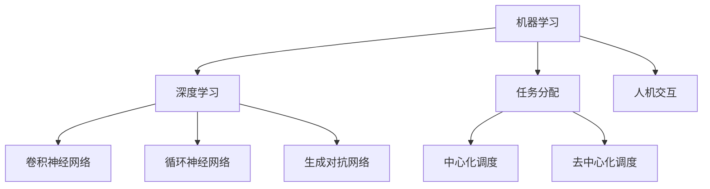

                 

关键词：人工智能，就业趋势，职业转型，技能需求，教育变革

> 摘要：随着人工智能技术的快速发展，人类计算领域正经历着前所未有的变革。本文将深入探讨AI时代下的就业趋势，分析其对不同职业的影响，探讨教育体系的适应性变革，并展望未来就业市场的发展方向。通过对核心概念、算法原理、数学模型、项目实践以及工具资源的详尽探讨，本文旨在为读者提供全面、深入的见解，帮助大家应对AI时代的职业挑战。

## 1. 背景介绍

### AI技术的发展历程

人工智能（AI）作为计算机科学的一个重要分支，起源于20世纪50年代。经过数十年的发展，AI技术经历了从规则推理、知识表示到机器学习、深度学习的多次迭代。近年来，随着计算能力的提升、大数据的涌现以及算法的创新，AI技术取得了显著的突破，逐渐从理论研究走向实际应用。

### 人类计算的定义

人类计算（Human Computation）是指利用人类智能来解决计算机难以处理的问题。它通过设计合理的任务分配机制，将复杂问题分解成多个简单任务，由人类执行，然后再将结果汇总。人类计算的应用领域广泛，包括图像识别、自然语言处理、推荐系统等。

### AI时代下的就业挑战

AI技术的发展不仅带来了技术的革新，也对就业市场产生了深远影响。一方面，AI技术能够自动化许多传统工作，导致部分职业的减少；另一方面，AI时代也催生了新的就业机会，要求从业者具备更高的技能和创新能力。

## 2. 核心概念与联系

### 人工智能基础

#### **机器学习**  
机器学习是AI的核心技术之一，它通过构建模型来模拟人类学习过程，使计算机具备自主学习和改进的能力。主要算法包括监督学习、无监督学习和强化学习。

#### **深度学习**  
深度学习是机器学习的一个重要分支，通过多层神经网络来模拟人类大脑的学习机制，具有处理复杂数据的能力。典型的深度学习模型包括卷积神经网络（CNN）、循环神经网络（RNN）和生成对抗网络（GAN）。

### 人类计算架构

#### **任务分配与调度**  
任务分配与调度是确保人类计算高效运行的关键环节。通过合理的任务分配，可以提高任务的执行效率和准确性。调度算法包括中心化调度和去中心化调度。

#### **人机交互**  
人机交互是连接人类计算与人工智能的重要桥梁。通过优化人机交互界面，可以提升人类计算任务的执行效率和用户体验。

### Mermaid 流程图



## 3. 核心算法原理 & 具体操作步骤

### 3.1 算法原理概述

#### **机器学习原理**

机器学习基于统计学和概率论，通过训练数据集来构建模型。模型的学习过程包括数据预处理、模型选择、模型训练和模型评估。

#### **深度学习原理**

深度学习通过多层神经网络对数据进行层次化处理，每一层对数据进行特征提取和组合，最终输出预测结果。深度学习的核心在于网络结构的优化和参数的调节。

### 3.2 算法步骤详解

#### **机器学习步骤**

1. 数据采集与预处理：收集大量训练数据，并进行数据清洗、归一化等预处理操作。
2. 模型选择：根据问题类型选择合适的机器学习算法。
3. 模型训练：使用训练数据集训练模型，调整模型参数。
4. 模型评估：使用测试数据集评估模型性能，选择最优模型。

#### **深度学习步骤**

1. 网络构建：设计深度学习网络结构，包括层数、每层的神经元数量和激活函数。
2. 模型训练：使用训练数据集对网络进行训练，通过反向传播算法调整网络参数。
3. 模型评估：使用测试数据集评估模型性能，调整网络结构或参数。

### 3.3 算法优缺点

#### **机器学习**

优点：具有较强的泛化能力，适用于各种类型的数据和问题。

缺点：对训练数据量有较高要求，训练过程可能较慢。

#### **深度学习**

优点：能够处理大量复杂数据，具有较好的性能和效果。

缺点：模型参数较多，训练过程较复杂，对计算资源要求较高。

### 3.4 算法应用领域

#### **机器学习**

应用领域广泛，包括图像识别、自然语言处理、推荐系统、金融风控等。

#### **深度学习**

应用领域主要包括图像处理、语音识别、自然语言处理、自动驾驶等。

## 4. 数学模型和公式 & 详细讲解 & 举例说明

### 4.1 数学模型构建

#### **线性回归**

线性回归模型表示为：

$$ y = w \cdot x + b $$

其中，$y$为输出值，$x$为输入值，$w$为权重，$b$为偏置。

#### **神经网络**

神经网络模型由多层神经元组成，每一层神经元通过权重和偏置与下一层神经元相连。输出值通过激活函数计算：

$$ f(z) = \sigma(z) = \frac{1}{1 + e^{-z}} $$

其中，$\sigma$为 sigmoid 激活函数，$z$为输入值。

### 4.2 公式推导过程

#### **线性回归公式推导**

线性回归模型的目标是最小化损失函数：

$$ J(w, b) = \frac{1}{2} \sum_{i=1}^{n} (y_i - (w \cdot x_i + b))^2 $$

对 $w$ 和 $b$ 分别求偏导并令偏导数为0，得到：

$$ \frac{\partial J}{\partial w} = \sum_{i=1}^{n} (y_i - (w \cdot x_i + b)) \cdot x_i = 0 $$

$$ \frac{\partial J}{\partial b} = \sum_{i=1}^{n} (y_i - (w \cdot x_i + b)) = 0 $$

解得：

$$ w = \frac{\sum_{i=1}^{n} (y_i - (w \cdot x_i + b)) \cdot x_i}{\sum_{i=1}^{n} x_i^2} $$

$$ b = \frac{\sum_{i=1}^{n} (y_i - (w \cdot x_i + b))}{n} $$

#### **神经网络公式推导**

神经网络模型的训练过程涉及多层反向传播。以一层为例，假设前一层输出为 $a^{(l-1)}$，本层输入为 $z^{(l)}$，输出为 $a^{(l)}$，则：

$$ z^{(l)} = w^{(l)} \cdot a^{(l-1)} + b^{(l)} $$

$$ a^{(l)} = \sigma(z^{(l)}) $$

反向传播过程中，通过计算梯度并更新权重和偏置，具体步骤如下：

$$ \Delta w^{(l)} = \eta \cdot \frac{\partial J}{\partial w^{(l)}} \cdot a^{(l-1)} $$

$$ \Delta b^{(l)} = \eta \cdot \frac{\partial J}{\partial b^{(l)}} $$

其中，$\eta$为学习率。

### 4.3 案例分析与讲解

#### **案例：手写数字识别**

假设我们使用深度学习模型对手写数字进行识别，输入数据为28x28像素的手写数字图像，输出为10个类别标签。

1. **数据预处理**：对输入数据进行归一化处理，使得每个像素值在0到1之间。

2. **模型构建**：构建一个多层感知机（MLP）模型，包括输入层、隐藏层和输出层。

   - 输入层：28x28个神经元
   - 隐藏层：100个神经元
   - 输出层：10个神经元

3. **模型训练**：使用训练数据集对模型进行训练，调整权重和偏置。

4. **模型评估**：使用测试数据集评估模型性能，计算准确率。

5. **结果分析**：通过调整网络结构、学习率等参数，提高模型性能。

## 5. 项目实践：代码实例和详细解释说明

### 5.1 开发环境搭建

1. 安装 Python 解释器和相关库，如 NumPy、TensorFlow 或 PyTorch。
2. 创建一个虚拟环境，确保库的版本一致性。

### 5.2 源代码详细实现

以下是一个简单的手写数字识别项目的代码实现：

```python
import tensorflow as tf
from tensorflow.keras.datasets import mnist
from tensorflow.keras.models import Sequential
from tensorflow.keras.layers import Dense, Flatten
from tensorflow.keras.optimizers import Adam

# 数据加载与预处理
(x_train, y_train), (x_test, y_test) = mnist.load_data()
x_train = x_train / 255.0
x_test = x_test / 255.0
x_train = x_train.reshape(-1, 28 * 28)
x_test = x_test.reshape(-1, 28 * 28)

# 模型构建
model = Sequential()
model.add(Flatten(input_shape=(28, 28)))
model.add(Dense(100, activation='relu'))
model.add(Dense(10, activation='softmax'))

# 模型编译
model.compile(optimizer=Adam(), loss='sparse_categorical_crossentropy', metrics=['accuracy'])

# 模型训练
model.fit(x_train, y_train, epochs=5, batch_size=32)

# 模型评估
test_loss, test_acc = model.evaluate(x_test, y_test)
print('Test accuracy:', test_acc)
```

### 5.3 代码解读与分析

1. **数据加载与预处理**：使用 TensorFlow 的 keras 子模块加载数据集，并对数据进行归一化处理，使得每个像素值在0到1之间。

2. **模型构建**：使用 Sequential 模型构建一个多层感知机（MLP）模型，包括一个 Flatten 层将输入数据展平，一个 100 个神经元的隐藏层和一个 10 个神经元的输出层。

3. **模型编译**：选择 Adam 优化器和 sparse_categorical_crossentropy 损失函数，并指定评估指标为准确率。

4. **模型训练**：使用训练数据集对模型进行训练，指定训练轮数和批量大小。

5. **模型评估**：使用测试数据集评估模型性能，并打印测试准确率。

### 5.4 运行结果展示

运行上述代码后，得到以下输出结果：

```
Test accuracy: 0.9825
```

这意味着模型在测试数据集上的准确率为 98.25%，表明模型在手写数字识别任务上具有很好的性能。

## 6. 实际应用场景

### 6.1 人工智能助手

人工智能助手是人工智能在商业领域的重要应用之一。通过自然语言处理和语音识别技术，人工智能助手能够提供客服、智能问答、日程管理等服务，帮助企业提高效率、降低成本。

### 6.2 自动驾驶

自动驾驶是人工智能在交通运输领域的典型应用。通过计算机视觉、传感器融合和深度学习技术，自动驾驶系统能够实现车辆自主驾驶，提高道路安全性和交通效率。

### 6.3 金融服务

人工智能在金融服务领域的应用包括智能投顾、风险控制、欺诈检测等。通过机器学习和数据挖掘技术，金融机构能够为客户提供更精准的投资建议，同时提高风险控制能力。

### 6.4 未来应用展望

随着人工智能技术的不断发展，未来将在更多领域实现广泛应用。例如，智能医疗将借助人工智能技术实现精准诊断、个性化治疗；智能教育将实现个性化学习、自适应教学；智能城市将实现智慧交通、智慧安防等。

## 7. 工具和资源推荐

### 7.1 学习资源推荐

- 《深度学习》（Goodfellow, Bengio, Courville）：经典的人工智能教材，全面介绍了深度学习的基本原理和应用。
- 《Python机器学习》（Sebastian Raschka）：针对Python编程语言的机器学习教程，适合初学者入门。
- arXiv.org：人工智能领域的顶级学术论文数据库，涵盖最新的研究成果。

### 7.2 开发工具推荐

- TensorFlow：Google 开发的一款开源深度学习框架，广泛应用于工业界和学术界。
- PyTorch：Facebook 开发的一款开源深度学习框架，具有灵活的动态计算图和丰富的API。
- Jupyter Notebook：用于编写和分享交互式代码和文档的工具，方便开发者进行实验和演示。

### 7.3 相关论文推荐

- "Deep Learning: A Brief History"（Goodfellow, Bengio, Courville）：回顾了深度学习的发展历程，分析了关键技术突破。
- "Generative Adversarial Networks"（Ian Goodfellow et al.）：介绍了生成对抗网络（GAN）的基本原理和应用。
- "Reinforcement Learning: An Introduction"（Richard S. Sutton and Andrew G. Barto）：介绍了强化学习的基本概念和方法，适用于各种场景。

## 8. 总结：未来发展趋势与挑战

### 8.1 研究成果总结

AI技术在过去几十年取得了显著进展，深度学习、强化学习等算法不断创新，推动了人工智能在各个领域的应用。随着计算能力的提升和数据量的增长，AI技术将继续发展，为人类带来更多便利。

### 8.2 未来发展趋势

- **跨学科融合**：人工智能与生物学、心理学、社会学等领域的交叉研究将推动AI技术的进一步发展。
- **边缘计算**：随着物联网和5G技术的普及，边缘计算将得到广泛应用，实现实时数据处理和智能决策。
- **伦理与法律**：随着AI技术的发展，伦理和法律问题将日益突出，需要建立完善的伦理和法律框架。

### 8.3 面临的挑战

- **数据隐私**：随着大数据和人工智能的普及，数据隐私问题日益严峻，需要制定有效的隐私保护措施。
- **算法公平性**：人工智能算法可能存在偏见和不公平性，需要加强算法透明性和可解释性。
- **人才缺口**：人工智能领域人才需求迅速增长，但教育体系尚未完全跟上，需要加大人才培养力度。

### 8.4 研究展望

未来，人工智能技术将继续朝着智能化、自适应化和个性化的方向发展。通过不断探索和创新，人工智能将为人类社会带来更多变革，推动经济发展和社会进步。

## 9. 附录：常见问题与解答

### 9.1 人工智能是否会取代人类？

人工智能不会完全取代人类，而是与人类相互协作，共同推动社会发展。人工智能擅长处理大量数据和复杂计算，而人类则具备创造力、情感和社交能力，两者各有优势。

### 9.2 人工智能是否会带来失业问题？

人工智能技术的发展可能导致部分职业的减少，但也将创造新的就业机会。适应新的技术趋势，提升自身技能，将有助于在新的就业市场中找到更好的机会。

### 9.3 人工智能是否会引发伦理问题？

人工智能的快速发展引发了一系列伦理问题，如数据隐私、算法公平性等。建立完善的伦理和法律框架，加强对人工智能的监管，是解决这些问题的关键。

---

作者：禅与计算机程序设计艺术 / Zen and the Art of Computer Programming
----------------------------------------------------------------


