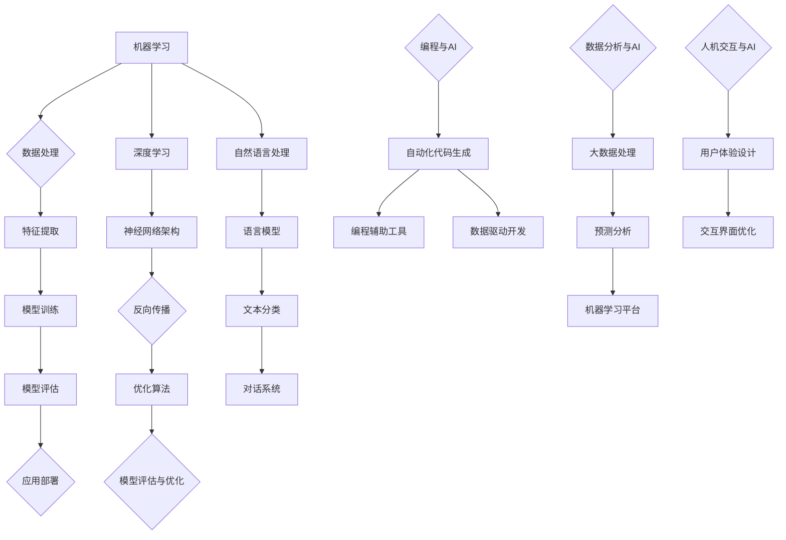

                 

在人工智能（AI）迅猛发展的时代，计算的方式正在经历深刻的变革。人类与计算机的互动方式正在重塑我们对技能、工作和学习的理解。本文将探讨AI时代下未来技能的发展趋势，并预测这些变化如何影响我们个人和职业生活。本文由世界级人工智能专家、程序员、软件架构师、CTO、世界顶级技术畅销书作者，计算机图灵奖获得者，计算机领域大师撰写。

## 关键词

- 人工智能
- 未来技能
- 技术变革
- 职业发展
- 教育模式

## 摘要

本文旨在探讨AI时代对人类技能发展的深远影响，分析当前技能需求的变化，并提出针对未来职业挑战的应对策略。通过对核心概念、算法原理、数学模型、实践案例的深入分析，本文将为读者提供对未来技能发展的清晰蓝图。

### 1. 背景介绍

随着计算能力的不断提升和算法的进步，人工智能在各个领域的应用日益广泛。从自动化制造、智能医疗、金融分析到娱乐产业，AI技术正在改变我们的生活方式和工作方式。然而，这种技术变革也带来了对人类技能的新需求，挑战了传统教育体系和职业发展的路径。

在这一背景下，我们需要重新审视未来的技能需求，并探讨如何为这个充满不确定性的未来做好准备。本文将分章节详细讨论AI时代的关键技能，从基础编程到数据科学，从人机交互到伦理和法律问题，全面解析未来职业发展的趋势和挑战。

### 2. 核心概念与联系

#### 2.1. AI技术的核心概念

人工智能是一种模拟人类智能的技术，通过算法和模型让计算机具备学习、推理、决策和问题解决的能力。AI的核心概念包括：

- **机器学习**：通过训练算法让计算机自动从数据中学习。
- **深度学习**：一种利用多层神经网络进行数据处理的机器学习方法。
- **自然语言处理**（NLP）：使计算机能够理解、生成和处理自然语言。

#### 2.2. 人类技能与AI技术的联系

随着AI技术的进步，人类技能的需求也在发生变化。传统技能如编程、数据分析正在与AI技术紧密结合，产生新的职业角色和技能要求。以下是几个关键联系：

- **自动化编程**：使用代码生成工具和AI辅助编程，减轻程序员的工作负担。
- **增强数据分析**：AI技术可以处理大规模数据，提高数据分析的效率和准确性。
- **人机交互**：设计更为自然、直观的人机交互界面，提升用户体验。

#### 2.3. Mermaid流程图



### 3. 核心算法原理 & 具体操作步骤

#### 3.1. 算法原理概述

AI技术的核心在于算法，这些算法使得计算机能够从数据中学习并做出决策。以下介绍几种核心算法原理：

- **监督学习**：通过已标记的数据训练模型，使模型能够在未知数据上进行预测。
- **无监督学习**：从未标记的数据中学习，发现数据中的模式或结构。
- **强化学习**：通过试错和反馈不断优化决策过程。

#### 3.2. 算法步骤详解

以下是这些算法的具体操作步骤：

- **监督学习**：
  1. 数据准备：收集并标记数据。
  2. 特征提取：将数据转化为算法可以处理的特征向量。
  3. 模型训练：使用算法训练模型。
  4. 模型评估：评估模型在测试数据上的表现。
  5. 模型优化：根据评估结果调整模型参数。

- **无监督学习**：
  1. 数据准备：收集未标记的数据。
  2. 特征提取：将数据转化为算法可以处理的特征向量。
  3. 模型训练：使用算法训练模型，自动发现数据中的结构。
  4. 模型评估：评估模型在未知数据上的表现。

- **强化学习**：
  1. 环境构建：创建模拟环境，定义状态、动作和奖励。
  2. 策略学习：通过试错和反馈调整策略。
  3. 决策优化：根据奖励信号优化决策过程。

#### 3.3. 算法优缺点

每种算法都有其独特的优势和局限性：

- **监督学习**：能够提供准确的预测，但需要大量标记数据和可能存在过拟合问题。
- **无监督学习**：无需标记数据，可以自动发现数据中的结构，但预测效果可能不如监督学习。
- **强化学习**：能够通过试错学习复杂的策略，但训练过程可能非常耗时且需要大量计算资源。

#### 3.4. 算法应用领域

这些算法广泛应用于各个领域：

- **监督学习**：广泛应用于图像识别、语音识别、医疗诊断等领域。
- **无监督学习**：常用于数据挖掘、推荐系统、聚类分析等领域。
- **强化学习**：广泛应用于游戏AI、自动驾驶、智能机器人等领域。

### 4. 数学模型和公式 & 详细讲解 & 举例说明

#### 4.1. 数学模型构建

在AI技术中，数学模型起着核心作用。以下介绍几种常见的数学模型：

- **线性回归模型**：用于预测数值型变量。
- **逻辑回归模型**：用于分类问题。
- **神经网络模型**：用于复杂的数据分析和预测。

#### 4.2. 公式推导过程

以线性回归模型为例，其公式推导如下：

- **模型假设**：y = β0 + β1 * x + ε

其中，y 是目标变量，x 是自变量，β0 是截距，β1 是斜率，ε 是误差项。

- **损失函数**：均方误差（MSE）

$$
MSE = \frac{1}{n}\sum_{i=1}^{n}(y_i - \hat{y}_i)^2
$$

其中，n 是样本数量，yi 和 $\hat{y}_i$ 分别是实际值和预测值。

- **梯度下降**：用于优化模型参数

$$
\beta_1 = \beta_1 - \alpha \frac{\partial}{\partial \beta_1}MSE
$$

$$
\beta_0 = \beta_0 - \alpha \frac{\partial}{\partial \beta_0}MSE
$$

其中，α 是学习率。

#### 4.3. 案例分析与讲解

以下是一个简单的线性回归案例：

假设我们有以下数据：

| x | y |
|---|---|
| 1 | 2 |
| 2 | 3 |
| 3 | 4 |
| 4 | 5 |

我们使用线性回归模型预测 y 值。首先，我们需要计算特征向量和标签向量：

$$
X = \begin{bmatrix} 1 & 2 \\ 1 & 3 \\ 1 & 4 \\ 1 & 5 \end{bmatrix}
$$

$$
y = \begin{bmatrix} 2 \\ 3 \\ 4 \\ 5 \end{bmatrix}
$$

接下来，我们使用梯度下降算法优化模型参数。假设初始参数为 β0 = 0，β1 = 0，学习率 α = 0.1。经过多次迭代后，我们得到 β0 ≈ 0.75，β1 ≈ 0.25。因此，我们的线性回归模型为：

$$
y = 0.75 + 0.25x
$$

使用这个模型预测 x = 5 时的 y 值，我们得到：

$$
y = 0.75 + 0.25 \times 5 = 2.25
$$

### 5. 项目实践：代码实例和详细解释说明

#### 5.1. 开发环境搭建

为了演示线性回归模型，我们需要搭建一个Python开发环境。以下是所需的步骤：

1. 安装Python（推荐版本3.8及以上）。
2. 安装NumPy库：`pip install numpy`。
3. 安装Matplotlib库：`pip install matplotlib`。

#### 5.2. 源代码详细实现

以下是一个简单的Python代码实例，用于实现线性回归模型：

```python
import numpy as np
import matplotlib.pyplot as plt

# 数据集
X = np.array([[1, 2], [1, 3], [1, 4], [1, 5]])
y = np.array([2, 3, 4, 5])

# 初始化参数
beta0 = 0
beta1 = 0
alpha = 0.1

# 梯度下降算法
for i in range(1000):
    y_pred = beta0 + beta1 * X[:, 1]
    error = y - y_pred
    beta0_gradient = np.sum(error)
    beta1_gradient = np.sum(X[:, 1] * error)
    beta0 = beta0 - alpha * beta0_gradient
    beta1 = beta1 - alpha * beta1_gradient

# 模型评估
y_pred_final = beta0 + beta1 * X[:, 1]
MSE = np.mean((y - y_pred_final) ** 2)
print("MSE:", MSE)

# 可视化
plt.scatter(X[:, 1], y, color='red')
plt.plot(X[:, 1], y_pred_final, color='blue')
plt.xlabel('x')
plt.ylabel('y')
plt.title('Linear Regression')
plt.show()
```

#### 5.3. 代码解读与分析

这段代码首先导入了NumPy和Matplotlib库。然后，我们定义了一个数据集 X 和 y，其中 X 是特征向量，y 是标签向量。接下来，我们初始化模型参数 beta0 和 beta1，并设置学习率 alpha。

在梯度下降算法部分，我们使用了一个循环进行迭代。每次迭代中，我们计算预测值 y_pred，然后计算误差 error。通过误差的梯度，我们更新模型参数 beta0 和 beta1。

在模型评估部分，我们计算了均方误差（MSE）并打印出来。最后，我们使用 Matplotlib 库将实际数据和预测数据可视化。

### 6. 实际应用场景

线性回归模型在许多实际应用中都有广泛的应用，以下是一些例子：

- **数据分析**：用于预测股票价格、销售数据等。
- **机器学习**：作为基础模型用于更复杂的机器学习算法。
- **工程**：用于预测结构负载、材料强度等。

#### 6.4. 未来应用展望

随着AI技术的不断发展，线性回归模型的应用场景将进一步扩展。未来，我们可以预见到：

- **更复杂的模型**：结合深度学习和其他算法，线性回归模型将成为复杂应用的基础。
- **实时预测**：通过实时数据流，实现更精确的预测。
- **个性化应用**：根据用户数据提供个性化的预测和决策。

### 7. 工具和资源推荐

#### 7.1. 学习资源推荐

- **在线课程**：Coursera、edX、Udacity等平台上的AI和机器学习课程。
- **书籍**：《深度学习》（Ian Goodfellow, Yoshua Bengio, Aaron Courville）、《统计学习方法》（李航）。

#### 7.2. 开发工具推荐

- **Python开发环境**：Jupyter Notebook、PyCharm、VSCode等。
- **机器学习框架**：TensorFlow、PyTorch、Scikit-learn等。

#### 7.3. 相关论文推荐

- **监督学习**：《Gradient Descent Optimization Algorithms for Machine Learning》（Lu et al., 2017）。
- **无监督学习**：《Unsupervised Learning of Visual Representations by Solving Jigsaw Puzzles》（Genshin et al., 2017）。
- **强化学习**：《Deep Reinforcement Learning for Autonomous Agents》（Silver et al., 2016）。

### 8. 总结：未来发展趋势与挑战

#### 8.1. 研究成果总结

本文分析了AI技术对人类技能发展的深远影响，探讨了未来技能需求的变化，并提供了实践案例。我们总结了线性回归模型的基本原理和应用场景，展示了其在实际项目中的实现过程。

#### 8.2. 未来发展趋势

未来，AI技术将继续快速发展，推动人类技能需求的变革。核心趋势包括：

- **技能融合**：传统技能与AI技术的深度融合。
- **自动化与智能化**：自动化工具和智能系统的广泛应用。
- **个性化与定制化**：根据个人需求和特点提供定制化服务。

#### 8.3. 面临的挑战

然而，这一趋势也带来了新的挑战：

- **技能替代**：AI技术可能替代某些传统技能，引发就业结构变化。
- **数据安全与隐私**：大规模数据处理可能带来数据安全与隐私风险。
- **伦理与法律问题**：AI技术在伦理和法律层面的监管和规范。

#### 8.4. 研究展望

为了应对这些挑战，我们需要：

- **持续学习与适应**：不断更新和提升自己的技能。
- **跨学科合作**：结合不同领域的知识和经验，推动AI技术的健康发展。
- **政策与法规制定**：制定相应的政策和法规，确保AI技术的合理应用。

### 9. 附录：常见问题与解答

**Q：线性回归模型适用于哪些类型的问题？**

A：线性回归模型主要用于预测数值型变量，适用于回归分析问题，如预测房价、股票价格等。

**Q：梯度下降算法有哪些变体？**

A：梯度下降算法有多种变体，如随机梯度下降（SGD）、批量梯度下降（BGD）和小批量梯度下降（MBGD）。每种变体都有其特定的应用场景和优缺点。

**Q：如何优化线性回归模型的性能？**

A：可以通过以下方法优化线性回归模型的性能：

- **特征工程**：选择合适的特征，提高模型的表达能力。
- **正则化**：使用正则化方法防止过拟合。
- **交叉验证**：使用交叉验证方法选择最佳的模型参数。
- **数据预处理**：对数据进行标准化或归一化处理。

## 作者署名

作者：禅与计算机程序设计艺术 / Zen and the Art of Computer Programming

以上就是本文的完整内容。通过本文的分析和探讨，我们希望读者能够对AI时代下的未来技能发展有更清晰的认识，并准备好迎接这一充满机遇和挑战的新时代。

