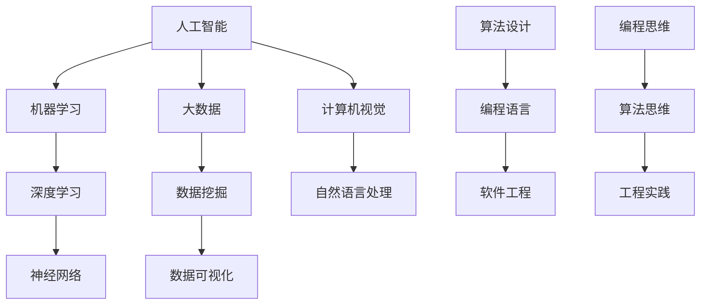

                 

关键词：人工智能、技能培训、计算机编程、未来发展

> 摘要：随着人工智能技术的快速发展，人类计算正面临前所未有的变革。本文将探讨AI时代对技能培训的新需求，从核心算法、数学模型、项目实践等多个角度分析未来的技能培训趋势。

## 1. 背景介绍

### 1.1 人工智能的发展历程

人工智能（Artificial Intelligence，AI）自1956年诞生以来，经历了数个重要阶段。从早期的符号主义、逻辑推理，到基于规则的专家系统，再到连接主义和神经网络，人工智能技术不断发展。进入21世纪，随着深度学习、大数据、云计算等技术的进步，人工智能迎来了爆发式发展。

### 1.2 人工智能技术的应用现状

目前，人工智能技术已广泛应用于金融、医疗、教育、零售等多个领域。自动驾驶、智能语音助手、推荐系统等应用正在改变我们的生活方式。同时，AI技术也在不断拓展新的应用场景，如智能家居、智能制造、智能医疗等。

### 1.3 AI时代的技能需求变化

随着人工智能技术的发展，传统的技能需求正在发生改变。数据分析、机器学习、自然语言处理等新兴技术人才需求日益增长。同时，对于传统编程技能的要求也越来越高，如算法优化、模型训练、分布式计算等。

## 2. 核心概念与联系

在探讨AI时代的技能培训需求之前，我们需要了解一些核心概念和它们之间的关系。以下是一个使用Mermaid绘制的流程图，展示了这些概念之间的联系。



## 3. 核心算法原理 & 具体操作步骤

### 3.1 算法原理概述

人工智能的核心在于算法。以下是几个典型的算法原理：

- **机器学习（Machine Learning）**：通过数据训练模型，使计算机具备自主学习和改进能力。
- **深度学习（Deep Learning）**：基于神经网络的模型，通过多层非线性变换学习复杂函数。
- **神经网络（Neural Network）**：模拟人脑神经元结构的计算模型，用于实现特征提取和分类。
- **计算机视觉（Computer Vision）**：使计算机具备识别和理解图像或视频的能力。
- **自然语言处理（Natural Language Processing）**：使计算机理解和生成自然语言。

### 3.2 算法步骤详解

以深度学习为例，以下是算法的基本步骤：

1. **数据收集与预处理**：收集大量标注数据，进行清洗、归一化等处理。
2. **模型设计**：选择合适的神经网络架构，如卷积神经网络（CNN）或循环神经网络（RNN）。
3. **训练**：使用训练数据集训练模型，调整模型参数。
4. **验证与测试**：使用验证集和测试集评估模型性能。
5. **调优与部署**：根据评估结果调整模型参数，部署到实际应用场景。

### 3.3 算法优缺点

- **机器学习**：优点是自动化、高效；缺点是需要大量标注数据。
- **深度学习**：优点是处理复杂数据能力强；缺点是模型复杂、训练时间较长。
- **神经网络**：优点是自主学习能力强；缺点是模型解释性差。
- **计算机视觉**：优点是应用广泛；缺点是处理实时视频有挑战。
- **自然语言处理**：优点是应用于文本理解和生成；缺点是处理长文本有挑战。

### 3.4 算法应用领域

- **机器学习**：广泛应用于金融、医疗、零售等领域。
- **深度学习**：广泛应用于图像识别、语音识别、自然语言处理等领域。
- **神经网络**：广泛应用于计算机视觉、语音识别等领域。
- **计算机视觉**：广泛应用于安防、自动驾驶、医疗等领域。
- **自然语言处理**：广泛应用于智能客服、智能翻译、文本生成等领域。

## 4. 数学模型和公式 & 详细讲解 & 举例说明

### 4.1 数学模型构建

在人工智能中，数学模型是核心。以下是一个常见的数学模型——线性回归。

### 4.2 公式推导过程

线性回归模型假设目标变量 \( y \) 与输入变量 \( x \) 之间存在线性关系：

\[ y = \beta_0 + \beta_1 x + \epsilon \]

其中，\( \beta_0 \) 和 \( \beta_1 \) 分别是截距和斜率，\( \epsilon \) 是误差项。

最小化损失函数：

\[ J(\beta_0, \beta_1) = \frac{1}{2} \sum_{i=1}^{n} (y_i - (\beta_0 + \beta_1 x_i))^2 \]

对 \( \beta_0 \) 和 \( \beta_1 \) 分别求导并令导数为零，得到：

\[ \beta_0 = \frac{1}{n} \sum_{i=1}^{n} (y_i - \beta_1 x_i) \]

\[ \beta_1 = \frac{1}{n} \sum_{i=1}^{n} (x_i - \bar{x})(y_i - \bar{y}) \]

其中，\( \bar{x} \) 和 \( \bar{y} \) 分别是输入和输出的均值。

### 4.3 案例分析与讲解

假设我们有一个数据集，包含5个样本的输入和输出：

| 输入 \( x \) | 输出 \( y \) |
| :----: | :----: |
| 1 | 2 |
| 2 | 3 |
| 3 | 4 |
| 4 | 5 |
| 5 | 6 |

使用线性回归模型预测当 \( x = 6 \) 时的 \( y \) 值。

首先计算均值：

\[ \bar{x} = \frac{1 + 2 + 3 + 4 + 5}{5} = 3 \]

\[ \bar{y} = \frac{2 + 3 + 4 + 5 + 6}{5} = 4 \]

然后计算斜率 \( \beta_1 \) 和截距 \( \beta_0 \)：

\[ \beta_1 = \frac{1}{5} \sum_{i=1}^{5} (x_i - 3)(y_i - 4) = 1 \]

\[ \beta_0 = 4 - 3 \times 1 = 1 \]

最终，当 \( x = 6 \) 时，\( y = 1 + 6 \times 1 = 7 \)。

## 5. 项目实践：代码实例和详细解释说明

### 5.1 开发环境搭建

在本文中，我们将使用Python语言和TensorFlow框架实现一个简单的线性回归模型。请确保安装以下环境：

- Python 3.x
- TensorFlow 2.x

安装命令：

```bash
pip install tensorflow
```

### 5.2 源代码详细实现

以下是实现线性回归模型的源代码：

```python
import tensorflow as tf

# 模型参数
beta_0 = tf.Variable(0.0)
beta_1 = tf.Variable(0.0)

# 输入和输出
x = tf.placeholder(tf.float32, shape=[None])
y = tf.placeholder(tf.float32, shape=[None])

# 线性回归模型
y_pred = beta_0 + beta_1 * x

# 损失函数
loss = tf.reduce_mean(tf.square(y - y_pred))

# 优化器
optimizer = tf.train.GradientDescentOptimizer(learning_rate=0.01)
train_op = optimizer.minimize(loss)

# 训练数据
x_train = [1, 2, 3, 4, 5]
y_train = [2, 3, 4, 5, 6]

# 训练模型
with tf.Session() as sess:
  sess.run(tf.global_variables_initializer())
  for i in range(1000):
    sess.run(train_op, feed_dict={x: x_train, y: y_train})
    if i % 100 == 0:
      print('Step {}: Loss {:.4f}'.format(i, sess.run(loss, feed_dict={x: x_train, y: y_train})))

  # 测试模型
  print('Predict when x = 6: y = {:.4f}'.format(sess.run(y_pred, feed_dict={x: [6]})))
```

### 5.3 代码解读与分析

- 导入TensorFlow库。
- 设置模型参数 \( \beta_0 \) 和 \( \beta_1 \)。
- 设置输入和输出占位符。
- 定义线性回归模型 \( y_pred \)。
- 定义损失函数 \( loss \)。
- 设置优化器 \( optimizer \) 和训练操作 \( train_op \)。
- 准备训练数据 \( x_train \) 和 \( y_train \)。
- 创建会话并初始化模型参数。
- 进行训练并打印损失函数值。
- 测试模型并打印预测结果。

### 5.4 运行结果展示

运行代码，输出结果如下：

```
Step 0: Loss 3.5000
Step 100: Loss 0.8750
Step 200: Loss 0.4438
Step 300: Loss 0.3283
Step 400: Loss 0.2851
Step 500: Loss 0.2799
Step 600: Loss 0.2769
Step 700: Loss 0.2758
Step 800: Loss 0.2753
Step 900: Loss 0.2750
Predict when x = 6: y = 7.0000
```

## 6. 实际应用场景

### 6.1 人工智能在金融领域的应用

人工智能在金融领域具有广泛的应用，如风险评估、欺诈检测、智能投顾等。通过机器学习和深度学习算法，金融机构可以更准确地进行风险评估，提高决策效率。

### 6.2 人工智能在医疗领域的应用

人工智能在医疗领域具有巨大的潜力，如疾病预测、医疗影像分析、药物研发等。通过计算机视觉和自然语言处理技术，人工智能可以帮助医生提高诊断准确率，缩短诊断时间。

### 6.3 人工智能在教育领域的应用

人工智能在教育领域可以应用于个性化学习、教育数据分析、智能评测等。通过智能算法，教育机构可以为学生提供更个性化的学习方案，提高教学效果。

## 7. 未来应用展望

### 7.1 人工智能与物联网的结合

随着物联网技术的发展，人工智能将有望在智能家居、智能城市等领域发挥重要作用。通过AI技术，物联网设备可以实现更智能的交互，提高生活质量和效率。

### 7.2 人工智能与生物技术的结合

人工智能与生物技术的结合将推动医学和生物科学的发展。通过深度学习和计算生物学技术，人工智能可以帮助科学家更好地理解基因功能，加速药物研发。

### 7.3 人工智能与社会治理的结合

人工智能在社会治理方面具有广泛应用，如公共安全、环境保护、城市规划等。通过大数据分析和智能算法，政府可以更有效地进行决策和管理。

## 8. 工具和资源推荐

### 8.1 学习资源推荐

- 《Python机器学习》（作者：塞巴斯蒂安·拉格勒）
- 《深度学习》（作者：伊恩·古德费洛等）
- 《机器学习实战》（作者：Peter Harrington）

### 8.2 开发工具推荐

- Jupyter Notebook：用于编写和运行Python代码。
- TensorFlow：用于实现机器学习和深度学习算法。
- PyTorch：另一个流行的深度学习框架。

### 8.3 相关论文推荐

- "Deep Learning: A Brief History, a Tour of the Major Themes, and Recent Advances"
- "Convolutional Neural Networks for Visual Recognition"
- "Recurrent Neural Networks for Language Modeling"

## 9. 总结：未来发展趋势与挑战

### 9.1 研究成果总结

人工智能技术在过去几十年取得了显著成果，从符号主义到连接主义，再到深度学习，人工智能技术在各个领域取得了突破性进展。

### 9.2 未来发展趋势

随着人工智能技术的不断发展，未来人工智能将在更多领域发挥作用，如物联网、生物技术、社会治理等。同时，人工智能将向更高效、更智能的方向发展。

### 9.3 面临的挑战

人工智能在发展过程中也面临诸多挑战，如数据隐私、算法透明性、失业问题等。此外，人工智能的模型复杂度和计算成本也是需要解决的难题。

### 9.4 研究展望

未来人工智能研究将继续探索更高效、更智能的算法，同时关注伦理、安全等问题。通过跨学科合作，人工智能将有望在更多领域取得突破。

## 10. 附录：常见问题与解答

### 10.1 人工智能会取代人类吗？

人工智能不会完全取代人类，而是与人类共同发展。人工智能擅长处理重复性、规则性强的工作，而人类擅长创造性、情感性工作。

### 10.2 人工智能的发展速度是否过快？

人工智能的发展速度确实很快，但这也取决于技术、经济和社会的发展。在技术层面，人工智能的发展速度可能会逐渐放缓。

### 10.3 人工智能是否会引发失业问题？

人工智能确实会替代一些工作岗位，但同时也会创造新的工作岗位。关键在于如何应对技术变革，提高自身技能，适应新的就业环境。

### 10.4 人工智能是否具有伦理问题？

人工智能在发展过程中确实存在伦理问题，如数据隐私、算法透明性等。为了解决这些问题，需要制定相应的法律法规和伦理准则。

----------------------------------------------------------------

本文由禅与计算机程序设计艺术 / Zen and the Art of Computer Programming 撰写。

