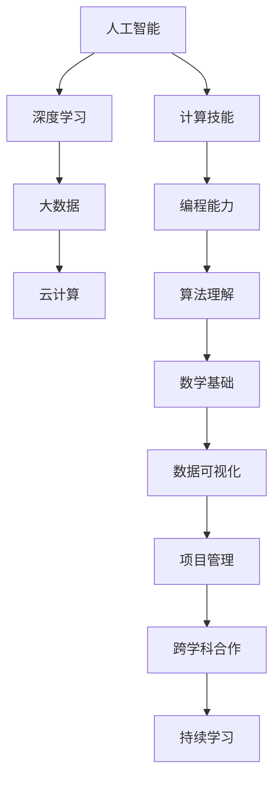

                 

关键词：人工智能，技能要求，培训，职业发展，未来趋势

> 摘要：随着人工智能技术的快速发展，人类计算领域正面临着前所未有的变革。本文将探讨AI时代对人类技能的新要求，以及如何通过培训来适应这一变革。通过分析AI时代的核心概念、算法原理、数学模型、实际应用以及未来展望，本文旨在为读者提供一个全面了解AI时代技能要求的指南。

## 1. 背景介绍

随着深度学习、大数据、云计算等技术的飞速发展，人工智能（AI）已经成为当今科技领域的热点。AI技术不仅在科研、工业、医疗、金融等领域取得了显著成果，同时也改变了人类的工作方式和生活习惯。然而，AI的快速发展也给人类计算领域带来了新的挑战。传统的计算技能已经无法满足AI时代的需求，人们需要掌握新的技能和知识，以适应这一变化。

AI时代的到来，不仅对计算技术提出了更高的要求，也对人类的职业发展产生了深远影响。许多传统职业正被自动化和智能化所取代，同时新的职业机会也在不断涌现。为了在AI时代获得竞争优势，人们必须不断学习和提升自己的技能。

## 2. 核心概念与联系

在探讨AI时代的技能要求之前，我们需要了解一些核心概念和它们之间的联系。

### 2.1 人工智能（AI）

人工智能是指计算机系统模拟人类智能行为的能力。AI可以分为弱AI和强AI。弱AI专注于特定任务，如语音识别、图像识别等，而强AI则具有广泛的认知能力，可以像人类一样思考和学习。

### 2.2 深度学习（Deep Learning）

深度学习是一种基于多层神经网络的学习方法，通过模拟人脑神经网络的结构和功能，实现自动特征提取和分类。深度学习在图像识别、语音识别、自然语言处理等领域取得了显著成果。

### 2.3 大数据（Big Data）

大数据是指海量、多样、高速生成和变化的数据。大数据技术包括数据采集、存储、处理、分析和可视化。大数据技术为AI提供了丰富的数据资源，推动了AI技术的发展。

### 2.4 云计算（Cloud Computing）

云计算是一种通过互联网提供计算资源的服务模式。云计算为AI提供了强大的计算能力，使得大规模数据处理和模型训练成为可能。

### 2.5 Mermaid 流程图

以下是AI时代技能要求的核心概念和架构的 Mermaid 流程图：



## 3. 核心算法原理 & 具体操作步骤

### 3.1 算法原理概述

在AI时代，算法原理是理解和应用AI技术的基础。以下是一些核心算法原理：

### 3.2 算法步骤详解

#### 3.2.1 深度学习算法

深度学习算法主要包括前向传播和反向传播两个步骤：

1. **前向传播**：输入数据通过神经网络传递，得到预测结果。
2. **反向传播**：计算预测结果与实际结果之间的误差，并更新网络参数。

#### 3.2.2 大数据分析算法

大数据分析算法主要包括数据预处理、特征提取和模型训练三个步骤：

1. **数据预处理**：清洗、转换和归一化数据。
2. **特征提取**：提取有助于模型训练的特征。
3. **模型训练**：使用机器学习算法对数据进行分析。

#### 3.2.3 云计算算法

云计算算法主要包括资源调度、负载均衡和弹性伸缩三个步骤：

1. **资源调度**：合理分配计算资源。
2. **负载均衡**：平衡系统负载，提高性能。
3. **弹性伸缩**：根据需求动态调整资源。

### 3.3 算法优缺点

#### 3.3.1 深度学习算法

**优点**：
- 自动特征提取，降低人工干预。
- 在图像识别、语音识别等领域取得了显著成果。

**缺点**：
- 计算成本高，训练时间长。
- 对数据量有较高要求。

#### 3.3.2 大数据分析算法

**优点**：
- 能处理海量数据。
- 提供丰富的分析结果。

**缺点**：
- 数据质量影响分析效果。
- 需要专业知识和技能。

#### 3.3.3 云计算算法

**优点**：
- 提供强大的计算能力。
- 提高资源利用率。

**缺点**：
- 需要投入大量资金。
- 存在数据安全和隐私问题。

### 3.4 算法应用领域

#### 3.4.1 图像识别

深度学习算法在图像识别领域取得了显著成果，如图像分类、目标检测、人脸识别等。

#### 3.4.2 自然语言处理

大数据分析算法在自然语言处理领域得到了广泛应用，如文本分类、情感分析、机器翻译等。

#### 3.4.3 智能推荐

云计算算法在智能推荐系统中发挥了重要作用，如电商推荐、新闻推荐等。

## 4. 数学模型和公式 & 详细讲解 & 举例说明

### 4.1 数学模型构建

在AI时代，数学模型是理解和应用AI技术的重要工具。以下是一些常见的数学模型：

#### 4.1.1 神经网络

神经网络是一种模拟人脑结构的计算模型。其基本结构包括输入层、隐藏层和输出层。

#### 4.1.2 机器学习模型

机器学习模型包括线性回归、逻辑回归、支持向量机等。这些模型用于分类、回归等任务。

#### 4.1.3 数据分析模型

数据分析模型包括聚类、关联规则挖掘等。这些模型用于数据分析和可视化。

### 4.2 公式推导过程

以下是一个简单的神经网络模型公式推导：

$$
\begin{aligned}
\text{输出} &= \text{激活函数}(\text{加权求和}) \\
\text{加权求和} &= \sum_{i=1}^{n} w_i \cdot x_i \\
x_i &= \text{输入} \\
w_i &= \text{权重} \\
n &= \text{输入数} \\
\text{激活函数} &= \text{ReLU, Sigmoid, Tanh} \\
\end{aligned}
$$

### 4.3 案例分析与讲解

以下是一个简单的神经网络模型训练过程：

#### 4.3.1 数据准备

假设我们有一个包含100个样本的图像数据集，每个样本是一个28x28的灰度图像。

#### 4.3.2 模型搭建

我们使用一个包含一个输入层、两个隐藏层和一个输出层的神经网络。输入层有28x28=784个神经元，隐藏层有128个神经元，输出层有10个神经元（对应10个数字分类）。

#### 4.3.3 训练过程

1. **前向传播**：输入一个样本，通过神经网络传递，得到预测结果。
2. **反向传播**：计算预测结果与实际结果之间的误差，并更新网络参数。
3. **迭代**：重复前向传播和反向传播，直到网络收敛。

## 5. 项目实践：代码实例和详细解释说明

### 5.1 开发环境搭建

为了进行AI项目实践，我们需要搭建一个合适的开发环境。以下是一个简单的Python开发环境搭建步骤：

1. 安装Python（版本3.7或以上）。
2. 安装PyTorch深度学习框架。
3. 安装Jupyter Notebook（可选）。

### 5.2 源代码详细实现

以下是一个简单的神经网络模型实现代码：

```python
import torch
import torch.nn as nn
import torch.optim as optim

# 定义神经网络模型
class NeuralNetwork(nn.Module):
    def __init__(self):
        super(NeuralNetwork, self).__init__()
        self.layer1 = nn.Linear(784, 128)
        self.layer2 = nn.Linear(128, 128)
        self.layer3 = nn.Linear(128, 10)
        self.relu = nn.ReLU()

    def forward(self, x):
        x = self.relu(self.layer1(x))
        x = self.relu(self.layer2(x))
        x = self.layer3(x)
        return x

# 创建神经网络实例
model = NeuralNetwork()

# 定义损失函数和优化器
criterion = nn.CrossEntropyLoss()
optimizer = optim.Adam(model.parameters(), lr=0.001)

# 加载数据集
train_loader = torch.utils.data.DataLoader(dataset=train_dataset, batch_size=64, shuffle=True)

# 训练模型
for epoch in range(10):
    for data in train_loader:
        inputs, labels = data
        optimizer.zero_grad()
        outputs = model(inputs)
        loss = criterion(outputs, labels)
        loss.backward()
        optimizer.step()
```

### 5.3 代码解读与分析

1. **模型定义**：使用PyTorch定义了一个简单的神经网络模型，包括一个输入层、两个隐藏层和一个输出层。
2. **前向传播**：输入数据通过神经网络传递，得到预测结果。
3. **反向传播**：计算预测结果与实际结果之间的误差，并更新网络参数。
4. **训练过程**：使用训练集进行模型训练，通过迭代优化网络参数。

### 5.4 运行结果展示

在训练完成后，我们可以使用测试集来评估模型性能。以下是一个简单的评估代码：

```python
# 评估模型
with torch.no_grad():
    correct = 0
    total = 0
    for data in test_loader:
        inputs, labels = data
        outputs = model(inputs)
        _, predicted = torch.max(outputs.data, 1)
        total += labels.size(0)
        correct += (predicted == labels).sum().item()

print('准确率：%.2f%%' % (100 * correct / total))
```

## 6. 实际应用场景

### 6.1 医疗

人工智能在医疗领域具有广泛应用，如疾病预测、诊断辅助、手术规划等。通过深度学习和大数据技术，人工智能可以分析海量医疗数据，提高医疗质量和效率。

### 6.2 金融

人工智能在金融领域主要用于风险管理、欺诈检测、投资顾问等。通过大数据分析和机器学习算法，人工智能可以识别潜在风险，提高金融行业的运营效率。

### 6.3 教育

人工智能在教育领域可以提供个性化学习方案、智能评测、教学辅助等。通过自然语言处理和计算机视觉技术，人工智能可以帮助教师更好地理解学生的学习状况，提供针对性的教学建议。

## 7. 未来应用展望

随着人工智能技术的不断发展，未来应用场景将更加广泛。以下是一些可能的未来应用：

### 7.1 智能制造

人工智能将推动智能制造的发展，实现生产过程的自动化和智能化。通过深度学习和物联网技术，人工智能可以优化生产流程，提高生产效率和产品质量。

### 7.2 自动驾驶

自动驾驶技术是人工智能的重要应用领域。随着深度学习和计算机视觉技术的进步，自动驾驶汽车有望在未来实现大规模商用。

### 7.3 机器人

人工智能将推动机器人技术的发展，实现更加智能化的机器人。通过机器学习和自然语言处理技术，机器人可以更好地理解人类指令，提供更高质量的服务。

## 8. 工具和资源推荐

### 8.1 学习资源推荐

1. **《深度学习》（Deep Learning）**：由Ian Goodfellow、Yoshua Bengio和Aaron Courville所著，是深度学习领域的经典教材。
2. **《Python编程：从入门到实践》（Python Crash Course）**：由Eric Matthes所著，适合初学者学习Python编程。

### 8.2 开发工具推荐

1. **PyTorch**：一款流行的深度学习框架，具有易用性和灵活性。
2. **TensorFlow**：由Google开发的一款深度学习框架，具有丰富的资源和社区支持。

### 8.3 相关论文推荐

1. **"Deep Learning for Computer Vision"**：介绍深度学习在计算机视觉领域的应用。
2. **"Big Data: A Revolution That Will Transform How We Live, Work, and Think"**：讨论大数据对社会和经济的影响。

## 9. 总结：未来发展趋势与挑战

随着人工智能技术的不断发展，人类计算领域将面临以下发展趋势和挑战：

### 9.1 发展趋势

1. **算法优化**：通过算法优化，提高AI模型的性能和效率。
2. **跨学科融合**：人工智能与其他领域的融合，如生物医学、经济学等。
3. **个性化服务**：基于大数据和深度学习，提供更加个性化的服务。

### 9.2 挑战

1. **数据安全和隐私**：随着数据量的增加，数据安全和隐私问题日益突出。
2. **算法透明度和可解释性**：提高算法的透明度和可解释性，以增强公众对AI技术的信任。
3. **伦理和道德**：人工智能技术的发展引发了一系列伦理和道德问题，如就业影响、决策公正性等。

### 9.3 研究展望

未来，人工智能技术将在更多领域得到应用，推动社会的发展和进步。同时，我们也需要关注人工智能技术的伦理和道德问题，确保其在合理、安全和可控的范围内发展。

## 附录：常见问题与解答

### Q：人工智能是否会取代人类？

A：人工智能是一种工具，它可以帮助人类提高工作效率，但不会完全取代人类。在AI时代，人类的创造力、情感和道德观念等仍然具有不可替代的价值。

### Q：如何学习人工智能？

A：学习人工智能需要具备一定的数学和编程基础。可以通过阅读相关书籍、参加线上课程和实际项目实践来提高自己的技能。

### Q：人工智能是否会带来失业问题？

A：人工智能可能会取代一些简单、重复性的工作，但也会创造新的就业机会。为了适应这一变化，人们需要不断学习和提升自己的技能。

## 作者署名

作者：禅与计算机程序设计艺术 / Zen and the Art of Computer Programming

本文从人工智能时代的发展背景出发，探讨了AI时代对人类计算技能的新要求，以及如何通过培训来适应这一变革。通过对核心算法原理、数学模型、实际应用以及未来展望的深入分析，本文为读者提供了一个全面了解AI时代技能要求的指南。希望本文能为广大读者在AI时代的职业发展提供有益的启示。

