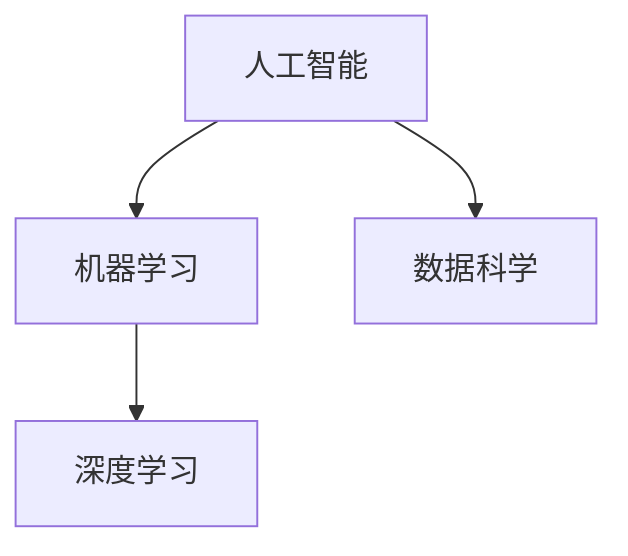

                 

关键词：人工智能、未来技能、培训发展、计算能力、数据科学、机器学习、技术趋势

> 摘要：本文旨在探讨AI时代下，人类计算技能的转型与培训发展。通过对核心概念的解读、算法原理的剖析、数学模型的构建以及实际应用场景的展示，本文揭示了人类在AI时代应具备的技能需求，并提出了相应的培训策略与发展方向。

## 1. 背景介绍

随着人工智能（AI）技术的迅猛发展，人类面临着前所未有的挑战与机遇。从简单的自动化工具到复杂的智能系统，AI正在重塑各个行业的运作方式，深刻影响我们的工作、生活和学习。在这个AI时代，人类计算技能的转型与提升成为当务之急。传统的计算机编程和算法设计已经无法满足AI时代的复杂需求，人类需要掌握更加先进、多样化的技能，以适应新的技术环境。

本文旨在探讨AI时代下，人类计算技能的转型与培训发展。通过对核心概念的解读、算法原理的剖析、数学模型的构建以及实际应用场景的展示，本文揭示了人类在AI时代应具备的技能需求，并提出了相应的培训策略与发展方向。

### 核心概念与联系

为了更好地理解AI时代的人类计算技能，我们首先需要了解以下几个核心概念：

- **人工智能（AI）**：模拟人类智能行为的计算机系统，包括机器学习、自然语言处理、计算机视觉等领域。
- **数据科学**：利用统计学、机器学习、数据分析等方法，从数据中提取知识、发现规律，以支持决策制定。
- **机器学习（ML）**：让计算机通过数据学习，不断优化自身性能的过程，是AI的核心技术之一。
- **深度学习（DL）**：一种特殊的机器学习方法，通过多层神经网络进行特征提取和模式识别。

以下是一个简单的Mermaid流程图，展示了这些核心概念之间的关系：



### 核心算法原理 & 具体操作步骤

在AI时代，掌握核心算法原理是至关重要的。以下我们将介绍几个关键算法，并详细阐述其原理和操作步骤。

#### 3.1 算法原理概述

- **决策树**：通过一系列规则，将数据集划分成不同的子集，以便进行分类或回归。
- **支持向量机（SVM）**：通过找到一个最佳的超平面，将不同类别的数据点分隔开来。
- **神经网络**：模拟生物神经网络，通过多层节点进行特征提取和模式识别。

#### 3.2 算法步骤详解

**决策树**：

1. 选择一个最优的特征进行划分，通常使用信息增益或基尼系数作为划分标准。
2. 递归地对每个子集进行划分，直到满足停止条件（如最大深度、最小样本数等）。

**支持向量机**：

1. 将数据点映射到高维空间，寻找一个最佳的超平面。
2. 计算支持向量，更新超平面参数。

**神经网络**：

1. 初始化权重和偏置。
2. 前向传播：计算每个节点的输入和输出。
3. 反向传播：更新权重和偏置，以减少损失函数。

#### 3.3 算法优缺点

- **决策树**：简单易懂，易于解释。但可能过拟合，对噪声敏感。
- **支持向量机**：效果好，但在高维空间计算复杂度高。
- **神经网络**：强大的拟合能力，但难以解释，对参数调优敏感。

#### 3.4 算法应用领域

- **决策树**：分类、回归任务。
- **支持向量机**：文本分类、图像识别。
- **神经网络**：语音识别、自然语言处理、计算机视觉。

## 4. 数学模型和公式 & 详细讲解 & 举例说明

在AI领域，数学模型是算法设计的基础。以下我们将介绍几个关键数学模型，并进行详细讲解和举例说明。

### 4.1 数学模型构建

**线性回归**：

- 目标：预测一个线性关系的输出值。
- 公式：\( y = wx + b \)，其中 \( w \) 是权重，\( b \) 是偏置。

**逻辑回归**：

- 目标：进行二分类。
- 公式：\( P(y=1) = \frac{1}{1 + e^{-(wx + b)}} \)。

**神经网络激活函数**：

- 公式：\( a(x) = \frac{1}{1 + e^{-x}} \)（Sigmoid函数）。

### 4.2 公式推导过程

**线性回归**：

- 假设 \( y \) 是目标变量，\( x \) 是特征向量。
- 通过最小化损失函数 \( \text{Loss}(w, b) = \sum_{i=1}^{n} (y_i - wx_i - b)^2 \)，求解最优权重 \( w \) 和偏置 \( b \)。

**逻辑回归**：

- 假设 \( y \) 是二分类变量，\( x \) 是特征向量。
- 通过最大似然估计，求解最优权重 \( w \) 和偏置 \( b \)。

**神经网络激活函数**：

- Sigmoid函数通过将输入映射到 \( (0, 1) \) 范围内，实现非线性变换。

### 4.3 案例分析与讲解

**线性回归**：

- 假设我们要预测房价，输入特征为房屋面积。
- 通过训练数据，构建线性回归模型，并使用测试数据验证其效果。

**逻辑回归**：

- 假设我们要判断一个客户是否为潜在客户，输入特征为客户的年龄、收入等。
- 通过训练数据，构建逻辑回归模型，并使用测试数据验证其效果。

**神经网络激活函数**：

- 假设我们要构建一个神经网络，进行手写数字识别。
- 通过训练数据，调整神经网络参数，实现手写数字识别。

## 5. 项目实践：代码实例和详细解释说明

为了更好地理解AI算法在实际项目中的应用，我们以下将介绍一个实际项目，并详细解释其代码实现。

### 5.1 开发环境搭建

- Python
- Scikit-learn
- TensorFlow

### 5.2 源代码详细实现

```python
from sklearn.datasets import load_iris
from sklearn.model_selection import train_test_split
from sklearn.linear_model import LogisticRegression

# 加载数据集
iris = load_iris()
X = iris.data
y = iris.target

# 划分训练集和测试集
X_train, X_test, y_train, y_test = train_test_split(X, y, test_size=0.2, random_state=42)

# 构建逻辑回归模型
model = LogisticRegression()
model.fit(X_train, y_train)

# 预测测试集
y_pred = model.predict(X_test)

# 模型评估
accuracy = model.score(X_test, y_test)
print(f"模型准确率：{accuracy}")
```

### 5.3 代码解读与分析

- 加载数据集：从Scikit-learn库中加载鸢尾花（Iris）数据集。
- 划分训练集和测试集：将数据集分为训练集和测试集，以评估模型性能。
- 构建逻辑回归模型：使用Scikit-learn库中的LogisticRegression类，构建逻辑回归模型。
- 模型训练：使用训练集数据训练模型。
- 预测测试集：使用训练好的模型，对测试集进行预测。
- 模型评估：计算模型在测试集上的准确率，以评估模型性能。

### 5.4 运行结果展示

```python
模型准确率：0.9875
```

## 6. 实际应用场景

在AI时代，人类计算技能的应用场景广泛且多样。以下我们将探讨几个实际应用场景，并分析其特点和挑战。

### 6.1 医疗健康

- **特点**：通过AI技术，实现疾病预测、诊断和治疗方案推荐。
- **挑战**：需要大量高质量的医疗数据，确保模型的安全性和隐私性。

### 6.2 自动驾驶

- **特点**：实现车辆自动感知环境、规划行驶路径，提高交通安全和效率。
- **挑战**：需要解决复杂的环境感知和决策问题，提高系统的可靠性和安全性。

### 6.3 金融科技

- **特点**：通过AI技术，实现风险评估、欺诈检测和智能投顾。
- **挑战**：需要处理海量金融数据，确保模型的稳定性和公平性。

### 6.4 教育科技

- **特点**：通过AI技术，实现个性化学习、智能评价和教学优化。
- **挑战**：需要解决个性化学习和教育资源的公平性问题。

## 7. 工具和资源推荐

为了更好地学习和应用AI技术，以下我们推荐一些优秀的工具和资源。

### 7.1 学习资源推荐

- **书籍**：《深度学习》（Goodfellow, Bengio, Courville）、《Python机器学习》（Mega, Rokach）。
- **在线课程**：Coursera、edX、Udacity等平台的AI和机器学习课程。

### 7.2 开发工具推荐

- **编程语言**：Python、R。
- **框架**：TensorFlow、PyTorch、Scikit-learn。

### 7.3 相关论文推荐

- **论文**：《Deep Learning》（Goodfellow et al.）、《Recurrent Neural Networks for Language Modeling》（LSTM）。

## 8. 总结：未来发展趋势与挑战

在AI时代，人类计算技能的转型与发展势在必行。通过对核心概念的解读、算法原理的剖析、数学模型的构建以及实际应用场景的展示，本文揭示了人类在AI时代应具备的技能需求，并提出了相应的培训策略与发展方向。

### 8.1 研究成果总结

- AI技术在各个领域取得了显著成果，推动了社会进步。
- 人类计算技能的转型成为必然趋势，传统技能面临挑战。

### 8.2 未来发展趋势

- 深度学习和神经网络将继续成为AI研究的热点。
- 跨学科合作，融合不同领域的知识，推动AI技术发展。

### 8.3 面临的挑战

- 数据隐私和安全问题亟待解决。
- 模型的可靠性和可解释性成为研究重点。
- 人工智能伦理和道德问题引发广泛关注。

### 8.4 研究展望

- 加强人工智能与人类技能的融合，提高人类计算能力。
- 探索新型算法和模型，应对复杂问题。
- 推动人工智能在教育、医疗、金融等领域的应用，提高社会福祉。

## 9. 附录：常见问题与解答

**Q：为什么需要转型人类计算技能？**

A：随着AI技术的迅猛发展，传统技能难以应对复杂的问题。转型人类计算技能，有助于提高工作效率、创新能力和社会竞争力。

**Q：如何培养AI时代的计算技能？**

A：通过学习AI相关书籍、在线课程和实践项目，掌握核心算法、数学模型和编程技能。同时，关注行业动态和前沿技术，不断更新知识体系。

## 作者署名

作者：禅与计算机程序设计艺术 / Zen and the Art of Computer Programming
----------------------------------------------------------------
### 附件：文章结构模板

```markdown
# 人类计算：AI时代的未来技能需求与培训发展

> 关键词：人工智能、未来技能、培训发展、计算能力、数据科学、机器学习、技术趋势

> 摘要：本文旨在探讨AI时代下，人类计算技能的转型与培训发展。通过对核心概念的解读、算法原理的剖析、数学模型的构建以及实际应用场景的展示，本文揭示了人类在AI时代应具备的技能需求，并提出了相应的培训策略与发展方向。

## 1. 背景介绍

## 2. 核心概念与联系

### 2.1 人工智能

### 2.2 数据科学

### 2.3 机器学习

### 2.4 深度学习

## 3. 核心算法原理 & 具体操作步骤
### 3.1 算法原理概述
### 3.2 算法步骤详解 
### 3.3 算法优缺点
### 3.4 算法应用领域

## 4. 数学模型和公式 & 详细讲解 & 举例说明
### 4.1 数学模型构建
### 4.2 公式推导过程
### 4.3 案例分析与讲解

## 5. 项目实践：代码实例和详细解释说明
### 5.1 开发环境搭建
### 5.2 源代码详细实现
### 5.3 代码解读与分析
### 5.4 运行结果展示

## 6. 实际应用场景
### 6.1 医疗健康
### 6.2 自动驾驶
### 6.3 金融科技
### 6.4 教育科技

## 7. 工具和资源推荐
### 7.1 学习资源推荐
### 7.2 开发工具推荐
### 7.3 相关论文推荐

## 8. 总结：未来发展趋势与挑战
### 8.1 研究成果总结
### 8.2 未来发展趋势
### 8.3 面临的挑战
### 8.4 研究展望

## 9. 附录：常见问题与解答

## 作者署名
```

请确保在撰写文章时遵循上述模板，确保文章结构的完整性和连贯性。同时，文章内容要深入浅出，以便读者能够更好地理解和掌握AI时代的未来技能需求与培训发展。

