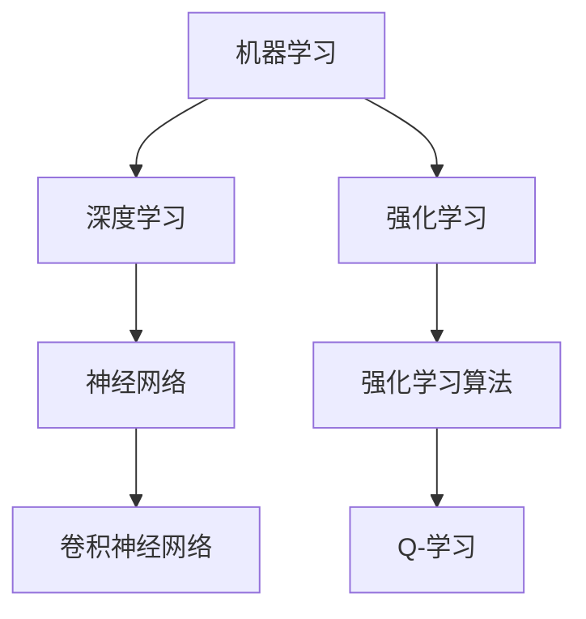

                 

 在人工智能（AI）迅猛发展的时代，我们不仅面临着技术上的突破，更面临着深刻的伦理和社会挑战。本文旨在探讨AI在各个领域的应用及其带来的道德和社会影响，为我们在这一新时代中寻找平衡提供一些思考。

## 关键词

- 人工智能
- 道德伦理
- 社会责任
- 技术监管
- 未来发展

## 摘要

本文首先介绍了人工智能的背景和发展现状，随后深入探讨了AI在医疗、交通、教育等领域的应用，分析了这些应用带来的道德问题和社会挑战。通过具体的案例分析，文章提出了可能的解决方案，并展望了未来AI发展的趋势和面临的挑战。

### 1. 背景介绍

#### 1.1 人工智能的定义与历史

人工智能（Artificial Intelligence，简称AI）是指由人创造出来的系统，能够模拟、延伸或扩展人的智能活动。自1950年艾伦·图灵提出图灵测试以来，AI经历了数个发展阶段。从早期的符号主义、连接主义到当前的主流方法——深度学习，AI技术不断进步，应用领域也越来越广泛。

#### 1.2 人工智能的发展现状

近年来，随着计算能力的提升、大数据的积累和算法的优化，人工智能取得了显著进展。在图像识别、自然语言处理、自动驾驶等领域，AI已经展现出超越人类的能力。同时，AI的应用也正在从实验室走向实际生活，成为推动社会进步的重要力量。

### 2. 核心概念与联系

#### 2.1 AI技术的核心概念

- **机器学习（Machine Learning）**：通过数据训练模型，使机器具备学习能力的分支。
- **深度学习（Deep Learning）**：基于人工神经网络的一种机器学习技术。
- **强化学习（Reinforcement Learning）**：通过奖励机制训练智能体，使其在特定环境中做出最佳决策。

#### 2.2 AI技术架构的Mermaid流程图



### 3. 核心算法原理 & 具体操作步骤

#### 3.1 算法原理概述

深度学习是一种模拟人脑神经网络结构的算法，通过层层神经网络对数据进行特征提取和分类。其核心思想是利用大规模数据训练模型，使得模型能够在未见过的数据上做出准确预测。

#### 3.2 算法步骤详解

1. **数据预处理**：对收集到的数据进行分析和处理，使其适合训练模型。
2. **模型设计**：设计合适的神经网络结构，包括输入层、隐藏层和输出层。
3. **模型训练**：使用预处理后的数据对模型进行训练，不断调整模型参数，使其达到预期性能。
4. **模型评估**：使用验证集评估模型性能，调整模型参数，提高模型准确率。
5. **模型部署**：将训练好的模型部署到实际应用场景中。

#### 3.3 算法优缺点

- **优点**：能够处理大量数据，发现数据中的复杂模式，适应性强。
- **缺点**：对数据质量和数量要求较高，训练过程复杂，模型解释性差。

#### 3.4 算法应用领域

深度学习在图像识别、自然语言处理、语音识别、自动驾驶等领域有广泛应用，取得了显著成果。

### 4. 数学模型和公式 & 详细讲解 & 举例说明

#### 4.1 数学模型构建

神经网络的基本数学模型包括：

- **激活函数**：用于引入非线性，如ReLU函数。
- **损失函数**：用于衡量模型预测值与真实值之间的差距，如交叉熵损失函数。

#### 4.2 公式推导过程

以神经网络中的反向传播算法为例，其核心公式为：

$$ \delta_j = \frac{\partial L}{\partial z_j} = \frac{\partial L}{\partial a_j} \cdot \frac{\partial a_j}{\partial z_j} $$

其中，$L$ 是损失函数，$z_j$ 是神经元输出，$a_j$ 是神经元激活值。

#### 4.3 案例分析与讲解

以图像分类任务为例，使用深度学习模型进行训练和预测的具体步骤如下：

1. **数据集准备**：收集和整理大量图像数据，分为训练集和验证集。
2. **模型训练**：使用训练集数据训练模型，调整模型参数，优化模型性能。
3. **模型评估**：使用验证集评估模型性能，调整模型参数，提高模型准确率。
4. **模型部署**：将训练好的模型部署到实际应用场景中。

### 5. 项目实践：代码实例和详细解释说明

#### 5.1 开发环境搭建

在Python环境中使用TensorFlow框架进行深度学习项目开发。

#### 5.2 源代码详细实现

```python
import tensorflow as tf

# 定义神经网络结构
model = tf.keras.Sequential([
    tf.keras.layers.Flatten(input_shape=(28, 28)),
    tf.keras.layers.Dense(128, activation='relu'),
    tf.keras.layers.Dense(10, activation='softmax')
])

# 编译模型
model.compile(optimizer='adam',
              loss='sparse_categorical_crossentropy',
              metrics=['accuracy'])

# 训练模型
model.fit(train_images, train_labels, epochs=5)

# 评估模型
test_loss, test_acc = model.evaluate(test_images, test_labels)

# 预测新数据
predictions = model.predict(new_data)
```

#### 5.3 代码解读与分析

该代码示例展示了使用TensorFlow框架实现一个简单的深度学习模型的步骤，包括模型定义、编译、训练、评估和预测。

### 6. 实际应用场景

#### 6.1 医疗领域

AI在医疗领域的应用包括疾病诊断、治疗方案推荐、药物研发等。例如，通过深度学习模型分析医疗影像数据，可以辅助医生进行早期癌症筛查。

#### 6.2 交通领域

自动驾驶技术是AI在交通领域的典型应用。通过深度学习算法，自动驾驶系统能够实现道路环境感知、路径规划和决策控制，提高交通安全性和效率。

#### 6.3 教育领域

AI在教育领域的应用包括个性化学习、智能辅导、在线教育平台等。通过分析学生的学习数据，AI可以为每个学生提供最适合的学习方案。

### 7. 工具和资源推荐

#### 7.1 学习资源推荐

- 《深度学习》（Goodfellow, Bengio, Courville著）
- 《Python机器学习》（Scikit-Learn，TensorFlow等库的使用教程）

#### 7.2 开发工具推荐

- TensorFlow
- PyTorch

#### 7.3 相关论文推荐

- “Deep Learning” by Yoshua Bengio, Ian Goodfellow, and Aaron Courville
- “Convolutional Neural Networks for Visual Recognition” by Karen Simonyan and Andrew Zisserman

### 8. 总结：未来发展趋势与挑战

#### 8.1 研究成果总结

AI技术在各个领域取得了显著成果，但同时也面临一系列道德和社会挑战。

#### 8.2 未来发展趋势

随着技术的不断进步，AI将在更多领域得到应用，对社会产生更深远的影响。

#### 8.3 面临的挑战

AI在伦理、隐私、透明性等方面面临诸多挑战，需要我们共同探讨解决方案。

#### 8.4 研究展望

未来研究应关注如何构建更加公平、透明、可靠的AI系统，推动AI技术的可持续发展。

### 9. 附录：常见问题与解答

#### 9.1 AI是否会取代人类？

AI可以执行许多重复性、规则性的任务，但在创造性、情感交流等方面仍无法取代人类。

#### 9.2 AI的发展是否会加剧社会不平等？

如果不加以合理监管和伦理指导，AI的发展可能会加剧社会不平等。因此，我们需要建立相应的法律法规和伦理标准。

---

作者：禅与计算机程序设计艺术 / Zen and the Art of Computer Programming
----------------------------------------------------------------

### 文章结语

在AI时代，我们不仅要关注技术的进步，更要思考其对社会和人类的影响。通过本文的探讨，我们希望引发更多关于AI伦理和社会责任的讨论，共同构建一个更加美好、公平的未来。让我们以禅的精神，探寻计算机编程的智慧，推动AI技术的发展，造福人类社会。

