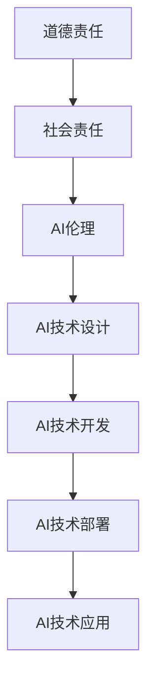

                 

 关键词：人工智能、道德责任、社会责任、AI伦理、技术伦理、数据隐私、AI应用、算法透明度、技术影响评估

> 摘要：随着人工智能技术的迅猛发展，AI在各个领域中的应用日益广泛，但同时也带来了诸多伦理和社会问题。本文将探讨AI时代的道德和社会责任，分析人工智能技术可能带来的伦理挑战，并探讨如何构建一个公正、透明和可持续的AI生态系统。

## 1. 背景介绍

### 1.1 人工智能的发展历程

人工智能（AI）作为计算机科学的一个重要分支，其发展历程可以追溯到20世纪50年代。从最初的符号主义人工智能到基于统计学习的机器学习，再到当前深度学习的广泛应用，AI技术取得了显著的进步。特别是在图像识别、自然语言处理、自动驾驶等领域，AI的应用已经深刻改变了人类的生活方式。

### 1.2 AI技术的应用现状

当前，人工智能技术已经在众多领域得到了广泛应用。例如，在医疗领域，AI可以用于疾病诊断、治疗方案推荐等；在金融领域，AI可以用于风险评估、信用评分等；在工业制造领域，AI可以用于生产优化、质量控制等。随着AI技术的不断成熟，其应用领域也在不断拓展。

## 2. 核心概念与联系

### 2.1 道德责任

道德责任是指个体或组织在行为中遵循道德规范，对行为后果负责的义务。在AI时代，道德责任的重要性愈发凸显，因为AI系统的决策可能对人类产生重大影响。

### 2.2 社会责任

社会责任是指企业或组织在社会发展和环境保护等方面所承担的责任。在AI时代，企业需要考虑如何合理利用AI技术，避免对人类和社会造成负面影响。

### 2.3 AI伦理

AI伦理是指关于人工智能技术的伦理问题和道德原则。它涉及到人工智能技术的设计、开发、部署和应用等方面，旨在确保AI技术的正当性和道德性。

### 2.4 Mermaid 流程图



## 3. 核心算法原理 & 具体操作步骤

### 3.1 算法原理概述

人工智能技术的核心是算法，其中深度学习算法是目前应用最广泛的算法之一。深度学习算法基于神经网络模型，通过大量的数据训练，可以自动学习和识别复杂的模式。

### 3.2 算法步骤详解

1. 数据预处理：对原始数据进行分析和清洗，确保数据的质量和完整性。
2. 模型构建：选择合适的神经网络模型，并对其进行初始化。
3. 模型训练：使用训练数据对模型进行训练，优化模型的参数。
4. 模型评估：使用验证数据对模型进行评估，判断模型的性能。
5. 模型部署：将训练好的模型部署到实际应用中，进行预测和决策。

### 3.3 算法优缺点

优点：深度学习算法能够自动学习和识别复杂的模式，具有很高的准确性和效率。

缺点：深度学习算法需要大量的数据和计算资源，并且模型的解释性较差。

### 3.4 算法应用领域

深度学习算法在图像识别、自然语言处理、自动驾驶等领域具有广泛的应用。

## 4. 数学模型和公式 & 详细讲解 & 举例说明

### 4.1 数学模型构建

深度学习算法的核心是神经网络模型，其基本构成包括输入层、隐藏层和输出层。每个层由多个神经元组成，神经元之间通过权重和偏置进行连接。

### 4.2 公式推导过程

神经元的输出可以通过以下公式计算：

\[ y = \sigma(\sum_{i=1}^{n} w_i \cdot x_i + b) \]

其中，\( \sigma \) 表示激活函数，\( w_i \) 和 \( b \) 分别表示权重和偏置，\( x_i \) 表示输入值。

### 4.3 案例分析与讲解

假设我们有一个简单的神经网络模型，用于对数字进行分类。输入层有两个神经元，表示数字的十位和个位；隐藏层有两个神经元，表示数字的估计值；输出层有一个神经元，表示分类结果。

输入层：\[ x_1 = 1, x_2 = 2 \]

隐藏层：\[ y_1 = \sigma(w_1 \cdot x_1 + b_1), y_2 = \sigma(w_2 \cdot x_2 + b_2) \]

输出层：\[ z = \sigma(w_3 \cdot y_1 + w_4 \cdot y_2 + b_3) \]

通过反向传播算法，我们可以不断优化神经网络的参数，使其能够更好地进行分类。

## 5. 项目实践：代码实例和详细解释说明

### 5.1 开发环境搭建

为了实践深度学习算法，我们需要搭建一个开发环境。可以选择使用 Python 作为编程语言，并使用 TensorFlow 作为深度学习框架。

### 5.2 源代码详细实现

以下是一个简单的深度学习模型，用于对数字进行分类：

```python
import tensorflow as tf

# 模型构建
model = tf.keras.Sequential([
    tf.keras.layers.Dense(2, activation='sigmoid', input_shape=(2,)),
    tf.keras.layers.Dense(1, activation='sigmoid')
])

# 模型编译
model.compile(optimizer='adam', loss='binary_crossentropy', metrics=['accuracy'])

# 模型训练
model.fit(x_train, y_train, epochs=10, batch_size=32)

# 模型评估
model.evaluate(x_test, y_test)
```

### 5.3 代码解读与分析

这段代码首先导入了 TensorFlow 框架，然后构建了一个简单的神经网络模型。模型由两个隐藏层组成，每个隐藏层有两个神经元。模型使用 sigmoid 激活函数，使得输出值介于 0 和 1 之间。模型使用 Adam 优化器和 binary_crossentropy 损失函数进行编译，然后使用训练数据进行训练。最后，使用测试数据进行模型评估。

### 5.4 运行结果展示

运行上述代码后，我们可以得到模型的训练和评估结果。通过不断调整模型的参数，我们可以提高模型的性能。

## 6. 实际应用场景

人工智能技术在实际应用中具有广泛的应用前景。以下是一些典型的应用场景：

### 6.1 医疗健康

AI可以用于疾病诊断、治疗方案推荐和医疗数据分析等方面。例如，通过分析患者的病历数据和基因数据，AI可以预测患者患某种疾病的风险，并提供个性化的治疗方案。

### 6.2 金融

AI可以用于风险评估、信用评分和金融欺诈检测等方面。例如，银行可以利用AI技术对贷款申请者进行风险评估，从而降低贷款违约风险。

### 6.3 智能制造

AI可以用于生产优化、质量控制和生产调度等方面。例如，通过使用AI技术，工厂可以实时监控生产过程，并根据实时数据调整生产计划，从而提高生产效率。

## 7. 未来应用展望

随着人工智能技术的不断发展，未来AI将在更多领域得到应用。以下是一些可能的应用方向：

### 7.1 智能交通

AI可以用于交通管理、自动驾驶和智能出行等方面。通过实时监控交通状况，AI可以优化交通信号灯控制，减少交通拥堵，提高出行效率。

### 7.2 智慧城市

AI可以用于智慧城市建设，包括环境监测、公共安全、能源管理等方面。通过使用AI技术，城市可以实现智能化管理，提高城市居民的生活质量。

### 7.3 教育与培训

AI可以用于个性化教育、智能评测和职业培训等方面。通过使用AI技术，教育机构可以为学生提供个性化的学习方案，提高学习效果。

## 8. 工具和资源推荐

### 8.1 学习资源推荐

- 《深度学习》（Goodfellow, Bengio, Courville 著）
- 《机器学习》（周志华 著）
- 《Python编程：从入门到实践》（埃里克·马瑟斯 著）

### 8.2 开发工具推荐

- TensorFlow
- PyTorch
- Keras

### 8.3 相关论文推荐

- "Deep Learning"（Ian Goodfellow, Yoshua Bengio, Aaron Courville 著）
- "Learning representations for AI"（Yoshua Bengio 著）
- "A Theoretical Framework for Back-Propagating Neural Networks"（David E. Rumelhart, Geoffrey E. Hinton, Ronald J. Williams 著）

## 9. 总结：未来发展趋势与挑战

### 9.1 研究成果总结

近年来，人工智能技术取得了显著的进展，特别是在深度学习领域。然而，随着AI技术的不断发展，我们也面临着诸多伦理和社会问题。

### 9.2 未来发展趋势

未来，人工智能技术将继续发展，并在更多领域得到应用。同时，AI伦理和社会责任将成为重要议题，需要全球范围内的合作与努力。

### 9.3 面临的挑战

- 数据隐私和安全性：随着AI技术的广泛应用，数据隐私和安全性问题日益突出。
- 算法透明度和可解释性：如何确保AI算法的透明度和可解释性，使其能够被公众理解和接受。
- 技术公平性和歧视问题：如何避免AI算法在决策过程中出现歧视和偏见。

### 9.4 研究展望

在未来的研究中，我们需要关注以下几个方面：

- 开发可解释的AI算法，提高算法的透明度和可解释性。
- 研究数据隐私保护和安全性技术，确保用户数据的隐私和安全。
- 探索AI伦理和社会责任的理论基础，制定相关的伦理准则和法规。

## 10. 附录：常见问题与解答

### 10.1 什么是人工智能？

人工智能是指使计算机模拟人类智能行为的技术，包括学习、推理、感知、理解、决策等方面。

### 10.2 深度学习是什么？

深度学习是一种基于神经网络的人工智能技术，通过多层神经网络模型，对大量数据进行自动学习和识别复杂的模式。

### 10.3 AI伦理是什么？

AI伦理是指关于人工智能技术的伦理问题和道德原则，涉及人工智能技术的设计、开发、部署和应用等方面。

### 10.4 数据隐私和安全是什么？

数据隐私和安全是指保护个人数据不被未经授权的访问、使用、泄露和篡改的措施和技术。

### 10.5 如何确保AI算法的透明度和可解释性？

确保AI算法的透明度和可解释性需要从算法设计、数据预处理、模型训练和解释技术等方面进行综合考虑，提高算法的透明度和可解释性。

### 10.6 如何避免AI算法在决策过程中出现歧视和偏见？

为了避免AI算法在决策过程中出现歧视和偏见，需要在算法设计、数据收集和处理、模型训练和评估等方面进行公正性和公平性评估，并采取相应的措施来减少偏见和歧视。

----------------------------------------------------------------

### 作者署名
作者：禅与计算机程序设计艺术 / Zen and the Art of Computer Programming

