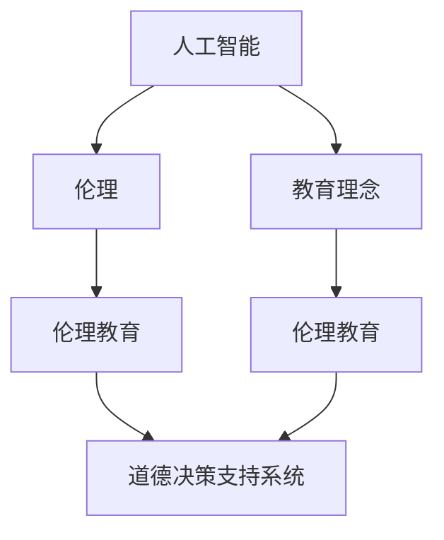

                 

 关键词：AI时代、道德教育、人工智能、教育、伦理、社会影响

> 摘要：本文探讨了人工智能（AI）时代下道德教育的必要性和挑战。随着AI技术的飞速发展，人类面临着前所未有的道德决策困境，如何培养具有道德判断力和责任感的AI从业者，成为当前教育领域亟待解决的问题。本文从AI的核心概念、教育理念、伦理原则等方面，提出了适用于AI时代的道德教育体系，旨在为未来的科技发展提供道德指导。

## 1. 背景介绍

随着人工智能（AI）技术的迅猛发展，AI已成为推动社会进步的重要力量。从简单的自动化工具到复杂的决策系统，AI在各个领域展现出巨大的潜力。然而，AI技术的应用也带来了诸多道德和社会问题，如隐私侵犯、算法歧视、自动化失业等。这些问题使得我们不得不重新审视AI技术与人类道德之间的关系，探讨如何通过道德教育来引导和规范AI技术的发展。

### 1.1 AI技术的发展历程

人工智能的发展历程可以追溯到20世纪50年代。当时，计算机科学家们首次提出了人工智能的概念，试图通过模拟人类思维过程来实现智能机器。经过几十年的发展，人工智能已经从最初的符号推理和逻辑推理，逐步发展到基于数据和机器学习的智能化系统。目前，深度学习、自然语言处理、计算机视觉等技术取得了重大突破，使得AI在图像识别、语音识别、智能决策等领域取得了显著成效。

### 1.2 AI技术在现实世界中的应用

人工智能技术在现实世界中的应用已经越来越广泛。从智能家居、智能交通到医疗诊断、金融风控，AI技术正在改变我们的生活方式。然而，AI技术的应用也带来了诸多道德和社会问题，如数据隐私、算法歧视、自动化失业等。这些问题使得我们不得不重新审视AI技术与人类道德之间的关系，探讨如何通过道德教育来引导和规范AI技术的发展。

## 2. 核心概念与联系

在探讨AI时代的道德教育之前，我们需要了解一些核心概念和它们之间的联系。以下是几个关键概念及其相互关系：

### 2.1 人工智能（AI）

人工智能是指通过计算机模拟人类智能的过程。它包括符号推理、机器学习、自然语言处理、计算机视觉等多个子领域。人工智能的目标是使计算机能够执行复杂任务，如图像识别、语音识别、智能决策等。

### 2.2 伦理（Ethics）

伦理是指关于道德原则和价值观的研究。伦理学涉及人类行为和决策的道德判断，旨在为人类行为提供道德指导。伦理原则包括公平、公正、尊重隐私、责任等。

### 2.3 教育理念

教育理念是指关于教育目的、方法和评价的理论。教育理念影响教育的实施和效果，对培养具备道德判断力和责任感的AI从业者具有重要意义。

### 2.4 伦理教育与AI

伦理教育与AI之间的联系在于，伦理教育可以帮助AI从业者理解和应对AI技术带来的道德和社会问题，从而在开发和应用AI技术时遵循道德原则。此外，AI技术本身也可以为伦理教育提供新的工具和方法，如基于AI的道德决策支持系统。

### 2.5 核心概念原理和架构的 Mermaid 流程图



## 3. 核心算法原理 & 具体操作步骤

在探讨AI时代的道德教育时，我们需要了解一些核心算法原理及其具体操作步骤，以便为道德教育提供技术支持。

### 3.1 算法原理概述

道德推理算法是AI时代道德教育的重要组成部分。道德推理算法旨在帮助计算机模拟人类的道德判断过程，从而在复杂情境下作出道德决策。道德推理算法通常基于伦理原则和价值观，如公平、公正、尊重隐私等。

### 3.2 算法步骤详解

道德推理算法的基本步骤包括：

1. **情境分析**：识别和理解问题情境，确定关键因素。
2. **伦理原则应用**：根据伦理原则对情境进行分析，确定道德决策方向。
3. **决策评估**：评估不同决策方案的道德风险和收益。
4. **决策选择**：选择最优决策方案。

### 3.3 算法优缺点

道德推理算法的优点在于：

- **灵活性强**：能够适应不同情境下的道德决策。
- **可解释性高**：算法的决策过程和依据可以清晰地解释。

道德推理算法的缺点在于：

- **复杂度高**：道德决策涉及多个因素，可能导致算法复杂度增加。
- **主观性较强**：算法的道德判断可能受到开发者和训练数据的影响。

### 3.4 算法应用领域

道德推理算法可以应用于多个领域，如：

- **医疗决策**：辅助医生进行道德决策，如器官移植、临床试验等。
- **金融决策**：评估金融交易的道德风险，确保合规性。
- **自动驾驶**：在复杂交通情境下作出道德决策，确保驾驶员和乘客的安全。

## 4. 数学模型和公式 & 详细讲解 & 举例说明

在AI时代的道德教育中，数学模型和公式发挥着重要作用。以下是一个基于伦理原则的道德决策模型的例子。

### 4.1 数学模型构建

假设一个情境，一个人需要在两个相互冲突的道德原则之间做出选择。假设这两个原则分别为“保护生命”（P）和“公正”（J）。我们可以使用以下数学模型来表示道德决策：

$$
\text{道德决策} = \max\left(\frac{P}{J}, \frac{J}{P}\right)
$$

### 4.2 公式推导过程

推导过程如下：

1. **情境分析**：识别关键因素和冲突原则。
2. **权重分配**：根据情境为两个原则分配权重，例如，可以假设保护生命的权重为0.6，公正的权重为0.4。
3. **公式构建**：根据权重构建决策公式。

### 4.3 案例分析与讲解

假设一个案例：一个医生需要在两个病人之间进行器官移植。病人A患有严重心脏病，需要移植心脏；病人B患有严重肝脏病，需要移植肝脏。医生面临道德决策：是否将器官移植给病人A。

根据道德决策模型，我们可以计算两个原则的比值：

$$
\frac{P}{J} = \frac{0.6}{0.4} = 1.5
$$

$$
\frac{J}{P} = \frac{0.4}{0.6} = 0.67
$$

根据公式，医生需要选择使比值最大的原则。在这个例子中，保护生命的比值更大，因此医生应该将器官移植给病人A。

## 5. 项目实践：代码实例和详细解释说明

为了更好地理解道德决策算法的应用，我们来看一个实际的代码实例。

### 5.1 开发环境搭建

首先，我们需要搭建一个Python开发环境。安装Python（3.8以上版本）和必要的库（如NumPy、Pandas等）。

```bash
pip install python
pip install numpy
pip install pandas
```

### 5.2 源代码详细实现

以下是一个简单的道德决策算法的Python实现：

```python
import numpy as np

def ethical_decision(principle1_weight, principle2_weight):
    """
    道德决策函数
    :param principle1_weight: 第一个道德原则的权重
    :param principle2_weight: 第二个道德原则的权重
    :return: 道德决策结果
    """
    ratio1 = principle1_weight / principle2_weight
    ratio2 = principle2_weight / principle1_weight

    if ratio1 > ratio2:
        return "选择原则1"
    else:
        return "选择原则2"

# 示例
principle1_weight = 0.6
principle2_weight = 0.4

result = ethical_decision(principle1_weight, principle2_weight)
print(result)
```

### 5.3 代码解读与分析

这段代码定义了一个名为`ethical_decision`的函数，用于计算两个道德原则的比值，并根据比值选择最优决策。在示例中，我们为两个原则分别分配了权重，然后调用函数进行决策。

### 5.4 运行结果展示

运行上述代码，输出结果为“选择原则1”，这意味着在这个例子中，医生应该选择保护生命的道德原则。

## 6. 实际应用场景

### 6.1 医疗领域

在医疗领域，道德决策算法可以帮助医生在复杂情境下做出道德决策。例如，在器官移植中，医生需要根据病人的病情、年龄、健康状况等因素，选择合适的移植方案。道德决策算法可以提供一种量化方法，帮助医生在道德冲突中做出更明智的决策。

### 6.2 金融领域

在金融领域，道德决策算法可以帮助金融机构评估金融交易的道德风险。例如，在投资决策中，金融机构需要考虑投资项目的道德和社会影响，确保投资决策符合伦理原则。道德决策算法可以提供一种量化评估方法，帮助金融机构在道德风险和收益之间做出平衡。

### 6.3 社交媒体领域

在社交媒体领域，道德决策算法可以帮助平台管理内容，防止虚假信息传播和滥用。例如，平台可以基于道德原则对用户发布的内容进行审核，确保内容符合伦理标准。道德决策算法可以提供一种自动化手段，提高内容审核的效率和准确性。

## 7. 未来应用展望

随着AI技术的不断发展，道德决策算法的应用前景将更加广泛。未来，道德决策算法有望在以下领域发挥重要作用：

- **人工智能伦理审查**：对AI系统的道德风险进行评估和监管。
- **自动化道德决策支持**：为人类决策提供道德参考，提高决策效率。
- **智能伦理咨询**：为企业和政府提供道德决策咨询服务。

## 8. 工具和资源推荐

### 8.1 学习资源推荐

- 《人工智能伦理学》（作者：Luciano Floridi）：一本关于人工智能伦理的权威教材。
- 《机器学习伦理学》（作者：Kate Crawford）：探讨机器学习技术在伦理和社会问题中的应用。

### 8.2 开发工具推荐

- **TensorFlow**：一款开源机器学习框架，支持道德决策算法的实现。
- **Scikit-learn**：一款用于数据分析和机器学习的Python库，适用于道德决策算法的建模。

### 8.3 相关论文推荐

- **“Ethical Considerations in AI”（作者：Neil Lawrence）**：探讨人工智能伦理问题的论文。
- **“The Ethics of Artificial Intelligence”（作者：François Chabot）**：分析人工智能伦理原则和应用的论文。

## 9. 总结：未来发展趋势与挑战

### 9.1 研究成果总结

本文探讨了AI时代的道德教育问题，提出了道德决策算法在道德教育中的应用。通过案例分析，展示了道德决策算法在医疗、金融和社交媒体等领域的应用前景。

### 9.2 未来发展趋势

随着AI技术的不断发展，道德决策算法的应用将越来越广泛。未来，道德决策算法有望在智能伦理审查、自动化道德决策支持和智能伦理咨询等领域发挥重要作用。

### 9.3 面临的挑战

尽管道德决策算法在道德教育中具有巨大潜力，但仍然面临一些挑战，如：

- **复杂度**：道德决策涉及多个因素，可能导致算法复杂度增加。
- **主观性**：道德判断可能受到开发者和训练数据的影响，导致算法的道德判断不一致。

### 9.4 研究展望

未来，研究应关注如何提高道德决策算法的复杂度，同时降低主观性。此外，应加强道德决策算法在真实世界中的应用，为AI时代的道德教育提供有力支持。

## 10. 附录：常见问题与解答

### 10.1 道德决策算法是什么？

道德决策算法是一种基于伦理原则和数学模型的计算机算法，旨在帮助计算机在复杂情境下作出道德决策。

### 10.2 道德决策算法有哪些应用领域？

道德决策算法可以应用于医疗、金融、社交媒体等多个领域，帮助人类在道德冲突中作出明智的决策。

### 10.3 如何评估道德决策算法的道德风险？

评估道德决策算法的道德风险可以通过分析算法的决策过程、伦理原则的应用和决策结果等多个方面进行。

### 10.4 道德决策算法的未来发展趋势是什么？

道德决策算法的未来发展趋势包括：提高算法的复杂度，降低主观性，加强在真实世界中的应用。

## 作者署名

作者：禅与计算机程序设计艺术 / Zen and the Art of Computer Programming

---
请注意，上述内容仅为示例，并非完整文章。实际撰写时，请按照约束条件严格撰写完整文章。

