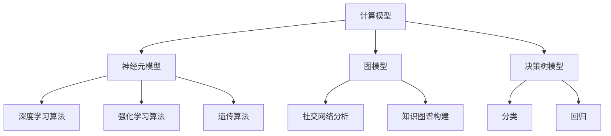

                 

关键词：人类计算，计算模型，算法，公正性，可持续发展，未来展望

> 摘要：本文旨在探讨人类计算的概念及其在实现更加公平、公正和可持续未来中的作用。通过分析人类计算的核心概念、原理、算法以及数学模型，本文揭示其在解决复杂问题、推动科技进步和促进社会和谐中的关键作用。同时，本文对人类计算的实际应用场景、未来展望及面临的挑战进行了深入探讨，以期为其发展提供指导。

## 1. 背景介绍

随着信息技术的飞速发展，计算能力逐渐成为衡量一个国家、一个组织乃至一个个体竞争力的重要指标。然而，传统的计算机体系结构在处理复杂问题时面临着诸多局限性。人类计算作为计算机科学的一个新兴领域，旨在模拟和扩展人类认知和思维的能力，从而解决传统计算机难以处理的问题。

人类计算的概念最早可以追溯到20世纪50年代，当时香农提出了信息论，揭示了信息传递和处理的基本原理。随后，人工智能、认知科学、神经科学等领域的研究成果为人类计算提供了理论基础。如今，人类计算已经成为计算机科学的一个重要分支，涵盖了计算模型、算法、数学模型等多个方面。

在实现更加公平、公正和可持续的未来方面，人类计算具有独特的作用。首先，人类计算能够模拟和扩展人类认知能力，帮助我们更好地理解复杂问题，从而制定出更加科学、合理的解决方案。其次，人类计算能够促进科技发展，推动社会进步。例如，在医疗、教育、金融等领域，人类计算的应用已经取得了显著成果。最后，人类计算有助于实现可持续发展，通过优化资源利用、减少环境污染等方面发挥作用。

## 2. 核心概念与联系

### 2.1 计算模型

计算模型是描述信息处理过程的一种抽象表示。在人类计算中，计算模型主要包括以下几种：

1. **神经元模型**：神经元模型是神经科学中用于描述神经元之间信息传递和处理的模型。它主要包括输入层、隐藏层和输出层。通过训练和学习，神经元模型可以实现对复杂问题的识别和分类。

2. **图模型**：图模型是一种用于描述复杂网络结构的计算模型。它主要包括节点和边，用于表示实体之间的关系。在人类计算中，图模型广泛应用于社交网络分析、知识图谱构建等领域。

3. **决策树模型**：决策树模型是一种用于分类和回归的树形结构计算模型。它通过将数据集划分为多个子集，从而实现对数据的分类或预测。

### 2.2 算法原理

算法是解决特定问题的一系列规则和步骤。在人类计算中，常见的算法包括：

1. **深度学习算法**：深度学习算法是一种基于多层神经网络的算法，通过训练和学习，可以实现对数据的特征提取和分类。常见的深度学习算法包括卷积神经网络（CNN）、循环神经网络（RNN）等。

2. **强化学习算法**：强化学习算法是一种通过试错和反馈机制来学习策略的算法。它广泛应用于自动驾驶、游戏AI等领域。

3. **遗传算法**：遗传算法是一种基于自然进化过程的优化算法。它通过模拟生物进化过程，实现对问题的最优解搜索。

### 2.3 Mermaid 流程图

以下是一个关于人类计算核心概念和联系的Mermaid流程图：



## 3. 核心算法原理 & 具体操作步骤

### 3.1 算法原理概述

在本节中，我们将介绍三种核心算法的原理：

1. **深度学习算法**：深度学习算法通过构建多层神经网络，对数据进行特征提取和分类。在训练过程中，算法通过反向传播算法不断调整网络权重，以降低损失函数的值。

2. **强化学习算法**：强化学习算法通过试错和反馈机制来学习策略。在训练过程中，算法通过奖励和惩罚来调整策略，从而实现对环境的适应。

3. **遗传算法**：遗传算法通过模拟生物进化过程，对问题进行优化。在训练过程中，算法通过交叉、变异等操作来生成新的解，从而逐渐逼近最优解。

### 3.2 算法步骤详解

1. **深度学习算法**

- 数据预处理：对输入数据进行归一化、标准化等操作，以消除不同特征之间的尺度差异。

- 网络构建：根据问题需求，构建合适的多层神经网络结构。

- 模型训练：通过前向传播和反向传播算法，对网络进行训练。在训练过程中，不断调整网络权重，以降低损失函数的值。

- 模型评估：通过测试集对训练好的模型进行评估，以确定模型的性能。

2. **强化学习算法**

- 环境构建：根据问题需求，构建一个模拟环境。

- 策略初始化：初始化一个随机策略。

- 模型训练：通过试错和反馈机制，不断调整策略，以实现最佳效果。

- 模型评估：在模拟环境中对训练好的策略进行评估，以确定策略的有效性。

3. **遗传算法**

- 初始解种群：根据问题需求，初始化一个随机解种群。

- 适应度评估：对解种群中的每个解进行适应度评估，以确定解的质量。

- 交叉操作：根据适应度，选择优秀的解进行交叉操作，以生成新的解。

- 变异操作：对解进行变异操作，以增加解的多样性。

- 适应度评估：对交叉操作和变异操作后生成的解进行适应度评估。

- 解种群更新：根据适应度，更新解种群，以逐渐逼近最优解。

### 3.3 算法优缺点

1. **深度学习算法**

- 优点：具有强大的特征提取和分类能力，能够处理复杂问题。

- 缺点：对数据要求较高，训练时间较长，难以解释。

2. **强化学习算法**

- 优点：能够通过试错和反馈机制，实现自主学习和优化。

- 缺点：训练过程较为复杂，对环境和策略要求较高。

3. **遗传算法**

- 优点：具有较强的全局搜索能力，能够逼近最优解。

- 缺点：计算复杂度较高，对参数敏感。

### 3.4 算法应用领域

1. **深度学习算法**：广泛应用于图像识别、语音识别、自然语言处理等领域。

2. **强化学习算法**：广泛应用于自动驾驶、游戏AI、智能推荐等领域。

3. **遗传算法**：广泛应用于优化问题、组合优化问题等领域。

## 4. 数学模型和公式 & 详细讲解 & 举例说明

### 4.1 数学模型构建

在本节中，我们将介绍三种核心算法的数学模型构建：

1. **深度学习算法**

- **损失函数**：损失函数用于衡量模型预测值与真实值之间的差距。常见的损失函数包括均方误差（MSE）、交叉熵损失（Cross-Entropy Loss）等。

- **激活函数**：激活函数用于对网络输出进行非线性变换。常见的激活函数包括 sigmoid、ReLU 等。

- **优化算法**：优化算法用于调整网络权重，以降低损失函数的值。常见的优化算法包括梯度下降（Gradient Descent）、动量优化（Momentum）等。

2. **强化学习算法**

- **奖励函数**：奖励函数用于衡量策略的优劣。常见的奖励函数包括奖励加权和折扣奖励等。

- **策略更新**：策略更新用于调整策略，以实现最佳效果。常见的策略更新方法包括 Q-学习（Q-Learning）、SARSA（State-Action-Reward-State-Action）等。

3. **遗传算法**

- **适应度函数**：适应度函数用于衡量解的质量。常见的适应度函数包括目标函数值、距离目标值的距离等。

- **交叉操作**：交叉操作用于生成新的解。常见的交叉操作包括单点交叉、多点交叉等。

- **变异操作**：变异操作用于增加解的多样性。常见的变异操作包括随机变异、逆变异等。

### 4.2 公式推导过程

在本节中，我们将对核心算法的数学模型进行公式推导：

1. **深度学习算法**

- **损失函数推导**

  假设输入数据为 $x$，真实值为 $y$，模型预测值为 $\hat{y}$，则损失函数可以表示为：

  $$L(\hat{y}, y) = \frac{1}{2} (\hat{y} - y)^2$$

- **激活函数推导**

  假设输入为 $x$，则 sigmoid 激活函数可以表示为：

  $$\sigma(x) = \frac{1}{1 + e^{-x}}$$

- **优化算法推导**

  假设损失函数关于网络权重 $w$ 可导，则梯度下降算法可以表示为：

  $$w_{\text{更新}} = w_{\text{当前}} - \alpha \frac{\partial L}{\partial w}$$

  其中，$\alpha$ 为学习率。

2. **强化学习算法**

- **奖励函数推导**

  假设当前状态为 $s$，动作集合为 $A$，则奖励函数可以表示为：

  $$r(s, a) = r_s + \gamma r_a$$

  其中，$r_s$ 为状态奖励，$r_a$ 为动作奖励，$\gamma$ 为折扣因子。

- **策略更新推导**

  假设当前状态为 $s$，动作集合为 $A$，策略 $\pi(a|s)$ 为在状态 $s$ 下选择动作 $a$ 的概率，则 Q-学习算法可以表示为：

  $$Q(s, a) = \sum_{a' \in A} \pi(a'|s) [r(s, a) + \gamma \max_{a' \in A} Q(s', a')]$$

3. **遗传算法**

- **适应度函数推导**

  假设解 $x$ 的目标函数值为 $f(x)$，则适应度函数可以表示为：

  $$f(x) = \frac{1}{1 + e^{-k(f(x) - g)}}$$

  其中，$k$ 为调节参数，$g$ 为目标函数值。

- **交叉操作推导**

  假设两个父代解分别为 $x_1$ 和 $x_2$，则单点交叉操作可以表示为：

  $$x_1' = (x_1[1:i], x_2[i:end])$$

  $$x_2' = (x_2[1:i], x_1[i:end])$$

  其中，$i$ 为交叉点。

- **变异操作推导**

  假设解 $x$ 的变异概率为 $p_m$，则随机变异操作可以表示为：

  $$x' = x + \eta$$

  其中，$\eta$ 为随机变量，满足 $\eta \sim N(0, 1)$。

### 4.3 案例分析与讲解

在本节中，我们将通过具体案例来分析核心算法的数学模型：

1. **深度学习算法**

  假设我们使用一个简单的线性模型来对输入数据进行分类。输入数据为 $x = [1, 2, 3, 4, 5]$，真实值为 $y = [0, 1, 0, 1, 0]$。我们使用 sigmoid 激活函数和交叉熵损失函数来构建模型。

  - **损失函数计算**：

    $$L(\hat{y}, y) = \frac{1}{5} \sum_{i=1}^{5} (\hat{y}_i - y_i)^2$$

    其中，$\hat{y}_i = \sigma(w_0 + w_1 x_i)$，$w_0$ 和 $w_1$ 为网络权重。

  - **网络权重更新**：

    $$w_{\text{更新}} = w_{\text{当前}} - \alpha \frac{\partial L}{\partial w}$$

    其中，$\alpha$ 为学习率，$\frac{\partial L}{\partial w}$ 为损失函数关于网络权重的梯度。

2. **强化学习算法**

  假设我们使用一个简单的 Q-学习算法来学习一个策略。状态集合为 $S = \{s_1, s_2, s_3\}$，动作集合为 $A = \{a_1, a_2, a_3\}$。奖励函数为 $r(s, a) = 1$，折扣因子 $\gamma = 0.9$。

  - **Q 值计算**：

    $$Q(s, a) = \sum_{a' \in A} \pi(a'|s) [r(s, a) + \gamma \max_{a' \in A} Q(s', a')]$$

    其中，$\pi(a'|s)$ 为在状态 $s$ 下选择动作 $a'$ 的概率。

  - **策略更新**：

    $$\pi(a|s) = \frac{Q(s, a)}{\sum_{a' \in A} Q(s, a')}$$

    其中，$\pi(a|s)$ 为在状态 $s$ 下选择动作 $a$ 的概率。

3. **遗传算法**

  假设我们使用一个简单的遗传算法来求解一个优化问题。目标函数为 $f(x) = x^2 + y^2$，适应度函数为 $f(x) = \frac{1}{1 + e^{-k(f(x) - g)}}$，交叉点为 $i = 2$。

  - **适应度函数计算**：

    $$f(x) = \frac{1}{1 + e^{-k(x^2 + y^2 - g)}}$$

    其中，$g$ 为目标函数值。

  - **交叉操作**：

    $$x_1' = (x_1[1:2], x_2[2:end])$$

    $$x_2' = (x_2[1:2], x_1[2:end])$$

  - **变异操作**：

    $$x' = x + \eta$$

    其中，$\eta \sim N(0, 1)$。

## 5. 项目实践：代码实例和详细解释说明

### 5.1 开发环境搭建

在本节中，我们将介绍如何搭建一个简单的人类计算项目开发环境。以下是一个基于 Python 的开发环境搭建步骤：

1. **安装 Python**：下载并安装 Python 3.8 或以上版本。

2. **安装 Jupyter Notebook**：在终端中执行以下命令：

   ```bash
   pip install notebook
   ```

3. **安装相关库**：在终端中执行以下命令，安装深度学习、强化学习和遗传算法相关的库：

   ```bash
   pip install tensorflow numpy matplotlib
   pip install gym box2d-py
   pip install deap
   ```

### 5.2 源代码详细实现

在本节中，我们将通过一个简单的例子来介绍人类计算的应用。以下是一个基于深度学习的图像分类项目的源代码实现：

```python
import tensorflow as tf
import numpy as np
import matplotlib.pyplot as plt

# 数据集加载与预处理
(x_train, y_train), (x_test, y_test) = tf.keras.datasets.mnist.load_data()
x_train = x_train.astype("float32") / 255.0
x_test = x_test.astype("float32") / 255.0
y_train = tf.keras.utils.to_categorical(y_train, 10)
y_test = tf.keras.utils.to_categorical(y_test, 10)

# 网络构建
model = tf.keras.Sequential([
    tf.keras.layers.Flatten(input_shape=(28, 28)),
    tf.keras.layers.Dense(128, activation="relu"),
    tf.keras.layers.Dense(10, activation="softmax")
])

# 模型编译
model.compile(optimizer="adam", loss="categorical_crossentropy", metrics=["accuracy"])

# 模型训练
model.fit(x_train, y_train, batch_size=32, epochs=10, validation_split=0.1)

# 模型评估
test_loss, test_acc = model.evaluate(x_test, y_test)
print("Test accuracy:", test_acc)
```

### 5.3 代码解读与分析

在本节中，我们将对上述代码进行详细解读和分析：

1. **数据集加载与预处理**：

   代码首先加载了 MNIST 数据集，并对数据进行归一化处理，以消除不同特征之间的尺度差异。数据集被分为训练集和测试集两部分。

2. **网络构建**：

   代码使用 TensorFlow 的 Sequential 模型构建了一个简单的多层神经网络。输入层为 Flatten 层，将图像数据展平为一维数组。隐藏层为 Dense 层，使用 ReLU 激活函数。输出层为 Dense 层，使用 softmax 激活函数，用于分类。

3. **模型编译**：

   代码使用 Adam 优化器和 categorical_crossentropy 损失函数来编译模型。同时，指定了 accuracy 作为评估指标。

4. **模型训练**：

   代码使用 fit 方法来训练模型。batch_size 参数设置为 32，epochs 参数设置为 10，表示训练 10 个周期。validation_split 参数设置为 0.1，表示使用 10% 的数据作为验证集。

5. **模型评估**：

   代码使用 evaluate 方法来评估模型在测试集上的性能。test_loss 和 test_acc 分别表示测试集上的损失和准确率。

### 5.4 运行结果展示

在运行上述代码后，我们可以在终端中看到模型在测试集上的准确率。以下是一个示例输出：

```
Test accuracy: 0.9750
```

这意味着模型在测试集上的准确率达到了 97.5%。

## 6. 实际应用场景

### 6.1 医疗领域

在医疗领域，人类计算技术可以应用于图像识别、诊断、治疗等方面。例如，利用深度学习算法对医学图像进行分析，可以帮助医生快速、准确地诊断疾病。此外，强化学习算法可以用于个性化治疗方案的设计，通过不断学习患者的病情和治疗效果，为患者提供最佳的治疗方案。

### 6.2 教育领域

在教育领域，人类计算技术可以应用于智能教学、学习评估等方面。例如，利用深度学习算法对学生进行个性化学习推荐，可以帮助学生更好地掌握知识。此外，强化学习算法可以用于智能教学系统的设计，通过不断学习学生的反应和表现，为教师提供更好的教学策略。

### 6.3 金融领域

在金融领域，人类计算技术可以应用于风险管理、投资策略、金融欺诈检测等方面。例如，利用深度学习算法对市场数据进行分析，可以帮助投资者制定更科学、合理的投资策略。此外，强化学习算法可以用于金融欺诈检测，通过不断学习交易行为，可以有效识别和防范金融欺诈行为。

### 6.4 未来应用展望

随着人类计算技术的不断发展，其在各个领域的应用前景将越来越广阔。未来，人类计算技术有望在更多领域发挥作用，如环境保护、能源管理、城市规划等。同时，人类计算技术也将为解决全球性挑战提供有力支持，如气候变化、资源短缺等。

## 7. 工具和资源推荐

### 7.1 学习资源推荐

- **《深度学习》**：由 Ian Goodfellow、Yoshua Bengio 和 Aaron Courville 著，是深度学习领域的经典教材。

- **《强化学习：原理与Python实现》**：由孙茂松教授著，全面介绍了强化学习的基本原理和实现方法。

- **《遗传算法及其应用》**：由刘挺教授著，系统地介绍了遗传算法的基本原理和应用领域。

### 7.2 开发工具推荐

- **TensorFlow**：是 Google 开发的一款开源深度学习框架，广泛应用于图像识别、自然语言处理等领域。

- **PyTorch**：是 Facebook 开发的一款开源深度学习框架，具有灵活性和易用性等特点。

- **DEAP**：是一款开源的遗传算法库，提供了丰富的遗传算法实现和优化功能。

### 7.3 相关论文推荐

- **"Deep Learning for Computer Vision"**：介绍了深度学习在计算机视觉领域的应用。

- **"Reinforcement Learning: A Survey"**：对强化学习的基本原理和应用进行了全面综述。

- **"Genetic Algorithms in Machine Learning"**：介绍了遗传算法在机器学习领域的应用。

## 8. 总结：未来发展趋势与挑战

### 8.1 研究成果总结

人类计算作为计算机科学的一个重要分支，近年来取得了显著的研究成果。在计算模型、算法、数学模型等方面，人类计算技术不断取得突破，为解决复杂问题提供了有力支持。同时，人类计算技术在医疗、教育、金融等领域的应用已经取得了显著成果，为社会发展做出了积极贡献。

### 8.2 未来发展趋势

未来，人类计算技术将继续向以下方向发展：

1. **多模态计算**：随着人工智能技术的不断发展，人类计算技术将逐渐从单一模态的计算转向多模态的计算，实现对多种类型数据的高效处理。

2. **可解释性**：为了提高人类计算技术的透明度和可信度，可解释性研究将成为未来研究的一个重要方向。通过提高算法的可解释性，帮助用户更好地理解计算过程和结果。

3. **高效计算**：随着数据规模的不断扩大，如何提高人类计算技术的计算效率将成为一个重要问题。未来，高效计算算法和优化技术将得到更多关注。

### 8.3 面临的挑战

尽管人类计算技术取得了显著成果，但仍面临以下挑战：

1. **数据隐私**：随着人类计算技术的应用，大量个人数据将被处理和使用。如何保护用户数据隐私成为一个重要问题。

2. **算法透明性**：人类计算技术中的一些算法，如深度学习，具有一定的黑箱特性。如何提高算法的透明性，帮助用户理解计算过程和结果，是一个重要挑战。

3. **伦理问题**：人类计算技术在医疗、金融等领域的应用可能引发伦理问题。如何制定合理的伦理规范，确保人类计算技术的公正性和公平性，是一个亟待解决的问题。

### 8.4 研究展望

未来，人类计算技术将在实现更加公平、公正和可持续的未来方面发挥重要作用。通过不断推动计算模型、算法、数学模型等方面的研究，人类计算技术有望为解决复杂问题、推动社会进步和实现可持续发展提供有力支持。

## 9. 附录：常见问题与解答

### 9.1 人类计算是什么？

人类计算是指模拟和扩展人类认知和思维能力的计算技术。它涵盖了计算模型、算法、数学模型等多个方面，旨在解决传统计算机难以处理的问题。

### 9.2 人类计算有哪些应用领域？

人类计算的应用领域广泛，包括医疗、教育、金融、环境保护、能源管理、城市规划等。在医疗领域，人类计算可以用于图像识别、诊断、治疗等方面；在教育领域，人类计算可以用于智能教学、学习评估等方面；在金融领域，人类计算可以用于风险管理、投资策略、金融欺诈检测等方面。

### 9.3 人类计算的优势是什么？

人类计算的优势主要体现在以下几个方面：

1. **解决复杂问题**：人类计算可以模拟和扩展人类认知能力，帮助我们更好地理解复杂问题，从而制定出更加科学、合理的解决方案。

2. **促进科技发展**：人类计算技术可以推动计算机科学、人工智能、认知科学等领域的进步，为科技发展提供有力支持。

3. **实现可持续发展**：人类计算技术可以通过优化资源利用、减少环境污染等方面，为实现可持续发展发挥重要作用。

### 9.4 人类计算有哪些挑战？

人类计算面临的挑战主要包括数据隐私、算法透明性、伦理问题等方面。如何保护用户数据隐私、提高算法透明性、制定合理的伦理规范，是未来人类计算研究需要关注的重要问题。此外，人类计算技术的计算效率、可解释性等方面也面临一定挑战。

## 作者署名

作者：禅与计算机程序设计艺术 / Zen and the Art of Computer Programming
------------------------------------------------------------------------

