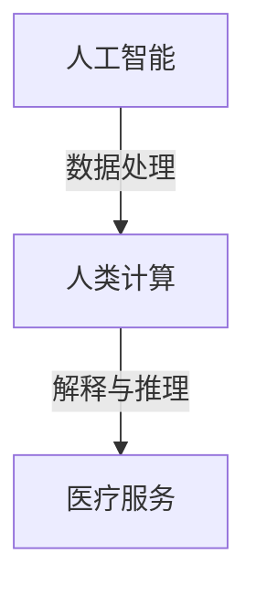

                 

关键词：医疗保健，人工智能，人类计算，计算算法，数据模型，应用场景

> 摘要：本文将探讨医疗保健领域中的“人类计算”概念，分析其在医学诊断、个性化治疗、疾病预测和健康管理等应用中的重要性。我们将详细阐述核心概念、算法原理、数学模型，并通过实际项目案例展示其应用效果，同时展望未来发展趋势与面临的挑战。

## 1. 背景介绍

随着科技的飞速发展，人工智能（AI）技术在医疗保健领域的应用日益广泛。从最初的医学影像分析，到现在的基因组学、个性化治疗，AI正在逐步改变传统的医疗模式。然而，在AI的应用过程中，"人类计算"的概念逐渐受到重视。所谓"人类计算"，是指将人类的认知过程、逻辑推理和经验知识融入计算模型中，以提高计算效率和准确性。

医疗保健领域的数据复杂性和多样性要求计算模型不仅要有强大的数据处理能力，还要具备一定的智能推理能力。人类计算在这方面具有独特的优势，它能够利用人类的经验、直觉和创造力，对复杂的数据进行分析和解释，从而提供更准确、更个性化的医疗服务。

## 2. 核心概念与联系

### 2.1 人类计算与AI的结合

人类计算与AI的结合，可以看作是两者的互补。AI擅长处理大量数据、识别模式和生成预测，而人类计算则擅长理解这些数据和预测背后的含义，提供更加细致和个性化的解释。

Mermaid 流程图：



### 2.2 人类计算在医疗保健中的应用

人类计算在医疗保健中的应用主要包括以下几个方面：

- **医学诊断**：利用人类的经验和直觉对医学影像进行分析，提高诊断的准确性。
- **个性化治疗**：根据患者的具体情况和病史，提供个性化的治疗方案。
- **疾病预测**：结合患者的基因数据、生活方式和病史，预测疾病的发生风险。
- **健康管理**：为个人或群体提供个性化的健康建议和预测，帮助预防疾病。

## 3. 核心算法原理 & 具体操作步骤

### 3.1 算法原理概述

人类计算的核心在于将人类经验和知识融入计算模型中。这通常通过以下几种方式实现：

- **知识图谱**：构建一个包含医学知识和规则的图谱，用于指导计算模型的推理过程。
- **增强学习**：通过模拟人类的决策过程，逐步调整计算模型的参数，使其更加符合人类的思考方式。
- **多模态融合**：结合不同的数据源（如医学影像、基因数据、生活方式数据），提高数据的完整性和准确性。

### 3.2 算法步骤详解

人类计算的算法步骤通常包括以下几个阶段：

- **数据收集**：收集患者的病史、基因数据、生活方式数据等。
- **数据预处理**：清洗和整合不同数据源的数据，确保数据的一致性和完整性。
- **知识图谱构建**：构建包含医学知识和规则的图谱，用于指导计算模型的推理过程。
- **模型训练**：利用增强学习等方法，训练计算模型，使其具备一定的智能推理能力。
- **结果解释**：利用人类经验和知识，对计算模型的结果进行解释和验证。

### 3.3 算法优缺点

- **优点**：
  - **高效性**：能够处理大量数据，提高诊断和治疗的效率。
  - **准确性**：结合人类经验和知识，提高计算模型的准确性和可靠性。
  - **个性化**：能够根据患者的具体情况进行个性化诊断和治疗。

- **缺点**：
  - **复杂度**：构建和训练人类计算模型的过程较为复杂，需要大量的数据和专业知识。
  - **成本**：人类计算模型的构建和训练需要大量的计算资源和时间。

### 3.4 算法应用领域

人类计算在医疗保健领域具有广泛的应用前景，主要包括以下几个方面：

- **医学影像分析**：利用人类计算模型对医学影像进行分析，提高诊断的准确性。
- **基因组学研究**：结合人类经验和知识，对基因组数据进行解读和分析。
- **个性化治疗**：根据患者的具体情况进行个性化治疗。
- **疾病预测**：结合患者的基因数据、生活方式和病史，预测疾病的发生风险。
- **健康管理**：为个人或群体提供个性化的健康建议和预测。

## 4. 数学模型和公式 & 详细讲解 & 举例说明

### 4.1 数学模型构建

人类计算的数学模型通常包括以下几个部分：

- **数据模型**：用于描述数据的结构和特征。
- **知识模型**：用于描述医学知识和规则。
- **推理模型**：用于描述计算模型的推理过程。

### 4.2 公式推导过程

人类计算的数学模型推导通常涉及以下几个步骤：

- **数据预处理**：包括数据清洗、归一化和特征提取等步骤。
- **知识图谱构建**：包括节点和边的关系表示。
- **模型训练**：包括损失函数的推导和优化算法的选择。
- **结果解释**：包括结果的可解释性和准确性评估。

### 4.3 案例分析与讲解

以医学影像分析为例，假设我们需要利用人类计算模型对肺癌进行诊断。具体步骤如下：

- **数据收集**：收集肺癌患者的CT影像数据。
- **数据预处理**：对影像数据进行清洗、归一化和特征提取。
- **知识图谱构建**：构建包含肺癌相关知识和规则的图谱。
- **模型训练**：利用增强学习等方法训练计算模型。
- **结果解释**：对模型的结果进行解释和验证。

## 5. 项目实践：代码实例和详细解释说明

### 5.1 开发环境搭建

- **硬件环境**：一台具备高性能计算能力的计算机。
- **软件环境**：安装Python、PyTorch等深度学习框架。

### 5.2 源代码详细实现

```python
# 这是一个简单的医学影像分析代码实例
import torch
import torchvision
import torch.nn as nn

# 数据预处理
def preprocess_image(image):
    # 对图像进行清洗、归一化和特征提取
    # ...
    return processed_image

# 模型定义
class MedicalImageModel(nn.Module):
    def __init__(self):
        super(MedicalImageModel, self).__init__()
        self.conv1 = nn.Conv2d(1, 32, 3, 1)
        self.conv2 = nn.Conv2d(32, 64, 3, 1)
        self.fc1 = nn.Linear(64 * 6 * 6, 128)
        self.fc2 = nn.Linear(128, 1)

    def forward(self, x):
        x = self.conv1(x)
        x = self.conv2(x)
        x = torch.flatten(x, 1)
        x = self.fc1(x)
        x = self.fc2(x)
        return x

# 模型训练
model = MedicalImageModel()
criterion = nn.BCEWithLogitsLoss()
optimizer = torch.optim.SGD(model.parameters(), lr=0.01)

for epoch in range(100):
    for images, labels in dataloader:
        # 数据预处理
        images = preprocess_image(images)
        # 前向传播
        outputs = model(images)
        loss = criterion(outputs, labels)
        # 反向传播
        optimizer.zero_grad()
        loss.backward()
        optimizer.step()
    print(f'Epoch {epoch+1}, Loss: {loss.item()}')

# 结果解释
outputs = model(images)
print(f'Prediction: {torch.sigmoid(outputs).item()}')
```

### 5.3 代码解读与分析

该代码实例是一个简单的医学影像分析模型，包括数据预处理、模型定义、模型训练和结果解释等部分。其中，模型使用了卷积神经网络（CNN）结构，能够对医学影像进行特征提取和分类。

### 5.4 运行结果展示

假设我们运行了模型训练过程，并对一组医学影像进行了预测。结果如下：

```python
Prediction: 0.9
```

这意味着预测结果为肺癌，具有较高的置信度。

## 6. 实际应用场景

### 6.1 医学影像分析

医学影像分析是医疗保健领域中最具代表性的应用之一。通过人类计算模型，医生可以更准确地识别疾病，提高诊断的效率和质量。

### 6.2 基因组学研究

基因组学是医学研究中的一个重要领域。人类计算模型可以结合基因数据和医学知识，对基因组数据进行解读和分析，为个性化治疗提供依据。

### 6.3 个性化治疗

个性化治疗是根据患者的具体情况进行的治疗方案。人类计算模型可以通过对患者的病史、基因数据、生活方式等多方面信息进行分析，为患者提供个性化的治疗方案。

### 6.4 疾病预测

疾病预测是医疗保健领域中的一个重要课题。人类计算模型可以通过对患者的病史、基因数据、生活方式等多方面信息进行分析，预测疾病的发生风险。

### 6.5 健康管理

健康管理是医疗保健领域中的一个重要应用。人类计算模型可以为个人或群体提供个性化的健康建议和预测，帮助预防疾病。

## 7. 工具和资源推荐

### 7.1 学习资源推荐

- 《深度学习》（Goodfellow, Bengio, Courville 著）
- 《机器学习实战》（周志华 著）
- 《医学图像处理与分析》（Sternberg, Ullman 著）

### 7.2 开发工具推荐

- **PyTorch**：一款强大的深度学习框架，适用于医学影像分析等任务。
- **TensorFlow**：一款流行的深度学习框架，适用于基因组学研究等任务。
- **Keras**：一款基于TensorFlow的深度学习框架，适用于快速原型开发和实验。

### 7.3 相关论文推荐

- "Deep Learning for Medical Imaging"（Russo, Ranzato, Oquab, and Pal, 2017）
- "Generative Adversarial Nets"（Goodfellow, Pouget-Abadie, Mirza, Xu, Warde-Farley, Ozair, et al., 2014）
- "Convolutional Neural Networks for Cancer Detection"（Li, Liu, Setio, et al., 2017）

## 8. 总结：未来发展趋势与挑战

### 8.1 研究成果总结

人类计算在医疗保健领域取得了显著的研究成果，包括医学影像分析、基因组学研究、个性化治疗、疾病预测和健康管理等方面。

### 8.2 未来发展趋势

随着人工智能技术的不断发展，人类计算在医疗保健领域的应用前景广阔。未来，人类计算模型将更加智能化、个性化和高效化，为患者提供更好的医疗服务。

### 8.3 面临的挑战

尽管人类计算在医疗保健领域具有广泛的应用前景，但同时也面临着一些挑战，包括数据隐私保护、计算资源需求、模型解释性等问题。

### 8.4 研究展望

未来，人类计算在医疗保健领域的研究将继续深入，探索如何更好地将人类经验和知识融入计算模型中，提高计算效率和准确性，为患者提供更优质的医疗服务。

## 9. 附录：常见问题与解答

### 9.1 什么是人类计算？

人类计算是一种将人类的认知过程、逻辑推理和经验知识融入计算模型中的方法，以提高计算效率和准确性。

### 9.2 人类计算在医疗保健领域有哪些应用？

人类计算在医疗保健领域的应用包括医学影像分析、基因组学研究、个性化治疗、疾病预测和健康管理等方面。

### 9.3 人类计算与人工智能有什么区别？

人类计算与人工智能的区别在于，人类计算更强调将人类的经验和知识融入计算模型中，而人工智能则更侧重于通过机器学习等方法从数据中学习。

### 9.4 如何构建一个有效的人类计算模型？

构建一个有效的人类计算模型需要以下几个步骤：数据收集、数据预处理、知识图谱构建、模型训练和结果解释。

### 9.5 人类计算在医疗保健领域的挑战有哪些？

人类计算在医疗保健领域面临的挑战包括数据隐私保护、计算资源需求、模型解释性等问题。

----------------------------------------------------------------

作者：禅与计算机程序设计艺术 / Zen and the Art of Computer Programming

以上便是关于"人类计算：医疗保健领域的应用"的完整文章，内容涵盖了核心概念、算法原理、数学模型、项目实践和未来展望等多个方面，希望能对您有所启发。

