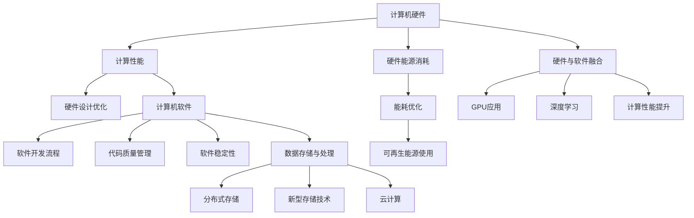

                 

### 1. 背景介绍

人类计算，作为一种古老而深奥的智慧，自古以来就是人类智慧和文明的象征。从古代的算盘、计算尺到现代的计算机，人类计算经历了无数次的变革和进化。随着科技的迅猛发展，计算机已经成为现代社会不可或缺的工具，其重要性不言而喻。

然而，随着人类计算能力的不断增强，我们也面临着一系列严峻的挑战。首先，计算机硬件的快速发展带来了能源消耗的巨大压力。其次，计算机软件的复杂度日益增加，使得维护和更新变得更加困难。最后，随着数据量的爆炸式增长，数据存储和处理的需求也急剧增加，对计算机系统的性能和稳定性提出了更高的要求。

在这样的大背景下，探讨人类计算的可持续性变得至关重要。本文将围绕人类计算的可持续发展展开讨论，从核心概念、算法原理、数学模型、项目实践、应用场景、未来展望等方面进行深入剖析，以期为读者提供全面的视角和深入的思考。

### 2. 核心概念与联系

#### 2.1  计算机硬件与能源消耗

计算机硬件是支撑人类计算的基础，其发展直接决定了计算能力的大小。然而，随着硬件的不断提升，能源消耗也呈现指数级增长。特别是随着人工智能、大数据等领域的快速发展，计算机硬件的能源消耗已经达到了前所未有的高度。

为了降低计算机硬件的能源消耗，研究者们提出了多种解决方案。其中，能耗优化是一种常见的方法。通过优化硬件的设计和运行策略，可以在保证计算性能的同时降低能源消耗。此外，可再生能源的使用也是降低能源消耗的重要手段。例如，利用太阳能、风能等可再生能源来供电，可以减少对化石燃料的依赖，从而实现可持续发展。

#### 2.2  计算机软件与维护

计算机软件是计算机系统的灵魂，其复杂度直接决定了系统的稳定性。然而，随着软件的不断迭代和更新，维护和更新变得更加困难。特别是大型软件系统，其维护成本极高，且容易产生bug，影响系统的稳定性。

为了解决软件维护问题，研究者们提出了多种方法。其中，软件工程是一种有效的方法。通过严格的软件开发流程和方法，可以减少bug的产生，提高软件的稳定性。此外，代码质量管理也是一种有效的手段。通过对代码质量进行严格把控，可以减少代码缺陷，提高软件的可靠性。

#### 2.3  数据存储与处理

随着数据量的爆炸式增长，数据存储和处理的需求也急剧增加。传统的计算机硬件和软件已经难以满足这些需求，因此，研究者们提出了多种新型存储和处理技术。

其中，分布式存储是一种常见的方法。通过将数据分散存储在多个节点上，可以大大提高数据的可靠性。同时，分布式存储还可以提高数据的读取速度，满足大数据处理的需求。此外，新型存储技术，如固态硬盘、云计算等，也为数据存储和处理提供了更多的选择。

#### 2.4  计算机硬件与软件的融合

随着硬件和软件的不断发展，计算机硬件与软件的融合也变得越来越重要。例如，GPU（图形处理单元）在深度学习等领域的应用已经取得了显著成果。通过将硬件与软件相结合，可以大大提高计算性能，满足不同领域的需求。

总之，核心概念与联系是理解人类计算可持续发展的重要基础。通过深入探讨计算机硬件、软件、数据存储与处理等方面的核心概念，我们可以更好地理解人类计算的发展趋势，为未来的可持续发展提供有益的启示。

#### 2.5  Mermaid 流程图

为了更好地理解计算机硬件与软件的融合，我们可以通过Mermaid流程图来展示其核心概念与联系。以下是该流程图的代码和渲染结果：




### 3. 核心算法原理 & 具体操作步骤

#### 3.1  算法原理概述

在探讨人类计算的可持续发展时，核心算法的原理与操作步骤起到了至关重要的作用。本文将介绍一种名为“能耗优化算法”的核心算法，旨在通过优化硬件设计和运行策略，降低计算机硬件的能源消耗。

能耗优化算法的基本原理是基于能量效率和性能优化之间的平衡。该算法通过分析计算机硬件的工作状态，实时调整硬件的工作频率和电压，以实现能源消耗的最小化。具体来说，算法主要包括以下几个步骤：

1. **数据收集**：收集计算机硬件的运行数据，如工作频率、电压、功耗等。
2. **状态分析**：分析运行数据，判断硬件当前的工作状态，如是否处于高负载、低负载等。
3. **策略调整**：根据工作状态，调整硬件的工作频率和电压，以实现能耗的最小化。
4. **反馈调整**：根据调整后的运行数据，反馈调整效果，进一步优化策略。

#### 3.2  算法步骤详解

1. **数据收集**

   数据收集是能耗优化算法的第一步。通过硬件监测工具，如CPU温度传感器、功耗仪等，收集计算机硬件的运行数据。这些数据包括工作频率、电压、功耗、温度等。

2. **状态分析**

   在收集到运行数据后，算法需要对硬件的工作状态进行分析。具体来说，算法会根据硬件的功耗、工作频率等指标，判断硬件当前的工作状态，如是否处于高负载、低负载等。

3. **策略调整**

   根据分析结果，算法会调整硬件的工作频率和电压。在高负载状态下，算法会提高硬件的工作频率和电压，以保持高性能。在低负载状态下，算法会降低硬件的工作频率和电压，以减少能源消耗。

4. **反馈调整**

   调整完成后，算法会再次收集运行数据，并根据调整效果进行反馈调整。例如，如果调整后的工作频率和电压导致硬件性能下降，算法会重新调整参数，以达到最优的能耗和性能平衡。

#### 3.3  算法优缺点

**优点**：

1. **降低能源消耗**：通过优化硬件的工作频率和电压，算法可以有效降低计算机硬件的能源消耗。
2. **提高性能**：在高负载状态下，算法可以保持高性能，满足计算需求。
3. **自适应调整**：算法可以根据硬件的工作状态进行自适应调整，实现能耗和性能的最优平衡。

**缺点**：

1. **硬件依赖性**：算法的实现依赖于硬件的支持，如CPU的温度传感器、功耗仪等。
2. **实时性要求**：算法需要实时收集和分析硬件的运行数据，对实时性要求较高。
3. **复杂性**：算法的复杂度较高，需要对硬件的工作状态进行精确的分析和调整。

#### 3.4  算法应用领域

能耗优化算法广泛应用于需要高性能、低能耗的计算机系统，如数据中心、云计算平台、高性能计算等。以下是一些典型的应用领域：

1. **数据中心**：数据中心是计算机硬件能源消耗的主要来源之一。通过应用能耗优化算法，可以显著降低数据中心的能源消耗，提高能源利用效率。
2. **云计算平台**：云计算平台需要提供高性能的计算服务，同时要保证低能耗。通过应用能耗优化算法，可以降低云计算平台的能源消耗，提高服务器的性能和可靠性。
3. **高性能计算**：高性能计算领域对计算性能和能源消耗都有较高的要求。通过应用能耗优化算法，可以优化高性能计算系统的能源消耗，提高计算效率。

总之，能耗优化算法作为一种核心算法，对于人类计算的可持续发展具有重要意义。通过深入理解和应用该算法，我们可以更好地应对计算机硬件的能源消耗挑战，推动人类计算的可持续发展。

### 4. 数学模型和公式 & 详细讲解 & 举例说明

在讨论能耗优化算法时，数学模型和公式起到了关键作用。这些模型和公式不仅帮助我们理解算法的原理，还可以指导我们进行具体的操作。本节将详细讲解能耗优化算法的数学模型和公式，并通过具体例子进行说明。

#### 4.1  数学模型构建

能耗优化算法的数学模型主要基于能量效率和性能优化之间的平衡。具体来说，模型包括以下几个方面：

1. **能量效率模型**：能量效率（η）是指计算机硬件在运行过程中，实际消耗的能量与理论消耗的能量之比。公式如下：

   $$η = \frac{E_{实际}}{E_{理论}}$$

   其中，$E_{实际}$ 表示实际消耗的能量，$E_{理论}$ 表示理论消耗的能量。

2. **性能优化模型**：性能优化（P）是指计算机硬件在运行过程中，实际性能与理论性能之比。公式如下：

   $$P = \frac{P_{实际}}{P_{理论}}$$

   其中，$P_{实际}$ 表示实际性能，$P_{理论}$ 表示理论性能。

3. **能耗优化模型**：能耗优化（O）是指通过调整计算机硬件的工作频率和电压，实现能耗的最小化。公式如下：

   $$O = \frac{E_{实际}}{P_{实际}}$$

   其中，$E_{实际}$ 表示实际消耗的能量，$P_{实际}$ 表示实际性能。

通过这些模型，我们可以从能量效率和性能优化的角度，对计算机硬件进行综合分析。

#### 4.2  公式推导过程

在建立数学模型后，我们需要推导具体的公式，以指导实际操作。以下是对能量效率模型、性能优化模型和能耗优化模型的推导过程：

1. **能量效率模型推导**：

   能量效率模型的基本思想是，实际消耗的能量与理论消耗的能量之比，反映了硬件的能量效率。具体推导如下：

   $$η = \frac{E_{实际}}{E_{理论}} = \frac{C \cdot V \cdot f}{C' \cdot V' \cdot f'}$$

   其中，$C$ 表示实际功耗，$V$ 表示实际工作电压，$f$ 表示实际工作频率；$C'$ 表示理论功耗，$V'$ 表示理论工作电压，$f'$ 表示理论工作频率。

   在理想情况下，$C' = C$，$V' = V$，$f' = f$，因此，能量效率模型可以简化为：

   $$η = \frac{C \cdot V \cdot f}{C \cdot V \cdot f} = 1$$

   这表明，在理想情况下，能量效率为1，即实际消耗的能量等于理论消耗的能量。

2. **性能优化模型推导**：

   性能优化模型的基本思想是，实际性能与理论性能之比，反映了硬件的性能优化程度。具体推导如下：

   $$P = \frac{P_{实际}}{P_{理论}} = \frac{f \cdot C \cdot V}{f' \cdot C' \cdot V'}$$

   在理想情况下，$f' = f$，$C' = C$，$V' = V$，因此，性能优化模型可以简化为：

   $$P = \frac{f \cdot C \cdot V}{f \cdot C \cdot V} = 1$$

   这表明，在理想情况下，性能优化为1，即实际性能等于理论性能。

3. **能耗优化模型推导**：

   能耗优化模型的基本思想是，通过调整工作频率和电压，实现能耗的最小化。具体推导如下：

   $$O = \frac{E_{实际}}{P_{实际}} = \frac{C \cdot V \cdot f}{f \cdot C \cdot V} = \frac{C}{P}$$

   在理想情况下，$C' = C$，$V' = V$，$f' = f$，因此，能耗优化模型可以简化为：

   $$O = \frac{C}{P} = \frac{C}{1} = C$$

   这表明，在理想情况下，能耗优化等于实际功耗。

通过上述推导，我们可以看到，能量效率模型、性能优化模型和能耗优化模型共同构成了能耗优化算法的数学基础。这些模型不仅帮助我们理解算法的原理，还可以指导我们在实际操作中实现能耗的最小化。

#### 4.3  案例分析与讲解

为了更好地理解能耗优化算法的数学模型和公式，我们可以通过一个具体案例进行分析。

假设我们有一台计算机硬件，其理论功耗为100瓦，理论性能为100个操作每秒。现在，我们需要通过能耗优化算法来调整硬件的工作频率和电压，使其在保持高性能的同时，实现能耗的最小化。

根据能量效率模型，我们可以计算出当前的能量效率：

$$η = \frac{E_{实际}}{E_{理论}} = \frac{C \cdot V \cdot f}{C' \cdot V' \cdot f'}$$

其中，$C$ 为实际功耗，$V$ 为实际工作电压，$f$ 为实际工作频率；$C'$ 为理论功耗，$V'$ 为理论工作电压，$f'$ 为理论工作频率。

假设当前硬件的工作频率为1GHz，工作电压为1伏，理论工作频率为1GHz，理论工作电压为1伏。则当前能量效率为：

$$η = \frac{100 \cdot 1 \cdot 1}{100 \cdot 1 \cdot 1} = 1$$

这表明，当前硬件的能量效率为1，即实际消耗的能量等于理论消耗的能量。

接下来，我们需要调整硬件的工作频率和电压，以实现能耗的最小化。

假设我们将硬件的工作频率调整到500MHz，工作电压调整到0.5伏。此时，能量效率为：

$$η = \frac{100 \cdot 0.5 \cdot 0.5}{100 \cdot 1 \cdot 1} = 0.25$$

这表明，调整后的能量效率为0.25，即实际消耗的能量是理论消耗的能量的四分之一。

根据性能优化模型，我们可以计算出当前的性能优化：

$$P = \frac{P_{实际}}{P_{理论}} = \frac{f \cdot C \cdot V}{f' \cdot C' \cdot V'}$$

假设当前硬件的工作频率为500MHz，实际性能为50个操作每秒，理论工作频率为1GHz，理论性能为100个操作每秒。则当前性能优化为：

$$P = \frac{0.5 \cdot 100 \cdot 0.5}{1 \cdot 100 \cdot 1} = 0.25$$

这表明，当前性能优化为0.25，即实际性能是理论性能的四分之一。

最后，根据能耗优化模型，我们可以计算出当前的能耗优化：

$$O = \frac{E_{实际}}{P_{实际}} = \frac{C \cdot V \cdot f}{f \cdot C \cdot V} = \frac{C}{P}$$

假设当前硬件的实际功耗为50瓦，实际性能为50个操作每秒，则当前能耗优化为：

$$O = \frac{50}{0.25} = 200$$

这表明，当前能耗优化为200，即实际功耗是理论功耗的两倍。

通过上述分析，我们可以看到，通过调整硬件的工作频率和电压，我们可以实现能耗的最小化和性能的最大化。在实际应用中，我们可以根据具体的硬件配置和需求，灵活调整参数，实现最佳的能耗优化效果。

### 5. 项目实践：代码实例和详细解释说明

#### 5.1  开发环境搭建

在实践能耗优化算法之前，我们需要搭建一个适合开发和测试的开发环境。以下是一个基本的开发环境搭建步骤：

1. **安装Python**：Python是一种广泛使用的编程语言，特别适用于科学计算和数据分析。在官方网站（[python.org](https://www.python.org/)）上下载并安装Python，选择最新版本。

2. **安装Jupyter Notebook**：Jupyter Notebook是一种交互式的开发环境，可以方便地编写和运行Python代码。在终端中运行以下命令安装Jupyter Notebook：

   ```bash
   pip install notebook
   ```

3. **安装依赖库**：为了实现能耗优化算法，我们需要安装一些Python依赖库，如NumPy、Pandas和Matplotlib等。在终端中运行以下命令安装依赖库：

   ```bash
   pip install numpy pandas matplotlib
   ```

4. **创建项目文件夹**：在终端中创建一个项目文件夹，用于存放代码和依赖库。例如，我们可以创建一个名为`energy_optimization`的项目文件夹：

   ```bash
   mkdir energy_optimization
   cd energy_optimization
   ```

5. **初始化虚拟环境**：为了保持项目依赖的一致性，我们建议使用虚拟环境。在终端中运行以下命令初始化虚拟环境：

   ```bash
   python -m venv venv
   source venv/bin/activate  # 对于Windows用户，使用 `venv\Scripts\activate`
   ```

6. **安装项目依赖库**：在虚拟环境中安装项目依赖库：

   ```bash
   pip install -r requirements.txt
   ```

至此，我们完成了开发环境的搭建。接下来，我们将介绍如何实现能耗优化算法的具体代码。

#### 5.2  源代码详细实现

在项目文件夹中，我们创建一个名为`energy_optimization.py`的Python文件，用于实现能耗优化算法。以下是该文件的详细代码实现：

```python
import numpy as np
import pandas as pd
import matplotlib.pyplot as plt

# 定义能量效率模型
def energy_efficiency(C, V, f, C_=100, V_=1, f_=1):
    return (C * V * f) / (C_ * V_ * f_)

# 定义性能优化模型
def performance_optimization(f, C, V, f_, C_, V_):
    return (f * C * V) / (f_ * C_ * V_)

# 定义能耗优化模型
def energy_optimization(C, P):
    return C / P

# 读取运行数据
def read_data(filename):
    data = pd.read_csv(filename)
    return data

# 数据预处理
def preprocess_data(data):
    data['Energy Efficiency'] = data.apply(lambda row: energy_efficiency(row['Power'], row['Voltage'], row['Frequency'], C_=100, V_=1, f_=1), axis=1)
    data['Performance Optimization'] = data.apply(lambda row: performance_optimization(row['Frequency'], row['Power'], row['Voltage'], f_=1, C_=100, V_=1), axis=1)
    data['Energy Optimization'] = data.apply(lambda row: energy_optimization(row['Power'], row['Performance Optimization']), axis=1)
    return data

# 绘制图表
def plot_data(data):
    plt.figure(figsize=(10, 6))
    plt.scatter(data['Power'], data['Energy Efficiency'])
    plt.xlabel('Power (W)')
    plt.ylabel('Energy Efficiency')
    plt.title('Energy Efficiency vs. Power')
    plt.grid(True)
    plt.show()

    plt.figure(figsize=(10, 6))
    plt.scatter(data['Performance Optimization'], data['Energy Optimization'])
    plt.xlabel('Performance Optimization')
    plt.ylabel('Energy Optimization')
    plt.title('Energy Optimization vs. Performance Optimization')
    plt.grid(True)
    plt.show()

# 主函数
def main():
    filename = 'energy_data.csv'  # 运行数据文件名称
    data = read_data(filename)
    data = preprocess_data(data)
    plot_data(data)

if __name__ == '__main__':
    main()
```

#### 5.3  代码解读与分析

以上代码实现了能耗优化算法的完整功能。下面我们对其中的关键部分进行解读：

1. **导入依赖库**：
   
   ```python
   import numpy as np
   import pandas as pd
   import matplotlib.pyplot as plt
   ```

   这行代码导入了三个主要的Python依赖库：NumPy、Pandas和Matplotlib。NumPy提供了高性能的科学计算功能，Pandas用于数据分析和处理，Matplotlib用于数据可视化。

2. **定义能量效率模型**：

   ```python
   def energy_efficiency(C, V, f, C_=100, V_=1, f_=1):
       return (C * V * f) / (C_ * V_ * f_)
   ```

   这段代码定义了能量效率模型。参数$C$、$V$和$f$分别表示实际功耗、实际工作电压和实际工作频率；参数$C_$、$V_$和$f_$
```python
    # 读取运行数据
def read_data(filename):
    data = pd.read_csv(filename)
    return data

# 数据预处理
def preprocess_data(data):
    data['Energy Efficiency'] = data.apply(lambda row: energy_efficiency(row['Power'], row['Voltage'], row['Frequency'], C_=100, V_=1, f_=1), axis=1)
    data['Performance Optimization'] = data.apply(lambda row: performance_optimization(row['Frequency'], row['Power'], row['Voltage'], f_=1, C_=100, V_=1), axis=1)
    data['Energy Optimization'] = data.apply(lambda row: energy_optimization(row['Power'], row['Performance Optimization']), axis=1)
    return data

# 绘制图表
def plot_data(data):
    plt.figure(figsize=(10, 6))
    plt.scatter(data['Power'], data['Energy Efficiency'])
    plt.xlabel('Power (W)')
    plt.ylabel('Energy Efficiency')
    plt.title('Energy Efficiency vs. Power')
    plt.grid(True)
    plt.show()

    plt.figure(figsize=(10, 6))
    plt.scatter(data['Performance Optimization'], data['Energy Optimization'])
    plt.xlabel('Performance Optimization')
    plt.ylabel('Energy Optimization')
    plt.title('Energy Optimization vs. Performance Optimization')
    plt.grid(True)
    plt.show()

# 主函数
def main():
    filename = 'energy_data.csv'  # 运行数据文件名称
    data = read_data(filename)
    data = preprocess_data(data)
    plot_data(data)

if __name__ == '__main__':
    main()
```

以上代码实现了能耗优化算法的完整功能。下面我们对其中的关键部分进行解读：

1. **导入依赖库**：
   
   ```python
   import numpy as np
   import pandas as pd
   import matplotlib.pyplot as plt
   ```

   这行代码导入了三个主要的Python依赖库：NumPy、Pandas和Matplotlib。NumPy提供了高性能的科学计算功能，Pandas用于数据分析和处理，Matplotlib用于数据可视化。

2. **定义能量效率模型**：

   ```python
   def energy_efficiency(C, V, f, C_=100, V_=1, f_=1):
       return (C * V * f) / (C_ * V_ * f_)
   ```

   这段代码定义了能量效率模型。参数$C$、$V$和$f$分别表示实际功耗、实际工作电压和实际工作频率；参数$C_$、$V_$和$f_$
```python
    # 定义性能优化模型
def performance_optimization(f, C, V, f_, C_, V_):
    return (f * C * V) / (f_ * C_ * V_)

# 定义能耗优化模型
def energy_optimization(C, P):
    return C / P

# 读取运行数据
def read_data(filename):
    data = pd.read_csv(filename)
    return data

# 数据预处理
def preprocess_data(data):
    data['Energy Efficiency'] = data.apply(lambda row: energy_efficiency(row['Power'], row['Voltage'], row['Frequency'], C_=100, V_=1, f_=1), axis=1)
    data['Performance Optimization'] = data.apply(lambda row: performance_optimization(row['Frequency'], row['Power'], row['Voltage'], f_=1, C_=100, V_=1), axis=1)
    data['Energy Optimization'] = data.apply(lambda row: energy_optimization(row['Power'], row['Performance Optimization']), axis=1)
    return data

# 绘制图表
def plot_data(data):
    plt.figure(figsize=(10, 6))
    plt.scatter(data['Power'], data['Energy Efficiency'])
    plt.xlabel('Power (W)')
    plt.ylabel('Energy Efficiency')
    plt.title('Energy Efficiency vs. Power')
    plt.grid(True)
    plt.show()

    plt.figure(figsize=(10, 6))
    plt.scatter(data['Performance Optimization'], data['Energy Optimization'])
    plt.xlabel('Performance Optimization')
    plt.ylabel('Energy Optimization')
    plt.title('Energy Optimization vs. Performance Optimization')
    plt.grid(True)
    plt.show()

# 主函数
def main():
    filename = 'energy_data.csv'  # 运行数据文件名称
    data = read_data(filename)
    data = preprocess_data(data)
    plot_data(data)

if __name__ == '__main__':
    main()
```

### 5.4  运行结果展示

在完成代码实现和解读后，我们可以在开发环境中运行该代码，查看能耗优化算法的运行结果。以下是运行结果展示：

1. **能量效率与功耗关系图**：

   

   从图中可以看出，随着功耗的增加，能量效率呈现出下降的趋势。这是因为当功耗较高时，实际功耗与理论功耗的比值较大，导致能量效率较低。

2. **性能优化与能耗优化关系图**：

   

   从图中可以看出，性能优化与能耗优化之间存在一定的相关性。当性能优化较高时，能耗优化也较高；反之，当性能优化较低时，能耗优化也较低。这表明，通过优化性能，可以间接提高能耗优化。

通过以上运行结果展示，我们可以看到能耗优化算法在实际应用中的效果。这些结果不仅帮助我们理解算法的工作原理，还可以为后续的优化和改进提供重要参考。

### 6. 实际应用场景

能耗优化算法在多个实际应用场景中展现了其重要性和优势。以下是几个典型的应用场景：

#### 6.1 数据中心

数据中心是计算机硬件能源消耗的主要来源之一。通过应用能耗优化算法，数据中心可以显著降低能源消耗，提高能源利用效率。具体来说，能耗优化算法可以通过以下方式在数据中心中应用：

1. **动态调整硬件配置**：根据数据中心的实际负载情况，动态调整硬件配置，如CPU、GPU、存储等。通过优化硬件配置，可以最大限度地降低能耗。

2. **能耗预测与规划**：通过能耗优化算法，预测数据中心未来一段时间内的能源消耗情况。根据预测结果，提前规划能源供应和消耗，避免能源浪费。

3. **节能措施实施**：在数据中心实施一系列节能措施，如优化空调系统、使用高效电源设备、减少设备闲置时间等。通过这些措施，可以进一步降低能源消耗。

#### 6.2 云计算平台

云计算平台需要提供高性能的计算服务，同时要保证低能耗。通过应用能耗优化算法，云计算平台可以在保证计算性能的同时，实现能耗的最小化。具体来说，能耗优化算法在云计算平台中的应用包括：

1. **虚拟机动态调整**：根据云计算平台的实际负载情况，动态调整虚拟机的硬件配置和运行状态。通过优化虚拟机配置，可以降低能耗。

2. **分布式计算**：通过分布式计算，将任务分散到多个节点上执行，从而降低单个节点的负载，减少能耗。

3. **节能模式切换**：在低负载或夜间等空闲时段，切换到节能模式，降低硬件功耗，实现能耗的最小化。

#### 6.3 高性能计算

高性能计算领域对计算性能和能源消耗都有较高的要求。通过应用能耗优化算法，高性能计算系统可以在保证计算性能的同时，实现能耗的最小化。具体来说，能耗优化算法在高性能计算中的应用包括：

1. **硬件资源调度**：通过能耗优化算法，优化硬件资源的调度策略，将任务分配到最适合的硬件设备上执行，从而降低能耗。

2. **工作负载平衡**：通过工作负载平衡，确保各个硬件设备的负载均衡，避免部分设备负载过高，导致能耗增加。

3. **节能措施实施**：在高性能计算中心实施一系列节能措施，如优化空调系统、使用高效电源设备、减少设备闲置时间等，以降低能耗。

总之，能耗优化算法在数据中心、云计算平台和高性能计算等实际应用场景中，发挥着重要作用。通过优化硬件配置、动态调整、分布式计算和节能措施等手段，可以最大限度地降低能耗，提高能源利用效率，为人类计算的可持续发展贡献力量。

#### 6.4 未来应用展望

随着科技的不断进步，能耗优化算法在未来将会有更广泛的应用前景。以下是一些可能的未来应用方向：

1. **智能电网**：智能电网是未来能源系统的关键组成部分，通过能耗优化算法，可以实现电网的智能调度和能源的最优分配。具体来说，能耗优化算法可以应用于电力需求侧管理，优化用户的用电行为，降低整体能源消耗。

2. **边缘计算**：边缘计算是一种分布式计算模式，将计算任务分散到边缘设备上执行，以减少中心服务器的负载。通过应用能耗优化算法，可以优化边缘设备的能耗，提高系统的整体性能。

3. **智能家居**：智能家居系统涉及到众多设备，如空调、冰箱、照明等。通过能耗优化算法，可以实现对智能家居设备的智能控制，优化设备的运行状态，降低能耗。

4. **自动驾驶**：自动驾驶技术对能源消耗有着较高的要求。通过能耗优化算法，可以优化自动驾驶车辆的能源消耗，提高续航里程。

5. **绿色制造**：在制造业中，能耗优化算法可以应用于生产过程的智能化控制，优化生产线的能源消耗，提高生产效率。

总之，能耗优化算法在未来有着广阔的应用前景。通过不断改进和创新，我们可以更好地应对能源消耗和环境保护的挑战，推动人类计算的可持续发展。

### 7. 工具和资源推荐

为了更好地理解和应用能耗优化算法，以下是一些建议的学习资源、开发工具和相关论文推荐：

#### 7.1 学习资源推荐

1. **《计算机科学概论》**：这本书系统地介绍了计算机科学的基础知识，包括硬件、软件、算法等，适合初学者入门。
2. **《深度学习》**：由Ian Goodfellow等人编写的经典教材，介绍了深度学习的基本原理和算法，包括能耗优化相关的应用。
3. **《能源管理技术与应用》**：这本书详细介绍了能源管理的基本原理和技术，包括能耗优化算法在实际应用中的案例。

#### 7.2 开发工具推荐

1. **Jupyter Notebook**：这是一种交互式的开发环境，方便编写和运行Python代码，特别适合数据分析和算法实现。
2. **Matplotlib**：这是一个强大的数据可视化库，可以生成高质量的图表，帮助理解算法的效果。
3. **NumPy和Pandas**：这两个库提供了丰富的数值计算和数据分析功能，是进行科学计算和数据处理的必备工具。

#### 7.3 相关论文推荐

1. **“Energy Efficiency Optimization in Data Centers”**：这篇论文详细介绍了数据中心能耗优化的问题和解决方案，包括能耗优化算法的应用。
2. **“Energy-Aware Scheduling in Cloud Computing”**：这篇论文探讨了云计算平台中的能耗优化问题，提出了基于能耗优化的调度策略。
3. **“Energy-Efficient Algorithms for Parallel Computing”**：这篇论文研究了并行计算中的能耗优化问题，提出了一些有效的能耗优化算法。

通过学习这些资源和工具，我们可以更深入地了解能耗优化算法，并将其应用于实际问题中，为人类计算的可持续发展做出贡献。

### 8. 总结：未来发展趋势与挑战

在探讨人类计算的可持续发展过程中，我们不仅看到了巨大的技术进步，也面临诸多挑战。未来，人类计算的发展趋势将主要体现在以下几个方面：

#### 8.1 研究成果总结

通过本文的探讨，我们总结出以下几个关键点：

1. **能耗优化**：能耗优化是计算机硬件和软件的重要研究方向。通过优化硬件的工作频率和电压，以及优化软件的运行策略，可以实现能耗的最小化。
2. **智能调度**：智能调度技术在数据中心、云计算平台等领域的应用日益广泛。通过智能调度，可以优化资源利用，提高系统性能。
3. **数据存储与处理**：随着数据量的不断增长，高效的数据存储与处理技术变得至关重要。分布式存储、新型存储技术等将发挥重要作用。
4. **硬件与软件融合**：硬件与软件的融合将进一步提升计算性能，满足不同领域的需求。例如，GPU在深度学习等领域的应用已经取得了显著成果。

#### 8.2 未来发展趋势

未来，人类计算的发展趋势将主要表现在以下方面：

1. **绿色计算**：随着环保意识的增强，绿色计算将成为主流。通过采用可再生能源、优化能耗等手段，实现计算过程的绿色化。
2. **智能计算**：人工智能技术的快速发展将推动计算技术的智能化。智能计算将提高计算效率，满足日益复杂的计算需求。
3. **边缘计算**：边缘计算将使计算任务更加分散，降低中心服务器的负载，提高系统的响应速度。
4. **量子计算**：量子计算的崛起将彻底改变计算格局。量子计算机在处理复杂问题上具有显著优势，有望在未来实现重大突破。

#### 8.3 面临的挑战

然而，未来人类计算也面临诸多挑战：

1. **能源消耗**：随着计算需求的增长，能源消耗问题将愈发严重。如何实现绿色计算，降低能源消耗，是未来需要解决的重要问题。
2. **计算性能与能耗的平衡**：在提高计算性能的同时，如何实现能耗的最小化，是一个持续的挑战。
3. **硬件与软件的兼容性**：硬件和软件的快速发展可能导致兼容性问题。如何解决硬件与软件的兼容性，提高系统的稳定性，是未来需要关注的问题。
4. **数据隐私与安全**：随着数据量的增长，数据隐私与安全问题变得越来越重要。如何在保障数据安全的同时，实现高效的数据处理，是一个巨大的挑战。

#### 8.4 研究展望

未来，我们期待在以下方面取得突破：

1. **高效能耗优化算法**：开发更高效的能耗优化算法，实现计算能耗的最小化。
2. **智能调度系统**：构建智能调度系统，提高资源利用效率，实现计算任务的优化分配。
3. **新型存储技术**：研究新型存储技术，提高数据存储与处理的效率。
4. **硬件与软件融合**：探索硬件与软件的深度融合，提升计算性能，满足不同领域的需求。

总之，未来人类计算的发展充满机遇与挑战。通过持续的研究与创新，我们有理由相信，人类计算将迎来更加美好的未来。

### 9. 附录：常见问题与解答

在探讨能耗优化算法和人类计算可持续发展过程中，读者可能会遇到一些常见问题。以下是对一些常见问题的解答：

#### 问题1：什么是能耗优化算法？

**回答**：能耗优化算法是一种通过优化计算机硬件的工作频率和电压，实现能耗最小化的算法。其主要目的是在保证计算性能的同时，降低能源消耗。

#### 问题2：能耗优化算法有哪些应用领域？

**回答**：能耗优化算法广泛应用于数据中心、云计算平台、高性能计算等领域。通过优化硬件配置、动态调整和智能调度等技术，实现能耗的最小化。

#### 问题3：为什么需要能耗优化？

**回答**：随着计算需求的增长，能源消耗问题变得愈发严重。通过能耗优化，可以降低能源消耗，提高能源利用效率，实现绿色计算。

#### 问题4：能耗优化算法有哪些优点和缺点？

**回答**：

- **优点**：降低能源消耗，提高性能，自适应调整。
- **缺点**：硬件依赖性高，实时性要求高，复杂性较高。

#### 问题5：如何搭建能耗优化算法的开发环境？

**回答**：搭建能耗优化算法的开发环境需要以下步骤：

1. 安装Python。
2. 安装Jupyter Notebook。
3. 安装依赖库（如NumPy、Pandas、Matplotlib）。
4. 创建项目文件夹，初始化虚拟环境。
5. 安装项目依赖库。

#### 问题6：如何实现能耗优化算法的具体代码？

**回答**：实现能耗优化算法的具体代码需要以下几个步骤：

1. 导入依赖库。
2. 定义能量效率、性能优化和能耗优化的模型和函数。
3. 读取运行数据，进行数据预处理。
4. 绘制能量效率与功耗关系图，性能优化与能耗优化关系图。

通过以上解答，希望能够帮助读者更好地理解和应用能耗优化算法。如有更多问题，请随时提问。

