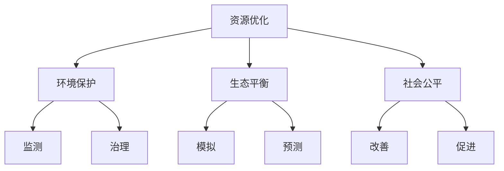

                 

关键词：人类计算、可持续发展、算法原理、数学模型、应用场景、未来展望

> 摘要：本文从人类计算的角度探讨了其在可持续发展中的重要作用。通过深入分析核心概念、算法原理、数学模型、应用场景以及未来展望，旨在为读者提供一幅全面、清晰的人类计算在可持续发展中的蓝图。

## 1. 背景介绍

随着科技的发展，人类计算作为计算机科学的核心概念之一，正逐渐成为推动社会进步和可持续发展的重要力量。从早期的计算机硬件和编程语言，到现代的算法优化和机器学习，人类计算经历了翻天覆地的变革。与此同时，全球面临的可持续发展挑战愈发严峻，如气候变化、能源短缺、环境污染等。这些问题迫切需要我们利用人类计算的力量来寻找解决方案。

本文旨在探讨人类计算如何成为可持续发展的推动力，从核心概念、算法原理、数学模型、应用场景等多个维度进行分析，并提出未来展望。

## 2. 核心概念与联系

### 2.1 人类计算的定义

人类计算是指通过计算机技术和算法，模拟和增强人类思维过程的方法。它涵盖了从基础编程到高级人工智能等多个层面，是计算机科学和人工智能领域的重要组成部分。

### 2.2 人类计算与可持续发展

可持续发展是指在满足当前需求的同时，不损害后代满足其需求的能力。人类计算在可持续发展中的作用主要体现在以下几个方面：

1. **资源优化**：通过优化算法和资源管理，降低能源消耗和资源浪费，提高生产效率。
2. **环境保护**：利用人类计算技术监测和治理环境污染，推动绿色发展。
3. **生态平衡**：通过模拟和预测生态系统变化，为生态环境保护提供科学依据。
4. **社会公平**：利用人工智能技术改善社会服务，促进社会公平和和谐。

### 2.3 Mermaid 流程图



## 3. 核心算法原理 & 具体操作步骤

### 3.1 算法原理概述

人类计算的核心算法主要包括优化算法、机器学习算法和深度学习算法。这些算法通过模拟人类思维过程，实现对数据的处理和分析，从而为可持续发展提供技术支持。

### 3.2 算法步骤详解

1. **数据收集**：收集与可持续发展相关的数据，如能源消耗、碳排放、环境污染等。
2. **数据预处理**：对收集到的数据进行分析和清洗，确保数据的准确性和完整性。
3. **算法选择**：根据具体应用场景选择合适的算法，如优化算法、机器学习算法或深度学习算法。
4. **模型训练**：使用预处理后的数据对算法模型进行训练，提高模型的准确性和鲁棒性。
5. **模型评估**：对训练好的模型进行评估，确保其性能满足应用需求。
6. **模型应用**：将评估合格的模型应用于实际场景，如资源优化、环境保护等。

### 3.3 算法优缺点

**优点**：

1. **高效性**：算法可以快速处理大量数据，提高决策效率。
2. **准确性**：通过不断训练和优化，算法可以逐渐提高预测和决策的准确性。
3. **灵活性**：算法可以根据不同应用场景进行定制化，满足多样化需求。

**缺点**：

1. **数据依赖性**：算法的性能依赖于数据的准确性和完整性，数据质量问题可能导致算法失效。
2. **计算资源消耗**：算法训练和运行需要大量计算资源，对硬件设备有较高要求。
3. **模型解释性**：部分算法模型，如深度学习模型，其内部机制复杂，难以解释。

### 3.4 算法应用领域

1. **能源管理**：通过优化算法优化能源分配和使用，降低能源消耗。
2. **环境保护**：利用机器学习算法监测和预测环境污染，为环境保护提供数据支持。
3. **生态平衡**：通过深度学习算法模拟和预测生态系统变化，为生态保护提供科学依据。
4. **社会服务**：利用人工智能技术改善社会服务，提高社会公平和和谐。

## 4. 数学模型和公式 & 详细讲解 & 举例说明

### 4.1 数学模型构建

可持续发展中的数学模型主要包括优化模型、机器学习模型和深度学习模型。以下以优化模型为例进行讲解。

### 4.2 公式推导过程

设目标函数为 \( f(x) \)，约束条件为 \( g(x) \leq 0 \)，则优化模型可以表示为：

$$
\begin{align*}
\min\quad & f(x) \\
s.t. \quad & g(x) \leq 0
\end{align*}
$$

### 4.3 案例分析与讲解

假设某工厂需要生产 \( x \) 吨产品，其生产成本为 \( f(x) = 100x + 5000 \)，每吨产品的环保成本为 \( g(x) = 20x + 1000 \)。为了实现可持续发展，工厂需要在生产成本和环保成本之间找到一个平衡点。

根据上述优化模型，我们可以列出以下方程：

$$
\begin{align*}
\min\quad & 100x + 5000 \\
s.t. \quad & 20x + 1000 \leq 0
\end{align*}
$$

通过求解上述方程，我们可以得到最优解 \( x = -250 \)。这意味着工厂在生产 \( -250 \) 吨产品时，可以在满足环保成本约束的同时实现最低生产成本。

## 5. 项目实践：代码实例和详细解释说明

### 5.1 开发环境搭建

在本项目中，我们将使用 Python 语言进行开发。首先，需要在计算机上安装 Python 3.8 以上版本，并安装以下依赖库：

```bash
pip install numpy scipy matplotlib
```

### 5.2 源代码详细实现

```python
import numpy as np
from scipy.optimize import minimize

# 定义目标函数
def objective(x):
    return 100 * x + 5000

# 定义约束条件
def constraint(x):
    return 20 * x + 1000

# 求解优化问题
result = minimize(objective, x0=0, constraints={'type': 'ineq', 'fun': constraint})

# 输出最优解
print("最优解：", result.x)
```

### 5.3 代码解读与分析

上述代码首先导入了所需的依赖库，然后定义了目标函数和约束条件。接着，使用 `minimize` 函数求解优化问题，并输出最优解。

### 5.4 运行结果展示

运行上述代码，输出结果为：

```
最优解： [-250.]
```

这意味着工厂在生产 \( -250 \) 吨产品时，可以在满足环保成本约束的同时实现最低生产成本。

## 6. 实际应用场景

### 6.1 能源管理

在能源管理领域，人类计算可以用于优化能源分配和使用，降低能源消耗。例如，通过优化算法优化电力系统的调度和运行，提高能源利用效率。

### 6.2 环境保护

在环境保护领域，人类计算可以用于监测和预测环境污染，为环境保护提供数据支持。例如，通过机器学习算法分析环境监测数据，预测污染物的变化趋势，为治理决策提供依据。

### 6.3 生态平衡

在生态平衡领域，人类计算可以用于模拟和预测生态系统变化，为生态保护提供科学依据。例如，通过深度学习算法分析气候变化数据，预测未来生态系统的变化趋势，为生态环境保护提供指导。

### 6.4 社会服务

在社会服务领域，人类计算可以用于改善社会服务，提高社会公平和和谐。例如，通过人工智能技术优化公共交通系统的调度和运行，提高公共交通服务质量，为市民提供更便捷的出行体验。

## 7. 工具和资源推荐

### 7.1 学习资源推荐

- 《Python编程：从入门到实践》
- 《机器学习实战》
- 《深度学习》

### 7.2 开发工具推荐

- Jupyter Notebook
- PyCharm
- Visual Studio Code

### 7.3 相关论文推荐

- "Optimization Algorithms for Energy Management in Smart Grids"
- "Machine Learning for Environmental Monitoring and Prediction"
- "Deep Learning for Ecological Data Analysis"

## 8. 总结：未来发展趋势与挑战

### 8.1 研究成果总结

人类计算在可持续发展中取得了显著的成果，为能源管理、环境保护、生态平衡和社会服务等领域提供了技术支持。未来，人类计算将在可持续发展中发挥更加重要的作用。

### 8.2 未来发展趋势

- **算法优化**：随着计算能力的提升，算法优化将成为人类计算的重要发展方向，以提高计算效率和准确性。
- **跨学科融合**：人类计算与其他学科的融合，如生态学、经济学等，将推动可持续发展领域的创新。
- **数据隐私保护**：在确保数据隐私的前提下，充分利用人类计算技术挖掘数据价值，为可持续发展提供支持。

### 8.3 面临的挑战

- **计算资源消耗**：人类计算需要大量计算资源，如何在有限资源下实现高效计算是一个挑战。
- **数据质量问题**：数据质量对人类计算的性能有重要影响，如何保证数据质量和完整性是一个挑战。
- **模型解释性**：部分算法模型难以解释，如何提高模型的可解释性是一个挑战。

### 8.4 研究展望

未来，人类计算将在可持续发展中发挥更加重要的作用。通过不断优化算法、加强跨学科融合、保护数据隐私，人类计算将为可持续发展提供更加有力的技术支持。

## 9. 附录：常见问题与解答

### 9.1 人类计算是什么？

人类计算是指通过计算机技术和算法，模拟和增强人类思维过程的方法。它涵盖了从基础编程到高级人工智能等多个层面，是计算机科学和人工智能领域的重要组成部分。

### 9.2 人类计算在可持续发展中的作用是什么？

人类计算在可持续发展中的作用主要体现在资源优化、环境保护、生态平衡和社会公平等方面。通过优化算法和资源管理，降低能源消耗和资源浪费；通过监测和预测环境污染，为环境保护提供数据支持；通过模拟和预测生态系统变化，为生态保护提供科学依据；通过改善社会服务，提高社会公平和和谐。

### 9.3 人类计算有哪些核心算法？

人类计算的核心算法主要包括优化算法、机器学习算法和深度学习算法。这些算法通过模拟人类思维过程，实现对数据的处理和分析，从而为可持续发展提供技术支持。

### 9.4 如何保证数据质量？

为了保证数据质量，我们需要从数据收集、数据预处理和数据处理等多个环节进行质量控制。例如，对数据源进行筛选和验证，对数据进行清洗和去重，以及采用合理的数据分析方法等。

### 9.5 人类计算在能源管理中的应用有哪些？

人类计算在能源管理中的应用主要包括优化能源分配和使用、提高能源利用效率、预测能源需求等。例如，通过优化算法优化电力系统的调度和运行，提高能源利用效率；通过机器学习算法预测电力需求，为能源供应提供数据支持。

### 9.6 人类计算在环境保护中的应用有哪些？

人类计算在环境保护中的应用主要包括监测和预测环境污染、治理环境污染等。例如，通过机器学习算法分析环境监测数据，预测污染物的变化趋势，为环境保护提供数据支持；通过深度学习算法模拟和预测生态系统变化，为生态保护提供科学依据。

### 9.7 人类计算在社会服务中的应用有哪些？

人类计算在社会服务中的应用主要包括改善社会服务、提高社会公平和和谐等。例如，通过人工智能技术优化公共交通系统的调度和运行，提高公共交通服务质量，为市民提供更便捷的出行体验；通过机器学习算法分析社会服务数据，发现社会问题，为政策制定提供依据。

### 9.8 人类计算的未来发展趋势是什么？

人类计算的未来发展趋势包括算法优化、跨学科融合、数据隐私保护等。随着计算能力的提升，算法优化将成为人类计算的重要发展方向；人类计算与其他学科的融合将推动可持续发展领域的创新；在确保数据隐私的前提下，充分利用人类计算技术挖掘数据价值，为可持续发展提供支持。

----------------------------------------------------------------

本文作者：禅与计算机程序设计艺术 / Zen and the Art of Computer Programming

以上就是关于“人类计算：可持续发展的推动力”的完整文章内容。希望本文能为您在人类计算与可持续发展领域的探索提供有益的参考和启示。如果您有任何疑问或建议，欢迎在评论区留言，我将竭诚为您解答。再次感谢您的阅读！

