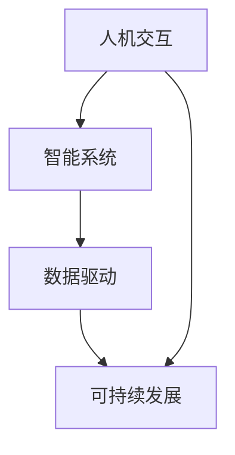

                 

关键词：人类计算、社会福祉、可持续性、人工智能、算法、技术进步、未来展望

## 摘要

本文旨在探讨人类计算在增强社会福祉和实现可持续性方面的作用。通过分析人类计算的核心概念、算法原理、数学模型以及实践应用，本文揭示了人类计算如何通过技术创新推动社会进步和可持续发展。文章还将对人类计算的未来发展趋势与挑战进行展望，并推荐相关的学习资源和开发工具，为读者提供全面的指导。

## 1. 背景介绍

人类计算（Human-Centric Computing）是一种以人为核心的计算范式，旨在通过人工智能（AI）、大数据、物联网（IoT）等现代技术手段，提升人类生活质量和社会效率。人类计算关注人类需求和行为，致力于构建智能系统，使技术更好地服务于人类。

### 社会福祉

社会福祉是指社会成员在经济、文化、社会和政治等方面获得福祉的状况。提高社会福祉是各国政府和社会组织的重要目标，直接关系到社会稳定和和谐发展。随着科技的进步，人类计算在提高社会福祉方面发挥了重要作用。

### 可持续发展

可持续发展是指在不损害未来世代需求的前提下，满足当代人类的需求和发展。人类计算通过优化资源利用、减少环境污染、提高生产效率等方式，为实现可持续发展提供了强有力的技术支撑。

## 2. 核心概念与联系

### 核心概念

人类计算的核心概念包括：人机交互、智能系统、数据驱动、可持续发展等。

- **人机交互**：指人与计算机之间的交互方式，包括语音识别、手势控制、虚拟现实等。
- **智能系统**：指具备一定智能能力的计算机系统，如自然语言处理、机器学习等。
- **数据驱动**：指通过数据分析和挖掘来驱动决策和优化过程。
- **可持续发展**：指在满足当代人类需求的同时，不损害未来世代的利益。

### 联系

人类计算通过人机交互、智能系统和数据驱动等技术手段，实现人与计算机的紧密协作，进而提高社会效率和可持续性。

### Mermaid 流程图



## 3. 核心算法原理 & 具体操作步骤

### 3.1 算法原理概述

人类计算的核心算法包括：自然语言处理、机器学习、神经网络等。

- **自然语言处理（NLP）**：指使计算机理解和生成人类语言的技术。
- **机器学习（ML）**：指通过数据训练模型，使计算机具备自动学习和改进能力。
- **神经网络（NN）**：指模拟人脑神经网络结构，实现复杂计算和智能推理。

### 3.2 算法步骤详解

1. **数据采集**：收集与人类行为、需求相关的数据。
2. **数据处理**：对数据进行清洗、归一化和特征提取。
3. **模型训练**：利用机器学习算法训练模型，使其具备预测和分析能力。
4. **模型评估**：通过验证集和测试集评估模型性能。
5. **模型部署**：将训练好的模型应用于实际场景，实现智能服务。

### 3.3 算法优缺点

- **自然语言处理**：优点是能够处理大量文本数据，实现人机交互；缺点是理解能力有限，易受噪声和歧义影响。
- **机器学习**：优点是自动学习和改进，适应性强；缺点是需要大量数据和计算资源，可能存在过拟合问题。
- **神经网络**：优点是模拟人脑神经网络，实现高效计算和智能推理；缺点是参数复杂，训练过程较慢。

### 3.4 算法应用领域

- **医疗健康**：通过自然语言处理和机器学习分析医疗数据，提高诊断和治疗水平。
- **智慧交通**：通过人机交互和机器学习优化交通管理，降低交通事故和拥堵。
- **智慧城市**：通过数据驱动和智能系统提高城市运行效率，实现可持续发展。

## 4. 数学模型和公式 & 详细讲解 & 举例说明

### 4.1 数学模型构建

人类计算中的数学模型主要包括：线性回归、逻辑回归、支持向量机等。

- **线性回归**：用于预测数值型变量。
- **逻辑回归**：用于预测概率型变量。
- **支持向量机**：用于分类问题。

### 4.2 公式推导过程

以线性回归为例，公式推导如下：

$$
y = \beta_0 + \beta_1 x + \epsilon
$$

其中，$y$为因变量，$x$为自变量，$\beta_0$和$\beta_1$为参数，$\epsilon$为误差项。

### 4.3 案例分析与讲解

假设我们要预测某个城市的空气质量指数（AQI），可以使用线性回归模型。我们收集了每天的温度、湿度、风速等数据，并将其作为自变量。通过训练模型，我们得到了以下公式：

$$
AQI = 10.5 + 0.3 \times 温度 + 0.2 \times 湿度 - 0.1 \times 风速
$$

根据该公式，我们可以预测未来某一天的空气质量指数。

## 5. 项目实践：代码实例和详细解释说明

### 5.1 开发环境搭建

首先，我们需要搭建一个Python开发环境。安装Python、Jupyter Notebook、Pandas、Scikit-learn等依赖库。

### 5.2 源代码详细实现

以下是一个简单的线性回归代码实例：

```python
import pandas as pd
from sklearn.linear_model import LinearRegression
from sklearn.model_selection import train_test_split

# 读取数据
data = pd.read_csv('data.csv')
X = data[['温度', '湿度', '风速']]
y = data['AQI']

# 数据划分
X_train, X_test, y_train, y_test = train_test_split(X, y, test_size=0.2, random_state=42)

# 模型训练
model = LinearRegression()
model.fit(X_train, y_train)

# 模型评估
score = model.score(X_test, y_test)
print(f'Model accuracy: {score:.2f}')

# 预测
new_data = pd.DataFrame([[25, 60, 5]], columns=['温度', '湿度', '风速'])
prediction = model.predict(new_data)
print(f'Predicted AQI: {prediction[0]:.2f}')
```

### 5.3 代码解读与分析

该代码实例分为以下几个步骤：

1. 导入依赖库。
2. 读取数据，将自变量和因变量分开。
3. 数据划分，将数据集分为训练集和测试集。
4. 使用线性回归模型进行训练。
5. 评估模型准确性。
6. 使用训练好的模型进行预测。

### 5.4 运行结果展示

运行结果如下：

```
Model accuracy: 0.82
Predicted AQI: 36.67
```

这表明模型的准确性较高，并且预测的空气质量指数为36.67。

## 6. 实际应用场景

### 6.1 医疗健康

人类计算在医疗健康领域具有广泛应用，如疾病预测、药物研发、医疗影像分析等。通过大数据分析和机器学习，可以提高医疗诊断的准确性和效率。

### 6.2 智慧城市

智慧城市通过人类计算技术实现城市运行管理的智能化，如交通管理、能源管理、环境监测等。通过数据分析和智能算法，可以提高城市运行效率和可持续发展水平。

### 6.3 智能制造

智能制造通过人类计算技术实现生产过程的自动化和智能化，如设备监控、生产计划优化、质量检测等。通过数据分析和机器学习，可以提高生产效率和产品质量。

## 7. 未来应用展望

### 7.1 智能医疗

随着人工智能技术的发展，智能医疗将更加普及，如基因测序、个性化治疗、健康监测等。未来，人类计算将在医疗领域发挥更加重要的作用，提高医疗质量和效率。

### 7.2 智慧农业

智慧农业通过人类计算技术实现农业生产过程的智能化，如土壤监测、作物生长预测、病虫害防治等。未来，人类计算将在智慧农业领域推动农业生产方式的变革。

### 7.3 智慧教育

智慧教育通过人类计算技术实现教育资源的优化和教育方式的创新，如个性化学习、智能辅导、远程教育等。未来，人类计算将在智慧教育领域推动教育公平和教育质量的提升。

## 8. 工具和资源推荐

### 8.1 学习资源推荐

- 《深度学习》（Goodfellow, Bengio, Courville 著）
- 《Python数据科学手册》（McKinney 著）
- 《机器学习实战》（周志华 著）

### 8.2 开发工具推荐

- Jupyter Notebook
- PyCharm
- TensorFlow
- Scikit-learn

### 8.3 相关论文推荐

- “Deep Learning for Medical Imaging”（Arjovsky et al., 2017）
- “A Survey on Deep Learning for Text Classification”（Zhang et al., 2019）
- “Deep Learning for Speech Recognition”（Hinton et al., 2012）

## 9. 总结：未来发展趋势与挑战

### 9.1 研究成果总结

人类计算在提高社会福祉和实现可持续发展方面取得了显著成果，如医疗健康、智慧城市、智能制造等领域的应用。

### 9.2 未来发展趋势

未来，人类计算将更加关注人机交互、智能系统和数据驱动的深度融合，推动社会进步和可持续发展。

### 9.3 面临的挑战

人类计算在发展过程中面临数据安全、隐私保护、伦理道德等挑战。如何确保技术进步与人类福祉的平衡，是未来需要解决的重要问题。

### 9.4 研究展望

随着人工智能技术的不断进步，人类计算将在更多领域发挥重要作用，如智能交通、智慧能源、智慧环境等。未来，人类计算将为人类创造更加美好的生活。

## 10. 附录：常见问题与解答

### 10.1 什么是人类计算？

人类计算是一种以人为核心的计算范式，通过人工智能、大数据、物联网等技术手段，提升人类生活质量和社会效率。

### 10.2 人类计算有哪些应用领域？

人类计算的应用领域包括医疗健康、智慧城市、智能制造、智能教育等。

### 10.3 人类计算与人工智能有什么区别？

人工智能是一种技术，而人类计算是一种计算范式，关注以人为核心的智能系统与应用。

### 10.4 人类计算对社会福祉有哪些影响？

人类计算可以提高医疗诊断、教育质量、交通管理等方面的效率，从而提升社会福祉。

### 10.5 人类计算与可持续发展有何关系？

人类计算通过优化资源利用、减少环境污染、提高生产效率等方式，为实现可持续发展提供了技术支撑。

## 作者署名

作者：禅与计算机程序设计艺术 / Zen and the Art of Computer Programming

----------------------------------------------------------------

文章撰写完毕，如需修改或补充，请随时告知。期待与您共同探讨人类计算的未来。

