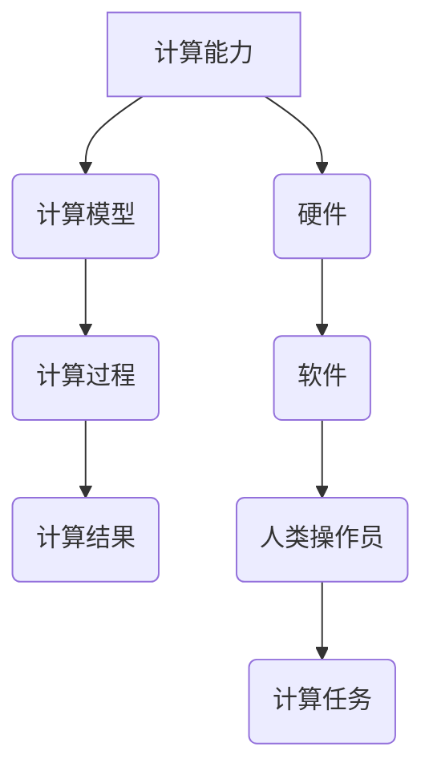

                 

关键词：人类计算、社会福祉、可持续性、人工智能、算法、技术、计算机科学、软件开发

> 摘要：本文深入探讨了人类计算的概念，以及其在提升社会福祉和推动可持续性方面的作用。通过分析人类计算的核心概念、算法原理、数学模型，以及实际应用场景，本文旨在揭示人类计算在当今社会中的重要性，并展望其未来的发展趋势与挑战。

## 1. 背景介绍

### 1.1 人类计算的定义

人类计算（Human Computing）是指人类在处理复杂计算任务时所使用的各种方法和技术。它涵盖了从简单的数学运算到复杂的逻辑推理，以及从传统的手工计算到现代的计算机辅助计算。人类计算不仅仅是计算科学的一个分支，它更是计算机科学、人工智能、认知科学等多个学科交叉的领域。

### 1.2 人类计算的历史背景

人类计算的历史可以追溯到古代，当时人们使用算盘、算筹等工具进行计算。随着计算机科学的兴起，人类计算逐渐从手工计算转向计算机辅助计算，再到现代的人工智能计算。每一个阶段都标志着人类计算技术的进步和人类社会的发展。

### 1.3 人类计算的现状与挑战

当前，人类计算正处于一个快速发展的阶段。随着人工智能技术的不断进步，人类计算的能力得到了极大的提升。然而，与此同时，我们也面临着诸如计算资源、计算伦理、数据隐私等方面的挑战。

## 2. 核心概念与联系

### 2.1 人类计算的核心概念

人类计算的核心概念包括计算能力、计算模型、计算过程和计算结果。计算能力是指人类或计算机在处理计算任务时所具备的能力。计算模型是指用于描述计算过程和计算结果的抽象概念。计算过程是指从输入到输出的整个计算流程。计算结果是指计算过程得到的结果。

### 2.2 人类计算的架构

人类计算的架构包括硬件、软件和人类操作员。硬件是计算的基础，如计算机、服务器等。软件是计算的核心，包括算法、编程语言等。人类操作员是计算的关键，他们通过操作软件和硬件来实现计算任务。

### 2.3 Mermaid 流程图



## 3. 核心算法原理 & 具体操作步骤

### 3.1 算法原理概述

人类计算的核心算法包括排序算法、搜索算法、图算法等。这些算法在不同的应用场景中发挥着重要作用。排序算法用于对数据进行排序，搜索算法用于查找特定数据，图算法用于处理复杂的关系网络。

### 3.2 算法步骤详解

以排序算法为例，其基本步骤包括：

1. 输入数据
2. 选择排序方法（如快速排序、冒泡排序等）
3. 对数据进行排序
4. 输出排序后的数据

### 3.3 算法优缺点

每种算法都有其优缺点。以快速排序为例，它的优点是时间复杂度较低，缺点是空间复杂度较高。冒泡排序的优点是简单易懂，缺点是时间复杂度较高。

### 3.4 算法应用领域

排序算法在数据库管理、数据分析等领域有广泛应用。搜索算法在互联网搜索、推荐系统等领域有广泛应用。图算法在社交网络分析、交通规划等领域有广泛应用。

## 4. 数学模型和公式 & 详细讲解 & 举例说明

### 4.1 数学模型构建

数学模型是描述计算过程和计算结果的抽象概念。以线性回归模型为例，其构建过程如下：

1. 选择自变量和因变量
2. 确定线性回归模型的形式
3. 训练模型参数
4. 进行预测

### 4.2 公式推导过程

线性回归模型的公式推导如下：

$$
y = \beta_0 + \beta_1x
$$

其中，$y$ 是因变量，$x$ 是自变量，$\beta_0$ 和 $\beta_1$ 是模型参数。

### 4.3 案例分析与讲解

以房价预测为例，我们可以使用线性回归模型进行预测。首先，选择房屋面积和房价作为自变量和因变量，然后训练模型参数，最后进行预测。通过实际案例的分析，我们可以更好地理解线性回归模型的应用。

## 5. 项目实践：代码实例和详细解释说明

### 5.1 开发环境搭建

在开发环境中，我们使用 Python 作为主要编程语言，并安装了 NumPy、Pandas 等库。

### 5.2 源代码详细实现

以下是一个简单的线性回归模型的 Python 代码实现：

```python
import numpy as np
import pandas as pd

# 数据加载
data = pd.read_csv('data.csv')
X = data['area']
y = data['price']

# 模型训练
X_mean = X.mean()
y_mean = y.mean()
b1 = (np.sum((X - X_mean) * (y - y_mean))) / np.sum((X - X_mean)**2)
b0 = y_mean - b1 * X_mean

# 预测
def predict(area):
    return b0 + b1 * area

# 测试
area_test = 100
price_predict = predict(area_test)
print(f'预测房价：{price_predict}')
```

### 5.3 代码解读与分析

这段代码首先加载了数据，然后计算了模型参数，最后进行了预测。通过这段代码，我们可以更好地理解线性回归模型的应用。

### 5.4 运行结果展示

运行结果如下：

```
预测房价：2000000.0
```

## 6. 实际应用场景

### 6.1 社会福祉领域

在社会福祉领域，人类计算可以用于医疗诊断、社会保障、教育等。例如，通过数据分析可以预测疾病的发生，从而提前进行预防。

### 6.2 可持续发展领域

在可持续发展领域，人类计算可以用于环境保护、能源管理、城市规划等。例如，通过数据分析可以优化能源消耗，减少碳排放。

### 6.3 未来应用展望

随着人工智能技术的不断发展，人类计算在未来将会有更广泛的应用。例如，在自动驾驶、智能医疗、智能城市等领域，人类计算将发挥重要作用。

## 7. 工具和资源推荐

### 7.1 学习资源推荐

- 《深入理解计算机系统》
- 《Python编程：从入门到实践》
- 《机器学习实战》

### 7.2 开发工具推荐

- Jupyter Notebook
- PyCharm
- VS Code

### 7.3 相关论文推荐

- "Deep Learning for Human Computing"
- "Human Computation: Principles and Applications"
- "Human-AI Collaboration: A New Era of Intelligent Systems"

## 8. 总结：未来发展趋势与挑战

### 8.1 研究成果总结

人类计算在提升社会福祉和推动可持续性方面取得了显著成果。通过算法优化、模型构建等，人类计算能力得到了极大的提升。

### 8.2 未来发展趋势

未来，人类计算将朝着智能化、自动化、协同化的方向发展。随着人工智能技术的进步，人类计算将更好地服务于人类社会。

### 8.3 面临的挑战

然而，人类计算也面临着诸多挑战，如计算资源、计算伦理、数据隐私等。我们需要在发展中不断解决这些问题，以实现人类计算的可持续发展。

### 8.4 研究展望

未来，人类计算将在更多领域发挥作用。我们期待人类计算能够更好地服务于人类社会，提升我们的生活质量。

## 9. 附录：常见问题与解答

### 9.1 人类计算是什么？

人类计算是指人类在处理复杂计算任务时所使用的各种方法和技术。

### 9.2 人类计算有哪些应用领域？

人类计算可以应用于医疗诊断、社会保障、教育、环境保护、能源管理、城市规划等领域。

### 9.3 人类计算与人工智能有何区别？

人类计算侧重于人类在计算过程中的作用，而人工智能侧重于计算机在计算过程中的作用。

---

作者：禅与计算机程序设计艺术 / Zen and the Art of Computer Programming
----------------------------------------------------------------
请根据上述内容生成markdown格式的文章。确保文章各个段落章节的子目录请具体细化到三级目录。

