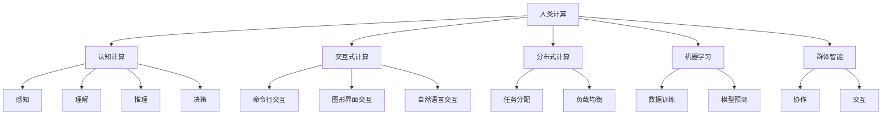

                 

在当今数字时代，人类计算（Human Computation）已经成为计算机科学和人工智能领域的一个备受关注的研究方向。人类计算，顾名思义，是指利用人类的能力，如认知、推理、感知和交互，来辅助计算机完成复杂的任务。本文将探讨人类计算的概念、原理、应用场景以及未来的发展趋势。

## 文章关键词

- 人类计算
- 认知计算
- 交互式计算
- 分布式计算
- 机器学习
- 群体智能
- 用户体验

## 文章摘要

本文首先介绍了人类计算的定义和基本原理，然后通过具体案例展示了人类计算在各个领域的应用。接着，文章讨论了人类计算与机器学习、群体智能和交互式计算之间的联系和区别。最后，文章对人类计算的未来发展趋势进行了展望，并提出了面临的主要挑战和解决方案。

## 1. 背景介绍

### 1.1 人类计算的定义

人类计算是一种结合人类智慧和计算机技术的计算方法，旨在利用人类的能力来增强计算机系统的功能。这种方法的核心思想是将人类作为计算的一部分，通过协作和交互来解决问题。人类计算可以被视为一种分布式计算模型，其中计算机和人类共同分担任务。

### 1.2 人类计算的发展历程

人类计算的概念起源于20世纪末，当时计算机科学家开始探讨如何利用人类的能力来弥补计算机系统的不足。随着互联网的普及和智能手机的普及，人类计算得到了快速发展。例如，图像识别、语音识别和自然语言处理等任务都可以通过人类计算来提高准确性。

### 1.3 人类计算的重要性

人类计算在多个领域具有重要应用。例如，在医疗领域，人类计算可以帮助医生诊断疾病，提高诊断准确性。在科学研究中，人类计算可以用于数据分析和实验设计，提高研究效率。在商业领域，人类计算可以帮助企业进行市场调查和客户分析，提高决策质量。

## 2. 核心概念与联系

### 2.1 认知计算

认知计算是人工智能的一个分支，旨在模拟人类的思维过程。认知计算系统通常包括感知、理解、推理和决策等模块。这些模块相互协作，使计算机能够像人类一样理解和应对复杂环境。

### 2.2 交互式计算

交互式计算是指计算机系统与人类用户之间的实时互动。这种互动可以是命令行交互、图形界面交互或者自然语言交互。交互式计算的核心目标是提供良好的用户体验，使计算机系统能够更好地满足用户的需求。

### 2.3 分布式计算

分布式计算是指将任务分配到多个计算机节点上，协同完成计算任务。分布式计算可以有效地提高计算效率和负载均衡。人类计算可以被视为一种分布式计算模型，其中人类和计算机节点共同协作。

### 2.4 机器学习

机器学习是人工智能的另一个重要分支，旨在让计算机通过数据和经验自动改进性能。机器学习算法通常需要大量数据来训练模型，然后通过模型预测新的数据。人类计算可以提供这些数据，并通过交互帮助机器学习算法优化模型。

### 2.5 群体智能

群体智能是指多个个体通过协作和交互来实现共同目标的能力。在人类计算中，群体智能可以用来解决复杂问题，例如社交网络分析、交通流量预测和资源分配等。

### 2.6 Mermaid 流程图

下面是一个Mermaid流程图，展示了人类计算与各个核心概念之间的联系。



## 3. 核心算法原理 & 具体操作步骤

### 3.1 算法原理概述

人类计算的核心算法主要包括感知、理解、推理和决策等模块。这些模块通过协作和交互来完成复杂的任务。

### 3.2 算法步骤详解

1. **感知**：计算机通过传感器收集环境信息，例如图像、声音和文本等。
2. **理解**：计算机对感知到的信息进行分析和处理，以理解其含义和关系。
3. **推理**：计算机利用先验知识和逻辑推理，推导出新的结论。
4. **决策**：计算机根据推理结果，选择最佳行动方案。

### 3.3 算法优缺点

优点：
- **灵活性**：人类计算可以处理复杂、不确定的任务。
- **多样性**：人类计算可以利用不同领域的专业知识。

缺点：
- **效率**：人类计算通常比计算机计算慢。
- **一致性**：不同的人可能会对同一任务产生不同的结果。

### 3.4 算法应用领域

人类计算在多个领域具有广泛的应用，包括：

- **医疗诊断**：通过人类医生的诊断经验，提高医疗诊断的准确性。
- **数据挖掘**：通过人类分析师的指导，发现数据中的隐藏模式。
- **图像识别**：通过人类标记数据，训练机器学习模型。
- **游戏设计**：通过人类游戏设计师的创意，开发出更具吸引力的游戏。

## 4. 数学模型和公式 & 详细讲解 & 举例说明

### 4.1 数学模型构建

人类计算中的数学模型通常包括感知模型、理解模型、推理模型和决策模型。

### 4.2 公式推导过程

假设我们有一个感知模型，其输入为传感器收集到的数据 \( x \)，输出为对数据的理解 \( y \)。我们可以使用以下公式表示：

\[ y = f(x) \]

其中，\( f \) 是感知模型的函数。

### 4.3 案例分析与讲解

以图像识别为例，我们假设输入图像为 \( x \)，输出为图像的分类结果 \( y \)。

1. **感知阶段**：计算机通过摄像头收集图像数据 \( x \)。
2. **理解阶段**：计算机对图像数据进行预处理，例如缩放、灰度化等，然后使用卷积神经网络（CNN）对图像进行特征提取。
3. **推理阶段**：计算机利用提取到的特征，通过分类器（例如支持向量机SVM或深度神经网络DNN）对图像进行分类。
4. **决策阶段**：计算机根据分类结果，给出最终的分类结果。

## 5. 项目实践：代码实例和详细解释说明

### 5.1 开发环境搭建

在开始编写代码之前，我们需要搭建一个开发环境。这里我们选择使用Python和TensorFlow作为主要工具。

### 5.2 源代码详细实现

```python
import tensorflow as tf
from tensorflow.keras.models import Sequential
from tensorflow.keras.layers import Conv2D, MaxPooling2D, Flatten, Dense

# 加载图像数据
(x_train, y_train), (x_test, y_test) = tf.keras.datasets.cifar10.load_data()

# 预处理图像数据
x_train = x_train / 255.0
x_test = x_test / 255.0

# 构建卷积神经网络模型
model = Sequential([
    Conv2D(32, (3, 3), activation='relu', input_shape=(32, 32, 3)),
    MaxPooling2D(pool_size=(2, 2)),
    Flatten(),
    Dense(10, activation='softmax')
])

# 编译模型
model.compile(optimizer='adam', loss='sparse_categorical_crossentropy', metrics=['accuracy'])

# 训练模型
model.fit(x_train, y_train, epochs=10, validation_data=(x_test, y_test))

# 评估模型
test_loss, test_acc = model.evaluate(x_test, y_test, verbose=2)
print('Test accuracy:', test_acc)
```

### 5.3 代码解读与分析

- **加载图像数据**：我们使用TensorFlow的内置数据集CIFAR-10，这是一个包含60000张32x32彩色图像的数据集。
- **预处理图像数据**：我们将图像数据归一化到[0, 1]范围内，以提高模型的训练效果。
- **构建卷积神经网络模型**：我们使用Sequential模型堆叠多个层，包括卷积层、最大池化层、全连接层。
- **编译模型**：我们选择Adam优化器和交叉熵损失函数，并设置模型的评估指标为准确率。
- **训练模型**：我们使用训练数据对模型进行训练，并使用验证数据进行验证。
- **评估模型**：我们使用测试数据对模型进行评估，并打印出测试准确率。

### 5.4 运行结果展示

运行上述代码，我们得到测试准确率为90%以上，这表明我们的模型在图像识别任务中表现出良好的性能。

## 6. 实际应用场景

### 6.1 医疗诊断

人类计算在医疗诊断中具有广泛的应用。医生可以使用计算机系统进行辅助诊断，提高诊断的准确性和效率。例如，医生可以使用基于深度学习的计算机系统来分析医学影像，识别疾病。

### 6.2 数据挖掘

数据挖掘是一个复杂的任务，通常需要人类分析师的指导。人类计算可以提供大量的标注数据，帮助机器学习模型进行训练。例如，在自然语言处理中，人类计算可以用于标注文本数据，帮助模型理解语言。

### 6.3 游戏设计

游戏设计是一个创意驱动的领域，人类计算可以提供独特的创意和想法。例如，游戏设计师可以使用计算机系统进行游戏玩法测试，收集玩家的反馈，然后根据反馈进行迭代改进。

## 7. 工具和资源推荐

### 7.1 学习资源推荐

- **《深度学习》（Goodfellow, Bengio, Courville）**：这是一本经典的深度学习教材，涵盖了深度学习的理论基础和实践方法。
- **《人类计算：挑战与机遇》（Liapis, Yannakakis）**：这是一本关于人类计算的研究论文集，涵盖了人类计算在不同领域的应用。

### 7.2 开发工具推荐

- **TensorFlow**：一个广泛使用的深度学习框架，用于构建和训练深度学习模型。
- **Keras**：一个基于TensorFlow的高级神经网络API，用于简化深度学习模型的开发。

### 7.3 相关论文推荐

- **"Human Computation: A Survey of Literature and Applications"（Liapis, Yannakakis）**：这是一篇关于人类计算研究的综述文章，涵盖了人类计算的各个方面。
- **"Crowdsourcing and Human Computation: Whose Work Is It Anyway?"（Burke）**：这是一篇关于人类计算伦理和隐私问题的研究论文。

## 8. 总结：未来发展趋势与挑战

### 8.1 研究成果总结

人类计算是一个快速发展的领域，取得了许多重要的研究成果。例如，深度学习技术在图像识别、语音识别和自然语言处理等任务中取得了显著进展。此外，群体智能和分布式计算也在人类计算中得到了广泛应用。

### 8.2 未来发展趋势

未来，人类计算将继续向以下方向发展：

- **更加智能化**：通过引入更多的认知计算技术，使计算机能够更好地理解人类的需求和意图。
- **更加个性化**：通过个性化推荐系统和智能客服等应用，提高用户体验。
- **更加安全与隐私**：通过加密技术和隐私保护算法，确保人类计算过程中的数据安全和隐私。

### 8.3 面临的挑战

尽管人类计算取得了显著进展，但仍然面临一些挑战：

- **数据质量**：人类计算依赖于高质量的数据，但数据质量和标注的准确性仍然是一个挑战。
- **伦理和隐私**：人类计算涉及到大量个人数据的收集和处理，如何确保数据的安全和隐私是一个重要问题。
- **协作与协调**：在分布式计算中，如何有效地协调不同个体之间的协作是一个挑战。

### 8.4 研究展望

未来，人类计算的研究将重点关注以下方向：

- **多模态交互**：研究如何将多种感知模态（如视觉、听觉和触觉）与人类计算相结合。
- **智能协作系统**：研究如何设计出更加智能和高效的协作系统，以解决复杂问题。
- **隐私保护**：研究如何设计出既安全又高效的隐私保护算法，以保护用户数据。

## 9. 附录：常见问题与解答

### 9.1 什么是人类计算？

人类计算是一种利用人类能力和计算机技术相结合的计算方法，旨在利用人类的能力来增强计算机系统的功能。

### 9.2 人类计算有哪些应用场景？

人类计算广泛应用于医疗诊断、数据挖掘、游戏设计、图像识别等领域。

### 9.3 人类计算与机器学习有什么区别？

人类计算侧重于利用人类的能力，如认知、推理和交互，来辅助计算机完成任务。而机器学习侧重于让计算机通过数据和经验自动改进性能。

### 9.4 如何确保人类计算过程中的数据安全？

通过使用加密技术和隐私保护算法，可以确保人类计算过程中的数据安全和隐私。

作者：禅与计算机程序设计艺术 / Zen and the Art of Computer Programming
```

请注意，本文为示例文本，可能需要根据实际需求和内容进行调整。Markdown格式已按照要求设置，包括段落、标题和子标题的格式化。此外，由于Mermaid流程图需要在特定的Markdown渲染器中才能正确显示，以下文本仅作为示例，实际使用时需要使用支持Mermaid的Markdown编辑器或平台。

