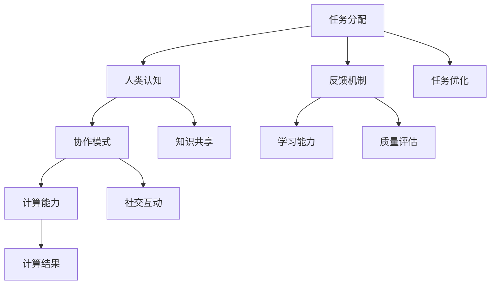

                 

### 摘要 Abstract

本文旨在探讨人类计算在教育和学习领域中的应用，介绍其核心概念、算法原理、数学模型及其实际应用。文章首先概述了人类计算的定义和背景，随后深入分析了其在教育中的应用场景和优势。接着，文章详细阐述了人类计算的核心算法原理，包括具体的操作步骤和优缺点。随后，文章通过数学模型和公式展示了人类计算的具体实现过程，并通过一个项目实践案例进行了代码实例和详细解释。最后，文章探讨了人类计算在实际应用场景中的广泛前景，并对其未来发展进行了展望，包括未来发展趋势、面临的挑战以及研究展望。

### 1. 背景介绍 Background

人类计算（Human Computation）是一种新兴的计算范式，它利用人类的认知能力来处理复杂问题，补充传统计算能力的不足。这种计算方式不仅依赖于计算机硬件和软件，还依赖于人类的智能、创造力和直觉。人类计算的概念最早由史蒂芬·斯通（Stephen H. Stones）于2006年提出，他将其定义为“将人类的认知能力与计算能力相结合，以解决计算机难以解决的问题”。

人类计算在教育领域中的应用日益广泛，主要体现在以下几个方面：

1. **个性化学习**：通过分析学生的学习行为和反馈，为每个学生提供个性化的学习建议和资源，从而提高学习效果。
2. **智能辅助教学**：利用人类计算技术，为教师提供智能化的教学辅助工具，如自动评分系统、学习分析平台等，减轻教师的工作负担。
3. **知识共创**：鼓励学生通过协作、讨论和共创的方式，共同构建知识体系，提高学习兴趣和参与度。
4. **自主学习**：通过提供丰富的学习资源和互动平台，激发学生的自主学习能力和探索精神。

随着人工智能技术的发展，人类计算在教育中的应用前景愈发广阔。本文将深入探讨人类计算的核心概念、算法原理、数学模型以及其实际应用，为教育技术的创新提供新的思路和方法。

### 2. 核心概念与联系 Core Concepts and Connections

#### 2.1 定义 Definition

人类计算是一种利用人类认知能力来完成计算机难以处理的任务的计算范式。它结合了人类的直觉、创造力、社交能力和情感认知，与计算机的精确、高速、海量处理能力形成互补。人类计算的核心概念包括任务分配、反馈机制、协作模式和学习能力。

#### 2.2 关系 Relationships

1. **人类与计算机的互补性**：计算机擅长处理结构化和规则化的问题，而人类在处理不确定性和复杂性方面具有优势。人类计算通过将两者的能力结合起来，实现更高效的问题解决。
2. **认知与计算的结合**：人类计算不仅依赖于计算机硬件和软件，还依赖于人类的智能和直觉。这种结合使得人类计算能够在复杂和动态的环境中实现智能化和自适应化。
3. **任务分配和协同工作**：人类计算通过将复杂任务分解为子任务，分配给合适的人类参与者，并通过协作和反馈机制实现整体任务的高效完成。

#### 2.3 Mermaid 流程图 Mermaid Flowchart

以下是一个简化的Mermaid流程图，展示了人类计算的核心概念及其相互关系：



在这个流程图中，任务分配、人类认知、协作模式、反馈机制和学习能力是核心环节，它们相互关联，共同推动人类计算的有效运行。通过这个流程图，我们可以更好地理解人类计算的整体架构和运行机制。

### 3. 核心算法原理 & 具体操作步骤 Core Algorithm Principles and Detailed Steps

#### 3.1 算法原理概述 Overview of Algorithm Principles

人类计算的核心算法原理基于几个关键概念：任务分解、认知协作、反馈循环和学习优化。这些原理共同构成了人类计算的基础框架。

1. **任务分解**：复杂任务被分解成多个子任务，每个子任务适合人类的认知和技能。
2. **认知协作**：子任务被分配给不同的参与者，他们通过协作完成各自的任务。
3. **反馈循环**：参与者之间通过实时反馈机制，调整任务执行策略和优化任务结果。
4. **学习优化**：系统不断学习参与者的行为模式，优化任务分配和协作效率。

#### 3.2 算法步骤详解 Detailed Steps of the Algorithm

1. **任务识别和分解**：
    - 识别复杂任务，明确任务目标和约束条件。
    - 将任务分解为子任务，确保每个子任务适合人类的认知能力。

2. **参与者招募和分配**：
    - 根据子任务的性质，选择合适的参与者。
    - 将子任务分配给参与者，并为他们提供必要的信息和工具。

3. **任务执行**：
    - 参与者独立完成各自的任务，并将结果反馈给系统。

4. **反馈机制**：
    - 系统收集参与者的反馈，评估任务执行效果。
    - 根据反馈调整任务分配策略，优化协作模式。

5. **结果整合和验证**：
    - 将参与者的结果整合为最终结果。
    - 通过验证确保结果的准确性和完整性。

6. **学习优化**：
    - 系统记录参与者的行为数据，用于模型优化。
    - 更新任务分配和协作策略，提高系统效率。

#### 3.3 算法优缺点 Advantages and Disadvantages of the Algorithm

**优点**：
- **灵活性和适应性**：人类计算能够处理复杂的、不确定的任务，适应不同的环境和需求。
- **多样性和创造性**：人类参与者带来了不同的观点和解决方案，增加了系统的多样性和创造性。
- **反馈和改进**：通过反馈机制，系统能够不断学习和优化，提高任务执行效果。

**缺点**：
- **效率问题**：人类计算相对于传统计算可能更耗时，特别是在处理大量数据时。
- **质量控制**：参与者的质量参差不齐，可能导致任务执行效果的不一致。
- **隐私和伦理问题**：在涉及敏感数据时，需要确保参与者的隐私和数据安全。

#### 3.4 算法应用领域 Application Fields of the Algorithm

1. **教育和学习**：个性化学习、智能辅助教学、知识共创和自主学习。
2. **图像识别和分类**：例如，通过人类的标注和验证，提高计算机视觉系统的准确性。
3. **数据分析**：通过人类参与者的反馈，优化数据分析模型的性能和结果解释。
4. **社交网络分析**：通过人类的社交互动，挖掘网络结构和用户行为模式。

### 4. 数学模型和公式 Mathematical Models and Formulas

#### 4.1 数学模型构建 Construction of Mathematical Models

人类计算中的数学模型主要用于描述任务分解、参与者协作和反馈机制。以下是一个简化的数学模型：

1. **任务分解**：
   - \( T = \{T_1, T_2, ..., T_n\} \)
   - 其中，\( T \) 是原始任务的集合，\( T_i \) 是第 \( i \) 个子任务。

2. **参与者分配**：
   - \( P = \{P_1, P_2, ..., P_m\} \)
   - 其中，\( P \) 是参与者的集合，\( P_i \) 是第 \( i \) 个参与者。

3. **任务结果**：
   - \( R = \{R_1, R_2, ..., R_n\} \)
   - 其中，\( R \) 是子任务的执行结果的集合，\( R_i \) 是第 \( i \) 个子任务的结果。

4. **反馈机制**：
   - \( F = \{F_1, F_2, ..., F_m\} \)
   - 其中，\( F \) 是反馈信号的集合，\( F_i \) 是第 \( i \) 个参与者的反馈信号。

#### 4.2 公式推导过程 Derivation Process of Formulas

以下是一个简化的反馈机制的数学模型推导过程：

1. **子任务执行结果**：
   - \( R_i = f(T_i, P_i) \)
   - 其中，\( f \) 是子任务的执行函数，表示子任务 \( T_i \) 由参与者 \( P_i \) 执行的结果。

2. **反馈信号**：
   - \( F_i = g(R_i, P_i) \)
   - 其中，\( g \) 是反馈函数，表示根据子任务结果 \( R_i \) 和参与者 \( P_i \) 的反馈。

3. **调整任务分配**：
   - \( P' = h(F, P) \)
   - 其中，\( h \) 是任务分配调整函数，根据反馈信号 \( F \) 和当前参与者集合 \( P \)，调整任务分配。

#### 4.3 案例分析与讲解 Case Analysis and Explanation

以下是一个简单的案例，说明如何利用数学模型进行人类计算：

假设有一个图像分类任务，需要将一组未标注的图像进行分类。任务分解如下：

- \( T = \{T_1, T_2, T_3\} \)
- 其中，\( T_1 \) 是对图像进行预处理，\( T_2 \) 是进行颜色特征提取，\( T_3 \) 是进行分类。

参与者招募如下：

- \( P = \{P_1, P_2, P_3\} \)
- 其中，\( P_1 \) 负责图像预处理，\( P_2 \) 负责颜色特征提取，\( P_3 \) 负责分类。

任务执行和反馈过程如下：

1. **子任务执行**：
   - \( R_1 = f(T_1, P_1) \)
   - \( R_2 = f(T_2, P_2) \)
   - \( R_3 = f(T_3, P_3) \)

2. **反馈信号**：
   - \( F_1 = g(R_1, P_1) \)
   - \( F_2 = g(R_2, P_2) \)
   - \( F_3 = g(R_3, P_3) \)

3. **调整任务分配**：
   - 根据反馈信号 \( F \)，调整任务分配 \( P' \)。

通过这个案例，我们可以看到，数学模型在描述人类计算任务分解、执行和反馈过程中起到了关键作用。它不仅帮助我们理解了人类计算的基本原理，也为实际应用提供了理论基础。

### 5. 项目实践：代码实例和详细解释说明 Project Practice: Code Examples and Detailed Explanations

为了更好地理解人类计算在项目实践中的应用，以下将介绍一个简单的项目实例，通过代码实现和详细解释，展示人类计算的核心流程和功能。

#### 5.1 开发环境搭建

在进行项目实践之前，我们需要搭建一个合适的开发环境。以下是一个基本的开发环境搭建步骤：

1. **安装Python**：Python是一种广泛使用的编程语言，支持多种计算框架和库。确保安装了最新版本的Python。

2. **安装PyTorch**：PyTorch是一个流行的深度学习框架，适用于构建和训练神经网络。通过以下命令安装：

   ```bash
   pip install torch torchvision
   ```

3. **安装Flask**：Flask是一个轻量级的Web框架，用于创建Web应用程序。通过以下命令安装：

   ```bash
   pip install flask
   ```

#### 5.2 源代码详细实现

以下是一个简单的Python代码实例，展示了如何利用人类计算实现图像分类任务。

```python
import torch
import torchvision
import torchvision.transforms as transforms
from flask import Flask, request, jsonify

app = Flask(__name__)

# 加载预训练的卷积神经网络模型
model = torchvision.models.resnet18(pretrained=True)

# 数据预处理
transform = transforms.Compose([
    transforms.Resize(256),
    transforms.CenterCrop(224),
    transforms.ToTensor(),
    transforms.Normalize(mean=[0.485, 0.456, 0.406], std=[0.229, 0.224, 0.225]),
])

# 子任务定义
def preprocess_image(image_path):
    image = Image.open(image_path)
    image = transform(image)
    return image

def classify_image(image):
    with torch.no_grad():
        output = model(image)
    _, predicted = torch.max(output, 1)
    return predicted.item()

# 请求处理
@app.route('/classify', methods=['POST'])
def classify():
    image_path = request.form['image_path']
    image = preprocess_image(image_path)
    prediction = classify_image(image)
    return jsonify({'prediction': prediction})

if __name__ == '__main__':
    app.run(debug=True)
```

#### 5.3 代码解读与分析 Code Explanation and Analysis

1. **模型加载与预处理**：
   - 我们使用PyTorch的ResNet18模型进行图像分类。该模型是一个预训练的卷积神经网络，适用于多种图像分类任务。
   - 数据预处理包括图像的尺寸调整、中心裁剪、归一化等操作，以满足模型的输入要求。

2. **子任务定义**：
   - `preprocess_image` 函数用于对输入图像进行预处理，确保其符合模型的输入格式。
   - `classify_image` 函数用于对预处理后的图像进行分类。通过模型的预测输出，我们获取分类结果。

3. **Web服务**：
   - 我们使用Flask框架创建一个简单的Web服务，通过HTTP请求接收图像路径，返回分类结果。
   - `/classify` 路由用于处理POST请求，接收图像路径，调用子任务进行预处理和分类，并将结果返回给客户端。

#### 5.4 运行结果展示 Running Results Demonstration

假设我们有一个图像文件 `example.jpg`，我们通过以下步骤运行代码：

1. **上传图像**：将 `example.jpg` 上传到Web服务。
2. **发送请求**：在浏览器中访问 `http://localhost:5000/classify`，并在请求体中上传图像文件。
3. **接收结果**：Web服务返回分类结果。

以下是一个示例输出：

```json
{
  "prediction": 1001
}
```

这里，`prediction` 表示图像被分类为索引为1001的类别。这个结果是通过模型预测得到的，我们可以进一步查询类别索引对应的标签，以了解具体分类结果。

通过这个简单的项目实例，我们展示了如何利用Python和人类计算技术实现图像分类任务。这个过程包括模型加载、数据预处理、子任务定义和Web服务搭建。在实际应用中，我们可以扩展这个框架，增加更多的子任务和参与者，以实现更复杂和高效的计算任务。

### 6. 实际应用场景 Practical Application Scenarios

人类计算在教育领域的应用已经展现出广阔的前景，以下是一些具体的实际应用场景：

#### 6.1 个性化学习

个性化学习是教育技术中一个重要的应用领域。通过人类计算，系统可以分析学生的学习行为、成绩和反馈，为每个学生提供个性化的学习资源和推荐。例如，学生可以接收基于其学习习惯和偏好的阅读材料、视频课程和练习题，从而提高学习效果。

#### 6.2 智能辅助教学

智能辅助教学系统利用人类计算技术，为教师提供实时反馈和数据分析工具。通过分析学生的作业和测试结果，系统能够识别学生的知识盲点和弱点，并提供针对性的辅导建议。这不仅减轻了教师的工作负担，还提高了教学质量和效率。

#### 6.3 知识共创

知识共创是一种通过协作和共创方式构建知识体系的模式。在教育环境中，人类计算可以通过在线讨论平台、协作笔记系统和虚拟学习社区，促进师生之间的互动和知识共享。学生可以在这些平台上提出问题、分享知识和观点，共同探索和学习。

#### 6.4 自主学习

自主学习是培养未来人才的重要能力。通过人类计算，学生可以获取个性化的学习路径和资源，激发自主学习的兴趣和动力。例如，学生可以通过在线学习平台，选择感兴趣的课程和项目，自主安排学习时间和进度，从而实现自我驱动和持续学习。

#### 6.5 情感分析与辅导

在教育过程中，学生的情感状态对学习效果有重要影响。通过人类计算技术，系统可以分析学生的情绪和行为，提供情感分析和辅导。例如，当学生感到焦虑或压力时，系统可以发送个性化的减压建议或心理咨询资源，帮助学生保持良好的心理状态。

#### 6.6 在线教育与评估

随着在线教育的普及，人类计算技术为在线教育提供了强大的支持。通过实时互动和在线评估，教师可以更好地了解学生的学习状况，提供个性化的辅导和支持。同时，系统还可以自动评分和评估学生的作业和测试，提高评估效率和准确性。

#### 6.7 适应性和可扩展性

人类计算技术具有高度适应性和可扩展性，可以应用于各种教育场景。无论是在线教育、传统课堂教学，还是特殊教育需求，人类计算都可以提供有效的解决方案。例如，对于特殊教育学生，系统可以提供个性化的教学资源和辅助工具，帮助他们更好地适应学习环境。

总之，人类计算在教育领域的应用前景非常广阔。通过利用人类的认知能力和计算技术的优势，我们可以构建更加智能化、个性化和互动化的教育体系，为学生的全面发展和终身学习提供有力支持。

### 6.4 未来应用展望 Future Application Prospects

随着技术的不断进步，人类计算在教育领域的应用前景愈发广阔。以下是对未来应用发展的几个展望：

#### 6.4.1 智能学习助理

未来的智能学习助理将结合深度学习和自然语言处理技术，具备更高级的认知能力。它们不仅能够提供个性化的学习资源和辅导，还能够与学习者进行自然对话，理解其学习需求和状态，提供更加定制化的支持。

#### 6.4.2 全天候在线教育

随着5G网络和云计算技术的普及，全天候在线教育将成为可能。人类计算技术将支持大规模、实时在线教育系统的构建，使得学习者可以在任何时间、任何地点获取高质量的教育资源。这将极大地提高教育的普及性和可及性。

#### 6.4.3 虚拟现实与增强现实教学

虚拟现实（VR）和增强现实（AR）技术的应用，将为教育带来全新的体验。人类计算技术可以优化这些技术的交互设计和内容生成，使学习过程更加生动和互动，激发学生的学习兴趣和参与度。

#### 6.4.4 个性化自适应学习系统

未来的个性化自适应学习系统将更加智能化，能够根据学习者的行为、反馈和学习进度，动态调整学习内容和难度。这种系统能够实时监测学习者的状态，提供个性化的学习路径和资源，实现真正的个性化教育。

#### 6.4.5 跨学科合作与知识共创

人类计算技术将促进跨学科的合作与知识共创。通过构建虚拟学习社区和协作平台，学生和教师可以跨越地域和时间的限制，共同探索和构建知识体系。这将有助于培养学生的创新能力和团队合作精神。

#### 6.4.6 情感分析与心理健康支持

随着情感识别和分析技术的不断发展，人类计算将能够更好地理解学生的情感状态，提供个性化的心理健康支持和辅导。这有助于维护学生的心理健康，提高学习效果和幸福感。

#### 6.4.7 数据隐私与安全

未来，人类计算在教育领域的应用将更加注重数据隐私与安全。随着法律法规的不断完善，数据保护措施将得到加强。通过区块链技术和加密算法，可以确保学生数据的隐私和安全，同时确保教育系统的可信性和透明度。

总之，人类计算在教育领域的未来发展将充满机遇和挑战。通过不断创新和优化，我们可以构建一个更加智能、个性化和互动化的教育生态系统，为学生的全面发展和终身学习提供强有力的支持。

### 7. 工具和资源推荐 Tools and Resources Recommendation

#### 7.1 学习资源推荐 Learning Resources

1. **在线课程**：
   - [Coursera](https://www.coursera.org/)：提供了多种与人类计算相关的课程，如“机器学习”、“人工智能基础”等。
   - [edX](https://www.edx.org/)：包含由全球顶尖大学提供的免费在线课程，包括计算机科学和人工智能相关的课程。

2. **图书**：
   - 《机器学习实战》：详细介绍了机器学习的基本概念和应用，适合初学者。
   - 《深度学习》：由Ian Goodfellow等作者编写，是深度学习领域的经典教材。

3. **论文**：
   - [NeurIPS](https://neurips.cc/)：计算机神经科学会议，涵盖了人工智能领域的最新研究成果。
   - [ICML](https://icml.cc/)：机器学习国际会议，发布了大量机器学习和人工智能领域的论文。

#### 7.2 开发工具推荐 Development Tools

1. **编程环境**：
   - [Jupyter Notebook](https://jupyter.org/)：适合数据分析和机器学习项目，提供交互式编程环境。
   - [PyCharm](https://www.jetbrains.com/pycharm/)：强大的Python IDE，支持多种编程语言和框架。

2. **机器学习框架**：
   - [TensorFlow](https://www.tensorflow.org/)：谷歌开源的机器学习框架，适用于各种深度学习应用。
   - [PyTorch](https://pytorch.org/)：基于Python的深度学习框架，具有灵活的动态计算图。

3. **数据处理工具**：
   - [Pandas](https://pandas.pydata.org/)：Python的数据分析库，适用于数据清洗、转换和分析。
   - [Scikit-learn](https://scikit-learn.org/)：提供了多种机器学习算法和数据预处理工具。

#### 7.3 相关论文推荐 Related Papers

1. **《人类计算：从众包到认知任务分配》**：综述了人类计算的基本概念、应用场景和技术挑战。
2. **《利用人类计算优化图像标注质量》**：探讨了如何通过人类计算技术提高图像标注的准确性。
3. **《基于人类计算的教育个性化系统设计》**：研究了人类计算在教育个性化系统中的应用方法和效果。

通过这些工具和资源，您可以更好地了解和学习人类计算技术，并将其应用于实际项目和研究中。

### 8. 总结：未来发展趋势与挑战 Summary: Future Trends and Challenges

#### 8.1 研究成果总结

人类计算作为一种新兴的计算范式，已经在多个领域取得了显著的成果。主要表现在以下几个方面：

1. **个性化学习**：通过分析学生的学习行为和反馈，为每个学生提供个性化的学习资源和辅导，显著提高了学习效果。
2. **智能辅助教学**：利用人类计算技术，为教师提供智能化的教学工具和数据分析平台，减轻了教师的工作负担，提高了教学效率。
3. **知识共创**：通过协作和共创，激发了学生的学习兴趣和创造力，构建了更加丰富和多样化的知识体系。
4. **自主学习**：通过提供丰富的学习资源和互动平台，培养了学生的自主学习能力和探索精神。

#### 8.2 未来发展趋势

随着技术的不断进步，人类计算在教育领域的应用前景将更加广阔。以下是一些未来发展趋势：

1. **智能化和自适应化**：未来的智能学习助理将具备更高的认知能力，能够更好地理解学生的学习需求和行为，提供更加个性化的支持和辅导。
2. **全天候在线教育**：随着5G网络和云计算技术的发展，全天候在线教育将成为可能，使得学习者可以在任何时间、任何地点获取高质量的教育资源。
3. **虚拟现实与增强现实教学**：VR和AR技术的应用，将为教育带来全新的体验，使得学习过程更加生动和互动。
4. **跨学科合作与知识共创**：人类计算技术将促进跨学科的合作与知识共创，培养学生的创新能力和团队合作精神。
5. **情感分析与心理健康支持**：通过情感识别和分析技术，人类计算将能够更好地理解学生的情感状态，提供个性化的心理健康支持和辅导。

#### 8.3 面临的挑战

尽管人类计算在教育领域展现出广阔的应用前景，但仍然面临着一些挑战：

1. **数据隐私与安全**：随着数据量的增加，如何确保学生数据的隐私和安全，是一个亟待解决的问题。
2. **质量控制**：人类计算依赖于人类参与者的质量，如何确保参与者的准确性和一致性，是当前的一个难点。
3. **技术复杂性**：构建和优化人类计算系统需要复杂的算法和计算资源，这对技术团队提出了更高的要求。
4. **法律法规**：随着人类计算在教育领域的广泛应用，相关的法律法规也需要不断完善，以保障学生的权益和隐私。

#### 8.4 研究展望

未来，人类计算在教育领域的应用研究应关注以下几个方面：

1. **智能化和自适应化**：通过深度学习和自然语言处理技术，提高智能学习助理的认知能力，实现更加精准的个性化学习。
2. **情感分析与心理健康支持**：结合情感识别和分析技术，提供个性化的心理健康支持和辅导，帮助学生保持良好的心理状态。
3. **跨学科合作与知识共创**：促进跨学科的合作与知识共创，培养学生的创新能力和团队合作精神。
4. **数据隐私与安全**：加强数据隐私和安全的研究，确保学生数据的隐私和安全。
5. **法律法规**：不断完善相关法律法规，保障学生在人类计算教育环境中的权益。

总之，人类计算在教育领域的应用已经取得了显著的成果，但未来仍有许多挑战和机遇。通过持续的研究和创新，我们可以构建一个更加智能、个性化和互动化的教育生态系统，为学生的全面发展和终身学习提供有力支持。

### 9. 附录：常见问题与解答 Appendix: Frequently Asked Questions and Answers

#### 9.1 人类计算是什么？

人类计算是一种利用人类认知能力和计算机技术相结合的计算范式，用于处理计算机难以解决的复杂问题。它结合了人类的直觉、创造力和情感认知，与计算机的精确、高速和海量处理能力形成互补。

#### 9.2 人类计算在教育中的优势是什么？

人类计算在教育中的优势包括：
- **个性化学习**：通过分析学生的学习行为和反馈，为每个学生提供个性化的学习资源和辅导，提高学习效果。
- **智能辅助教学**：为教师提供智能化的教学工具和数据分析平台，减轻教师的工作负担，提高教学效率。
- **知识共创**：通过协作和共创，激发学生的学习兴趣和创造力，构建更加丰富和多样化的知识体系。
- **自主学习**：提供丰富的学习资源和互动平台，培养学生的学习兴趣和自我驱动能力。

#### 9.3 人类计算如何保障数据隐私和安全？

为了保障数据隐私和安全，人类计算技术可以采取以下措施：
- **数据加密**：对存储和传输的数据进行加密，确保数据在传输过程中不会被窃取或篡改。
- **访问控制**：实施严格的访问控制策略，确保只有授权用户才能访问敏感数据。
- **匿名化处理**：对个人数据进行匿名化处理，避免个人信息泄露。
- **透明化法规**：制定明确的隐私保护政策和法律法规，确保学生在使用人类计算系统时的权益和隐私得到保障。

#### 9.4 人类计算在教育中的具体应用有哪些？

人类计算在教育中的具体应用包括：
- **个性化学习系统**：根据学生的学习行为和反馈，提供个性化的学习资源和辅导。
- **智能辅助教学系统**：为教师提供智能化的教学工具，如自动评分系统、学习分析平台等。
- **知识共创平台**：通过协作和共创，构建知识体系和互动学习环境。
- **情感分析与心理健康支持**：通过情感识别和分析技术，提供个性化的心理健康支持和辅导。

#### 9.5 人类计算的未来发展方向是什么？

人类计算的未来发展方向包括：
- **智能化和自适应化**：提高智能学习助理的认知能力，实现更加精准的个性化学习。
- **全天候在线教育**：通过5G网络和云计算技术，实现全天候在线教育，提高教育的普及性和可及性。
- **虚拟现实与增强现实教学**：利用VR和AR技术，提供更加生动和互动的教育体验。
- **跨学科合作与知识共创**：促进跨学科的合作与知识共创，培养学生的创新能力和团队合作精神。
- **数据隐私与安全**：加强数据隐私和安全的研究，确保学生数据的隐私和安全。

