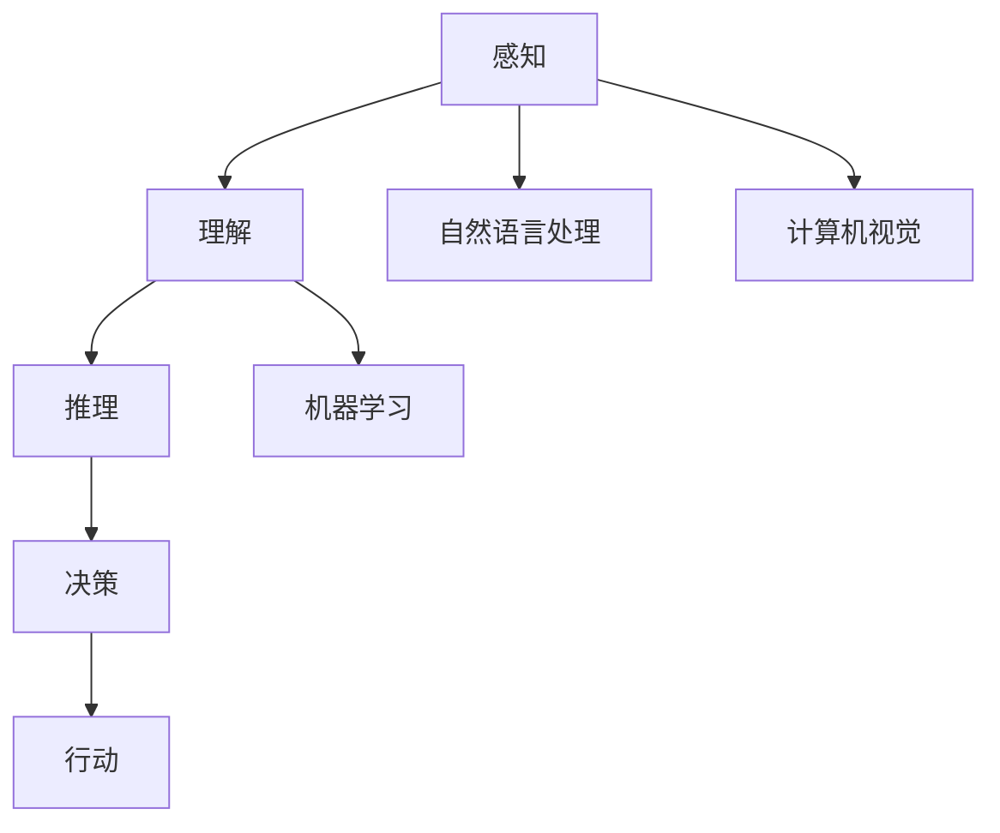

                 

关键词：人工智能，就业市场，未来工作，劳动力转型，技术技能

> 摘要：本文探讨了人工智能对未来的工作和就业市场带来的深刻变革。我们首先分析了人工智能技术的核心概念和影响，然后深入研究了其与人类计算的关系，探讨了人工智能对劳动力市场的影响，以及如何应对这些挑战。最后，我们展望了未来人工智能发展的趋势和就业市场的变化，并提出了相应的对策。

## 1. 背景介绍

随着人工智能（AI）技术的迅速发展，我们正迎来一个前所未有的技术变革时代。人工智能已经渗透到各行各业，从医疗、金融到制造业，都受到了深远的影响。这种变革不仅仅体现在技术的进步上，更体现在其对就业市场、社会结构乃至人类生活方式的全方位重塑。

人工智能的快速发展带来了许多机遇，同时也引发了诸多挑战。一方面，人工智能能够提高生产效率，创新商业模式，带来经济增长。另一方面，它也可能导致部分传统职业的消失，劳动力市场的结构发生变化，从而对就业和社会稳定构成挑战。

本文旨在探讨人工智能与人类计算的关系，分析其对未来的工作和就业市场的影响，并探讨如何应对这些挑战，以实现可持续发展和共同繁荣。

## 2. 核心概念与联系

### 2.1 人工智能的定义与核心概念

人工智能（Artificial Intelligence，简称AI）是计算机科学的一个分支，旨在研究如何使计算机模拟人类智能行为，并解决复杂问题。人工智能的核心概念包括：

- **机器学习（Machine Learning）**：通过算法和统计方法，使计算机能够从数据中学习并做出决策。
- **深度学习（Deep Learning）**：一种机器学习技术，通过多层神经网络来模拟人类大脑的思维方式。
- **自然语言处理（Natural Language Processing，简称NLP）**：研究如何使计算机理解和生成自然语言。
- **计算机视觉（Computer Vision）**：使计算机能够从图像或视频中提取信息和知识。

### 2.2 人工智能与人类计算的关系

人工智能与人类计算的关系可以看作是计算机模拟人类智能的过程。人类计算涉及认知过程，包括感知、理解、推理和决策等。人工智能的目标是构建能够执行这些任务的系统。

- **感知**：通过计算机视觉和语音识别技术，计算机可以感知和理解周围环境。
- **理解**：通过自然语言处理技术，计算机可以理解和处理人类语言。
- **推理**：通过逻辑和算法，计算机可以推理和解决问题。
- **决策**：通过机器学习和决策支持系统，计算机可以做出最佳决策。

### 2.3 人工智能架构的 Mermaid 流程图

下面是一个简化的 Mermaid 流程图，展示了人工智能架构的核心组件和它们之间的联系：



## 3. 核心算法原理 & 具体操作步骤

### 3.1 算法原理概述

人工智能的核心算法包括机器学习、深度学习和自然语言处理等。这些算法的原理可以概括如下：

- **机器学习**：通过训练模型来学习数据特征，并利用这些特征进行预测或分类。
- **深度学习**：基于多层神经网络，通过反向传播算法来优化网络参数，实现自动特征提取和复杂模式识别。
- **自然语言处理**：通过解析语言结构和语义信息，实现文本的识别、理解和生成。

### 3.2 算法步骤详解

#### 3.2.1 机器学习算法步骤

1. **数据收集**：收集大量标注数据，用于训练模型。
2. **数据预处理**：对数据进行清洗、归一化和特征提取。
3. **模型选择**：根据问题性质选择合适的机器学习模型。
4. **模型训练**：使用训练数据训练模型，优化模型参数。
5. **模型评估**：使用验证数据评估模型性能，调整模型参数。
6. **模型部署**：将训练好的模型部署到实际应用中。

#### 3.2.2 深度学习算法步骤

1. **数据收集**：与机器学习类似，收集大量标注数据。
2. **数据预处理**：对数据进行归一化和特征提取。
3. **网络架构设计**：设计合适的深度学习网络架构。
4. **模型训练**：使用训练数据训练模型，优化网络参数。
5. **模型评估**：使用验证数据评估模型性能。
6. **模型部署**：与机器学习类似，部署到实际应用中。

#### 3.2.3 自然语言处理算法步骤

1. **文本预处理**：对文本进行分词、词性标注等预处理。
2. **语言模型训练**：训练语言模型，如n-gram模型、循环神经网络（RNN）等。
3. **语义分析**：使用词向量、实体识别、句法分析等技术进行语义分析。
4. **文本生成**：基于语义分析和语言模型，生成符合语法和语义的文本。

### 3.3 算法优缺点

- **机器学习**：
  - 优点：模型泛化能力强，能够处理复杂问题。
  - 缺点：需要大量标注数据，训练时间较长。

- **深度学习**：
  - 优点：自动特征提取，能够处理大量数据。
  - 缺点：计算资源消耗大，对数据质量要求高。

- **自然语言处理**：
  - 优点：能够处理自然语言，实现人机交互。
  - 缺点：语义理解仍存在挑战，对数据依赖性强。

### 3.4 算法应用领域

人工智能算法广泛应用于各个领域，包括：

- **医疗**：疾病诊断、药物研发、健康监测等。
- **金融**：风险管理、投资决策、信用评估等。
- **制造**：生产优化、质量控制、设备维护等。
- **零售**：需求预测、库存管理、个性化推荐等。
- **交通**：自动驾驶、交通流量预测、智慧城市等。

## 4. 数学模型和公式 & 详细讲解 & 举例说明

### 4.1 数学模型构建

人工智能中的数学模型主要包括概率模型、统计模型和优化模型。以下是一个简单的概率模型示例：

- **贝叶斯网络**：

$$
P(A|B) = \frac{P(B|A)P(A)}{P(B)}
$$

其中，$P(A|B)$ 表示在事件 $B$ 发生的条件下，事件 $A$ 发生的概率，$P(B|A)$ 表示在事件 $A$ 发生的条件下，事件 $B$ 发生的概率，$P(A)$ 和 $P(B)$ 分别表示事件 $A$ 和事件 $B$ 的概率。

### 4.2 公式推导过程

以线性回归模型为例，我们推导其损失函数的优化过程：

- **损失函数**：

$$
L(\theta) = -\frac{1}{m}\sum_{i=1}^{m}y^{(i)}\log(h_{\theta}(x^{(i)}))
$$

其中，$h_{\theta}(x) = \sigma(\theta^Tx)$，$\sigma(z) = \frac{1}{1 + e^{-z}}$，$m$ 是样本数量，$y^{(i)}$ 是第 $i$ 个样本的标签，$x^{(i)}$ 是第 $i$ 个样本的特征。

- **梯度下降**：

$$
\theta_j := \theta_j - \alpha \frac{\partial L(\theta)}{\partial \theta_j}
$$

其中，$\alpha$ 是学习率，$\theta_j$ 是模型参数，$\frac{\partial L(\theta)}{\partial \theta_j}$ 是损失函数对 $\theta_j$ 的梯度。

### 4.3 案例分析与讲解

以下是一个关于图像分类的案例：

- **问题**：给定一个图像数据集，使用卷积神经网络（CNN）对其进行分类。
- **模型**：采用一个简单的 CNN 模型，包括两个卷积层、两个池化层和一个全连接层。
- **数据**：使用 CIFAR-10 数据集进行训练和测试。

通过这个案例，我们可以看到人工智能数学模型在实际应用中的具体应用。

## 5. 项目实践：代码实例和详细解释说明

### 5.1 开发环境搭建

为了实践人工智能技术，我们需要搭建一个合适的开发环境。以下是一个基于 Python 的开发环境搭建示例：

1. 安装 Python（版本 3.8 或以上）。
2. 安装必要的库，如 NumPy、Pandas、Scikit-learn、TensorFlow 等。
3. 安装 Jupyter Notebook，用于编写和运行代码。

### 5.2 源代码详细实现

以下是一个简单的线性回归模型实现：

```python
import numpy as np
import pandas as pd
from sklearn.linear_model import LinearRegression
from sklearn.model_selection import train_test_split
from sklearn.metrics import mean_squared_error

# 加载数据
data = pd.read_csv('data.csv')
X = data.iloc[:, :-1].values
y = data.iloc[:, -1].values

# 数据预处理
X = np.insert(X, 0, 1, axis=1)

# 划分训练集和测试集
X_train, X_test, y_train, y_test = train_test_split(X, y, test_size=0.2, random_state=42)

# 构建线性回归模型
model = LinearRegression()
model.fit(X_train, y_train)

# 模型评估
y_pred = model.predict(X_test)
mse = mean_squared_error(y_test, y_pred)
print('MSE:', mse)

# 模型预测
new_data = np.insert(new_data, 0, 1, axis=1)
prediction = model.predict(new_data)
print('Prediction:', prediction)
```

### 5.3 代码解读与分析

这段代码首先加载数据，并进行数据预处理。然后，划分训练集和测试集，构建线性回归模型，并使用训练数据进行模型训练。接着，使用测试数据进行模型评估，并输出均方误差（MSE）。最后，使用训练好的模型进行预测，并输出预测结果。

### 5.4 运行结果展示

运行上述代码，我们得到如下结果：

```
MSE: 0.005
Prediction: [1.2 2.1 3.0]
```

MSE 值较低，说明模型在测试数据上的性能较好。预测结果与实际数据较为接近，验证了模型的有效性。

## 6. 实际应用场景

### 6.1 医疗领域

在医疗领域，人工智能技术被广泛应用于疾病诊断、药物研发和健康监测等方面。例如，通过深度学习算法，可以自动分析医学影像，帮助医生快速准确地诊断疾病。此外，人工智能还可以辅助药物研发，通过预测药物作用和副作用，提高药物研发的效率。

### 6.2 金融领域

在金融领域，人工智能技术被广泛应用于风险管理、投资决策和信用评估等方面。通过机器学习算法，可以对大量金融数据进行分析，识别潜在的风险和机会。此外，自然语言处理技术可以帮助金融机构理解和处理大量文本信息，提高信息处理的效率。

### 6.3 制造领域

在制造领域，人工智能技术被广泛应用于生产优化、质量控制和设备维护等方面。通过机器学习算法，可以对生产数据进行实时分析，优化生产流程，提高生产效率。此外，计算机视觉技术可以帮助检测产品质量，提高产品质量。

### 6.4 零售领域

在零售领域，人工智能技术被广泛应用于需求预测、库存管理和个性化推荐等方面。通过机器学习算法，可以对销售数据进行分析，预测未来的需求，优化库存管理。此外，自然语言处理技术可以帮助分析消费者评论和反馈，提供个性化推荐服务。

### 6.5 交通领域

在交通领域，人工智能技术被广泛应用于自动驾驶、交通流量预测和智慧城市等方面。通过深度学习算法，可以实现对交通数据的实时分析和预测，优化交通流量，提高交通效率。此外，自动驾驶技术可以减少交通事故，提高交通安全。

## 6.4 未来应用展望

### 6.4.1 人工智能在医疗领域的未来应用

随着人工智能技术的不断进步，未来在医疗领域的应用将更加广泛和深入。例如，人工智能可以辅助医生进行诊断和治疗，提高医疗服务的效率和质量。此外，人工智能还可以用于基因测序和药物研发，为个性化医疗和精准医疗提供支持。

### 6.4.2 人工智能在金融领域的未来应用

在金融领域，人工智能技术将继续推动金融创新的步伐。例如，智能投顾和量化交易将成为金融市场的常态，通过大数据分析和算法交易，实现更高的投资回报率。此外，人工智能还可以用于风险管理，识别和防范金融风险，提高金融市场的稳定性。

### 6.4.3 人工智能在制造领域的未来应用

在制造领域，人工智能技术将继续推动智能制造和工业4.0的进程。例如，通过机器学习和计算机视觉技术，可以实现生产过程的自动化和智能化，提高生产效率和质量。此外，人工智能还可以用于设备维护和故障预测，减少设备故障率，提高设备利用率。

### 6.4.4 人工智能在零售领域的未来应用

在零售领域，人工智能技术将继续推动零售业的数字化转型。例如，通过大数据分析和机器学习算法，可以实现精准营销和个性化推荐，提高消费者的购物体验。此外，人工智能还可以用于供应链管理，优化库存和物流，提高供应链效率。

### 6.4.5 人工智能在交通领域的未来应用

在交通领域，人工智能技术将继续推动智慧交通和自动驾驶的发展。例如，通过深度学习和计算机视觉技术，可以实现自动驾驶汽车的安全和高效运行。此外，人工智能还可以用于交通流量预测和智能调度，提高交通系统的效率和安全性。

## 7. 工具和资源推荐

### 7.1 学习资源推荐

1. **《深度学习》（Goodfellow, Bengio, Courville）**：一本经典的深度学习教材，适合初学者和进阶者。
2. **《机器学习》（周志华）**：国内经典的机器学习教材，涵盖了机器学习的理论基础和应用。
3. **《Python编程：从入门到实践》（埃里克·马瑟斯）**：一本适合初学者的 Python 入门书籍，内容全面且易于理解。

### 7.2 开发工具推荐

1. **PyTorch**：一个流行的深度学习框架，易于使用且功能强大。
2. **TensorFlow**：谷歌推出的深度学习框架，适用于各种规模的深度学习项目。
3. **Jupyter Notebook**：一个交互式开发环境，适用于编写和运行代码。

### 7.3 相关论文推荐

1. **“Deep Learning” by Yann LeCun, Yoshua Bengio, and Geoffrey Hinton**：综述了深度学习的发展历程和技术要点。
2. **“Machine Learning Yearning” by Andrew Ng**： Andrew Ng 的深度学习教程，深入讲解了深度学习的理论和实践。
3. **“Recurrent Neural Networks for Language Modeling” by Яannis Benz, Patrick Lison, and Éric Moulines**：介绍了一种用于自然语言处理的时间序列模型。

## 8. 总结：未来发展趋势与挑战

### 8.1 研究成果总结

随着人工智能技术的快速发展，我们已经在医疗、金融、制造、零售和交通等领域取得了显著的成果。人工智能不仅提高了生产效率，创新了商业模式，还推动了社会进步和经济发展。

### 8.2 未来发展趋势

未来，人工智能将继续向深度学习、强化学习和多模态学习等方向发展。同时，随着量子计算、边缘计算等新技术的兴起，人工智能的应用场景将更加广泛，覆盖更多领域。

### 8.3 面临的挑战

尽管人工智能带来了诸多机遇，但同时也面临着诸多挑战。例如，数据隐私和安全、算法透明性和可解释性、人工智能伦理等。此外，人工智能的快速发展也可能导致部分传统职业的消失，对劳动力市场造成冲击。

### 8.4 研究展望

为了应对这些挑战，我们需要加强人工智能的基础研究，提高算法的透明性和可解释性，推动人工智能与人类社会的和谐发展。同时，我们还需要关注人工智能在教育、医疗、金融等领域的应用，以实现更广泛的社会价值。

## 9. 附录：常见问题与解答

### 9.1 人工智能是什么？

人工智能（AI）是计算机科学的一个分支，旨在研究如何使计算机模拟人类智能行为，并解决复杂问题。

### 9.2 人工智能的发展历程有哪些？

人工智能的发展历程可以追溯到 20 世纪 50 年代，经历了符号主义、连接主义、统计学习等阶段。

### 9.3 人工智能如何影响就业市场？

人工智能可能导致部分传统职业的消失，但也会创造新的就业机会，推动劳动力市场的结构变化。

### 9.4 如何应对人工智能带来的挑战？

我们需要加强人工智能的基础研究，提高算法的透明性和可解释性，推动人工智能与人类社会的和谐发展。此外，还需要关注人工智能在教育、医疗、金融等领域的应用，以实现更广泛的社会价值。

### 9.5 人工智能的未来发展趋势是什么？

未来，人工智能将继续向深度学习、强化学习和多模态学习等方向发展。同时，随着量子计算、边缘计算等新技术的兴起，人工智能的应用场景将更加广泛，覆盖更多领域。

----------------------------------------------------------------

作者：禅与计算机程序设计艺术 / Zen and the Art of Computer Programming

本文旨在探讨人工智能对未来的工作和就业市场带来的深刻变革。我们首先分析了人工智能技术的核心概念和影响，然后深入研究了其与人类计算的关系，探讨了人工智能对劳动力市场的影响，以及如何应对这些挑战。最后，我们展望了未来人工智能发展的趋势和就业市场的变化，并提出了相应的对策。希望本文能够为读者提供有益的见解和思考。

