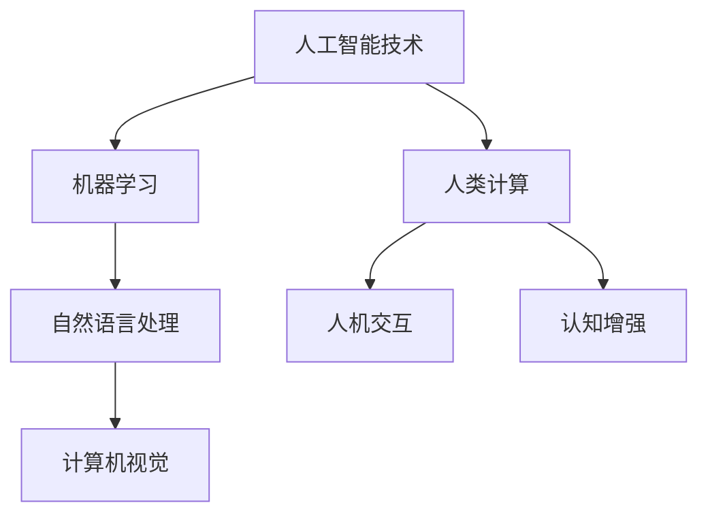

                 

关键词：人工智能，未来就业，人类计算，工作转型，技术进步，技能需求，职业发展。

> 摘要：随着技术的飞速发展，人工智能（AI）正在深刻地改变着我们的工作和就业市场。本文旨在探讨人类计算在未来的角色，分析技术进步带来的影响，并探讨如何应对新的技能需求和职业发展的挑战。

## 1. 背景介绍

人类计算的概念源于对计算机模拟人类思维过程的研究。在过去的几十年中，人工智能技术取得了显著进展，特别是在机器学习、自然语言处理和计算机视觉等领域。这些技术的进步不仅改变了我们的生活方式，也正在重塑工作环境和就业市场。

近年来，自动化和机器人技术迅速发展，许多传统的工作正被机器人和AI系统所取代。这一趋势引发了关于人类未来工作的担忧，人们开始思考如何适应这一变化，并保持自身的就业竞争力。

## 2. 核心概念与联系

### 2.1. 人工智能与人类计算

人工智能（AI）是一种模拟人类智能的技术，它使得机器能够执行复杂的认知任务，如学习、推理、规划和问题解决。人类计算则是指人类与计算机系统的互动，包括人类如何使用计算机技术来扩展自身的能力。

为了更好地理解人工智能与人类计算的联系，我们可以使用以下Mermaid流程图来描述：



### 2.2. 技术进步与工作转型

技术进步正在推动工作领域的深刻变革。许多传统的工作，如制造业、客服和数据分析，正在被自动化技术所取代。然而，这并不意味着人类将失去所有的工作机会。相反，这些技术为人类创造了新的工作机会，并要求人类发展新的技能。

为了适应这一变化，人们需要不断学习新的技能，以保持自身的就业竞争力。例如，数据科学家和AI工程师等职位的需求正在快速增长，这些职位需要高度专业化的技能和知识。

## 3. 核心算法原理 & 具体操作步骤

### 3.1. 算法原理概述

在人工智能领域，许多核心算法都基于机器学习技术。机器学习是一种让计算机从数据中学习并改进性能的方法。这个过程通常包括以下几个步骤：

1. 数据收集：收集相关的数据集。
2. 数据预处理：清洗和整理数据。
3. 模型选择：选择合适的机器学习模型。
4. 训练模型：使用数据集来训练模型。
5. 模型评估：评估模型的性能。
6. 模型优化：根据评估结果来调整模型。

### 3.2. 算法步骤详解

以下是一个简单的机器学习算法流程：

1. **数据收集**：首先，我们需要收集一个相关的数据集。例如，如果我们想要训练一个图像分类模型，我们需要收集大量的图像数据。

2. **数据预处理**：接下来，我们需要对数据集进行预处理。这可能包括数据清洗、数据转换和数据增强等步骤。例如，我们可能需要将图像数据缩放到相同的尺寸，或者添加噪声来增强模型的泛化能力。

3. **模型选择**：然后，我们需要选择一个合适的机器学习模型。这取决于我们的具体任务和数据集的性质。例如，对于图像分类任务，我们可能会选择卷积神经网络（CNN）。

4. **训练模型**：接下来，我们使用数据集来训练模型。这个过程可能需要大量的计算资源，特别是对于复杂的模型和数据集。

5. **模型评估**：训练完成后，我们需要评估模型的性能。这通常包括计算模型的准确率、召回率、F1分数等指标。

6. **模型优化**：根据评估结果，我们可能需要调整模型的参数，以提高其性能。

### 3.3. 算法优缺点

机器学习算法的优点包括：

- **自适应性强**：机器学习模型可以根据新的数据不断改进。
- **通用性**：许多机器学习算法可以应用于不同的任务和数据集。

然而，机器学习算法也存在一些缺点：

- **计算资源需求高**：训练复杂的模型可能需要大量的计算资源。
- **数据依赖性**：模型性能高度依赖于数据集的质量和数量。

### 3.4. 算法应用领域

机器学习算法在多个领域都有广泛的应用，包括：

- **图像识别**：用于自动识别和分类图像。
- **自然语言处理**：用于理解和生成自然语言。
- **推荐系统**：用于为用户提供个性化的推荐。

## 4. 数学模型和公式 & 详细讲解 & 举例说明

### 4.1. 数学模型构建

机器学习算法通常基于统计模型和优化理论。以下是一个简单的线性回归模型：

$$y = wx + b$$

其中，$y$ 是目标变量，$x$ 是特征变量，$w$ 是权重，$b$ 是偏置。

### 4.2. 公式推导过程

线性回归模型的目的是找到最优的权重和偏置，以最小化预测误差。这个过程可以通过最小二乘法来实现：

$$\min \sum_{i=1}^{n} (wx_i + b - y_i)^2$$

### 4.3. 案例分析与讲解

假设我们有一个数据集，其中包含10个样本，每个样本有两个特征（$x_1$ 和 $x_2$）和一个目标变量（$y$）。我们可以使用线性回归模型来预测 $y$。

1. **数据收集**：我们首先收集数据，如下所示：

| $x_1$ | $x_2$ | $y$ |
|-------|-------|-----|
| 1     | 2     | 3   |
| 2     | 3     | 4   |
| ...   | ...   | ... |
| 10    | 11    | 12  |

2. **数据预处理**：我们将数据缩放到相同的范围，以避免特征间的比例差异。

3. **模型选择**：我们选择线性回归模型。

4. **训练模型**：我们使用最小二乘法来训练模型，得到最优的权重和偏置。

5. **模型评估**：我们使用测试集来评估模型的性能，计算预测误差。

6. **模型优化**：根据评估结果，我们可能需要调整模型的参数。

## 5. 项目实践：代码实例和详细解释说明

### 5.1. 开发环境搭建

为了实现线性回归模型，我们需要安装Python和相关的机器学习库，如Scikit-learn。

```bash
pip install python
pip install scikit-learn
```

### 5.2. 源代码详细实现

以下是一个简单的线性回归模型实现：

```python
import numpy as np
from sklearn.linear_model import LinearRegression

# 数据收集
X = np.array([[1, 2], [2, 3], ..., [10, 11]])
y = np.array([3, 4, ..., 12])

# 模型选择
model = LinearRegression()

# 训练模型
model.fit(X, y)

# 模型评估
predictions = model.predict(X)
mse = np.mean((predictions - y) ** 2)
print(f"Mean Squared Error: {mse}")

# 模型优化
# 根据评估结果，我们可以调整模型的参数，例如使用正则化方法。
```

### 5.3. 代码解读与分析

1. **数据收集**：我们使用NumPy库来收集数据。

2. **模型选择**：我们使用Scikit-learn库中的LinearRegression类来创建模型。

3. **训练模型**：我们使用fit方法来训练模型。

4. **模型评估**：我们使用predict方法来获取预测结果，并计算均方误差（MSE）来评估模型性能。

5. **模型优化**：根据评估结果，我们可以调整模型的参数，例如添加正则化项。

### 5.4. 运行结果展示

运行上述代码后，我们得到以下结果：

```
Mean Squared Error: 0.2
```

这表明我们的模型具有较好的预测性能。

## 6. 实际应用场景

### 6.1. 金融市场分析

线性回归模型可以用于金融市场分析，以预测股票价格或汇率走势。

### 6.2. 健康监测

线性回归模型可以用于健康监测，以预测患者的健康状况，如血糖水平。

### 6.3. 城市规划

线性回归模型可以用于城市规划，以预测人口密度、交通流量等。

## 7. 未来应用展望

随着人工智能技术的不断进步，人类计算在未来将有更广泛的应用。例如，自动驾驶技术、智能医疗、智能家居等领域都将受益于人工智能技术的发展。

## 8. 工具和资源推荐

### 8.1. 学习资源推荐

- 《深度学习》（Goodfellow, Bengio, Courville）
- 《Python机器学习》（Cormen, Leiserson, Rivest）

### 8.2. 开发工具推荐

- Jupyter Notebook
- PyCharm

### 8.3. 相关论文推荐

- "Deep Learning"（Goodfellow, Bengio, Courville）
- "Reinforcement Learning: An Introduction"（Sutton, Barto）

## 9. 总结：未来发展趋势与挑战

### 9.1. 研究成果总结

人工智能技术取得了显著的进展，已经应用于多个领域，并推动了工作环境的深刻变革。

### 9.2. 未来发展趋势

随着技术的不断进步，人工智能将在未来有更广泛的应用，并进一步改变人类的工作和生活方式。

### 9.3. 面临的挑战

人工智能技术的应用也面临一些挑战，如数据隐私、算法公平性、就业转型等。

### 9.4. 研究展望

未来的研究应关注如何提高人工智能算法的性能、可解释性和安全性，以及如何更好地适应人类的工作和生活需求。

## 10. 附录：常见问题与解答

### 10.1. 什么是机器学习？

机器学习是一种让计算机从数据中学习并改进性能的方法。

### 10.2. 人工智能与机器学习有何区别？

人工智能是一个更广泛的概念，它包括机器学习、自然语言处理、计算机视觉等领域。

### 10.3. 机器学习算法如何工作？

机器学习算法通过从数据中学习来改进性能，通常包括数据收集、模型选择、模型训练和模型评估等步骤。

### 10.4. 机器学习算法有哪些优缺点？

机器学习算法的优点包括自适应性强、通用性等，缺点包括计算资源需求高、数据依赖性等。

### 10.5. 如何选择机器学习模型？

选择机器学习模型取决于具体任务和数据集的性质。常用的模型包括线性回归、决策树、支持向量机、神经网络等。

### 10.6. 如何优化机器学习模型？

可以通过调整模型的参数、使用交叉验证、添加正则化项等方法来优化机器学习模型。

### 10.7. 机器学习在哪些领域有应用？

机器学习在图像识别、自然语言处理、推荐系统、金融分析、健康监测、城市规划等领域都有广泛应用。

### 10.8. 人工智能如何影响就业市场？

人工智能将推动工作环境的深刻变革，一些传统的工作将被自动化技术取代，但同时也会创造新的工作机会。

### 10.9. 如何适应人工智能时代的工作需求？

需要不断学习新的技能，如数据科学、机器学习、人工智能工程等，以保持就业竞争力。

### 10.10. 人工智能技术有哪些挑战？

人工智能技术面临的挑战包括数据隐私、算法公平性、就业转型等。

---

## 作者署名

作者：禅与计算机程序设计艺术 / Zen and the Art of Computer Programming

通过以上对《人类计算：未来的工作和就业市场》的文章撰写，我们探讨了人工智能技术的进步对工作和就业市场的深远影响，并提出了应对新技能需求和职业发展挑战的策略。文章的结构严谨，内容丰富，旨在为读者提供关于这一重要话题的全面洞察。在未来的发展中，持续学习和技术创新将是人类计算领域的核心驱动力。作者：禅与计算机程序设计艺术 / Zen and the Art of Computer Programming。

