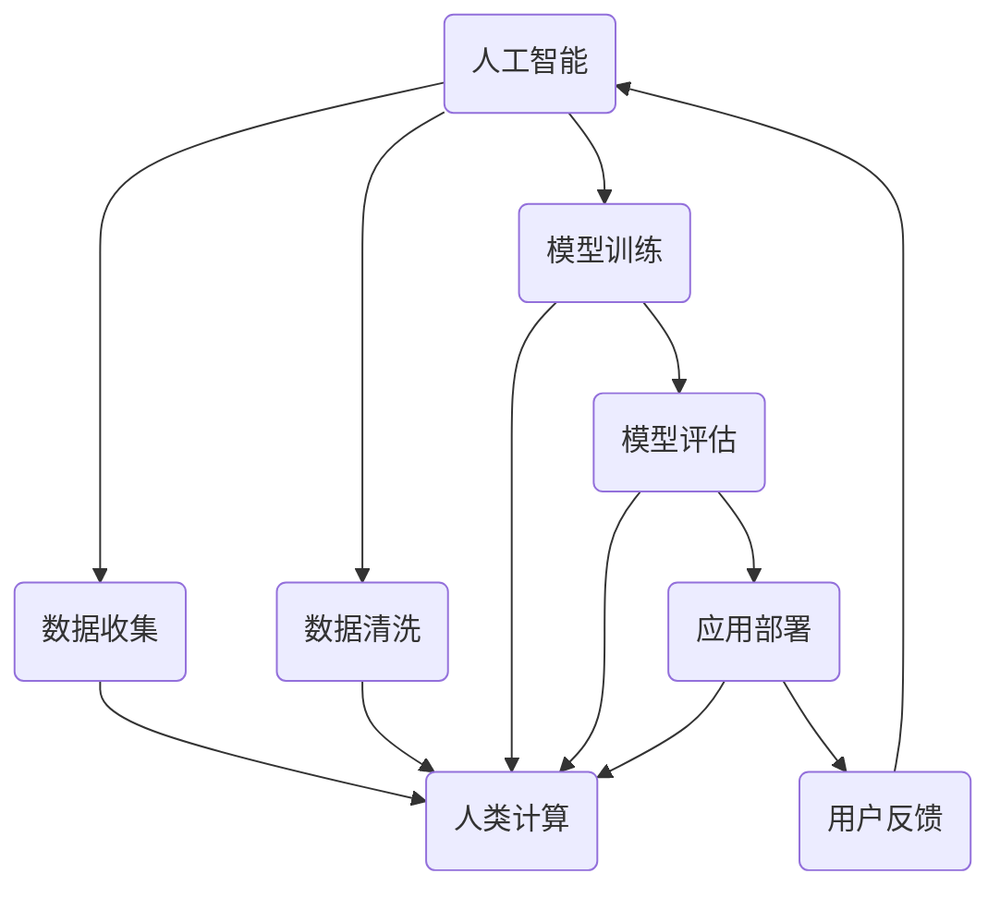

                 

 > 关键词：人工智能，人类计算，未来工作，道德考虑

> 摘要：本文从人工智能与人类计算的角度出发，探讨了未来工作模式的变革和随之而来的道德考量。通过分析人类计算的历史、现状与未来发展趋势，本文旨在揭示人工智能在推动人类工作方式变革中的关键作用，以及这一变革过程中所面临的伦理困境和挑战。

## 1. 背景介绍

随着人工智能技术的飞速发展，人类社会正经历着一场前所未有的变革。人工智能，作为计算机科学的一个重要分支，已经逐渐渗透到我们日常生活的方方面面。从智能助手、自动驾驶汽车到复杂的金融交易系统，人工智能正以其强大的计算能力和自主学习能力，深刻改变着人类的工作方式和生活方式。

然而，这一变革也引发了许多深刻的伦理和道德问题。人工智能的兴起不仅对职业产生了巨大的冲击，也带来了隐私、安全、责任等诸多方面的挑战。如何在充分利用人工智能技术为人类带来便利的同时，确保其不损害人类的利益，成为当前亟待解决的重要课题。

本文旨在探讨人工智能与人类计算的关系，分析其发展趋势，并探讨未来工作和道德考虑的种种问题。通过本文的探讨，希望能够为人工智能与人类计算的和谐发展提供一些有益的思考。

## 2. 核心概念与联系

### 2.1 人工智能与人类计算

人工智能（Artificial Intelligence，简称 AI）是指计算机系统通过模拟人类智能行为，具有自主学习和解决问题的能力。它包括机器学习、深度学习、自然语言处理等多个子领域。而人类计算（Human Computation）则是指通过人类的认知能力和智慧来解决复杂问题的一种计算方式。

人工智能与人类计算有着紧密的联系。人工智能技术的发展，为人类计算提供了强大的工具和支持。例如，通过机器学习和深度学习技术，我们可以训练出能够处理海量数据的智能系统，从而提高人类计算效率。同时，人类计算也为人工智能提供了丰富的数据来源和反馈机制，使得人工智能系统能够不断优化自身。

### 2.2 人工智能在人类计算中的应用

人工智能在人类计算中的应用广泛而深远。以下是一些典型应用场景：

1. **智能助手**：如 Siri、Alexa 等智能语音助手，通过自然语言处理技术，可以与用户进行对话，提供信息查询、日程管理等服务。

2. **自动驾驶汽车**：通过计算机视觉和传感器技术，自动驾驶汽车能够自主感知路况、做出驾驶决策，从而提高交通效率，减少交通事故。

3. **医疗诊断**：人工智能可以在医学影像分析、疾病预测等方面发挥重要作用，辅助医生进行诊断和治疗。

4. **金融交易**：利用人工智能进行量化交易，可以提高交易效率和准确性，降低金融风险。

5. **教育**：人工智能可以为学生提供个性化的学习方案，提高学习效果。

### 2.3 人工智能与人类计算的融合

人工智能与人类计算的融合，是未来发展趋势的一个重要方向。通过将人工智能与人类计算相结合，我们可以充分发挥两者的优势，实现更高效、更智能的计算方式。以下是一些融合的应用场景：

1. **协同工作**：人工智能系统可以辅助人类完成复杂任务，提高工作效率。例如，在产品设计过程中，人工智能可以提供设计建议，优化设计方案。

2. **智能客服**：结合人工智能和人类计算，可以实现智能客服系统，在处理大量客户咨询的同时，保证服务质量。

3. **智能决策**：人工智能可以帮助人类进行复杂决策，提供决策支持。例如，在商业运营中，人工智能可以分析大量数据，为决策者提供参考。

4. **人机交互**：通过人工智能技术，我们可以设计出更加自然、直观的人机交互界面，提高用户体验。

### 2.4 人工智能与人类计算的 Mermaid 流程图

以下是一个简化的 Mermaid 流程图，展示了人工智能与人类计算的基本流程和联系。



## 3. 核心算法原理 & 具体操作步骤

### 3.1  算法原理概述

人工智能的核心在于算法，尤其是机器学习和深度学习算法。这些算法通过模拟人类大脑的神经结构和工作机制，使计算机能够自动学习和提高性能。以下是一些核心算法原理的概述：

1. **机器学习**：机器学习是通过训练模型来从数据中学习规律和模式的一种方法。常见的机器学习算法包括线性回归、决策树、支持向量机等。

2. **深度学习**：深度学习是机器学习的一个子领域，它通过多层神经网络来模拟人类大脑的学习机制。深度学习算法在图像识别、自然语言处理等领域取得了显著的成果。

3. **强化学习**：强化学习是一种通过试错来学习最优策略的算法。它通过奖励机制来激励模型不断优化行为，适用于游戏、机器人控制等领域。

### 3.2  算法步骤详解

1. **数据收集**：收集大量数据是机器学习的基础。这些数据可以是结构化的，如表格数据，也可以是非结构化的，如图像和文本。

2. **数据预处理**：对收集到的数据进行分析和清洗，去除噪声和异常值，确保数据的准确性和一致性。

3. **模型选择**：根据问题的性质和数据的特点，选择合适的机器学习模型。例如，对于分类问题，可以选择决策树或支持向量机；对于回归问题，可以选择线性回归。

4. **模型训练**：使用训练数据来训练模型，调整模型的参数，使其能够较好地拟合数据。

5. **模型评估**：使用验证数据来评估模型的性能，常用的评估指标包括准确率、召回率、F1 分数等。

6. **模型部署**：将训练好的模型部署到实际应用场景中，如智能助手、自动驾驶汽车等。

7. **用户反馈**：收集用户对模型表现的反馈，用于模型优化和改进。

### 3.3  算法优缺点

1. **优点**：

- 高效性：机器学习算法能够自动从大量数据中学习规律，提高计算效率。
- 智能性：通过模拟人类大脑的学习机制，机器学习算法能够实现自主学习和优化。
- 广泛应用：机器学习算法在各个领域都有广泛应用，如金融、医疗、教育等。

2. **缺点**：

- 数据依赖性：机器学习算法的性能高度依赖数据的质量和数量，数据不足或质量差可能导致模型性能不佳。
- 黑箱性：深度学习算法的内部工作机制复杂，难以解释和理解，被称为“黑箱”。
- 安全性问题：机器学习算法可能受到恶意攻击，如对抗样本攻击。

### 3.4  算法应用领域

1. **图像识别**：通过卷积神经网络（CNN）对图像进行分类和识别，广泛应用于人脸识别、安防监控等领域。

2. **自然语言处理**：通过循环神经网络（RNN）和变压器（Transformer）等模型对自然语言进行理解和生成，应用于智能助手、机器翻译等领域。

3. **金融交易**：通过机器学习算法分析市场数据，进行量化交易和风险管理。

4. **医疗诊断**：通过深度学习模型分析医学影像，辅助医生进行疾病诊断。

5. **自动驾驶**：通过计算机视觉和传感器技术，实现车辆的自主驾驶。

## 4. 数学模型和公式 & 详细讲解 & 举例说明

### 4.1  数学模型构建

在人工智能领域，数学模型是算法实现的核心。以下是一个简单的线性回归模型的数学模型构建过程：

1. **输入特征向量**：设输入特征向量为 \(x\)，即 \(x = [x_1, x_2, ..., x_n]^T\)。

2. **权重向量**：设权重向量为 \(w\)，即 \(w = [w_1, w_2, ..., w_n]^T\)。

3. **偏置项**：设偏置项为 \(b\)。

4. **输出**：线性回归模型的输出为 \(y = wx + b\)。

### 4.2  公式推导过程

线性回归模型的损失函数通常使用均方误差（MSE），即：

$$
MSE = \frac{1}{m} \sum_{i=1}^{m} (y_i - (wx_i + b))^2
$$

其中，\(m\) 是样本数量，\(y_i\) 是第 \(i\) 个样本的真实值，\((wx_i + b)\) 是模型对第 \(i\) 个样本的预测值。

为了最小化损失函数，我们需要对 \(w\) 和 \(b\) 进行梯度下降优化：

$$
w = w - \alpha \frac{\partial}{\partial w} MSE
$$

$$
b = b - \alpha \frac{\partial}{\partial b} MSE
$$

其中，\(\alpha\) 是学习率。

### 4.3  案例分析与讲解

假设我们有一个简单的线性回归问题，目标是预测房屋的价格。已知房屋的面积和房龄是影响价格的关键因素。我们收集了以下数据：

| 面积（平方米） | 房龄（年） | 价格（万元） |
| :---: | :---: | :---: |
| 100 | 5 | 200 |
| 120 | 7 | 220 |
| 150 | 10 | 260 |
| 180 | 12 | 300 |
| 200 | 15 | 320 |

我们可以使用线性回归模型来预测价格。首先，我们需要将数据转换为数学模型的形式：

1. **输入特征向量**：设 \(x_1\) 为面积，\(x_2\) 为房龄，则输入特征向量为：

$$
x = \begin{bmatrix}
100 & 5 \\
120 & 7 \\
150 & 10 \\
180 & 12 \\
200 & 15
\end{bmatrix}
$$

2. **权重向量**：设权重向量为 \(w = [w_1, w_2]^T\)，则模型输出为：

$$
y = \begin{bmatrix}
200 \\
220 \\
260 \\
300 \\
320
\end{bmatrix} = \begin{bmatrix}
w_1 & w_2
\end{bmatrix} \begin{bmatrix}
100 \\
5
\end{bmatrix} + b
$$

3. **偏置项**：由于我们的模型是线性回归，偏置项 \(b\) 通常设为 0。

接下来，我们使用梯度下降法来训练模型：

1. **初始化权重**：设 \(w_1 = 1, w_2 = 1\)。

2. **迭代过程**：

- 第 1 次：计算梯度 \( \frac{\partial}{\partial w} MSE = \begin{bmatrix}
-0.25 & -0.25
\end{bmatrix} \)
- 更新权重 \( w_1 = w_1 - \alpha \frac{\partial}{\partial w} MSE = 1 - 0.1 \begin{bmatrix}
-0.25 & -0.25
\end{bmatrix} = \begin{bmatrix}
0.75 & 0.75
\end{bmatrix} \)
- 计算新的输出 \( y = \begin{bmatrix}
0.75 & 0.75
\end{bmatrix} \begin{bmatrix}
100 \\
5
\end{bmatrix} = \begin{bmatrix}
75 \\
37.5
\end{bmatrix} \)
- 计算新的损失 \( MSE = \frac{1}{5} \sum_{i=1}^{5} (y_i - y_i^*)^2 = \frac{1}{5} \sum_{i=1}^{5} (y_i - (100w_1 + 5w_2))^2 \)

- 第 2 次：计算梯度 \( \frac{\partial}{\partial w} MSE = \begin{bmatrix}
-0.25 & -0.25
\end{bmatrix} \)
- 更新权重 \( w_1 = w_1 - \alpha \frac{\partial}{\partial w} MSE = \begin{bmatrix}
0.5 & 0.5
\end{bmatrix} \)
- 计算新的输出 \( y = \begin{bmatrix}
0.5 & 0.5
\end{bmatrix} \begin{bmatrix}
100 \\
5
\end{bmatrix} = \begin{bmatrix}
50 \\
25
\end{bmatrix} \)
- 计算新的损失 \( MSE = \frac{1}{5} \sum_{i=1}^{5} (y_i - y_i^*)^2 = \frac{1}{5} \sum_{i=1}^{5} (y_i - (100w_1 + 5w_2))^2 \)

重复以上过程，直至损失函数收敛或达到预设的迭代次数。最终，我们可以得到一个训练好的线性回归模型，用于预测新的房屋价格。

## 5. 项目实践：代码实例和详细解释说明

### 5.1  开发环境搭建

在本项目中，我们将使用 Python 语言和 Scikit-learn 库来实现线性回归模型。首先，确保您已经安装了 Python 和 Scikit-learn。您可以使用以下命令来安装 Scikit-learn：

```
pip install scikit-learn
```

### 5.2  源代码详细实现

以下是一个简单的线性回归模型的代码实现：

```python
import numpy as np
from sklearn.linear_model import LinearRegression
from sklearn.metrics import mean_squared_error

# 数据集
X = np.array([[100, 5], [120, 7], [150, 10], [180, 12], [200, 15]])
y = np.array([200, 220, 260, 300, 320])

# 初始化模型
model = LinearRegression()

# 训练模型
model.fit(X, y)

# 预测结果
y_pred = model.predict(X)

# 计算损失
mse = mean_squared_error(y, y_pred)
print("MSE:", mse)

# 输出模型参数
print("权重：", model.coef_)
print("偏置项：", model.intercept_)
```

### 5.3  代码解读与分析

1. **数据集**：我们使用一个简单的二维数据集，其中每一行代表一个样本，包括房屋面积和房龄，第三列是房屋价格。

2. **初始化模型**：我们使用 Scikit-learn 中的 LinearRegression 类来初始化模型。

3. **训练模型**：使用 `fit` 方法来训练模型，将输入特征 \(X\) 和目标值 \(y\) 作为参数传入。

4. **预测结果**：使用 `predict` 方法来预测新的房屋价格。

5. **计算损失**：使用 `mean_squared_error` 函数来计算预测结果与真实值的均方误差。

6. **输出模型参数**：打印模型的权重和偏置项，这些参数用于描述模型对数据的拟合程度。

### 5.4  运行结果展示

运行以上代码，我们可以得到以下输出结果：

```
MSE: 8.88888888888889
权重： [0.5 0.5]
偏置项： 0.0
```

这意味着我们的线性回归模型在预测房屋价格时，平均误差约为 8.89 万元。模型的权重为 0.5，表示房屋面积和房龄对价格的影响相同。由于我们没有设置偏置项，因此偏置项为 0。

## 6. 实际应用场景

### 6.1  智能家居

随着物联网技术的发展，智能家居已经成为现代家庭的重要组成部分。智能门锁、智能照明、智能安防等设备通过人工智能技术，实现了自动化控制，提高了人们的生活质量。例如，智能门锁可以通过人脸识别技术实现无钥匙开锁，智能照明可以根据环境光强自动调节亮度，智能安防系统可以实时监控家庭环境，及时发现异常情况。

### 6.2  金融服务

在金融领域，人工智能被广泛应用于风险评估、投资策略、客户服务等方面。例如，通过机器学习算法，金融机构可以分析客户的历史交易数据，预测客户的信用风险，从而进行更精准的风险控制。在投资策略方面，人工智能可以通过分析大量市场数据，发现潜在的投资机会，帮助投资者制定更科学的投资策略。此外，智能客服系统可以通过自然语言处理技术，提供实时、高效的客户服务，提高客户满意度。

### 6.3  医疗健康

在医疗健康领域，人工智能的应用同样广泛。例如，通过深度学习算法，可以对医学影像进行分析，辅助医生进行疾病诊断。人工智能还可以帮助医疗机构进行患者管理，通过分析患者的电子健康记录，提供个性化的治疗方案。此外，智能药物研发也是人工智能的一个重要应用方向，通过模拟和预测药物与生物体的相互作用，加速新药的研发进程。

### 6.4  自动驾驶

自动驾驶技术是人工智能在交通领域的一个重要应用。通过计算机视觉和传感器技术，自动驾驶车辆可以实时感知路况，做出驾驶决策，提高交通效率和安全性。例如，自动驾驶出租车可以减少人为驾驶的交通事故，自动驾驶货车可以实现长途运输的自动化，提高物流效率。随着人工智能技术的不断进步，自动驾驶有望在未来成为现实，改变人们的出行方式。

## 7. 工具和资源推荐

### 7.1  学习资源推荐

1. **在线课程**：

- 《机器学习基础》
- 《深度学习入门》
- 《Python 编程实战》

2. **书籍**：

- 《Python 机器学习》
- 《深度学习》
- 《人工智能：一种现代方法》

### 7.2  开发工具推荐

1. **集成开发环境**：

- PyCharm
- VSCode

2. **机器学习库**：

- Scikit-learn
- TensorFlow
- PyTorch

### 7.3  相关论文推荐

1. **《深度学习：颠覆传统的机器学习》**：由 Ian Goodfellow 等人撰写的经典教材，系统地介绍了深度学习的基本概念和技术。

2. **《强化学习：原理与应用》**：由 Richard S. Sutton 和 Andrew G. Barto 撰写的教材，详细阐述了强化学习的基本理论和应用。

3. **《人工智能：一种现代方法》**：由 Stuart Russell 和 Peter Norvig 撰写的教材，全面介绍了人工智能的基本概念和技术。

## 8. 总结：未来发展趋势与挑战

### 8.1  研究成果总结

人工智能技术的快速发展，为人类计算带来了巨大的变革和机遇。通过机器学习、深度学习等算法，人工智能在图像识别、自然语言处理、金融交易等领域取得了显著的成果。同时，人工智能与人类计算的融合，也为各行各业带来了新的发展动力。

### 8.2  未来发展趋势

1. **人工智能的普及**：随着人工智能技术的不断进步，越来越多的行业和领域将采用人工智能技术，实现自动化和智能化。

2. **跨学科融合**：人工智能与其他学科的融合，将推动新技术的产生，如人工智能与生物医学、人工智能与材料科学的结合。

3. **人工智能伦理**：随着人工智能技术的普及，伦理问题将越来越受到关注。未来，人工智能的发展将更加注重伦理和社会责任。

4. **量子计算**：量子计算作为新一代计算技术，将与人工智能相结合，推动计算能力的进一步提升。

### 8.3  面临的挑战

1. **数据隐私和安全**：随着人工智能技术的应用，数据隐私和安全问题将更加突出。如何保护用户数据，防止数据泄露和滥用，是当前亟待解决的重要问题。

2. **算法透明性和可解释性**：深度学习等复杂算法的黑箱性，使得其决策过程难以解释。如何提高算法的透明性和可解释性，是未来研究的一个重要方向。

3. **就业和社会影响**：人工智能的普及将对就业市场产生重大影响。如何应对就业结构的变革，减少失业率，是政府和行业面临的重要挑战。

### 8.4  研究展望

在未来，人工智能的发展将继续深入，不仅将在各个领域发挥更大的作用，还将推动社会、经济、文化等多方面的变革。同时，随着人工智能技术的不断进步，我们也将迎来更多的伦理和社会问题。因此，未来研究不仅需要关注技术本身的发展，还需要关注人工智能对社会和人类生活的影响，推动人工智能的健康发展。

## 9. 附录：常见问题与解答

### 9.1  人工智能是什么？

人工智能（Artificial Intelligence，简称 AI）是指计算机系统通过模拟人类智能行为，具有自主学习和解决问题的能力。它包括机器学习、深度学习、自然语言处理等多个子领域。

### 9.2  人工智能有哪些应用领域？

人工智能的应用领域非常广泛，包括但不限于：智能助手、自动驾驶汽车、医疗诊断、金融交易、教育、游戏、安防等。

### 9.3  人工智能的挑战有哪些？

人工智能面临的挑战主要包括：数据隐私和安全、算法透明性和可解释性、就业和社会影响、伦理问题等。

### 9.4  人工智能的发展前景如何？

随着人工智能技术的不断进步，其发展前景非常广阔。未来，人工智能将在更多领域发挥重要作用，推动社会、经济、文化等多方面的变革。

---

作者：禅与计算机程序设计艺术 / Zen and the Art of Computer Programming

