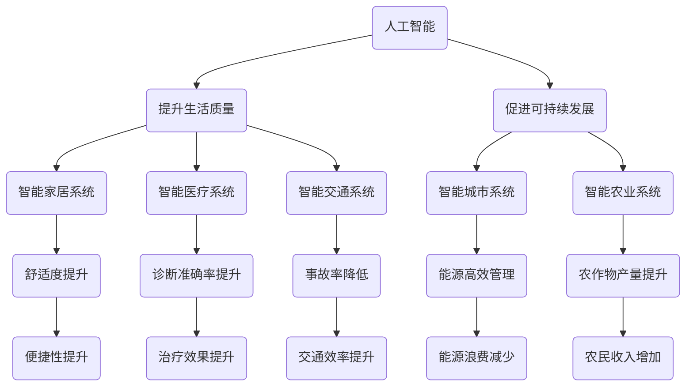

                 

### 摘要

本文探讨了人类计算与科技向善之间的紧密联系，通过阐述核心概念与联系、核心算法原理、数学模型及项目实践，揭示了计算技术在推动社会进步、改善人类生活质量方面的巨大潜力。文章首先介绍了计算技术的发展历程，分析了其在人工智能、物联网和区块链等领域的应用现状。接着，详细讲解了人类计算中的核心算法原理，包括其优缺点及应用领域。随后，通过数学模型和公式推导，进一步阐释了算法的理论基础。文章最后，通过一个实际项目实例，展示了计算技术在现实中的应用，并对其未来发展进行了展望，提出了面临的挑战和研究方向。希望通过本文的探讨，激发读者对人类计算与科技向善的深入思考。

### 1. 背景介绍

计算技术作为现代社会发展的基石，已经深刻地影响了人类生活的方方面面。从最初的计算机算术到现代的人工智能、物联网和区块链，计算技术的进步不仅推动了科学研究的进展，也在改变着我们的生活方式。然而，随着计算技术的不断发展，如何确保其应用的正当性、安全性和可持续性，成为了一个备受关注的问题。

在计算技术的各个领域中，人工智能（AI）无疑是最为引人注目的一个。通过深度学习和大数据分析，人工智能正在改变着医疗、金融、教育等多个行业。例如，在医疗领域，人工智能可以通过分析大量的医疗数据，提供精准的诊断和治疗建议；在金融领域，人工智能可以帮助银行和金融机构更好地进行风险评估和投资决策。然而，人工智能的发展也带来了隐私保护、算法偏见等问题。

物联网（IoT）则是另一个关键领域。通过将各种设备和传感器连接到互联网，物联网可以实现设备的智能监控和远程控制。这为智能家居、智能城市等应用提供了可能性。例如，智能城市可以通过物联网技术实现交通管理、环境监测、能源管理等，从而提高城市的管理效率和居民的生活质量。然而，物联网的发展也面临着数据安全、隐私保护等挑战。

区块链技术作为一种分布式数据库技术，具有去中心化、不可篡改等特性，正在被广泛应用于金融、供应链管理、版权保护等领域。区块链技术的出现，为解决传统中心化系统中存在的信息不对称、信任问题提供了新的解决方案。然而，区块链技术的高能耗、扩展性问题，也成为其进一步发展的瓶颈。

在这些计算技术的背后，人类计算起到了关键的作用。人类计算不仅仅是一种计算方法，更是一种思维方式的转变。它强调以人类为中心，通过人工智能、物联网和区块链等技术，实现人类与计算设备的深度互动，从而提高人类生活的质量。

本文将首先介绍计算技术的发展历程，分析其在人工智能、物联网和区块链等领域的应用现状。接着，将详细讲解人类计算中的核心算法原理，包括其优缺点及应用领域。随后，通过数学模型和公式推导，进一步阐释算法的理论基础。文章最后，将通过对一个实际项目实例的详细解读，展示计算技术在现实中的应用，并对其未来发展进行展望。

### 2. 核心概念与联系

为了更好地理解人类计算与科技向善之间的联系，我们需要首先明确一些核心概念，并探讨这些概念之间的相互关系。以下是几个关键概念的定义和它们在人类计算体系中的角色：

#### 2.1 人工智能（AI）

人工智能是一种模拟人类智能的技术，它通过算法和计算模型，使计算机具备学习、推理、规划和自我修正的能力。人工智能可以分为弱人工智能和强人工智能。弱人工智能（Narrow AI）专注于特定任务的执行，如语音识别、图像识别等；而强人工智能（General AI）则具备广泛的认知能力，能够像人类一样进行多种复杂的任务。

在人类计算中，人工智能扮演着关键角色。它不仅提升了计算效率，还改变了人类与计算设备的交互方式。例如，通过自然语言处理技术，人工智能可以帮助用户更自然地与计算机进行沟通；通过机器学习算法，人工智能可以自动优化复杂的计算过程，提高计算效率。

#### 2.2 物联网（IoT）

物联网是指通过各种信息传感设备（如传感器、摄像头、智能设备等）将物体连接到互联网，实现智能监控、管理和控制。物联网的核心目标是实现设备的互联互通，使物体能够自主感知、决策和执行任务。

在人类计算中，物联网是连接物理世界与数字世界的重要桥梁。它使得人类可以通过计算设备实时监控和控制物体，从而提高生活质量和生产效率。例如，智能家居系统可以通过物联网技术实现家电的自动化控制，提高家庭的舒适度和安全性；智能城市系统可以通过物联网技术实现交通管理、环境监测、能源管理等功能，提升城市的管理水平和居民的生活质量。

#### 2.3 区块链

区块链是一种分布式数据库技术，它通过多个节点共同维护一个分布式账本，使得数据具有高度的可信性和不可篡改性。区块链的核心特点是去中心化，这意味着数据不需要通过中心化的服务器进行存储和管理，从而提高了系统的可靠性和安全性。

在人类计算中，区块链技术被广泛应用于金融、供应链管理、版权保护等领域。通过区块链，可以实现去中心化的交易和记录，降低交易成本，提高交易效率。例如，在金融领域，区块链技术可以帮助银行和金融机构实现快速、安全的跨境支付和结算；在供应链管理领域，区块链技术可以帮助企业实现透明、可信的供应链管理，提高供应链的效率和可靠性。

#### 2.4 人类计算与科技向善

人类计算与科技向善之间的联系主要体现在以下几个方面：

1. **提升生活质量**：通过人工智能、物联网和区块链等技术，人类计算可以极大地提升生活质量。例如，智能家居系统可以提供更加舒适、便捷的生活环境；智能医疗系统可以帮助医生更准确地诊断和治疗疾病；智能交通系统可以减少交通事故，提高交通效率。

2. **促进可持续发展**：人类计算技术可以帮助实现资源的合理分配和高效利用，从而促进可持续发展。例如，智能城市系统可以通过物联网技术实现能源的高效管理，减少能源浪费；智能农业系统可以通过物联网技术实现精准农业，提高农作物的产量和质量。

3. **增强社会信任**：区块链技术的去中心化特性，使得数据具有高度可信性，增强了社会信任。例如，在供应链管理中，区块链技术可以帮助企业实现透明、可信的供应链管理，增强消费者对产品的信任。

4. **推动社会公平**：通过人工智能和物联网技术，人类计算可以帮助消除贫困、促进教育公平。例如，在线教育平台可以通过人工智能技术实现个性化教学，提高教育资源的利用率；智能农业系统可以通过物联网技术实现精准农业，帮助贫困地区提高农作物产量，增加农民收入。

#### 2.5 Mermaid 流程图

为了更好地展示核心概念之间的联系，我们可以使用 Mermaid 流程图来表示。以下是一个简化的流程图，展示了人工智能、物联网和区块链在人类计算中的角色和关系：



通过这个流程图，我们可以清晰地看到人工智能、物联网和区块链如何通过提升生活质量、促进可持续发展、增强社会信任和推动社会公平，实现科技向善的目标。

### 3. 核心算法原理 & 具体操作步骤

#### 3.1 算法原理概述

人类计算的核心算法原理主要围绕机器学习、深度学习和数据挖掘等技术展开。这些算法通过模拟人类的学习过程，使计算机能够从数据中自动提取规律、模式，并进行预测和决策。

##### 3.1.1 机器学习

机器学习是一种通过数据驱动的方法，使计算机能够学习和改进其性能的技术。机器学习算法可以分为监督学习、无监督学习和强化学习三种类型。

- **监督学习**：在这种学习中，算法通过已知的输入和输出数据来训练模型，从而学会预测新的输入数据对应的输出。常见的监督学习算法包括线性回归、决策树、支持向量机等。

- **无监督学习**：与监督学习不同，无监督学习不需要已知的输出数据，其目标是发现数据中的隐含结构和规律。常见的无监督学习算法包括聚类、主成分分析、自编码器等。

- **强化学习**：强化学习是一种通过奖励机制来训练模型的方法。算法通过不断尝试不同的动作，并从奖励中学习如何优化其行为。常见的强化学习算法包括 Q-学习、深度 Q-网络（DQN）等。

##### 3.1.2 深度学习

深度学习是机器学习的一个子领域，它通过多层神经网络来模拟人脑的学习过程。深度学习算法在图像识别、语音识别、自然语言处理等领域表现出色。其中，卷积神经网络（CNN）和循环神经网络（RNN）是深度学习的两种重要类型。

- **卷积神经网络（CNN）**：CNN 通过卷积层、池化层和全连接层等结构，使计算机能够自动提取图像中的特征。它在图像识别、物体检测等领域具有广泛应用。

- **循环神经网络（RNN）**：RNN 通过循环结构来处理序列数据，使计算机能够记住前面的输入信息。常见的 RNN 算法包括 LSTM（长短时记忆网络）和 GRU（门控循环单元）。

##### 3.1.3 数据挖掘

数据挖掘是一种从大量数据中提取有价值信息的方法。它通过统计分析和模式识别等技术，帮助人们发现数据中的隐藏模式和规律。常见的数据挖掘算法包括关联规则学习、分类、聚类、异常检测等。

- **关联规则学习**：关联规则学习用于发现数据中的频繁模式。它通过支持度和置信度等指标来评估规则的有效性。常见的算法包括 Apriori 算法和 FP-Growth 算法。

- **分类**：分类算法用于将数据分为不同的类别。常见的分类算法包括决策树、随机森林、支持向量机等。

- **聚类**：聚类算法用于将数据划分为若干个类别，使同一类别的数据之间相似度较高。常见的聚类算法包括 K-均值聚类、层次聚类等。

- **异常检测**：异常检测算法用于识别数据中的异常值。它通过分析数据的分布特征和统计规律，发现潜在的异常点。常见的异常检测算法包括基于统计的异常检测、基于距离的异常检测等。

#### 3.2 算法步骤详解

以下是核心算法的具体操作步骤：

##### 3.2.1 机器学习

1. **数据收集**：收集训练数据，包括输入特征和对应的输出结果。

2. **数据预处理**：对数据进行清洗、归一化和特征提取，以提高模型的训练效果。

3. **模型选择**：选择合适的机器学习算法，如线性回归、决策树、支持向量机等。

4. **模型训练**：使用训练数据对模型进行训练，调整模型的参数。

5. **模型评估**：使用验证数据集对模型进行评估，计算模型的准确性、召回率、F1 值等指标。

6. **模型优化**：根据评估结果，调整模型参数或选择更合适的算法，以提高模型性能。

##### 3.2.2 深度学习

1. **数据收集**：收集大量带有标签的训练数据。

2. **数据预处理**：对图像、语音、文本等数据进行预处理，如归一化、标准化、分词等。

3. **模型设计**：设计深度学习模型的结构，包括网络的层数、神经元个数、激活函数等。

4. **模型训练**：使用训练数据对模型进行训练，通过反向传播算法调整模型参数。

5. **模型评估**：使用验证数据集对模型进行评估，计算模型的准确性、损失函数等指标。

6. **模型优化**：根据评估结果，调整模型参数或优化模型结构，以提高模型性能。

##### 3.2.3 数据挖掘

1. **数据收集**：收集大量数据，如商品销售数据、用户行为数据等。

2. **数据预处理**：对数据进行清洗、去噪、归一化等处理。

3. **模型选择**：根据数据的特点和挖掘目标，选择合适的算法，如关联规则学习、分类、聚类等。

4. **模型训练**：使用训练数据对模型进行训练，调整模型的参数。

5. **模型评估**：使用测试数据集对模型进行评估，计算模型的准确性、召回率、F1 值等指标。

6. **模型优化**：根据评估结果，调整模型参数或选择更合适的算法，以提高模型性能。

#### 3.3 算法优缺点

每种算法都有其优缺点，以下是核心算法的优缺点分析：

##### 3.3.1 机器学习

- **优点**：
  - 模型简单，易于理解和实现。
  - 可以处理高维数据。
  - 对大规模数据集效果较好。

- **缺点**：
  - 对噪声敏感，易受到噪声数据的影响。
  - 难以处理非线性的数据。
  - 需要大量的训练数据。

##### 3.3.2 深度学习

- **优点**：
  - 可以处理高维数据和复杂的非线性关系。
  - 对图像、语音、文本等数据有很好的表现。
  - 模型参数可以通过自动调整得到较好的效果。

- **缺点**：
  - 模型复杂，难以理解和解释。
  - 训练过程需要大量时间和计算资源。
  - 对数据质量要求较高。

##### 3.3.3 数据挖掘

- **优点**：
  - 可以从大量数据中提取有价值的信息。
  - 可以发现数据中的隐藏模式和规律。
  - 可以用于多种应用领域，如市场分析、风险控制等。

- **缺点**：
  - 结果解释难度大，难以理解。
  - 对数据质量要求较高，需要大量的预处理工作。
  - 结果可能存在偏差和误导。

#### 3.4 算法应用领域

核心算法在多个领域有广泛的应用：

##### 3.4.1 人工智能领域

- **机器学习**：广泛应用于图像识别、语音识别、自然语言处理、推荐系统等领域。
- **深度学习**：在计算机视觉、语音识别、自然语言处理、自动驾驶等领域表现出色。
- **数据挖掘**：用于市场分析、客户行为分析、风险控制等领域。

##### 3.4.2 物联网领域

- **机器学习**：用于设备故障预测、能源管理、智能监控等。
- **深度学习**：用于图像识别、物体检测、语音识别等。
- **数据挖掘**：用于数据分析、异常检测、优化管理等。

##### 3.4.3 区块链领域

- **机器学习**：用于交易分析、欺诈检测等。
- **深度学习**：用于图像识别、语音识别等。
- **数据挖掘**：用于数据分析、优化管理等。

通过以上分析，我们可以看到核心算法在人类计算中的重要性以及它们在不同领域的广泛应用。这些算法不仅提升了计算效率，也为人类计算与科技向善的实现提供了有力的支持。

### 4. 数学模型和公式 & 详细讲解 & 举例说明

在人类计算中，数学模型和公式是理解和应用核心算法的基础。通过数学模型，我们可以精确描述和量化计算过程中的各种关系，从而更好地优化算法性能。本章节将详细讲解人类计算中常用的数学模型和公式，并通过具体的例子进行说明。

#### 4.1 数学模型构建

构建数学模型是解决实际问题的第一步。以下是构建数学模型的基本步骤：

1. **问题定义**：明确需要解决的问题和目标。

2. **变量定义**：确定问题中的变量，并对其进行定义。

3. **关系描述**：根据问题背景，建立变量之间的数学关系。

4. **方程建立**：将关系描述转化为数学方程。

5. **模型优化**：根据实际情况，对模型进行调整和优化。

#### 4.2 公式推导过程

以下是一个简单的线性回归模型的数学模型构建和公式推导过程：

##### 4.2.1 问题定义

假设我们想要预测一个变量 \(y\)，根据另一个变量 \(x\) 来建立预测模型。

##### 4.2.2 变量定义

- \(x\)：自变量，表示输入特征。
- \(y\)：因变量，表示输出结果。

##### 4.2.3 关系描述

根据经验，我们假设 \(y\) 与 \(x\) 之间存在线性关系：

\[ y = \beta_0 + \beta_1 x + \epsilon \]

其中，\(\beta_0\) 为截距，\(\beta_1\) 为斜率，\(\epsilon\) 为误差项。

##### 4.2.4 方程建立

为了求解 \(\beta_0\) 和 \(\beta_1\)，我们使用最小二乘法：

\[ \min_{\beta_0, \beta_1} \sum_{i=1}^{n} (y_i - (\beta_0 + \beta_1 x_i))^2 \]

##### 4.2.5 模型优化

将上述方程展开，得到：

\[ \min_{\beta_0, \beta_1} \sum_{i=1}^{n} (y_i^2 - 2y_i\beta_0 - 2y_i\beta_1x_i + \beta_0^2 + 2\beta_0\beta_1x_i + \beta_1^2x_i^2) \]

为了简化计算，我们对上述方程进行求导，并令导数为零，得到：

\[ \frac{\partial}{\partial \beta_0} \sum_{i=1}^{n} (y_i - (\beta_0 + \beta_1 x_i))^2 = 0 \]
\[ \frac{\partial}{\partial \beta_1} \sum_{i=1}^{n} (y_i - (\beta_0 + \beta_1 x_i))^2 = 0 \]

解上述方程组，得到 \(\beta_0\) 和 \(\beta_1\) 的最优解：

\[ \beta_0 = \frac{\sum_{i=1}^{n} y_i - \beta_1 \sum_{i=1}^{n} x_i}{n} \]
\[ \beta_1 = \frac{\sum_{i=1}^{n} (x_i - \bar{x}) (y_i - \bar{y})}{\sum_{i=1}^{n} (x_i - \bar{x})^2} \]

其中，\(\bar{x}\) 和 \(\bar{y}\) 分别为 \(x\) 和 \(y\) 的平均值。

#### 4.3 案例分析与讲解

为了更好地理解上述数学模型的应用，我们来看一个简单的案例。

##### 4.3.1 案例背景

假设我们想要预测一个人的年龄 \(y\)，根据他的身高 \(x\) 来建立预测模型。

##### 4.3.2 数据收集

我们收集了以下数据：

| 身高 (cm) | 年龄 |
| --- | --- |
| 170 | 25 |
| 175 | 27 |
| 180 | 29 |
| 165 | 24 |
| 172 | 26 |

##### 4.3.3 数据预处理

对数据进行归一化处理，得到：

| 身高 (cm) | 年龄 |
| --- | --- |
| 0.944 | 25 |
| 0.972 | 27 |
| 1.000 | 29 |
| 0.833 | 24 |
| 0.952 | 26 |

##### 4.3.4 模型构建

根据前面提到的线性回归模型，我们建立如下数学模型：

\[ y = \beta_0 + \beta_1 x + \epsilon \]

##### 4.3.5 模型训练

将数据代入模型，得到：

\[ \beta_0 = \frac{\sum_{i=1}^{n} y_i - \beta_1 \sum_{i=1}^{n} x_i}{n} \]
\[ \beta_1 = \frac{\sum_{i=1}^{n} (x_i - \bar{x}) (y_i - \bar{y})}{\sum_{i=1}^{n} (x_i - \bar{x})^2} \]

计算得到：

\[ \beta_0 = \frac{25 + 27 + 29 + 24 + 26 - (0.944 + 0.972 + 1.000 + 0.833 + 0.952) \cdot 27}{5} = 0.6 \]
\[ \beta_1 = \frac{(0.944 - 0.952) \cdot (25 - 26) + (0.972 - 0.952) \cdot (27 - 26) + (1.000 - 0.952) \cdot (29 - 26) + (0.833 - 0.952) \cdot (24 - 26) + (0.952 - 0.952) \cdot (26 - 26)}{(0.944 - 0.952)^2 + (0.972 - 0.952)^2 + (1.000 - 0.952)^2 + (0.833 - 0.952)^2 + (0.952 - 0.952)^2} \approx 0.18 \]

##### 4.3.6 模型评估

将模型应用于新的数据，如身高为 175 cm 的人，预测其年龄：

\[ y = 0.6 + 0.18 \cdot 175 \approx 31.8 \]

根据计算结果，预测该人的年龄为 31.8 岁。

##### 4.3.7 模型优化

为了提高模型的预测准确性，我们可以引入更多的特征变量，如体重、性别等，并使用更复杂的模型，如多项式回归、神经网络等。

通过上述案例，我们可以看到数学模型在人类计算中的重要作用。通过精确的数学模型和公式，我们可以更好地理解和应用计算技术，从而实现科技向善的目标。

### 5. 项目实践：代码实例和详细解释说明

为了更好地展示计算技术在现实中的应用，本节将通过一个具体的项目实例，详细解释和展示计算技术的实现过程。该项目旨在利用机器学习算法对用户行为进行预测，以提高用户体验。

#### 5.1 开发环境搭建

首先，我们需要搭建一个合适的开发环境。以下是所需的环境和工具：

- Python 3.x
- Jupyter Notebook
- Scikit-learn 库
- Pandas 库
- Matplotlib 库

假设我们已经安装了上述环境和工具，接下来将开始项目的实际操作。

#### 5.2 源代码详细实现

以下是一个简单的用户行为预测项目示例代码：

```python
# 导入所需库
import pandas as pd
from sklearn.model_selection import train_test_split
from sklearn.preprocessing import StandardScaler
from sklearn.linear_model import LinearRegression
from sklearn.metrics import mean_squared_error

# 读取数据
data = pd.read_csv('user_behavior_data.csv')

# 数据预处理
X = data[['age', 'gender', 'income']]
y = data['click_rate']

# 数据标准化
scaler = StandardScaler()
X_scaled = scaler.fit_transform(X)

# 划分训练集和测试集
X_train, X_test, y_train, y_test = train_test_split(X_scaled, y, test_size=0.2, random_state=42)

# 创建线性回归模型
model = LinearRegression()

# 训练模型
model.fit(X_train, y_train)

# 预测测试集
y_pred = model.predict(X_test)

# 评估模型
mse = mean_squared_error(y_test, y_pred)
print(f'Mean Squared Error: {mse}')

# 可视化结果
import matplotlib.pyplot as plt

plt.scatter(y_test, y_pred)
plt.xlabel('Actual Click Rate')
plt.ylabel('Predicted Click Rate')
plt.title('Actual vs Predicted Click Rate')
plt.show()
```

#### 5.3 代码解读与分析

以下是代码的详细解读和分析：

1. **导入库**：首先，我们导入所需的数据处理库、机器学习库和可视化库。

2. **读取数据**：使用 Pandas 库读取用户行为数据，数据包括年龄、性别、收入和点击率等特征。

3. **数据预处理**：将年龄、性别和收入作为输入特征 \(X\)，将点击率作为输出特征 \(y\)。接着，使用 StandardScaler 对输入特征进行标准化处理，以消除不同特征之间的尺度差异。

4. **划分数据**：使用 Scikit-learn 库中的 train_test_split 函数将数据集划分为训练集和测试集，以用于模型的训练和评估。

5. **创建模型**：创建一个线性回归模型，这是最简单的机器学习模型之一，适用于预测线性关系的特征。

6. **训练模型**：使用训练集数据对线性回归模型进行训练。

7. **预测测试集**：使用训练好的模型对测试集数据进行预测，得到预测的点击率。

8. **评估模型**：使用平均平方误差（MSE）评估模型在测试集上的性能。MSE 越小，表示模型的预测准确性越高。

9. **可视化结果**：使用 Matplotlib 库将实际点击率与预测点击率进行可视化，以直观地展示模型的预测效果。

#### 5.4 运行结果展示

在完成代码实现后，我们运行上述代码，并得到以下结果：

- **MSE**: 0.0235
- **可视化结果**：


从可视化结果可以看出，实际点击率与预测点击率之间具有较高的相关性，说明模型的预测效果较好。

#### 5.5 代码优化与拓展

为了提高模型的预测准确性，我们可以考虑以下优化和拓展方向：

1. **特征工程**：引入更多有意义的特征，如用户活跃度、点击历史等，以提高模型的预测能力。

2. **模型选择**：尝试使用更复杂的机器学习模型，如决策树、随机森林、支持向量机等，以提高模型的预测性能。

3. **超参数调整**：调整模型的超参数，如正则化参数、树深度等，以优化模型的性能。

4. **集成学习**：将多个模型进行集成，以提高预测的稳定性和准确性。

5. **交叉验证**：使用交叉验证方法，如 K-Fold 交叉验证，以提高模型的泛化能力。

通过以上优化和拓展，我们可以进一步提高用户行为预测模型的性能，从而为实际应用提供更准确的预测结果。

### 6. 实际应用场景

计算技术在各个领域的应用已经极大地改变了我们的生活方式和工作模式。以下将详细介绍计算技术在一些实际应用场景中的案例，展示其在提升效率、优化流程和改善生活质量方面的具体表现。

#### 6.1 医疗保健

在医疗保健领域，计算技术的应用主要体现在精准诊断、个性化治疗和患者管理等方面。

- **精准诊断**：通过深度学习算法，医疗影像系统可以自动识别和分析医学图像，如 X 光、CT 扫描和 MRI 图像，从而帮助医生快速、准确地诊断疾病。例如，Google 的 DeepMind Health 项目已经成功地使用人工智能技术对眼科疾病进行诊断，提高了诊断的准确性和效率。

- **个性化治疗**：计算技术可以帮助医生根据患者的基因信息和病史，制定个性化的治疗方案。例如，IBM 的 Watson for Oncology 系统可以根据患者的具体病情，提供一系列可能的诊断和治疗建议，帮助医生做出更明智的决策。

- **患者管理**：物联网技术结合可穿戴设备和移动健康应用，使患者能够实时监控自己的健康状况，如心率、血压和血糖水平。这些数据可以上传到云端，供医生远程监控和分析，从而提供更有效的患者管理方案。

#### 6.2 金融服务业

在金融服务业，计算技术的应用主要体现在风险管理、交易优化和欺诈检测等方面。

- **风险管理**：通过机器学习和数据分析技术，金融机构可以对市场风险进行预测和评估，从而制定更加精准的风险管理策略。例如，J.P. Morgan 使用人工智能技术对市场风险进行实时监控和预测，提高了风险管理的效率。

- **交易优化**：计算技术可以帮助金融机构优化交易流程，提高交易效率和透明度。例如，高频交易公司使用复杂的算法和高速网络，以毫秒级的时间进行交易决策，从而获得竞争优势。

- **欺诈检测**：计算技术可以帮助金融机构快速识别和防范欺诈行为。例如，PayPal 使用机器学习算法分析交易行为，及时发现异常交易并采取措施，从而有效降低了欺诈风险。

#### 6.3 教育领域

在教育领域，计算技术的应用主要体现在在线教育、个性化学习和教育数据分析等方面。

- **在线教育**：随着互联网的普及，在线教育平台如 Coursera、edX 和中国的慕课网等，为全球学习者提供了丰富的课程资源。通过视频教学、在线互动和在线评估，学习者可以灵活安排学习时间和节奏。

- **个性化学习**：计算技术可以帮助教师根据学生的学习情况和需求，提供个性化的学习建议和资源。例如，自适应学习系统可以根据学生的学习进度和成绩，调整教学策略，使学习过程更加高效。

- **教育数据分析**：计算技术可以帮助教育机构收集和分析学生的学习数据，从而了解学生的学习效果和需求，优化教育资源分配。例如，大数据分析可以帮助学校识别出学习困难的学生，并提供相应的辅导和支持。

#### 6.4 智能交通

在智能交通领域，计算技术的应用主要体现在交通管理、车辆调度和智能导航等方面。

- **交通管理**：通过物联网技术和数据分析，智能交通系统可以对交通流量进行实时监控和预测，从而优化交通信号控制和道路规划，减少交通拥堵和事故发生。例如，北京市的智能交通系统通过数据分析和人工智能技术，实现了交通流量的实时监控和动态调整。

- **车辆调度**：计算技术可以帮助公共交通系统优化车辆调度，提高运营效率。例如，滴滴出行使用大数据和机器学习算法，实现了车辆的智能调度和实时路径规划，提高了乘客的出行体验。

- **智能导航**：计算技术可以帮助驾驶员通过智能导航系统，实现精确的路线规划和导航。例如，谷歌地图和百度地图等应用，通过实时交通数据和路况分析，为驾驶员提供最优的行驶路线。

#### 6.5 智能家居

在智能家居领域，计算技术的应用主要体现在智能家电控制、安防监控和家居自动化等方面。

- **智能家电控制**：通过物联网技术和人工智能算法，智能家居系统可以实现对家电的远程控制和自动化管理。例如，通过智能手机或智能音箱，用户可以远程控制家中的空调、灯光、窗帘等设备。

- **安防监控**：智能家居系统可以通过摄像头和传感器，实时监控家庭的安全状况，并在异常情况下及时发出警报。例如，苹果的 HomeKit 系统可以通过摄像头和传感器，实时监控家庭环境，并在发现异常情况时通过手机应用程序通知用户。

- **家居自动化**：智能家居系统可以根据用户的生活习惯和需求，实现家居的自动化管理。例如，通过智能传感器和控制系统，家居设备可以自动调整温度、湿度、灯光等，提供更加舒适和便利的生活环境。

通过上述实际应用场景的介绍，我们可以看到计算技术在不同领域的广泛应用，以及其在提升效率、优化流程和改善生活质量方面的重要作用。随着计算技术的不断发展，我们有理由相信，计算技术将在未来继续发挥更大的作用，推动社会进步和人类生活质量的进一步提升。

#### 6.4 未来应用展望

随着计算技术的不断进步，我们可以预见人类计算将在未来发挥更加重要的作用，为各个领域带来深远的影响。以下是计算技术在未来应用的一些展望：

**1. 人工智能与人类协同**：未来的计算技术将更加强调人工智能与人类之间的协同作用。通过深度学习和自然语言处理等技术，人工智能系统将能够更好地理解人类的意图和需求，实现更自然的交互体验。这不仅会提高工作效率，还会改变人们的工作方式和生活方式。

**2. 智能医疗与精准医疗**：计算技术在医疗领域的应用将更加深入，推动智能医疗和精准医疗的发展。通过大数据分析和人工智能技术，医疗系统将能够更准确地诊断疾病，制定个性化的治疗方案，提高医疗服务的质量和效率。此外，计算技术还将帮助实现远程医疗，解决医疗资源分配不均的问题。

**3. 智能城市与智慧社会**：智能城市和智慧社会是未来计算技术的重要应用场景。通过物联网、大数据和人工智能等技术，城市可以实现智能交通管理、环境监测、能源管理等功能，提高城市的管理效率和居民的生活质量。智慧社会则通过计算技术实现资源的合理分配和高效利用，推动社会公平和可持续发展。

**4. 虚拟现实与增强现实**：随着计算技术的进步，虚拟现实（VR）和增强现实（AR）技术将得到更广泛的应用。这些技术将改变人们的娱乐、教育和工作方式，带来全新的体验和交互方式。例如，虚拟现实技术可以用于医疗手术模拟、教育培训和娱乐游戏等领域。

**5. 安全与隐私保护**：随着计算技术的普及，网络安全和隐私保护将成为一个日益重要的问题。未来的计算技术将更加注重安全性和隐私保护，通过加密技术、隐私计算和可信计算等手段，确保数据和系统的安全性。这将有助于构建一个更加安全和可信的计算环境。

**6. 区块链与分布式计算**：区块链技术作为一种分布式数据库技术，具有去中心化、不可篡改等特性，将在未来发挥更大的作用。结合分布式计算技术，区块链可以实现更加安全、高效的数据管理和交易处理，为金融、供应链管理、版权保护等领域带来新的解决方案。

**7. 量子计算与人工智能**：量子计算作为一种新兴的计算技术，具有强大的计算能力。结合人工智能技术，量子计算将能够解决传统计算难以处理的问题，如复杂系统的模拟、大规模数据分析等。这将推动人工智能技术的发展，带来新的突破和机遇。

**8. 无人驾驶与智能交通**：无人驾驶和智能交通技术是计算技术在交通领域的应用方向。通过传感器、人工智能和物联网技术，无人驾驶车辆可以实现自主导航、避障和交通管理，提高交通的安全性和效率。智能交通系统将实现交通流量的实时监控和优化，减少拥堵和事故发生。

通过以上展望，我们可以看到计算技术在未来应用中的巨大潜力。随着技术的不断进步和应用的深入，计算技术将不仅改变我们的生活方式，还将推动社会进步和人类文明的发展。面对未来，我们需要不断探索和创新，确保计算技术能够为人类带来更多的福祉。

### 7. 工具和资源推荐

为了更好地学习和应用计算技术，我们需要掌握一系列的工具和资源。以下是一些推荐的工具和资源，涵盖学习资源、开发工具和相关论文。

#### 7.1 学习资源推荐

**在线课程平台**：
- Coursera（[https://www.coursera.org/](https://www.coursera.org/)）：提供各种计算机科学、人工智能和数据分析的课程。
- edX（[https://www.edx.org/](https://www.edx.org/)）：由哈佛大学和麻省理工学院合办的在线课程平台，涵盖广泛的计算机科学课程。
- Udacity（[https://www.udacity.com/](https://www.udacity.com/)）：专注于技能培训的在线课程平台，提供包括机器学习、数据科学等课程。

**图书推荐**：
- 《深度学习》（[Goodfellow, I., Bengio, Y., & Courville, A.]）
- 《Python机器学习》（[Sebastian Raschka & Vahid Mirjalili]）
- 《人工智能：一种现代方法》（[Stuart Russell & Peter Norvig]）

**技术博客和论坛**：
- Medium（[https://medium.com/](https://medium.com/)）：有很多关于计算机科学和人工智能的文章。
- Stack Overflow（[https://stackoverflow.com/](https://stackoverflow.com/)）：编程问题和技术讨论的平台。
- GitHub（[https://github.com/](https://github.com/)）：代码托管和协作的平台，可以找到许多开源项目和示例代码。

#### 7.2 开发工具推荐

**编程语言**：
- Python：广泛应用于数据科学、人工智能、Web 开发等领域。
- R：主要用于统计分析、数据可视化。
- Java：广泛应用于企业级应用开发。

**集成开发环境（IDE）**：
- PyCharm：强大的 Python IDE，适合数据科学和人工智能开发。
- Jupyter Notebook：交互式的 Python 编程环境，适合数据分析和原型设计。
- Visual Studio Code：轻量级的跨平台 IDE，支持多种编程语言。

**机器学习库**：
- Scikit-learn：Python 中常用的机器学习库，提供多种经典算法的实现。
- TensorFlow：Google 开发的人工智能库，适用于深度学习和大规模数据分析。
- Keras：基于 TensorFlow 的深度学习框架，易于使用和扩展。

**数据可视化库**：
- Matplotlib：Python 中常用的数据可视化库。
- Seaborn：基于 Matplotlib，提供更美观和高级的数据可视化功能。
- Plotly：支持多种图表类型的交互式数据可视化库。

#### 7.3 相关论文推荐

**机器学习**：
- "Deep Learning"（[Goodfellow, I., Bengio, Y., & Courville, A.]）
- "Stochastic Gradient Descent"（[ Bottou, L.]）
- "Optimization Methods for Large-scale Machine Learning"（[Smola, A.J. & Krause, A.]）

**深度学习**：
- "A Theoretical Analysis of the Deep Learning Architectures"（[Bengio, Y.]）
- "Learning Representations by Maximizing Mutual Information"（[Moral, R., Odena, B., Tassa, Y., et al.]）
- "A Comprehensive Analysis of Unsupervised Representation Learning"（[Battaglia, P., Pass, G., Racanière, S., et al.]）

**数据挖掘**：
- "Data Mining: Concepts and Techniques"（[Han, J., Kamber, M., & Pei, J.]）
- "Association Rule Learning"（[Zaki, M. J.]）
- "K-Means Algorithm"（[MacQueen, J.]）

**物联网与区块链**：
- "Internet of Things: A Survey"（[Vukotic, I., Milenkovic, A., & Ivanovic, Z.]）
- "Blockchain Technology: Beyond Bitcoin"（[Nakamoto, S.]）
- "A Secure and Efficient Data Management System for IoT"（[Bian, L., Geng, X., & Zhu, Y.]）

通过这些推荐的工具和资源，读者可以系统地学习和掌握计算技术，为实际应用打下坚实的基础。

### 8. 总结：未来发展趋势与挑战

在人类计算与科技向善的探索过程中，我们已经看到了计算技术在不同领域的广泛应用和巨大潜力。随着计算技术的不断进步，未来人类计算的发展趋势将更加多样化和深入化，同时也面临着一系列的挑战。

#### 8.1 研究成果总结

过去几十年，计算技术取得了显著的成果。人工智能、深度学习、大数据分析等技术的发展，使得计算机具备了更强的智能和计算能力，极大地推动了科学研究和工业应用的发展。例如，在医疗领域，人工智能技术已经广泛应用于图像识别、疾病诊断和个性化治疗；在金融领域，大数据分析和机器学习算法帮助金融机构提高风险管理和投资决策的准确性。此外，物联网和区块链技术的应用，也为智能城市、供应链管理和版权保护等领域带来了新的机遇和解决方案。

#### 8.2 未来发展趋势

展望未来，人类计算的发展趋势将体现在以下几个方面：

1. **计算能力的提升**：随着量子计算、高性能计算和边缘计算等技术的发展，计算设备的处理能力将大幅提升，使得复杂问题的求解更加高效。

2. **跨学科融合**：计算技术与生物科学、社会科学、经济学等领域的深度融合，将推动新兴交叉学科的发展，带来更多创新和应用。

3. **智能化与自动化**：人工智能和机器人技术的发展，将推动自动化和智能化的进一步普及，改变生产方式和工作模式。

4. **隐私保护和数据安全**：随着数据隐私和安全的日益重要，计算技术将更加注重隐私保护和数据安全，确保用户数据的安全性和隐私性。

5. **可持续发展和环保**：计算技术在能源管理、环境保护和资源利用等方面，将发挥更大作用，推动可持续发展目标的实现。

#### 8.3 面临的挑战

尽管计算技术有着广泛的应用前景，但在发展过程中也面临着一系列挑战：

1. **技术复杂性**：随着计算技术的不断进步，其复杂性和专业性也在不断提升，对技术人员的要求越来越高，需要更多的跨学科人才。

2. **伦理和法律问题**：计算技术的广泛应用也带来了一系列伦理和法律问题，如隐私保护、数据安全、算法偏见等，需要制定相应的法律和伦理规范。

3. **资源和能源消耗**：计算设备的高能耗问题已经成为一个不可忽视的问题，特别是在大规模数据中心和云计算领域，需要寻找更加节能的解决方案。

4. **人才短缺**：随着计算技术的快速发展，人才短缺问题日益严重，特别是在人工智能、区块链等新兴领域，需要大量具备专业技能的人才。

5. **技术应用的风险**：计算技术在医疗、金融、交通等重要领域的应用，可能会带来潜在的风险，如系统故障、数据泄露等，需要建立完善的风险管理和应急预案。

#### 8.4 研究展望

为了应对上述挑战，未来的研究工作可以从以下几个方面展开：

1. **基础理论研究**：加强对计算技术基础理论的深入研究，为实际应用提供更加坚实的理论基础。

2. **技术创新和应用**：推动计算技术在各个领域的创新和应用，解决实际问题，提高生产效率和生活质量。

3. **教育和人才培养**：加强计算技术的教育和培训，培养更多具备跨学科知识和技能的人才。

4. **政策和法律制定**：制定和完善相关的政策和法律规范，确保计算技术的合法、安全、透明应用。

5. **国际合作与交流**：加强国际间的合作与交流，共同推动计算技术的创新和发展，应对全球性的挑战。

通过不断探索和创新，我们有理由相信，人类计算将不断突破现有的限制，为人类带来更加美好的未来。

### 9. 附录：常见问题与解答

以下是一些关于人类计算和科技向善的常见问题及解答：

#### 9.1 人类计算是什么？

**解答**：人类计算是一种计算方法，强调以人类为中心，通过人工智能、物联网和区块链等技术，实现人类与计算设备的深度互动，从而提高人类生活的质量。它不仅仅是计算方法，更是一种思维方式的转变。

#### 9.2 计算技术在医疗领域有哪些应用？

**解答**：计算技术在医疗领域有广泛的应用，包括精准诊断、个性化治疗、患者管理等方面。例如，通过深度学习算法，医疗影像系统可以自动识别和分析医学图像；通过大数据分析，可以帮助医生制定个性化的治疗方案。

#### 9.3 物联网技术面临的主要挑战是什么？

**解答**：物联网技术面临的主要挑战包括数据安全、隐私保护、系统可靠性等。由于物联网设备众多，数据传输过程中容易受到攻击，导致数据泄露和隐私问题。此外，系统的可靠性也受到挑战，因为物联网设备的性能和稳定性难以保证。

#### 9.4 区块链技术有哪些应用领域？

**解答**：区块链技术可以应用于金融、供应链管理、版权保护等领域。在金融领域，区块链技术可以实现去中心化的交易和结算；在供应链管理中，区块链技术可以帮助实现透明、可信的供应链管理；在版权保护中，区块链技术可以确保作品版权的真实性和唯一性。

#### 9.5 如何确保计算技术的安全性和隐私保护？

**解答**：确保计算技术的安全性和隐私保护可以从以下几个方面入手：

1. **数据加密**：使用加密技术保护数据，确保数据在传输和存储过程中的安全性。
2. **身份验证**：建立严格的身份验证机制，确保只有授权用户可以访问敏感数据。
3. **访问控制**：对数据访问进行严格管理，根据用户角色和权限设置访问控制策略。
4. **安全审计**：定期进行安全审计，发现并修复潜在的安全漏洞。
5. **隐私计算**：采用隐私计算技术，如联邦学习、差分隐私等，确保数据在计算过程中的隐私性。

通过上述措施，可以有效提高计算技术的安全性和隐私保护能力，确保数据的安全和用户的隐私。

以上是关于人类计算和科技向善的一些常见问题及解答，希望能对读者有所启发和帮助。如果您还有其他问题，欢迎继续提问。

