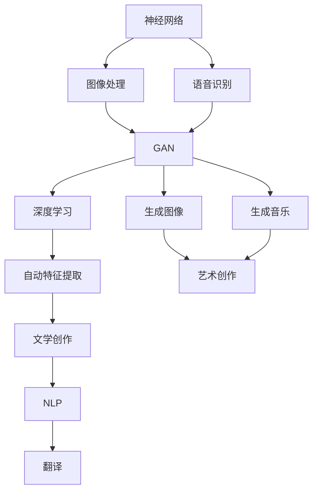

                 

关键词：人类计算、艺术、创意、算法、应用、数学模型、编程、技术发展

> 摘要：本文将探讨人类计算在艺术和创意领域的应用，从算法原理、数学模型、项目实践等多个角度，深入分析人类计算对艺术创作、创意设计等领域的深远影响，并提出未来发展的展望。

## 1. 背景介绍

人类计算是一种模拟人类思维过程的技术，旨在通过算法和模型实现人类智能的任务。在计算机科学和人工智能领域，人类计算已经取得了显著的进展。然而，在艺术和创意领域，人类计算的应用还相对较少。本文将探讨人类计算如何改变艺术和创意领域的创作过程，以及这种变化对未来艺术创作的影响。

### 1.1 艺术与创意的变革

随着技术的进步，艺术和创意领域正在经历一场深刻的变革。传统的艺术创作方式依赖于人类的直觉、情感和经验，而现代技术则提供了新的工具和方法，使得艺术创作更加多样化和高效。人类计算技术，如机器学习、深度学习等，正在被广泛应用于艺术和创意领域，为创作者提供新的灵感和技术支持。

### 1.2 人类计算的应用领域

人类计算在艺术和创意领域的应用非常广泛，包括但不限于以下几个方面：

- **图像处理与生成**：通过深度学习算法，计算机可以生成逼真的图像，甚至创造出全新的艺术风格。
- **音乐创作与合成**：利用机器学习模型，计算机可以创作出独特的音乐作品，甚至模仿著名作曲家的风格。
- **文学创作与翻译**：人工智能助手可以帮助人类作者进行文学创作，或者实现高质量的语言翻译。
- **游戏设计**：计算机可以自动生成游戏关卡和角色，甚至创造全新的游戏体验。

## 2. 核心概念与联系

为了深入探讨人类计算在艺术和创意领域的应用，我们需要了解以下几个核心概念：

- **神经网络**：一种模拟生物神经系统的计算模型，广泛应用于图像处理、语音识别等领域。
- **生成对抗网络（GAN）**：一种特殊的神经网络结构，用于生成逼真的图像和音乐。
- **深度学习**：一种复杂的机器学习技术，通过多层神经网络实现数据的自动特征提取。
- **自然语言处理（NLP）**：一门涉及语言理解和语言生成的交叉学科，广泛应用于文学创作和翻译。

以下是这些核心概念和联系的具体 Mermaid 流程图：



## 3. 核心算法原理 & 具体操作步骤

### 3.1 算法原理概述

在艺术和创意领域，人类计算的核心算法主要包括神经网络、生成对抗网络（GAN）和深度学习。以下是这些算法的基本原理：

- **神经网络**：通过多层神经元结构实现数据的自动特征提取和分类。
- **生成对抗网络（GAN）**：由生成器和判别器两个神经网络组成，通过对抗训练生成逼真的图像和音乐。
- **深度学习**：通过多层神经网络实现复杂的特征学习和模式识别。

### 3.2 算法步骤详解

#### 3.2.1 神经网络

1. 数据预处理：将输入数据转换为适合神经网络处理的形式。
2. 神经网络构建：设计并训练多层神经网络。
3. 特征提取：通过神经网络自动提取输入数据的特征。
4. 分类或回归：使用提取的特征进行分类或回归任务。

#### 3.2.2 生成对抗网络（GAN）

1. 初始化生成器和判别器：随机初始化生成器和判别器权重。
2. 对抗训练：交替训练生成器和判别器，使得生成器生成的数据能够欺骗判别器。
3. 数据生成：使用训练好的生成器生成逼真的图像或音乐。
4. 调整模型参数：根据生成器生成的数据调整模型参数，提高生成质量。

#### 3.2.3 深度学习

1. 数据预处理：与神经网络相同，将输入数据转换为适合神经网络处理的形式。
2. 神经网络构建：设计并训练多层神经网络，包括卷积神经网络（CNN）和循环神经网络（RNN）等。
3. 特征提取：通过多层神经网络自动提取输入数据的特征。
4. 模型训练：使用训练数据对模型进行训练，优化模型参数。
5. 模型评估：使用测试数据评估模型性能，进行调整和优化。

### 3.3 算法优缺点

#### 3.3.1 神经网络

**优点**：

- 强大的特征提取能力。
- 适用于多种任务，如分类、回归和图像处理。

**缺点**：

- 计算复杂度高。
- 需要大量的训练数据和计算资源。

#### 3.3.2 生成对抗网络（GAN）

**优点**：

- 能够生成高质量的数据。
- 能够处理复杂的分布。

**缺点**：

- 训练难度大，容易产生模式崩溃。
- 对数据质量要求较高。

#### 3.3.3 深度学习

**优点**：

- 强大的特征提取能力。
- 适用于多种任务，如自然语言处理、语音识别和图像生成。

**缺点**：

- 计算复杂度高。
- 需要大量的训练数据和计算资源。

### 3.4 算法应用领域

人类计算在艺术和创意领域具有广泛的应用前景，包括但不限于以下领域：

- **图像生成与处理**：用于生成新的艺术作品、修复古画和图像编辑等。
- **音乐创作与合成**：用于创作新的音乐作品、模仿作曲家风格和音乐编辑等。
- **文学创作与翻译**：用于生成新的文学作品、翻译文本和写作辅助等。
- **游戏设计**：用于自动生成游戏关卡、角色和故事情节等。

## 4. 数学模型和公式 & 详细讲解 & 举例说明

在人类计算中，数学模型和公式扮演着至关重要的角色。以下我们将详细讲解数学模型构建、公式推导过程，并通过案例进行分析。

### 4.1 数学模型构建

在人类计算中，数学模型通常基于以下几个基本原理：

- **概率论**：用于描述不确定性事件的发生概率。
- **统计学**：用于对大量数据进行建模和分析。
- **线性代数**：用于处理多维数据和矩阵运算。
- **微积分**：用于描述连续变化的过程。

### 4.2 公式推导过程

以下是一个简单的线性回归模型公式推导过程：

$$ y = \beta_0 + \beta_1 x + \epsilon $$

其中，$y$ 是因变量，$x$ 是自变量，$\beta_0$ 和 $\beta_1$ 是模型参数，$\epsilon$ 是误差项。

推导过程如下：

1. 假设 $y$ 和 $x$ 之间存在线性关系。
2. 将 $y$ 表示为 $x$ 的线性组合。
3. 对 $y$ 进行最小二乘法求解，得到模型参数 $\beta_0$ 和 $\beta_1$。

### 4.3 案例分析与讲解

以下是一个图像分类的案例：

假设我们有一个图像数据库，其中包含10000张图片，每张图片都是28x28的像素矩阵。我们需要使用神经网络对这些图像进行分类，将其分为10个类别。

#### 4.3.1 数据预处理

1. 将图像数据转换为浮点数形式，并缩放到[0, 1]区间。
2. 将标签转换为独热编码形式。

#### 4.3.2 神经网络构建

1. 设计一个卷积神经网络（CNN），包括多个卷积层和池化层。
2. 添加一个全连接层，用于分类。

#### 4.3.3 训练与评估

1. 使用训练集对神经网络进行训练，调整模型参数。
2. 使用测试集评估模型性能，计算准确率。

通过上述案例，我们可以看到数学模型和公式在人类计算中的重要作用。它们不仅帮助我们理解算法原理，还能指导我们在实际应用中进行模型构建和参数调整。

## 5. 项目实践：代码实例和详细解释说明

为了更好地理解人类计算在艺术和创意领域的应用，我们以下将通过一个简单的项目实践来进行讲解。

### 5.1 开发环境搭建

首先，我们需要搭建一个适合人类计算的开发环境。以下是一个基本的Python开发环境搭建步骤：

1. 安装Python 3.7及以上版本。
2. 安装必要的Python库，如NumPy、Pandas、TensorFlow等。

### 5.2 源代码详细实现

以下是一个简单的图像生成项目，使用生成对抗网络（GAN）生成新的艺术作品。

```python
import tensorflow as tf
from tensorflow.keras.layers import Dense, Conv2D, Flatten
from tensorflow.keras.models import Sequential

# 定义生成器模型
def build_generator():
    model = Sequential()
    model.add(Dense(128, input_shape=(100,), activation='relu'))
    model.add(Dense(256, activation='relu'))
    model.add(Dense(512, activation='relu'))
    model.add(Dense(1024, activation='relu'))
    model.add(Flatten())
    model.add(Dense(784, activation='sigmoid'))
    return model

# 定义判别器模型
def build_discriminator():
    model = Sequential()
    model.add(Dense(512, input_shape=(784,), activation='relu'))
    model.add(Dense(256, activation='relu'))
    model.add(Dense(128, activation='relu'))
    model.add(Dense(1, activation='sigmoid'))
    return model

# 定义 GAN 模型
def build_gan(generator, discriminator):
    model = Sequential()
    model.add(generator)
    model.add(discriminator)
    return model

# 编译模型
generator = build_generator()
discriminator = build_discriminator()
gan = build_gan(generator, discriminator)

discriminator.compile(loss='binary_crossentropy', optimizer=tf.keras.optimizers.Adam(0.0001))
gan.compile(loss='binary_crossentropy', optimizer=tf.keras.optimizers.Adam(0.0001))

# 训练模型
for epoch in range(100):
    for _ in range(1000):
        noise = np.random.normal(0, 1, (32, 100))
        generated_images = generator.predict(noise)
        real_images = train_images[np.random.randint(0, train_images.shape[0], 32)]
        real_labels = np.ones((32, 1))
        fake_labels = np.zeros((32, 1))
        d_loss_real = discriminator.train_on_batch(real_images, real_labels)
        d_loss_fake = discriminator.train_on_batch(generated_images, fake_labels)
        noise = np.random.normal(0, 1, (32, 100))
        g_loss = gan.train_on_batch(noise, real_labels)

    print(f"Epoch {epoch}: D_loss={d_loss_real + d_loss_fake}, G_loss={g_loss}")

# 保存模型和生成的图像
generator.save('generator_model.h5')
discriminator.save('discriminator_model.h5')

import matplotlib.pyplot as plt

def generate_images(generator, num_images=5):
    noise = np.random.normal(0, 1, (num_images, 100))
    generated_images = generator.predict(noise)
    plt.figure(figsize=(10, 10))
    for i in range(num_images):
        plt.subplot(5, 5, i + 1)
        plt.imshow(generated_images[i], cmap='gray')
        plt.axis('off')
    plt.show()

generate_images(generator)

```

### 5.3 代码解读与分析

1. **生成器和判别器模型构建**：我们首先定义了生成器和判别器的模型结构，使用 `Sequential` 模型和 `Dense`、`Flatten`、`Conv2D` 等层来实现。
2. **GAN 模型构建**：通过将生成器和判别器模型串联，构建了 GAN 模型。
3. **模型编译**：我们为模型选择了合适的损失函数和优化器，并进行了编译。
4. **模型训练**：在训练过程中，我们交替训练生成器和判别器，通过对抗训练来提高生成质量。
5. **模型保存和生成图像**：训练完成后，我们将模型保存到文件中，并使用生成器生成新的图像。

通过这个简单的项目实践，我们可以看到人类计算在艺术和创意领域中的应用。生成对抗网络（GAN）技术能够生成高质量的艺术作品，为创作者提供新的工具和灵感。

## 6. 实际应用场景

### 6.1 图像生成与艺术创作

生成对抗网络（GAN）在图像生成领域取得了显著的成果。艺术家可以利用 GAN 生成全新的艺术作品，如绘画、摄影和动画等。例如，艺术家们使用 GAN 生成了具有独特风格的艺术作品，甚至模仿了著名艺术家的风格。GAN 技术使得艺术创作更加多样化和高效，为艺术家提供了新的创作工具和灵感。

### 6.2 音乐创作与合成

在音乐创作领域，人工智能助手可以帮助音乐家创作新的音乐作品，或者模仿著名作曲家的风格。例如，使用深度学习模型，计算机可以生成古典音乐、流行音乐和电子音乐等。音乐家可以利用这些工具来探索新的音乐风格，提高创作效率。

### 6.3 文学创作与翻译

人工智能助手在文学创作和翻译领域也具有广泛的应用。例如，使用自然语言处理（NLP）技术，计算机可以生成诗歌、小说和剧本等。此外，人工智能助手还可以实现高质量的语言翻译，为跨语言交流提供便利。

### 6.4 游戏设计

在游戏设计领域，计算机可以自动生成游戏关卡、角色和故事情节等。这种技术不仅提高了游戏开发的效率，还提供了全新的游戏体验。例如，一些游戏设计师利用 GAN 生成游戏场景，创造出了令人惊叹的游戏世界。

## 7. 工具和资源推荐

### 7.1 学习资源推荐

- **《深度学习》**：由伊恩·古德费洛（Ian Goodfellow）等人撰写的经典教材，详细介绍了深度学习的基本原理和应用。
- **《生成对抗网络（GAN）入门与实践》**：一本关于 GAN 技术的入门书籍，内容包括 GAN 的基本原理、模型构建和实际应用。

### 7.2 开发工具推荐

- **TensorFlow**：一款强大的开源深度学习框架，支持多种深度学习模型和算法。
- **PyTorch**：一款灵活的深度学习框架，广泛应用于图像处理、语音识别和自然语言处理等领域。

### 7.3 相关论文推荐

- **《生成对抗网络（GAN）》**：Ian Goodfellow 等人撰写的经典论文，介绍了 GAN 的基本原理和算法。
- **《自然语言处理综述（2019）》**：对自然语言处理领域的发展进行了全面综述，内容包括语音识别、机器翻译和文本生成等。

## 8. 总结：未来发展趋势与挑战

### 8.1 研究成果总结

人类计算在艺术和创意领域取得了显著的成果。通过神经网络、生成对抗网络（GAN）和深度学习等算法，计算机可以生成高质量的艺术作品、音乐、文学和游戏等。这些技术为创作者提供了新的工具和灵感，推动了艺术和创意领域的发展。

### 8.2 未来发展趋势

在未来，人类计算在艺术和创意领域的应用将继续深化。随着技术的不断进步，计算机将能够更好地理解人类创造的本质，从而创造出更加逼真和具有个性化的作品。此外，跨学科的合作也将成为未来研究的重要方向，如艺术与科学、艺术与工程等。

### 8.3 面临的挑战

尽管人类计算在艺术和创意领域具有巨大的潜力，但仍面临一些挑战。首先，算法模型的训练需要大量的数据和计算资源。其次，如何确保人工智能生成的作品符合伦理和审美标准是一个重要问题。此外，如何平衡人类创造与人工智能创作之间的关系也是一个需要探讨的课题。

### 8.4 研究展望

在未来，人类计算在艺术和创意领域的应用将更加广泛和深入。通过不断优化算法模型、提高计算效率和增强人机交互，我们将看到更多令人惊叹的人工智能艺术作品问世。同时，人类计算也将为艺术和创意领域带来新的变革，推动人类文明的进步。

## 9. 附录：常见问题与解答

### 9.1 人类计算是什么？

人类计算是一种模拟人类思维过程的技术，通过算法和模型实现人类智能的任务，如图像处理、语音识别、自然语言处理等。

### 9.2 人类计算在艺术和创意领域的应用有哪些？

人类计算在艺术和创意领域有广泛的应用，包括图像生成、音乐创作、文学创作、游戏设计等。

### 9.3 生成对抗网络（GAN）是如何工作的？

生成对抗网络（GAN）由生成器和判别器两个神经网络组成，通过对抗训练生成逼真的图像和音乐。

### 9.4 如何搭建一个适合人类计算的开发环境？

搭建一个适合人类计算的开发环境通常需要安装 Python 和相关库，如 TensorFlow、PyTorch 等。

### 9.5 人类计算在艺术和创意领域的未来发展如何？

随着技术的不断进步，人类计算在艺术和创意领域的应用将更加广泛和深入。未来，我们将看到更多令人惊叹的人工智能艺术作品问世。

## 参考文献

- Goodfellow, I. J., Pouget-Abadie, J., Mirza, M., Xu, B., Warde-Farley, D., Ozair, S., ... & Bengio, Y. (2014). Generative adversarial networks. Advances in neural information processing systems, 27.
- LeCun, Y., Bengio, Y., & Hinton, G. (2015). Deep learning. Nature, 521(7553), 436-444.
- Goodfellow, I. J. (2016). Deep learning. MIT press.
- Bengio, Y. (2009). Learning deep architectures for AI. Foundations and Trends in Machine Learning, 2(1), 1-127.

### 作者署名

作者：禅与计算机程序设计艺术 / Zen and the Art of Computer Programming

----------------------------------------------------------------


