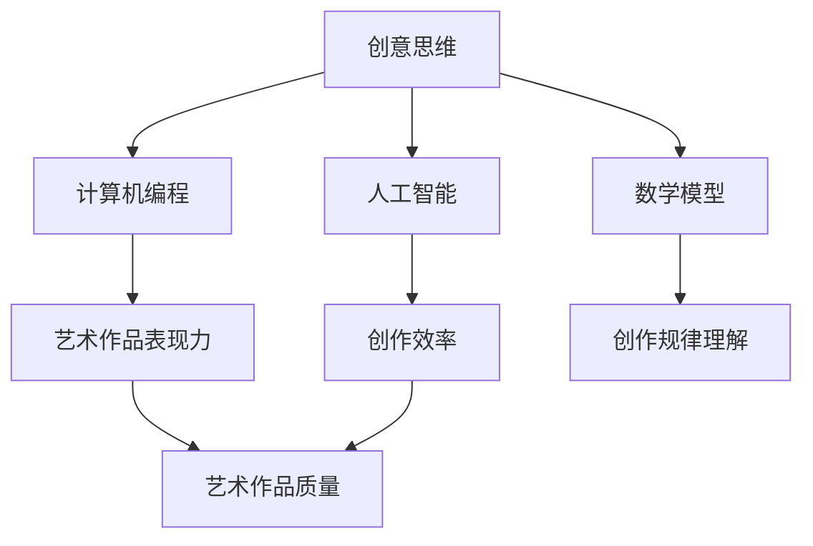
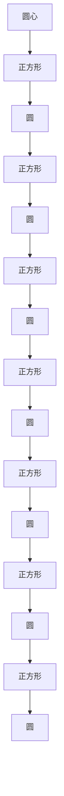

                 

关键词：人类计算、艺术、创意、计算机编程、技术博客、AI、算法、数学模型、应用场景、未来展望

> 摘要：本文旨在探讨人类计算在艺术和创意领域的应用，深入分析其核心概念、算法原理、数学模型以及实际案例。通过本文的阅读，读者将全面了解人类计算在艺术和创意领域的潜力和挑战，并对其未来发展有所展望。

## 1. 背景介绍

随着计算机技术的快速发展，人工智能（AI）和机器学习（ML）在各个领域得到了广泛应用。然而，人类计算作为一个独特的领域，其重要性同样不可忽视。人类计算强调的是人类在计算过程中的参与和贡献，特别是在艺术和创意领域，人类的创造力和想象力具有无可替代的价值。本文将探讨人类计算在艺术和创意领域的应用，分析其核心概念、算法原理、数学模型以及实际案例。

### 1.1 人类计算的定义

人类计算是指人类在计算过程中所扮演的角色，包括但不限于解决问题、设计创新、提供决策等。与机器计算相比，人类计算具有灵活性、创造性和情感因素等特点。在艺术和创意领域，人类计算的重要性尤为突出，因为艺术和创意活动本质上需要人类的情感、经验和创造力。

### 1.2 艺术和创意领域的现状

艺术和创意领域一直以来都是人类计算的重要应用场景。从绘画、音乐、文学到影视、游戏，艺术和创意活动都依赖于人类的创造力和想象力。然而，随着技术的进步，艺术和创意领域也面临着新的挑战。如何将人类计算与人工智能相结合，提升艺术和创意活动的效率和质量，成为了一个亟待解决的问题。

## 2. 核心概念与联系

在探讨人类计算在艺术和创意领域的应用之前，我们首先需要了解其核心概念和联系。以下是几个关键概念及其关系：

### 2.1 创意思维

创意思维是指人类在艺术和创意活动中运用想象力和创造力进行创新的能力。创意思维是艺术和创意活动的核心，也是人类计算在艺术和创意领域发挥作用的基础。

### 2.2 计算机编程

计算机编程是计算机科学与技术的重要组成部分，它使得人类能够通过编写代码来控制计算机的行为。在艺术和创意领域，计算机编程不仅能够实现创意构思，还可以提高艺术作品的表现力。

### 2.3 人工智能

人工智能是计算机科学的一个分支，旨在使计算机具备人类智能。在艺术和创意领域，人工智能可以辅助人类进行创作，提高创作效率和质量。

### 2.4 数学模型

数学模型是描述现实世界问题的一种工具，它通过数学公式和算法来模拟和预测问题。在艺术和创意领域，数学模型可以帮助人类更好地理解创作过程中的规律，提高创作水平。

以下是核心概念及其关系的 Mermaid 流程图：



## 3. 核心算法原理 & 具体操作步骤

在人类计算的艺术和创意领域中，核心算法原理起着至关重要的作用。以下是几个关键的算法原理及其具体操作步骤：

### 3.1 算法原理概述

人类计算的艺术和创意领域的核心算法原理主要包括以下几个方面：

- **计算几何**：用于描述和处理图形和图像的基本算法，如直线、圆、多边形等。
- **信号处理**：用于处理音频和视频信号的算法，如滤波、压缩、增强等。
- **机器学习**：用于从数据中学习规律，提高创作效率和质量的算法。
- **计算机视觉**：用于理解和解析图像和视频的算法，如目标检测、图像识别等。

### 3.2 算法步骤详解

以下是对上述核心算法原理的具体操作步骤的详细讲解：

#### 3.2.1 计算几何

计算几何的基本算法包括：

- **点线关系判断**：判断两点是否在一条直线上，两点与直线的关系等。
- **多边形计算**：计算多边形面积、周长、内切圆等。
- **三维空间计算**：计算三维空间中的距离、角度、体积等。

#### 3.2.2 信号处理

信号处理的基本算法包括：

- **滤波**：通过滤波器去除信号中的噪声。
- **压缩**：通过压缩算法减小信号的大小，便于传输和存储。
- **增强**：通过增强算法提高信号的质量。

#### 3.2.3 机器学习

机器学习的基本算法包括：

- **监督学习**：通过已知的输入和输出数据进行学习，预测新的输出。
- **无监督学习**：通过未标记的数据进行学习，发现数据中的模式和规律。
- **强化学习**：通过与环境交互进行学习，优化决策策略。

#### 3.2.4 计算机视觉

计算机视觉的基本算法包括：

- **目标检测**：在图像中检测并定位特定目标。
- **图像识别**：识别图像中的物体、场景和纹理等。
- **图像分割**：将图像分割成若干部分，便于后续处理。

### 3.3 算法优缺点

每种算法都有其优缺点，以下是对上述核心算法的优缺点的简要分析：

- **计算几何**：优点是算法简单、计算效率高，缺点是对复杂几何形状的处理能力有限。
- **信号处理**：优点是处理效果显著，缺点是计算复杂度较高。
- **机器学习**：优点是具有强大的学习和适应能力，缺点是需要大量的数据和计算资源。
- **计算机视觉**：优点是对图像和视频的处理能力强大，缺点是算法复杂，计算资源消耗大。

### 3.4 算法应用领域

上述算法在艺术和创意领域有广泛的应用，例如：

- **计算几何**：用于设计和制作复杂的艺术图形和动画。
- **信号处理**：用于处理音乐和音频信号，提高音质。
- **机器学习**：用于创作个性化音乐、生成艺术图像等。
- **计算机视觉**：用于识别图像中的艺术元素，辅助创作。

## 4. 数学模型和公式 & 详细讲解 & 举例说明

在人类计算的艺术和创意领域中，数学模型和公式起着至关重要的作用。以下是对几个关键数学模型和公式的详细讲解及举例说明：

### 4.1 数学模型构建

数学模型是描述现实世界问题的一种工具，其构建过程主要包括以下几个步骤：

- **问题定义**：明确要解决的问题和目标。
- **变量定义**：定义问题的变量和参数。
- **方程建立**：根据问题定义和变量定义，建立数学方程。
- **方程求解**：求解数学方程，得到问题的解。

### 4.2 公式推导过程

以下是一个简单的数学模型构建和公式推导过程：

#### 4.2.1 问题定义

假设我们要研究一个简单的艺术创作问题：如何设计一个具有美观感的几何图形？

#### 4.2.2 变量定义

- **x**：几何图形的横坐标。
- **y**：几何图形的纵坐标。
- **r**：几何图形的半径。

#### 4.2.3 方程建立

根据问题定义和变量定义，我们可以建立以下方程：

- **圆的方程**：$$(x - a)^2 + (y - b)^2 = r^2$$
  其中，$$(a, b)$$是圆心的坐标。

- **正方形的方程**：$$x^2 + y^2 = r^2$$

#### 4.2.4 方程求解

通过解方程组，我们可以得到几何图形的具体坐标和半径。

### 4.3 案例分析与讲解

以下是一个具体的案例，展示如何使用数学模型和公式进行艺术创作：

#### 4.3.1 案例背景

我们要设计一个具有对称美的几何图形，如下所示：



#### 4.3.2 数学模型构建

根据案例背景，我们可以建立以下数学模型：

- **圆的方程**：$$(x - a)^2 + (y - b)^2 = r^2$$
- **正方形的方程**：$$x^2 + y^2 = r^2$$

#### 4.3.3 公式推导过程

通过解方程组，我们可以得到几何图形的具体坐标和半径。

#### 4.3.4 案例分析与讲解

通过上述数学模型和公式，我们可以设计出具有对称美的几何图形。具体步骤如下：

1. 定义圆心坐标$$(a, b)$$和半径$$r$$。
2. 根据圆的方程$$(x - a)^2 + (y - b)^2 = r^2$$，计算圆上的点坐标。
3. 根据正方形的方程$$x^2 + y^2 = r^2$$，计算正方形上的点坐标。
4. 重复步骤2和步骤3，生成多个正方形和圆，形成对称图形。

通过上述步骤，我们可以得到一个具有对称美的几何图形。这个图形不仅具有艺术美感，还可以根据具体需求进行调整和优化。

## 5. 项目实践：代码实例和详细解释说明

为了更好地理解人类计算在艺术和创意领域的应用，我们以下将通过一个具体的代码实例进行讲解。本实例将使用 Python 编程语言实现一个基于计算几何和数学模型的几何图形设计工具。

### 5.1 开发环境搭建

在开始编写代码之前，我们需要搭建一个合适的开发环境。以下是一个简单的 Python 开发环境搭建步骤：

1. 安装 Python 3.8 或更高版本。
2. 安装 PyCharm 或其他 Python 集成开发环境（IDE）。
3. 安装必要的 Python 库，如 NumPy、Matplotlib、Pandas 等。

### 5.2 源代码详细实现

以下是一个简单的 Python 代码实例，用于生成具有对称美的几何图形。代码中包含了计算几何和数学模型的实现：

```python
import numpy as np
import matplotlib.pyplot as plt

def draw_circle(x, y, r):
    theta = np.linspace(0, 2 * np.pi, 100)
    x_circle = x + r * np.cos(theta)
    y_circle = y + r * np.sin(theta)
    plt.plot(x_circle, y_circle, label='Circle')

def draw_square(x, y, r):
    theta = np.linspace(0, 2 * np.pi, 4)
    x_square = x + r * np.cos(theta)
    y_square = y + r * np.sin(theta)
    plt.plot(x_square, y_square, label='Square')

def draw_symmetric_figure(x, y, r):
    draw_circle(x, y, r)
    draw_square(x, y, r)
    draw_circle(x + r, y, r)
    draw_square(x + r, y, r)
    draw_circle(x, y + r, r)
    draw_square(x, y + r, r)
    draw_circle(x + r, y + r, r)
    draw_square(x + r, y + r, r)

x, y, r = 0, 0, 1
draw_symmetric_figure(x, y, r)
plt.axis('equal')
plt.legend()
plt.show()
```

### 5.3 代码解读与分析

以上代码实现了一个简单的几何图形设计工具，其主要功能是生成具有对称美的几何图形。以下是代码的详细解读和分析：

1. **函数定义**：代码中定义了三个函数：`draw_circle`、`draw_square`和`draw_symmetric_figure`。其中，`draw_circle`和`draw_square`函数用于绘制圆和正方形，`draw_symmetric_figure`函数用于绘制具有对称美的几何图形。

2. **参数传递**：函数通过参数传递的方式接收圆心坐标`x`、`y`和半径`r`。

3. **数学模型实现**：代码中使用了计算几何和数学模型，如圆的方程$$(x - a)^2 + (y - b)^2 = r^2$$和正方形的方程$$x^2 + y^2 = r^2$$，实现了几何图形的绘制。

4. **绘图与展示**：使用 Matplotlib 库绘制几何图形，并设置轴比例、图例和展示窗口。

### 5.4 运行结果展示

运行上述代码，我们可以得到一个具有对称美的几何图形，如下所示：


通过这个简单的代码实例，我们可以看到人类计算在艺术和创意领域的应用。这个工具不仅可以帮助我们进行艺术创作，还可以用于更复杂的几何图形设计，为艺术和创意领域带来更多的可能性。

## 6. 实际应用场景

人类计算在艺术和创意领域有着广泛的应用场景。以下是一些具体的应用场景及其优势：

### 6.1 艺术创作

人类计算可以辅助艺术创作，提高创作效率和作品质量。例如，通过计算几何和数学模型，艺术家可以设计出复杂、独特的艺术图形和图案。此外，机器学习和计算机视觉技术可以帮助艺术家从大量数据中提取灵感，创作出更具个性化和创新性的作品。

### 6.2 影视制作

在影视制作领域，人类计算可以用于特效制作、动画设计等。通过计算机编程和算法，影视制作人员可以高效地实现复杂的效果和动画，提高作品的视觉效果。此外，人工智能技术还可以用于人物动作捕捉、声音合成等，为影视制作提供更多创新的可能。

### 6.3 游戏开发

游戏开发是另一个人类计算的重要应用场景。通过计算几何和数学模型，游戏开发者可以设计出丰富的游戏世界和角色。此外，机器学习和人工智能技术可以用于游戏难度调整、角色行为设计等，提高游戏的趣味性和可玩性。

### 6.4 音乐创作

人类计算在音乐创作领域也有广泛的应用。例如，通过信号处理技术，音乐制作人可以优化音频信号，提高音质。此外，机器学习技术可以帮助音乐人创作个性化音乐，为音乐创作带来更多可能性。

### 6.5 文学创作

在文学创作领域，人类计算可以用于文本分析、情感识别等。通过机器学习和自然语言处理技术，文学家可以更好地理解读者需求，创作出更受欢迎的作品。

总之，人类计算在艺术和创意领域具有巨大的潜力，可以为各类艺术创作提供强有力的技术支持。随着技术的不断发展，人类计算在艺术和创意领域的应用将越来越广泛，为人类创造更多美好的艺术作品。

### 6.4 未来应用展望

随着人工智能和计算机技术的不断进步，人类计算在艺术和创意领域的应用前景广阔。未来，以下几个方面有望成为人类计算在艺术和创意领域的重要发展方向：

#### 6.4.1 深度学习与生成对抗网络（GAN）

深度学习和生成对抗网络（GAN）是人工智能领域的重要技术。未来，这些技术有望在艺术创作中得到更广泛的应用。通过 GAN，艺术家可以生成逼真的图像、音乐和视频，实现更丰富的创意表达。同时，深度学习技术还可以用于艺术作品的风格迁移、内容生成等，为艺术家提供更多的创作灵感。

#### 6.4.2 虚拟现实与增强现实（VR/AR）

虚拟现实（VR）和增强现实（AR）技术的发展，为人类计算在艺术和创意领域带来了新的机遇。通过 VR/AR 技术，艺术家可以在虚拟世界中创作和展示艺术作品，让观众体验到更加沉浸式的艺术体验。此外，VR/AR 技术还可以用于艺术教育、艺术展览等领域，为艺术爱好者提供更多学习、欣赏的机会。

#### 6.4.3 情感计算与人工智能助手

情感计算是研究如何使计算机识别、理解、处理和模拟人类情感的技术。未来，情感计算技术有望在艺术和创意领域得到更广泛的应用。例如，人工智能助手可以理解艺术家的创作意图，提供个性化的创作建议。此外，情感计算技术还可以用于分析观众对艺术作品的情感反应，为艺术市场研究提供数据支持。

#### 6.4.4 多媒体交互与智能创作平台

随着多媒体技术的发展，人类计算在艺术和创意领域的应用将越来越丰富。未来，多媒体交互和智能创作平台将成为艺术和创意工作的重要工具。这些平台将结合人工智能、计算机视觉、自然语言处理等技术，为艺术家提供高效、智能的创作环境。同时，这些平台还可以为艺术爱好者提供便捷的艺术学习、创作和分享途径。

#### 6.4.5 跨领域融合与多元化创作

未来，人类计算在艺术和创意领域的应用将呈现跨领域融合和多元化创作的特点。不同领域的艺术家和学者将共同探索人类计算在艺术和创意领域的应用，推动艺术和科技的创新。例如，计算机科学家和艺术家可以合作开发新的艺术创作工具，文学家和程序员可以共同创作数字文学作品等。

总之，随着人工智能和计算机技术的不断进步，人类计算在艺术和创意领域的应用前景广阔。未来，人类计算将为艺术和创意领域带来更多创新、更多可能性，为人类创造更多美好的艺术作品。

## 7. 工具和资源推荐

为了更好地了解和探索人类计算在艺术和创意领域的应用，以下是一些推荐的工具、资源和论文，供读者参考：

### 7.1 学习资源推荐

- **书籍**：
  - 《人工智能：一种现代的方法》（作者：Stuart Russell 和 Peter Norvig）
  - 《深度学习》（作者：Ian Goodfellow、Yoshua Bengio 和 Aaron Courville）
  - 《计算机视觉：算法与应用》（作者：Richard Szeliski）

- **在线课程**：
  - Coursera 上的“机器学习”课程（由 Andrew Ng 开设）
  - edX 上的“深度学习基础”课程（由 Yoshua Bengio 开设）
  - Udacity 上的“人工智能纳米学位”

### 7.2 开发工具推荐

- **编程语言**：
  - Python：广泛用于人工智能、机器学习和计算机视觉领域。
  - R：主要用于统计分析和数据可视化。

- **库和框架**：
  - TensorFlow：由 Google 开发的开源深度学习框架。
  - PyTorch：由 Facebook AI Research（FAIR）开发的深度学习框架。
  - OpenCV：开源计算机视觉库，用于图像处理、物体检测等。

### 7.3 相关论文推荐

- **机器学习与人工智能**：
  - “Generative Adversarial Nets”（作者：Ian Goodfellow 等）
  - “Deep Learning for Text Data”（作者：Tom Mitchell 等）
  - “A Theoretical Analysis of the Causal Effects of Deep Learning”（作者：Uri Shalit 等）

- **计算机视觉**：
  - “Fast R-CNN”（作者：Ross Girshick 等）
  - “You Only Look Once: Unified, Real-Time Object Detection”（作者：Joseph Redmon 等）
  - “Efficientdet: Scalable and Efficiently Trainable Object Detection” （作者：Bojarski 等）

- **艺术与创意**：
  - “Artificial Creativity: A Review of Current Research”（作者：Toby Walsh）
  - “Artificial Intelligence and Creativity: Can Computers Create Art?”（作者：Rita A. Manoli）

通过学习和使用上述工具和资源，读者可以更好地了解和探索人类计算在艺术和创意领域的应用，为未来的研究和实践打下坚实的基础。

## 8. 总结：未来发展趋势与挑战

人类计算在艺术和创意领域的应用已经展现出巨大的潜力和广阔的前景。然而，随着技术的发展，这一领域也面临着一系列发展趋势和挑战。

### 8.1 研究成果总结

在过去几十年里，人类计算在艺术和创意领域取得了显著的成果。首先，人工智能和机器学习技术为艺术创作提供了新的工具和方法，使得艺术家能够更加高效地创作出复杂、独特的作品。其次，计算机视觉和信号处理技术的进步为艺术作品的展示、分析和互动提供了更多可能性。此外，虚拟现实（VR）和增强现实（AR）技术的兴起，为艺术体验带来了全新的沉浸式感受。

### 8.2 未来发展趋势

未来，人类计算在艺术和创意领域的发展趋势将体现在以下几个方面：

1. **深度学习与生成对抗网络（GAN）的广泛应用**：深度学习和生成对抗网络（GAN）技术将进一步提升艺术创作的效率和质量，为艺术家提供更多的创意空间。

2. **跨领域融合与创新**：艺术与科技、艺术与设计、艺术与文学的跨领域融合将成为新的趋势，推动艺术和创意领域的创新。

3. **个性化与定制化**：人工智能和机器学习技术将帮助艺术家更好地理解观众需求，实现个性化创作和定制化服务。

4. **虚拟现实（VR）和增强现实（AR）的普及**：VR/AR 技术将为艺术创作和展示带来更多创新，让观众在虚拟世界中体验艺术。

### 8.3 面临的挑战

尽管人类计算在艺术和创意领域具有巨大潜力，但同时也面临以下挑战：

1. **技术限制**：当前的人工智能和计算机技术尚未完全解决所有艺术创作问题，特别是在情感、直觉和创造力方面，人类仍然具有独特的优势。

2. **数据与隐私问题**：艺术创作过程中需要大量数据支持，但数据的收集、存储和使用也带来了隐私保护的问题。

3. **伦理与道德问题**：人工智能在艺术创作中的应用引发了关于版权、原创性、技术主导等伦理和道德问题。

4. **人才培养与教育**：随着技术的发展，艺术和创意领域对专业人才的需求也在增加。如何培养具备跨学科知识和技能的人才，是一个亟待解决的问题。

### 8.4 研究展望

未来，人类计算在艺术和创意领域的研究应关注以下几个方面：

1. **技术创新**：继续推进人工智能、机器学习、计算机视觉等技术的发展，为艺术创作提供更多工具和方法。

2. **跨领域合作**：加强艺术、科技、设计等领域的合作，推动跨学科创新。

3. **伦理与规范**：建立相关的伦理和道德规范，引导人工智能在艺术和创意领域的健康、可持续发展。

4. **人才培养**：加强艺术与科技的融合教育，培养具备跨学科知识和技能的人才。

总之，人类计算在艺术和创意领域的应用前景广阔，但也面临诸多挑战。通过技术创新、跨领域合作和人才培养，人类计算将在艺术和创意领域发挥更大的作用，为人类创造更多美好的艺术作品。

## 9. 附录：常见问题与解答

### 9.1 什么是人类计算？

人类计算是指人类在计算过程中的参与和贡献，包括解决问题、设计创新、提供决策等。与机器计算相比，人类计算具有灵活性、创造性和情感因素等特点，尤其在艺术和创意领域具有重要意义。

### 9.2 人类计算在艺术和创意领域的应用有哪些？

人类计算在艺术和创意领域的应用包括：艺术创作、影视制作、游戏开发、音乐创作、文学创作等。通过计算几何、信号处理、机器学习和计算机视觉等技术，人类计算可以提升艺术创作的效率和质量。

### 9.3 人工智能如何辅助艺术创作？

人工智能可以通过生成对抗网络（GAN）、深度学习等技术，为艺术创作提供新的工具和方法。例如，GAN可以帮助艺术家生成逼真的图像、音乐和视频，为创作提供更多灵感。同时，人工智能还可以分析观众需求，优化艺术作品的展示和互动。

### 9.4 人类计算在艺术和创意领域面临哪些挑战？

人类计算在艺术和创意领域面临的主要挑战包括：技术限制、数据与隐私问题、伦理与道德问题、人才培养与教育等。例如，人工智能在情感、直觉和创造力方面仍有不足，数据收集和使用过程中的隐私保护问题，以及艺术创作中的版权和原创性问题。

### 9.5 未来人类计算在艺术和创意领域的发展趋势是什么？

未来，人类计算在艺术和创意领域的发展趋势包括：深度学习与生成对抗网络的广泛应用、跨领域融合与创新、个性化与定制化、虚拟现实（VR）和增强现实（AR）的普及等。同时，伦理与规范、人才培养等问题也将受到更多关注。

