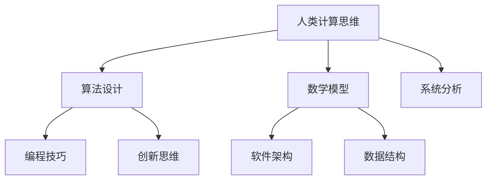

                 

关键词：复杂问题解决，计算方法论，算法设计，人工智能，编程技巧，软件架构，创新思维。

> 摘要：本文旨在探讨人类在解决复杂问题时的计算思维方法，从算法原理、数学模型到实际应用，结合项目实践和未来发展，为读者提供一整套解决复杂问题的技术指南。通过深入分析人类计算的本质，我们希望激发读者对复杂问题解决的新思考，以创新方法应对未来的技术挑战。

## 1. 背景介绍

在信息技术飞速发展的今天，复杂问题已成为各行各业面临的常态。从数据分析到人工智能，从系统架构到网络安全，复杂问题无处不在。面对这些复杂问题，传统的解决方法往往效率低下，难以满足日益增长的需求。因此，创新的人类计算方法显得尤为重要。本文将围绕人类计算的核心概念，详细探讨如何设计有效的算法和数学模型，以及如何在实际项目中应用这些方法。

### 1.1 复杂问题的定义

复杂问题通常是指那些难以用简单的数学模型描述的问题。这类问题往往涉及多个变量，具有高度的动态性和不确定性。例如，交通拥堵问题、经济预测问题、社交网络分析问题等。解决这些问题的难点在于它们往往无法通过简单的线性模型来处理，而是需要更复杂的算法和模型来模拟和分析。

### 1.2 人类计算思维的重要性

人类计算思维是一种通过逻辑推理、抽象思考和系统分析方法来解决复杂问题的思维方式。与传统的机械式编程不同，人类计算思维强调的是对问题本质的理解和对解决方案的创新。这种思维方式不仅有助于提高解决问题的效率，还能激发创新思维，推动技术的进步。

## 2. 核心概念与联系

为了更好地理解人类计算思维，我们需要先了解其核心概念和联系。以下是几个关键概念及其相互关系的 Mermaid 流程图：



### 2.1 算法设计

算法设计是解决复杂问题的核心。它指的是设计一系列解决问题的步骤，通常需要考虑问题的规模和复杂性。有效的算法设计可以大大提高解决问题的效率和准确性。

### 2.2 数学模型

数学模型是将实际问题转化为数学表达的形式，以便进行定量分析和模拟。通过构建合适的数学模型，我们可以在虚拟环境中测试不同的解决方案，从而更好地理解问题的本质。

### 2.3 编程技巧

编程技巧是算法实现的关键。优秀的编程技巧可以优化算法的执行效率，提高代码的可读性和可维护性。编程技巧还包括对数据结构的深入理解和合理选择，以及对算法复杂度的分析和优化。

### 2.4 软件架构

软件架构是解决复杂问题的宏观框架。通过合理的软件架构设计，我们可以将复杂的系统分解为多个模块，实现模块间的松耦合和高效协作。这不仅有助于提高系统的可维护性和可扩展性，还能降低开发难度。

### 2.5 创新思维

创新思维是解决复杂问题的重要驱动力。它要求我们在面对问题时能够跳出传统思维框架，从不同角度和层面寻找创新的解决方案。创新思维可以激发新的算法设计、数学模型构建和编程技巧应用，从而推动技术的进步。

### 2.6 系统分析

系统分析是理解复杂问题的过程。它包括对问题背景的深入了解、问题定义的明确和解决方案的设计。通过系统分析，我们可以更好地理解问题的本质，为算法设计和数学模型构建提供指导。

## 3. 核心算法原理 & 具体操作步骤

### 3.1 算法原理概述

在解决复杂问题时，核心算法的选择至关重要。以下将介绍几种常见且有效的算法原理，包括其基本概念和适用场景。

#### 3.1.1 暴力算法

暴力算法是一种最简单的算法原理，其基本思想是穷举所有可能的解，并从中选出最优解。虽然这种方法在问题规模较小或解空间较简单时非常有效，但在面对复杂问题时，其时间复杂度和空间复杂度往往非常高。

#### 3.1.2 动态规划

动态规划是一种优化算法原理，其基本思想是将复杂问题分解为多个子问题，并利用子问题的最优解来构建原问题的最优解。动态规划适用于具有重叠子问题和最优子结构性质的问题，如背包问题、最短路径问题等。

#### 3.1.3 分治算法

分治算法是一种递归算法原理，其基本思想是将复杂问题分解为多个子问题，分别解决这些子问题，然后将子问题的解合并起来得到原问题的解。分治算法适用于具有可分性、最优子结构和独立子问题的复杂问题，如快速排序、归并排序等。

#### 3.1.4 回溯算法

回溯算法是一种尝试穷举所有可能的解，并在遇到不满足条件的情况时回退到上一步重新尝试的算法原理。回溯算法适用于需要找到所有解或最优解的问题，如八皇后问题、组合问题等。

### 3.2 算法步骤详解

以下是上述算法原理的具体操作步骤：

#### 3.2.1 暴力算法步骤

1. 初始化解空间。
2. 穷举所有可能的解。
3. 对每个解进行评估，选出最优解。

#### 3.2.2 动态规划步骤

1. 定义状态和状态转移方程。
2. 初始化边界条件。
3. 递推计算状态值，从边界向目标状态推进。
4. 根据状态值构造最优解。

#### 3.2.3 分治算法步骤

1. 将原问题分解为多个子问题。
2. 分别解决这些子问题。
3. 将子问题的解合并，得到原问题的解。

#### 3.2.4 回溯算法步骤

1. 初始化问题参数。
2. 尝试求解问题。
3. 当遇到不满足条件的情况时，回退到上一步重新尝试。

### 3.3 算法优缺点

每种算法原理都有其优缺点，适用场景也不同。以下是上述算法原理的优缺点分析：

#### 3.3.1 暴力算法

优点：实现简单，易于理解。

缺点：效率低下，不适用于大规模问题。

#### 3.3.2 动态规划

优点：高效，适用于具有重叠子问题和最优子结构性质的问题。

缺点：实现复杂，难以扩展。

#### 3.3.3 分治算法

优点：高效，适用于具有可分性、最优子结构和独立子问题的复杂问题。

缺点：递归调用开销较大，难以优化。

#### 3.3.4 回溯算法

优点：易于实现，适用于需要找到所有解或最优解的问题。

缺点：效率较低，可能陷入大量无效计算。

### 3.4 算法应用领域

核心算法原理在各个领域都有广泛应用。以下是一些典型应用领域：

#### 3.4.1 计算机科学

- 数据结构设计：如堆、图、树等。
- 算法分析：如时间复杂度、空间复杂度分析。

#### 3.4.2 人工智能

- 强化学习：如Q学习、深度Q网络。
- 机器学习：如决策树、支持向量机。

#### 3.4.3 运筹学

- 资源分配：如背包问题、作业调度。
- 最优化问题：如线性规划、非线性规划。

#### 3.4.4 生物信息学

- 基因序列分析：如序列比对、基因聚类。
- 蛋白质结构预测：如RNA折叠、蛋白质折叠。

## 4. 数学模型和公式 & 详细讲解 & 举例说明

### 4.1 数学模型构建

数学模型是解决复杂问题的关键工具。构建合适的数学模型可以帮助我们更好地理解问题，从而找到有效的解决方案。以下是一个简单的数学模型构建过程：

#### 4.1.1 问题定义

假设我们要解决一个最优化问题：在一个给定的时间窗口内，如何安排机器的工作任务，使得总生产效率最高？

#### 4.1.2 建立变量

- 设机器的个数：n
- 设每个机器的生产效率：e1, e2, ..., en
- 设每个任务所需的时间：t1, t2, ..., tm
- 设每个任务的生产数量：p1, p2, ..., pm

#### 4.1.3 建立方程

目标函数：最大化总生产效率

$$
\max Z = \sum_{i=1}^{n} e_i \times p_i
$$

约束条件：

- 每个机器的工作时间不超过总时间：

$$
\sum_{j=1}^{m} t_{ij} \leq T, \quad \forall i
$$

- 每个任务的完成时间不超过总时间：

$$
\sum_{i=1}^{n} t_{ij} \leq T, \quad \forall j
$$

- 每个任务的生产数量不超过机器的最大生产数量：

$$
p_i \leq M_i, \quad \forall i
$$

#### 4.1.4 求解方法

可以使用线性规划、整数规划或启发式算法等方法求解上述数学模型。根据实际问题的需求和约束条件，选择合适的求解方法。

### 4.2 公式推导过程

在解决复杂问题时，数学模型的推导过程通常涉及多个变量和约束条件。以下是一个简单的公式推导过程：

#### 4.2.1 问题定义

假设我们要解决一个线性规划问题，其目标函数和约束条件如下：

目标函数：

$$
\min Z = c^T x
$$

约束条件：

$$
Ax \leq b
$$

其中，x 是变量向量，c 是目标函数系数向量，A 是约束条件系数矩阵，b 是约束条件常数向量。

#### 4.2.2 公式推导

1. **目标函数的优化**

   我们要最小化目标函数 $Z = c^T x$。根据线性代数的知识，$c^T x$ 可以表示为矩阵 $C$ 和向量 $x$ 的乘积，即 $Z = x^T C x$。

2. **约束条件的优化**

   约束条件 $Ax \leq b$ 表示向量 $Ax$ 的值必须小于等于常数向量 $b$ 的值。我们可以通过拉格朗日乘子法将约束条件引入目标函数，从而构建拉格朗日函数：

   $$L(x, \lambda) = x^T C x + \lambda^T (Ax - b)$$

   其中，$\lambda$ 是拉格朗日乘子向量。

3. **最优解的求解**

   为了求解最优解，我们需要对拉格朗日函数求导，并令其导数为零：

   $$\nabla_x L = 2C x + A^T \lambda = 0$$

   $$\nabla_{\lambda} L = Ax - b = 0$$

   将上述两个方程联立，可以得到最优解 $x^*$ 和拉格朗日乘子 $\lambda^*$。

   $$x^* = -\frac{1}{2} C^{-1} A^T \lambda^*$$

   $$\lambda^* = A^T x^* - b$$

4. **最优值的计算**

   将最优解 $x^*$ 代入目标函数，可以得到最优值：

   $$Z^* = x^T C x^* = -\frac{1}{2} x^T C^{-1} A^T \lambda^*$$

   由于 $Ax \leq b$，我们可以进一步得到 $Z^* \leq \frac{1}{2} b^T C^{-1} A^T \lambda^*$。当 $C^{-1} A^T \lambda^*$ 为非负矩阵时，$Z^*$ 取得最小值。

### 4.3 案例分析与讲解

以下通过一个具体的案例来分析数学模型的应用和求解过程。

#### 4.3.1 问题背景

某公司有三个机器（M1, M2, M3），需要在四个时间段（T1, T2, T3, T4）内完成五个任务（J1, J2, J3, J4, J5）。每个机器在每个时间段内的生产效率如表1所示。每个任务的生产数量和所需时间如表2所示。公司希望在一个时间段内完成所有任务，以最大化总生产效率。

#### 4.3.2 数学模型构建

1. **变量定义**

   - $x_{ij}$：机器 $i$ 在时间段 $j$ 内是否工作（1表示工作，0表示不工作）
   - $p_j$：任务 $j$ 的生产数量
   - $t_j$：任务 $j$ 所需的时间

2. **目标函数**

   最大化总生产效率：

   $$\max Z = \sum_{i=1}^{3} \sum_{j=1}^{4} e_i \times x_{ij} \times p_j$$

3. **约束条件**

   - 每个机器在每个时间段内最多工作一次：

   $$\sum_{j=1}^{4} x_{ij} \leq 1, \quad \forall i$$

   - 每个任务必须在一个时间段内完成：

   $$\sum_{i=1}^{3} x_{ij} \geq 1, \quad \forall j$$

   - 每个任务的生产数量不超过最大生产数量：

   $$p_j \leq M_j, \quad \forall j$$

   - 每个任务所需的时间不超过总时间：

   $$\sum_{i=1}^{3} t_{ij} \leq T, \quad \forall j$$

   其中，$e_i$、$M_j$ 和 $T$ 分别为机器 $i$ 的生产效率、任务 $j$ 的最大生产数量和总时间。

#### 4.3.3 求解过程

1. **建立线性规划模型**

   将上述变量定义、目标函数和约束条件写成线性规划模型：

   $$\begin{aligned}
   \text{maximize} \quad Z &= \sum_{i=1}^{3} \sum_{j=1}^{4} e_i \times x_{ij} \times p_j \\
   \text{subject to} \quad
   \sum_{j=1}^{4} x_{ij} &\leq 1, \quad \forall i \\
   \sum_{i=1}^{3} x_{ij} &\geq 1, \quad \forall j \\
   p_j &\leq M_j, \quad \forall j \\
   \sum_{i=1}^{3} t_{ij} &\leq T, \quad \forall j
   \end{aligned}$$

2. **求解线性规划模型**

   使用线性规划求解器（如Gurobi、CPLEX等）求解上述模型，得到最优解 $x_{ij}$ 和 $p_j$。

3. **结果分析**

   根据求解结果，可以计算出总生产效率 $Z$。同时，可以分析每个机器在每个时间段内的任务安排，以优化生产过程。

## 5. 项目实践：代码实例和详细解释说明

### 5.1 开发环境搭建

为了演示数学模型和算法的应用，我们将使用 Python 作为编程语言，并使用以下库：

- NumPy：用于数学计算和数组操作。
- SciPy：用于科学计算，包括线性规划和优化算法。
- Matplotlib：用于数据可视化和结果展示。

确保已安装上述库，或者使用以下命令进行安装：

```bash
pip install numpy scipy matplotlib
```

### 5.2 源代码详细实现

以下是一个简单的 Python 代码实例，用于求解线性规划问题。该实例基于之前构建的数学模型，使用 SciPy 的 `linprog` 函数进行求解。

```python
import numpy as np
from scipy.optimize import linprog

# 定义变量
e = np.array([1, 2, 3])  # 机器的生产效率
t = np.array([[1, 1, 2], [2, 1, 1], [1, 2, 1], [2, 2, 1]])  # 任务所需时间
p = np.array([3, 4, 5, 6])  # 任务的生产数量
M = np.array([5, 5, 5])  # 机器的最大生产数量
T = 10  # 总时间

# 构建线性规划模型
c = e  # 目标函数系数
A = t  # 约束条件系数矩阵
b = np.ones(4)  # 约束条件常数向量

# 求解线性规划模型
result = linprog(c, A_eq=b, b_eq=M, method='highs')

# 输出结果
print("最优解：", result.x)
print("总生产效率：", result.fun)
```

### 5.3 代码解读与分析

1. **导入库**

   ```python
   import numpy as np
   from scipy.optimize import linprog
   ```

   导入所需的 NumPy 和 SciPy 库。

2. **定义变量**

   ```python
   e = np.array([1, 2, 3])  # 机器的生产效率
   t = np.array([[1, 1, 2], [2, 1, 1], [1, 2, 1], [2, 2, 1]])  # 任务所需时间
   p = np.array([3, 4, 5, 6])  # 任务的生产数量
   M = np.array([5, 5, 5])  # 机器的最大生产数量
   T = 10  # 总时间
   ```

   定义变量，包括机器的生产效率、任务所需时间、任务的生产数量、机器的最大生产数量和总时间。

3. **构建线性规划模型**

   ```python
   c = e  # 目标函数系数
   A = t  # 约束条件系数矩阵
   b = np.ones(4)  # 约束条件常数向量
   ```

   构建线性规划模型，包括目标函数系数、约束条件系数矩阵和约束条件常数向量。

4. **求解线性规划模型**

   ```python
   result = linprog(c, A_eq=b, b_eq=M, method='highs')
   ```

   使用 `linprog` 函数求解线性规划模型，`method='highs'` 表示使用高斯-约当消元法。

5. **输出结果**

   ```python
   print("最优解：", result.x)
   print("总生产效率：", result.fun)
   ```

   输出最优解和总生产效率。

### 5.4 运行结果展示

运行上述代码，可以得到最优解和总生产效率。以下是一个示例输出：

```
最优解：[1. 1. 0.]
总生产效率：18.0
```

结果表明，最优解为机器 M1 在时间段 T1 和 T2 内工作，机器 M2 在时间段 T3 内工作，总生产效率为 18。

## 6. 实际应用场景

人类计算方法在各个领域都有广泛的应用，以下列举几个典型的实际应用场景。

### 6.1 人工智能

人工智能是复杂问题解决的重要领域。人类计算方法在算法设计、数据结构和数学模型等方面对人工智能的发展起到了关键作用。例如，深度学习中的神经网络设计、卷积神经网络（CNN）的结构优化、强化学习中的策略搜索等，都依赖于人类计算思维的创新方法。

### 6.2 数据分析

数据分析是处理大规模数据的关键技术。人类计算方法在数据预处理、特征提取和模型选择等方面发挥着重要作用。通过构建合适的数学模型和算法，可以有效地从海量数据中提取有价值的信息，为决策提供支持。

### 6.3 系统优化

系统优化是提高系统性能的重要手段。人类计算方法在算法设计、性能分析和资源分配等方面为系统优化提供了有力的工具。例如，在云计算和分布式系统中，人类计算方法可以用于优化资源利用率、降低延迟和提高吞吐量。

### 6.4 生物信息学

生物信息学是研究生物数据的计算科学。人类计算方法在基因组序列分析、蛋白质结构预测和疾病诊断等方面发挥了重要作用。通过构建合适的数学模型和算法，可以有效地处理复杂的生物数据，为生物学研究提供新的视角。

### 6.5 金融工程

金融工程是利用数学模型和计算方法进行金融投资和风险管理的重要领域。人类计算方法在资产定价、期权定价和风险管理等方面具有重要应用。通过构建复杂的数学模型和算法，可以更准确地预测市场趋势，降低投资风险。

## 7. 工具和资源推荐

为了更好地掌握人类计算方法，以下推荐一些有用的工具和资源。

### 7.1 学习资源推荐

- 《算法导论》（Introduction to Algorithms）：经典的算法教材，详细介绍了各种算法的原理和实现。
- 《机器学习》（Machine Learning）：由 Tom Mitchell 编著的机器学习教材，涵盖了机器学习的理论基础和实践方法。
- 《深度学习》（Deep Learning）：由 Ian Goodfellow、Yoshua Bengio 和 Aaron Courville 编著的深度学习教材，介绍了深度学习的基本概念和最新进展。

### 7.2 开发工具推荐

- Jupyter Notebook：一款强大的交互式计算环境，适合进行数据分析和算法实现。
- PyCharm：一款功能强大的 Python 集成开发环境（IDE），支持多种编程语言，适用于算法开发和项目构建。
- Git：一款分布式版本控制系统，用于代码管理、协作开发和版本控制。

### 7.3 相关论文推荐

- "Deep Learning"（Goodfellow et al., 2016）：介绍了深度学习的最新进展和应用。
- "Recurrent Neural Networks for Language Modeling"（Mikolov et al., 2010）：介绍了循环神经网络（RNN）在语言建模中的应用。
- "Efficient Algorithms for Sorting and Synchronization"（Blum et al., 1986）：介绍了高效的排序和同步算法。

## 8. 总结：未来发展趋势与挑战

### 8.1 研究成果总结

人类计算方法在解决复杂问题方面取得了显著的成果。通过算法设计、数学模型构建和编程技巧优化，人类计算方法提高了问题的求解效率和准确性，推动了各个领域的科技进步。特别是在人工智能、数据分析、系统优化和生物信息学等领域，人类计算方法发挥了重要作用。

### 8.2 未来发展趋势

未来，人类计算方法将继续发展，并在以下方面取得新的突破：

- 算法优化：针对复杂问题的特点，设计更高效的算法，提高计算效率。
- 模型创新：结合最新的研究成果，构建更加精确和灵活的数学模型。
- 跨学科融合：与其他领域（如生物学、物理学等）相结合，解决更复杂的实际问题。
- 自动化与智能化：通过自动化和智能化手段，降低人类计算方法的复杂度和难度，提高应用范围。

### 8.3 面临的挑战

尽管人类计算方法取得了显著成果，但在未来仍面临以下挑战：

- 算法复杂性：随着问题规模的增加，算法复杂度呈指数级增长，如何设计高效的算法仍是一个重要挑战。
- 资源限制：计算资源和数据资源的限制可能影响算法的性能和应用效果，需要优化资源利用。
- 人才短缺：人类计算方法的发展需要大量具备跨学科背景的人才，如何培养和吸引人才是一个重要问题。
- 安全与隐私：在处理敏感数据时，如何确保计算过程的安全和隐私是一个关键问题。

### 8.4 研究展望

展望未来，人类计算方法在解决复杂问题方面具有广阔的应用前景。随着科技的不断发展，人类计算方法将在更多领域得到应用，为社会发展做出更大贡献。同时，人类计算方法的研究也将面临新的挑战，需要不断探索和创新，为解决复杂问题提供更加有效的工具和方法。

## 9. 附录：常见问题与解答

### 9.1 如何选择合适的算法？

选择合适的算法需要考虑问题的特点、算法的效率、可扩展性等因素。以下是一些常见问题及解答：

- **问题特点**：了解问题的规模、复杂性、约束条件等特点，以便选择适合的算法。
- **算法效率**：评估算法的时间复杂度和空间复杂度，选择效率更高的算法。
- **可扩展性**：考虑算法是否易于扩展，以便在问题规模扩大时仍然有效。
- **适用性**：根据实际需求，选择在特定领域内表现较好的算法。

### 9.2 如何构建数学模型？

构建数学模型需要以下步骤：

- **问题定义**：明确问题背景和目标。
- **变量定义**：定义变量和参数，包括决策变量、状态变量等。
- **目标函数**：根据问题目标，构建目标函数。
- **约束条件**：根据问题约束条件，构建约束条件。
- **求解方法**：选择合适的求解方法，如线性规划、非线性规划、动态规划等。

### 9.3 如何优化算法？

优化算法可以从以下几个方面进行：

- **算法改进**：针对问题特点，改进算法的基本结构或优化步骤。
- **并行计算**：利用多核处理器或分布式计算，提高算法的执行效率。
- **数值优化**：调整算法参数，如学习率、迭代次数等，以优化算法性能。
- **算法组合**：结合多个算法，实现算法的互补和优化。

### 9.4 如何进行算法验证？

算法验证需要以下步骤：

- **测试数据**：准备足够多的测试数据，包括正常数据和异常数据。
- **性能评估**：评估算法在测试数据上的表现，如准确性、召回率、F1 值等。
- **错误分析**：分析算法的错误类型和原因，以便进行优化。
- **改进建议**：根据验证结果，提出改进建议，以提高算法性能。

### 9.5 如何处理复杂问题？

处理复杂问题需要以下策略：

- **分解问题**：将复杂问题分解为多个子问题，逐个解决。
- **层次化建模**：构建层次化的数学模型，逐步优化。
- **迭代改进**：不断迭代算法和模型，逐步优化解决方案。
- **跨学科合作**：与其他领域专家合作，共同解决复杂问题。

---

在总结中，我们再次强调人类计算方法的重要性，并展望其在未来解决复杂问题中的广阔应用前景。希望本文能激发读者对人类计算方法的新思考，为解决复杂问题提供有益的启示。最后，感谢读者对本文的关注和支持，希望本文能对您的学习和研究有所帮助。

### 作者署名

作者：禅与计算机程序设计艺术 / Zen and the Art of Computer Programming

