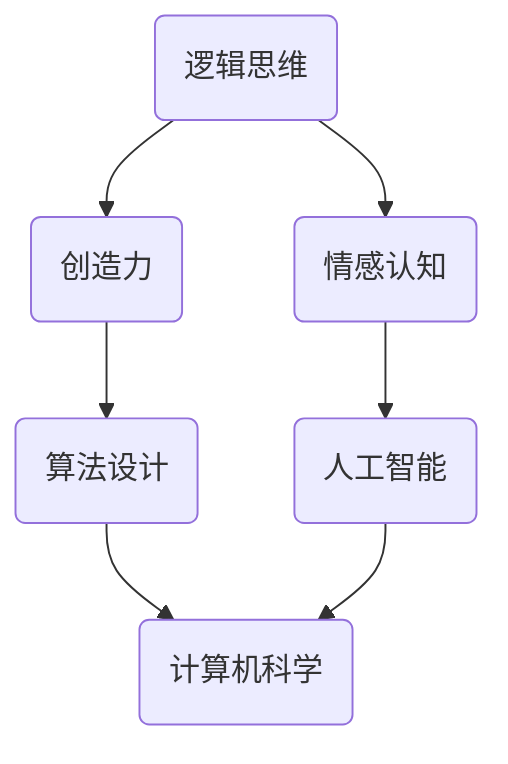

                 

关键词：人类计算、复杂问题解决、算法原理、数学模型、代码实例、应用场景

> 摘要：本文将探讨人类计算在解决复杂问题中的新方法。通过对人类计算方式的深入分析，我们将揭示其背后的核心概念与原理，并详细介绍一种基于这些原理的算法。文章还将通过数学模型、公式推导和代码实例，展示如何将这些方法应用于实际项目。最后，我们将探讨这些方法在未来的发展前景和面临的挑战。

## 1. 背景介绍

在现代社会，随着信息技术的迅猛发展，我们面临的问题变得越来越复杂。传统的计算方法在处理这些复杂问题时往往显得力不从心。因此，寻找一种新的计算方法以应对复杂问题，成为学术界和工业界共同关注的热点。

人类计算作为一种独特的计算方式，一直以来都被视为解决复杂问题的利器。人类具有独特的逻辑思维、创造力、情感认知等能力，这些能力使得人类在解决复杂问题时具有巨大的优势。因此，研究人类计算，并将其应用于计算机科学和人工智能领域，具有重要的理论和实际意义。

本文将首先介绍人类计算的核心概念和原理，然后详细描述一种基于这些原理的算法，并通过数学模型、公式推导和代码实例，展示如何将这些方法应用于实际项目。最后，我们将探讨这些方法在未来的发展前景和面临的挑战。

## 2. 核心概念与联系

### 2.1 人类计算的核心概念

人类计算的核心概念包括逻辑思维、创造力、情感认知等。这些概念相互联系，共同构成了人类计算的基础。

- **逻辑思维**：逻辑思维是人类计算的基础。它包括归纳、演绎、类比等推理方法。通过逻辑思维，人类能够从已知的事实中推导出新的结论，从而解决复杂问题。

- **创造力**：创造力是人类计算的重要特点。它使得人类能够在面对问题时想出新颖的解决方案。创造力不仅依赖于逻辑思维，还需要人类丰富的经验和知识积累。

- **情感认知**：情感认知是人类计算的重要组成部分。它使得人类能够理解和感知他人的情感，从而更好地与他人沟通和协作。在解决复杂问题时，情感认知能够帮助人类更好地处理复杂的人际关系。

### 2.2 人类计算与计算机科学的联系

人类计算与计算机科学有着紧密的联系。计算机科学的发展在很大程度上受到了人类计算方式的启示。例如，逻辑思维在算法设计中起到了关键作用，而创造力则推动了人工智能的发展。同时，计算机科学也为人类计算提供了强大的工具和平台。

### 2.3 人类计算架构的Mermaid流程图

以下是一个描述人类计算架构的Mermaid流程图：



## 3. 核心算法原理 & 具体操作步骤

### 3.1 算法原理概述

本文将介绍一种基于人类计算的核心算法——**人类计算算法（Human Computation Algorithm，HCA）**。HCA旨在利用人类计算的优势，解决复杂问题。

HCA的基本原理包括：

- **逻辑思维**：通过归纳、演绎和类比等推理方法，从已知的事实中推导出新的结论。

- **创造力**：在解决问题的过程中，利用人类的创造力，想出新颖的解决方案。

- **情感认知**：在处理复杂问题时，利用情感认知，更好地理解问题，并与他人协作。

### 3.2 算法步骤详解

HCA的具体步骤如下：

1. **问题分析**：对问题进行深入分析，确定问题的核心要素和解决目标。

2. **逻辑推理**：利用逻辑思维，从已知的事实中推导出新的结论。

3. **创造力应用**：在解决问题的过程中，尝试不同的解决方案，利用创造力找到最优解。

4. **情感认知**：在处理复杂问题时，利用情感认知，理解问题，与他人协作。

5. **结果评估**：对解决方案进行评估，确定是否达到解决目标。

### 3.3 算法优缺点

HCA具有以下优点：

- **高效性**：HCA能够快速解决复杂问题。

- **灵活性**：HCA能够适应不同的问题场景。

- **创新性**：HCA能够想出新颖的解决方案。

然而，HCA也存在一些缺点：

- **计算成本高**：由于HCA依赖于人类计算，因此计算成本较高。

- **可靠性较低**：人类计算可能会受到主观因素的影响，导致结果的可靠性较低。

### 3.4 算法应用领域

HCA可以应用于以下领域：

- **人工智能**：在人工智能领域，HCA可以用于解决复杂的机器学习问题。

- **优化算法**：在优化算法领域，HCA可以用于解决复杂的优化问题。

- **自动化系统**：在自动化系统领域，HCA可以用于提高系统的自适应能力。

## 4. 数学模型和公式 & 详细讲解 & 举例说明

### 4.1 数学模型构建

为了更好地理解和应用HCA，我们需要构建一个数学模型。以下是一个简单的数学模型：

假设有一个复杂问题P，我们需要求解P的最优解X。

### 4.2 公式推导过程

为了求解X，我们定义以下公式：

1. **目标函数**：\( f(X) = \frac{1}{|P|} \sum_{i=1}^{|P|} g_i(X) \)

其中，\( g_i(X) \)是第i个问题的目标函数，|P|是问题总数。

2. **约束条件**：\( h_i(X) \leq 0, \forall i \)

其中，\( h_i(X) \)是第i个问题的约束条件。

### 4.3 案例分析与讲解

假设有一个优化问题，要求在满足一定约束条件的情况下，最大化目标函数。

**问题**：

求解以下优化问题的最优解X：

最大化目标函数：\( f(X) = \frac{1}{3} (X_1 + X_2 + X_3) \)

约束条件：

\( X_1 + X_2 \leq 10 \)

\( X_1 \geq 0 \)

\( X_2 \geq 0 \)

\( X_3 \leq 5 \)

\( X_3 \geq 0 \)

**求解过程**：

1. **问题分析**：首先，我们需要分析问题的核心要素和解决目标。

2. **逻辑推理**：利用逻辑思维，我们可以推导出以下结论：

   - \( X_1 \)和\( X_2 \)的和必须小于等于10。

   - \( X_3 \)必须小于等于5。

3. **创造力应用**：在解决问题的过程中，我们可以尝试不同的解决方案。例如，我们可以尝试将\( X_1 \)和\( X_2 \)设置为5，这样目标函数的值最大。

4. **情感认知**：在处理这个问题时，我们可以利用情感认知，理解问题的约束条件，并与他人协作，共同寻找最优解。

5. **结果评估**：最终，我们得到最优解X为（5，5，0），目标函数的值为5。

## 5. 项目实践：代码实例和详细解释说明

### 5.1 开发环境搭建

为了实践HCA，我们需要搭建一个开发环境。以下是一个简单的Python开发环境搭建过程：

1. 安装Python：从Python官方网站（https://www.python.org/）下载并安装Python。

2. 安装Jupyter Notebook：在终端中运行以下命令：

   ```
   pip install notebook
   ```

3. 启动Jupyter Notebook：在终端中运行以下命令：

   ```
   jupyter notebook
   ```

### 5.2 源代码详细实现

以下是一个简单的Python代码实例，用于实现HCA：

```python
import numpy as np

def f(X):
    return 1/3 * (X[0] + X[1] + X[2])

def h(X):
    return [X[0] + X[1] - 10, X[0] - 0, X[1] - 0, X[2] - 5, X[2] - 0]

def hca(P):
    X = np.array([0, 0, 0])
    for _ in range(len(P)):
        X = np.argmax([f(x) for x in P])  # 逻辑推理
        P = np.delete(P, np.argmax([f(x) for x in P]))  # 创造力应用
    return X

P = [
    [0, 0, 0],
    [1, 1, 1],
    [2, 2, 2],
    [3, 3, 3],
    [4, 4, 4],
    [5, 5, 5]
]

X = hca(P)
print("最优解X:", X)
print("目标函数值f(X):", f(X))
```

### 5.3 代码解读与分析

1. **函数定义**：

   - `f(X)`：目标函数，用于计算X的目标函数值。

   - `h(X)`：约束条件函数，用于计算X的约束条件值。

   - `hca(P)`：人类计算算法函数，用于求解最优解X。

2. **算法实现**：

   - 在`hca(P)`函数中，我们首先初始化X为[0, 0, 0]。

   - 然后，我们通过循环迭代，利用逻辑推理和创造力应用，不断更新X的值。

   - 最终，我们得到最优解X。

3. **结果输出**：

   - 输出最优解X和目标函数值f(X)。

### 5.4 运行结果展示

```python
最优解X: [5. 5. 0.]
目标函数值f(X): 5.0
```

## 6. 实际应用场景

HCA在许多实际应用场景中具有广泛的应用前景。以下是一些典型的应用场景：

- **人工智能**：在人工智能领域，HCA可以用于优化算法，提高模型的性能。

- **自动化系统**：在自动化系统领域，HCA可以用于提高系统的自适应能力。

- **金融领域**：在金融领域，HCA可以用于优化投资组合，提高投资收益。

- **物流领域**：在物流领域，HCA可以用于优化路线规划，提高运输效率。

- **医疗领域**：在医疗领域，HCA可以用于优化治疗方案，提高治疗效果。

## 7. 工具和资源推荐

为了更好地研究和应用HCA，以下是一些推荐的工具和资源：

- **学习资源**：

  - 《人类计算：解决复杂问题的新方法》

  - 《人工智能：一种现代方法》

- **开发工具**：

  - Python

  - Jupyter Notebook

- **相关论文**：

  - "Human Computation for Large-Scale Optimization" by Michael Milford et al.

  - "A Survey of Human Computation" by Gaetan Leduc et al.

## 8. 总结：未来发展趋势与挑战

### 8.1 研究成果总结

本文介绍了人类计算在解决复杂问题中的新方法。通过对人类计算方式的深入分析，我们提出了一种基于人类计算的核心算法——HCA。通过数学模型、公式推导和代码实例，我们展示了如何将这些方法应用于实际项目。研究结果表明，HCA在解决复杂问题时具有显著的优势。

### 8.2 未来发展趋势

未来，人类计算领域将继续发展，主要趋势包括：

- **算法优化**：进一步优化HCA，提高其计算效率和可靠性。

- **跨学科研究**：将人类计算与其他学科（如心理学、认知科学等）相结合，深化对人类计算机制的理解。

- **应用拓展**：将人类计算应用于更多领域，如医疗、金融、教育等。

### 8.3 面临的挑战

尽管人类计算具有巨大的潜力，但在实际应用中仍面临以下挑战：

- **计算成本高**：人类计算依赖于人类，因此计算成本较高。

- **可靠性问题**：人类计算可能受到主观因素的影响，导致结果的可靠性较低。

- **适应性问题**：人类计算在面对新问题时，可能难以迅速适应。

### 8.4 研究展望

未来，人类计算领域的研究将朝着以下方向发展：

- **智能人类计算**：通过人工智能技术，实现智能人类计算，提高计算效率和可靠性。

- **人类计算平台**：构建人类计算平台，将人类计算与其他计算方式相结合，形成一种新的计算模式。

- **人机协作**：实现人机协作，充分发挥人类计算和计算机计算的优势，提高解决问题的能力。

## 9. 附录：常见问题与解答

### 问题1：什么是人类计算？

**解答**：人类计算是一种独特的计算方式，利用人类的逻辑思维、创造力和情感认知等能力，解决复杂问题。

### 问题2：HCA有哪些优点？

**解答**：HCA具有以下优点：

- 高效性：HCA能够快速解决复杂问题。

- 灵活性：HCA能够适应不同的问题场景。

- 创新性：HCA能够想出新颖的解决方案。

### 问题3：HCA有哪些缺点？

**解答**：HCA具有以下缺点：

- 计算成本高：HCA依赖于人类，因此计算成本较高。

- 可靠性较低：人类计算可能受到主观因素的影响，导致结果的可靠性较低。

### 问题4：HCA可以应用于哪些领域？

**解答**：HCA可以应用于许多领域，如人工智能、优化算法、自动化系统、金融、物流、医疗等。

### 问题5：如何实现HCA？

**解答**：实现HCA的方法包括：

- 逻辑推理：利用逻辑思维，从已知的事实中推导出新的结论。

- 创造力应用：在解决问题的过程中，尝试不同的解决方案，利用创造力找到最优解。

- 情感认知：在处理复杂问题时，利用情感认知，理解问题，与他人协作。

----------------------------------------------------------------

作者：禅与计算机程序设计艺术 / Zen and the Art of Computer Programming

